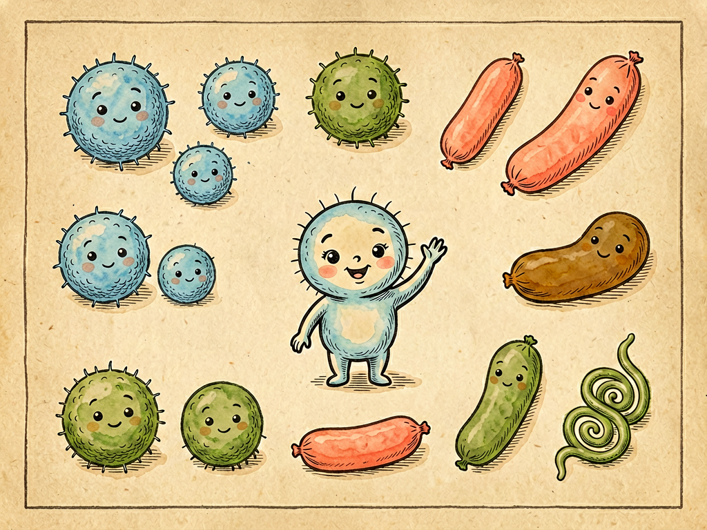

# 《灰尘的旅行》全本插画生成项目

本项目为科普名著《灰尘的旅行》全书 **62 章** 自动生成**出版级无文字插画**，通过本地 DrawThings 软件调用 ERNIE Image Turbo 1.0（8-bit S）模型批量产出，可直接嵌入对应 Markdown 章节用于正式出版。

> **目标读者**：10–20 岁青少年  
> **画面风格**：1950 年代中国经典少儿科普读物插画，丰子恺式木刻淡彩画，米黄色纸张质感  
> **核心原则**：纯图像叙事，**零文字 / 零符号**，严禁任何标注，所有信息由画面形象传达

---

## 一、项目结构

```
灰尘的旅行_副本/
├── README.md                              # 本说明文档
├── generate_illustrations_v2.py           # 批量生成主脚本
├── chapters_v2.json                       # 全书62章配置（标题 / 文件名 / 中文prompt）
├── images/                                # 生成结果（62张出版级插画，PNG）
│   ├── part1-ch01-bacteria-names.png
│   ├── part1-ch02-bacteria-habitats.png
│   ├── ...
│   └── part3-ch31-dreams.png
├── 灰尘的旅行-第一部-01-我的名称.md       # 已自动嵌入对应插画
├── 灰尘的旅行-第一部-02-我的籍贯.md
├── ...
└── 灰尘的旅行-第三部-31-梦幻小说.md
```

| 文件 | 作用 |
|---|---|
| `generate_illustrations_v2.py` | 批量调用 DrawThings API、下载图片、插入 Markdown |
| `chapters_v2.json` | 每章的标题、PNG 文件名、对应 Markdown、中文 prompt |
| `images/` | 存放最终生成的 62 张插画 |
| `灰尘的旅行-*.md` | 章节正文，已在 `## <章名>` 与 `### 📍 本章导航` 之间自动居中插入插画 |

---

## 二、环境准备

### 1. 启动 DrawThings 并开启 API

1. 打开本机 DrawThings（已安装并加载 `ernie_image_turbo_i8x.ckpt` 模型）。
2. 在 DrawThings 设置中**开启 API Server**（默认端口 `7860`）。
3. 确认 API 可访问：

```bash
curl -s http://192.168.2.128:7860/sdapi/v1/txt2img \
     -H "Content-Type: application/json" \
     -d '{"prompt":"test","steps":1,"width":64,"height":64}' \
     -m 10 | head -c 200
```

返回一段 JSON 且 `images` 字段非空即表示就绪。  
本项目默认 API 地址为 `http://192.168.2.128:7860`，可在 `generate_illustrations_v2.py` 顶部的 `API_URL` 修改。

### 2. 安装 Python 依赖

```bash
pip3 install requests
```

> 本项目仅依赖 `requests` 与标准库 `pathlib / json / re / base64`。

---

## 三、配置说明（chapters_v2.json）

每一章的 JSON 结构如下：

```json
{
  "title": "菌儿家族图鉴——我的名称",
  "file": "part1-ch01-bacteria-names.png",
  "markdown_file": "灰尘的旅行-第一部-01-我的名称.md",
  "prompt": "第一人称视角的细菌自我介绍图鉴，画面中心是一个可爱拟人化的小细菌（菌儿）正在向读者鞠躬打招呼……"
}
```

| 字段 | 含义 |
|---|---|
| `title` | 章节标题（也是 Markdown 中图片 alt 文本） |
| `file` | 生成的 PNG 文件名（输出到 `images/`） |
| `markdown_file` | 对应要插入图片的 Markdown 文件 |
| `prompt` | **中文**画面描述，要求贴合章节核心内容 |

### Prompt 编写规范

为确保 10–20 岁读者**主题准确、形象具体、画面干净**，编写 prompt 时请遵守：

1. **中文撰写**——ERNIE Image Turbo 1.0 对中文理解显著优于英文。
2. **聚焦情节**——一句话点出该章最核心的画面场景或科普对象。
3. **形象具体**——明确人物 / 物体 / 场景的形象特征，避免抽象表述。
4. **现实逻辑**——严格符合现实科学规律，不可出现违背物理或生物常识的设定。
5. **适配年龄**——形象亲切可爱，避免恐怖、血腥、变形、惊悚元素。
6. **禁止文字**——画面中**绝对不能**出现任何文字、字母、数字、符号、标注线、对话框、水印、签名。
7. **纯画面叙事**——所有信息通过构图、动作、场景、表情传达。

---

## 四、风格预设与生成参数

`generate_illustrations_v2.py` 顶部已固化两段共用文本与一套最优参数，**禁止随意改动**。

### 1. 风格预设（STYLE_PRESET）

```text
经典少儿科普读物插画，1950年代复古科学教科书风格，丰子恺式木刻淡彩画，米黄色纸张质感。
适合10-20岁青少年阅读，形象生动具体，场景真实合理，严格遵循现实科学逻辑。
画面中心主题明确突出，构图清晰，叙事性强，用画面讲故事，不需要任何文字解释。
画风：手绘线条清晰，色彩柔和温暖，人物形象可爱亲切，不恐怖，造型准确。
色彩：暖米色调背景，搭配天蓝色、草绿色、赭石色、珊瑚色等柔和自然色彩，整体和谐统一。
极高品质，画面干净，艺术感强，教育性与艺术性兼备，正式出版物质量。
【绝对禁止】画面中出现任何文字、数字、字母、符号、标签、框线、边框、标注线、气泡、签名、水印、标志，完全没有任何文字，所有信息通过画面形象表达。
```

### 2. 负向提示词（NEGATIVE_PROMPT）

```text
文字，中文，英文，日文，韩文，任何文字，字体，书法，数字，符号，标签，标题，字幕，签名，水印，logo，
乱码，胡写乱画，像文字的涂鸦，假文字，无意义笔画，
对话框，思想泡泡，方框，边框，标注线，指向物体的线条，
照片写实，3D渲染，CGI，日式动漫，丑陋，变形，模糊，低质量，扭曲，多手指，恶心，恐怖，血腥，
霓虹色，亮光塑料质感，现代赛博风格，抽象艺术，多余元素
```

### 3. 生成参数（针对 ERNIE Image Turbo 1.0 8-bit S 验证通过）

| 参数 | 取值 | 说明 |
|---|---|---|
| API | `http://192.168.2.128:7860/sdapi/v1/txt2img` | DrawThings 文生图端点 |
| `prompt` | 风格预设 + 内容 prompt | 自动拼接 |
| `negative_prompt` | 见上 | 强烈抑制文字、恐怖、3D 写实等 |
| `steps` | `10` | Turbo 模型最优步数 |
| `width` × `height` | `1024 × 768` | 出版级 4:3 横版高清 |
| `guidance_scale` | `2.5` | 兼顾创造性与主题匹配度 |
| `sampler` | `"UniPC Trailing"` | 速度与质量最优平衡 |
| `seed` | `-1`（随机） | 也可在 JSON 中为单章指定固定种子 |
| `timeout` | `600` 秒 | 单图最长等待时间 |

---

## 五、批量生成步骤

### 第 1 步：进入项目目录

```bash
cd /Users/liyj6/Documents/Workspace/灰尘的旅行_副本
```

### 第 2 步：执行生成

- **增量模式**（已存在的 PNG 自动跳过）：

```bash
python3 generate_illustrations_v2.py chapters_v2.json
```

- **覆盖重生成**（强制重画全部 62 张）：

```bash
python3 generate_illustrations_v2.py chapters_v2.json --overwrite
```

### 第 3 步：观察进度

运行时会按以下格式输出：

```
🚀 开始生成 62 章出版级插画...

进度: 1/62
============================================================
📖 菌儿家族图鉴——我的名称
============================================================
  ✓ 生成完成: part1-ch01-bacteria-names.png (1499KB)
  ✓ 已插入到: 灰尘的旅行-第一部-01-我的名称.md
...
✅ 全部完成！成功 62/62 章
```

### 第 4 步：核对结果

```bash
ls images/ | wc -l           # 应为 62
du -sh images/               # 总大小约 90 MB 左右
```

> 单张图平均耗时约 1–2 分钟，**全书 62 章约 1.5–2 小时**可在本地完成。

---

## 六、自动化做了什么

`generate_illustrations_v2.py` 内部会按顺序为**每章**执行：

1. **跳过判定**——若 `images/<file>` 已存在且未传 `--overwrite`，则跳过该章。
2. **拼接 prompt**——`STYLE_PRESET + "\n\n内容：" + chapter["prompt"]`。
3. **调用 API**——`POST /sdapi/v1/txt2img` 获取 base64 图像。
4. **落盘 PNG**——写入 `images/<file>`。
5. **插入 Markdown**——将图片以居中 div 形式插入到 `## <章名>` 与 `### 📍 本章导航` 之间。
6. **容错**——任意一步异常，仅打印错误并继续后续章节，不中断整批任务。

插入到 Markdown 的代码片段为：

```html
<div align="center">



</div>
```

---

## 七、单独重画某一章

如需重画单章（例如 `part2-ch05-smell`）：

```bash
rm images/part2-ch05-smell.png
python3 generate_illustrations_v2.py chapters_v2.json
```

脚本会跳过其他已存在的 PNG，只为这一章重新生成并重新插入 Markdown。

---

## 八、常见问题（FAQ）

| 问题 | 排查与解决 |
|---|---|
| `Connection refused` | DrawThings 未启动或 API 端口未开；检查 `192.168.2.128:7860` 是否可访问。 |
| 一直卡在某一张 | 单章超过 600 秒会被 `timeout` 终止；可在脚本中调大 `timeout`，或重跑该章。 |
| 出现乱码 / 文字 | 模型偶发情况，可针对该章 prompt 加强"画面中没有文字"等表述后 `--overwrite` 单章重画。 |
| 主题偏差 | 改进对应章节的 `prompt`，让画面描述更具体、更贴合该章情节，再覆盖重画。 |
| JSON 语法错误 | 切勿手动编写 `chapters_v2.json`；若需新增章节，推荐用 Python `json.dump(..., ensure_ascii=False)` 重新生成。 |
| 想换分辨率 | 同步修改 `generate_illustrations_v2.py` 中 `width` / `height` 与各 Markdown 中的相对路径（一般无需改动，路径按文件名前缀走）。 |

---

## 九、再次扩展的提示

* 想追加新章节：往 `chapters_v2.json` 追加新元素，重跑脚本即可（增量模式会跳过已生成图）。
* 想更换画风：修改 `STYLE_PRESET` 与 `NEGATIVE_PROMPT` 即可，但务必保持"零文字"约束。
* 想固定随机性以复现某张图：在 `chapters_v2.json` 的该章对象里加上 `"seed": <整数>`。

---

## 十、版本记录

| 版本 | 内容 |
|---|---|
| v3.0 | 出版级中文 prompt 体系，ERNIE Image Turbo 1.0 (8-bit S) 验证，62 章 100% 成功。 |

