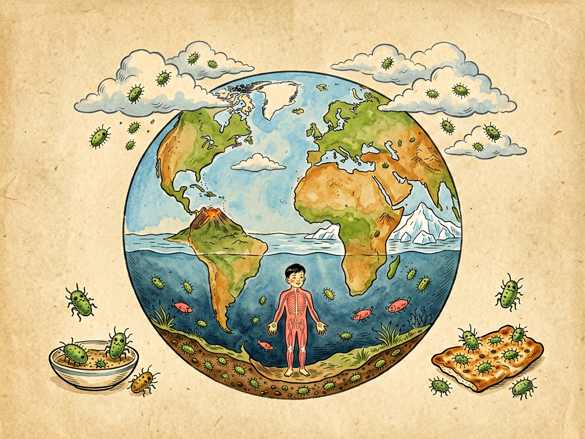

## 第二章 我的籍贯

---

### 📍 本章导航
**核心主题**：细菌的"老家"在哪里？它们如何成为地球最成功的"环球旅行家"  
**你将发现**：
- 细菌是地球最古老的居民，比人类早出现35亿年
- 水、土壤、空气都是细菌的家园，土壤是它们的"超级大本营"
- 细菌的旅行本领——水陆空都能去，遍布地球每一个角落
- "本地菌"和"外来菌"的区别，以及"水土不服"的科学原理
- 极端环境中生存的"超级细菌"——生命的极限远超想象

**阅读建议**：读完这一章，你再闻雨后泥土的芬芳时，会有完全不一样的感受。

---

### 🖋️ 经典原文

上一章我报了自己的姓名，这一章该说说我的籍贯了。

你们人类籍贯都写在户口本上，什么省什么县什么村，写得清清楚楚。可我们菌儿的籍贯怎么说呢？说出来吓你们一跳：**地球有多大，我的家就有多大。**

实话告诉你们，我们菌儿是地球上最古老的居民。科学家在岩石里找到了我们35亿年前的老祖宗留下的痕迹，那时候地球上连氧气都没有，更别说什么恐龙、猛犸象、你们人类了。如果把地球46亿年的历史压缩成一天24小时，那么：
- 凌晨0点0分，地球诞生；
- 凌晨4点左右，第一批细菌在原始海洋里出现了；
- 上午快11点，才出现了第一批进行光合作用的蓝细菌；
- 晚上8点多，海洋里才出现多细胞生物；
- 晚上11点刚过，恐龙登上舞台，11点40分就灭绝了；
- 最后30秒，你们人类才姗姗来迟。

所以啊，论资排辈，我们菌儿是地球的老寿星，你们人类还得叫我们一声"老祖宗"呢。

说到我的老家，那可就多了。按环境分，我们有四大籍贯：

**第一籍贯：水——生命的摇篮**

水是我们菌儿最古老的故乡。从原始海洋到今天的江河湖海，从冰山雪峰到地下暗河，只要有水的地方就有我们。你们印象里水是"干净"的？不对，一滴不流动的池塘水里就藏着几百万个我的同类，就算是看上去清澈见底的山泉水，里面也有不少耐冷的细菌住着。当然了，大海更是我们的乐园，一毫升海水里能有上万个细菌，整个海洋里的细菌总重量，比所有鱼类加起来还重得多！

**第二籍贯：土壤——超级大本营**

如果说水是我们的故乡，那土壤就是我们的"超级大城市"。一克肥沃的菜园土里，能有几亿到几十亿个菌儿！这里面热闹极了：有需要氧气的好氧菌住在表层，有怕氧气的厌氧菌躲在深处，有会固定氮气的根瘤菌，有分解枯枝落叶的腐生菌，有产生抗生素的放线菌——就是你们下雨天闻到的那股"泥土香"，那是放线菌产生的"土腥素"（geosmin）的味道。所以啊，你们喜欢的雨后泥土芬芳，其实就是我们菌儿散发出来的"体味"。

**第三籍贯：空气——旅行的通道**

空气其实不是我们久居的地方，因为空气里干燥、营养少，还有紫外线杀菌，待久了活不了。但空气是我们最重要的"高速公路"——我们附着在灰尘、飞沫、花粉、皮屑上，借着风力可以飘到几千公里之外。你们每一次呼吸，都在和我们菌儿"擦肩而过"。

**第四籍贯：生物体内——共生的家园**

从昆虫到鲸鱼，从植物根系到你们人类的肠道，都是我们菌儿的"殖民地"。你们的皮肤上住着常住菌，呼吸道里有常住菌，肠道里更是我们的"繁华闹市"。这些"常住居民"和你们一起生活了几十万年，是你们的"老邻居"。

别以为我们菌儿一辈子待在一个地方不动，我们可都是"旅行家"，迁徙的本领大得很：
- **水路旅行**：一江春水向东流，我们顺着水流漂遍大江南北；
- **空中旅行**：灰尘、飞沫是我们的"飞机票"，大风一吹就能翻山越岭，甚至跨越大洋；
- **生物航班**：沾在昆虫脚上、鸟的羽毛上、动物的皮毛上，跟着它们走南闯北；
- **人类专列**：你们人类的鞋底、衣物、行李、食品，更是把我们带到了世界各地——从北极的科考站到南极的冰盖，哪一处没有我们菌儿的身影？

说到籍贯，这里面还有个很重要的道理：**本地菌和外来菌不一样。**

在一个地方住久了的菌，我们叫"原籍菌"或者"常住菌"。比如你们肠道里的双歧杆菌、乳酸菌，皮肤上的葡萄球菌，它们和你们一起生活了世世代代，不仅不害你们，还帮你们消化食物、训练免疫系统、阻挡坏菌入侵——这就是"菌群屏障"，就像你们村子里的"联防队"，外人来了就群起而攻之。

要是来了"外来菌"，也就是外地来的"生面孔"，那情况就不一样了。本地菌不认识它们，它们也不守规矩，就可能在你们身体里捣乱，让你们生病。你们出门旅行时常常"水土不服"，上吐下泻，很多时候就是因为喝了外地的水、吃了外地的食物，接触到了当地的细菌，你的肚子里的"老住户"和"新来的"打起来了！

当然啦，也不是所有外来菌都是坏的——比如你们喝酸奶补充的"益生菌"，就是 intentional（有意）请来的"客人"，只要数量够、种类对，它们会帮你维护肠道秩序。

最神奇的是我们菌儿家族里的"极端生存专家"，它们把"籍贯"安在了你们想都想不到的地方：
- **嗜热菌**住在70-80℃的热泉里，有的甚至能在100℃以上的海底火山口活得悠哉游哉；
- **嗜冷菌**在南极零下几十度的冰层里照样繁殖；
- **嗜盐菌**在饱和盐水的盐湖里，也就是你们腌咸菜的盐水浓度下，快乐地生活；
- **嗜酸菌**在pH值小于1的酸性矿水里，也就是比醋还酸的环境中，安然无恙；
- **嗜压菌**在几千米深的海底，承受着几百个大气压的压力，就像一根手指头上站了一头大象，人家照样没事。

你看，生命的极限是不是比你想象的宽得多？这就是我们菌儿——地球最古老、最顽强、分布最广的居民。地球的每一个角落，不管是高空还是深海，是火山还是冰原，几乎都有我们的身影。

---

> 📜 **科学史话：来自35亿年前的"签名"**
>
> 人类认识到细菌的古老，是最近几十年的事。1980年代，科学家在澳大利亚西部的岩石中发现了一种叫"叠层石"的结构——那是35亿年前蓝细菌（cyanobacteria，过去叫蓝藻）留下的"生物礁"。
>
> 这些小小的蓝细菌是地球历史上最了不起的"改造者"：它们发明了光合作用，开始往大气里释放氧气。这个被称为"大氧化事件"的过程发生在约24亿年前，氧气毒死了当时绝大多数厌氧生物，却为后来所有需要氧气的高等生物——包括我们人类——铺平了道路。
>
> 更有意思的是，根据"内共生学说"（endosymbiotic theory），我们细胞里负责能量生产的线粒体，和植物细胞里负责光合作用的叶绿体，其实都是远古时期被大细胞"吞进去"的小细菌！它们和宿主细胞形成了共生关系，一起生活了十几亿年，最终变成了细胞里不可或缺的"细胞器"。
>
> 换句话说——你身体里的每一个细胞，都住着古代细菌的后代。从这个意义上说，我们菌儿不仅是地球的元老，还是所有复杂生命的"老祖宗"。

---

> 🔬 **科学更新：PCR技术与极端细菌的诺贝尔奖级贡献**
>
> 本章中提到的嗜热菌，不仅是生命的奇迹，还带来了一项改变整个生物学的技术——PCR（聚合酶链式反应）。
>
> 1983年，科学家凯利·穆利斯（Kary Mullis）想发明一种快速复制DNA的方法，但有个难题：DNA复制需要高温，而普通的酶一加热就变性失活了。1976年，人们从美国黄石国家公园的热泉中发现了一种嗜热菌——*Thermus aquaticus*（水生栖热菌），它能在70-80℃的高温下生存，它的DNA聚合酶（Taq酶）自然也就耐热。
>
> 正是从这种嗜热菌里提取的Taq酶，让PCR技术成为可能。有了PCR，我们才能做亲子鉴定、犯罪现场DNA比对、新冠病毒核酸检测、遗传病筛查……这项技术彻底改变了医学、法医学、考古学，穆利斯也因此获得了1993年的诺贝尔化学奖。
>
> 谁能想到，黄石公园热泉水里的一只小小细菌，竟然能给人类带来这么大的贡献？这就是基础研究的魅力——你永远不知道今天在显微镜下看到的小东西，明天会如何改变世界。

---

> 🌍 **现实连接：为什么不要滥用消毒剂？**
>
> 理解了"原籍菌"和"外来菌"的区别，你就明白为什么现在医生和科学家都在呼吁"不要过度消毒"了：
>
> - 我们的皮肤、呼吸道、肠道里的"常住菌"是经过几十万年进化筛选出来的"好邻居"，它们帮我们阻挡致病菌、训练免疫系统。如果天天用消毒液洗手、用消毒湿巾擦桌子、往空气里喷消毒剂，这些"好邻居"也会被一起杀死，等于自毁长城。
> - 过度使用抗生素也是一个道理：抗生素不分好坏，杀致病菌的同时也会杀肠道里的有益菌，造成"菌群失调"，反而更容易腹泻、过敏、免疫力下降。
>
> "卫生假说"（hygiene hypothesis）认为：现代社会过敏、哮喘、自身免疫病越来越多，一个重要原因就是孩子小时候接触的微生物太少，免疫系统没有得到足够的"训练"，就容易"认错人"，把花粉、食物甚至自己的身体组织当成敌人来攻击。
>
> 当然，这不是说不要讲卫生——饭前便后要洗手、食物要煮熟、不吃不干净的东西，这些都是对的。我们反对的是"无菌洁癖"：接触了泥土就紧张，碰了宠物就反复消毒，恨不得把生活环境变成一个无菌实验室。记住：**卫生是"有序"，不是"无菌"。**

---

### 💬 读后思考与讨论

1. 如果把地球46亿年历史压缩成一天24小时，人类只在最后30秒出现。这个比喻让你对时间和生命有什么新感受？
2. 你喜欢雨后泥土的味道吗？现在知道这是放线菌产生的气味，你对这种味道的感受有变化吗？
3. 什么是"水土不服"？结合本章内容，想想旅行时怎样可以减少水土不服？
4. "卫生假说"认为小时候接触微生物少容易过敏，你同意这个说法吗？生活中哪些做法可能是"过度消毒"？
5. 极端细菌在沸水里、盐块里、强酸里都能活，这让你对地外生命的可能性有什么想象？

### 🔗 关联阅读
- 上一章：《我的名称》→ 认识了细菌的大家族
- 下一章：《我的家庭生活》→ 看看细菌是怎么"吃饭"、怎么"生孩子"的
- 第三部第十七章：《土壤世界》→ 深入了解土壤这个细菌的超级大本营
- 第二部第十二章：《土壤革命》→ 了解细菌如何改造土壤，支撑整个农业
