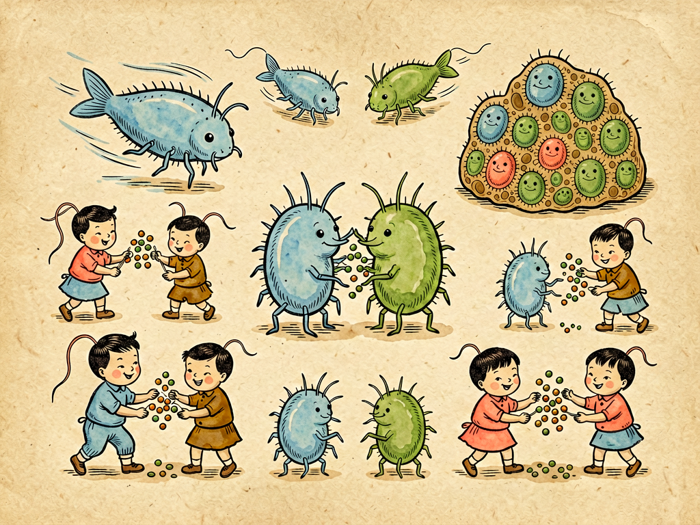

## 第三章 我的家庭生活

---

### 📍 本章导航
**核心主题**：细菌怎么吃饭、怎么生孩子、怎么组成"社会"——微观世界的生存智慧  
**你将发现**：
- 细菌惊人的繁殖速度——20分钟就能当"妈妈"
- 细菌不仅会"克隆"自己，还会"结婚"交换基因
- 细菌什么都"吃"——从糖到石油，从塑料到放射性物质
- 细菌之间会"打仗"——抗生素就是它们的化学武器
- 细菌会"抱团"形成生物膜，这是它们最难对付的"堡垒"

**阅读建议**：这一章特别有趣，你会发现微观世界和人类社会有惊人的相似之处。

---

### 🖋️ 经典原文

说完了姓名和籍贯，今天来聊聊我们菌儿的家庭生活。

你们可别以为我们只是一个个孤零零的小点点——我们也有家，也有口，也有老，也有少，也有亲戚朋友，也有邻里纷争，显微镜下一看，那才是一片热闹的天地呢！

先说说我们最了不起的本事——**生孩子**。

我们菌儿生孩子，不用找对象，不用谈恋爱，简单得很：一个母细胞先把自己的遗传物质DNA复制一份，然后身子从中间慢慢拉长，最后"咔哒"一下，一分为二，变成两个一模一样的子细胞。这两个子细胞长到一定大小，又各自一分为二，变成四个，四个变八个，八个变十六个……

这种生殖方式叫**二分裂**（binary fission），说起来是"克隆"，效率可高得吓人。就拿我最常见的亲戚大肠杆菌来说吧，条件合适的时候，20分钟就能分裂一次。你算算：
- 0分钟：1个菌儿
- 20分钟：2个
- 40分钟：4个
- 1小时：8个
- 2小时：64个
- 12小时后：680多亿个
- 24小时后：**47万亿个**！

这个重量加起来大约有4700吨——当然啦，现实中不可能有这么多营养供我们无限繁殖，不然几天之内整个地球都被菌儿盖满了。但这个数字足以说明，为什么传染病一旦失控会那么可怕——**只要给我们一点营养和时间，我们就能从一个变成千军万马。**

你们肯定要问了：一直这样"克隆"自己，子孙后代都一模一样，那我们菌儿怎么适应环境变化？怎么进化？

别急，我们也有"婚姻"，也会"谈恋爱"——只不过这个过程和你们人类不太一样。

当两个菌儿"看对眼"了，它们会靠近彼此，其中一个伸出一根细细的管子，叫**性菌毛**（pilus），连到另一个身上。然后，供体菌会把自己的一段DNA通过这根管子送过去，受体菌拿到新基因，就拥有了新的本事——比如耐抗生素的能力、分解新食物的能力。这个过程叫**接合**（conjugation）。

除了"结婚"，我们还有别的办法交换基因：有时候死了的菌儿留下的DNA片段，会被活着的菌儿捡走用，这叫**转化**；还有一种叫噬菌体的病毒，会不小心把这个菌的DNA带到那个菌身上，像个"基因快递员"，这叫**转导**。

这三种方式加在一起，叫**水平基因转移**（horizontal gene transfer）——意思是基因不用等生孩子传下去，邻居之间就能直接"共享"。这可不得了！比如一个细菌突变出了耐药基因，很快就能通过接合传给周围其他细菌，甚至传给别的菌种。你们人类现在最头疼的"超级细菌"，就是这么来的。

说完了生娃，再说说**吃饭**。

我们菌儿家族最大的本事之一，就是"不挑食"——什么都能吃：
- **自养菌**是"自己做饭"的好手：蓝细菌靠光合作用，用阳光、二氧化碳和水制造有机物，和植物一样；还有些化能自养菌靠氧化岩石里的硫、铁获得能量，不用阳光也能活，海底火山口的生态系统全靠它们撑着；
- **异养菌**是"消费者"，靠分解现成的有机物过日子，这一类最多；
- **腐生菌**是大自然的"清洁工"，专门分解动植物的尸体、粪便、枯枝落叶，把它们变回土壤里的养料，没有我们，地球早就被尸体堆满了；
- **寄生菌**是"食客"，直接从活的动植物身上获取营养，让人生病的致病菌大多属于这一类；
- **共生菌**是"好合伙人"，比如根瘤菌住在豆科植物根上帮着固氮，肠道菌帮你们消化食物合成维生素，大家互帮互助，互惠互利。

更夸张的是，有些菌儿的食谱超出你们想象：有的能"吃"石油，有的能分解塑料，有的能在核废料里靠"吃"放射性物质活下来——科学家们现在正在研究用这些菌儿来治理环境污染呢！

家里孩子多了，自然就会有矛盾。我们菌儿家庭也不是和和气气的，"邻里"之间经常打仗：

第一种仗是**抢地盘**。先到的细菌会分泌信号分子，告诉后来的"这里已经有人了"，还会快速繁殖占满位置，让别人没法落脚。这叫**群体感应**（quorum sensing）——我们能通过化学信号感知周围有多少"自己人"，人够多了就统一行动，比如一起产生毒素、一起形成生物膜。

第二种仗是**化学战**。有些菌会产生抗生素——就是你们用来治病的那些东西——专门杀死或抑制其他细菌，抢占地盘和食物。你们知道的青霉素，是青霉菌分泌的；链霉素、庆大霉素、红霉素，最初都是放线菌或真菌制造出来的"化学武器"。说白了，抗生素就是我们菌儿之间打仗用的"生化武器"。

第三种仗更厉害，是**捕食**。有一种叫**蛭弧菌**的，个头比其他细菌小一点，像猎豹一样专门追着别的细菌跑，追上了就钻进人家体内，把宿主的内容物吃空、繁殖，然后破壳而出再找下一个猎物——简直是细菌界的"微型杀手"。

当然，打架归打架，合作的时候也不少。很多时候我们会**抱团取暖**——细菌们分泌出黏糊糊的胞外多糖，把大家粘在一起，形成一层一层的复杂结构，这叫**生物膜**（biofilm）。你们牙齿上的牙菌斑、下水道里的黏泥、医用导管上的感染源，都是生物膜。

生物膜可厉害了，里面的细菌分工合作：外层的负责找食物，内层的负责繁殖，有的负责生产"黏合剂"，有的负责释放毒素。生物膜里的细菌比单个细菌耐药100-1000倍，因为抗生素很难渗透进去，这也是为什么很多慢性感染、医院内感染那么难根治——它们都躲在生物膜这个"堡垒"里。

最后说说我们怎么**面对死亡**。

条件好的时候，我们拼命分裂繁殖；条件不好了怎么办？我们有绝招——**芽孢**（endospore）。当营养耗尽、环境恶劣时，有些细菌（比如炭疽杆菌、破伤风杆菌）会在细胞内部形成一个坚硬的"小蛋"，把自己的遗传物质和必需的酶包在里面，外层是厚厚的、坚不可摧的壳。

这个芽孢可厉害了：它能扛住100℃的开水煮几个小时，能在干燥环境里活几十年、上百年，能抗辐射、抗紫外线、抗化学消毒剂，甚至能在太空真空环境里存活！等环境变好了，水分营养都有了，芽孢就"发芽"，重新变成一个正常的细菌。

你们看，我们菌儿的家庭生活是不是也挺丰富多彩？有生有死，有战有和，有单打独斗也有抱团取暖。我们虽然小，可我们在地球上活了35亿年，靠的就是这套灵活多变的生存本事。

---

> 📜 **科学史话：青霉素——一个"偶然"改变世界**
>
> 1928年，英国细菌学家亚历山大·弗莱明（Alexander Fleming）在实验室培养葡萄球菌。那天他忘了盖培养皿的盖子，就出去度假了。等他回来，发现培养皿上长了一块青霉菌，而青霉菌周围的葡萄球菌都被杀死了——出现了一个"透明圈"。
>
> 弗莱明没有放过这个偶然现象，他研究后发现青霉菌能产生一种杀死细菌的物质，他把它命名为"青霉素"（penicillin）。但当时弗莱明没有办法提纯青霉素，这个发现被冷落了十几年。
>
> 直到二战期间，澳大利亚病理学家弗洛里（Howard Florey）和德国生物化学家钱恩（Ernst Chain）找到了大规模提纯青霉素的方法。这种"神药"一下子把二战伤员的细菌感染死亡率从80%降到了不到10%，无数人因此活了下来。
>
> 1945年，弗莱明、弗洛里、钱恩三人分享了诺贝尔生理学或医学奖。弗莱明在获奖演讲中警告说：如果滥用青霉素，细菌很快就会产生耐药性。
>
> 不幸的是，他的预言成真了——仅仅几十年后，耐药菌就成了全球公共卫生的巨大威胁。

---

> 🔬 **科学更新：细菌的"社会性生活"与群体感应**
>
> 在高士其先生的时代，科学家还认为细菌是各自为战的"孤独个体"。但最近三十年的研究彻底改变了这个看法——细菌其实是高度社会化的生物，它们能"说话"，能"计数"，能协调行动。
>
> 这种能力就叫**群体感应**（quorum sensing）：细菌会持续向周围分泌小的信号分子，同时也在"听"其他细菌发出的信号。当周围细菌越来越多，信号分子浓度达到一个阈值，所有细菌就会"知道"——"我们人够了，可以行动了！"然后它们会同时启动特定基因，统一行动。
>
> 比如：
> - 发光细菌会等到群体密度足够高时一起发光，在乌贼体内形成"发光器官"帮乌贼照明；
> - 致病菌会等到数量足够多时才一起释放毒素——因为单个细菌释放毒素根本起不了作用，等"兵力集结"再进攻才能一举打垮宿主的免疫系统；
> - 生物膜的形成也是由群体感应控制的。
>
> 现在科学家正在研究"群体感应抑制剂"——与其用抗生素直接杀死细菌（这样会筛选耐药性），不如"干扰它们的通讯"，让它们"不知道"什么时候该进攻、什么时候该抱团。这种策略可能成为对抗耐药菌的新武器。
>
> 细菌远比我们想象的更聪明——它们不是低等的"小虫子"，而是有组织、有策略的社会生物。

---

> 💡 **动手试一试：观察酸奶里的乳酸菌**
>
> 想亲眼看看细菌家庭吗？用这个简单的方法就能实现：
>
> **材料**：一小杯原味酸奶、显微镜（没有的话可以用手机加放大镜自制简易显微镜）、载玻片（或干净的玻璃片）、盖玻片（或透明塑料片）
>
> **步骤**：
> 1. 用干净的牙签沾一点点酸奶，在载玻片上涂成薄薄一层；
> 2. 轻轻盖上盖玻片（不要有气泡）；
> 3. 放在显微镜下，先用低倍镜找到位置，再换高倍镜观察。
>
> 你会看到什么？无数细细短短的、像小棍子一样的**乳酸杆菌**，有的还在慢慢扭动！它们有的单个待着，有的连成一串，有的聚成一小团——这就是一个活生生的细菌家庭！
>
> 如果你仔细看，还能看到链球菌——那是圆球形的细菌，像珠子一样连成一串。
>
> 你喝下去的每一口酸奶里，都有几十亿个这样的小生命在活动哦！

---

### 💬 读后思考与讨论

1. 细菌20分钟就能分裂一次，24小时理论上能产生47万亿个后代。但现实中为什么细菌没有铺满整个地球？是什么限制了它们的数量？
2. 细菌通过"接合"交换基因的能力，让耐药性传播得特别快。这对你理解"抗生素不能随便吃"有什么新启发？
3. 细菌会"打仗"也会"合作"，生物膜就是它们抱团的产物。想想看，生活中哪些地方容易长生物膜？怎么预防？
4. 弗莱明偶然发现了青霉素，但他没有忽视"异常现象"。你觉得科学发现中"偶然"和"有准备的头脑"哪个更重要？
5. 细菌能"吃"石油、分解塑料，你能想象用细菌还能解决哪些环境问题吗？

### 🔗 关联阅读
- 上一章：《我的籍贯》→ 知道了细菌住在哪里
- 下一章：《我的形态》→ 看看细菌都长什么样子，它们有哪些"装备"
- 第二部第十五章：《毒的分析》→ 了解细菌产生的毒素和耐药性问题
- 第三部第一章：《细胞的不死精神》→ 了解细胞分裂的深层意义
