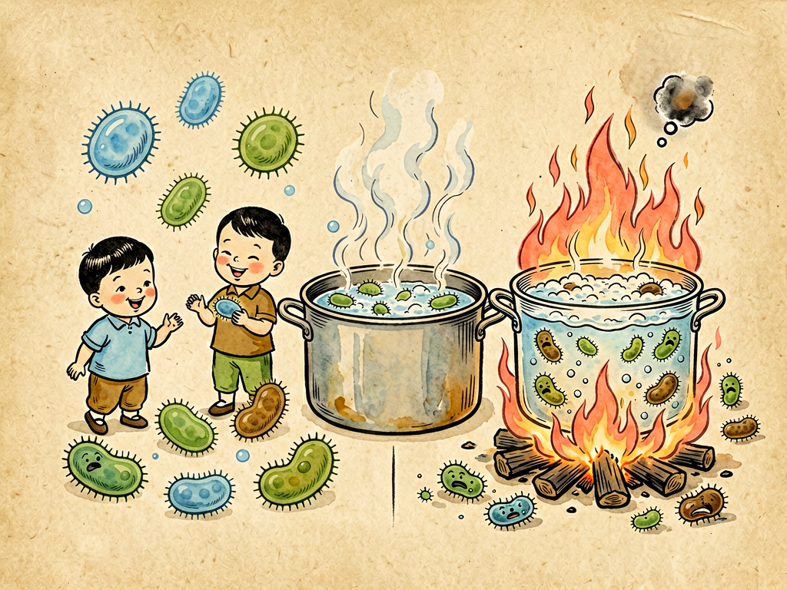

## 第四章 无情的火

---

### 📍 本章导航
**核心主题**：高温——细菌最古老的天敌，人类文明的第一道卫生防线  
**你将发现**：
- 为什么火是细菌最害怕的东西？加热杀菌的原理是什么
- 几万年前的"熟食革命"如何改变了人类演化
- 为什么说"煮开了"不一定等于"安全了"？芽孢有多顽强
- 巴氏消毒、高压灭菌——人类用火技术的进化
- 厨房食品安全的"温度红线"——多少度能杀菌，多少度适合细菌繁殖

**阅读建议**：读完这一章，你家厨房剩菜怎么放、牛奶怎么选，心里就有数了。

---

### 🖋️ 经典原文

这一章，菌儿我要含泪说说我最害怕的天敌——火。

火啊，你真是无情！你那几千度的高温，一烧过来，我身体里的蛋白质就变性凝固，细胞膜就融化破裂，遗传物质DNA也烧成焦炭，任你是再厉害的菌儿，也得瞬间灰飞烟灭。

说起来，你们人类能有今天，第一个要感谢的就是火。几十万年前，当第一个猿人拿起被闪电点燃的树枝，当你们学会钻木取火，把猎物放在火上烤熟的时候，你们不知道，你们完成了一场划时代的卫生革命！

在那之前，你们的祖先吃生肉、喝生水，寄生虫、致病菌顺着嘴往肚子里钻，平均寿命只有十几二十岁。学会用火之后呢？食物被加热到70℃以上，绝大多数细菌和寄生虫都被杀死了；熟食不仅更卫生，还更容易消化吸收，你们的肠胃负担减轻了，能吸收更多营养来供养更大的大脑——人类学家说，人类脑容量的扩大，熟食功不可没。是火，让你们从野兽变成了人。

几千年来，你们用火对付我的办法主要有两条路：
第一条路是**烹饪**——把食物做熟。煮、烤、蒸、炸、炒，不管什么做法，只要温度够，就能杀死大部分细菌。这条路上，火是"养命"的；
第二条路是**灭菌**——医疗上、实验室里，用火和高温把所有微生物，包括最顽强的芽孢，统统杀死，不留一个活口。这条路上，火是"救命"的。

但是，火虽然厉害，你们也别高兴得太早——我们菌儿也不是完全没有办法对付火！

第一个绝招是**芽孢**。我上一章提过，有些细菌在环境恶劣的时候会形成芽孢，那东西简直就是穿了"防火铠甲"的休眠体。普通开水100℃，煮几分钟就能杀死大部分细菌，但芽孢能在沸水里活好几个小时！要杀死芽孢，得用**高压蒸汽灭菌锅**，在1.05个大气压下把水温提高到121℃，保持20-30分钟，这才能让芽孢"投降"。医院里的手术器械、注射器、输液器，都必须经过这道关，不然就可能造成感染。

你们知道吗？医院供应室的护士阿姨们有多严格——灭菌完了还要放"指示菌片"，用最耐热的**嗜热脂肪芽孢杆菌**来测试，如果这些菌都死光了，才说明灭菌合格。你看，连杀菌都得用细菌来"试毒"，是不是很有意思？

第二个绝招是我们家族里的**嗜热菌**。这些"老顽固"不仅不怕热，反而觉得热才舒服——它们最适合的生长温度是70-80℃，在100℃的沸水里还能活蹦乱跳！美国黄石国家公园的热泉里，温度高达80多℃，水里照样生活着大量嗜热菌，它们产生的鲜艳色素把热泉染成了五颜六色，像调色盘一样漂亮。

海底火山口附近更夸张，三四百度的高温、几百个大气压、还充满了有毒的硫化氢——你们觉得那是地狱吧？可那里生活着大量嗜热菌，它们靠氧化硫化物获得能量，支撑起了一个不依赖阳光的完整生态系统——有管虫、有蛤蜊、有虾，整个食物链的基础就是这些不怕热的菌儿！

说到火，其实它还有另一面——**适当的温度不仅不杀我们，还帮我们繁殖！**

你们想想，为什么夏天食物容易坏，冬天放好久都没事？因为30-40℃正好是我们大多数细菌最喜欢的温度，在这个"黄金温区"里，我们20分钟就能分裂一次，几小时就能让一碗好饭变成馊饭，让一块鲜肉长出绿毛。冬天温度低，我们繁殖慢，食物自然就保存得久——冰箱就是利用这个原理，把温度降到4℃以下，让我们"冻得不想生孩子"。

所以啊，火是把双刃剑。用得好，它能杀菌、能消毒、能做熟饭；用得不好，比如食物煮得半生不熟、或者煮好了放在温热的环境里太久，反而给我们菌儿提供了"温床"，让我们繁殖得更快！

你们现在科技发达了，把"火"玩出了各种花样：
- **巴氏消毒法**：法国人巴斯德发明的，把牛奶加热到60-70℃保持30分钟，或者72℃保持15秒，杀死结核杆菌、沙门氏菌这些致病菌，但又不会把牛奶煮糊，保留了营养和风味——现在你们喝的巴氏奶就是这么来的；
- **超高温瞬时灭菌（UHT）**：用135-140℃的超高温加热2-3秒，一下把所有细菌包括芽孢都杀死，然后无菌包装，就是那种可以在常温下放半年的盒装牛奶；
- **干热灭菌**：160℃烤2小时，给玻璃器皿、金属工具灭菌；
- **焚烧**：医疗废物、感染性垃圾的最终处理方式，一把火烧个干净，彻底断了我们传播的路；
- **微波加热**：虽然不是直接用火，但本质还是热——微波让食物里的水分子高速振动摩擦产生热量，从里到外一起热，杀菌也挺快。

你看，从远古的篝火到现代的高压灭菌锅、微波炉，人类用火的技术越来越精细，但本质从来没变——用能量换取生命的安全。

我再教你们几条厨房食品安全的"温度红线"，记住了能少拉肚子：
1. **危险温区：10℃-60℃**——食物在这个温度范围里放超过2小时，细菌就会大量繁殖，吃了容易食物中毒；
2. **安全冷藏：4℃以下**——剩菜剩饭快点放冰箱，别等凉透了再放，只要不烫手就可以进冰箱了；
3. **安全加热：70℃以上**——食物中心温度达到70℃以上，才能杀死大部分致病菌；
4. **煮沸≠无菌**——普通开水煮沸1-5分钟能杀死大部分致病菌，但杀不死芽孢，如果是被污染特别严重的水，最好煮沸10分钟以上更安全。

火啊火，你真是让我又爱又恨——爱你给人类带来文明，爱你烤熟了食物让我们也有机会跟着沾光；恨你烧死我们千千万万的同胞，恨你毁了我们的家园。但没办法，这就是生存竞争——你们人类学会用火保护自己，我们也在进化出耐热的本事和芽孢的铠甲。这场战争，从人类点起第一堆篝火开始，已经打了几十万年，还要一直打下去。

---

> 📜 **科学史话：巴斯德与鹅颈瓶实验——一个科学家如何驳倒"自然发生说"**
>
> 19世纪60年代以前，人们还相信"自然发生说"——认为腐肉能自己长出蛆来，肉汤放久了自己会长出细菌，生命可以从没有生命的物质里凭空产生。
>
> 法国微生物学家路易斯·巴斯德（Louis Pasteur, 1822-1895）不相信这个说法。他设计了一个绝妙的实验：把肉汤灌进两个烧瓶里，第一个是普通烧瓶，瓶口竖直朝上；第二个烧瓶的瓶颈被拉成了S形的弯弯曲曲的"鹅颈"。然后他把两个烧瓶里的肉汤都煮沸，杀死里面所有的细菌，然后放凉静置。
>
> 结果呢？普通烧瓶里的肉汤没几天就坏了，长满了细菌；而鹅颈瓶里的肉汤放了四年都没坏！为什么？因为空气能通过鹅颈进入瓶子，但空气中的细菌和灰尘都沾在了S形弯的管壁上，没法进到肉汤里。
>
> 直到四年后，巴斯德把鹅颈瓶的脖子打断，没过多久肉汤就坏了——这就证明，让肉汤变质的细菌不是自己长出来的，而是来自空气里的灰尘！
>
> 这个简单的实验彻底驳倒了流传几千年的"自然发生说"，证明了"生命只能来自生命"（Biogenesis）。巴斯德还发明了巴氏消毒法，发明了狂犬病疫苗，被称为"微生物学之父"。

---

> 🔬 **科学更新：为什么吃"三分熟"牛排不容易拉肚子，吃三分熟猪肉就不行？**
>
> 很多人喜欢吃牛排要三分熟、五分熟，切开里面还是粉红带血的，吃了却很少生病；但如果猪肉、鸡肉这么吃，大概率会拉肚子甚至感染寄生虫。这是为什么？
>
> 秘密就在细菌的"位置"：牛的肌肉组织很致密，细菌主要是在屠宰加工过程中沾到肉的表面，内部几乎是无菌的。所以牛排只要把表面煎熟，杀死表面的细菌，里面哪怕是生的也没关系；
>
> 但猪和鸡不一样——猪容易感染猪肉绦虫、旋毛虫这些寄生虫，鸡肉容易携带沙门氏菌，而且这些寄生虫和细菌可能存在于肉的内部。所以猪肉和鸡肉必须彻底做熟，中心温度达到75℃以上才安全。
>
> 还有一个大家容易犯的错误：很多人觉得"剩菜要放凉了再放冰箱，不然费电还伤冰箱"。这是个老观念！现在的冰箱没那么娇气，食物在室温下放得越久，细菌繁殖越多。正确做法是：剩菜在室温下放不超过2小时，不烫手了就赶紧分装成小份放冰箱，小份能更快冷却。
>
> 另外，冰箱冷藏只能抑制细菌繁殖，不能杀死细菌——冰箱里照样有嗜冷菌在活动，所以剩菜放冰箱也不能超过3天，吃之前一定要彻底加热到滚烫。

---

> 💡 **动手试一试：温度如何影响食物变质？**
>
> 用这个简单的家庭实验，你就能亲眼看到温度对细菌繁殖的影响：
>
> **材料**：三个一样的干净玻璃杯、等量的鲜牛奶（或者煮过的肉汤/米汤）、保鲜膜
>
> **步骤**：
> 1. 把牛奶平均分到三个杯子里，都用保鲜膜盖住杯口；
> 2. 第一杯放在室温下（25-30℃最好，夏天不用空调的房间）；
> 3. 第二杯放在冰箱冷藏室里（4℃左右）；
> 4. 第三杯先煮沸5分钟，盖上保鲜膜，然后和第一杯放在同一个地方；
> 5. 每天观察一次，连续观察3天，看看三个杯子里的牛奶分别有什么变化（有没有凝固、有没有异味、有没有长霉斑）。
>
> **注意**：观察的时候不要直接凑上去闻！也不要喝实验用的牛奶！实验结束后把杯子煮10分钟消毒再清洗。
>
> 你会看到：室温下没煮过的牛奶最先变质；煮过的牛奶变质慢一些；冰箱里的牛奶最晚变质甚至3天都不变质——这就是温度的力量！

---

### 💬 读后思考与讨论

1. 人类学家说"吃熟食帮助人类演化出更大的大脑"，你怎么看这个观点？火给人类还带来了哪些改变？
2. 为什么手术器械必须用高压蒸汽灭菌，而不是用开水煮一煮就行？芽孢的存在给医疗灭菌带来了什么挑战？
3. 家里的剩菜，你家以前是怎么放的？读完这一章，你觉得哪些做法需要改？
4. 海底火山口三四百度的高温下竟然有细菌生存，这对人类寻找地外生命有什么启发？
5. 巴斯德用一个简单的鹅颈瓶实验就驳倒了流传几千年的"自然发生说"，这个故事给你什么启发？科学实验设计的精妙之处在哪里？

### 🔗 关联阅读
- 上一章：《我的家庭生活》→ 知道了细菌会形成芽孢这个"绝招"
- 下一章：《水国纪游》→ 去水世界看看细菌如何在水里旅行
- 第二部第八章：《水的改造》→ 了解自来水是怎么消毒的
- 第三部第十四章：《热的旅行》→ 了解热传递的三种方式
