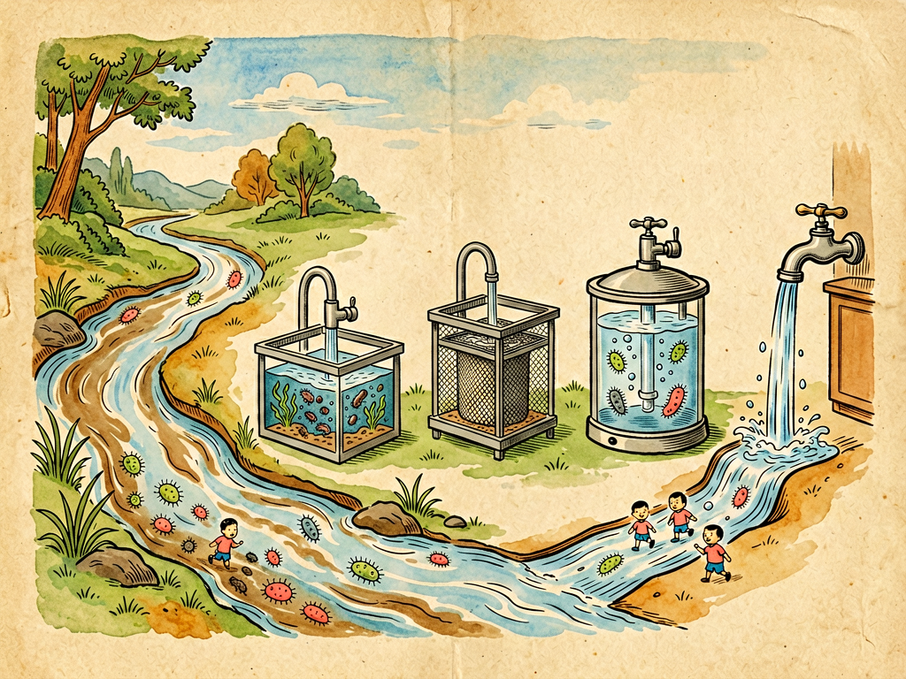

## 第五章 水国纪游

---

### 📍 本章导航
**核心主题**：水——细菌最古老的故乡，水的循环就是菌的旅行  
**你将发现**：
- 一滴水里藏着一个微观世界
- 从高山雪水到深海海底，到处都有细菌的身影
- 为什么自来水要消毒？"大肠菌群"是什么？为什么它是"卫生指示菌"
- 介水传播的疾病有哪些？水怎样让人拉肚子
- 保护水源为什么和每个人都息息相关

**阅读建议**：读完这一章，你再也不会觉得"水就是透明的液体"这么简单了。

---

### 🖋️ 经典原文

说完了火，今天菌儿我带你们去我的第二故乡——水的王国去游历一番。

水啊，真是个好东西！它是生命之源，也是我们菌儿最古老的故乡。最早的细菌就是在35亿年前的原始海洋里诞生的，直到今天，水还是我们最爱的游乐场——水到哪里，我们就到哪里。

你们觉得水是"透明、纯净"的？大错特错！一滴池塘水里，藏着一个热热闹闹的小世界。取一滴看起来很干净的池塘水放在显微镜下：有绿藻在慢悠悠地转，有草履虫甩着鞭毛跑，有变形虫伸着"假腿"爬，还有数不清的细菌像小豆子一样滚来滚去——那就是我的同胞们。

水国的版图可大了，我们一站一站逛：

**第一站：江河溪流**

从高山雪峰融化的雪水开始，那水看起来清冽透亮，其实里面住着耐冷的嗜冷菌，它们在接近0℃的水里照样活得自在。雪水汇成小溪，小溪汇成江河，一路流过森林、流过农田、流过城市，细菌也越来越多。流过城市的河段，一毫升水里可能有几十万个细菌——有土壤里冲下来的腐生菌，有生活污水里的大肠杆菌，有工厂排水带来的各种稀奇古怪的菌。

但江水有自净能力：水流稀释、阳光紫外线杀菌、原生动物捕食细菌，只要污染不超过限度，流一段距离，水又会变干净。可如果污染太严重，超过了自净能力，江水就会变脏变臭。

**第二站：湖泊水库**

湖水不怎么流动，是细菌的"定居点"。夏天如果湖里氮磷太多（就是你们说的"富营养化"），蓝细菌就会疯狂繁殖，在水面形成一层绿油油的像油漆一样的膜，这叫"水华"。有些蓝细菌会产生**微囊藻毒素**，喝了这样的水会伤肝，甚至致癌，连牲畜喝了都可能中毒。

**第三站：海洋**

你们知道海洋有多大吗？地球表面71%是海洋，这是地球上最大的"细菌王国"——一毫升海水里就有几十万个细菌，整个海洋里细菌总重量加起来，比所有鱼类、鲸鱼、虾蟹加起来还重好几倍！

近海因为污染，细菌更多；远海营养少，细菌稀一些；但就算在几千米深的海底，一片漆黑、压力巨大，那里也有细菌——有嗜压菌，靠海洋雪（从海面沉下来的动植物碎屑）生活。最神奇的是海底火山口，三四百度的热泉喷口附近，大量嗜热菌靠氧化硫化物生活，撑起了一整个不依赖阳光的生态系统——有两米长的管虫、盘子大的蛤蜊、没有眼睛的虾，它们的食物基础全是细菌！

**第四站：地下水**

雨水渗到地下，流到岩石缝隙里，就成了地下水。地下水经过层层土壤过滤，细菌本来应该很少，但如果地面有垃圾填埋场、化粪池、化工厂渗漏，细菌和化学污染物也会渗到地下，污染井水。以前很多人觉得井水"干净、纯天然"，直接打上来就喝，其实如果水井离厕所、猪圈太近，很容易被粪便污染，传染痢疾、伤寒。

**第五站：雨水和冰雪**

你们以为雨水是干净的？不对，雨滴在落下来的过程中，会把空气里的灰尘和细菌"洗"到水里，所以雨水里也有菌。极地和高山的冰川里呢？冰里冻着几万甚至几十万年前的古老细菌，科学家从冰芯里把它们挖出来，解冻之后它们竟然还能活！这些"活化石"帮我们研究古代的气候和生命。

逛完了水国的风景，我再给你们讲一个重要的卫生学知识：**怎么判断水干不干净？**

总不能把所有细菌都数一遍吧？科学家想了个聪明办法——找"指示菌"。最常用的指示菌就是**大肠菌群**，主要是大肠杆菌。大肠杆菌本来住在你们人和温血动物的肠道里，正常情况下不致病（当然也有致病的菌株比如O157:H7）。如果水里检测出大肠菌群，说明什么？说明这水被粪便污染了！既然有粪便，那霍乱、伤寒、痢疾这些致病菌也可能在——这就给你们提了个醒："这水不能喝！"

所以大肠杆菌就像水里的"安全哨兵"，它自己不一定是坏人，但它的出现说明坏人可能也来了。自来水厂每天都要检测大肠菌群，确保没有它才能出厂。

你们每天拧开水龙头就有干净的自来水，这背后有一整套灭菌流程呢：
1. 先从江河湖泊或水库取水；
2. 加明矾等混凝剂，让水里的泥沙杂质结成大团沉掉；
3. 经过沙滤池，滤掉更小的颗粒；
4. 最关键的一步：加氯气或二氧化氯消毒，杀死水里的致病菌；
5. 检测合格了，才通过管网送到你们家。

这几步里，任何一步出问题，都可能导致水传播疾病。我给你们数数通过水传染的"坏菌"有哪些：
- **霍乱弧菌**：引起霍乱，上吐下泻严重脱水，几小时就能死人，历史上曾经造成全球大流行，杀死过几千万人；
- **伤寒杆菌**：引起伤寒，持续高烧、肠出血；
- **痢疾杆菌**：引起细菌性痢疾，拉肚子拉脓血便；
- 还有各种病毒——甲肝病毒、诺如病毒、轮状病毒，也都会通过水传播。

还有寄生虫：血吸虫的尾蚴在水里游，一旦有人下水，它就钻进皮肤让人得血吸虫病；阿米巴原虫能引起阿米巴痢疾。

所以啊，我以"菌儿导游"的身份给你们几个忠告：
第一，**不喝生水**，哪怕看起来再清澈的山泉水、溪水、井水，也可能含有致病菌，煮开了再喝；
第二，**野外游泳要小心**，尽量去正规的、经过消毒的游泳池，不要在野外不明水域下水，尤其是有钉螺的水域（容易有血吸虫）；
第三，**喝完的瓶装水不要放太久，桶装水要尽快喝完，净水器滤芯要按时换**——不然净水器反而变成细菌的培养箱；
第四，**不要往水里乱扔垃圾、乱排污水**——你排出去的污水，最后可能通过水循环又回到你喝的水里，污染别人也就是污染自己。

水啊，你是生命的摇篮，你滋养了万物，你载着我们菌儿走遍世界。可你也载着疾病，载着污染。水是一面镜子，照得见人类的文明，也照得见人类的短视。善待水，就是善待你们自己。

---

> 📜 **科学史话：宽街水泵——流行病学的诞生**
>
> 1854年，英国伦敦爆发了霍乱，短短十天就死了500多人。那时候人们还不知道细菌，都以为霍乱是"瘴气"（坏空气）传播的。
>
> 有个叫约翰·斯诺（John Snow）的医生不相信这个说法。他在地图上把所有死亡病例的位置标出来，发现死者几乎都住在伦敦宽街（Broad Street）附近，而且都喝过同一个公共水泵的水。
>
> 斯诺注意到：有一家啤酒厂的工人没人得霍乱——因为他们不喝水泵的水，只喝啤酒（啤酒酿造过程中发酵会杀死细菌）；还有一户住在远处的死者，其实是因为怀念宽街的水，特意让人每天打水送过去喝。
>
> 根据这些证据，斯诺说服当地政府把宽街水泵的把手拆掉，不让人从这里打水。很快，霍乱疫情就平息了。后来人们发现，这台水泵附近有一个被霍乱病人粪便污染了的化粪池。
>
> 这是历史上第一次用流行病学调查的方法找到传染病源头。斯诺医生没有发现霍乱弧菌（那是几十年后科赫发现的），但他通过地图和数据找到了传播途径——被污染的水。这个事件被视为现代流行病学的开端，也证明了安全饮用水的重要性。

---

> 🔬 **科学更新：从自来水到直饮水——水处理技术的进化**
>
> 高士其先生写作本书时，中国大多数城市还没有现代供水系统，喝开水是主要的消毒方式。今天，中国城市自来水普及率已经超过98%，但水处理技术也在不断进步：
>
> - **臭氧+活性炭深度处理**：传统的加氯消毒虽然能杀死细菌，但会和水中的有机物反应产生"消毒副产物"（如三氯甲烷），对健康有潜在风险。现在很多水厂用臭氧氧化+活性炭吸附的深度处理工艺，能更好地去除有机物和异味；
> - **紫外线消毒**：紫外线能破坏细菌和病毒的DNA，不添加化学物质，没有副产物，越来越多地被使用；
> - **膜处理技术**：用极细的滤膜（比如反渗透膜）过滤，不仅能去掉细菌，还能去掉重金属离子、病毒、甚至抗生素残留，出来就是直饮水；
> - **供水管网维护**：水厂出来的水是合格的，但如果管道老化生锈、有二次供水水箱污染，到你家水龙头时可能又脏了。现在很多城市都在改造老旧管网，二次供水水箱要求定期清洗消毒。
>
> 另外，瓶装水、桶装水这些年越来越普及，但其实**合格的自来水烧开了喝，安全性完全不输给瓶装水**，而且更环保更便宜。塑料瓶不仅消耗石油，还造成大量塑料污染。

---

> 💡 **动手试一试：把水样"培养"一下看看**
>
> 想亲眼看看不同水里的细菌有多少吗？这个实验需要提前准备培养基（可以网购现成的营养琼脂平板，很便宜）：
>
> **材料**：3-4个无菌营养琼脂平板、记号笔、不同来源的水样（自来水、矿泉水、池塘水/河水、凉白开）
>
> **步骤**：
> 1. 用记号笔在每个培养皿底部分别写上水样名称；
> 2. 用无菌滴管分别取1毫升不同的水样，滴在对应的琼脂平板上，用无菌涂棒涂布均匀（如果没有涂棒，轻轻摇晃让水铺满表面也可以）；
> 3. 盖上盖子，用胶带封好（不要完全密封，留一点点缝隙透气），放在温暖避光的地方（25-30℃）培养2-3天；
> 4. 观察每个平板上长了多少个菌落、有多少种不同形态的菌落。
>
> **结果预期**：
> - 凉白开和合格的矿泉水菌落数最少；
> - 自来水会有少量菌落；
> - 池塘水/河水会长满密密麻麻不同颜色、不同形态的菌落——这就是为什么不能喝生水！
>
> **注意**：实验结束后千万不要打开培养皿闻或摸！直接放高压锅里蒸15分钟或者用开水煮15分钟消毒后再丢弃。

---

### 💬 读后思考与讨论

1. 为什么检测水里的"大肠菌群"就能判断水有没有被粪便污染？这种"指示菌"思路巧妙在哪里？你还能想到生活中哪些类似的"间接判断"方法？
2. 约翰·斯诺在不知道细菌存在的情况下，通过地图和数据就找到了霍乱的源头。这个故事对你认识科学方法有什么启发？
3. 你平时习惯喝什么水？读完这一章，你觉得哪些饮水习惯需要调整？
4. "污染别人也就是污染自己"，结合水循环，谈谈为什么保护水源是每个人的责任。
5. 海底火山口没有阳光却有完整的生态系统，这改变了什么你以前对"生命生存条件"的认知？

### 🔗 关联阅读
- 上一章：《无情的火》→ 火是杀菌利器，水是细菌家园
- 下一章：《生计问题》→ 看看细菌怎么找吃的
- 第二部第八章：《水的改造》→ 深入了解自来水处理
- 第三部第十八章：《水的改造》→ 了解水资源保护和水的循环
