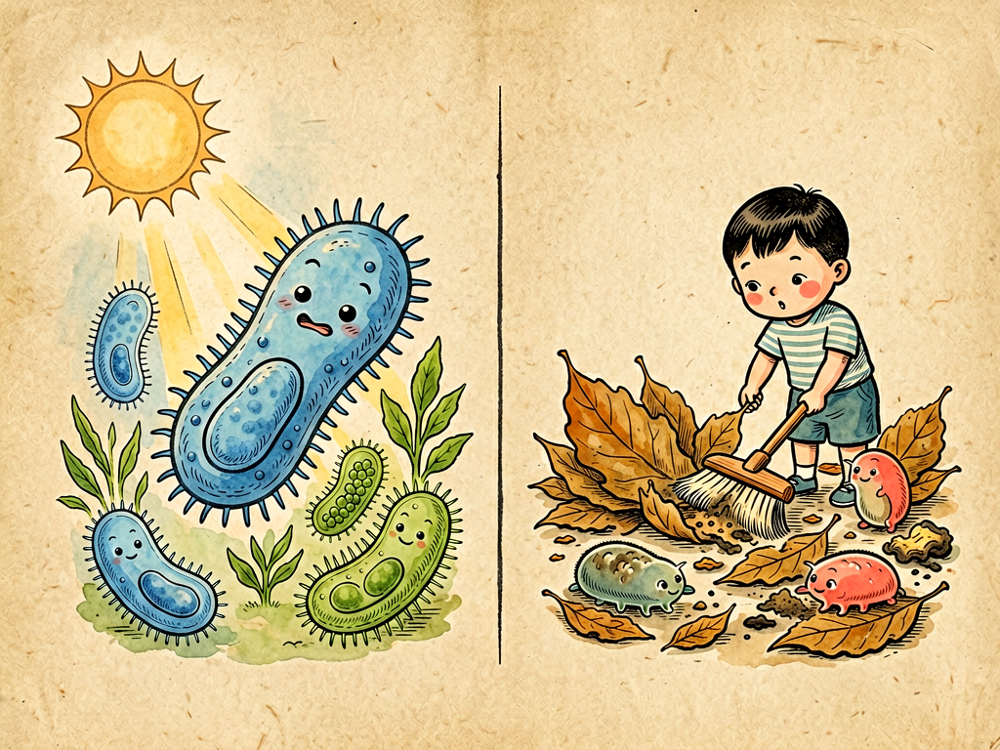

## 第六章 生计问题

---

### 📍 本章导航
**核心主题**：细菌怎么"找饭吃"？生存方式决定了细菌与人类的关系  
**你将发现**：
- 细菌的两大类"吃饭方式"：自养和异养
- 为什么说人体是细菌的"五星级酒店"
- 皮肤、口腔、肠道里的细菌分别在做什么工作
- 抗生素为什么会"误伤好人"？菌群失衡会怎么样
- 从"杀菌"到"养菌"——现代健康观念的转变

**阅读建议**：这一章彻底改变你对细菌的看法——它们不都是"坏人"，很多是你的"同事"。

---

### 🖋️ 经典原文

逛完了水国，今天菌儿我要跟你们聊聊最现实的问题——生计。

"民以食为天"，我们菌儿也一样。从35亿年前诞生到现在，我们家族几十亿年的历史，说白了就是一部"找饭吃"的历史。地球这么大，哪里有营养，哪里就有我们；哪种方式能获得能量，我们就进化出哪种本事。

先说说我们的"吃饭方式"，总的来说分两大类：**自养**和**异养**。

自养菌都是"硬汉子"，不需要吃现成的有机物，自己就能制造食物。怎么制造？又分两种：
一种是**光能自养**，就像植物一样，靠阳光进行光合作用——比如蓝细菌，它们有叶绿素，能利用阳光把二氧化碳和水变成有机物，同时放出氧气。你们知道吗？20多亿年前，就是蓝细菌的祖先通过光合作用，把地球大气里的氧气从几乎为零提到了21%，才有了后来的有氧呼吸生物，才有了你们人类；
另一种是**化能自养**，它们不用阳光，而是靠氧化无机物获得能量——硫细菌氧化硫化氢，铁细菌氧化二价铁，硝化细菌氧化氨，这些"化学工作者"在土壤里、在深海热泉里默默工作，是自然界物质循环的关键一环。

但自养菌毕竟是少数，我们大多数菌儿都是**异养菌**——得靠现成的有机物过日子。异养也分三种活法：

第一种是**腐生**——这是我们菌儿最"正当"的职业，分解动植物的尸体、粪便、枯枝落叶，把复杂的有机物分解成简单的无机物还给土壤，重新供植物利用。如果没有我们腐生菌，地球上早就堆满了动植物尸体，物质循环就断了，所有生命都会饿死。我们是大自然的"清道夫"；

第二种是**寄生**——这就不太光彩了，我们从活的动植物或人体内吸收营养，让宿主生病。这些就是你们说的"致病菌"——鼠疫、霍乱、肺结核、伤寒，都是寄生菌干的。但说实话，寄生不是什么"光彩"的生存策略——把宿主弄死了，我们自己也没地方待了，所以寄生菌其实也在慢慢往"低毒力"方向进化，不然同归于尽对谁都没好处；

第三种是**共生**——这是最聪明的活法，我们和宿主互惠互利。你们给我们提供食物和住所，我们帮你们干活——这才是长久之计。

说到共生，就不得不说人体了。菌儿我跟你们说实话：人体，简直是我们菌儿的"五星级酒店"！
- **温度适宜**：37℃恒温，不冷不热，正好是大多数细菌最舒服的温度；
- **湿润**：皮肤、口腔、呼吸道、肠道全是潮湿的，适合我们生长；
- **营养丰富**：你们吃的食物、皮肤分泌的皮脂、脱落的上皮细胞，都是我们的自助餐；
- **环境稳定**：pH、渗透压、氧气浓度都相对稳定，比风吹日晒的野外舒服多了。

这么好的地方，我们当然要住！一个健康成年人身上，细菌总数量有38万亿，比你们自身的细胞还多。它们住在不同的地方，干不同的活：

- **皮肤上**：表皮葡萄球菌、痤疮丙酸杆菌这些"老住户"，它们分解皮脂，产生酸性物质抑制有害菌生长，是皮肤的"常驻保安"。如果把它们都洗掉了，有害菌反而容易定植；
- **口腔里**：唾液链球菌、韦荣球菌这些，帮着分解食物残渣，维持口腔生态。但如果不刷牙，食物残渣太多，某些细菌产酸腐蚀牙齿，就会得蛀牙；
- **肠道里**：这是我们最大的"产业园"——大肠里每克内容物就有1000亿个细菌，数量比地球总人口还多！双歧杆菌、乳酸杆菌、大肠杆菌、产丁酸菌……它们帮你们分解人体消化不了的膳食纤维，合成维生素K和B族维生素，训练免疫系统不让它"乱开火"（过敏就是免疫系统乱开火的结果），甚至通过"肠脑轴"影响你的情绪和食欲；
- **生殖道里**：乳酸杆菌产生乳酸维持酸性环境，抑制致病菌生长，保护女性健康。

你看，这些"共生菌"哪里是你们的敌人？它们是你们的"编外器官"啊！

但我们菌儿的"生计"也不是铁饭碗，随时可能"失业"。最大的威胁就是——**抗生素**。抗生素是个好东西，救了无数人的命，但它不分好坏，吃进去把致病菌杀死的同时，也把我们这些有益的共生菌杀得七七八八。这就像"地毯式轰炸"，炸完了敌人，自己的城市也毁了。

每次吃抗生素，肠道里就像经历了一场"菌群地震"：好菌死了一大片，平时被压制的条件致病菌趁机繁殖，就会出现腹胀、腹泻、消化不良、胃口差，甚至免疫力下降。很多人感冒发烧就自己吃抗生素，其实感冒大多是病毒引起的，抗生素根本杀不死病毒，反而白白伤了自己的菌群，得不偿失。

除了抗生素，还有很多事会让我们"失业"：
- 顿顿大鱼大肉、高脂高糖、不吃蔬菜膳食纤维——喜欢膳食纤维的好菌饿死了，喜欢脂肪的坏菌大量繁殖；
- 长期熬夜、压力太大——压力激素会改变肠道环境，让好菌待不下去；
- 过度清洁、滥用消毒剂、动不动就用杀菌漱口水——把皮肤上、口腔里的原籍菌都杀死了，相当于把"保安"都赶走了，"小偷"自然就来了。

现在你们人类也慢慢明白了：**健康不是"无菌"，而是"菌群平衡"**。所以才有了益生菌、益生元、甚至粪菌移植——把健康人粪便里的菌群移植到病人肠道里，治疗严重的肠道感染，效果特别好。这在以前想都不敢想，但科学证明它就是有效。

菌儿我活了35亿年，见过无数大场面，最后想跟你们说一句掏心窝子的话：你们人类总觉得"人定胜天"，总觉得自己是独立的个体，但其实你们从来都不是一个人在战斗——你的身体里住着几万亿个我们，我们帮你消化、帮你合成维生素、帮你训练免疫、帮你抵挡病菌。你的健康，有一半是我们在撑着。

别把我们都当敌人。学会和我们共处，善待你的菌群，就是善待你自己。我们找了几十亿年的生计，最后在你们身上找到了长期饭票——我们也不想砸了自己的饭碗啊。

---

> 📜 **科学史话：青霉素的发现——一个"失误"改变了医学**
>
> 1928年，英国细菌学家亚历山大·弗莱明（Alexander Fleming）在实验室培养葡萄球菌（一种引起伤口感染的常见细菌）。他度假回来，发现一个培养皿被霉菌污染了——通常这种情况就是实验失败，把培养皿扔了算了。
>
> 但弗莱明仔细一看，发现了一件奇怪的事：**霉菌周围的葡萄球菌都被杀死了，形成了一个透明的"抑菌圈"**！这说明霉菌产生了某种能杀死细菌的物质。
>
> 这种霉菌就是青霉菌（*Penicillium*），弗莱明把它产生的杀菌物质叫做"青霉素"（Penicillin）。但弗莱明没能把青霉素提纯出来——直到1940年代，澳大利亚病理学家弗洛里（Howard Florey）和德国生物化学家钱恩（Ernst Chain）才解决了提纯和量产问题。
>
> 二战期间，青霉素被大量生产，挽救了成千上万受伤士兵的生命。在那之前，一个小小的伤口感染、一次肺炎就可能死人——青霉素的出现，让人类平均寿命一下提高了10岁以上。弗莱明、弗洛里、钱恩三人因此获得了1945年的诺贝尔生理学或医学奖。
>
> 但就在颁奖礼上，弗莱明发出了警告："青霉素在杀死细菌的同时，也会筛选出耐药菌。如果滥用，将来可能出现对青霉素耐药的细菌，那时候人们就会因为普通感染而死去。"
>
> 不幸的是，他的预言成真了——今天，耐药菌已经成为全球公共卫生的最大威胁之一。

---

> 🔬 **科学更新：肠道菌群——你的"第二大脑"**
>
> 高士其先生写这本书的时候，人们只知道肠道里有细菌帮着消化。但最近20年的研究发现，肠道菌群的作用远超想象——它甚至能影响你的大脑和情绪！
>
> 科学家发现了"肠脑轴"（gut-brain axis）：肠道和大脑之间通过迷走神经、免疫系统、内分泌系统、代谢产物进行双向通信。肠道菌群产生的神经递质——比如90%的血清素（让人快乐的"幸福激素"）、50%的多巴胺——都是在肠道里合成的！
>
> 这意味着：
> - 你焦虑、抑郁、压力大，可能不只是"心情不好"，还和肠道菌群失衡有关；
> - 自闭症、帕金森病、阿尔茨海默病这些神经疾病，患者的肠道菌群和健康人明显不同；
> - 把无菌小鼠（体内完全没有细菌）放在压力环境下，它们的焦虑反应比正常小鼠剧烈得多；而如果给它们移植健康小鼠的菌群，焦虑就会减轻；
> - 甚至肥胖、糖尿病、过敏、自身免疫病，都和菌群有关。
>
> 2008年启动的"人类微生物组计划"，第一次全面测绘了人体微生物的基因组。现在科学家正在研究：能不能通过调整菌群来治疗疾病？"益生菌"到底有没有用？"粪菌移植"还能治哪些病？未来，医生可能会根据你的菌群来开药方，实现真正的"个性化医疗"。

---

> 🌍 **现实连接：这些"卫生习惯"其实不卫生**
>
> 很多我们以为"卫生"的习惯，其实是在破坏菌群平衡：
>
> 1. **滥用抗菌洗手液、抗菌肥皂**：普通肥皂加水洗手15秒就能洗掉99%的细菌，完全够用。抗菌肥皂加了三氯生等抗菌成分，会杀死皮肤常驻菌，还会筛选耐药菌——美国FDA已经禁止在日用洗护产品中添加三氯生了；
>
> 2. **动不动用漱口水**：杀菌漱口水会不分好坏杀死口腔细菌，长期用反而可能让口腔菌群失调。日常用清水或淡盐水漱口就够了，漱口水只适合在口腔手术后短期使用；
>
> 3. **感冒发烧就吃抗生素**：90%的感冒是病毒引起的，抗生素杀病毒完全没用。即使是细菌感染，也要在医生指导下吃够疗程，不能"见好就收"——不然没死透的细菌会产生耐药性；
>
> 4. **过度使用消毒剂**：家里不是医院，不需要天天用84消毒。家里需要"干净"，不需要"无菌"——孩子适当接触环境中的微生物，反而能训练免疫系统，减少过敏和哮喘的概率。这就是"卫生假说"：小时候"脏"一点，长大反而不容易过敏。
>
> 5. **乱吃益生菌**：益生菌不是"万能保健品"，不同菌株作用完全不同，而且大多数益生菌经过胃酸胆汁就死得差不多了，能到达肠道的没几个。真正有用的是"益生元"——也就是膳食纤维，这是你自己肠道里好菌的"粮食"，多吃蔬菜水果全谷物，比吃几百块的益生菌有用得多。

---

### 💬 读后思考与讨论

1. 细菌有自养、腐生、寄生、共生四种生存方式，你觉得哪种生存策略最"聪明"？为什么？
2. "健康不是无菌，而是菌群平衡"，这句话对你有什么启发？生活中哪些习惯可能破坏你的菌群平衡？
3. 弗莱明在发现青霉素的时候就警告过滥用会导致耐药菌，但今天耐药菌问题依然严重。科学进步与人类行为之间是什么关系？
4. 肠道菌群能影响情绪和大脑，这个发现改变了你对"自我"的认知吗？你还是"你自己"吗？
5. "卫生假说"说小时候适当"脏"一点反而减少过敏，你怎么看这个观点？在卫生和接触微生物之间，应该怎么把握平衡？

### 🔗 关联阅读
- 上一章：《水国纪游》→ 水是细菌的主要旅行载体
- 下一章：《呼吸道的探险》→ 看看细菌如何通过空气进入人体
- 第二部第十四章：《细菌的衣食住行》→ 更全面了解细菌的生存条件
- 第三部第二十五章：《抗生素的功绩与罪过》→ 深入了解抗生素耐药性问题
