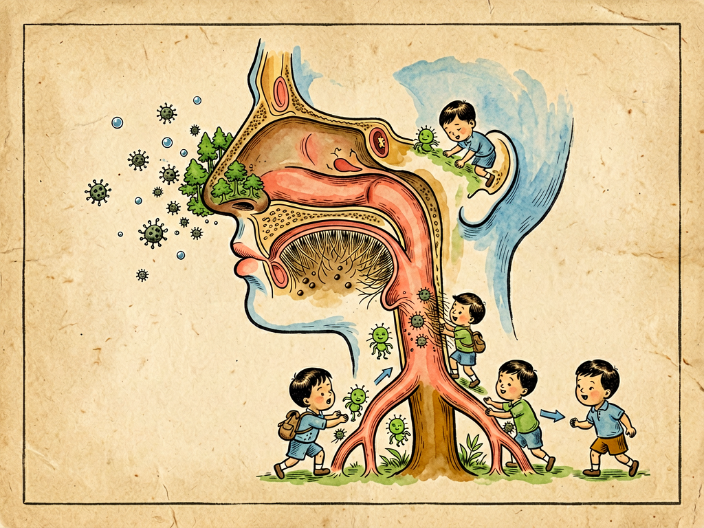

## 第七章 呼吸道的探险

---

### 📍 本章导航
**核心主题**：呼吸道——细菌进入人体的"大门"，也是人菌交战的第一战场  
**你将发现**：
- 你的呼吸道有哪三道防线在保护你
- 一个喷嚏能飞多远？戴口罩到底有没有用
- 为什么咳嗽、发烧、流鼻涕不是"病"，而是身体在打仗
- 肺炎、流感、肺结核——这些呼吸道疾病是怎么回事
- 怎么保护你的呼吸道

**阅读建议**：读完这一章，你会明白戴口罩、勤洗手、通风这些"小事"背后的大道理。

---

### 🖋️ 经典原文

说完了生计，今天菌儿我要带你们去人体探险——第一站，就是呼吸道。

呼吸道是什么？就是你们喘气的那条通道：从鼻子进去，经过咽、喉、气管、支气管，最后到达肺泡。这是我们菌儿进入人体最方便的一条路——你们每分钟要呼吸十几次，每次吸气都带着空气里的灰尘和我们菌儿，简直是"送货上门"。

但你们以为呼吸道是敞开大门随便进的？那可就错了！这条路上处处是关卡，道道是防线，想进到肺泡里，那得过五关斩六将才行。

**第一道关：鼻腔**

鼻孔里有鼻毛，像筛子一样挡住大的灰尘颗粒；鼻腔里布满了黏膜，分泌黏糊糊的鼻涕——我们菌儿一进去就被粘住了，动弹不得。而且鼻腔里温暖湿润，温度32-34℃，正好适合很多细菌生长，但黏膜里还有溶菌酶，能直接杀死不少细菌。

你们感冒的时候流鼻涕，那不是"症状"，那是免疫系统在"发洪水"——用大量黏液把病毒细菌冲出去。

**第二道关：气管和支气管**

过了鼻腔到了气管，这里的"机关"更厉害：气管壁上长满了纤毛，就像无数个小刷子，以每秒10-20次的速度向上摆动，把粘了细菌的黏液往嗓子方向扫，扫到咽部就被你们咽下去或者咳出来——这叫**"黏液-纤毛 escalator（自动扶梯）"**，一刻不停地把入侵者往外运。

如果你们抽烟、或者空气太干燥、或者被百日咳杆菌的毒素破坏了纤毛，这个"自动扶梯"就停了，细菌就会长驱直入。

**第三道关：肺泡里的巨噬细胞**

就算前面两道关都被我们闯过了，到了肺泡，还有最后一关——**肺泡巨噬细胞**。这些"巨型白细胞"就像巡逻的保安，看见不认识的细菌就一口吞下去，消化掉。正常健康人的肺泡是基本无菌的，就是因为有这些巨噬细胞在站岗。

但我们菌儿也不是吃素的，为了闯过这三道关，我们各有各的"绝招"：

- **肺炎链球菌**穿着一层厚厚的**荚膜**，就像穿了防弹衣，巨噬细胞吞不下去它，就能在肺泡里繁殖引起肺炎；
- **百日咳杆菌**分泌**百日咳毒素**，直接把气管上的纤毛麻痹毒死，让"自动扶梯"停下来；
- **流感病毒**钻进呼吸道上皮细胞里，利用你们自己的细胞复制自己，免疫系统一时半会儿找不到它；
- **结核分枝杆菌**更狡猾——它被巨噬细胞吞进去之后，不仅不被消化，反而躲在巨噬细胞里面"卧薪尝胆"，潜伏几年甚至几十年，等你免疫力下降了再跑出来作乱，这就是肺结核；
- **铜绿假单胞菌**能在气管插管上形成**生物膜**，一大群菌包在胞外多糖里，抗生素进不去，免疫细胞也进不去，这是呼吸机相关肺炎最难治的原因。

一旦我们攻破了这三道防线，在呼吸道里繁殖起来，你们的身体就会"宣战"——这就是你们说的"生病"了：
- **打喷嚏、咳嗽**：这是身体在"发射大炮"，用高速气流把我们喷出去。一个喷嚏能以每小时160公里的速度喷出几万个飞沫，飞出去3-8米远！
- **流鼻涕、咳痰**：用黏液把我们包裹起来，排出去；
- **发烧**：体温升高一两度，多数细菌病毒在38℃以上繁殖就变慢了，同时免疫细胞跑得更快、战斗力更强。所以发烧不是坏事，是身体在"开加速器"；
- **嗓子疼、扁桃体肿大**：那是免疫系统的"军营"——淋巴结、扁桃体在招兵买马，大量白细胞在这里集结，和我们打仗；
- **浑身酸痛、没力气**：那是身体在"全国总动员"，把能量都优先供给免疫系统，让肌肉暂时"歇业"，让你卧床休息保存体力。

你看，这些所谓的"症状"，哪一个是病本身？全都是身体在反击啊！很多人一发烧就吃退烧药、一咳嗽就吃止咳药，相当于身体正在前线和敌人拼刺刀，你在后面开枪把自己的军队打死了。当然，高烧超过38.5℃太久或者咳嗽太剧烈影响休息，那是需要适当干预的，但不要一上来就把所有症状都压下去。

我再给你们数数常见的呼吸道"敌人"：
- **普通感冒**：大多是鼻病毒、冠状病毒引起的，症状轻，流鼻涕打喷嚏，一周左右自己就好，抗生素没用；
- **流感**：流感病毒引起，比普通感冒重得多，高烧39℃以上、浑身酸痛、乏力，传染性强，可能引发肺炎甚至死亡，老人小孩尤其危险；
- **肺炎**：细菌、病毒、支原体都能引起，肺泡里充满了脓液和渗出液，影响气体交换，会咳嗽、咳痰、发烧、呼吸困难，严重的会死人；
- **肺结核**：结核杆菌引起的"白色瘟疫"，咳嗽、低烧、盗汗、消瘦、咳血，解放前是不治之症，现在有抗生素能治，但耐药结核越来越多；
- **百日咳**：百日咳杆菌引起，咳起来一阵一阵停不下来，最后"呜"地一声吸气像鸡叫，小孩子容易得，病程长达两三个月所以叫"百日咳"；
- **白喉**：白喉杆菌在咽喉部形成一层灰白色假膜，严重的会堵死气管窒息，还会释放毒素损伤心肌神经，现在有疫苗很少见了。

你们人类也有对付我们的办法：
第一是**口罩**——别小看这一层布，打喷嚏喷出来的大飞沫，一个外科口罩就能挡住90%以上；N95口罩能挡住95%以上的0.3微米颗粒。戴口罩不仅是保护自己，更是保护别人——如果你自己已经感染了，戴口罩能把你喷出来的飞沫挡住，不传染给别人；
第二是**洗手**——我们呼吸道的病菌经常通过飞沫落到桌子、门把手、手机上，你用手摸了这些地方再摸鼻子摸嘴摸眼睛，就把我们"送"进去了。勤洗手，肥皂洗20秒，就把我们冲走了；
第三是**通风**——密闭房间里，病菌越积越多，浓度高了就容易感染。开窗通风，让新鲜空气把病菌稀释掉；
第四是**疫苗**——流感疫苗、肺炎疫苗、百白破疫苗、卡介苗（防结核）、新冠疫苗……疫苗就是给免疫系统"看照片"，让它提前认识我们，等真的我们来了，免疫系统能快速反应，不等我们繁殖就把我们消灭了。

最后说一句：呼吸道是你们人体最繁忙的"边境线"，每天每时每刻都在发生着看不见的战争。呼吸之间，就是生死之间。好好保护你的呼吸道，别抽烟，多通风，勤洗手，该戴口罩戴口罩——守住这条边境线，健康就赢了一半。

---

> 📜 **科学史话：伍连德——扑灭东北大鼠疫的"口罩先驱"**
>
> 1910年冬，中国东北爆发了一场可怕的肺鼠疫，短短几个月就死了6万多人，而且沿着铁路向全国蔓延，全世界都为之震惊。
>
> 当时年仅31岁的马来西亚归国华侨医生伍连德（1879-1960），被清政府派去东北抗疫。那时候人们还不知道鼠疫是怎么传播的——普遍认为是跳蚤在老鼠和人之间传播（腺鼠疫）。但伍连德到了东北仔细观察发现，这次的鼠疫患者都是先咳嗽、咳血，然后很快死亡，而且很多患者根本没接触过老鼠——他判断，这次是**肺鼠疫**，通过呼吸道飞沫人传人！
>
> 这在当时是石破天惊的论断。为了阻止传播，伍连德采取了一系列前所未有的措施：封锁交通、隔离患者、焚烧尸体，还有——**他发明了一种用两层纱布夹一块吸水药棉做成的口罩，让所有人都戴上**。这就是中国历史上第一个医用口罩，后来被世界各国采用，被称为"伍氏口罩"。
>
> 仅仅用了4个月，这场百年不遇的大鼠疫就被伍连德彻底扑灭了。这是人类历史上第一次用科学手段成功控制烈性传染病大流行，伍连德也因此成为第一个获得诺贝尔生理学或医学奖提名的华人。
>
> 一百多年过去了，伍连德当年用的"隔离+口罩+消毒"的方法，直到今天仍然是呼吸道传染病防控的金科玉律。2020年新冠疫情期间人们戴的口罩，本质上和伍连德发明的"伍氏口罩"原理一模一样——科学的真理，经得起时间的考验。

---

> 🔬 **科学更新：一场新冠疫情教会我们的事**
>
> 高士其先生写这本书的时候，他可能想象不到，2020年一场由新型冠状病毒（SARS-CoV-2）引起的肺炎疫情，会席卷全球，改变整个世界。但他在这一章里讲的道理——飞沫传播、戴口罩、勤洗手、通风——全都在新冠疫情中得到了验证。
>
> 新冠疫情给我们上了一堂生动的微生物课，也更新了很多知识：
>
> - **气溶胶传播**：以前人们以为呼吸道传染病主要通过大飞沫传播（1-2米内沉降），但新冠病毒让我们认识到，更小的气溶胶颗粒（直径<5微米）能在空气中悬浮几十分钟甚至几小时，在密闭空间里能传播很远。这就是为什么通风那么重要，为什么在人多的密闭空间要戴口罩；
> - **无症状传播**：很多感染者自己不发病、没有症状，但照样能把病毒传染给别人——这就是病毒的"狡猾"之处，它把宿主变成了"移动传染源"；
> - **疫苗的速度**：以前疫苗研发通常需要5-10年，但新冠疫苗只用了1年就研发成功并大规模接种，这是人类医学史上的奇迹。mRNA疫苗这种新技术也第一次大规模使用，为未来疫苗研发开辟了新道路；
> - **病毒变异**：新冠病毒在传播过程中不断变异，从阿尔法、贝塔、德尔塔到奥密克戎，传染性越来越强，毒力越来越弱——这也符合病毒进化的规律：病毒其实不想杀死宿主，它只想传播自己，所以通常会朝着"高传染性、低毒力"的方向进化。
>
> 新冠疫情让全世界都重新认识了微生物的力量——在肉眼看不见的病毒面前，人类是一个命运共同体，没人能独善其身。

---

> 💡 **动手试一试：你的手摸了多少地方？**
>
> 这个小活动能让你直观感受到"手是传播病菌的主要途径"：
>
> 找一个小本子，记录你从起床到出门（或者到吃午饭）这段时间里，你的手一共摸了多少样东西、多少个不同的表面——门把手、手机、电梯按钮、楼梯扶手、桌子、椅子、笔、杯子、水龙头、开关、钥匙、钱……
>
> 数一数，你会惊讶地发现：短短一两个小时，你的手可能摸了几十甚至上百个不同的表面！而这些表面上可能沾着别人咳嗽打喷嚏留下的飞沫，沾着各种各样的细菌病毒。如果你摸完这些东西不洗手就摸脸、摸鼻子、揉眼睛、拿东西吃，就把病菌直接送到了"门口"。
>
> 正确洗手的方法：用肥皂或洗手液，流水冲洗至少20秒——大概是唱两遍"生日快乐歌"的时间。要洗到掌心、手背、指缝、指尖、拇指、手腕这些容易忽略的地方。

---

> 🌍 **现实连接：呼吸道传染病的个人防护指南**
>
> 这一章讲的道理，在呼吸道传染病流行期间尤其重要。不管是流感、新冠、肺结核还是普通感冒，个人防护的核心原则从来没变过：
>
> **第一，戴口罩是双向防护。**
> 很多人以为戴口罩只是"保护自己不被别人传染"，其实更重要的是"自己生病时不传染别人"。你咳嗽打喷嚏喷出来的飞沫，一个外科口罩就能挡住90%以上。在呼吸道传染病流行季节，去医院、地铁、商场这些人多密闭的地方，戴口罩既是保护自己，也是对他人负责。
>
> **第二，洗手是最划算的健康投资。**
> 呼吸道病菌很多是通过"手→口/鼻/眼"传播的：你摸了被污染的门把手、电梯按钮、手机，再摸鼻子揉眼睛，就把病菌送进去了。用肥皂流水洗手20秒，就能挡住大部分接触传播。记住：没洗手之前，别摸脸！
>
> **第三，通风比消毒更重要。**
> 很多人一提到防疫就想到喷消毒水、擦桌子，其实对呼吸道传染病来说，通风才是最有效的。密闭房间里，病菌越积越多，浓度高了就容易感染；开窗通风，让新鲜空气把病菌稀释掉，风险就能降90%以上。每天开窗通风2-3次，每次30分钟，比喷多少消毒水都有用。
>
> **第四，不要一发烧就吃抗生素、退烧药。**
> 发烧是身体的"防御反应"——体温升高一两度，免疫细胞战斗力更强，细菌病毒繁殖变慢。如果体温在38.5℃以下，精神状态还好，别急着吃退烧药，多喝水、多休息，让身体自己打仗；当然，如果高烧超过38.5℃太久、精神差、呼吸困难，那就要及时看医生。
>
> **第五，疫苗是最好的预防。**
> 流感疫苗、肺炎疫苗、百白破疫苗、新冠疫苗……疫苗不是"100%不得病"，但能大幅降低重症和死亡风险。老人、小孩、孕妇、有基础病的人，该打的疫苗一定要打。
>
> **第六，吸烟是呼吸道最大的敌人。**
> 抽烟会直接破坏气管壁上的纤毛——就是我们说的"黏液-纤毛自动扶梯"，让这个把病菌往外扫的机制停摆。抽烟的人不仅自己容易得肺炎、慢性支气管炎、肺癌，二手烟还会害身边的人，尤其是孩子。戒烟什么时候都不晚。

---

### 💬 读后思考与讨论

1. 为什么说"发烧、咳嗽、流鼻涕不是病，而是身体在打仗"？这改变了你对"生病"的看法吗？生病时应该怎么做？
2. 伍连德在100多年前就用口罩扑灭了鼠疫，为什么到今天还有人争论戴口罩有没有用？你怎么看待公共卫生措施和个人自由的关系？
3. 新冠疫情给你留下了哪些印象最深的记忆？从这场疫情里你学到了哪些关于微生物、关于科学、关于人类社会的知识？
4. 人体呼吸道的三道防线分别是什么？抽烟、空气干燥为什么容易得呼吸道疾病？
5. 疫苗是怎么起作用的？为什么很多人对疫苗有顾虑？你觉得应该怎么看待疫苗？

### 🔗 关联阅读
- 上一章：《生计问题》→ 了解了细菌的生存方式
- 下一章：《肺港之役》→ 呼吸道之战的"决战时刻"——肺炎
- 第二部第七章：《触——清洁的标准》→ 了解日常卫生与身体防御
- 第二部第十六章：《凶手在哪儿》→ 流行病学调查如何追踪传染病
- 第三部第三十章：《痰》→ 呼吸道飞沫传播与公共卫生
