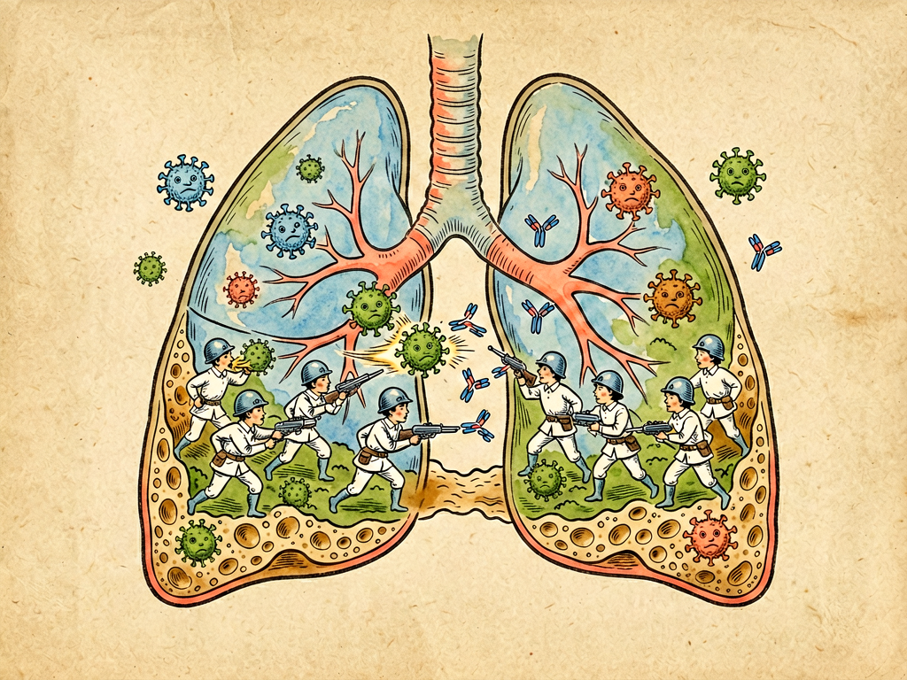

## 第八章 肺港之役

---

### 📍 本章导航
**核心主题**：肺炎——肺部的微观攻防战，人菌交战最激烈的战场  
**你将发现**：
- 为什么肺是细菌最想占领的"战略要地"
- 肺炎有哪些不同类型？大叶性肺炎、支气管肺炎有什么区别
- 细菌靠什么"武器"攻破肺部防线
- 肺结核为什么能"潜伏"几十年？
- 疫苗和抗生素——人类对抗肺炎的两大武器

**阅读建议**：这是一章"战争片"，带你看看肺泡里的微观战场有多惊心动魄。

---

### 🖋️ 经典原文

上一章我们探险了呼吸道，今天菌儿我要讲一场真正的战役——肺港之役。

"肺港"这个名字好啊！肺脏就像一座繁华的港口：气管支气管是航道，大大小小的支气管分支是码头，3-4亿个肺泡就是泊位——每个肺泡周围都密密麻麻缠着毛细血管，氧气从这里进血液，二氧化碳从血液里出来。

这座"港口"有多大？肺泡总面积加起来有70-100平方米，相当于一个网球场那么大！而且这里氧气充足、营养丰富、温度恒定——对我们好氧菌来说，这简直就是天堂！谁占领了肺港，谁就有吃不尽的粮、养不完的兵。

但想攻下肺港可没那么容易，人体在这儿布下了五道防线：
1. **纤毛"自动扶梯"**不停地把入侵者往外扫；
2. **肺泡巨噬细胞**像巡逻的保安，看见就吞；
3. **中性粒细胞**——这些是"特种兵"，接到信号就从血液里冲出来，和细菌同归于尽；
4. **抗体和补体**，像精确制导导弹，专门标记入侵者；
5. **T细胞和B细胞**，不仅参与战斗，还会留下"记忆"，下次同样的细菌再来，直接秒杀。

但我们菌儿也有"攻城武器"：
- **肺炎链球菌**穿着厚厚的**荚膜**——这是它的"防弹衣"，巨噬细胞看不见它，也吞不下去它。这小子是大叶性肺炎的元凶，它一进肺泡就开始繁殖，引起大片肺叶发炎，病人会高烧、胸痛、咳**铁锈色痰**——那是红细胞被破坏后释放的血红蛋白混在痰里的颜色；
- **结核分枝杆菌**最狡猾，它被巨噬细胞吞进去之后，不仅不死，还躲在巨噬细胞里面"装死"，休眠几个月、几年甚至几十年。等你免疫力下降了——比如得了糖尿病、长期吃激素、营养不良、年纪大了——它就醒过来，在肺里打洞形成空洞，让人咳嗽、咳血、低烧、盗汗，慢慢消瘦——这就是肺结核，以前叫"肺痨"，是"白色瘟疫"；
- **金黄色葡萄球菌**更狠，它释放**杀白细胞素**，直接把赶来增援的中性粒细胞炸得粉碎；还能形成脓肿，把肺组织"吃"出一个洞；
- **铜绿假单胞菌**喜欢在气管插管上形成**生物膜**——一大群菌包在黏糊糊的多糖外壳里，抗生素进不去，免疫细胞也打不进去，这是呼吸机相关肺炎最难治的原因。

我们攻进肺港有五条路：
1. **空中突破**：最常见，病人咳嗽打喷嚏喷出的飞沫被别人吸进去，直接到肺泡——流感、新冠、肺结核都是这么传的；
2. **误吸**：喝酒喝醉了、中风了、老人吞咽功能不好，把口腔里的分泌物、胃里的东西吸进气管里，就会引起吸入性肺炎；
3. **上呼吸道感染下行**：感冒、支气管炎没控制好，细菌顺着支气管往下走，到肺泡里；
4. **血行播散**：身体其他地方感染（比如皮肤长疖子、牙周炎），细菌顺着血液流到肺里，引起继发性肺炎；
5. **创伤或医疗操作**：胸外伤、气管插管、呼吸机，直接把细菌带进去。

一旦战斗打响，你们的身体就会出现各种"战争反应"：
- **高烧**——体温升到39℃、40℃，就是免疫系统在"开战时动员"，抑制细菌繁殖，加速免疫细胞行动；
- **咳嗽咳痰**——肺泡里充满了细菌、战死的免疫细胞、组织液，形成痰液，通过咳嗽排出去；
- **胸痛**——肺表面的胸膜发炎，呼吸时摩擦就疼；
- **呼吸困难**——肺泡被脓液填满了，没法进行气体交换，氧气进不去，人就会喘气、嘴唇发紫。

最危险的是**重症肺炎**——细菌不仅在肺里打仗，还进入血液引起败血症，感染扩散到全身，引起感染性休克、呼吸衰竭，多器官功能衰竭，这时候就可能死人。尤其是老人、小孩、孕妇、有基础病的人，肺炎是非常凶险的。

以前没有抗生素的时候，得了大叶性肺炎，三个人里就有一个会死。1928年青霉素被发现，1940年代开始用，肺炎才从"绝症"变成了"能治好的病"。但现在又有了新麻烦——**耐药菌**：耐甲氧西林的金黄色葡萄球菌（MRSA）、多重耐药的铜绿假单胞菌、耐药结核……细菌在和抗生素的"军备竞赛"中不断进化，越来越多的抗生素失效了。

那怎么防守肺港？给你们几个建议：
第一，**接种疫苗**——这是最划算的"国防投资"。小孩打13价肺炎疫苗、Hib疫苗，老人打23价肺炎疫苗、每年打流感疫苗，能预防一大半肺炎。别觉得疫苗没用，它是帮你训练免疫系统，给军队"提前看敌人照片"；
第二，**戒烟**——抽烟直接把气管黏膜上的纤毛毒死了，"自动扶梯"停了，细菌自然就长驱直入。抽烟的人得肺炎、慢阻肺、肺癌的风险是不抽烟的好几倍；
第三，**不要滥用抗生素**——感冒咳嗽就自己吃抗生素，杀了好菌，筛选出耐药菌，真到得肺炎的时候，可能什么药都不管用了；
第四，**注意通风，注意手卫生**——密闭空间里病菌浓度高，容易感染；勤洗手，别用脏手摸鼻子摸嘴；
第五，**老人小孩要特别警惕**——老人得了肺炎可能不发烧不咳嗽，就是突然精神差、不想吃饭、爱睡觉，这时候千万别大意，赶紧送医院。

肺啊肺，你这三亿个"泊位"，每天呼吸两万多次，一刻不停地为身体运送氧气。可就在你平静的呼吸背后，每时每刻都有一场看不见的战争在进行。珍惜你的肺，别抽烟，多呼吸新鲜空气——这是你和菌儿打仗最基本的本钱。

---

> 📜 **科学史话：科赫发现结核杆菌——"白色瘟疫"的元凶**
>
> 19世纪，肺结核在欧洲被称为"白色瘟疫"，每七个人里就有一个死于此病。人们只知道这病会传染，但不知道病原体是什么。
>
> 德国医生罗伯特·科赫（Robert Koch, 1843-1910）下定决心要找到肺结核的病因。那时候细菌学刚刚起步，科赫自己发明了细菌染色方法、固体培养基培养技术、以及"科赫法则"——一套用来证明某种微生物是某种疾病病原体的标准。
>
> 结核菌很难染色，科赫试了很多种染料，终于发现用亚甲蓝加热染色后，结核菌能染上蓝色，而且不会被酒精洗掉——这就是"抗酸染色"，直到今天还在用。他从肺结核病人的痰里都找到了这种细长弯曲的杆菌，把它培养出来，再接种到动物身上，动物果然得了肺结核——完全符合科赫法则。
>
> 1882年3月24日，科赫在柏林生理学会上宣布他发现了结核杆菌。这一天后来被定为"世界防治结核病日"。
>
> 科赫的发现让人类第一次知道了肺结核的元凶，为后来卡介苗的发明和抗结核药物的研发奠定了基础。科赫也因为在细菌学上的贡献，获得了1905年诺贝尔生理学或医学奖，被称为"细菌学之父"。

---

> 🔬 **科学更新："白色瘟疫"还没消失——耐药结核的挑战**
>
> 你可能以为肺结核是旧社会的病，现在已经消失了。错！直到今天，结核病仍然是全世界致死人数最多的传染病——每年新发病例约1000万，死亡约150万，超过艾滋病和疟疾。
>
> 更麻烦的是**耐药结核**：
> - **耐多药结核（MDR-TB）**：对最有效的两种一线抗结核药异烟肼和利福平都耐药，治疗需要用更贵、副作用更大的二线药物，疗程长达18-24个月，治愈率只有50-60%；
> - **广泛耐药结核（XDR-TB）**：几乎对所有可用的抗结核药都耐药，基本无药可治，被称为"超级癌症"。
>
> 为什么会有耐药结核？因为很多病人吃抗结核药，症状一好就停药了，没死透的结核菌就产生了耐药性，还会把耐药基因传给其他细菌。
>
> 好消息是，2012年以后，贝达喹啉、普托马尼等新型抗结核药相继问世，给耐药结核带来了新希望；新的疫苗也在研发中。但战胜结核病，不仅需要新药新疫苗，还需要公共卫生系统的努力——早发现、早治疗、规范用药、全程管理，这才是关键。
>
> 另外要提醒大家：新生儿出生第一天就要打卡介苗（BCG），能有效预防儿童重症结核，但对成人肺结核保护效果有限。如果你身边有人长期咳嗽（超过两周）、低烧、盗汗、消瘦、咳血，一定要提醒他去医院查痰、拍胸片，排除肺结核——这是保护他，也是保护你自己。

---

> 🌍 **现实连接：为什么医生总让你"戒烟"？**
>
> 很多人觉得抽烟"就是伤点肺，顶多老了得慢阻肺"，但抽烟对肺部防御系统的破坏是全方位的：
>
> 1. **纤毛瘫痪**：烟草烟雾里的焦油、尼古丁直接毒害气管黏膜上的纤毛，让纤毛变短、脱落、停止摆动，相当于你把肺的"自动扶梯"给拆了，细菌灰尘能直接进到肺泡里；
> 2. **巨噬细胞功能下降**：肺泡里的巨噬细胞被烟草烟雾熏得"晕头转向"，吞噬细菌的能力大幅下降；
> 3. **免疫球蛋白减少**：呼吸道黏膜分泌的抗体减少，免疫防御能力整体下降；
> 4. **慢性炎症**：烟雾长期刺激，气道长期发炎，痰变多，气道变窄，最后变成慢阻肺（COPD）；
> 5. **基因突变**：烟草里有69种明确的致癌物，长期刺激肺细胞，基因突变积累，最后变成肺癌。
>
> 抽烟的人得肺炎的风险是不抽烟的3-4倍，得肺癌的风险是不抽烟的10-20倍。不仅自己抽烟有害，二手烟、三手烟（沾在衣服、家具、墙上的烟雾残留物）同样危害家人健康。
>
> 但你知道吗？戒烟任何时候都不晚：戒烟20分钟，心率血压就下降；戒烟1年，心脏病风险降一半；戒烟10年，肺癌风险降到继续抽烟的人的一半。为了你的肺港不被轻易攻破，从今天开始，试着戒烟吧。

---

### 💬 读后思考与讨论

1. 作者把肺比作"港口"，把细菌入侵比作"攻城战"，这样的写法好在哪里？你还能想到用什么比喻来描述身体里的"人菌大战"？
2. 结核杆菌能在巨噬细胞里"潜伏"几十年，这种生存策略对细菌有什么好处？对人类防控结核病带来了什么挑战？
3. 抗生素发明前肺炎死亡率很高，现在有了抗生素又出现了耐药菌。为什么"道高一尺魔高一丈"是细菌和人类斗争的常态？
4. 老年人肺炎可能"不发烧不咳嗽"，这是为什么？为什么这种"沉默的肺炎"更危险？
5. 抽烟具体破坏了肺部的哪几道防线？除了抽烟，还有哪些生活习惯会伤害你的肺？

### 🔗 关联阅读
- 上一章：《呼吸道的探险》→ 细菌进入呼吸道的第一关
- 下一章：《吃血的经验》→ 细菌进入血液后的全身战役——败血症
- 第二部第三章：《病的面面观》→ 了解不同类型的疾病
- 第三部第二十六章：《传染病的故事》→ 人类与传染病斗争的历史
