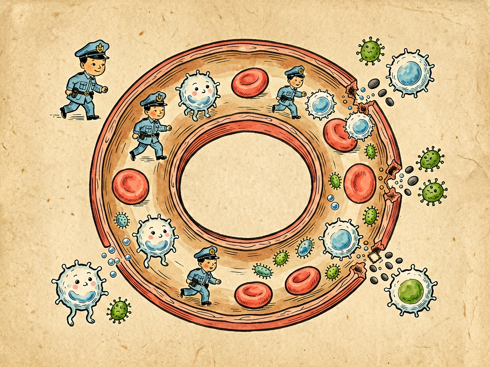

## 第九章 吃血的经验

---

### 📍 本章导航
**核心主题**：细菌进入血液——菌血症、败血症、脓毒症，最凶险的感染  
**你将发现**：
- 血液为什么既是细菌的"自助餐"，也是它们的"坟场"
- 细菌怎么进入血液？哪些"小事"可能导致严重血液感染
- 菌血症、败血症、脓毒症三者有什么区别
- 什么是"炎症风暴"？为什么一个小伤口可能致命
- 脓毒症的早期信号是什么，怎么预防

**阅读建议**：这一章有点"重口味"，但它能教你识别危险信号——关键时刻能救命。

---

### 🖋️ 经典原文

肺港一战如果打输了，我们菌儿就会进入下一阶段——闯进血液，也就是这一章要讲的"吃血"。

"吃血"这俩字听起来吓人，但这确实是我们菌儿最冒险也最疯狂的举动。血液是什么地方？那是你们人体的"内海"——血管总长10万公里，能绕地球两圈半；血液每分钟就能循环全身一圈，带着葡萄糖、氨基酸、氧气、各种营养物质，温度恒定37℃——对我们来说，这简直就是流动的自助餐！如果能在血液里站稳脚跟，那全身的器官就都成了我们的殖民地。

但血液也是我们菌儿的"坟场"——这里的防御比肺里还严密：
- 血液里有数不清的**白细胞**——中性粒细胞像"特种兵"，看见细菌就吞，吞不掉就同归于尽；单核细胞是"重型坦克"，吞噬能力更强；淋巴细胞是"特种部队"，负责精准打击；
- 还有**补体系统**——30多种蛋白质，像连锁爆炸的地雷，一旦激活就直接在细菌细胞膜上打孔，把细菌炸烂；
- **抗体**像精确制导导弹，黏在细菌身上给吞噬细胞"指路"；
- **脾脏**是血液的"过滤器"，流过脾脏的血液，细菌会被里面的巨噬细胞吞掉；
- **肝脏**里的库普弗细胞也是一样，专门清除血液里的细菌和毒素。

所以，健康人的血液是基本无菌的。偶尔有少量细菌从牙龈、肠道进去，也会很快被清除掉——这叫**菌血症**，只是"路过"，不繁殖，不生病，你们甚至感觉不到。

但如果进去的细菌太多、太毒，或者你们免疫力太低，防线被突破，我们在血液里大量繁殖、释放毒素，那就变成了**败血症**——这就是"攻入"了。如果再进一步，毒素引发全身免疫系统"过度反应"，释放大量炎症因子，引起全身血管扩张、血压下降、器官缺血，那就是**脓毒症**——全面战争爆发了。

脓毒症有多可怕？我给你们数数：细菌释放的**内毒素**（革兰氏阴性菌细胞壁上的脂多糖）和**外毒素**，就像一把把钥匙，打开了免疫系统的"潘多拉魔盒"。免疫细胞释放大量炎症因子——TNF-α、IL-1、IL-6——这些东西本来是用来杀菌的，但量太大了就会"误伤友军"：
- 全身血管扩张，血压下降，手脚冰凉，这是**感染性休克**；
- 血管通透性增加，液体漏到组织里，引起肺水肿、全身水肿；
- 心脏拼命跳但还是供不上氧，心率快、呼吸急促；
- 肾脏缺血，没尿了；
- 大脑缺血，意识模糊、嗜睡、昏迷；
- 凝血系统被激活，形成大量小血栓，把小血管堵死，这叫**弥散性血管内凝血（DIC）**——凝血因子用完了又会全身出血，皮肤出现大片瘀斑；
- 最后多个器官功能衰竭，死亡。

就算在医学发达的今天，脓毒症的死亡率也有20-30%，如果发展到感染性休克，死亡率高达50%！ICU里每三个死者就有一个是脓毒症，它比癌症、心梗死的人还多。

我们菌儿是怎么闯进血液的？主要有五条路：

第一，**皮肤黏膜破损**——这是最直接的路。手上割个口子、脚上磨个泡、长个疖子挤破了、拔牙牙龈出血、痔疮出血、生孩子产道损伤……这些"小伤口"都是我们进去的门。尤其是挤"危险三角区"（鼻子周围到两口角）的痘痘——这里的静脉没有静脉瓣，细菌顺着血液直接进颅内海绵窦，会引起颅内感染，真的会死人！

第二，**局部感染扩散**——肺炎没控制好，细菌进血液；胆囊炎、阑尾炎穿孔，细菌进腹腔再进血液；肾盂肾炎，细菌顺着输尿管上到肾再进血液；牙周炎，细菌从牙龈进血液……很多脓毒症都是"小病拖大"的结果。

第三，**医疗操作**——静脉输液、插尿管、插胃管、做手术、透析、插管……任何侵入性操作，如果无菌操作不严格，都可能把我们直接送进血管。这就是为什么医院要那么严格地消毒、洗手、做无菌操作——一次疏忽就是一条人命。

第四，**淋巴管入侵**——皮肤软组织感染（比如丹毒），细菌先进入淋巴管，顺着淋巴液回流到静脉，最后进血液。

第五，**免疫力极低的时候**——化疗后的病人白细胞几乎为零、艾滋病病人CD4细胞很低、长期吃激素的人、糖尿病血糖控制不好的人、肝硬化的人、老人小孩孕妇——这些人免疫力差，即使是毒力不强的细菌也能闯进血液引起感染。

怎么知道自己得了脓毒症？记住这几个早期信号：
1. **发烧或体温低**——大多数人会发高烧39℃以上，但老人、免疫力极低的人可能体温反而低于36℃；
2. **心率快、呼吸快**——心跳超过90次/分，呼吸超过20次/分，喘气费劲；
3. **寒战**——冷得打哆嗦，盖几床被子都没用，这是细菌在血液里繁殖的典型表现；
4. **神志改变**——本来清醒的人突然嗜睡、烦躁、说胡话、不认人；
5. **尿量减少**——半天没尿，或者尿色很深；
6. **皮肤变化**——手脚冰凉、皮肤发花、出现瘀斑瘀点。

只要有感染（不管是肺炎、尿路感染、皮肤感染还是什么）加上上面这些表现，就要高度怀疑脓毒症，**立刻去医院，一分钟都别耽误**！国际上有个"黄金一小时"原则——一小时内用上广谱抗生素、补液、处理感染灶，每延迟一小时用抗生素，死亡率增加7-10%。

怎么预防？给你们几条实用建议：
第一，**任何伤口都要及时处理**——清水冲洗，碘伏消毒，用无菌纱布覆盖。如果伤口很深、很脏、被生锈的金属弄伤，还要打破伤风；
第二，**不要挤痘痘、不要挤疖子**，尤其是脸上"危险三角区"的；
第三，**小感染不要拖**——牙疼、咳嗽、尿痛、皮肤红肿流脓，及时看，不要等发烧了、厉害了再去；
第四，**糖尿病患者控制好血糖**——高血糖就是细菌的"营养液"，血糖高的人特别容易感染，而且感染了不容易好；
第五，**去正规医院看病**——输液、手术、拔牙都要去正规医疗机构，别去黑诊所，无菌不保证。

最后说一句：闯进血液，不是我们菌儿的荣耀，而是我们的绝境——因为一旦进入血液，要么你们死，要么我们死，没有第三条路。大多数时候，我们也不想走这一步——在皮肤肠道里和你们和平共处不好吗？非要把我们逼到绝路，我们才会拼命。

很多人以为"感染就是吃点抗生素就好了"，但我要告诉你们：感染是会死人的，而且死得很快。尊重你的身体发出的信号，小毛病及时处理，别把小病拖成大病——这才是对自己生命负责。

---

> 📜 **科学史话：李斯特与外科消毒——让手术从"送死"变成"救命"**
>
> 19世纪中期以前，外科手术是真正的"鬼门关"——手术做得再漂亮，术后也有一半病人会因为"伤口感染"死去。那时候的医生不知道细菌，做手术不洗手，器械不消毒，穿着满是血污的手术服就上手术台，甚至觉得手术服上的脓血是"光荣的勋章"。手术后伤口化脓发炎被认为是"正常愈合过程"。
>
> 1865年，英国外科医生约瑟夫·李斯特（Joseph Lister, 1827-1912）看到了巴斯德关于细菌的论文——既然腐烂是细菌引起的，那伤口感染肯定也是细菌引起的！
>
> 李斯特想到了用石炭酸（苯酚）来消毒。他要求：手术前医生要用石炭酸洗手，手术器械要用石炭酸浸泡，手术室空气要用石炭酸喷雾消毒，手术后伤口要用浸过石炭酸的纱布覆盖。
>
> 效果立竿见影！李斯特做的手术，术后死亡率从接近50%降到了15%。1867年，李斯特发表了论文，公布了他的消毒方法——这是人类医学史上里程碑式的事件。从此，外科学进入了"无菌时代"，外科手术才真正从"送命的手艺"变成了"救命的技术"。
>
> 李斯特被称为"外科消毒之父"。今天我们用的"李斯特"消毒水、漱口水品牌Listerine，就是以他命名的。而他的方法的源头，正是巴斯德的细菌学说。你看，一个基础科学的发现，能拯救多少生命！

---

> 🔬 **科学更新：拯救脓毒症行动——"黄金一小时"与集束化治疗**
>
> 脓毒症因为死亡率高，一直是重症医学的重点研究对象。2002年，国际上发起了"拯救脓毒症运动"（Surviving Sepsis Campaign, SSC），每几年更新一次指南，核心就是"早识别、早治疗"。
>
> 指南提出了"1小时bundle"（黄金一小时集束化治疗），要求医生在怀疑脓毒症后1小时内完成：
> 1. 检测血乳酸水平（乳酸升高提示组织缺氧）；
> 2. 在使用抗生素前抽血培养（找致病菌）；
> 3. 立即使用广谱抗生素（不等培养结果，先"重锤猛击"覆盖可能的致病菌，等培养结果出来再调整）；
> 4. 低血压或乳酸升高的病人，快速输注晶体液补液；
> 5. 补液后血压仍低的，使用升压药维持血压。
>
> 为什么要"先上抗生素再等结果"？因为对脓毒症来说，时间就是生命——每耽误一小时，死亡率上升7-10%。等培养结果通常需要2-3天，等结果出来再用药人早就没了。
>
> 另外，最新研究发现了很多治疗脓毒症的新方向：
> - 血液净化——用滤器把血液里过多的炎症因子滤掉，就像"给血液洗澡"；
> - 免疫调节——不是一味"消炎"，而是把过度激活的免疫反应"调"到合适水平；
> - 益生菌、粪菌移植——重建肠道菌群，防止肠道细菌移位；
> - 新的生物标志物——比如降钙素原（PCT），能帮助早期识别脓毒症，还能指导抗生素用多久。
>
> 但直到今天，脓毒症仍然没有"特效药"，最好的治疗还是预防和早发现早治疗。

---

> 🌍 **现实连接：这些"常识"其实很危险**
>
> 生活中很多习以为常的做法，其实藏着血液感染的风险：
>
> 1. **挤痘痘、挤疖子**：尤其是面部"危险三角区"（鼻根到两侧口角的三角形区域），这里的静脉没有静脉瓣，挤压时细菌容易逆流进入颅内，引起海绵窦血栓性静脉炎、脑膜炎、脑脓肿，死亡率很高。脸上长痘痘、长疖子，千万别挤，让它自己好或者去医院处理；
>
> 2. **伤口不处理、贴个创可贴完事**：创可贴只能临时止血，不能代替消毒。比较深、比较脏的伤口，要先用清水或生理盐水冲干净，用碘伏消毒，再包扎；如果被生锈金属扎伤、被泥土污染，还要打破伤风针；
>
> 3. **"小病扛一扛"**：牙疼了半个月不去看，咳嗽发烧一周还在家里硬扛，尿痛尿急忍着不去医院——这些"小毛病"都可能扩散成脓肿、败血症。该看医生就要看，不要硬扛；
>
> 4. **去不正规的地方拔牙、做医美、输液**：这些侵入性操作对无菌要求很高，不正规的地方消毒不到位，很容易把细菌带进血液。看牙、做医美、做手术，一定要去正规医疗机构；
>
> 5. **糖尿病患者不控制血糖**：高血糖会抑制白细胞的吞噬能力，高糖环境又是细菌的完美培养基。糖尿病患者不仅容易感染，而且感染了不容易好，容易发展成败血症。控制好血糖，是对自己最好的保护。

---

### 💬 读后思考与讨论

1. 为什么说"血液既是细菌的自助餐，也是细菌的坟场"？这种"高风险高回报"的策略在生物界常见吗？
2. 李斯特在150多年前就发明了外科消毒法，挽救了无数生命。为什么一个看似简单的发现，能产生这么大的影响？
3. 脓毒症时，免疫系统本来是想杀菌的，为什么最后会"杀敌一千自损八百"甚至"自损更多"？这给我们什么启发？
4. "挤痘痘"这种很多人都做过的小事，竟然可能引起颅内感染甚至致命。你身边有没有类似的"不起眼的危险"？
5. 为什么脓毒症要"黄金一小时"内用上抗生素？为什么不能等检查结果出来再精准用药？

### 🔗 关联阅读
- 上一章：《肺港之役》→ 肺部感染是细菌进入血液的重要途径
- 下一章：《乳峰的回顾》→ 看看乳腺和乳汁里的细菌世界
- 第二部第二章：《细菌的敌人》→ 了解人体免疫系统
- 第三部第二十六章：《传染病的故事》→ 了解人类与传染病的斗争
