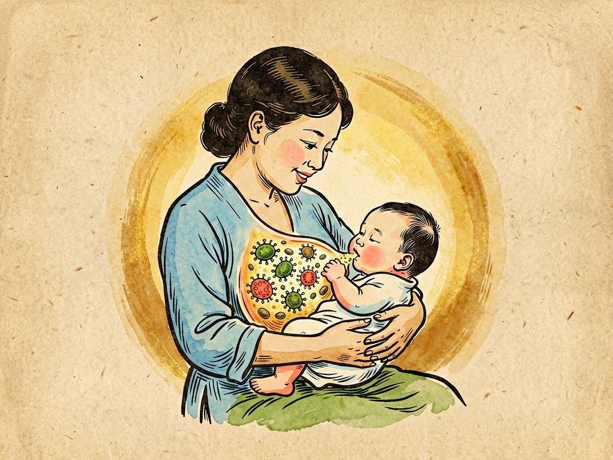

## 第十章 乳峰的回顾

---

### 📍 本章导航
**核心主题**：母乳——37℃的爱，不只是营养，更是免疫和菌群  
**你将发现**：
- 母乳不只是"食物"，更是"活的免疫制剂"
- 初乳为什么被称为"宝宝的第一针疫苗"
- 母乳里的低聚糖是"益生元"，专门养双歧杆菌
- 生命最初1000天，菌群如何影响一生健康
- 不能母乳喂养也不必愧疚——爱比奶更重要

**阅读建议**：这是全书最温柔的一章。不管你是男生女生、有没有孩子，读完都会对"母爱"有新的理解。

---

### 🖋️ 经典原文

讲完了血液里的腥风血雨，今天菌儿我想讲点温柔的——聊聊母亲的乳房，聊聊那37℃的乳汁。

你们可能会奇怪，菌儿怎么会讲"乳峰"？那不是营养的源泉吗？没错，但那更是我们菌儿和人类关系最美好的一章——在这里，我们不是敌人，而是母亲送给孩子的第一份"见面礼"。

婴儿刚出生的时候，肠道是几乎无菌的。但从出生那一刻起，细菌就开始定植：顺产的婴儿经过产道，会沾上母亲产道里的乳酸杆菌；剖腹产的婴儿则更多沾到皮肤表面的细菌。但真正给肠道菌群"播种"的，是第一口母乳。

你们以为母乳是"无菌"的？大错特错！健康母亲的乳汁里不仅有细菌，而且有几百种细菌——双歧杆菌、乳酸杆菌、葡萄球菌、链球菌……这些细菌就是母亲送给孩子的"第一份菌脉"。这些细菌随着乳汁进到婴儿肠道里，开始"安营扎寨"，构成了婴儿肠道菌群的基础。

母乳里有一样特别神奇的东西叫**母乳低聚糖（HMO）**——这东西是母乳里第三大固体成分，仅次于乳糖和脂肪，有200多种。有意思的是，婴儿根本消化不了HMO！那母乳为什么要分泌这么多婴儿消化不了的东西？答案是：这些HMO是**益生元**，专门给婴儿肠道里的双歧杆菌吃的！双歧杆菌吃了HMO，就能快速繁殖，成为肠道里的优势菌，把其他坏菌挤走。

换句话说，母亲的乳汁里不仅有"菌"，还有给这些菌准备的"粮食"——这是多么精密的设计！

母乳不只是食物，它还是药，是疫苗，是孩子免疫系统的"外挂"：
- **分泌型IgA（sIgA）**：这是一种抗体，母亲把自己免疫系统见过的病原体"记录"下来，做成sIgA通过乳汁送给孩子。这些抗体在婴儿肠道里不被消化，而是贴在肠黏膜上，像站岗的卫兵，看见致病菌就粘住它，不让它黏在肠壁上。婴儿自己要到出生后好几个月才能产生足够的sIgA，在那之前，都是母亲用自己的免疫力在保护孩子；
- **乳铁蛋白**：这东西能牢牢抓住铁离子，细菌生长需要铁，乳铁蛋白把铁都抢走了，细菌就"饿"得没法繁殖；
- **溶菌酶**：直接溶解细菌细胞壁，杀死细菌；
- **活的细胞**：母乳里还有活的白细胞、巨噬细胞、淋巴细胞——这些免疫细胞进到婴儿肠道里，还能继续吞噬病原体，继续战斗；
- **生长因子**：帮助婴儿肠道黏膜成熟，让肠道壁更"结实"，不让没消化的食物和细菌漏进血液里，减少过敏风险。

尤其是产后头几天的**初乳**——黄黄的、稠稠的、量不多，那简直是"液体黄金"！初乳里sIgA的浓度是成熟乳的好几倍，抗体、免疫细胞、生长因子含量都特别高。有人说"初乳脏，要挤掉"，这简直是天大的错误——初乳就是宝宝的第一针疫苗，第一重保护，怎么能扔掉呢？

我再给你们对比一下母乳喂养和配方奶喂养的区别：
- 母乳喂养的宝宝，肠道里90%以上是双歧杆菌——好菌占绝对优势；
- 配方奶喂养的宝宝，肠道里双歧杆菌少得多，梭菌、肠杆菌、条件致病菌更多，菌群更复杂也更容易失衡；
- 母乳喂养的宝宝，腹泻、中耳炎、呼吸道感染、过敏、湿疹、哮喘、肥胖、糖尿病的风险都更低；甚至长大后智商测试得分也更高——因为母乳里有DHA、AA、胆碱这些促进大脑发育的成分。

为什么会这样？因为配方奶虽然在努力"模仿"母乳——加了DHA、加了乳铁蛋白、加了益生菌、加了低聚糖——但它永远模仿不了母乳的"活性"和"复杂性"。母乳里有200多种低聚糖、上千种蛋白质、无数活性细胞和细胞因子，配方奶加来加去也就加了那么几种。更重要的是，母乳是"动态"的——妈妈感冒了，乳汁里就会产生针对感冒病毒的抗体；宝宝多大、什么季节、一天中的什么时候，母乳成分都不一样——这是任何配方奶都做不到的。

当然，我不是说配方奶不好。因为各种原因不能母乳喂养的妈妈完全不必愧疚——配方奶在营养上完全能满足宝宝生长需要，母婴之间的爱和连接，比用什么喂重要得多。我只是想说，在条件允许的情况下，母乳是最好的选择。

世界卫生组织建议：**纯母乳喂养到6个月，添加辅食后继续母乳喂养到2岁或以上。** 这不是什么"道德绑架"，这是科学结论。

你们知道这一章为什么叫"乳峰的回顾"吗？因为当我们站在今天回望，会发现生命最初的那几口奶，意义远超"喂饱孩子"那么简单。那是母亲用自己37℃的体温，给孩子的第一重保护；那是母亲把自己的免疫力、自己的菌群、自己对这个世界所有的经验，浓缩成乳汁，一口一口喂给孩子。

生命最初的1000天——从怀孕到2岁——是肠道菌群建立的"关键窗口期"。这时候建立什么样的菌群格局，会影响孩子一生的免疫、代谢、甚至大脑发育。顺产还是剖腹产、母乳还是配方奶、有没有滥用抗生素、是不是过度清洁、接触不接触自然环境——这些看似很小的选择，都会在孩子身上留下印记。

乳峰是母亲的峰，峰顶有一口不竭的泉。泉里流出来的不只是奶，是妈妈37度的心，是孩子一辈子健康的底子。菌儿我活了35亿年，见过无数生命的诞生，但每每看到母亲哺乳的画面，还是会觉得——生命啊，真是太奇妙了。母亲用自己的身体孕育孩子，用自己的血液滋养孩子，最后用自己的乳汁继续保护孩子——这份爱，早就写在了每一个细胞里，每一个细菌里。

---

> 📜 **科学史话：巴氏消毒法挽救婴儿生命——牛奶与母乳的百年之争**
>
> 19世纪以前，欧洲很多母亲不给孩子喂母乳，而是请奶妈或者直接喂牛奶。但那时候没有消毒技术，牛奶经常被细菌污染，婴儿死亡率高得惊人——19世纪末，欧洲每10个婴儿里就有2-3个活不到1岁，很多死于腹泻和肺炎。
>
> 1865年，巴斯德发明了巴氏消毒法——把牛奶加热到60-70℃保持一段时间，杀死致病菌但不破坏营养。1890年代，巴氏消毒法开始广泛应用于牛奶，婴儿死亡率立刻大幅下降。
>
> 但即使是消毒过的牛奶，和母乳比还是差远了。19世纪末20世纪初，人们逐渐认识到母乳的营养价值和免疫价值，"母乳喂养运动"开始兴起。到今天，母乳喂养的好处已经被无数科学研究证实。
>
> 一个有意思的插曲：最早的"配方奶"是1867年德国人Justus von Liebig发明的，他当时以为只要有蛋白质、脂肪、碳水化合物、矿物质这几大营养素就够了——后来人们才发现，母乳里还有那么多活性成分。从"五大营养素"到"免疫活性物质"到"益生菌益生元"再到"母乳菌群"，人类对母乳的认识用了150年，而且到今天还在不断有新发现。
>
> 母亲的乳汁，经过几百万年的进化打磨，比任何人类工厂生产的配方都更精密——这是进化的智慧。

---

> 🔬 **科学更新：母乳菌群——"菌脉"传承的新发现**
>
> 直到十几年前，教科书上还写着"健康人的母乳是无菌的"。但最近的基因测序技术彻底推翻了这个结论——健康母乳里不仅有细菌，而且有高达数百种细菌，数量大约是每毫升几百到几千个。
>
> 更神奇的是：这些细菌是怎么进到乳汁里的？以前人们以为是皮肤上的细菌污染了乳汁，但研究发现事情没那么简单——母亲肠道里的细菌，居然能通过一种叫"肠乳轴"（gut-mammary axis）的途径，被免疫细胞"运送"到乳腺里！也就是说，母亲不仅通过血液把营养送给孩子，还通过"免疫快递"把自己肠道里的有益菌送到乳汁里，再送给孩子。
>
> 这就是为什么现在科学家说，母亲给孩子传承的不只是"血脉"，还有"菌脉"——母亲的菌群，通过产道、通过皮肤接触、通过乳汁，一代一代传下去。
>
> 还有一个新发现：**分娩方式会影响母乳菌群**——顺产妈妈的母乳里，乳酸杆菌更多；剖腹产妈妈的母乳里，葡萄球菌和链球菌更多，多样性也低一些。这也是为什么现在建议剖腹产的宝宝出生后尽快和母亲皮肤接触、早开奶——尽量补上这一课。
>
> 但也不用太焦虑：虽然分娩方式和喂养方式会影响菌群，但不是决定性的。宝宝慢慢长大，接触自然环境、吃多样化的食物、和家人互动，菌群都会慢慢调整过来。生命比我们想象的更有韧性。

---

> 💡 **动手试一试（适合家长）：观察宝宝的大便**
>
> 如果你家里有小宝宝，观察宝宝的大便就能大致知道肠道菌群的状况：
>
> - 纯母乳喂养的宝宝，大便是金黄色、糊状、带点酸味，不臭——这是双歧杆菌占优势的表现，完全正常；
> - 配方奶喂养的宝宝，大便颜色更浅、更稠、臭味更大——因为蛋白质分解产物更多，也是正常的；
> - 添加辅食后，大便慢慢变成褐色、成形，更接近成人，臭味也更大；
> - 如果大便突然变稀、带泡沫、有酸臭味、次数变多，可能是消化不良或肠道菌群失调；
> - 如果大便带脓血、有黏液、宝宝发烧、精神差，一定要立刻去医院。
>
> 另外，不要给小宝宝随便吃"益生菌"——除非医生建议。母乳里本身就有最好的益生菌和益生元，妈妈正常饮食、按需哺乳，就是给宝宝最好的"益生菌"。

---

### 💬 读后思考与讨论

1. 母乳里竟然有婴儿消化不了的低聚糖，专门用来养双歧杆菌——这种"设计"为什么让你觉得神奇？进化还有哪些类似的"精密安排"？
2. 母亲通过sIgA把自己的免疫力"借"给孩子，通过乳汁传递自己的菌群——这改变了你对"母乳喂养"的看法吗？
3. 现在很多人因为各种原因不能母乳喂养，有人为此深感愧疚。你怎么看待这个问题？妈妈的爱一定要通过母乳来体现吗？
4. "生命最初1000天影响一生"，结合这一章的内容，谈谈你对"起跑线"的新理解——真正的起跑线在哪里？
5. 从"五大营养素"到发现免疫物质，再到发现菌群，人类对母乳的认识花了150年。这个过程给你什么启发？

### 🔗 关联阅读
- 上一章：《吃血的经验》→ 最凶险的人菌之战
- 下一章：《食道的占领》→ 细菌进入消化道的旅程
- 第二部第十章：《乳儿的抵抗力》→ 深入了解婴儿免疫系统
- 第三部第三十章：《婴儿的世界》→ 从发育角度看生命早期
