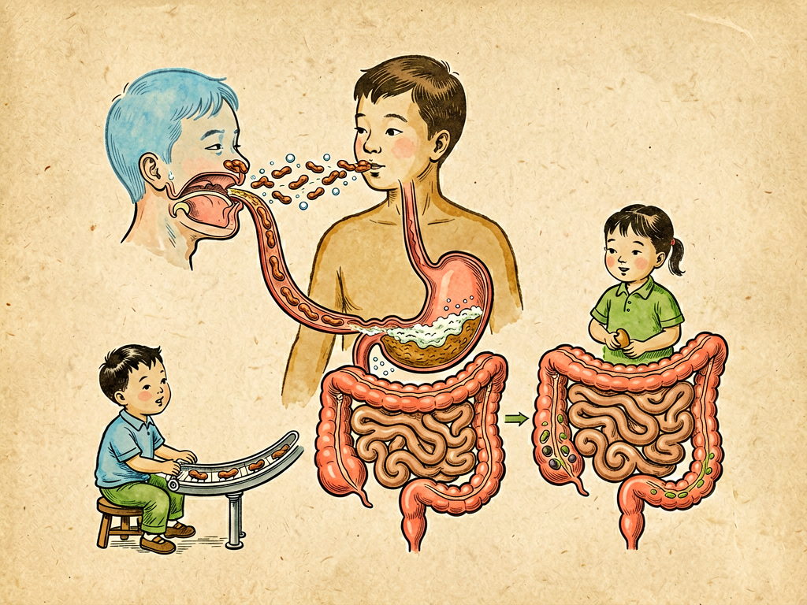

## 第十一章 食道的占领

---

### 📍 本章导航
**核心主题**：食道——25厘米的"食物隧道"，消化系统的第一关  
**你将发现**：
- 食道不是一根简单的"管子"，吞咽是一套精密协作的动作
- 为什么"烧心"烧的不是心，而是食道
- 胃食管反流是怎么回事？长期不治疗有什么风险
- 食道癌为什么在中国高发？怎么预防
- 吃饭太快、太烫、太饱，会给食道带来什么伤害

**阅读建议**：这一章会教你怎么"好好吃饭"——很多食道问题都是吃出来的。

---

### 🖋️ 经典原文

讲完了母乳，今天菌儿我带你们继续南征——顺着食物的路线，从口腔走进食道。

食道是什么？就是连接你的嘴和胃的那根"管子"，大约25厘米长。你吃进去的每一口饭、每一口水，都要通过这条"隧道"才能到达胃里。食物通过食道很快，只需要7-10秒——它不是靠重力掉下去的，而是靠食道肌肉一节一节收缩蠕动推下去的，所以你就算倒立着也能把水喝进胃里。

你以为吞咽是个简单动作？才不是！一个完整的吞咽要用到22块肌肉、5对脑神经，分三个阶段：
- 第一阶段口腔期：舌头把嚼碎的食糜推到嗓子眼；
- 第二阶段咽部期：这是最惊险的一步——软腭往上提封住鼻子，会厌软骨像盖子一样盖住气管，让食物不会呛进肺里。你吃饭的时候说话大笑，会厌软骨来不及盖住，食物掉进气管，就会呛得剧烈咳嗽——这是身体在保护你；
- 第三阶段食道期：食道产生波浪式的蠕动，把食糜往下推，最后通过下食道括约肌这道"单向阀门"，进入胃里。

整个过程精密得像流水线，任何一环出问题都会出事——要么呛到气管，要么卡在食道里。

对我们菌儿来说，食道其实不是个适合定居的地方。为什么？因为这里的"保洁系统"太强大了：
- 每天有1-1.5升唾液从口腔流下来，不断冲刷食道，把细菌冲走；
- 食道本身一直在蠕动，食物和细菌都被快速推向胃里，停留时间很短；
- 食道里的pH是中性的，没有太多营养供细菌繁殖；
- 下食道括约肌像个单向阀，正常情况下只进不出，胃里的胃酸和食物不会反流上来。

所以健康人的食道里细菌不多，主要是从口腔下来的路过菌——链球菌、韦荣球菌这些，数量不多，也不繁殖。食道对我们来说就是"走廊"，不是"家"。

但我们也不是完全没有机会占领食道。最常见的"入侵"方式就是——**胃食管反流**。

正常情况下，下食道括约肌在食物通过后会紧紧关上，不让胃里的东西上来。但如果这个阀门松了，或者你吃得太饱、胃里压力太大，胃酸就会反流到食道里。胃酸pH只有1-2，盐酸浓度那么高，滴在皮肤上都能烧坏，更别说娇嫩的食道黏膜了。胃酸反复刺激食道黏膜，就会引起**反流性食管炎**——这时候你会感觉到"烧心"——胸骨后面火辣辣的烧灼感，很多人以为是"心烧"，其实是食道在被胃酸烧。

偶尔反流一次没关系，但如果长期反复反流，问题就大了：食道黏膜被胃酸反复烧坏又修复，修复次数多了，细胞就可能"长错"——本来食道表面是耐摩擦的鳞状上皮，被胃酸长期刺激后，会长成像肠道一样的柱状上皮，这叫**Barrett食管（巴雷特食管）**，这是一种癌前病变，未来得食道腺癌的风险会升高几十倍。

还有一种占领方式是**卡在食道里的异物**——鱼刺、鸡骨头、枣核、硬币，卡在食道里，不仅会划破食道引起大出血，还会引起感染、穿孔，严重的会危及生命。尤其是小孩子，喜欢把东西往嘴里塞，家长一定要小心。

我再跟你们说说食道癌。中国是世界上食道癌最高发的国家之一，每年新发病例和死亡病例都占全球一半以上。为什么？和饮食习惯有很大关系：
第一，**爱吃烫食**——很多人喜欢"趁热吃"，喝烫茶、喝烫粥、吃火锅，65℃以上的食物会烫伤食道黏膜。黏膜反复烫伤、修复、再烫伤、再修复，细胞分裂次数多了，基因突变的概率就大了，容易癌变；
第二，**爱吃腌制食品**——腌菜、腌肉、咸鱼里含有亚硝胺类化合物，这是明确的致癌物，长期吃会增加食道癌风险；
第三，**抽烟喝酒**——烟草里的致癌物会溶解在唾液里，进到食道，损伤黏膜；高度白酒直接刺激灼伤食道黏膜，抽烟又喝酒的人得食道癌风险是不抽烟不喝酒的十几倍；
第四，**吃得太快、太硬、太粗糙**——食物没嚼碎就咽下去，硬邦邦的摩擦食道黏膜，造成慢性损伤。

怎么保护食道？给你们几条简单建议：
1. **吃饭慢一点**——细嚼慢咽，每口饭嚼20次以上，让食物充分嚼碎，也给唾液足够的时间混合；
2. **别吃太烫**——食物温度最好不超过60℃，不烫嘴再吃。"趁热吃"不是好习惯；
3. **少吃腌制品**——咸菜、腌肉、咸鱼偶尔吃吃就行，别天天吃；多吃新鲜蔬菜水果；
4. **不抽烟少喝酒**——这个不用多说，对全身都好；
5. **别吃太饱**——七八分饱就行，吃饱了别立刻躺下，饭后至少等2小时再睡觉；如果容易反流，睡觉可以把床头垫高15厘米；
6. **警惕信号**——中老年人如果出现**进行性吞咽困难**——先是吃干饭馒头觉得噎，慢慢吃稀饭也噎，最后连喝水都难——一定要立刻去医院做胃镜，这可能是食道癌的早期信号，千万别拖！

食道啊，你这25厘米的隧道，每天要送进去几公斤食物和水，默默工作几十年，从不喊累。可你也是脆弱的——太烫了会伤，太硬了会伤，胃酸烧了会伤，烟酒熏了会伤。很多人只有在吃东西噎到的时候才想起你，只有在烧心的时候才注意到你，但那时候可能已经伤得很重了。

好好吃饭，慢一点，温一点，软一点——就是对你的食道最好的保护。

---

> 📜 **科学史话：胃镜的进化——从"硬管子"到"胶囊机器人"**
>
> 100多年前，医生想看看食道和胃里是什么样，只能用一根硬金属管子，从嘴里插进去，病人非常痛苦，而且看不清楚，还容易戳破食道。
>
> 1932年，德国医生辛德勒和器械师沃尔夫发明了**半可屈式胃镜**——管子能稍微弯曲，比之前好用多了，但还是很粗很硬。
>
> 1957年，美国医生赫希维茨发明了**纤维胃镜**——用成千上万根玻璃光纤束传导图像，管子可以自由弯曲，能清楚看到胃里的每一个角落，病人痛苦也小多了。这是胃镜发展史上的里程碑。
>
> 后来又有了**电子胃镜**——在镜头前端装一个微型摄像头，把图像直接传到电视屏幕上，更清晰，还能拍照、录像、取活检、做微创手术。现在的无痛胃镜，给你打个麻药睡一觉，10分钟就做完了，一点感觉都没有。
>
> 最酷的是现在还有**胶囊胃镜**——你吞下一颗胶囊大小的机器人，里面有摄像头、电池、无线发射器，它顺着你的消化道走一路拍一路，最后从肛门排出来。不用插管，不用麻醉，就能把食道、胃、小肠都看一遍。
>
> 从硬金属管到胶囊机器人，医学技术的进步让我们能更早发现疾病、更少痛苦地治疗疾病。但最重要的，还是好好保护你的食道和胃——别等生病了才想起它们。

---

> 🌍 **现实连接："趁热吃"可能是致癌的坏习惯**
>
> 中国人吃饭喜欢说"趁热吃""凉了就不好吃了"，尤其是喝热茶、热汤、热粥、火锅的时候，很多人觉得越烫越舒服。但世界卫生组织（WHO）下属的国际癌症研究机构（IARC）早已经把**65℃以上的热饮**列为了2A类致癌物——意思是"很可能对人类致癌"。
>
> 为什么？因为我们的口腔和食道黏膜非常娇嫩，能承受的最高温度是50-60℃，超过65℃就会造成烫伤。偶尔烫一次没关系，黏膜自己会修复，但如果天天喝烫的、吃烫的，黏膜反复被烫伤、修复、再烫伤、再修复——这个过程中细胞不断分裂，分裂次数越多，DNA复制出错的概率就越大，就容易产生癌细胞。
>
> 流行病学调查也证实了这一点：中国食道癌高发的地区，比如河南林县、四川盐亭、广东潮汕，当地居民都有喝热茶、喝热粥、吃烫食的习惯。
>
> 其实食物放几分钟，等不烫嘴了再吃，风味损失不了多少，但能大大降低食道癌风险。"心急吃不了热豆腐"——老祖宗这句话，其实很有科学道理。

---

### 💬 读后思考与讨论

1. 一个简单的吞咽动作竟然需要22块肌肉配合，这让你对"习以为常的身体功能"有什么新的认识？
2. "烧心"这个词很有误导性，很多人以为是心脏问题。你还知道哪些被名字误导的症状或疾病？
3. 中国食道癌高发和饮食习惯密切相关——趁热吃、吃腌菜、抽烟喝酒。你的生活中有哪些需要调整的饮食习惯？
4. "进行性吞咽困难"是食道癌的重要信号，但很多人一开始不重视，等到吃不下饭了才去医院。为什么疾病的"早期信号"容易被忽略？
5. 从硬金属胃镜到胶囊机器人，医学技术的进步给我们的健康带来了什么？为什么说"预防比治疗重要"？

### 🔗 关联阅读
- 上一章：《乳峰的回顾》→ 从母乳开始的消化道旅程
- 下一章：《肠腔里的会议》→ 进入肠道，看看细菌的最大"根据地"
- 第二部第十一章：《胃肠的战斗力》→ 了解消化系统如何对抗细菌
- 第三部第二十七章：《胃病的防御》→ 深入了解胃病预防
