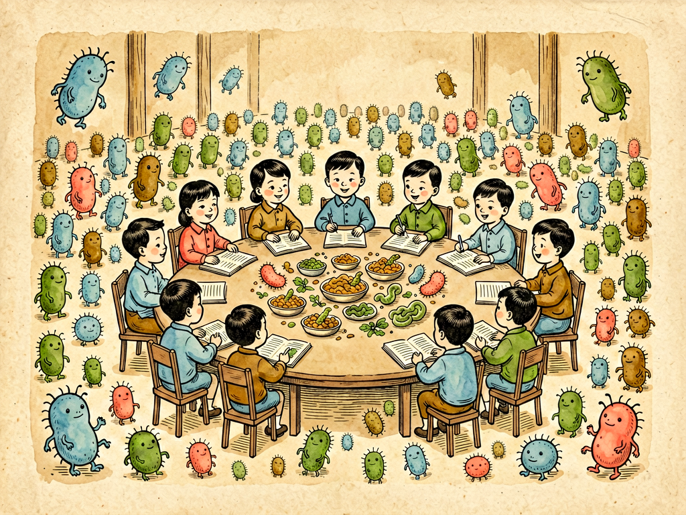

## 第十二章 肠腔里的会议

---

### 📍 本章导航
**核心主题**：肠道——38万亿细菌的"国会"，它们的决定影响你的一生  
**你将发现**：
- 肠道菌群数量比地球总人口还多，基因是人类的150倍
- 细菌真的"会开会"——通过群体感应集体决策
- 你吃什么，决定细菌"讨论什么"，进而决定你的健康
- 抗生素是菌群会议的"炸弹"，滥用后果严重
- 粪菌移植——医学史上最"重口味"也最有效的治疗方法之一

**阅读建议**：这一章会彻底改变你对细菌的认知——它们不只是"小东西"，而是和你共生的"合伙人"。

---

### 🖋️ 经典原文

过了食道、胃和小肠，我们菌儿终于到了整个旅程的"终点站"——大肠。如果说小肠是消化吸收的"工厂车间"，那大肠就是我们菌儿的"国会大厦"，是整个消化道里最热闹、最重要的地方。

我给你们报几个数字，你们就知道大肠里有多壮观了：
- 大肠只有1.5米长，但因为有结肠袋和绒毛，展开面积有差不多一个网球场那么大；
- 每克大肠内容物里，有1000亿到1万亿个细菌——这是什么概念？比地球上70多亿人口总数还多；
- 整个肠道里有大约38万亿个细菌——而你们人类自己的细胞才30万亿个。也就是说，从数量上讲，你身上60%是细菌，只有40%是"你"；
- 肠道细菌有1000多种，它们携带的基因总数是人类基因组的150倍——你们人类才2万多个基因，而肠道菌有300多万个基因。从基因角度讲，你们更是"少数派"。

所以别再说"我"了，"你"其实是"你和你的细菌"组成的超级有机体。

这么多细菌住在大肠里干什么？开会！没错，它们真的在开会——通过化学信号交流，通过代谢产物发言，通过群体感应投票，最后共同"决定"你的健康状况。

你以为这是我菌儿的拟人化修辞？不是的。细菌有一套叫"群体感应"（quorum sensing）的通讯系统：每个细菌都会分泌一种信号分子，细菌越多，信号分子浓度就越高。当浓度达到一个阈值，所有细菌就会"感知"到"大家都到齐了"，然后集体启动某些基因——比如同时分泌毒素、同时形成生物膜、同时发光、同时致病。就像议会开会要等法定人数到齐了才投票表决一样，细菌也有它们的"议事规则"。

我带你们看看这场"肠腔会议"的各位议员：
- **拟杆菌门**和**厚壁菌门**是两大执政党，占肠道菌群的90%以上。拟杆菌擅长分解复杂的碳水化合物和膳食纤维，厚壁菌擅长帮助吸收热量——这两派的比例和肥胖有关，胖人厚壁菌多，瘦人拟杆菌多；
- **双歧杆菌**和**乳酸杆菌**是"议长"——好脾气，主持公道，产生短链脂肪酸，抑制有害菌，训练免疫系统，是健康的"守护者"；
- **大肠杆菌**是"反对派兼信使"——正常情况下数量不多，不闹事，还能帮你合成维生素K；但如果数量失控或者跑到别的地方（比如尿道、血液），就会致病；
- **艰难梭菌**、**产气荚膜梭菌**、**具核梭杆菌**这些是"激进反对派"——平时被好菌压着不敢闹事，一旦菌群失调，它们就会趁机作乱，引起腹泻、肠炎甚至癌症。

这场会议每天讨论什么"议题"呢？
第一个议题，也是最重要的议题：**消化**。你们吃进去的膳食纤维，人自己是消化不了的——因为人没有分解膳食纤维的酶。这些膳食纤维到了大肠，就成了细菌的"口粮"。细菌发酵膳食纤维，产生**短链脂肪酸**——乙酸、丙酸、丁酸，这三样东西简直是"健康黄金"：丁酸是结肠上皮细胞的主要能量来源，营养肠壁，让肠壁更结实，防止"肠漏"；丙酸到肝脏调节糖代谢和脂代谢；乙酸进入外周循环，影响全身炎症水平。简单说：你吃蔬菜、水果、全谷物、豆类这些高纤维食物，细菌发酵后就产生这些"好议案"，让你健康；你天天吃高脂高糖低纤维的垃圾食品，细菌没东西吃，就只能被迫发酵蛋白质和脂肪，产生**三甲胺**、**吲哚**、**对甲酚**这些"坏议案"——三甲胺在肝脏被氧化成TMAO，会促进动脉粥样硬化，增加心脏病和中风风险；吲哚和对甲酚是致癌物，伤肝伤肾。

第二个议题：**免疫**。肠道是人体最大的免疫器官，70%的免疫细胞都在肠道。肠道菌群就像"军事演习"的假想敌——它们天天刺激免疫系统，让免疫细胞保持警惕，学会分辨"自己人"和"敌人"，分清"无害的食物"和"有害的病原体"。如果小时候菌群没建立好，没经过足够的"军事演习"，免疫系统就会"乱开枪"——对花粉过敏、对牛奶过敏、对尘螨过敏，甚至攻击自己的身体，得自身免疫病。

第三个议题：**代谢**。肠道细菌参与胆汁酸代谢，影响脂肪吸收；影响胰岛素敏感性，决定你会不会得糖尿病；甚至影响你胖不胖——有个著名的实验：把胖小鼠的肠道菌移植到无菌小鼠身上，无菌小鼠吃同样多的食物居然变胖了；把瘦小鼠的菌移植过去，小鼠就变瘦了。这就是"粪菌移植"的原理——把健康人的菌群"空降"到病人肠道里，相当于"换一批议员开会"。现在粪菌移植治疗**复发性艰难梭菌感染**的成功率高达90%——那种用了各种抗生素都治不好的严重腹泻，移植一次健康人的粪便细菌，很快就好了。听起来重口味，但真的救命。

第四个议题，也是现在最火的议题：**肠脑轴**。你们以为"心情不好"是大脑的事？不全是！肠道细菌能产生90%以上的5-羟色胺——就是那个让你开心、帮你调节情绪的"快乐神经递质"。细菌还能产生多巴胺、GABA这些神经递质的前体，通过迷走神经直接和大脑"打电话"。所以你的情绪、你的认知、你的睡眠，甚至你喜欢吃什么，都可能受肠道细菌影响——它们想吃什么，就分泌信号让你想吃什么。焦虑、抑郁、自闭症、帕金森病，这些看起来是"脑子的病"，现在发现很多都和肠道菌群失调有关。

什么时候这场会议会"开砸"？最常见的原因就是**抗生素**。抗生素就像在会议厅里扔了颗炸弹——不分好坏，把好菌坏菌一起炸死。很多人感冒发烧就自己吃抗生素，感冒是病毒引起的，抗生素根本没用，反而把肠道菌群炸得七零八落。好菌被炸死了，"反对派"艰难梭菌就趁机大量繁殖，分泌毒素，引起严重的伪膜性肠炎——拉肚子拉到脱水甚至死亡。抗生素引起的菌群失调，可能需要几个月甚至几年才能完全恢复。
第二个原因是**饮食**——天天吃高脂高糖低纤维的食物，好菌"饿死了"，坏菌"吃饱了"，菌群结构就变了；
第三个原因是**卫生过度**——天天用消毒洗手液、消毒湿巾，不让孩子接触泥土和自然环境，孩子小时候没接触足够的细菌，免疫系统没经过训练，就容易过敏、得哮喘；
第四个原因是**熬夜、压力大、生活不规律**——这些也会打乱菌群的节奏。

怎么让肠腔里的这场会议开得好？说起来很简单：
1. **多吃膳食纤维**——蔬菜、水果、全谷物、豆类、坚果，这是好菌的"口粮"。世界卫生组织建议每天吃25-30克膳食纤维，但大部分人只吃了一半不到；
2. **少吃超加工食品**——高糖、高油、高盐、含各种添加剂的食品，养坏菌不养好菌；
3. **适当吃发酵食品**——酸奶、泡菜、纳豆、康普茶，这些食物里有活的益生菌，相当于给肠道"补充新议员"；
4. **别滥用抗生素**——病毒感冒别吃抗生素，真要吃就遵医嘱吃满疗程，别自己随便停，也别自己乱吃；
5. **多接触自然**——别太干净，多去户外，多接触泥土，家里养点宠物，让孩子从小和微生物友好相处；
6. **规律作息少熬夜**——细菌也有生物钟，你熬夜它们也"加班"，乱了节奏就出问题。

大肠啊大肠，你盘在肚子里，不声不响，但里面住着38万亿个"议员"，它们每天开的会，决定着你的消化、你的免疫、你的代谢、你的情绪，甚至你的寿命。你怎么对待它们，它们就怎么对待你——你给它们吃蔬菜纤维，它们给你产生短链脂肪酸保你健康；你给它们吃垃圾食品，它们给你产生毒素让你生病。

记住：你不是一个人在生活，你是和38万亿个细菌合伙人一起生活。善待它们，就是善待你自己。

---

> 📜 **科学史话：从"细菌是敌人"到"细菌是合伙人"——微生物学的观念革命**
>
> 从巴斯德和科赫的时代开始，细菌一直被视为"敌人"——微生物学就是在和致病菌的战斗中发展起来的。所以整个20世纪，我们对细菌的态度就是"杀、杀、杀"——发明抗生素、发明消毒剂、发明灭菌技术，恨不得把身上所有细菌都杀光。
>
> 这个观念在最近20年发生了180度的大转弯。转折点是2001年人类基因组计划完成——科学家本来以为人类至少有10万个基因，结果测完发现才2万多个，还不如一只线虫多。科学家当时就疑惑了：这么点基因怎么能造出这么复杂的人？
>
> 2008年，美国国立卫生研究院启动了**人类微生物组计划**（Human Microbiome Project），花了1.7亿美元，花了5年时间，把人体各个部位的细菌都测了一遍序，结果震惊了全世界：我们身上有38万亿个细菌，300多万个细菌基因——原来我们不是"单个有机体"，而是"人+菌"组成的超级有机体（superorganism）。
>
> 然后就是一连串颠覆性的发现：细菌帮我们消化、帮我们合成维生素、帮我们训练免疫系统、甚至通过肠脑轴影响我们的情绪和行为。细菌不是我们的敌人，而是和我们一起进化了几百万年的共生合伙人——没有它们，我们根本活不下去。
>
> 从"杀菌"到"养菌"，从"对抗"到"共生"，这是过去100年医学观念最深刻的革命之一。

---

> 🔬 **科学更新：粪菌移植——从"偏方"到"标准疗法"**
>
> 粪菌移植听起来很"重口味"——把健康人的粪便处理后，移植到病人肠道里——但它其实不是什么新发明。早在1700多年前，东晋时期葛洪的《肘后备急方》里就记载了用"黄龙汤"（也就是人粪）治疗严重腹泻和食物中毒的方法；明朝李时珍的《本草纲目》里也有二十多种用粪便治病的方子。
>
> 但这个"偏方"被现代医学接受，还是最近十几年的事。2013年，粪菌移植被写入美国医学指南，成为治疗**复发性艰难梭菌感染**的标准疗法——那种用了各种抗生素都治不好、死亡率高达30%的严重腹泻，粪菌移植一次治愈率就超过90%，效果比抗生素好太多。
>
> 为什么粪菌移植这么有效？因为艰难梭菌感染的本质是肠道菌群被抗生素破坏了，好菌死光了，坏菌造反。这时候你用抗生素杀艰难梭菌，只会把好菌杀得更干净，停药就复发。而粪菌移植是"以菌治菌"——把健康人完整的菌群"空降"过去，重新建立菌群平衡，好菌回来了，自然就把艰难梭菌压下去了。
>
> 现在科学家正在研究用粪菌移植治疗更多疾病：炎症性肠病、肠易激综合征、肥胖、糖尿病、脂肪肝、抑郁症、自闭症、帕金森病，甚至过敏性疾病。虽然这些适应症还在临床试验阶段，但已经展现出了非常好的前景。
>
> 当然，粪菌移植不是万能的，也不是随便谁的粪便都能用——供体必须经过严格筛查，排除各种传染病、遗传病、代谢病，粪便也要经过严格处理才能用。千万别自己在家瞎试，一定要在正规医院做。
>
> 但不管怎么说，从"黄龙汤"到"粪菌移植"，从"偏方"到"标准疗法"，这个过程本身就告诉我们：老祖宗的智慧有时候和最前沿的科学是相通的——只是以前我们不知道背后的原理而已。

---

> 💡 **动手试一试：记录你的饮食和排便状况**
>
> 肠道健康最直接的反映就是你的排便状况。连续记录一周你的饮食和大便，就能大致了解你的菌群状态：
>
> **布里斯托大便分型法（Bristol Stool Scale）**：
> - 1-2型：硬球、香肠状但凹凸不平——便秘，喝水太少、膳食纤维不足，菌群发酵不够；
> - 3-4型：香肠状但表面有裂痕、光滑柔软像香肠或蛇——**最理想的香蕉便**，说明菌群健康、饮食合理；
> - 5型：软软的团块，边缘清楚——还可以，偏软；
> - 6-7型：糊状、水样——腹泻，可能菌群失调、感染或食物不耐受。
>
> 正常排便频率：每周3次到每天3次之间都算正常，关键是规律——排便频率突然改变，就要注意了。
>
> 观察要点：
> - 颜色：正常是黄褐色；黑色像柏油可能是上消化道出血，鲜红色可能是痔疮或下消化道出血，灰白色可能是胆道梗阻；
> - 气味：正常有臭味但不是恶臭；恶臭可能是蛋白质吃太多、消化不好或菌群失调；
> - 有没有黏液、脓血：如果有，一定要去医院检查。
>
> 同时记录你每天吃了什么——尤其是吃了多少蔬菜、水果、全谷物，喝了多少水，运动了多久。坚持一周，你就会发现饮食和排便的关系——吃够了膳食纤维，大便自然就通畅了。

---

### 💬 读后思考与讨论

1. "你身上60%是细菌，只有40%是你"——这个事实改变了你对"自我"的理解吗？什么才是"我"？
2. 细菌通过群体感应"开会"做决策——这算不算一种"社会行为"？你还知道哪些看起来"简单"的生物其实有复杂的社会行为？
3. 你吃什么决定细菌讨论什么，细菌的决定又影响你的健康、情绪甚至喜好——那到底是"你"在决定吃什么，还是细菌在"操纵"你吃什么？
4. 粪菌移植从"重口味偏方"变成"标准疗法"，这个过程给你什么启发？我们应该如何看待那些"听起来不科学"的传统疗法？
5. 从"杀菌"到"养菌"，人类对细菌的态度发生了180度转弯——这让你对"科学进步"有什么新的理解？科学为什么会"推翻自己"？

### 🔗 关联阅读
- 上一章：《食道的占领》→ 消化道入口
- 下一章：《清除腐物》→ 细菌作为"分解者"的地球生态角色
- 第二部第五章：《肠的运动》→ 肠道运动和消化生理
- 第三部第二十八章：《细菌的未来》→ 微生物学的未来方向
