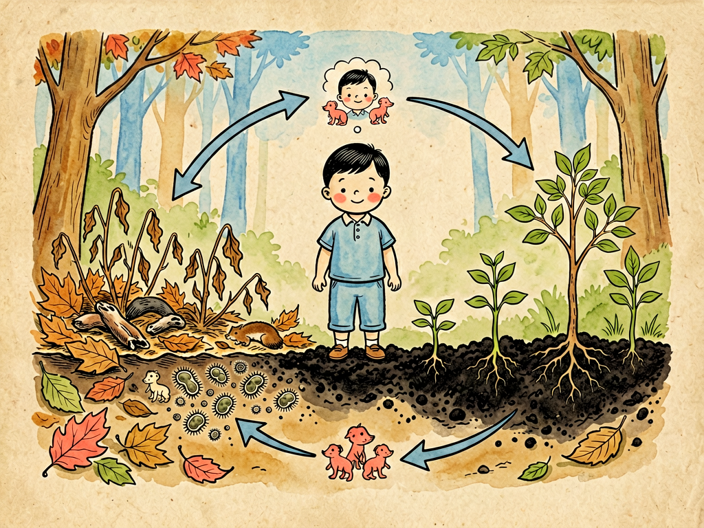

## 第十三章 清除腐物

---

### 📍 本章导航
**核心主题**：细菌不只是"敌人"——它们是地球的清道夫，是生态循环的核心  
**你将发现**：
- 如果没有细菌，地球早就被尸体和粪便堆满了
- 细菌如何把落叶变成沃土，把废物变成营养
- 碳循环、氮循环——没有细菌，整个地球生态系统会瘫痪
- 污水处理厂的"主角"其实是细菌
- 塑料为什么难降解？人类丢弃速度远超细菌演化速度

**阅读建议**：读完这一章，你会对"垃圾"和"废物"有全新理解——世界上没有真正的"废物"，只有放错地方的资源。

---

### 🖋️ 经典原文

讲了这么多菌儿怎么致病、怎么和人体互动，今天我要讲讲我们菌儿对地球最大的贡献——**清除腐物**。

你们知道吗？如果没有我们菌儿，地球早就死了。每年地球上有几千亿吨动植物死亡，几十亿吨动物粪便，无数枯枝落叶、食物残渣——如果这些东西都堆着不腐烂、不分解，用不了几百年，整个地球表面就会被尸体和粪便铺满，所有活的生物都无处立足。更重要的是，构成生命的碳、氮、磷、硫这些元素，都锁在这些有机物里，新的植物长不出来，新的动物也没法活——整个生态系统会彻底崩溃。

是我们菌儿，扮演了地球的"清道夫"角色。我们把死去的生物分解，把复杂的有机物拆成简单的无机物，把元素还给土壤、还给大气、还给水，让新的生命能重新利用这些元素。生命循环不息，全靠我们这一环。

我给你们讲讲我们是怎么工作的：
首先，我们分泌各种各样的**酶**——蛋白酶分解蛋白质，脂肪酶分解脂肪，淀粉酶分解淀粉，纤维素酶分解纤维素，木质素酶分解木头。这些酶就像一把把"化学剪刀"，把大的有机分子剪成小的：
- 蛋白质被剪成氨基酸，再变成氨——这叫**氨化作用**，氨是植物能吸收的氮肥；
- 碳水化合物被剪成葡萄糖，最后变成二氧化碳和水，二氧化碳回到大气，又能被植物用来光合作用；
- 脂肪被剪成甘油和脂肪酸，最后也变成二氧化碳和水；
- 纤维素和半纤维素是植物细胞壁的主要成分，只有我们菌儿和少数真菌有纤维素酶能分解它们——你们人就消化不了纤维素，只能让它们当"膳食纤维"穿肠而过；
- 最顽固的是木质素——木头的主要成分，结构特别复杂，只有少数真菌（比如白腐真菌）和我们少数细菌能慢慢分解它，最后变成腐殖质——土壤里黑黑的那层东西，是土壤肥力的核心。

光分解还不够，我们还要把这些元素"加工"成植物能吸收的形式，这就是**物质循环**：
- **碳循环**：植物通过光合作用把大气里的二氧化碳变成有机物，动物吃植物，动物和植物呼吸又把二氧化碳呼回大气；剩下的动植物尸体，就是我们菌儿分解，把剩下的碳也变成二氧化碳还回去——大气里的二氧化碳，有很大一部分是我们"呼"出来的；
- **氮循环**更精彩：空气里78%是氮气，但植物不能直接利用氮气。这时候**固氮菌**就出场了——它们有固氮酶，能把空气中的氮气变成氨，相当于"免费给土壤施氮肥"。然后**硝化细菌**再把氨变成硝酸盐，这是植物最爱吸收的氮形式。动植物死了，我们又把有机氮变回氨，循环使用。最后还有**反硝化细菌**，在缺氧环境下把硝酸盐变回氮气，回到大气——整个氮循环，每一步都离不开细菌；
- 还有磷循环、硫循环——这些生命必需元素的循环，几乎每一步都有我们菌儿的参与。

所以说，我们菌儿是地球的"消化系统"，也是地球的"化学家"。没有我们，物质循环断了，生命就没法延续。

而且分解工作不是一种细菌能完成的，它是一条"流水线"，大家分工合作：
- **初级分解者**：比如芽孢杆菌、链霉菌，它们先上，把蛋白质、糖类这些容易分解的东西先吃掉，把大分子切成小分子；
- **次级分解者**：比如假单胞菌、产碱杆菌，接着分解初级分解者留下的小分子；
- **终末分解者**：比如硝化细菌、产甲烷菌，做最后的"收尾工作"，把所有东西都变成无机物回到环境；
- 真菌是我们的重要搭档——霉菌、酵母菌，尤其是分解木头的担子菌，它们的菌丝能扎进木头深处，比我们细菌更容易分解顽固物质。

大家你帮我、我帮你，形成一个复杂的菌群网络，把腐物彻底分解干净。

我再跟你们讲讲我们菌儿怎么帮人类"清除腐物"：
第一个是**污水处理**。你们城市每天产生那么多污水——粪便、厨余污水、工业废水，最后怎么变干净的？核心就是**活性污泥法**：污水进到曝气池，里面有大量我们细菌组成的"活性污泥"，鼓风机往水里不停打气供氧，我们就拼命"吃"污水里的有机物，把脏东西都吃掉了，水就变干净了。然后污泥沉淀下来，一部分回流到曝气池继续工作，剩下的经过处理可以当肥料。一杯干净的自来水背后，是无数细菌在加班工作——你拧开水龙头接的水，都有我们的功劳。
第二个是**堆肥**。落叶、厨余、秸秆、粪便，堆在一起，通气、浇水，我们菌儿就在里面生长繁殖，发热、分解，几周几个月之后，这些"垃圾"就变成了黑黑的、香香的腐殖质——也就是有机肥，是最好的土壤改良剂。你们施有机肥，其实就是在给土壤"喂菌"，同时给土壤菌"送粮食"。
第三个是**沼气**。在厌氧（没有氧气）的环境里，我们的另一类兄弟——**产甲烷古菌**——会把有机物分解成甲烷（也就是沼气）。农村的沼气池，就是把粪便、秸秆放进去，密封起来，我们在里面产沼气，可以点灯、做饭、发电，剩下的沼渣沼液还是很好的有机肥——这是真正的"变废为宝"。
第四个是**生物修复**。如果土壤或水被石油、农药、化工废料污染了，怎么办？我们有些菌儿能"吃"这些污染物——比如石油降解菌能把石油分解成二氧化碳和水，某些菌能分解农药、分解染料、甚至吸附重金属。现在科学家还在培养能"吃"塑料的细菌——2016年日本科学家发现了一种叫**Ideonella sakaiensis**的细菌，能分泌PET酶，分解塑料瓶用的PET塑料，虽然现在分解速度还很慢，但这是个好开始。

不过我也要实话实说：我们菌儿不是万能的。有些"腐物"我们真的清不掉——
第一个就是**塑料**。塑料是人类发明的高分子聚合物，在自然界存在才几十年——对我们菌儿来说，几十年太短了，我们还没来得及演化出分解塑料的酶。一个普通PET塑料瓶，在自然环境里要400-500年才能完全降解；塑料袋要200年；塑料 fishing line 要600年。你们人类每年生产几亿吨塑料，大量流进海洋，形成"太平洋垃圾带"，被鱼、海鸟吃了，最后又回到你们自己的餐桌上——这不是我们菌儿偷懒，是你们丢得太快、太多，我们演化的速度赶不上你们生产的速度；
第二个是**重金属**。重金属是元素，我们没法"分解"元素，只能吸附它们、富集它们——这叫"生物吸附"，可以用来处理重金属废水，但没法把它们变没；
第三个是**放射性物质**。我们也没法分解放射性核素，只能富集它们——比如切尔诺贝利核电站事故后，科学家发现有些真菌居然能在高辐射环境下生长，甚至利用辐射能量，但它们不能"消灭"放射性。

说到这里，我要给你们人类提几个建议：
第一，**做好垃圾分类**。把厨余垃圾分出来，送去堆肥或者产沼气，这是给我们菌儿"派活"，让我们有工作做，把废物变成资源；把可回收物分出来循环利用，这是给我们"减负"；把有害垃圾分出来专门处理，别让它们污染环境；
第二，**少用一次性塑料**。塑料袋、塑料瓶、塑料吸管、塑料餐具——能不用就不用，能重复用就重复用。你们少生产一点难降解的东西，我们菌儿的压力就小一点，地球的压力也小一点；
第三，**农业上多施有机肥，少用化肥农药**。化肥虽然见效快，但长期用会杀死土壤里的有益菌，让土壤板结、地力下降。有机肥养菌，菌养土壤，土壤养作物——这才是可持续的循环；
第四，**你们自己的肠道里也有"清道夫"**——也就是你们的肠道菌群。多吃膳食纤维，给它们"发工资"，它们就会好好工作，帮你们分解食物残渣、合成维生素、清除有害物质。你不给它们吃够纤维，它们没东西吃，就会"吃"你肠壁上的黏液，破坏肠屏障，让你生病。

我们菌儿在地球上活了35亿年，比人类早得多。过去35亿年里，我们一直默默地当地球的清道夫，把死亡变成新生，把废物变成资源。人类啊，你们不是地球的主人，只是地球生命循环里新来的一员。学会和我们合作，学会尊重物质循环，学会把废物变回资源——这才是长久生存之道。

落叶归根，不是叶落了就结束了——是我们菌儿把叶子拆开，让它变成树的营养，明年再长出新的叶子。死亡不是终点，是循环的中间站——而我们菌儿，就是这个循环的"摆渡人"。

---

> 📜 **科学史话：从"自然发生说"到巴斯德——"腐物生菌"还是"菌腐物"？**
>
> 古代人看到肉放久了会长蛆，落叶放久了会腐烂，伤口会化脓，就以为生物可以从无生命的物质里自然长出来——这就是"自然发生说"。亚里士多德就相信，萤火虫是从晨露里长出来的，虱子是从汗水里长出来的，蛆是从腐肉里长出来的。
>
> 这个观念统治了西方近2000年。直到17世纪，意大利医生雷迪做了个实验：把肉放在两个瓶子里，一个瓶口敞开，一个用纱布封住。结果敞开的瓶子里肉长蛆了，封纱布的瓶子里肉也腐烂了，但没有蛆——因为苍蝇飞不进去，没法在肉上产卵。这证明蛆不是腐肉"变"的，是苍蝇卵孵化的。
>
> 但显微镜发明后，人们看到了细菌，又有人说：大的生物不能自然发生，细菌这么小的微生物总可以吧？
>
> 最后终结"自然发生说"的还是巴斯德。1864年，他做了著名的"鹅颈瓶实验"：把肉汤煮沸腾灭菌，然后放在S型的鹅颈瓶里——空气能进去，但带菌的灰尘会弯在鹅颈底部，进不去肉汤。结果肉汤放了四年都没坏；把鹅颈打断，肉汤几天就坏了。
>
> 这个实验彻底证明：不是腐物自然生出细菌，而是细菌落在腐物上，才让腐物腐烂。细菌不是"腐物的孩子"，而是"腐物的分解者"。
>
> 搞清楚"菌让东西腐烂"而不是"腐烂生菌"，是微生物学的起点。也是从那以后，人们才明白：既然细菌能让肉腐烂、让落叶分解，那它们一定也在自然生态里扮演着重要角色——这才有了后来对碳循环、氮循环的认识。

---

> 🌍 **现实连接：塑料问题——我们给细菌出了一道演化难题**
>
> 从20世纪50年代塑料大规模生产开始，人类已经生产了超过90亿吨塑料，其中一半以上是过去20年生产的。这些塑料里，只有不到10%被回收利用，大约12%被焚烧，剩下近80%都进了垃圾填埋场或者自然环境。
>
> 为什么塑料这么难降解？因为塑料是人类设计出来的高分子聚合物，化学键非常稳定，在自然界里根本不存在"天然"的塑料，所以细菌也没有演化出专门分解塑料的酶。就像你从来没见过钥匙，自然也不会有开这把锁的钥匙。
>
> 但细菌最厉害的地方就是演化快——它们繁殖一代只需要几十分钟，突变率高，还能通过水平基因转移互相交换基因。所以虽然塑料才出现几十年，已经有细菌开始"学"着分解塑料了：
> - 2016年日本科学家在垃圾场发现了*Ideonella sakaiensis*，能分泌PET酶，6周能分解一层薄的PET塑料膜；
> - 2020年科学家又改造了这个酶，让分解效率提高了10000倍——10小时就能分解90%的PET；
> - 现在科学家还发现了能分解聚乙烯、聚丙烯、聚氨酯甚至聚苯乙烯（泡沫塑料）的细菌和真菌。
>
> 但这些实验室里的成果，离大规模应用还很远——分解速度还是太慢，而且自然环境里温度、pH、营养条件都和实验室不一样，这些工程菌到了自然环境里能不能活、能不能工作，都是问题。
>
> 真正的解决办法，不是等细菌演化出分解塑料的能力，而是人类自己减少塑料使用、做好回收、发明真正可降解的生物塑料。毕竟——与其让细菌花几百年"补课"，不如我们少扔点垃圾，不是吗？

---

> 💡 **动手试一试：在家做一个堆肥瓶**
>
> 你可以在家亲眼看看细菌怎么分解有机物，制作一个"迷你堆肥瓶"：
>
> **材料**：一个大的透明塑料瓶（剪掉上面锥形部分）、泥土、落叶、厨余垃圾（菜叶、果皮、咖啡渣，不要肉、油、盐）、水、喷壶
>
> **步骤**：
> 1. 在瓶子最底层铺3厘米厚的泥土；
> 2. 然后铺一层撕碎的落叶和厨余，喷点水弄湿（不要积水，像拧干的海绵一样湿就行）；
> 3. 再铺一层薄土，再铺一层厨余落叶，再铺土——像做三明治一样一层层堆起来，最上面一层是土；
> 4. 用保鲜膜松松地盖住瓶口，留个小口透气；
> 5. 放在通风阴暗的地方，每隔几天喷点水保持湿润，每隔一两周用筷子翻一翻通气。
>
> **观察**：
> - 过一两周，你会看到瓶子里发热——这是细菌在工作，分解有机物释放热量，堆肥内部温度能升到50-60℃，还能杀死病菌和虫卵；
> - 你会看到落叶和果皮慢慢"消失"，最后整个瓶子里变成黑黑的、松松的、有泥土味的东西——这就是腐殖质，最好的花肥；
> - 如果有白色的菌丝，那是真菌在帮忙分解，是好事；如果有臭味，说明太湿或者不透气，翻一翻、加点干树叶就好了。
>
> 一般2-3个月，你就能得到一瓶自制有机肥，可以用来种花种菜。亲手看看"垃圾变沃土"的过程，你就明白细菌有多厉害了。

---

### 💬 读后思考与讨论

1. 如果没有细菌，地球会是什么样子？为什么说"细菌是地球生命的基石"？
2. 碳循环、氮循环每一步都离不开细菌——这让你对"万物循环"有什么新的理解？为什么说"世界上没有真正的废物"？
3. 从"自然发生说"到"鹅颈瓶实验"，人类花了2000年才搞清楚"不是腐烂生菌，而是菌让东西腐烂"——为什么"眼见不一定为实"？
4. 塑料问题的本质是"人类生产垃圾的速度超过了细菌演化的速度"——这个问题应该怎么解决？技术进步（比如能分解塑料的细菌）能从根本上解决问题吗？
5. 在家做堆肥和把厨余扔去填埋，本质区别是什么？为什么说"垃圾分类是敬菌"？

### 🔗 关联阅读
- 上一章：《肠腔里的会议》→ 人体内的细菌"社会"
- 下一章：《土壤革命》→ 土壤微生物如何改变农业和文明
- 第二部第十四章：《土壤里的劳动者》→ 深入了解土壤微生物
- 第三部第二十九章：《生物的未来》→ 细菌技术如何改变未来
