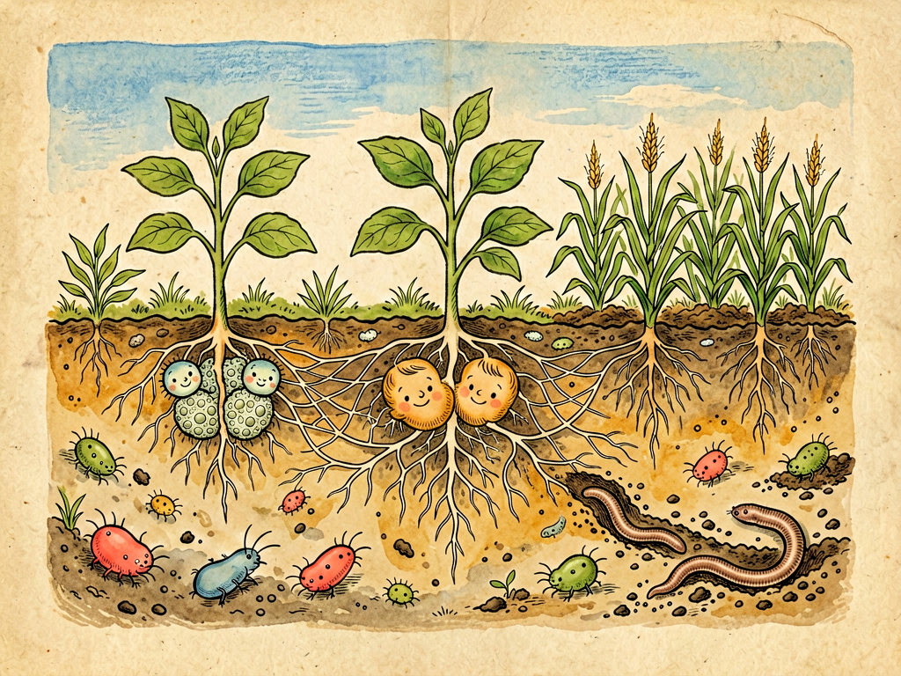

## 第十四章 土壤革命

---

### 📍 本章导航
**核心主题**：土壤不只是"泥巴"——它是活的，细菌是土壤的灵魂  
**你将发现**：
- 一克土里的细菌比地球人口还多，土壤是地球"活的皮肤"
- 根瘤菌是"免费化肥厂"，豆科植物为什么能肥田
- 菌根真菌是植物的"外接互联网"，帮植物找水找营养
- 形成1厘米表土要200-1000年，破坏它只要一季
- 为什么说现代农业的"绿色革命"其实是"以菌为本"

**阅读建议**：读完这一章，你走在路上会忍不住多看脚下的土地几眼——那不是死泥巴，是一个比人类社会复杂得多的生命世界。

---

### 🖋️ 经典原文

讲完了我怎么在地球上当清道夫，今天我带你们去地下——看看我工作的另一个重要地方：**土壤**。

如果说地球是一个活的生命体，那么土壤就是地球的皮肤。而我们菌儿，就是这张皮肤上的细胞。一克肥沃的森林土里，有10亿到100亿个细菌——比地球总人口还多；还有几十万条线虫、几十万原生动物、几米到几十米长的真菌菌丝。你随便在路边挖一铲土，里面的微生物数量比人类历史上所有出生过的人加起来还多。

土壤不是死的泥巴，是活的。没有我们菌儿，就没有土壤；没有土壤，就没有陆地上的植物，也就没有陆地上的动物，更不会有人类。

我给你们讲讲我们在土壤里都干些什么。土壤里的菌儿有明确的"职业分工"，大家各司其职，组成了一个复杂的"地下社会"：
- **分解者**：也就是腐生菌，比如链霉菌、芽孢杆菌，它们是土壤里的"清洁工"，负责把枯枝落叶、动植物尸体分解成腐殖质，就像上一章讲的那样；
- **固氮者**：比如根瘤菌、自生固氮菌，它们是"化肥厂工人"，能把空气里78%的氮气变成植物能吸收的氨——空气里那么多氮，但植物就是用不了，全靠我们帮忙；
- **硝化者**：硝化细菌，它们把固氮菌产生的氨再变成硝酸盐——这是植物最爱吸收的氮形式；
- **解磷菌、解钾菌**：土壤里有很多磷和钾，但都是不溶于水的，植物吸收不了，这些菌儿能把它们变成能溶于水的形式，给植物"开小灶"；
- **菌根真菌**：这是最厉害的角色，它们不是细菌，是真菌，但和我们细菌合作得很好。菌根真菌的菌丝会缠在植物根上，甚至扎进根细胞里，然后菌丝向外延伸，能到达根到不了的地方，把植物根的吸收面积扩大100到1000倍——帮植物找水、找磷、找各种微量元素。作为回报，植物把光合作用产生的糖分分给真菌吃。这是一种双赢的共生关系，地球上90%以上的陆生植物都有菌根真菌帮忙——没有菌根，大部分植物根本活不好。你们在林子里看到的蘑菇，很多就是这些菌根真菌长出来的"果实"；
- **益生菌和生防菌**：比如枯草芽孢杆菌、假单胞菌，它们住在植物根周围，分泌抗生素杀死致病菌，还能刺激植物的免疫系统，帮植物抗病——相当于植物的"私人医生"和"保镖"。

你们知道我在土壤里主导过几场大"革命"吗？
第一场革命，是**腐殖质的形成**。几亿年前，植物第一次登上陆地，枯枝落叶堆积在地表，是我们菌儿慢慢把它们分解，和矿物质混合在一起，形成了腐殖质——就是土壤里黑黑的、松松的、有营养的那层东西。腐殖质是土壤肥力的核心，它能保水、保肥、透气，还能给微生物提供家园。更重要的是，腐殖质是巨大的"碳汇"——全球土壤里储存的碳是大气里碳的3倍，如果土壤里的碳都被释放出来，全球变暖会加剧好几倍。

第二场革命，是**固氮革命**。氮是植物生长最需要的元素，蛋白质、DNA都需要氮。空气里78%是氮气，但氮气是惰性气体，植物没法直接用。直到我们菌儿演化出了**固氮酶**——这个酶非常厉害，能在常温常压下把氮气切开，变成氨。要知道，人类发明工业固氮（哈伯法）要在几百摄氏度、几百个大气压下才能做到，我们菌儿在常温常压下就做到了——而且已经做了二十几亿年。
尤其是**根瘤菌**和豆科植物的共生，简直是进化的奇迹：豆科植物的根会分泌类黄酮信号，"召唤"土壤里的根瘤菌；根瘤菌收到信号，就游到根毛那里，分泌一种叫"结瘤因子"的物质，让根毛卷曲，然后根瘤菌就钻进根里；植物感受到根瘤菌进来了，就开始分裂细胞，长出一个个小瘤子——这就是"根瘤"。根瘤里面是植物给根瘤菌准备的"房子"和"粮食"（糖分），根瘤菌就在里面安心"工作"，把空气中的氮气变成氨，源源不断供给植物。收完豆子把豆藤翻进土里，根瘤里剩下的氮就留在土壤里肥田——所以老祖宗早就知道"种豆肥田"，只是不知道背后是我们根瘤菌在干活。
现在全世界每年生物固氮大约有2亿吨——比人类工业生产的化肥还多，而且完全免费，不污染环境。

第三场革命，是**菌根革命**。几亿年前植物能从水里登上陆地，全靠菌根真菌帮忙——那时候植物还没有真正的根，全靠真菌菌丝帮它们吸收水分和矿物质。直到今天，90%的植物还是离不开菌根真菌。更神奇的是，菌根真菌的菌丝能把不同植物的根连在一起，形成一个"地下互联网"——叫"菌根网络"（Wood Wide Web）。通过这个网络，大树能把养分送给小树，植物之间能互相传递警告信号（比如"虫子来了，快分泌毒素！"），甚至能"认"出自己的亲戚，给亲戚优先送营养。森林不是一个个单独的树，而是一个通过菌根网络连在一起的超级有机体——这个发现彻底改变了人类对森林的理解。

第四场革命，是现在正在发生的**农业革命**——或者说"绿色革命"。过去一百年，人类发明了化肥、农药、除草剂，确实让粮食产量翻了好几倍，养活了更多人，但也付出了沉重的代价：
- 长期大量施用化肥，土壤板结、酸化、盐碱化，我们菌儿活不下去了，土壤酶活性下降，地力越来越差，结果就是越施化肥产量越低，越产量低越施化肥，形成恶性循环；
- 广谱杀菌剂、杀虫剂、除草剂，杀死致病菌和害虫的同时，也把我们这些有益菌、真菌、蚯蚓一起杀死了；
- 单一种植、连作障碍，让土壤里特定的病原菌越来越多，有益菌越来越少；
- 表层沃土被冲走、被风吹走，土壤退化——形成1厘米厚的表土需要200到1000年，但暴雨一季就能冲走好几厘米。
- 没有菌的土壤，就是"死土"——不透气、不保水、没营养，种什么都长不好。

现在越来越多的人意识到了这个问题，开始回归"以菌为本"的农业：用根瘤菌剂、菌根菌剂、解磷菌剂这些"生物肥料"代替部分化肥；用苏云金芽孢杆菌（Bt）、枯草芽孢杆菌这些"生物农药"代替部分化学农药；多施有机肥、堆肥，秸秆还田，给我们菌儿"送粮食"；轮作、间作、休耕，让我们有时间恢复。

这不是"回到古代"，这是螺旋式上升——用现代微生物学知识，重新建立人类、植物、土壤、微生物之间的平衡。

我给你们这些人类提几个建议，不管你是不是农民：
第一，**尊重脚下的土壤**。土壤是不可再生资源，几百年才长1厘米，别浪费它。少用一次性筷子、节约用纸、支持有机农业，都是在保护土壤；
第二，**家里种花种菜，多用有机肥少用化肥**。你去花市买的那些营养土，里面加了很多泥炭和椰糠，但更重要的是要有活的微生物。可以自己做点堆肥，或者买点菌剂，土里有菌，花才能长好；
第三，**不要"过度卫生"到连泥土都不让孩子碰**。泥土里有大量微生物，孩子小时候玩玩泥巴，接触这些微生物，能训练免疫系统，减少过敏和哮喘的风险。现在很多研究发现，在农村长大、经常接触泥土和牲畜的孩子，过敏和自身免疫病发病率比城里孩子低很多——这就是"卫生假说"；
第四，**支持可持续农业**。买食物的时候，多看看来源，尽量选择用环保方式种植的产品——你的选择，会影响土壤的未来。

你们中国人常说"叶落归根"，这句话太对了。叶子从树上长出来，落回土里，被我们菌儿分解，变成养分，又被树根吸收，明年再长出新的叶子——这就是循环。土地不是用来"榨取"的，是用来"滋养"的。你滋养土地，土地就滋养你；你榨取土地，土地最后就什么都不给你了。

脚下这一寸土，看起来平凡，实际上藏着地球最大的秘密。我们菌儿在土里活了35亿年，见证了植物登陆，见证了恐龙兴亡，见证了人类从猿变成人。我们会一直在土里——不管人类怎么折腾，只要我们还在，生命就会一直循环下去。

---

> 📜 **科学史话：从"豆科肥田"到根瘤菌发现——看不见的共生关系**
>
> 中国农民早在春秋战国时期就知道"种豆肥田"——种一季豆子，下一季即使不施肥，庄稼也长得好。但为什么会这样？没人知道。同样的现象欧洲农民也发现了，但直到19世纪，这个秘密才被解开。
>
> 1838年，法国农业化学家布森戈第一个通过科学实验证明：豆科植物能增加土壤里的氮含量，而禾本科植物（小麦、水稻）不能。但氮是哪里来的？他以为是从空气里来的，但怎么来的？
>
> 1886年，德国科学家赫尔利格尔和惠尔法特做了个经典实验：他们把豌豆种在灭菌的土里，结果豌豆长得很差，也不结根瘤；但只要加一点普通土壤的浸出液，豌豆就会长根瘤，长得很好。这说明根瘤的形成和土壤里的某种微生物有关。
>
> 1888年，荷兰科学家贝杰林克——就是后来发现病毒的那位——第一次从根瘤里分离出了根瘤菌，并且证明了就是这些细菌在固氮。
>
> 这一发现轰动了整个科学界——原来植物和细菌不是简单的"谁吃谁"关系，还能这样紧密地共生，互相交换营养。后来人们又发现了菌根真菌，发现了植物和微生物之间更多的共生关系，整个农业和生态学的观念都改变了。
>
> 现在回头看，中国农民用了几千年的"种豆肥田"和"堆肥"，其实都是在无意识地利用微生物——只是那时候他们不知道，是小小的细菌在帮他们干活。传统经验和现代科学之间，经常隔了一层"显微镜"。

---

> 🔬 **科学更新：菌根网络——森林里的"地下互联网"**
>
> 1997年，加拿大科学家苏珊·西马德（Suzanne Simard）在《自然》杂志上发表了一篇划时代的论文：她用同位素标记的方法证明，纸皮桦和花旗松这两种不同的树，通过地下的菌根真菌菌丝网络，能互相交换碳——纸皮桦给花旗松送碳，花旗松也给纸皮桦送碳，尤其是在树荫下被遮挡的小树，能从大树那里收到相当多的碳。
>
> 这一发现彻底颠覆了人们对森林的认知：原来树不是独立的个体，它们通过菌根网络连在一起，形成一个巨大的"超级有机体"。后来更多研究发现，这个"Wood Wide Web"（森林万维网）功能比我们想象的还多：
> - **资源共享**：大树给小树送碳、送氮、送磷，帮小树度过最脆弱的幼苗期。研究发现，那些和母树通过菌根网络连在一起的小树，存活率是没连在一起的小树的4倍；
> - **信号传递**：当一棵树被蚜虫攻击时，它会通过菌根网络向其他树发送信号，收到信号的树就会提前分泌防御性化学物质，准备抵抗蚜虫；
> - **亲缘识别**：树能认出谁是自己的"亲戚"，给自己的后代送更多营养，给自己的亲戚更多"网络带宽"；
> - **"树妈妈"**：森林里最老最大的树——也就是"母树"——是整个菌根网络的中心，它们连接着最多的小树，管理着整个森林的资源分配。把母树砍了，整个网络都会受到严重破坏。
>
> 这也解释了为什么原始森林比人工林更健康、更有抵抗力——人工林都是同年龄、同树种的树，菌根网络简单，甚至因为造林前翻土消毒，菌根真菌都被杀死了，树都是"各自为战"；而原始森林有复杂的菌根网络，树和树之间互相帮助，整个生态系统更稳定。
>
> 苏珊·西马德说过一句话："森林不是关于'适者生存'的，而是关于'互相连接'的。"——这句话不仅适用于森林，也适用于整个自然界，包括我们人类。

---

### 💬 读后思考与讨论

1. "一克土里的细菌比地球总人口还多"——这个事实让你对脚下的土地有什么新的认识？你还忽略了哪些"看不见的世界"？
2. 根瘤菌和植物、菌根真菌和植物的共生关系，改变了你对"自然界生存法则"的理解吗？自然界是不是只有"弱肉强食"？
3. 形成1厘米表土需要几百年，破坏它只要一季——土壤是"不可再生资源"这个说法让你意外吗？我们能为保护土壤做什么？
4. 森林里的树通过菌根网络互相帮助、甚至"照顾后代"——这改变了你对"植物"的印象吗？我们是不是太低估了非人类生命的复杂性？
5. 中国农民用了几千年"种豆肥田"，但直到19世纪才知道背后是根瘤菌——你还知道哪些"传统经验后来被科学证实"的例子？这给你什么启发？

### 🔗 关联阅读
- 上一章：《清除腐物》→ 细菌作为地球清道夫
- 下一章：《经济关系》→ 细菌和人类更广泛的经济与文明关系
- 第二部第十三章：《土壤的劳动者》→ 深入了解土壤微生物
- 第三部第二十五章：《农业的起源》→ 从微生物角度看农业文明
