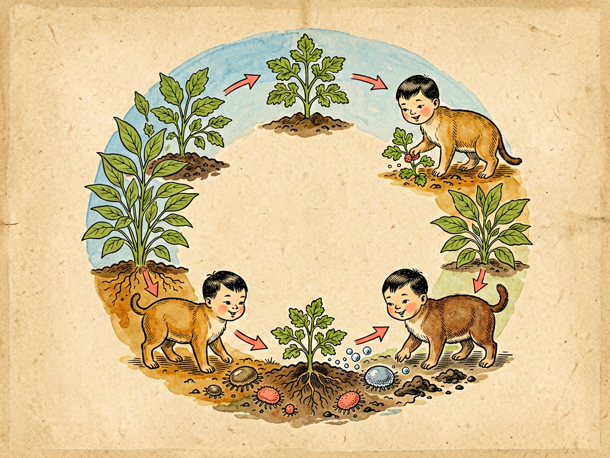

## 第十五章 经济关系

---

### 📍 本章导航
**核心主题**：细菌是地球最古老的"经济学家"——它们的"经济哲学"值得人类学习  
**你将发现**：
- 你吃的酱油、醋、酸奶、酒、面包、奶酪、味精，都是细菌"生产"的
- 抗生素、维生素、疫苗，医药工业离不开细菌
- 污水处理、土壤改良、生物能源，环保和能源也靠细菌
- 细菌的经济学是"循环经济"——零废弃、共享、合作、可持续
- 人类的"反菌经济"——滥用抗生素、化肥、农药、消毒剂——正在自毁长城

**阅读建议**：这是第一部"菌儿自传"的收官章。读完这一章，你会理解：为什么向细菌学习，是人类文明可持续发展的必修课。

---

### 🖋️ 经典原文

讲完了土壤，今天是我"菌儿自传"的最后一章——我想和你们聊聊**经济关系**。

你们人类一提到"经济"，想到的就是货币、市场、贸易、工厂、GDP。但你们知道吗？在人类出现之前几十亿年，我们菌儿早就建立了一套完整的"经济体系"——而且是你们人类目前还做不到的、真正可持续的循环经济。

你们可能觉得我吹牛：细菌那么小，连脑子都没有，懂什么经济？别急，听我慢慢说。

首先，我们是地球最古老的**劳动者**。35亿年来，我们一天都没休息过——分解有机物、固氮、硝化、产氧、合成有机物、参与碳氮磷硫各种物质循环，这些工作我们做了几十亿年。没有我们的劳动，就没有土壤，没有植物，没有动物，更不会有人类。

其次，我们有最完整的**经济活动全谱**：
- **生产活动**：我们生产蛋白质、氨基酸、维生素、抗生素、酶、短链脂肪酸——你们需要的很多生物产品，我们都能生产。你们现在用的胰岛素、干扰素、很多疫苗，都是用转基因大肠杆菌或者酵母菌生产的；我们还能生产乙醇、乳酸、醋酸、丙酮、丁醇这些化工原料，生产甲烷、氢气这些能源；
- **消费活动**：我们消费各种有机物和无机物——动物植物尸体、粪便、枯枝落叶、甚至岩石里的矿物质。但我们的消费不是"浪费"，而是把物质重新送回循环；
- **贸易活动**：我们菌儿之间有发达的"贸易网络"——一种菌的代谢废物，是另一种菌的"食物"，这叫"交叉喂养"（cross-feeding）。比如甲烷菌吃不了复杂有机物，就靠产酸菌把大分子分解成有机酸，它再吃有机酸产甲烷；植物和菌根真菌做"贸易"——真菌给植物送磷送水，植物给真菌送糖分；根瘤菌和豆科植物做"贸易"——细菌给植物固氮，植物给细菌提供住房和糖分；你们人类和肠道菌做"贸易"——细菌帮你们消化食物、合成维生素、训练免疫系统，你们给细菌提供栖息地和食物。整个生态系统，就是一张巨大的贸易网络；
- **投资活动**：我们也会"投资未来"——分泌胞外多糖建生物膜，给整个菌群一个安全的"家"，这是基础设施投资；在环境恶劣的时候形成芽孢，把基因保存下来，等环境好了再复活，这是风险储备；通过接合、转化、转导互相交换基因，共享有用的"技术专利"（比如耐药基因），这是研发投资；
- **竞争活动**：当然我们之间也有竞争——抢营养、抢地盘、分泌抗生素杀死竞争对手，就像你们的市场竞争。但我们的竞争是"有限竞争"，不会把对手赶尽杀绝，更不会把整个环境破坏掉——因为我们知道，环境毁了，大家都活不了。

最重要的是，我们的经济是**真正的循环经济**，不是你们现在搞的"资源→产品→废物"这种线性经济。在我们的经济体系里，没有"废物"这个概念——所有东西都是资源，一个生物的废物是另一个生物的食物。碳从大气到植物到动物到我们，又回到大气；氮从空气到根瘤菌到植物到动物到我们，又回到空气；磷、硫、水，所有物质都在循环，没有浪费，没有污染——这套系统我们运行了35亿年，从来没出过问题。

你们人类现在的经济才发展了几百年，就把地球搞得乌烟瘴气——资源枯竭、环境污染、气候变暖、生物多样性丧失，就是因为你们学不会循环，只会"挖了用，用了扔"。

我再给你们盘点盘点，你们人类现在有多少产业，其实是在"雇佣"我们菌儿干活——只是很多人不知道而已：
第一个是**食品工业**。你们吃的东西里，几乎都有我们的功劳：
- 酿酒——酵母菌把糖变成酒精和二氧化碳，所以才有白酒、啤酒、葡萄酒；
- 做醋——醋酸菌把酒精氧化成醋酸，醋就酸了；
- 做酱油——米曲霉、酵母菌、乳酸菌三种菌合作，米曲霉分解蛋白质产鲜味，酵母菌产香气，乳酸菌产酸味，一瓶好酱油是三种菌的"合资企业"；
- 做酸奶、奶酪——乳酸菌把乳糖变成乳酸，牛奶就凝固变酸了；做奶酪还要加丙酸菌产气孔和特殊风味，加青霉产生蓝纹；
- 做泡菜、酸菜——乳酸菌发酵，产生乳酸和特殊风味，还能防腐；
- 做面包——酵母菌发酵产生二氧化碳，面包才会蓬松；
- 做味精——谷氨酸棒杆菌发酵产生谷氨酸，也就是你们说的鲜味；
- 做腐乳、臭豆腐——毛霉、青霉、乳酸菌一起作用，把豆腐发酵出特殊风味；
- 甚至茶里的普洱茶、红茶，也是发酵的——真菌和细菌参与发酵，产生特殊的香气和口感。
可以说，没有我们菌儿，你们的"舌尖上的中国"至少少一半精彩。

第二个是**医药工业**。你们能活到今天，很大程度上靠我们：
- 抗生素——青霉素、链霉素、红霉素、头孢、四环素……几乎所有抗生素都是我们（包括真菌）生产的。弗莱明发现青霉素之前，一个小伤口感染就能死人；有了抗生素，人类平均寿命提高了至少20岁；
- 疫苗——很多疫苗是用减毒或者灭活的细菌做的，现在的重组疫苗很多也是用大肠杆菌或者酵母生产的；
- 维生素——B族维生素、维生素K很多都是细菌发酵生产的，你们肠道里的细菌还能直接给你们合成维生素K和部分B族维生素；
- 酶制剂——溶菌酶、链激酶（溶血栓）、天冬酰胺酶（治白血病），还有你们洗衣粉里的蛋白酶、脂肪酶，都是细菌生产的；
- 现在最火的**益生菌**——双歧杆菌、乳酸杆菌这些，直接吃进去调节肠道菌群，已经是一个巨大的产业；还有粪菌移植，未来可能治疗更多疾病。

第三个是**农业**。上一章讲过，生物肥料（根瘤菌剂、菌根菌剂、解磷菌剂）、生物农药（Bt、枯草芽孢杆菌）、饲料益生菌、沼气、堆肥，全靠我们菌儿。

第四个是**环保产业**。污水处理厂的活性污泥靠我们，垃圾堆肥靠我们，污染土壤的生物修复靠我们——我们能"吃"石油、"吃"农药、"吃"塑料，吸附重金属。我们是地球的清洁工，也是你们环保产业的核心劳动力。

第五个是**未来能源**。沼气（甲烷）、生物乙醇、生物柴油、生物制氢、微生物燃料电池——未来的可再生能源，很多都要靠我们菌儿。用微生物把秸秆、木屑、甚至二氧化碳变成燃料，既不污染环境，又能循环利用，这才是真正可持续的能源。

据估计，到2030年，全球生物经济的产值会达到4万亿美元——超过现在信息产业的规模。而生物经济的核心，就是我们菌儿。你们人类现在说"21世纪是生物的世纪"，准确说应该是"21世纪是菌儿的世纪"。

讲了这么多我们给你们做的贡献，我也必须给你们提几个警告——你们现在的很多行为，是在破坏我们和你们之间几十万年的合作关系，是"杀鸡取卵"的"反菌经济"：
第一，**滥用抗生素**。抗生素本来是我们菌儿之间"化学战"的武器，你们拿来治病没问题，但你们现在滥用——感冒发烧就吃抗生素，畜牧养殖业拿抗生素当生长剂喂猪喂鸡，结果就是筛选出了超级耐药菌。现在每年全球有70万人死于耐药菌感染，到2050年这个数字可能超过1000万——比癌症死的人还多。等超级耐药菌出现，普通抗生素都失效了，你们可能会回到"一个小感染就死人"的前抗生素时代；
第二，**过度使用化肥农药**。化肥短期能增产，但长期用杀死土壤里的有益菌，土壤板结、地力下降；广谱杀菌剂杀虫剂不分好坏，把益虫益菌一起杀死，破坏整个农田生态系统；
第三，**滥用消毒剂**。尤其是疫情之后，很多人天天用消毒湿巾、免洗洗手液，家里喷得一点菌都没有。但你们和我们共生了几百万年，你们的免疫系统是在和细菌接触的过程中发育成熟的——环境太干净了，免疫系统"没事干"，就会乱攻击，过敏、哮喘、自身免疫病就来了。我们不是要你们不讲卫生，勤洗手、讲卫生是对的，但没必要追求"无菌环境"；
第四，**塑料污染和环境污染**。你们生产塑料才几十年，我们还没演化出分解塑料的酶，结果几亿吨塑料扔在自然环境里，污染海洋、污染土壤，最后又通过食物链回到你们自己肚子里。污染环境、破坏我们的生存家园，最后买单的还是你们人类自己。

最后，作为在地球上活了35亿年的"老居民"，我给你们人类几句忠告——这也是我们菌儿用了35亿年总结出来的"经济哲学"：
第一，**共享**。我们菌儿之间会共享基因、共享营养、共享栖息地，不搞"技术封锁"，不搞"赢者通吃"。你们人类现在国与国之间、企业与企业之间搞技术封锁、搞零和博弈，这在我们看来是非常愚蠢的——大家都在一条船上，船沉了谁都活不了；
第二，**合作**。生物膜里的细菌分工合作，菌根网络把整个森林连在一起，肠道里的菌群互相依赖——自然界的主流不是"弱肉强食、适者生存"，而是"共生合作、共同繁荣"。你们总强调竞争，却忘了合作才能创造更大的价值；
第三，**循环**。我们的经济是闭环的循环经济，没有废物，没有污染，物质循环往复用了35亿年。你们现在的线性经济是"赚今天的钱，欠子孙的债"，不可能长久。必须向循环经济转型；
第四，**节制**。我们菌儿从来不会"过度开发"——营养用完了就停止繁殖，不会为了"增长"把环境彻底破坏。而你们的经济追求无限增长，在一个有限的地球上追求无限增长，这本身就是不可能的——这不是什么经济学原理，这是物理学常识；
第五，**多元**。一个健康的生态系统必须有足够的生物多样性，菌群多样性越高，生态系统越稳定。你们人类社会也一样，多元包容才能繁荣，单一僵化必然崩溃。

好了，我的"自传"到这里就结束了。从《我的名称》开始，我讲了我是谁、我从哪里来、我怎么生活、我怎么在水里游、怎么在火下死、怎么在呼吸道探险、怎么在肺港打仗、怎么在血液里战斗、怎么帮婴儿建立第一重保护、怎么穿过食道、怎么在肠道里开会、怎么清除腐物、怎么改良土壤、最后和你们讲了我们和你们的经济关系。

35亿年，很长；15章，很短。但我希望通过这15章，能让你们明白一个最简单的道理：
**你们人类不是地球的主宰，只是地球生命共同体中的一员。我们细菌不是你们的敌人，而是和你们一起生活了几百万年的老邻居、老伙伴。你们怎么对待我们，最后就会怎么对待你们自己。善待细菌，就是善待你们自己；尊重自然循环，就是尊重你们自己的未来。**

灰尘在旅行，菌儿在旅行，生命也在旅行。我们还会在这个星球上继续旅行35亿年——希望那时候，你们人类还在。

---

> 📜 **科学史话：从发酵现象到生物技术——人类"雇佣"细菌的历史**
>
> 人类利用细菌的历史其实非常早——8000年前新石器时代，人类就会酿酒了；4000年前就会做醋、做酸奶、做奶酪。但那时候人们根本不知道有细菌存在，只知道"放久了就会变"，把发酵当成一种自然现象。
>
> 第一个真正"雇佣"细菌为人类工作的科学家是巴斯德——他不仅证明了发酵是细菌引起的，还发明了巴氏消毒法，还研究出了用减毒细菌做疫苗的方法。
>
> 1928年弗莱明发现青霉素，1940年代弗洛里和钱恩把青霉素工业化生产，这是人类第一次大规模利用微生物生产药物——青霉素在二战中救了几百万人的命，开启了抗生素时代。
>
> 1973年，科恩和博耶发明了重组DNA技术——他们把抗四环素的基因转到大肠杆菌里，让大肠杆菌能生产人胰岛素。这是人类第一次"改造"细菌，让细菌生产我们需要的东西，标志着基因工程和现代生物技术的诞生。从那以后，干扰素、生长激素、疫苗、单克隆抗体……越来越多的药物用工程菌生产。
>
> 现在，合成生物学正在把细菌变成"可编程的工厂"——科学家像编程一样改造细菌的代谢途径，让它们生产生物燃料、生物塑料、药物、甚至电子产品。未来，我们可能用细菌生产手机屏幕、建造房子、处理太空垃圾——细菌能做的事情，远超我们的想象。
>
> 从8000年前无意识的酿酒，到今天有意识的"编程"细菌，人类和细菌的关系走过了一条漫长的路——从"恐惧"到"利用"，从"对抗"到"合作"，从"无意识共生"到"有意识设计"。未来，这种合作会越来越深。

---

> 🔬 **科学更新：合成生物学——把细菌变成"可编程的活工厂"**
>
> 合成生物学是过去20年发展最快的前沿领域之一。简单说，它就像"搭乐高"一样，用标准化的"生物零件"（基因、启动子、代谢通路）来设计和改造生物，让它们完成我们想要的功能。而细菌，尤其是大肠杆菌，是合成生物学最常用的"底盘"——就像电脑的操作系统。
>
> 现在合成生物学已经有了很多激动人心的应用：
> - **生物医药**：用改造的酵母生产青蒿素——以前种青蒿提取青蒿素，产量不稳定，价格高，现在用酵母发酵，成本降了90%，能满足几亿疟疾患者的需求；用改造的细菌生产抗癌药物、生产可降解的生物缝线、甚至能在体内"检测"癌细胞并释放药物的智能细菌；
> - **生物制造**：用细菌生产生物塑料（PHA），可以完全生物降解，代替现在的石油基塑料；用细菌生产蜘蛛丝——强度比钢还高，韧性比凯夫拉还好，可以做防弹衣、医用材料；
> - **生物能源**：用改造的蓝藻或者酵母，直接把二氧化碳变成乙醇、柴油或者航空煤油，真正实现"碳中性"；
> - **环境保护**：改造细菌让它们能高效分解塑料、分解石油、吸附重金属，甚至富集放射性物质；
> - **未来农业**：改造根瘤菌让它们能和水稻、小麦这些非豆科植物共生固氮，这样就能不用施氮肥，彻底解决化肥污染问题。
>
> 当然，合成生物学也有风险——如果改造的细菌泄露到自然环境里，会不会造成生态灾难？会不会被用来制造生物武器？这些问题需要科学家、伦理学家、政策制定者一起解决。但毫无疑问，合成生物学正在开启一个全新的时代——人类第一次能像设计机器一样设计生命，而细菌就是我们最好的"合作伙伴"。

---

### 📝 **第一部小结：菌儿自传——重新认识我们的老邻居**
（编者按：读完第一部15章，让我们回顾这场奇妙的细菌之旅）

从"菌儿"的第一人称视角，我们走过了15章旅程：
- **第1-3章**：我们认识了细菌是谁、它们从哪里来、它们怎么生活——它们不是"小东西"，而是在地球上活了35亿年的"老居民"，数量比人类细胞还多，基因比人类还丰富；
- **第4-6章**：我们了解了它们的生存智慧——高温能杀死它们，水是它们的故乡，它们有各种各样的生存策略；
- **第7-10章**：我们看了它们怎么和人体互动——从呼吸道探险，到肺部战役，到血液中的生死战，最后到母乳中温柔的菌脉传承。它们不总是敌人，更多时候是伙伴；
- **第11-12章**：我们跟着食物走进消化道，看它们怎么穿过食道，怎么在肠道里开"国会"，影响我们的消化、免疫、代谢甚至情绪；
- **第13-15章**：我们把视野从人体拉到整个地球——它们是地球的清道夫，是土壤的灵魂，是整个生态循环的核心，是人类最古老的经济伙伴。

读完这15章，希望你能记住三句话：
1. **细菌不是敌人，是邻居和伙伴**——99%以上的细菌对人无害甚至有益，只有不到1%是致病菌；
2. **生命不是孤岛，是网络**——你不是一个独立的"人"，你和你身上38万亿细菌组成了"超级有机体"；
3. **向细菌学习**——它们用35亿年演化出的共生、循环、共享的智慧，是人类文明可持续发展的必修课。

灰尘在旅行，菌儿在旅行，我们对生命的理解，也在旅行。

---

### 💬 读后思考与讨论（第一部总结）

1. 读完第一部15章，你对"细菌"的印象发生了哪些改变？以前你是怎么看待细菌的？现在呢？
2. "你身上60%是细菌，只有40%是你"——这个事实让你对"自我"有什么新的思考？
3. 细菌的"经济学"是共享、合作、循环、节制，而人类经济现在是竞争、对抗、线性、增长——为什么会有这种差异？人类应该怎么向细菌学习？
4. "生命不是关于适者生存，而是关于互相连接"——结合整本书的内容，谈谈你对这句话的理解。
5. 读完第一部，你会在生活中做出哪些改变？（比如：不滥用抗生素、不用过度消毒剂、多吃膳食纤维、少用塑料、多接触自然……）

### 🔗 关联阅读
- 上一章：《土壤革命》→ 土壤微生物与农业文明
- 第二部：《细菌与人》全16章 → 从更宏观的角度看细菌与人类社会的关系
- 第三部：《科学与文明》全31章 → 从细胞到宇宙，看科学如何塑造人类文明
- 全书终章：第三部第三十一章《梦幻小说》→ 科学与想象、过去与未来
