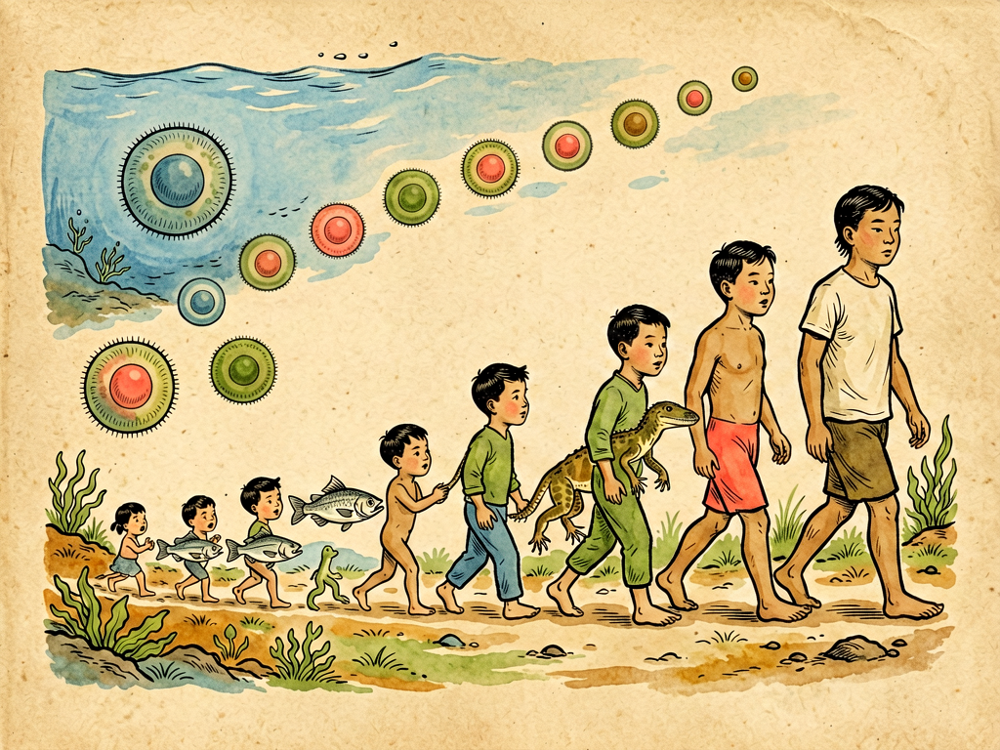

## 第一章 细胞的不死精神

---

### 📍 本章导航
**核心主题**：我们每个人都会衰老、死亡，但生命本身却延续了38亿年从未中断——这个秘密就藏在细胞里。所谓"细胞的不死精神"，不是说单个细胞能永远活着，恰恰相反，单个细胞会衰老、会受损、会主动死亡，但生命通过细胞分裂、遗传信息复制、代际传递，像接力赛一样把自己延续下去。个体会退场，但生命的火种永远在传递，这就是最朴素也最动人的"不死精神"  
**你将发现**：
- 所有生命都是由细胞构成的，新细胞只能从老细胞分裂而来——这是细胞学说，整个生物学的基石之一
- 你身体里的大部分细胞，每隔几天到几个月就会全部更换一遍：皮肤细胞28天换一次，血细胞120天换一次，肠道细胞3-5天换一次——7年前的你和今天的你，几乎没有一个细胞是相同的，但你依然是你
- 细胞会主动"自杀"（程序性死亡）：手指之间的细胞必须死掉，我们才能长出分开的手指；受损、癌变的细胞必须主动死亡，我们才不会得癌症——死亡不是生命的敌人，是生命秩序的一部分
- 不受控制的"不死"是灾难：癌细胞就是不肯死、不断分裂的"叛徒细胞"，它们无限增殖，最后杀死整个身体，自己也同归于尽
- 生殖细胞是真正的"不死线索"：从38亿年前地球上第一个细胞开始，生命的链条从来没有断过——你身体里的每个细胞，都是那个第一个细胞的后代，经过了无数次分裂，活到了今天
- 干细胞是身体的"后备队"：它们能不断分裂，分化成各种功能细胞，补充我们身体每天死去的细胞
- 普通细胞分裂次数有限，因为染色体末端的端粒会越分越短，短到一定程度细胞就停止分裂，我们就会衰老——但生殖细胞和癌细胞有端粒酶，能修复端粒
- 生命的本质是信息的延续：我们每个人都是38亿年生命接力赛中的一棒，我们会老去死去，但我们把基因传给孩子，把知识、爱、创造传给后人——这就是普通人也能拥有的"不死精神"

**阅读建议**：这是第三部"科学与文明"的开篇，我们从细菌扩展到所有生命，从个体生命扩展到整个生命史。读完这一章，你会对生死有更豁达的理解。

---

### 🖋️ 经典原文

从这一章开始，我们把视线从细菌身上移开，去看看更广阔的生命世界，看看科学和文明的关系。今天我们先讲最基础的东西——细胞，以及细胞的"不死精神"。

首先我要告诉你一个反常识的事实：**你今天身体里的大部分细胞，都不是你出生时就有的。**
你的皮肤表皮细胞，每28天就会全部脱落更换一次，你洗澡搓下来的泥，大部分就是死去的皮肤细胞；你的红细胞，在血液里循环120天左右就会衰老，被脾脏分解掉，骨髓会不断造出新的红细胞补充；你的肠道内壁细胞，因为每天要接触食物、胃酸、消化酶，磨损特别快，每3-5天就会全部换一遍；就连你的骨头，看起来硬邦邦的不变，其实每10年也会全部更新一次。
有人算过，大概每过7年，你身体里90%以上的细胞都会被新细胞替换掉。也就是说，7年前的你和今天的你，几乎没有一个细胞是完全一样的——但你还是你，你还记得7年前的事，你的性格、你的记忆、你的身份，都没有变。
这是不是很神奇？组成你的细胞一直在换，一直在死，但"你"作为一个整体，却一直活着，一直延续着。
这就是细胞的"不死精神"——我要先讲清楚，这个"不死"，不是说单个细胞能永远活着，永远不死。恰恰相反，绝大多数细胞都会死，而且死得很快，我们每天身体里都有几千亿个细胞死去。所谓"不死"，说的是生命本身：单个细胞会退场，但细胞会分裂，会产生新的细胞，会把遗传信息精确地复制下去，生命就在这个不断更新、不断接力的过程中，一直延续下去。

那细胞是什么？我们为什么说细胞是生命的基本单位？
在显微镜发明之前，人们根本不知道细胞的存在，以为身体就是一团肉，植物就是一团纤维，不知道它们都是由一个个小单位组成的。1665年，英国科学家胡克用自己做的显微镜看软木塞，发现软木塞是由很多像小房间一样的结构组成的，他把这些小房间叫做"细胞"（cell，原义是小房间）。当然，他看到的只是死细胞的细胞壁。
之后又过了将近200年，1838-1839年，德国植物学家施莱登和动物学家施旺，总结了前人的观察，提出了**细胞学说**：
第一，所有的植物和动物都是由细胞构成的，细胞是生命的基本结构和功能单位；
第二，所有的细胞，在结构和组成上都是基本相似的；
后来1858年，德国医生魏尔肖又补充了最重要的一条：**所有的新细胞，都只能来自已经存在的细胞——细胞只能来自细胞，就像生命只能来自生命。**
这三条加起来，就是细胞学说——它和达尔文的进化论、能量守恒定律一起，被称为19世纪自然科学的三大发现。细胞学说一下子把所有生命统一了：不管是大象还是蚂蚁，是大树还是小草，是人类还是细菌，本质上都是由细胞构成的，所有的生命活动，本质上都是细胞的活动。
细菌是单细胞生物，一个细胞就是一个完整的生命；我们人类是多细胞生物，一个成年人身体里大概有37万亿个细胞，这些细胞分工合作，组成了我们的组织、器官、系统，共同构成了我们这个完整的人。

那细胞怎么延续生命？最核心的机制就是**细胞分裂**。
一个细胞长到一定大小，就会复制自己的遗传物质DNA，然后一分为二，变成两个和母细胞几乎一模一样的子细胞。两个子细胞长大之后，又会继续分裂，变成四个——我们每个人，最开始都只是一个受精卵细胞，就是爸爸的精子和妈妈的卵子结合成的那一个细胞。那一个细胞，经过十月怀胎，不断分裂分化，变成了我们出生时的几万亿个细胞；出生之后继续分裂，我们长大成人，伤口愈合，旧细胞替换新细胞，所有这些过程，都是靠细胞分裂完成的。
细胞分裂最了不起的地方，是它的准确性。我们每个细胞里有23对染色体，上面有30亿个碱基对，也就是30亿个"字母"组成的遗传密码。每次细胞分裂，这30亿个字母都要精确复制一遍，平均每复制10亿个字母才会出一个错误——这个准确率，比任何人类的工厂、任何精密机器都要高得多。正是这种惊人的准确性，保证了遗传信息能稳定地从母细胞传给子细胞，从上一代传给下一代。
当然，偶尔也会出错，这就是基因突变——大部分突变是有害的，会导致细胞功能异常，被身体清除掉；少数是中性的，没什么影响；极少数是有利的，会让生物更好地适应环境，这就是进化的原材料。

但是，如果细胞只会分裂，只会产生新细胞，那也不行——细胞还必须会死亡。
你有没有想过，我们在妈妈肚子里最开始是胚胎的时候，手是像鸭蹼一样连在一起的，为什么后来会长出五根分开的手指？因为手指之间的那些细胞，在发育到一定阶段的时候，会主动启动死亡程序，自己死掉——如果这些细胞不肯死，我们生下来就会是并指。
还有，我们身体里每天都会产生受损的细胞、被病毒感染的细胞、甚至是刚刚发生癌变的细胞，如果这些细胞一直活着，不断分裂，我们就会生病，会得癌症。所以身体有一套机制：一旦发现细胞不正常，就会给它发信号，让它启动"自杀程序"，自己解体，然后被巨噬细胞清理掉——这个过程叫**细胞凋亡**，也就是程序性细胞死亡。
每年诺贝尔生理学或医学奖，都有好几次和细胞凋亡有关。为什么这个机制这么重要？因为它说明：死亡不是生命的意外，不是生命的失败，而是生命本身设计好的程序，是维持生命秩序必不可少的一部分。该活的细胞活，该死的细胞死，新旧细胞不断更新，保持平衡，这才是健康。如果该死的细胞不死，不该生的细胞乱长，那就是癌症。
说到这里，我要给你讲一个反例：**癌细胞**，就是背叛了身体秩序的"不死细胞"。
正常细胞分裂次数是有限的——人类的体细胞，大概最多分裂50次左右，就会停止分裂，进入衰老，最后死亡。这个极限叫"海弗里克极限"。为什么会有这个极限？因为我们染色体的末端，有一段叫**端粒**的DNA序列，就像鞋带末端的塑料头一样，保护染色体不被损坏。每次细胞分裂，端粒都会缩短一点，短到一定程度，细胞就不能再分裂了，就会衰老死亡。
但是癌细胞不一样，它们发生了基因突变，激活了一种叫**端粒酶**的东西，每次分裂之后，端粒酶会把缩短的端粒重新补长，所以癌细胞可以无限分裂，永远不死。而且癌细胞不听身体的信号，不肯凋亡，还会到处转移，侵占正常组织的营养，最后把整个身体拖垮——病人死了，癌细胞自己也跟着死了。
所以你看，不受约束的"不死"根本不是好事，不是值得追求的奇迹，而是灾难。生命的延续从来不是靠某一个细胞永远活着，而是靠有序的更新，靠老细胞正常死亡，新细胞正常接上，整个系统保持平衡。

那在我们身体里，有没有真的能一直分裂、一直"不死"的细胞呢？有两类：
第一类是**干细胞**。干细胞是我们身体里的"后备队"，它们还没有完全分化，还有潜力变成各种不同的功能细胞，而且它们能不断分裂，自我更新。我们的骨髓里有造血干细胞，一辈子不断分裂，产生红细胞、白细胞、血小板；我们的皮肤基底层有皮肤干细胞，不断产生新的皮肤细胞；我们的肠道隐窝里有肠道干细胞，不断产生新的肠道细胞；我们的毛囊里有毛囊干细胞，不断长出新的头发——正是这些干细胞的存在，我们才能一辈子不断更新老细胞，维持组织的正常功能。
现在科学家已经能在实验室里把普通细胞重编程，变成类似胚胎干细胞的诱导多能干细胞（iPSC），未来可以用这些细胞来修复受损的器官，治疗很多现在治不好的病——比如让瘫痪的人重新站起来，让糖尿病人重新产生胰岛素，甚至替换衰老的器官，延长人的寿命。这是现在生命科学最热门的方向之一。
第二类真正承担"不死"使命的细胞，是**生殖细胞**——也就是爸爸的精子和妈妈的卵子。
我们身体里的其他细胞，叫体细胞，它们不管分裂多少次，不管活多久，最后都会跟着我们这个个体一起死亡。但是生殖细胞不一样，它们不会跟着我们死——它们会结合成受精卵，发育成新的生命，把生命传递给下一代，下一代的生殖细胞再继续传递下去。
你想想看：38亿年前，地球上出现了第一个细胞，从那时候开始，细胞就一直在分裂，一直在传递，从来没有中断过。38亿年，经历过多少次小行星撞击，多少次冰川期，多少次大灭绝，多少物种来了又走了，但生命的链条从来没有断过——你身体里的每一个细胞，都是那第一个细胞的直系后代，经过了无数次细胞分裂，一路传递到你这里。这本身就是一个奇迹。
你会死，我会死，我们每个人都会死，但是只要我们有孩子，我们的生殖细胞就会继续活下去，把我们的基因传下去，一代又一代，一直延续到遥远的未来——这就是生命层面的"不死精神"，它不靠什么神仙法术，不靠什么长生不老药，靠的就是细胞分裂，靠的就是遗传信息的复制和传递，靠的是一代又一代的接力。

理解了细胞的不死精神，我们再回过头来看生死，就会豁达很多。
我们每个人都害怕死亡，觉得死亡就是一切的结束，但是从细胞的角度看，从来没有真正的"死亡"——组成我们身体的物质，来自我们吃的食物、喝的水、呼吸的空气，来自植物、动物、来自土地，我们死了之后，这些物质又会回到大自然里，变成植物的养分，变成其他生命的一部分，物质永远在循环；而我们的基因，通过孩子传递下去，我们的思想、我们写的文字、我们创造的东西、我们给世界留下的爱和记忆，也会传递下去，影响着后人，就像细胞分裂一样，把信息接力传下去。
古代的帝王将相，追求长生不老，吃金丹喝仙药，想让自己这个个体永远活下去，最后都是竹篮打水一场空。但是那些写出伟大作品的诗人、科学家、思想家，他们的身体早就化为尘土了，但他们的思想、他们的发现、他们创造的美，直到今天还活在我们每个人的心里，这何尝不是另一种"不死"？
我们普通人，不需要去追求什么长生不老，不需要活几百岁。我们认认真真活好这一生，把孩子养好，把工作做好，给身边的人带来温暖，给世界留下一点哪怕很微小的美好，我们就已经参与了这场38亿年的生命接力，我们就是这个不死的生命长河里的一部分。
这就是细胞告诉我们的道理：不死，不是永远占着位置不走，而是做好自己这一棒，然后好好交出去，让生命继续向前。

下一章，我们讲单细胞生物的性生活。

---

> 📜 **科学史话：细胞学说——把所有生命统一起来的伟大发现**
>
> 1665年，英国人罗伯特·胡克用自己磨制的显微镜观察软木塞的薄片，看到软木是由很多像修道院小房间一样的中空结构组成的，他把这些结构命名为"cell"（细胞，原义是小室）。这是人类第一次看到细胞——不过胡克看到的只是死细胞的细胞壁，他当时根本不知道这些小室是什么，有什么意义。
>
> 之后的170多年里，很多人用显微镜看到了各种细胞，看到了细胞里的细胞核、细胞质，但没有人意识到细胞到底是什么，也没有人把各种生物的细胞联系起来。
>
> 1838年，德国植物学家施莱登发表了《植物发生论》，他提出：所有的植物，不管是大树还是小草，都是由细胞构成的，细胞是植物的基本结构单位，植物的生长，就是细胞不断产生的结果。
>
> 施莱登把他的想法告诉了他的朋友，动物学家施旺。施旺正在研究动物的胚胎发育，他一听就激动了——他在动物组织里也看到了类似的结构，动物也是由细胞构成的！1839年，施旺发表了《关于动植物的结构和生长的一致性的显微研究》，正式把细胞学说推广到了所有生物：**整个动物界和植物界，都是由细胞构成的，细胞是生命的基本单位。**
>
> 但是细胞学说还差最关键的一块：新细胞是怎么来的？当时施莱登和施旺都认为，新细胞是在老细胞外面，像结晶一样从无到有"自然发生"出来的。
>
> 这个错误是被德国医生魏尔肖纠正的。魏尔肖是个病理学家，他天天在显微镜下看病变的组织，看了20多年，他观察到：所有病变的细胞，都是从原来已经存在的细胞分裂来的；所有的正常生长、伤口愈合，也都是原来的细胞分裂的结果。1858年，他在《细胞病理学》里提出了那句著名的论断：**一切细胞来自细胞（Omnis cellula e cellula）。**
>
> 就这一句话，彻底否定了"自然发生说"在细胞层面的残余，把细胞学说补全了。
>
> 细胞学说的意义怎么强调都不过分：在这之前，人们觉得动物和植物完全不一样，人和其他生物完全不一样，生命是神秘的、没有规律的。细胞学说告诉我们，所有的生命，从最简单的细菌到最复杂的人类，在细胞层面都是统一的，都遵循同样的规律，都是同一个生命之树上的枝桠。这为后来达尔文的进化论、为整个现代生物学，打下了最坚实的基础。
>
> 魏尔肖还有一句名言："医学的本质是支持身体自我修复。"——这句话放到今天依然不过时，因为我们的身体本身就有更新、修复、治愈的能力，医学只是帮助身体更好地完成这个过程而已。

---

> 🔬 **科学更新：重编程细胞——人类能逆转衰老吗？**
>
> 过去大家认为，细胞一旦分化成熟，就不能再变回去了：皮肤细胞就是皮肤细胞，神经细胞就是神经细胞，不可能再变成干细胞。但是2006年，日本科学家山中伸弥做了一个震惊世界的实验：他只需要把4个转录因子转到小鼠的皮肤成纤维细胞里，就能让已经完全分化的成熟细胞，重新变回类似胚胎干细胞的状态——这种细胞叫"诱导多能干细胞"，简称iPSC。
>
> 什么意思？也就是说，我们可以把你皮肤上的一个普通细胞，变回最原始的干细胞状态，然后让它再分化成神经细胞、心肌细胞、肝细胞、血细胞——你身体里任何一种细胞。
>
> 这个发现有多了不起？山中伸弥因此只过了6年就拿到了诺贝尔奖，创造了诺奖最快获奖记录之一。
>
> iPSC技术解决了干细胞研究最大的两个问题：第一，不用再破坏胚胎获取胚胎干细胞，避免了伦理争议；第二，用病人自己的细胞重编程出来的干细胞，基因和病人完全一样，移植回病人体内不会有排异反应。
>
> 现在，科学家已经用iPSC技术在实验室里培养出了人工视网膜、人工心肌、人工肝脏，甚至在动物身上成功治愈了脊髓损伤、糖尿病、帕金森病——虽然离大规模临床应用还有距离，但这是再生医学的方向：未来很多现在治不好的病，比如瘫痪、老年痴呆、器官衰竭，可能都能用自己的细胞重编程，长出新的器官替换掉坏的。
>
> 更让人激动的是，这个技术暗示我们：**细胞的衰老可能是可以逆转的。** 成熟的细胞能变回年轻的干细胞状态，说明细胞的时钟是可以往回拨的。2020年，有科学家用重编程技术，让失明的小鼠恢复了视力；2023年，有研究显示部分重编程能延长小鼠的寿命，让衰老的小鼠变得更年轻。
>
> 但是请记住：我们离"长生不老"还非常非常远。衰老是一个非常复杂的过程，涉及到细胞损伤、DNA突变、端粒缩短、表观遗传改变、炎症等等很多因素，不是转几个基因就能全部解决的。而且我们前面说过，不受控制的细胞增殖就是癌症，重编程如果控制不好，很容易导致肿瘤——我们想要的是健康的长寿，不是在培养皿里永远不死的癌细胞。
>
> 不过至少，我们已经开始摸到了衰老的门，未来我们很可能会大幅延长人类的健康寿命，让人们老了也能健康地生活，不受老年病的困扰。这比单纯追求"不死"有意义得多。

---

> 🧪 **现实连接：健康的本质——让细胞该活的活，该死的死**
>
> 很多人以为，健康就是让细胞都活着，都好好的，不要死。其实正好相反，健康的本质是平衡——细胞分裂和细胞死亡的平衡，新细胞产生和老细胞清除的平衡。
>
> 那我们普通人怎么做，才能维持这个平衡？其实都是最简单的常识，但90%的人做不到：
>
> **第一，不要给细胞添乱，减少DNA损伤。**
> 细胞每次分裂都要复制DNA，DNA损伤越多，突变越多，越容易出问题，越容易衰老和癌变。怎么减少DNA损伤？
> - 不要吸烟，吸烟会产生大量自由基，直接损伤DNA，是导致肺癌和很多癌症的头号原因；
> - 不要暴晒，紫外线会直接造成皮肤细胞DNA损伤，导致皮肤癌，出门要防晒；
> - 不要吃发霉的食物，发霉的花生、玉米里有黄曲霉毒素，是强致癌物，会直接导致肝癌；
> - 少喝酒，酒精代谢产物乙醛也是强致癌物，会损伤DNA；
> - 多吃新鲜蔬菜水果，里面有抗氧化物质，能减少自由基损伤。
>
> **第二，给细胞足够的营养和原料，让它们能正常分裂更新。**
> 细胞更新需要原料：蛋白质、维生素、矿物质、必需脂肪酸。不要过度节食，不要偏食，保证足够的优质蛋白（肉、蛋、奶、豆制品），多吃蔬菜，适量吃水果，少吃高糖高油的加工食品——你吃进去的东西，就是你建造新细胞的原料，原料不好，新细胞自然长不好。
>
> **第三，给细胞更新的信号，不要让它们"偷懒"。**
> 你知道为什么运动能让人年轻吗？因为运动的时候，你的肌肉、骨骼、心肺会受到轻微的压力和损伤，身体收到信号："这些组织需要加强"，就会启动干细胞分裂，产生新的细胞，替换受损的老细胞，组织就会变得更强壮。肌肉越用越发达，骨骼越用越结实，心肺越用越好——用进废退，这是身体的规律。
> 反过来，如果你天天久坐不动，身体觉得"这些肌肉骨骼不需要这么强"，就会让细胞慢慢萎缩，老细胞死了新细胞不补，人就会越来越虚弱，越来越容易衰老。
> 大脑也是一样：多用脑，多学习新东西，神经细胞之间的连接就会越来越发达，大脑就不容易衰老；天天不动脑子，神经连接就会慢慢退化，老了容易得老年痴呆。
>
> **第四，保证睡眠，让身体有时间清理垃圾、修复细胞。**
> 白天我们活动的时候，细胞在工作，在产生代谢垃圾，在受到损伤；晚上睡觉的时候，身体才会启动修复机制，清理受损的细胞，修复DNA损伤，补充新的细胞。长期熬夜、睡眠不足的人，老得快，免疫力差，容易得癌症，就是因为身体没有足够的时间修复。
>
> **第五，不要乱吃所谓的"抗衰老保健品"。**
> 现在市面上各种抗氧化剂、花青素、白藜芦醇、NMN，吹得神乎其神，能抗衰老、能长生不老。实际上，没有任何一种保健品被严格证明能延长人类寿命，很多抗氧化剂吃多了反而有害——因为自由基不完全是坏东西，它们也是细胞信号系统的一部分，乱补抗氧化剂会打乱细胞的正常平衡。
>
> 说白了，健康没有什么灵丹妙药，就是好好吃饭、好好睡觉、多运动、少做伤害自己的事，让身体自己的更新修复机制正常工作——你的身体本身就有38亿年进化出来的"不死精神"，你只要不捣乱，它自己就能把大部分事情做好。

---

### 💬 读后思考与讨论

1. 我们说"7年前的你和今天的你几乎没有一个细胞是相同的，但你还是你"——那到底是什么东西在维持"你"的身份连续性？如果你的细胞全换了，记忆换了，你还是你吗？
2. 细胞凋亡（程序性死亡）告诉我们，死亡是生命设计好的程序，是秩序的一部分。生活中是不是也有类似的情况——有些东西主动"退出"、"结束"，反而对整体更好？
3. 癌细胞是"不死的叛徒"，不受控制地无限增殖，最后和身体同归于尽。你在生活中有没有见过类似的现象——一个系统里某个部分不受控制地扩张，最后毁掉整个系统？这告诉我们什么道理？
4. 从38亿年前第一个细胞到今天，生命的链条从来没有断过，你就是这个链条的一部分。知道了这件事，你对死亡的看法有没有改变？
5. 我们说"不死不是个体永远活着，而是做好接力，把信息传下去"。你觉得除了基因之外，一个人能给后代、给世界留下什么东西，能实现另一种意义上的"不死"？

### 🔗 关联阅读
- 第二部第八章：《细菌的衣食住行》→ 单细胞细菌的生活
- 第三部第二章：《单细胞生物的性生活》→ 单细胞生物怎么繁殖和交换基因
- 第三部第三章：《新陈代谢中蛋白质的三种使命》→ 细胞里的蛋白质怎么工作
- 第三部第二十三章：《谈寿命》→ 我们能活多久，怎么健康长寿
- 跨章节思考：为什么说"平衡"是生命最核心的原则？无论是细胞更新、生态系统、还是社会，为什么平衡比无限增长更重要？
