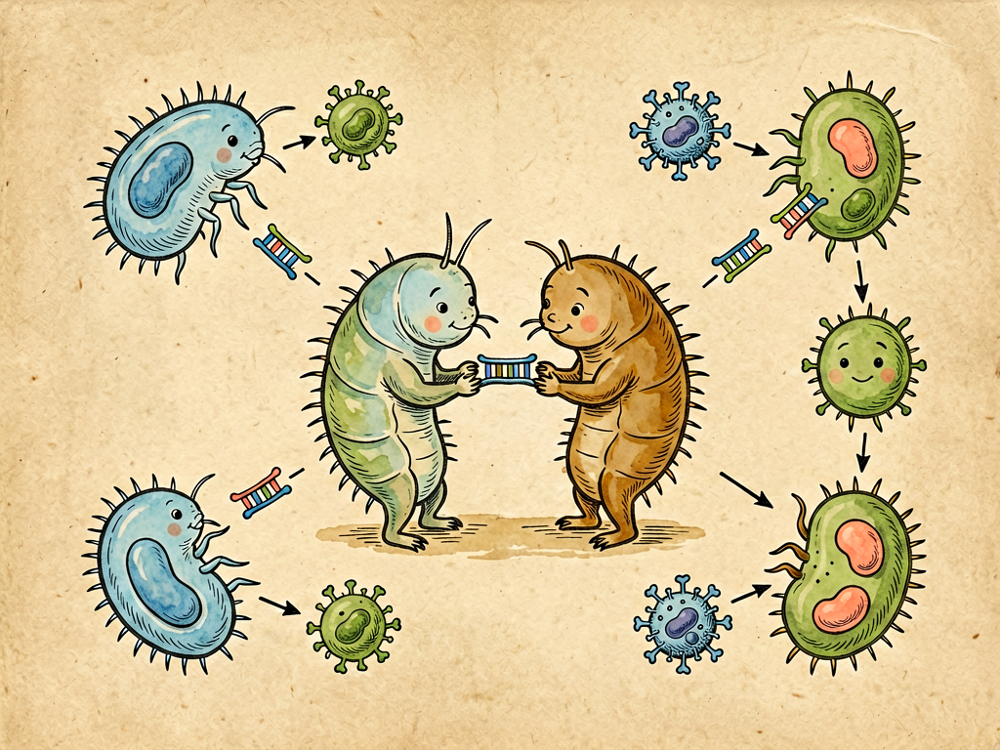

## 第二章 单细胞生物的性生活

---

### 📍 本章导航
**核心主题**：看到这个标题你可能会惊讶——单细胞生物也有"性生活"？当然有，但这和人类的男女情爱完全不是一回事。生物学里"性"的本质，不是两性交配，不是生儿育女，而是**遗传物质的交换和重组**——生命通过交换基因，制造出基因不同的后代，增加多样性，从而在变化的环境里活下去。性不是高等生物的专利，它是生命最古老的生存策略之一，早在30亿年前，细菌就已经在"过性生活"了  
**你将发现**：
- 单细胞生物大部分时候都是无性繁殖：一个细胞直接分裂成两个，基因完全复制，一模一样，又快又省事。但它们在环境恶劣的时候，会主动进行基因交换
- 草履虫的"接合生殖"：两只草履虫临时贴在一起，交换细胞核里的部分遗传物质，然后分开，再各自分裂。这时候它们的基因已经重组了，产生的后代都是全新的基因组合——它们没有生孩子，只是"交换了一点人生经验"，就改变了后代的命运
- 细菌的"性生活"更灵活：有三种方式交换基因——两个细菌连起来直接传质粒（接合）；直接从环境里捡别的细菌死掉之后留下的DNA片段（转化）；病毒（噬菌体）感染一个细菌之后，带了它的基因再去感染另一个细菌，顺便把基因传过去（转导）
- 抗生素耐药性为什么传播得这么快？就是因为细菌会共享基因：一个细菌偶然突变出耐药基因，很快就能通过这三种方式，把耐药基因传给周围所有细菌，甚至传给别的种类的细菌——它们不是自己慢慢突变出耐药性，而是直接"抄作业"
- 为什么生命要"发明"性？无性繁殖多好啊，一个变两个，所有后代都传自己100%的基因。但无性繁殖的致命缺点是：所有后代基因都一模一样，环境一变，全死。性通过打乱基因重组，制造出各种各样的后代，不管环境怎么变，总有几个能活下来——多样性，就是生命给未来买的保险
- "穆勒棘轮"效应：如果一直无性繁殖，坏的基因突变会越积越多，就像棘轮只能往一个方向转，倒不回去，最后整个种群都会因为坏突变太多而灭绝。有性生殖能通过基因重组，把不带坏突变的基因组合到一起，把坏突变甩掉
- 不要觉得单细胞生物"低等"——它们的基因交换方式比我们灵活得多。我们人类只能和自己的配偶交换基因，只能在生育的时候重组一次；细菌可以和任何同类甚至不同种类的细菌交换基因，可以在任何时候交换，它们的基因是在整个微生物世界里流动的
- 基因工程其实就是人类模仿细菌的"性生活"：我们把一个物种的基因剪下来，转到另一个物种里，让它获得新的性状——这本来是细菌玩了30亿年的把戏
- 这一章最根本的洞见：**多样性不是多余的装饰，是应对不确定性的根本策略**。这个道理不止适用于生物界，也适用于社会、文化、经济——任何同质化、单一化的系统，在变化面前都是脆弱的

**阅读建议**：读完这一章，你会明白"性"最根本的生物学意义，也会理解为什么多样性如此重要。

---

### 🖋️ 经典原文

看到这个标题，你可能会吓一跳：什么？单细胞生物，那么小一个细胞，连雌雄都不分，也有"性生活"？
我先把话说在前头：我们这里讲的"性生活"，和你们平时想的男女之情、两性相悦、生孩子完全不是一回事。生物学里说的"性"，最核心的意义不是交配，不是繁殖，更不是情爱，而是**两个个体之间交换遗传物质，把基因重新组合，产生和父母都不一样的后代**。只要做了这件事，就是有了"性"，不管它是单细胞还是多细胞，不管它有没有男女之分。

你可能会问：好好的无性繁殖不好吗？一个细胞分裂成两个，两个变四个，四个变八个，多快啊，所有后代都是自己的克隆，基因100%是自己的，为什么要费劲去和别人交换基因，把自己的基因打乱重组，最后后代只有一半基因是自己的？这不是亏了吗？
要回答这个问题，我们先去看看单细胞生物是怎么做的。

我们先看大家最熟悉的单细胞原生生物——草履虫。
草履虫平时繁殖都是无性的：成熟之后，身体拉长，里面的小核和大核先复制，然后中间收缩，一个变成两个，和母细胞一模一样，半个小时就能分裂一次，条件好的话一天就能变成几百个，繁殖速度快得惊人。
但是如果环境变了——比如食物不够了，水里有毒了，温度不对了，或者生存压力大了，它们就会开始"过性生活"。
两只草履虫会游到一起，口沟对着口沟，紧紧贴在一起，中间的细胞膜融化，形成一个细胞质桥。然后它们原来的大核会解体消失，小核经过几次减数分裂，变成几个小核，其中一个会通过细胞质桥交换到对方细胞里，和对方剩下的那个小核融合，形成一个新的细胞核。之后两只草履虫分开，各自带着新的、重组过的细胞核，再开始分裂繁殖。
这个过程叫**接合生殖**。你看，整个过程里，它们没有生孩子，没有产生新的个体（反而还是两个），但是它们交换了一半的遗传物质，基因重组了。等它们再分裂的时候，产生的后代，基因就和原来的母细胞都不一样了，是全新的组合。
它们为什么要这么做？很简单：环境变了，原来那套基因不好用了，原来的克隆后代都活不下去了。它们交换基因，打乱重组，相当于把两副牌洗一遍，重新发牌，试试新的组合能不能活下去。大部分新组合可能还是不行，但只要有几个新组合刚好能适应新环境，整个种群就能活下来。

比草履虫更厉害的是细菌——细菌的"性生活"更灵活，更高效，根本不需要两个细胞"谈恋爱"贴半天，它们有三种办法交换基因：
第一种叫**接合**，和草履虫有点像：一个细菌（供体菌）会长出一根细细的性菌毛，像桥一样连到另一个细菌（受体菌）上，然后把自己的一小段DNA，通常是叫"质粒"的小环状DNA，通过这个桥复制一份送过去。最常见的就是耐药基因——一个细菌有了耐药质粒，很快就能通过接合，把这个质粒传给周围的细菌，传给自己的后代，甚至传给完全不同种类的细菌。
第二种叫**转化**，更简单粗暴：一个细菌死了之后，细胞破裂，里面的DNA会释放到环境里，变成游离的DNA片段。别的细菌路过，如果觉得这段DNA有用，就会直接把它捡起来，整合到自己的基因组里，变成自己的东西。1928年格里菲斯做的那个著名的肺炎双球菌转化实验，就是这个现象：死的有毒型细菌的DNA，被活的无毒型细菌捡走了，结果无毒型就变成有毒型了，能让老鼠生病。
第三种叫**转导**，这个需要"媒人"帮忙，就是噬菌体——感染细菌的病毒。噬菌体感染一个细菌的时候，会把自己的DNA注射到细菌里，利用细菌的工厂复制自己，组装新的噬菌体。组装的时候，有时候会不小心把细菌的DNA片段装进去，而不是自己的DNA。等这个噬菌体裂解细菌，去感染下一个细菌的时候，就会把上一个细菌的DNA带进新的细菌里，整合到新细菌的基因组里，这样基因就从一个细菌传到另一个细菌手里了。
你看，细菌根本不需要"结婚"，不需要"交配"，甚至不需要活着碰到对方——死细菌的DNA能被活的捡走，病毒还能帮忙当快递员送基因。整个微生物世界里，基因不是锁在个体里的私产，而是在不停流动、不停交换、不停重组的公共资源。
这就是为什么抗生素耐药性传播得这么快——我们花了十几年、几十亿美元研发出一种新抗生素，往往用不了几年，耐药菌就出现了，而且很快全世界都有了。不是每个细菌都自己突变出耐药基因的，大部分是直接从别的细菌那里"抄作业"抄来的——一个细菌突变出耐药基因，通过接合、转化、转导，几天之内就能把这个基因传给整个菌群，传给各种各样的细菌。细菌的"性生活"，是我们今天对抗生素最大的威胁。

现在我们回到一开始的问题：为什么生命要发明"性"？为什么放着高效又稳定的无性繁殖不用，非要费劲去交换基因，去重组，去制造不一样的后代？
这个问题困扰了生物学家一百多年，现在大家基本达成共识了：性最核心的价值，就是**制造多样性**，应对不确定的未来。
无性繁殖的优点是快，是稳定，后代和自己一模一样，如果环境一直不变，那当然是无性繁殖好——完美适应环境的基因，为什么要打乱它呢？但是环境永远是会变的：气候会变，食物会变，天敌和病原体也会变，甚至小行星会撞地球，会有大冰期，会有大灭绝。如果所有个体基因都一样，只要环境一变，针对这个基因组合的弱点一攻击，整个种群就全死了，一个活口都不留。
有性生殖相当于把所有的牌洗一遍，每个后代拿到的牌都不一样，各种各样的组合都有。这样不管环境怎么变，不管出现什么新的病原体、新的毒素、新的灾难，总有几个个体的基因组合刚好能适应，能活下去，整个种群就能延续下来。多样性，就是生命给未来买的保险——生命不知道未来会发生什么，所以它制造尽可能多的可能性，总有一个能用上。
性还有一个重要的作用，就是清理坏突变，也就是演化生物学里说的**"穆勒棘轮"效应**。我们知道，DNA复制的时候总会出错，总会产生坏的突变。如果是无性繁殖，这些坏突变会一代代积累下去，就像棘轮只能往一个方向转，没法倒回去，坏突变只会越来越多，不会减少，最后整个种群的基因组都会被坏突变毁掉，走向灭绝。而有性生殖通过基因重组，可以把不带坏突变的基因片段重新组合到一起，把带坏突变的片段甩掉，相当于把棘轮往回拨，让基因组保持健康。
你看，从30亿年前细菌开始交换基因，到10亿年前真核生物出现有性生殖，性这个策略一直被保留到今天，几乎所有复杂生物都有性生殖——不是因为它浪漫，不是因为它有趣，而是因为它真的有用，是生命对抗不确定性最有效的发明。没有性，就不会有复杂生命，不会有今天这个丰富多彩的生物世界，更不会有我们人类。

很多人觉得，单细胞生物是"低等生物"，我们多细胞生物、人类才是"高等"的，但其实在基因交换这件事上，细菌比我们灵活多了。
我们高等生物，尤其是动物，被性"锁死"了：我们只能分成雌雄两种性别，只能和异性交配，只能在生育的时候重组一次基因，只能把基因传给自己的后代，跨物种交换基因几乎不可能。
而细菌呢？它们不分雌雄，任何两个细菌都能交换基因；它们不需要等到繁殖的时候，任何时候环境不好了都能交换；它们不止能和同类交换，还能和完全不同种类的细菌交换基因，甚至能从环境里捡死了的、不知道死了多久的生物的基因；基因是整个微生物世界共享的公共财产——你有什么好基因，很快大家都有了。
其实不止细菌，我们现在发现，水平基因转移（就是这种跨个体、跨物种的基因交换）在整个生命演化史上都非常重要。我们人类的基因组里，就有大概8%的基因来自古代感染我们的逆转录病毒；很多植物、昆虫也都有从别的物种那里拿来的基因。基因从来不是牢牢关在物种这个小盒子里的，它一直在整个生命之树里流动、交换、重组——整个生命世界从本质上就是互相连接的，没有真正孤立的物种。

理解了单细胞生物的"性生活"，我们再看人类自己，再看现代生物技术，就会清楚很多：
首先，我们就明白为什么"纯种"不一定是好事。很多人追求纯种狗、纯种猫，觉得纯种高贵，但纯种其实就是近亲繁殖，基因多样性极低，很容易得各种遗传病，对环境变化的抵抗力也差——这就是违背了"性要制造多样性"的规律，代价就是健康。
其次，我们就明白为什么抗生素不能滥用。每次你乱吃抗生素，都是在给细菌施加选择压力，筛选出耐药菌，而细菌又会很快把耐药基因共享给所有细菌，最后我们就会没有抗生素可用——我们面对的不是一个细菌，是整个会共享基因的微生物世界。
第三，我们觉得很"高科技"的基因工程，其实一点都不新鲜——人类做基因工程，把一个物种的基因转到另一个物种里，让它生产胰岛素、抗虫、抗除草剂，其实只不过是模仿细菌玩了30亿年的水平基因转移而已。我们不是发明了什么新东西，只是在利用生命本来就有的能力。
最后，也是最重要的一个道理：**多样性是应对变化最根本的保障**。这个道理不止适用于生物界。
为什么生态系统要保护生物多样性？因为单一树种的人工林，一场虫灾、一场病就全死了，而天然林树种多样，不管什么灾害，总有树能活下来。
为什么我们要保护文化多样性、思想多样性？如果所有人想法都一样，所有文化都一模一样，整个社会就会像无性繁殖的克隆种群，一旦环境变了，遇到新问题，就没有新的解决办法，很容易崩溃。不同的思想、不同的文化、不同的生活方式，就像有性生殖产生的不同基因组合，总会有一个能帮我们度过未来的难关。
为什么市场经济比计划经济更有韧性？因为市场经济里有无数不同的企业、不同的商业模式、不同的尝试，大部分会失败，但总有几个能适应新的环境，在危机中活下来；而完全计划的单一经济，就像无性繁殖，一旦计划错了，整个系统都出问题。
你看，从30亿年前细菌开始交换基因开始，生命就告诉我们一个简单的道理：不要把所有鸡蛋放在一个篮子里，不要追求绝对的单一和纯粹，要保持多样性，要允许不同的尝试，要开放，要交换，要交流——这才是长期生存的智慧。

下一章，我们讲新陈代谢中蛋白质的三种使命。

---

> 📜 **科学史话：列文虎克看到草履虫"打架"——他不知道那是细菌的"性生活"**
>
> 1676年，荷兰的列文虎克，那个磨镜片的看门老头，用他自己做的显微镜，第一次看到了水里的单细胞生物——他把它们叫"微小动物"。
>
> 有一次，他观察雨水里的草履虫，看到两只草履虫紧紧贴在一起，半天不动，过了好一会儿才分开。他在给英国皇家学会的信里写："我看到两只小动物在打架，它们贴在一起搏斗了很久，然后各自游走了。"
>
> 他当然不知道，那不是打架，那是草履虫在进行接合生殖，在交换遗传物质，在过"性生活"。那时候连细胞是什么都还不清楚，更别说基因重组了。
>
> 之后过了200多年，到19世纪末，生物学家才搞清楚草履虫接合的时候到底发生了什么：它们不是在打架，是在交换细胞核里的遗传物质，是在完成"性"最核心的过程。
>
> 更有意思的是细菌的接合现象，是1946年才被莱德伯格和塔特姆发现的——他们发现大肠杆菌之间也会交换基因，当时整个生物学界都震惊了：大家一直以为细菌都是无性分裂繁殖的，没想到它们也有"性"。莱德伯格因此拿到了诺贝尔奖，那时候列文虎克已经去世200多年了。
>
> 科学就是这样：我们天天在显微镜下看到它，但是我们不知道我们看到的是什么。一个现象摆在你眼前，如果你没有正确的理论框架，你根本不知道它意味着什么——列文虎克看到了接合，但他以为那是打架；我们现在回头看，才知道那是性最古老的样子。

---

> 🔬 **科学更新：CRISPR——从细菌的"性生活"里诞生的基因编辑革命**
>
> 你可能听说过CRISPR-Cas9，这是现在最火的基因编辑技术，被称为"基因剪刀"，能精确修改任何生物的DNA，未来可能治愈遗传病、癌症，甚至延长寿命。但你知道CRISPR是哪里来的吗？它不是科学家凭空发明的，它本来就是细菌免疫系统的一部分，是细菌和病毒"性生活"博弈了几十亿年演化出来的。
>
> 我们前面讲转导的时候说过，噬菌体会感染细菌，把自己的DNA注射到细菌里，复制自己，杀死细菌。为了对付噬菌体，细菌演化出了CRISPR系统：当一个噬菌体第一次感染细菌，细菌如果侥幸活下来，就会把噬菌体的一小段DNA剪下来，整合到自己基因组里的CRISPR区域，相当于"存个档案"；下次再有同样的噬菌体来感染，细菌就能根据这个档案，转录出RNA，引导Cas蛋白精确找到噬菌体的DNA，把它剪断，让噬菌体失效——本质上，这就是细菌的"适应性免疫系统"，和我们打疫苗产生抗体是一个道理。
>
> 科学家发现，这个系统太好用了：我们只需要设计一段和目标DNA互补的引导RNA，就能让Cas蛋白精确找到任何我们想改的DNA位置，把它剪断，然后我们就能插入、删除、修改基因，想怎么改就怎么改。就这么简单。
>
> 2012年，科学家把这个细菌的免疫系统改造成了基因编辑工具，之后的10年里，整个生物学和医学都被它 revolution 了——这也是诺贝尔化学奖最快颁发的一次，2020年就颁给了发现CRISPR的两位科学家。
>
> 你看，我们现在最顶尖的生物技术，不是从天上掉下来的，是我们从细菌那里"学"来的，是细菌玩了几十亿年的东西。细菌在和病毒几十亿年的"相爱相杀"里，在一次次基因交换和重组里，早就演化出了这套完美的基因编辑工具，我们只是发现了它，借用了它而已。
>
> 这就是基础研究的意义：你研究细菌怎么过"性生活"，研究细菌怎么对付病毒，看起来一点用都没有，纯粹是满足好奇心，但几十年后，可能就会从这些看似无用的研究里，诞生改变整个人类文明的技术。

---

> 🧪 **现实连接：滥用抗生素为什么是全人类的危机？**
>
> 我们前面说过，细菌会通过接合、转化、转导三种方式共享基因，其中最常被共享的，就是抗生素耐药基因——这就是为什么滥用抗生素问题这么严重。
>
> 你可能会说：我自己感冒了，吃点抗生素快点好，关别人什么事？关系大了。
>
> 每次你吃抗生素，你肠道里、你身上的细菌，大部分被杀死了，但少数有耐药突变或者刚好捡到耐药基因的细菌，会活下来，在没有竞争的环境里大量繁殖。这些耐药菌不仅在你身上，还会通过粪便、通过接触传播到环境里，传给你的家人，传给其他人；它们还会把自己的耐药基因通过接合传给其他细菌，甚至传给更危险的致病菌。
>
> 更可怕的是，农业和养殖业才是抗生素滥用的大头——全世界超过一半的抗生素是喂给猪、牛、鸡、鱼吃的，不是为了治病，是为了预防生病，让它们长得更快。这些养殖场里的动物，天天吃抗生素，它们身上会筛选出大量耐药菌，这些耐药菌通过粪便、通过肉制品、通过环境，最后都会回到人类身上。
>
> 现在已经出现了对所有已知抗生素都耐药的"超级细菌"，也就是全耐药菌，感染了之后无药可治，小伤口、普通肺炎都可能死人。如果我们再不控制抗生素滥用，我们很快就会回到"前抗生素时代"——一个普通的感染就可能死人，手术、化疗、移植这些依赖抗生素的医疗手段都会变得非常危险。
>
> 怎么才能不让耐药菌赢？很简单，我们每个人都能做到：
> 1. **不要主动要求医生开抗生素**——感冒、流感、喉咙痛大部分是病毒引起的，抗生素对病毒完全没用，吃了只会筛选耐药菌；
> 2. **如果医生开了抗生素，要吃够剂量吃够疗程**——不要吃两天觉得好了就停药，那样死里逃生的都是最耐药的细菌；
> 3. **不要吃抗生素预防感染**——不要手上破个口子就吃抗生素，不要感冒了吃抗生素预防肺炎；
> 4. **尽量买无抗生素的肉蛋奶**——虽然贵一点，但能减少养殖业的抗生素滥用，从源头上减少耐药菌的产生。
>
> 记住：细菌之间会共享基因，耐药性不是一个人的事，是全人类的事。我们今天少滥用一次抗生素，就是给未来的自己和孩子多留一种能用的药。

---

### 💬 读后思考与讨论

1. 生物学里"性"的本质是基因重组、制造多样性，而不是情爱和繁殖。这个定义有没有改变你对"性"的理解？
2. 细菌之间可以随便交换基因，甚至跨物种交换，整个微生物世界的基因是流动的、共享的。这种"开放"的策略，和我们习惯的"私有"、"边界"、"物种隔离"非常不一样。这两种策略各有什么优劣？
3. "多样性是应对不确定性的根本策略"——这个道理从生物界延伸到社会、经济、文化，你能举出生活中的例子吗？单一化的系统为什么往往很脆弱？
4. 为什么说CRISPR这种革命性的技术，不是科学家凭空"发明"的，而是从细菌那里"发现"的？为什么很多改变世界的技术，最初都来自看似无用的基础研究？
5. 无性繁殖又快又高效，还能传100%的自己的基因；有性生殖效率低，只能传一半基因，还很麻烦。为什么几乎所有复杂生物都选择了有性生殖？这告诉你"效率"和"长期生存"是什么关系？

### 🔗 关联阅读
- 第一部第三章：《我的家庭生活》→ 细菌怎么繁殖和交换基因
- 第三部第一章：《细胞的不死精神》→ 细胞分裂和生命延续
- 第三部第三章：《新陈代谢中蛋白质的三种使命》→ 基因和蛋白质怎么工作
- 第二部第十五章：《毒菌战争的问题》→ 抗生素和耐药性
- 跨章节思考：为什么"和而不同"是生命世界也是人类社会最理想的状态？多样性和稳定性是什么关系？
