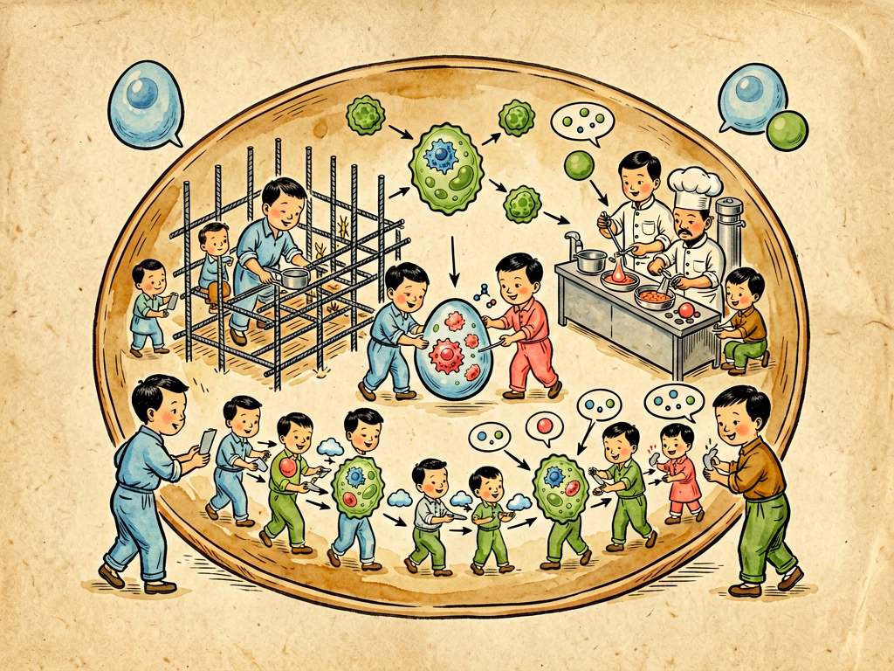

## 第三章 新陈代谢中蛋白质的三种使命

---

### 📍 本章导航
**核心主题**：你平时肯定经常听到"蛋白质"这个词，鸡蛋里有，牛奶里有，营养标签上有，健身的人天天挂在嘴边。但蛋白质远不只是"营养成分"——**它是生命真正的"工人"，几乎所有生命活动，都是蛋白质干出来的**。所谓新陈代谢，不是什么抽象的名词，就是身体里无数蛋白质一刻不停干活的总和。这一章我们讲蛋白质最核心的三种使命：搭结构、当催化剂、做运输，然后你会明白，我们吃蛋白质，本质上是在给这个庞大的分子工厂补充原料  
**你将发现**：
- 糖是燃料，脂肪是储能物质，DNA是图纸，而蛋白质是**真正干活的工人**——身体里几乎所有具体工作，最后都是蛋白质在做
- 第一种使命：**结构支架**。胶原蛋白搭起皮肤、骨骼、肌腱、血管的支架，占人体蛋白质总量的1/3；角蛋白构成头发、指甲、皮肤外层；细胞里还有骨架蛋白，维持细胞形状，负责细胞内部运输。这些不是死的钢筋，是活的、会不断更新修复的动态结构
- 第二种使命：**催化反应**。这就是酶——身体里成千上万种生化反应，自然发生的话可能要几天几年根本来不及，酶作为生物催化剂，能把反应速度提高几百万倍甚至几十亿倍，而且高度专一，一种酶只干一件事，像锁和钥匙一样精准。没有酶，我们吃下去的饭消化不了，氧气没法利用，DNA没法复制，一秒钟都活不了
- 第三种使命：**运输物流**。血红蛋白像快递员，在肺里抓住氧气，送到全身每个细胞，再把二氧化碳带回来；细胞膜上有无数转运蛋白、离子通道，控制什么东西能进出细胞，就像海关；血液里的白蛋白载着激素、脂肪酸、药物跑遍全身；载脂蛋白专门运输不溶于水的脂肪
- 三种使命只是最核心的分类，蛋白质的功能远比这多：抗体是免疫系统的士兵，专门打病原体；受体是细胞的"天线"，接收外界信号（比如胰岛素要结合胰岛素受体才能起作用）；肌动蛋白和肌球蛋白让肌肉收缩，我们才能动；胰岛素这类激素本身就是蛋白质；还有分子伴侣，专门帮别的蛋白质正确折叠，防止它们出错
- 蛋白质的功能**完全由它的三维结构决定**：20种氨基酸像珠子一样串成链，然后按照一定规则折叠成特定形状，形状对了就有功能，形状错了就废了。疯牛病（朊病毒病）、阿尔茨海默病、帕金森病，本质上都是蛋白质折叠错了，聚集在一起，把细胞搞坏了
- 酶有多牛？它不需要高温高压，在体温、常压、水溶液里就能高效工作，而且干完活自己不变，可以反复用；还能被精确调控——需要的时候激活，不需要的时候抑制，整个代谢网络就是这样被精确调节的。我们吃的大部分药，本质上都是激活或者抑制某个酶的功能
- 为什么我们要吃蛋白质？因为蛋白质由20种氨基酸组成，其中8种（儿童是9种）是**必需氨基酸**，我们人体自己造不出来，必须从食物里拿。吃进去的蛋白质都会在消化道里被拆成氨基酸，吸收之后，我们身体再按照自己的需要，重新组装成我们自己的蛋白质——不是你吃胶原蛋白就补脸上的胶原蛋白，吃进去都会拆成氨基酸，重新分配
- 最深刻的洞见：**生命没有神秘的"活力"**。过去人们觉得生物有某种特殊的"生命力"，和非生物不一样，但现在我们知道，所有生命活动——呼吸、消化、运动、思考、免疫，本质上都是无数蛋白质按照物理和化学规律，分工协作、不停工作的结果。身体就是一个巨大的、精密的、24小时不停工的分子工厂，每个蛋白质都是自己岗位上的工人

**阅读建议**：读完这一章，你再看鸡蛋、牛奶的时候，看到的就不只是食物了，而是构建你身体里几十万种"工人"的原料；你再看发烧、吃药、过敏这些现象，也能从分子层面理解它们是怎么回事。

---

### 🖋️ 经典原文

新陈代谢，这是大家听惯了的名词，但是真正懂得它的意义的人，恐怕还不多。
简单说，新陈代谢就是生命不停的工作：旧的东西拆掉，新的东西造出来，能量产生出来用掉，废物排出去，损伤了修补，用完了补充。只要你还活着，哪怕你睡着了一动不动，你的心脏在跳，肺在呼吸，细胞在更新，酶在催化反应，离子在进进出出，血液在全身跑——这一切工作加起来，就是新陈代谢。
谁在干这些活？谁是新陈代谢真正的工人？
不是糖，不是脂肪，不是DNA——糖是燃料，脂肪是储能的仓库，DNA是写着图纸的设计图，真正动手干活的，是**蛋白质**。

很多人对蛋白质的印象，就是营养标签上的一个数字，鸡蛋牛奶里有，吃了长肌肉。这太小看蛋白质了。蛋白质不是堆在那里的原料，它是生命唯一真正的功能执行者。你身体里发生的几乎每一件事，最后都要落实到某个蛋白质身上。我们今天就讲它最核心的三种使命。

**第一种使命，是做生命的结构支架，让身体有形，能站住，能活动。**
你身上摸得到的地方，几乎都有结构蛋白：
皮肤、骨头、肌腱、软骨、血管壁，这些地方最主要的成分是**胶原蛋白**，它占了你全身蛋白质总量的三分之一，像钢筋一样在组织里拉成网，给整个身体提供强度和弹性——老年人皮肤长皱纹，就是胶原蛋白老化、流失了。
你的头发、指甲、皮肤最外层，是**角蛋白**，非常坚韧耐磨，保护下面娇嫩的活组织；动物的蹄、角、羽毛、鳞片，也都是角蛋白做的——你看犀牛角那么硬，本质上和你的头发是一种东西。
血管、肺这些需要经常拉伸的地方，有**弹性蛋白**，能拉长几倍再缩回去，像橡皮筋一样。
甚至每个细胞里面，都有**细胞骨架**——由微管、微丝、中间丝这些蛋白搭起来的网络，维持细胞的形状，固定细胞器的位置，还像轨道一样，让物质在细胞里面运输。细胞要移动、要分裂，都靠骨架蛋白重新组装。
你可不要以为这些结构蛋白是死的、不变的，像房子的钢筋一样搭好了就不动了。完全不是。它们是活的结构，一直在不停更新、不停修补：骨头断了能长上，伤口割破了能愈合，皮肤表层一直在脱落、新的细胞补上来，运动之后肌肉会变粗——这些都是结构蛋白在重新合成、重新排列。结构不是僵死的，是动态的、有弹性的、能自我修复的——这才是生命的结构。

**第二种使命，是做生物催化剂，也就是酶，让所有生化反应快到能让我们活下去。**
你可以想象一下：如果没有催化剂，我们身体里的化学反应会有多慢？比如我们吃下去的淀粉，要分解成葡萄糖，在体外如果加酸煮，要煮上好几个小时；我们的体温只有37度，没有酶的话，这个反应可能要等几年才能完成，那我们早就饿死了。
但是有了酶，一切都不一样了。酶是蛋白质做的生物催化剂，它能把反应速度提高**几百万倍到几十亿倍**——原来要几年的反应，几毫秒就完成了。
而且酶特别"专业"，一种酶通常只催化一种反应，只认一种底物，就像一把钥匙开一把锁。淀粉酶只分解淀粉，蛋白酶只分解蛋白质，脂肪酶只分解脂肪，谁都不抢谁的活。你吃一口饭，从嘴里的唾液淀粉酶开始分解淀粉，到胃里的胃蛋白酶分解蛋白质，再到小肠里胰液、肠液里几十种酶接力工作，把食物拆成小分子，整个过程几个小时就完成了——这全是酶的功劳。
不止消化。我们呼吸进去的氧气，怎么和营养物质反应产生能量？DNA怎么复制？细胞怎么合成新的蛋白质？毒素怎么被肝脏解毒？酒精怎么被代谢？这几万种不同的反应，每一步都有特定的酶在催化。代谢通路是什么？就是一系列酶排成流水线，前一个酶干完活，产物交给下一个酶继续干，一步步完成复杂的化学转化。
更神奇的是，酶还可以被调控。身体需要这个反应快一点的时候，就激活对应的酶；不需要的时候，就抑制它。胰岛素为什么能降血糖？因为它能激活一系列酶，让细胞把血液里的葡萄糖吸收进去，变成糖原存起来；胰高血糖素则反过来，激活另外的酶，把糖原拆成葡萄糖释放到血液里。整个代谢网络的平衡，就是通过调节各种酶的活性来维持的。
可以说，没有酶，就没有新陈代谢，就没有生命。我们说的"活着"，本质上就是几万种酶在身体里同时正常工作的状态。

**第三种使命，是做运输物流，把各种物质送到该去的地方。**
你的身体不是一个均匀的水池，是一个有严格分区、有复杂交通网络的城市。肺吸进来的氧气，要送到脚趾头的细胞里去；吃进来的营养，要送到每个需要的地方；激素要从分泌的地方送到靶器官；离子和小分子要跨过细胞膜进出细胞；废物要从细胞里运出来，送到肾脏、肺排出去——这一切运输工作，都是蛋白质干的。
最有名的运输蛋白就是**血红蛋白**，它住在红细胞里，在肺部的时候和氧气牢牢结合，等红细胞流到氧气少的组织，就把氧气放出来给细胞用，再结合上二氧化碳带回到肺里呼出去。一个血红蛋白分子能结合四个氧分子，一秒钟就能完成一次氧合和释放。如果血红蛋白出问题，比如镰刀型贫血症，就是血红蛋白突变了，运氧能力下降，人就会缺氧、虚弱，甚至死亡。
不只是运氧。血液里的**白蛋白**像一艘通用货船，能结合脂肪酸、激素、药物、胆红素各种东西，带着它们在血液里跑，维持血液的渗透压；**载脂蛋白**专门打包运输不溶于水的脂肪和胆固醇，运到肝脏或者外周组织；细胞膜上嵌着无数**转运蛋白**和**离子通道**，它们就像海关和门，精确控制什么东西能进细胞、什么能出，进多少，什么时候进——比如葡萄糖要靠GLUT转运蛋白才能进入细胞，钠钾离子要靠钠钾泵不停地跨膜运输，才能维持细胞膜电位，我们的神经才能传导信号，肌肉才能收缩。
你看，生命不只要会造东西，会催化反应，还要会把东西送到正确的地方。如果运输出了问题，哪怕东西造得再多，送不到该去的地方，也是白搭。糖尿病很多时候不是胰岛素不够，是细胞上的胰岛素受体或者葡萄糖转运蛋白出了问题，糖送不进细胞，堆在血液里，血糖就高了。

当然，我这里讲三种使命，只是挑最重要的三个来讲，蛋白质的功能远不止这些：
- 我们的免疫系统里，**抗体**是蛋白质，它们能识别病原体，黏住病毒和细菌，标记出来让免疫细胞吃掉，是我们身体的军队；
- 细胞表面的**受体蛋白**是细胞的天线，接收外界的信号——激素来了、神经递质来了、甚至病原体来了，都是受体先接收到信号，再告诉细胞里面该做什么反应；
- 我们能走路、能说话、心脏能跳，靠的是肌肉里的**肌动蛋白**和**肌球蛋白**，它们互相滑动，让肌肉收缩，把化学能变成机械能；
- 调节基因表达的转录因子是蛋白质，它们决定什么时候打开哪个基因，什么时候关闭，控制细胞的分化和功能；
- 还有**分子伴侣**蛋白，专门帮助新合成的蛋白质正确折叠，就像工厂里的师傅带徒弟一样，防止它们折错形状变成废料；
- 甚至很多激素本身就是蛋白质，比如胰岛素、生长激素。
你看，从支撑身体到催化反应，从运输物质到抵抗疾病，从接收信号到控制生长，蛋白质几乎无处不在，无所不能。生命是蛋白质的存在方式——这句话一点都不夸张。

蛋白质这么厉害，全靠它的**三维结构**。
20种氨基酸按不同顺序串成长链，这是一级结构；然后长链会折叠成螺旋或者折叠片，这是二级结构；再进一步盘绕折叠成复杂的三维形状，这是三级结构；多个蛋白还能组合成更复杂的复合体，这是四级结构。氨基酸的顺序决定了它最后会折成什么形状，而形状直接决定功能——结合位点的形状刚好和要结合的分子匹配，就像钥匙插对锁孔，才能干活。
如果折叠错了形状，蛋白质就废了，甚至会变成有毒的东西。疯牛病，也就是朊病毒病，最可怕的地方就在这里：它不是病毒，不是细菌，就是一个错折叠的蛋白质——它碰到正常的同类蛋白质，能把对方也带错，像多米诺骨牌一样，所有正常蛋白都变成错折叠的，聚集在一起，把脑细胞搞出很多空洞，最后大脑变成海绵一样，死亡。阿尔茨海默病、帕金森病，也都是特定的蛋白错折叠，在神经细胞里沉积成斑块，慢慢杀死神经细胞导致的。
所以你看，蛋白质既强大，又脆弱。它强大到能支撑整个生命的运转，脆弱到只要折叠错一个形状，就能致命。

理解了蛋白质的这三种使命，你回头再看我们日常的饮食和健康，就会明白很多道理。
首先，为什么我们必须吃蛋白质？因为20种氨基酸里，有8种（儿童9种）叫**必需氨基酸**，我们人体自己合成不了，必须从食物里拿。如果缺了任何一种，很多蛋白质就没法合成，身体就会出问题：生长发育慢，伤口不愈合，免疫力下降，肌肉流失。
什么是优质蛋白？就是必需氨基酸齐全、比例和人体需要接近的蛋白质：鸡蛋、牛奶、肉类、鱼类、大豆，都是优质蛋白。植物性蛋白往往缺一两种必需氨基酸，所以素食者要注意搭配，比如豆类加谷物，氨基酸互补，才能满足需要。
但是也不是蛋白质吃得越多越好。多余的蛋白质不会存起来，要么当能量烧掉，要么变成脂肪存起来，还会增加肾脏的负担。普通人每天每公斤体重吃0.8-1克蛋白质就够了，健身增肌的人、孕妇、病人、老人可以多一点，到1.2-1.6克，但也没必要吃两倍三倍。
很多人说"吃胶原蛋白补胶原蛋白"，这是误区。不管你吃什么蛋白质，进到胃里都会被蛋白酶拆成氨基酸和小肽，吸收到血液里，再送到全身，供所有细胞合成蛋白质用——不会有什么胶原蛋白直接跑到你脸上，补到皮肤里。你吃胶原蛋白最后拆成的氨基酸，和吃鸡蛋拆出来的没什么区别，还不如吃两个鸡蛋实在。
还有，我们吃的药，一大半都是作用在酶或者受体蛋白上的：退烧药布洛芬，是抑制环氧合酶（COX），减少炎症因子前列腺素的合成；他汀类降血脂药，是抑制HMG-CoA还原酶，这个酶是胆固醇合成的关键酶，抑制它身体就造不出那么多胆固醇；很多抗癌药是抑制癌细胞里特定的酶，阻止它无限增殖。
我们生活里到处都有酶的影子：洗衣粉里加了蛋白酶和脂肪酶，能洗掉衣服上的奶渍、油渍；酿酒、做面包靠酵母里的酶把糖变成酒精和二氧化碳；我们做PCR检测新冠用的Taq酶，是从嗜热细菌里提出来的DNA聚合酶，耐高温，能反复复制DNA；甚至嫩肉粉，就是木瓜蛋白酶，能把肉里的胶原蛋白分解一点，让肉更嫩。

下一章，我们讲民主的纤毛细胞。

---

> 📜 **科学史话：从"活力论"到酶——生命原来没有特殊的"魔力"**
>
> 19世纪之前，人们普遍相信"活力论"：认为生物体内有某种特殊的、非物质的"生命力"或者"活力"，生命的化学反应和非生物的不一样，只有活的生物体才能进行，在体外是不可能发生的。比如发酵，大家觉得那是酵母菌"活着"的魔力，死了的酵母肯定不能发酵。
>
> 1897年，德国化学家毕希纳做了一个实验，彻底打破了活力论。他把酵母细胞用沙子磨碎，过滤掉所有细胞碎片，得到完全没有活细胞的提取液，然后加上糖——结果，糖居然发酵变成酒精了！
>
> 这说明，发酵根本不需要什么"活的酵母"，只要酵母里的某种物质就行。他把这种物质叫"酿酶"。这是人类第一次意识到，生命的化学反应完全是由化学物质催化的，没有什么神秘的活力，生命和非生物遵循的是同样的物理化学规律。
>
> 但是那时候大家还不知道酶是什么东西。直到1926年，美国科学家萨姆纳花了9年时间，终于从刀豆里把脲酶（分解尿素的酶）结晶出来，证明酶的化学本质就是蛋白质。一开始没人信他，大家觉得酶这么神奇的东西，怎么可能是普通的蛋白质？后来别的科学家陆续结晶出胃蛋白酶、胰蛋白酶，都证明是蛋白质，萨姆纳才拿到了1946年的诺贝尔奖。
>
> 从那之后，我们才真正明白：生命没有魔法，所有"活着"的奇迹，本质上都是几万种蛋白质在物理化学规律下工作的结果。我们研究生命，最终研究的是这些分子的结构和功能——这就是现代生物化学的开端。
>
> 当然，后来我们发现，除了蛋白质，某些RNA也有催化活性（核酶），这也解释了生命起源的时候，可能是RNA先既当遗传物质又当催化剂，后来才把催化的工作大部分交给了蛋白质，把遗传的工作交给了DNA。但直到今天，99%以上的生物催化工作，还是蛋白质酶在干。

---

> 🔬 **科学更新：AlphaFold破解蛋白质折叠难题——生物学50年的大问题被AI解决了**
>
> 蛋白质的功能由它的三维结构决定，这个道理我们知道快100年了，但怎么从氨基酸序列算出它会折叠成什么形状，这个"蛋白质折叠问题"是生物学界50年没有解决的大难题。
>
> 为什么难？因为一个只有100个氨基酸的小蛋白，可能的折叠方式就有10^300种，比宇宙里的原子总数还多，靠计算机一个个算根本不可能算完。过去我们要知道一个蛋白的结构，得用X射线晶体学、冷冻电镜这些方法，花几个月甚至几年时间，还不一定能做出来——我们花了几十年，才解析了不到人类蛋白10%的结构。
>
> 2021年，DeepMind公司（就是做AlphaGo打败围棋世界冠军的那家）发布了AlphaFold2，一个人工智能模型，它能根据氨基酸序列，准确预测出蛋白质的三维结构，准确率和实验解出来的几乎一样！他们直接把人类基因组编码的几乎所有2万多种蛋白质的结构，全部预测出来，免费开放给全世界科学家用。
>
> 这是一个革命性的突破。过去做结构生物学，解析一个蛋白结构可能要读一个博士的时间，现在几分钟就预测出来了。我们现在做新药研发，首先就用AlphaFold看靶点蛋白的结构，然后设计能和它结合的药物分子，速度比过去快了几十上百倍；对于那些和错折叠有关的疾病（阿尔茨海默病、帕金森病），我们现在能更清楚地看到错在哪里，怎么设计药物去阻止它；甚至我们从头设计全新的蛋白质，让它干我们想让它干的事——比如设计新的酶、新的抗体、新的材料，现在都变成了可能。
>
> 还有一个拿了2018年诺贝尔奖的技术，叫**酶的定向演化**：我们不用完全理解酶是怎么工作的，只要模拟自然演化，随机突变酶的基因，然后筛选出我们想要的特性（比如更高的活性、耐热、能催化新的反应），反复迭代，就能在实验室里"演化"出我们需要的酶。现在用这种方法做出来的酶，已经用在生产胰岛素、抗生素、生物燃料，甚至制造可降解塑料上——比传统化学方法更环保、更高效。
>
> 我们对蛋白质的理解和操控能力，正在以指数速度增长，下一次工业革命，很可能就是生物技术的革命，而蛋白质就是这场革命的核心。

---

> 🧪 **现实连接：生活里的酶——你每天都在和蛋白质打交道**
>
> 酶不只是在我们身体里，生活里到处都是它的影子，你可以做几个简单的小实验，亲眼看看酶有多厉害：
>
> **实验1：土豆/肝脏里的过氧化氢酶**
> 双氧水（过氧化氢）是常用的消毒剂，涂在伤口上会嘶嘶冒泡——这不是双氧水在"杀细菌"，而是我们细胞里有**过氧化氢酶**，它能把双氧水快速分解成水和氧气，那些泡泡就是氧气。你切一块新鲜土豆或者猪肝，扔到双氧水里，会看到大量泡泡冒出来，这就是过氧化氢酶在工作；如果你把土豆煮熟了再放进去，就不会冒泡了——因为高温让酶变性，形状破坏了，就失去活性了。
>
> **实验2：为什么切了的苹果会变黑？**
> 苹果、土豆、茄子切开之后放一会儿，表面会变成褐色，这是因为细胞里的**多酚氧化酶**接触到氧气，把酚类物质氧化成褐色的醌类物质。怎么防止变黑？很简单：要么泡在水里，隔绝氧气；要么滴点柠檬汁，柠檬酸是酸性的，会降低pH，让多酚氧化酶失去活性；要么加热焯一下，高温让酶变性，就不会变黑了。
>
> **实验3：为什么洗衣粉要用温水？**
> 加酶洗衣粉里有蛋白酶、脂肪酶，能洗掉奶渍、油渍、血渍这些蛋白类污渍。但是为什么要用温水（30-40度），不能用开水？因为开水温度太高，酶会变性失活，就没用了；温度太低，酶的活性也低，洗不干净。
>
> **几个实用的生活建议：**
> 1. **吃蛋白质要均衡**：不要光吃某一种，鸡蛋、牛奶、鱼、肉、豆制品搭配着吃，保证所有必需氨基酸都够；
> 2. **老人尤其要注意补蛋白质**：很多老年人吃的清淡，肉蛋奶吃的少，肌肉流失快（肌少症），走路没劲，容易摔跤，每天至少要保证一杯奶、一个鸡蛋、二两豆腐或者一两肉，预防肌肉流失；
> 3. **不要迷信"胶原蛋白美容"**：吃进去的胶原蛋白都会被消化成氨基酸，不会直接补到脸上，不如好好睡觉、做好防晒，比吃胶原蛋白有用多了；
> 4. **发烧的时候胃口差是正常的**：体温升高会让消化酶活性下降，所以发烧的时候不想吃饭，不用硬塞，吃点清淡好消化的，等烧退了酶活性恢复了，胃口自然就回来了；
> 5. **吃任何补药之前想想**：不管是燕窝、酵素、还是什么神奇保健品，只要是蛋白质，吃进去都会被消化成氨基酸，和你吃两个鸡蛋没有本质区别——花那么多钱，不如吃鸡蛋实在。

---

### 💬 读后思考与讨论

1. 过去人们觉得生命有特殊的"活力"，现在我们知道所有生命活动都是蛋白质按照物理化学规律工作的结果。这个发现有没有改变你对"生命"的理解？生命到底"特殊"在哪里？
2. 酶的催化效率能达到几十亿倍，能在体温常压下工作，还能被精确调控，比人类造的催化剂厉害得多。为什么经过几十亿年演化出来的分子机器，比我们现在的工业技术还精密？
3. 蛋白质只有折叠成正确的三维结构才有功能，折叠错了就会致病。你觉得生命这种"依赖精确结构"的特性，是优势还是劣势？为什么演化没有造出更"皮实"的生命？
4. 很多人觉得吃什么补什么，吃胶原蛋白补皮肤，吃脑补脑。从蛋白质消化吸收的角度看，这个说法错在哪里？为什么营养均衡比吃特定"补品"重要？
5. AlphaFold能准确预测所有蛋白质的结构，酶的定向演化能让我们造出自然界没有的新酶。这些技术未来会怎样改变我们的生活？会带来什么新的伦理问题？

### 🔗 关联阅读
- 第三部第二章：《单细胞生物的性生活》→ 基因重组和蛋白质多样性的来源
- 第二部第八章：《细菌的衣食住行》→ 细菌的酶怎么工作
- 第三部第四章：《民主的纤毛细胞》→ 多细胞生物里细胞怎么分工协作
- 第二部第十五章：《毒菌战争的问题》→ 抗体和免疫系统
- 跨章节思考：从DNA（图纸）→ RNA（信使）→ 蛋白质（工人），这个中心法则为什么是所有生命共通的？为什么选择蛋白质当功能执行者，而不是别的分子？
