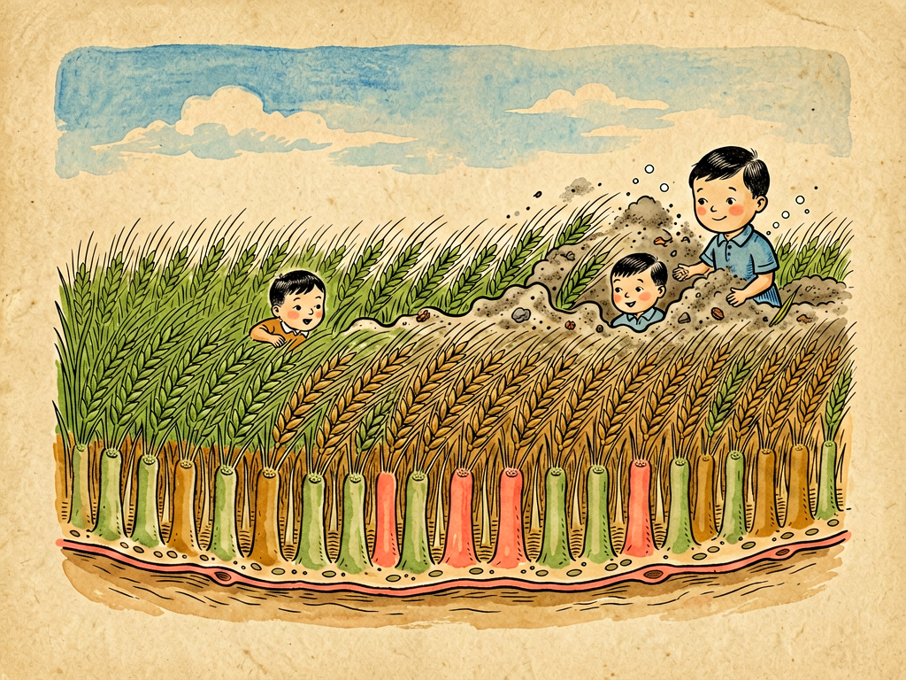

## 第四章 民主的纤毛细胞

---

### 📍 本章导航
**核心主题**：你气管的内壁上，长着亿万个比头发细一千倍的小毛——纤毛。它们没有神经连接，没有"总指挥"，甚至互相之间都不直接说话，却能以每分钟一千多次的频率，整齐划一地朝同一个方向摆动，形成层层推进的波浪，像传送带一样把粘了灰尘和细菌的黏液一步步往上扫，扫到喉咙里咳出去或者咽下去。高士其先生把它们叫做"民主的纤毛细胞"，因为这是生命里最经典的**去中心化协作**：没有领导发号施令，没有中央计划，每个最微小的个体只遵守最简单的局部规则，就能自发形成高度有序的整体功能，完成任何单个个体都不可能做到的事。这种自组织的智慧，不止存在于纤毛身上，它是整个生命世界、甚至人类社会很多复杂秩序的来源  
**你将发现**：
- 纤毛不是汗毛那种死的蛋白质丝，是活细胞伸出来的精密"小马达"，直径只有0.25微米（头发丝直径的1/300），长几微米，内部是极其规整的"9+2"微管结构：9组双联微管围成一圈，中间两根单独的微管，靠动力蛋白"走路"滑动，让纤毛像船桨一样来回摆动
- 纤毛分两种：一种是**运动纤毛**，会摆，负责干活；另一种叫**初级纤毛**，不会动，过去以为是进化残留的没用器官，现在发现它是每个细胞都有的"信号天线"，负责感知机械力、化学信号、生长因子，调控细胞分裂和发育——它出问题，会导致从多囊肾、失明到多指、肥胖的几十种遗传病，这类病现在统一叫"纤毛病"
- 呼吸道里的"黏液纤毛电梯"是我们身体最重要的第一道防线：你每一次呼吸吸进来的灰尘、花粉、细菌、病毒，首先会被呼吸道表面分泌的黏液粘住，下面的纤毛24小时不停向上摆动，把这层脏黏液以每分钟几毫米的速度往喉咙方向送，最后要么咳出去，要么咽到胃里被胃酸杀掉。大部分病原体根本到不了肺里，在半路上就被这个沉默的清洁工队伍扫出去了
- 最神奇的是它们怎么协作：**没有指挥，没有命令，全靠自发协调**。相邻纤毛摆动的时候会带动周围的液体流动，机械力会影响旁边纤毛的摆动节奏，你跟着我，我跟着它，自然就形成了依次滞后的"纤毛波"，像风吹过麦田的麦浪一样，朝着统一的方向推进。不需要谁告诉它们往哪边摆，不需要神经发信号，局部互动自然产生整体秩序——这就是"民主"两个字真正的含义
- 纤毛不只是清洁工：输卵管里的纤毛摆动，把卵子从卵巢往子宫方向推，如果纤毛不动，卵子进不了子宫，就会宫外孕；脑室里的纤毛推动脑脊液循环，给大脑输送营养、排出废物；最神奇的是胚胎发育的时候，胚胎表面一个叫"节点"的地方，纤毛会以每秒10次的频率定向旋转，制造出向左的液体流动，就是这个小小的流动，告诉整个胚胎哪边是左哪边是右——所以我们的心脏长在左边，肝脏长在右边，全靠这些小纤毛在胚胎发育早期"定方向"。如果这些纤毛动不了，人就会长成"镜面人"：所有内脏全反位，同时还会有慢性鼻窦炎、支气管炎、不育，这就是"卡塔格内综合征"（原发性纤毛运动障碍）
- 纤毛非常脆弱，也非常容易受伤：吸烟会直接麻痹纤毛，抽一根烟，纤毛会停止摆动几个小时；长期吸烟，纤毛会慢慢坏死脱落，清洁系统彻底瘫痪，脏东西和焦油就会堆在肺里，导致慢性支气管炎、慢阻肺、肺癌；雾霾、严重空气污染、干燥的空气、病毒感染也会暂时损伤纤毛功能——你感冒之后咳嗽很久不好，很多时候不是感染没好，是纤毛被病毒破坏了，需要几周时间重新长好，把死掉的细胞和黏液清出去
- 这一章最深刻的洞见：**复杂秩序不需要中央设计者，不需要总指挥，它可以从大量简单个体的局部互动中自发涌现**。你以为心脏跳动、呼吸、身体左右对称这种精密的事情一定有个"总开关"在管，但其实很多时候，秩序是自下而上长出来的——从纤毛的集体摆动，到鱼群鸟群的集体转向，到蚁群建造复杂的巢穴，到市场经济里价格机制调配资源，甚至到我们大脑里神经元放电产生意识，本质上都是这种自组织：每个个体只遵守简单规则，只和附近的个体互动，最后整体层面就出现了谁都没有刻意设计过的、精妙绝伦的秩序
- 反过来想，这也是为什么自上而下的计划经济、过度集中的管理往往效率低：我们总觉得要让所有人听指挥、步调一致才能做成事，但纤毛告诉我们，只要规则对、方向对，给每个个体自主权，让他们根据局部情况调整，反而能形成比中央计划更高效、更 resilient（有韧性）的秩序——生命用了几十亿年演化出来的智慧，比人类拍脑袋想出来的管理方法高明得多

**阅读建议**：读完这一章，下次你咳嗽、咳痰的时候，就不会觉得咳嗽是坏事了——那是你的纤毛清洁工们在往外扫垃圾，你咳出来的每一口痰，都是它们工作的成果。你也会真正理解为什么抽烟不好：它不是什么抽象的"有害健康"，它是在直接杀死你身体里最勤劳、最沉默的那批清洁工。

---

### 🖋️ 经典原文

这一篇，我要给你们讲一群最勤劳、最沉默、也最懂得合作的小工人——纤毛细胞。
很多人听到"毛"，就想到我们身上的汗毛、头发，以为纤毛也是那种死的蛋白质丝。错了。纤毛是活的，是细胞身体伸出来的小手和小桨，每一根都是一个精密到极致的分子机器。
你把呼吸道的内壁切下一小片，放到显微镜下看，你会看到震撼的一幕：每个上皮细胞表面，都长着两三百根纤毛，整片上皮上密密麻麻全是，像一片微缩的森林。这些纤毛不是静止的，它们在一刻不停地摆动——而且不是乱摆，是所有纤毛都朝着同一个方向，像听到口令一样，一排接一排地伏下去、抬起来，形成连续不断的波浪，像风吹过麦田一样，一波一波向前推进。
它们在干什么？
你每一次呼吸，吸进来的空气里都有灰尘、花粉、细菌、病毒、PM2.5，这些脏东西如果直接进到肺里，肺很快就会被堵死，或者感染发炎。所以呼吸道的细胞会分泌一层黏黏的黏液，像胶水一样把这些脏东西全部粘住。然后，下面这亿万根纤毛，就以每分钟一千次到一千五百次的频率，齐刷刷地朝着喉咙的方向划动，像无数个小桨一起划水，把这层粘满脏东西的黏液，以每分钟6-18毫米的速度向上推送——这个速度很慢，但一刻不停，从最细的支气管一直送到气管，送到喉咙，最后要么你咳出来，就是痰；要么你不自觉地咽下去，进到胃里，胃酸会把所有细菌病毒都杀掉。
这个系统有个名字，叫"黏液纤毛清除系统"，它是你呼吸道的第一道防线，也是最重要的一道防线——它24小时不停地工作，你醒着的时候它在干，你睡着的时候它也在干，你根本感觉不到它的存在。你之所以能呼吸到干净的空气，大部分时候不是因为你的免疫力有多强，是因为这些连名字你都没听过的小纤毛，在最前线默默把脏东西都扫出去了。
我年轻的时候在美国留学，曾经在实验室里看过活的纤毛摆动：你可以清楚地看到那层波浪沿着细胞表面传过去，没有任何声音，没有任何指挥，却整齐得像受过最严格训练的军队，但是又比军队灵活——如果有地方的黏液厚一点，那里的纤毛会自动调整节奏，加把劲；如果某个地方的纤毛受伤了，旁边的纤毛会多干一点，补上缺口。
所以我把它们叫做"民主的纤毛细胞"。

为什么叫"民主"？
因为它们没有总司令，没有领导，没有谁在发号施令。大脑不会给纤毛发神经信号说"你现在摆一下，往这个方向摆"，细胞之间也不会开会商量怎么配合。那它们怎么做到整齐划一的？
答案很简单：**局部互动**。
每根纤毛都有自己天生的摆动节律，会自己按节奏划动。但是当一根纤毛摆动的时候，它会带动周围的液体流动，会产生微小的机械力，这个力会影响旁边紧邻的纤毛的摆动相位——就像你站在人群里，旁边的人动了一下，你会下意识地跟着调整姿势一样。结果就是，每根纤毛只跟着自己旁边那几根纤毛调整节奏，你跟我，我跟他，他跟下一个，自然就形成了依次滞后的波，而且所有波都会朝着同一个方向传播——因为细胞本身有极性，纤毛天生就知道大方向在哪里。
不需要中央计划，不需要统一命令，不需要谁来监督考核，只要每个个体遵守两个最简单的规则：第一，自己按节奏好好摆；第二，跟着旁边的邻居调整相位，别对着干。最后亿万个微小的个体，就自发形成了高度有序、效率极高的整体功能。
这就是民主的真义——不是乱哄哄无政府，也不是所有人整齐划一地走正步，而是每个个体在共同规则下，根据局部情况自主行动，互相配合，最后涌现出单靠集中指挥根本不可能达到的秩序和效率。
你看，这多么像一个理想的社会：每个人都做好自己的事，和身边的人互相配合、互相调整，不需要一个高高在上的皇帝或者计划委员会告诉每个人该干什么、该怎么干，整个社会自然就能井井有条，而且比自上而下的命令更灵活、更有韧性，哪里出问题了能自己调整补上，不会因为一个人发错命令整个系统都瘫痪。

纤毛的工作，不只是在呼吸道里扫垃圾。
你看女性的输卵管，内壁上也长满了纤毛。卵子从卵巢排出来之后，不会自己游到子宫里去，全靠输卵管壁上的纤毛朝着子宫方向摆动，像传送带一样把卵子送过去。如果这些纤毛因为炎症或者先天原因动不了，卵子就到不了子宫，在输卵管里着床，就会造成宫外孕，这是非常危险的妇产科急症。
再看我们的大脑，脑室里面也长满了纤毛，它们负责摆动推动脑脊液循环，把营养送到大脑各个角落，把代谢废物带出来，如果这些纤毛不动，脑脊液循环堵了，就会脑积水，颅内压升高，压迫脑组织。
最神奇的是我们还在妈妈肚子里的时候，胚胎发育到第三周左右，胚胎表面有一个叫"原结"的小凹陷，那里的细胞长着一种特殊的纤毛，这些纤毛不是像船桨一样来回摆，而是像螺旋桨一样朝着同一个方向旋转，每秒钟转10圈左右——这一转，就在胚胎表面的液体层里制造出了一个向左的缓慢流动。
你可别小看这个小小的流动——就是它，决定了我们的左右不对称。我们的身体外面看起来左右对称，但里面的内脏完全不对称：心脏长在左边，肝脏长在右边，肺左边两叶右边三叶，阑尾在右下腹——这些左右区别，全靠胚胎时期这几百根纤毛转动制造的向左的流来告诉整个胚胎："这边是左，那边是右"。如果这些纤毛因为基因突变动不了，或者转的方向反了，人就会长成"镜面人"：所有内脏全长反，心脏在右边，肝脏在左边——光内脏反位其实也能活，但是这些人同时还会有慢性鼻窦炎、慢性支气管炎、容易得肺炎，男性还会不育——因为呼吸道的纤毛也动不了，精子尾巴（结构和纤毛是一样的）也不动。这个病叫"卡塔格内综合征"，也叫原发性纤毛运动障碍，根源就是纤毛的马达蛋白坏了，动不了。
过去大家一直以为，除了这些运动纤毛，细胞上偶尔长的那种孤零零的、不会动的"初级纤毛"，是进化残留下来的没用器官，就像阑尾一样。但是最近三十年的研究发现我们完全错了——几乎我们身体里的每一个细胞，表面都长着这么一根初级纤毛，它根本不是没用的残渣，它是细胞的**信号天线**：它上面有各种受体，能感知液体流动的机械力，能感知外界的化学信号、生长因子，甚至光和声音，然后把这些信号传到细胞内部，调控细胞的分裂、分化、发育，告诉细胞该长多大、该往哪里移动、什么时候该停止分裂。
现在发现有几十种遗传病，从最常见的多囊肾（双肾长满囊肿最后肾衰竭），到视网膜退化失明、多指畸形、肥胖、糖尿病、智力障碍、骨骼发育异常，最后发现全都是初级纤毛的结构或者功能坏了导致的。这类病现在有了一个统一的名字，叫"纤毛病"——这是医学里最新的领域之一，谁能想到，一根我们之前以为是"进化垃圾"的小毛，居然管着这么多重要的功能？

纤毛很能干，但也非常脆弱，非常容易受伤。
它最怕的就是烟草烟雾——抽一根烟，烟雾里的尼古丁、焦油、甲醛这些有毒物质，会直接麻痹纤毛，让它们停止摆动三到四个小时。如果你一天抽一包烟，从早抽到晚，你的纤毛基本就没有正常工作的时候；长期抽下去，纤毛会慢慢坏死、脱落，呼吸道的清洁系统就彻底瘫痪了。黏液和脏东西排不出去，堆在气管和肺里，身体只能靠咳嗽来往外排——这就是为什么老烟枪早上起来第一件事就是咳嗽、咳黑痰，因为夜里睡着了不怎么咳，脏东西堆了一晚上，早上必须使劲咳才能咳出来；时间长了就是慢性支气管炎，再发展就是慢阻肺，肺功能越来越差，最后呼吸衰竭，肺癌的风险也比不抽烟的人高十几二十倍。
不止抽烟，雾霾、PM2.5、甲醛、干燥的空气、呼吸道病毒感染（比如流感、新冠），都会暂时损伤纤毛的功能，让它们摆动变慢甚至脱落。你感冒好了之后，可能还会咳嗽几周甚至一两个月，很多人以为是感冒没好，是有炎症，其实大部分时候是病毒把呼吸道的纤毛破坏了，它们需要三到四周时间重新长出来，把死掉的细胞残骸和炎症产生的黏液清出去——这时候不要随便吃强效的中枢镇咳药把咳嗽压下去，不然脏东西排不出来，反而容易拖成肺炎，让纤毛慢慢长好，把垃圾咳出来，才是正确的做法。

纤毛最给我启发的，还不是它们有多勤劳，而是它们这种"没有指挥也能做好事"的协作方式。
我们人类总有一种思维惯性，觉得复杂的事情一定要有个领导，有个中央指挥，有个总设计师，大家都听命令，步调一致才能做成事——就像我们建大楼、造桥、打仗，确实需要统一指挥。但是生命演化了几十亿年，发现了另一种更高级、更有效率、也更有韧性的秩序生成方式：**自组织**。
不需要谁设计，不需要谁命令，只要每个简单的个体遵守简单的局部规则，和附近的个体互动、协调，在整体层面就会自动"涌现"出非常复杂、非常精妙的秩序和功能。
你看鱼群在海里游，成千上万条鱼一起转方向，像一个整体一样，从来不会撞在一起，它们也没有领头鱼喊口令，就是每条鱼只盯着旁边几条鱼，保持距离，旁边的鱼怎么转自己就跟着怎么转，结果整个鱼群就能像一个生物一样灵活游动，躲避天敌。
你看蚂蚁，那么小的脑子，没有蚁王发号施令，每只蚂蚁只靠信息素和旁边的蚂蚁互动，就能建出几米深、有通风系统、有育婴室、有储藏室的复杂蚁穴，能找到最短的食物路径，能应对洪水和火灾。
你看我们的大脑，里面有860亿个神经元，没有哪个神经元是"总指挥"，每个神经元只和附近几千个神经元连接，发送电信号，最后就涌现出了意识、记忆、思考、情感——没有任何一个神经元知道你在想什么，但是加在一起，你就有了思想。
甚至人类社会的很多好东西，也是这么出来的：语言不是谁发明的，是人与人之间交流慢慢演化出来的；法律和习俗，是大家在长期互动中慢慢形成的；市场经济里的价格，不是哪个官员定的，是无数人交易自发形成的，价格像信号一样告诉大家什么东西缺、什么东西多，自动调配资源，效率比任何计划委员会都高——这些都是自组织的秩序，和纤毛的摆动，本质上是同一个道理。
反过来，我们也见过太多自上而下的计划经济、过度集中的管理，最后为什么效率低、容易僵化、容易出大问题？因为它把所有信息和权力都集中在最上面，忽略了局部的具体情况，忽略了每个个体的自主性和创造性，命令传下来容易走样，一个地方出问题整个系统都跟着垮——就像如果纤毛全靠大脑发命令才能摆，大脑要同时控制几十亿根纤毛，根本忙不过来，哪里稍微堵了，信息传到大脑再发命令回来，早就堵死了。
当然，自组织也不是万能的，有时候也需要大方向的引导和规则的维护，就像纤毛也需要细胞先确定好大致方向，不能让纤毛一半往左摆一半往右摆。但是在大方向对、基本规则明确的前提下，给每个个体自主权，让他们根据局部情况调整，互相配合，最后形成的秩序，往往比集中指挥更高效、更灵活、更能应对意外。
这是几十亿年生命演化教给我们最朴素也最深刻的智慧。
你看，我从呼吸道里几根看不见的小纤毛，讲到了协作，讲到了秩序，讲到了社会运行的道理——这就是生物学的迷人之处。它不止告诉你身体里有什么、怎么工作，它还能让你从最简单的生命现象里，看到整个世界运行的底层逻辑。
下一章，我们讲纸的故事。

---

> 📜 **科学史话：列文虎克的"微小动物"和被忽略了三百年的天线**
>
> 1676年，还是那个磨镜片的荷兰人列文虎克，第一次在显微镜下看到了活的细菌，也第一次看到了纤毛。他在观察池塘水里的原生动物的时候，看到这些"微小动物"表面长着无数细细的小腿，在水里摆动，推动动物游来游去，他在给皇家学会的信里惊叹："这些小腿动得太快了，我根本数不清有多少根，它们像成千上万的小桨一起划水，让小动物在水里转着圈跑，太不可思议了。"
>
> 之后过了两百年，到19世纪末，科学家才发现我们自己呼吸道、输卵管里也有这种纤毛，也知道了它们能摆动推送液体，但是大家一直以为它们的功能就是"运动"和"清扫"。
>
> 真正让人惊讶的是初级纤毛。1898年，科学家就第一次在细胞表面观察到了那根孤零零的、不会动的小纤毛，之后的一百年里，所有人都觉得这就是个进化残留——就像我们的尾骨、阑尾一样，是远古祖先留下来的没用遗迹，没有任何功能，教科书里也这么写，根本没人花时间研究它。
>
> 直到1993年，有科学家发现，一种叫"多囊肾"的遗传病——两个肾里长满巨大的囊肿，最后肾衰竭，需要透析——致病基因表达的蛋白，居然就定位在初级纤毛上。这一下整个领域炸了：原来这根我们忽略了一百年的"没用的小毛"，居然是有功能的？
>
> 之后的三十年里，一个接一个的发现刷新了我们的认知：原来初级纤毛是细胞的信号中心，管着细胞分裂、发育分化、感知外界信号；原来几十种我们之前找不到原因的疑难遗传病，全都是初级纤毛出问题导致的——从失明、耳聋、多指、肥胖、糖尿病，到智力障碍、骨骼畸形，甚至很多癌症，都和纤毛异常有关。现在"纤毛病"已经成了一个专门的医学领域，每年有几千篇论文发表，相关的药物也在研发中。
>
> 科学里经常发生这种事：你以为是垃圾的东西，最后发现是最重要的宝贝；你以为你已经完全了解的结构，居然藏着你完全没想到的核心功能。永远不要轻易说什么东西"没用"——它只是还没被你理解而已。

---

> 🔬 **科学更新：仿生纤毛——从微型机器人到药物递送**
>
> 纤毛这种结构简单、效率极高、能在液体里集体工作的特点，早就被工程师盯上了。现在科学家正在模仿纤毛的结构和工作原理，做各种微型器件。
>
> 比如现在正在研发的**纤毛微型机器人**：在一个很小的芯片表面，做出几微米长的人工纤毛，用磁场或者光控制它们集体摆动，能在血管里游动，带着溶栓药直接游到血栓的位置，把血栓通开；或者在微流控芯片上当微型泵，精确控制极少量液体的流动，用来做快速医学检测；还有人在做模仿呼吸道纤毛的空气过滤系统，用人工纤毛摆动，自动把粘在表面的颗粒物扫走，做成不用换滤网的空气净化器。
>
> 更有意思的是，我们发现癌细胞和纤毛的关系：正常细胞表面的初级纤毛会调控细胞分裂，当细胞DNA受损的时候，纤毛会感知到信号，让细胞停止分裂或者自杀；但是很多癌细胞——比如肺癌、乳腺癌、胰腺癌——表面的初级纤毛会消失，没了这个"刹车"，细胞就会不受控制地疯狂分裂，变成癌症。现在科学家正在想办法，能不能让癌细胞的纤毛重新长出来，恢复对细胞分裂的控制，让癌细胞停止疯长——这可能是未来抗癌的一个全新方向。
>
> 还有一个和我们的常识相反的发现：之前大家一直觉得，纤毛的摆动方向是固定的，但是最近研究发现，当呼吸道有炎症的时候，纤毛居然能暂时改变摆动方向，从向外扫变成向内摆，把免疫细胞送到感染的地方去——它们比我们想象的聪明得多，不只是死板的清洁工，还会根据情况调整策略，配合免疫系统作战。
>
> 我们对纤毛的了解其实还很肤浅，这根看起来简单的小毛，里面还藏着很多我们不知道的秘密。

---

> 🧪 **现实连接：怎么保护你身体里的沉默清洁工？**
>
> 大部分人呼吸道感染、慢性咳嗽、慢阻肺，本质上最早都是纤毛受损，清洁系统失灵导致的。保护好你的纤毛，比吃任何补药、打任何疫苗都更有效，而且非常简单：
>
> 1. **最重要的：不要抽烟，远离二手烟**。我再强调一遍：抽一根烟纤毛麻痹三四个小时，长期抽烟纤毛直接坏死脱落，没有任何药物或者保健品能抵消抽烟对纤毛的伤害。这是对你呼吸道最大的伤害，没有之一。
> 2. **雾霾天、粉尘大的地方戴口罩**。PM2.5、粉尘颗粒会直接磨损、毒害纤毛，N95口罩能挡住95%以上的细颗粒物，是最简单有效的保护。
> 3. **保持呼吸道湿润**。纤毛在湿润的环境里才能正常摆动，干燥的空气会让纤毛摆动变慢甚至停止。冬天开暖气、开空调的时候放个加湿器，把空气湿度保持在40%-60%；平时多喝水，保持呼吸道黏膜湿润。
> 4. **感冒咳嗽不要乱吃药**。咳嗽是身体在帮纤毛排痰排脏东西，如果不是咳得睡不着觉、严重影响生活，不要随便吃强力镇咳药（比如含可待因、右美沙芬的止咳药），把咳嗽压下去，脏东西排不出来，感染会拖更久。可以用化痰药（比如氨溴索、乙酰半胱氨酸）把黏液变稀，让纤毛更容易把它扫出去，这才是帮纤毛干活。
> 5. **不要滥用空气清新剂、消毒喷雾**。这些化学气雾剂会直接刺激呼吸道，损伤纤毛。家里清洁用普通清洁剂就好，不要天天喷消毒水，干净的家不是无菌的家，过度消毒反而会伤害你自己的呼吸道。
>
> **你可以做个小观察**：如果你或者你身边有人抽烟，戒烟一个月之后你会发现，早上起来咳嗽咳黑痰的情况少了很多——这不是因为没有脏东西了，是因为被烟熏坏的纤毛重新长出来了，它们又开始正常工作，慢慢把肺里积了好几年的焦油和垃圾往外扫了。给这些勤劳的小清洁工一点时间，它们会帮你把肺慢慢打扫干净。

---

### 💬 读后思考与讨论

1. 纤毛没有中央指挥，只靠局部互动就能形成高效的集体秩序——这种"自组织"模式，你在生活里、工作里、社会里见过吗？和自上而下的集中指挥相比，它有什么优势，又有什么局限？
2. 我们花了一百年时间，才发现初级纤毛不是没用的进化残留，而是细胞最重要的信号天线——科学史上有很多这种"被当成垃圾的宝贝"的例子，这提醒我们在看待未知事物的时候应该保持什么样的态度？
3. 很多人觉得抽烟的危害是"以后会得肺癌"，是很遥远的事，但其实抽烟每一分钟都在麻痹、杀死你呼吸道里的纤毛，从你抽第一根烟开始，清洁系统就在受损了。知道了纤毛的工作原理，会不会改变你对抽烟的看法？
4. 自组织秩序不需要总设计师，也能形成精妙的功能——那为什么我们人类社会很多时候还是需要政府、需要法律、需要规则？完全没有规则的自组织会变成什么样？好的规则和过度干预的边界在哪里？
5. 我们总觉得"复杂的功能一定来自复杂的设计"，但纤毛告诉我们，亿万个简单个体按简单规则互动，就能产生高度复杂的整体秩序。这种"涌现"的思维方式，怎么改变你看世界的角度？

### 🔗 关联阅读
- 第三部第一章：《细胞的不死精神》→ 细胞的基本结构和细胞骨架
- 第二部第五章：《血——红白血球和血小板》→ 呼吸道感染和免疫细胞的配合
- 第二部第八章：《细菌的衣食住行》→ 病原体怎么入侵人体
- 第三部第三章：《新陈代谢中蛋白质的三种使命》→ 动力蛋白、微管蛋白这些蛋白质怎么工作
- 跨章节思考：从细菌的群体感应（quorum sensing）到纤毛的集体摆动，再到多细胞生物的细胞协作，个体怎么从"各干各的"变成"集体协作"？生命从单细胞到多细胞的演化，关键是不是就是这种协作能力的升级？
