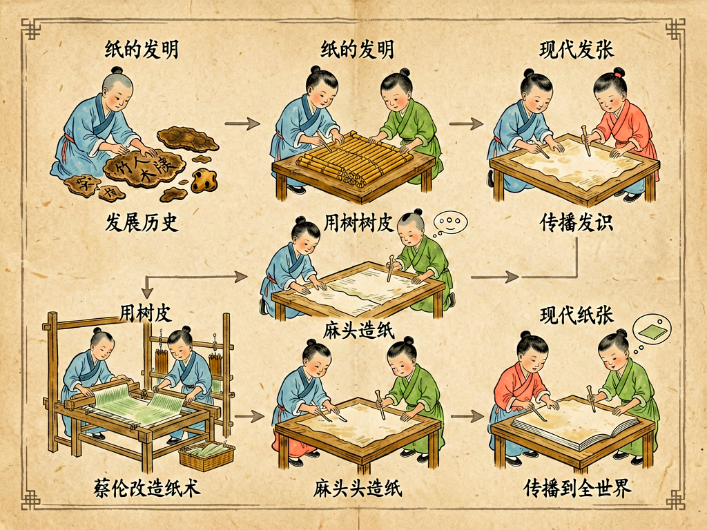

## 第五章 纸的故事

---

### 📍 本章导航
**核心主题**：你现在摸这本书的纸，可能觉得它普通得不能再普通，但你有没有想过——这张薄薄的、几克重的纸片，是人类历史上最伟大的发明之一？在纸出现之前，知识是极端昂贵的奢侈品，刻在龟甲上、铸在青铜器上、写在竹简和绢帛上，普通人一辈子都接触不到几本书。纸的发明，第一次把信息的载体变得足够轻、足够便宜、足够容易复制，它和印刷术一起，**真正让知识走下了精英的神坛，开启了知识民主化的进程**，没有纸就没有后来的教育普及、科学革命、现代文明。这一章我们不只讲纸是怎么做的，更要讲清楚：一张薄薄的植物纤维片，是怎么托举起整个人类文明的  
**你将发现**：
- 纸的本质一点都不神秘：它就是把树皮、竹子、木头、破布里的植物纤维分离出来，打散在水里，然后滤掉水，让纤维重新交织、压平、晒干，变成一张薄薄的平面。人类没有发明什么全新的材料，只是把植物纤维重新组织了一下——但就是这个简单的重组，改变了整个世界
- 在纸之前，记录知识有多难、多贵？商朝人刻甲骨文，刻一片龟甲可能要一天；周朝人写在竹简上，一篇几千字的文章要写几十斤重的竹简，出门要用车拉（"学富五车"其实没多少书）；欧洲人用羊皮纸，抄一本《圣经》要杀几百只羊，一本书价值连城，只有教会和贵族能藏书——那时候知识就是权力，普通人根本接触不到
- 蔡伦不是纸的发明者——考古发现西汉就有灞桥纸、放马滩纸，比他早两百多年。但那些纸粗糙、产量低、成本高，没法大规模用。蔡伦的伟大之处，是他改进了造纸工艺，用树皮、麻头、破布、旧渔网这些极其便宜的废料当原料，造出了质量稳定、成本极低、普通人也用得起的纸，还把工艺标准化，推广到全国。真正伟大的发明，不是从无到有造出某个东西，而是把原来只有少数人用得起的奢侈品，变成所有人都能用得起的日常品
- 纸和印刷术是天生的绝配。古腾堡1440年发明活字印刷术，如果当时欧洲人还用昂贵的羊皮纸，印刷术根本普及不了——刚好那时候造纸术已经从中国经阿拉伯传到欧洲几百年了，便宜的纸张+高效的印刷，一下子让书的成本降了几百倍。接下来就是宗教改革、文艺复兴、科学革命——知识不再被教会垄断，普通人也能读书、读《圣经》、接触到新思想，整个欧洲的社会结构都被改变了。技术的连锁反应，往往在发明的时候没人能想到
- 不同的纸有不同的"性格"，对应文明的不同需求：安徽宣纸用青檀树皮和稻草做，纤维均匀，润墨性好，能存一千年不烂，所以适合中国书画；新闻纸用木浆做，成本极低，适合印报纸，但里面木质素多，放久了氧化会变黄变脆，所以旧报纸几十年就碎了；钞票纸用棉麻长纤维，加了水印、安全线，耐磨耐折，还防伪；滤纸有均匀的孔隙，能把固体和液体分开；卫生纸特别柔软，遇水容易分解，不会堵马桶；无酸纸去掉了酸性物质，能存几百年，图书馆里的重要书籍、档案都要用无酸纸印
- 你有没有想过为什么旧书放久了会变黄？就是因为过去的造纸工艺没有去掉木质素，也没有做脱酸处理，木质素氧化之后会变黄变脆，纸就碎了。很多民国时期的书现在一碰就碎，就是这个原因——所以保护古籍，最重要的就是脱酸和低温干燥保存
- 纸不只是用来写字画画的：它保存了诗歌和艺术，更保存了契约、法律、账册、档案、地契、试卷、钞票——它是大规模国家治理、商业贸易、教育体系、法治社会的物质基础。一个帝国要管理几千万人，要收税、要判案、要传命令、要选拔人才，没有便宜的纸来写文件，根本做不到。纸是前工业时代最重要的"信息技术基础设施"，就像今天的互联网一样
- 数字时代，纸为什么没有消失？因为屏幕替代不了纸的物理特性：纸不需要电，不怕摔，能随便折、随便写、随便画，读的时候有空间感（你会记得一个知识点在书页的哪个位置，有助于记忆），有物理证据感（签字的合同、盖章的证书、手写的笔记，纸比电子文件给人的确定感强太多了），还有卫生纸、包装纸、滤纸、纸板这些功能，屏幕根本替代不了。现在纸不是被淘汰了，而是从"唯一的信息载体"，退回到了它最擅长的位置，和数字媒介分工合作
- 这一章最深刻的洞见：**文明的进步，往往不是靠什么惊天动地的黑科技，而是靠降低成本的普惠性技术**。纸把记录和传播知识的成本打了下来，印刷术把复制的成本打了下来，互联网把传输的成本打了下来，每次信息成本的大幅下降，都会带来知识的大普及、社会结构的大变革，让更多普通人有机会接触知识、参与创造。技术最伟大的意义，从来不是炫技，而是普惠
- 当然，造纸要砍树、要用水、要排污，今天我们用的纸很多还是用木材造的，所以节约用纸、废纸回收、用再生纸和竹浆纸，就是在保护森林、保护环境——珍惜每一张纸，不只是省钱，也是在珍惜人类文明的这个老朋友

**阅读建议**：读完这一章，你再拿起一张纸的时候，就不会觉得它只是个普通的日用品了——你看到的是两千多年里技术的演化，是知识从贵族走向大众的历史，是整个文明被一张薄片托起来的重量。

---

### 🖋️ 经典原文

今天我们天天和纸打交道，看书、写字、擦手、包东西，走到哪里都离不了纸，纸多到我们甚至都意识不到它的存在——它太便宜、太普通、太理所当然了。但是你倒回去两千年，在纸刚发明的时候，纸可是和今天的芯片一样，是最顶尖的高科技产品，是改变整个文明走向的伟大发明。
没有纸的时候，人类要把知识和记忆留住，有多难？
最早的时候，我们的祖先在龟甲和兽骨上刻字，就是甲骨文。一片龟甲刻不了几个字，刻起来还特别费劲，要拿青铜刀子一点点刻，可能一天刻不了几十个字，那是只有王室占卜的时候才用得起的东西，普通人连见都见不到。
后来到了商周，开始在青铜器上铸铭文，叫金文，那就更贵了——铸一口青铜鼎要几十上百个工匠干几个月，上面能铸几百个字就了不起了，那是传国重器，只有天子和大贵族才有资格用。
再后来有了竹简和木牍，就是把竹子或者木头削成一片片的长条，在上面写字，用绳子串起来，就是一册书。竹简倒是比甲骨青铜器便宜多了，但还是太重太占地方——一篇几千字的文章，要写几十斤竹简。传说秦始皇每天看的公文，要一百二十斤重，两个壮汉抬着；汉朝的东方朔给汉武帝写了一封奏章，用了三千片竹简，两个人抬进宫去，汉武帝看了两个月才看完。我们现在说"学富五车"，说一个人学问大有五车书，那五车竹简其实也就几百万字，相当于现在两三本长篇小说的量。
那时候也有轻便的东西——绢帛，就是丝织品，又轻又薄，能写能画，但绢帛太贵了，一匹绢抵得上好几石粮食，普通人家根本用不起，只有皇家和大贵族才偶尔用来写字。
你看，在纸出现之前，知识真的是奢侈品。书是按"车"、按"斤"来算的，普通人家一辈子都不可能有一本书，读书识字是上层阶级的特权，知识被垄断在贵族、官府和教会手里，普通人连认字的机会都没有，文明怎么可能快速进步？
然后纸来了。

纸是怎么做出来的？说穿了原理特别简单。我们知道木头、树皮、竹子、麻、破布里面，都有很长的植物纤维——就是像小绳子一样的纤维素分子链。你把这些原料泡在水里，蒸煮，捶打，把纤维之间的胶质去掉，把它们完全打散，变成像粥一样的纸浆——这时候每一根纤维都是分开的，漂在水里。然后你用一个细竹帘或者金属网，从纸浆里抄一层薄薄的纸浆上来，水从网眼里漏下去，纤维就留在网面上，互相交错缠绕在一起，变成一张湿乎乎的薄纸。你把这张湿纸揭下来，压平，烘干，就是一张能用的纸了。
你看，整个过程没有什么神奇的化学反应，就是把植物纤维打散了再重新交织到一起——就像你把一团毛线拆成一根根毛线，再重新把它们铺成一块薄毛毡。就这么一个简单的原理，人类摸索了几千年才真正掌握。
过去大家都说是蔡伦发明了纸，其实不是。考古学家在陕西、甘肃的西汉墓葬里，发现了比蔡伦早两百多年的古纸——灞桥纸、放马滩纸，那时候就已经有植物纤维做的纸了。但是那些纸很粗糙，纤维没打散，厚薄不均匀，根本没法写字，只能用来包东西。而且那时候造纸原料贵，产量低，普通人根本用不起。
蔡伦是东汉和帝时候的太监，当尚方令，就是管皇家作坊的官，相当于现在的国家央企总工程师。他在前人造纸的基础上，改进了工艺，最大的贡献是找到了极其便宜的原料：树皮、麻头、破布、旧渔网——这些东西本来都是垃圾，没人要的废料，他用这些废料造出了质量稳定、表面光滑、能写字的纸，而且把造纸工艺标准化了，能大规模生产，成本一下子降了几十上百倍。公元105年，他把造出的纸献给汉和帝，皇帝夸他能干，从那以后造纸术就推广到了全国，普通人终于也用得起纸了。
你可别小看"用得起"这三个字——这才是发明最关键的一步。很多东西不是你造出来就算成功了，你得造得足够便宜，便宜到普通人都用得起，它才能真正改变世界。如果纸一直像绢帛一样贵，那它和竹简比根本没有优势，也就不会有后来的印刷术，不会有知识的普及。
一项技术，从发明到普及，从奢侈品变成日用品，才是它真正改变文明的时候。

纸便宜了之后，变化是天翻地覆的。
首先，书终于能"卷"着拿了——之前竹简是"册"，是一串串的竹片，太重；有了纸之后，把纸一张张粘成长条，卷在轴上，就是"卷轴"，我们今天说"读万卷书"、"开卷有益"，都是从纸卷来的。后来又发明了线装书，一页页叠起来装订，看书更方便了。
抄书变得容易了，书的成本大大降低，民间开始有了藏书的人，私学开始兴盛，更多普通人能读书认字了。后来隋朝发明了科举制，为啥之前没有科举？因为之前书太贵，普通人读不起书，根本没法考试选拔；纸普及了之后，读书成本降下来了，才可能有科举，让底层的普通人也能通过读书改变命运。
到了唐朝，发明了雕版印刷，宋朝毕昇发明了活字印刷，印刷术和便宜的纸张碰到一起，知识复制的成本又降了几百倍，书开始大规模流传，文化彻底繁荣起来。
造纸术在唐朝的时候沿着丝绸之路传到了阿拉伯世界——公元751年，唐朝和阿拉伯帝国打怛罗斯之战，阿拉伯人俘虏了几个会造纸的中国工匠，就在撒马尔罕建了第一个造纸厂，之后造纸术慢慢传到了埃及、摩洛哥，再传到欧洲。
欧洲人那时候用什么写字？用羊皮纸，就是把羊皮或者小牛皮刮薄了处理之后写字，一张羊皮纸贵得要命，抄一本完整的《圣经》，要杀两三百只羊，花好几年时间抄写，一本书的价值相当于一个农庄。所以整个中世纪，书几乎都在教会手里，只有教士和贵族识字，普通人连《圣经》都读不到，所有思想都被教会垄断，这就是黑暗的中世纪。
12世纪造纸术传到欧洲，14世纪欧洲已经有很多造纸厂了，纸比羊皮纸便宜太多了。到了1440年，古腾堡在德国发明了金属活字印刷术，有了便宜的纸，印刷机一开，书就像流水一样印出来，成本只有羊皮纸手抄书的几百分之一。
接下来发生的事情大家都知道了：书不再是教会的专属品，普通人也买得起书、读得到书了，《圣经》被翻译成各国语言印出来，大家能自己读《圣经》了，不用听神父解释了——这就是宗教改革；古希腊罗马的典籍被重新印出来传播，大家开始重新发现理性和人的价值——这就是文艺复兴；再后来，科学家们的著作能快速印出来，在全欧洲传播，不同国家的科学家能互相看对方的研究成果，知识快速积累——这就是科学革命。
你看，从蔡伦改进造纸术，到古腾堡印刷机，中间隔了一千三百多年，但这两个技术凑到一起，直接打破了教会对知识的垄断，开启了整个现代文明。如果没有便宜的纸，这一切都不可能发生。一张几克重的纸片，就是这么撬动了整个世界历史。

纸发展到今天，早就不是只有"写字"这一种功能了，它变成了一个庞大的材料家族，不同用途的纸，性格天差地别：
我们写毛笔字用的宣纸，用安徽泾县的青檀树皮加沙田稻草做，纤维特别细长均匀，墨落在上面会晕开恰到好处的层次，而且因为纤维纯，杂质少，酸性低，宣纸能存一千年都不坏，"纸寿千年"说的就是它，所以古代的书画能传到今天，宣纸功不可没。
印报纸的新闻纸，是用最便宜的磨木浆做的，成本极低，适合高速轮转印刷，但是这种纸里面残留了大量木质素和酸性物质，放个几十年就会氧化变黄，变脆碎裂——你家里如果有二三十年以前的旧报纸、旧课本，拿出来看看，是不是已经黄了、脆了？就是这个原因。所以图书馆里珍贵的书籍、档案，现在都要用无酸纸来印，去掉了木质素，做了脱酸处理，能存几百年。
印钞票的钞票纸就更讲究了，它不用木浆，用棉纤维和麻纤维做，特别结实耐磨，折几万次都不会破，泡在水里也不会烂；里面还加了水印、安全线、荧光纤维、凹凸纹，各种防伪技术，让假钞很难仿造。
还有我们每天用的卫生纸，要特别柔软，纤维短，遇水容易碎分解，不然会堵马桶；包东西的牛皮纸，用长纤维做，强度特别高，耐磨抗拉；咖啡过滤纸、化学实验用的滤纸，孔隙大小特别均匀，能把固体颗粒全部挡住，让液体透过去；还有瓦楞纸板，中间一层波浪形的纸，夹在两层平纸中间，特别轻但缓冲性能特别好，我们网购的快递箱子，全是瓦楞纸板做的。
你看，一张纸看起来简单，里面的材料科学可一点都不简单——根据不同的需求调整纤维原料、打浆程度、添加剂、压制工艺，就能造出性能完全不同的纸，满足文明的各种需求。

到了今天，我们有电脑、有手机、有电子书，很多人说纸要被淘汰了。但是你看，纸消失了吗？没有。
电子书看了这么多年，纸质书的销量反而在回升；大家天天在电脑上办公，但重要的合同、文件、证书，还是要打印出来签字盖章才觉得靠谱；学生上课，大部分人还是喜欢用纸笔记笔记，记得更牢；卫生纸、包装纸、纸箱、纸巾，这些东西的用量反而越来越大了。
为什么？因为纸有很多特性是屏幕替代不了的：
第一，它是物理实体，不需要电，不会没电，不会死机，不怕摔，你折它、画它、在上面随便写，它都不会坏；
第二，它有触感和空间感，读纸质书的时候，你摸得到纸张的厚度，记得某个知识点在左页还是右页，在上半部分还是下半部分，这种空间位置感能帮你记忆，很多人读纸质书记东西就是比读电子书牢；
第三，它有物理证据感，白纸黑字，签字画押，摸得到看得见，比存在硬盘里的电子文件给人的确定感强太多了，所以法律文件、重要凭证，还是要用纸；
第四，它便宜到离谱，一张A4纸才几分钱，你可以随便用随便扔，不需要考虑成本——想想看，如果没有卫生纸，我们每天上厕所要用什么？这个问题屏幕根本解决不了。
所以纸不会被淘汰，它只是从"唯一的信息载体"，退到了它最擅长的位置上，和数字媒介分工合作：屏幕适合快速传播、快速检索、海量存储，纸适合深度阅读、手写记录、物理凭证、触感体验、卫生包装——它们各干各的，谁也替代不了谁。
而且老材料还在不断出新用途：现在科学家做出了电子纸（就是Kindle用的墨水屏），像纸一样不发光，反射自然光，看久了眼睛不累，省电；还有石头纸，用碳酸钙粉末加塑料做的，不用砍树，不用水，防水防撕；还有纳米纤维纸，能过滤病毒和PM2.5，用来做口罩和防护服；甚至还有纸做的传感器、纸做的电池、纸做的微流控芯片，几毛钱一张，用来做快速医疗检测，在贫困地区不用昂贵的设备，一张纸就能检测传染病。几千年的老材料，到今天还在不停演化出新用法，这就是纸的生命力。

最后我们说回人和纸的关系。造纸需要用木材、竹子，需要用水和能源，造纸过程中还会产生废水排放。我们国家现在每年生产一亿多吨纸和纸板，要砍很多树，用很多水，所以节约用纸不是一句空话：打印的时候双面打，废纸分类回收（一吨废纸能造800公斤好纸，少砍17棵大树），少用一次性纸巾多用手帕，不用过度包装的商品，尽量用再生纸和竹浆纸——这些小事，都是在保护森林，保护环境。
纸从两千年前走来，从蔡伦的工坊里，从抄纸帘上那层湿乎乎的纤维开始，一路托着人类的知识、记忆、法律、艺术、商业、文明，走到今天。它轻得几乎没有重量，却承载了整个人类文明最重的记忆。我们每天用它的时候，可能都不会多看它一眼，但如果没有纸，我们今天拥有的一切——书、教育、法律、科学、文化，全都不会存在。
下一章，我们讲漫谈粗粮和细粮。

---

> 📜 **科学史话：一张纸的环球旅行——从中国作坊到欧洲印刷机，走了一千年**
>
> 公元105年，蔡伦改进造纸术，中国开始大规模用纸。之后造纸术慢慢向外传播：
>
> 公元3世纪传到越南、朝鲜；公元7世纪传到日本——日本的遣唐使把造纸术带回日本，后来发展出了自己的和纸工艺；
>
> 公元751年，唐朝和阿拉伯帝国在中亚打怛罗斯之战，唐军战败，几个会造纸的士兵被阿拉伯人俘虏，阿拉伯人就在撒马尔罕（现在乌兹别克斯坦境内）建了阿拉伯世界第一个造纸厂。当时撒马尔罕纸成了整个阿拉伯世界最受欢迎的商品，慢慢传到了巴格达、大马士革、开罗，阿拉伯人又改进了工艺，用亚麻做原料，造出了更薄更光滑的纸。
>
> 之后造纸术随着阿拉伯帝国的扩张，沿着北非地中海海岸往西传，公元11世纪传到摩洛哥，1150年，西班牙建起了欧洲第一个造纸厂——这时候距离蔡伦造纸，已经过了一千年。
>
> 欧洲人一开始对纸是抵触的，教会觉得纸是"异教徒的材料"，不如羊皮纸神圣，很长一段时间里官方文件还是必须写在羊皮纸上。但纸实在太便宜了，商人、学生、作家很快就开始用纸，到14世纪，法国、意大利、德国都有了造纸厂，纸彻底在欧洲普及了。
>
> 1440年，古腾堡在德国美因茨发明金属活字印刷机，当时欧洲已经有了充足的便宜纸张，印刷机一开动，就像打开了洪水的闸门。1455年，古腾堡印出了第一本活字印刷的《圣经》（古腾堡圣经），之后五十年里，欧洲印了超过两千万本书，比过去一千年欧洲所有手抄书加起来还多。
>
> 后面的故事我们都知道了：书便宜了，识字的人多了，新思想快速传播，宗教改革、文艺复兴、科学革命接踵而来，中世纪结束了，现代世界开始了。这一切的起点，就是中国作坊里那张用破布树皮造出来的薄纸——技术的传播就是这样，它不会被国界挡住，也不会被意识形态挡住，它一旦足够好、足够便宜，就会自己走遍全世界，然后在你意想不到的地方，开出你根本预料不到的花。

---

> 🔬 **科学更新：老材料的新生命——21世纪的纸还能做什么？**
>
> 纸这个已经有两千年历史的老材料，到了今天，不但没有过时，反而在材料科学家手里玩出了各种新花样：
>
> **电子纸（墨水屏）**：很多人用的Kindle电子书就是电子纸，它本身不发光，靠带电的微胶囊（里面是黑白的带电颗粒）在电场下翻转来显示内容，就像真实的纸一样反射自然光，看久了不累眼睛，而且显示内容的时候几乎不耗电，只有翻页的时候耗电，充一次电能用几周。现在彩色电子纸也已经量产了，以后可能会做成电子报纸、电子海报、电子价签，像纸一样薄，能反复改写。
>
> **微流控纸芯片**：这是最近十年特别火的技术——在一张小小的滤纸上，用蜡打印出微流道，滴一滴血或者唾液上去，液体沿着流道流动，和提前印在纸上的试剂反应，就能检测出有没有怀孕、有没有感染艾滋病/疟疾、血糖高不高，整个检测只需要几分钟，成本只有几毛钱，不需要任何仪器，医生甚至普通人自己就能看结果。这种纸芯片特别适合非洲、东南亚这些医疗资源不足的贫困地区，不用去医院，一张纸就能做诊断，能救几百万人的命。
>
> **纳米纤维纸**：把纤维素或者其他聚合物做到纳米级的纤维，做成的纸孔隙特别小，比N95口罩的过滤层还密，能挡住99.99%的病毒和细颗粒物，而且透气，能用来做更好的口罩、防护服、水过滤膜；透明的纳米纸还能用来做柔性屏幕、可降解电子器件。
>
> **石头纸**：用80%的碳酸钙（就是石头的主要成分）加20%的塑料做的，完全不用木材，造纸过程不用一滴水，不用漂白，生产过程没有废水排放，造出来的纸防水、防撕、不霉、不黄，写完印完回收之后，能磨碎了重新做，或者直接扔到环境里会慢慢降解。现在很多笔记本、包装袋、书已经在用石头纸了。
>
> 你看，纸从来不是一个静止的"老古董"，它一直在跟着技术进步不断演化。两千年前它是最高科技的信息载体，今天它仍然是新材料创新的热门方向。好的材料就是这样，它不会轻易被淘汰，只会在新的时代找到自己新的位置。

---

> 🧪 **动手试一试：在家自己造一张手工再生纸**
>
> 你不用去造纸厂，在家用简单的材料，就能亲手做出一张纸，亲眼看看纤维是怎么交织成纸的：
>
> **准备材料**：
> - 用过的废纸（草稿纸、报纸、卫生纸都行，不要用带塑料覆膜的纸）
> - 一个大盆或者水桶
> - 一个搅拌机（或者木棍、擀面杖，用来打纸浆，有搅拌机最方便）
> - 一个筛网或者纱窗（要能漏水，网眼越细，造出来的纸越光滑，旧的纱窗、十字绣的绣绷都能用）
> - 干毛巾、旧报纸
> - 重物（几本厚书就行）
>
> **步骤**：
> 1. 把废纸撕成指甲盖大的小碎片，泡在水里泡几个小时，泡软；
> 2. 把泡软的碎纸放进搅拌机，加水，打成均匀的稀纸浆——像稀粥一样的浓度就好，不要太稠；如果没有搅拌机，就把纸放在盆里加水，用木棍使劲捣，捣到纤维都分开，变成糊糊状也行；
> 3. 把纸浆倒到大盆里，加多一点水搅匀，把筛网平着放进水里，从纸浆里平平地抄起来——这一步叫"抄纸"，你会看到筛网上留下一层均匀的湿纸浆，纤维已经交织在一起了；
> 4. 轻轻把筛网端起来，沥干多余的水，然后把湿纸扣在干毛巾上，轻轻揭下筛网，湿纸就留在毛巾上了；
> 5. 在湿纸上面再盖一层干毛巾，用手或者擀面杖轻轻压，把多余的水压出去，压得越平越好；
> 6. 把压好的湿纸小心揭下来，夹在两张干燥的旧报纸中间，上面压几本厚书，放在通风的地方阴干；
> 7. 等完全干了，揭下来就是一张你自己亲手做的手工纸！你可以在上面写字、画画，还可以在打纸浆的时候加花瓣、树叶、彩色丝线，做出来的纸会特别好看。
>
> **做完想想看**：你用废纸重新做出了一张新纸，这就是废纸回收的原理——纸的纤维可以反复回收打浆再造纸，一般能重复用5-7次，直到纤维太短了没法交织为止。如果所有废纸都能回收，我们能少砍一半以上的造纸用树。

---

### 💬 读后思考与讨论

1. 蔡伦不是第一个造出纸的人，但为什么大家都记得他？为什么说"把奢侈品变成日常品"比"从无到有发明"更伟大？你能举出其他类似的例子吗？
2. 纸的发明和普及，间接导致了欧洲宗教改革、文艺复兴和科学革命——一个材料技术的进步，为什么能带来这么大的社会和思想变革？我们今天的互联网、智能手机，是不是在扮演和当年的纸类似的角色？
3. 很多人说数字时代纸会消失，但纸到现在还被大量使用——媒介的演进一定是"新的完全取代旧的"吗？为什么很多老技术不会消失，只是找到了新的位置？
4. 造纸术从中国传到欧洲用了一千年，今天一项新技术从一个国家传到另一个国家可能只需要几个月——技术传播速度的加快，会怎么改变世界的发展节奏？
5. 为什么说"知识的民主化"是文明进步最重要的动力？纸、印刷术、互联网，这三次信息革命，分别在多大程度上推进了知识民主化？

### 🔗 关联阅读
- 第三部第十六章：《从历史的窗口看技术革命》→ 技术怎么改变文明进程
- 第三部第十章：《灰尘的旅行》→ 这本书的同名篇章，讲灰尘的旅行
- 第三部第二十八章：《大力宣传戒烟》→ 公共健康和科普的意义
- 跨章节思考：从纸到印刷术到互联网，每次信息存储和传播成本的下降，都会带来社会结构的巨大变化——下一次信息革命可能是什么？它会把我们带向哪里？
