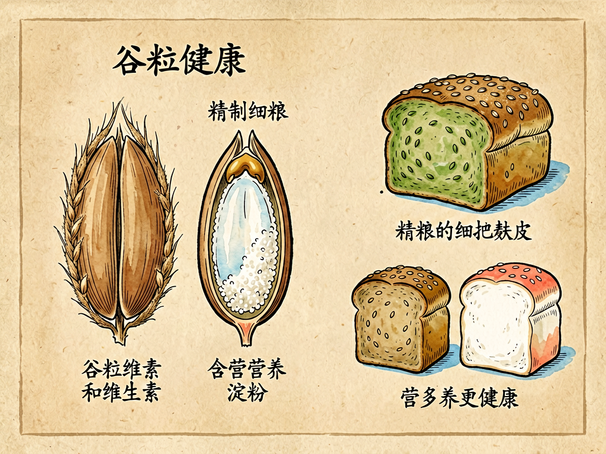

## 第六章 漫谈粗粮和细粮

---

### 📍 本章导航
**核心主题**：今天我们去超市买米买面，总觉得越白、越细、越精致的就越好。白米饭、白馒头、白面条、白面包，这些软软白白的主食，几乎成了我们餐桌上的绝对主角。但是你有没有想过：为什么越吃越精细，肥胖、糖尿病、便秘这些"富贵病"反而越来越多？为什么几十年前大家天天吃窝头、玉米饼、小米粥的时候，这些病反而很少？这一章我们就来聊粗粮和细粮——它们本质上不是两种不同的粮食，而是同一粒谷物加工到不同阶段的样子。我们不仅要讲营养，更要讲清楚一个深刻的文明悖论：**我们总喜欢把自然的东西加工得越来越精致、越来越讨好口感，但在去掉"粗糙"部分的同时，往往也扔掉了生命最需要的完整性**  
**你将发现**：
- 一粒完整的谷物种子，从外到内分四层：最外面是硬壳（稻壳、麦壳，不能吃），然后是麸皮（就是种皮，含有大量膳食纤维、B族维生素、矿物质），再里面是胚芽（这是种子的"生命核心"，未来会发芽长成新的植物，有维生素E、不饱和脂肪酸、各种活性酶），最大的部分是胚乳（主要就是淀粉，是给胚芽发芽准备的"能量包"，几乎全是碳水化合物）。我们说的"磨米磨面"，精加工的过程，就是把外壳、麸皮、胚芽全部磨掉筛掉，最后只留下中间白白的胚乳，就是白米白面——口感确实软、好嚼、好消化，但是种子里90%以上的维生素、矿物质、膳食纤维都被你磨掉当饲料扔了，剩下的几乎只有纯热量
- 为什么过去大家都追求白米白面？因为在古代，磨米磨面是很费人力的事，要把米反复舂、把面反复筛，才能得到白白的精米精面，普通老百姓根本吃不起，只有达官贵人、有钱人才天天吃白米白面。很长时间里，"白"就等于"富裕""体面""讲究"，吃粗粮是穷、是没办法的事。结果有趣的事情发生了：19世纪的日本、荷兰殖民者在印尼，很多天天吃精白米的富人、士兵，得了一种奇怪的"脚气病"——浑身浮肿、肌肉无力、神经疼，严重的心脏衰竭会死，而吃糙米的穷人反而很少得。当时大家都以为是传染病，找了很多年病菌都找不到，最后才发现：就是因为吃太精了，米糠里的维生素B1被磨掉了，缺了B1才会得病。这个发现直接推动了维生素的发现，也让人类第一次明白：吃得太精细，真的会吃出病来
- 现在营养学为什么又把粗粮请回餐桌？粗粮的好处不是什么神奇功效，就是因为它保留了完整种子的结构：第一，有大量膳食纤维，能促进肠道蠕动，预防便秘，还能喂养肠道里的有益菌；第二，消化吸收慢，升糖指数（GI）低，吃了之后血糖不会像坐过山车一样猛升猛降，饱腹感能维持很久，不容易饿，对控制体重、控制血糖都特别好；第三，保留了麸皮和胚芽里的B族维生素、维生素E、矿物质、多酚类抗氧化物质，这些都是精米白面里几乎没有的
- 但我们也不能神化粗粮，更不能走向另一个极端：不是吃得越粗越多就越好。突然吃太多粗粮，大量膳食纤维会刺激肠胃，容易腹胀、消化不良，还会影响钙、铁、锌这些矿物质的吸收；老人、小孩、肠胃功能弱、有胃溃疡的人，更不能顿顿全吃粗粮，要循序渐进，慢慢加量。最健康的永远是**粗细搭配**，按照《中国居民膳食指南》的建议，每天主食里1/4到1/2换成粗粮杂豆就行——比如煮米饭的时候抓一把糙米、燕麦、红豆、小米，蒸馒头的时候加一点玉米粉、荞麦粉，不用完全戒掉白米白面，替换一部分就好，既好吃，又健康，还容易长期坚持
- 一定要警惕"假粗粮"陷阱。超市里很多号称"全麦面包""杂粮饼干""粗粮馒头""荞麦面条"，看起来是棕色的，吃起来也粗粗的，其实配料表里第一位还是小麦粉（也就是精白面粉），只加了一点点麦麸、一点点色素和糖、油来调色调味，本质上还是细粮做的，甚至比白面包还不健康。判断真粗粮最简单的办法：看配料表，第一位必须是全麦粉、或者各种杂粮粉，才是真的；第一位写着"小麦粉"的，不管包装上写得多么健康，都是假粗粮
- 这一章最有意思的洞见，其实不止在吃饭上：人类文明有一种本能的倾向，就是把一切东西都加工得越来越精致、越来越光滑、越来越讨好我们的感官——粮食要磨得又白又细，信息要剪得又短又爽，娱乐要做得又刺激又不用动脑子，连社交都要变成点赞之交不用费神。但是就像磨掉麸皮和胚芽的精米白面一样，所有让你舒服、顺滑、不用咀嚼的加工，在去掉粗糙和麻烦的同时，往往也去掉了那些对生命真正重要的、完整的、有营养的部分。粗粮教给我们的，不只是怎么吃饭，更是一种生活智慧：不要只追求即时的口感和舒服，要学会接受和珍惜那些看起来不那么精致，但更完整、更真实、对我们长期有益的东西
- 最后说回到粮食安全和农业韧性：很多杂粮粗粮——小米、高粱、荞麦、燕麦、青稞、各种杂豆——比水稻、小麦耐旱、耐贫瘠、抗病虫害，在坡地、旱地、贫瘠的土地上都能长，不用太多水和化肥。如果我们的农业只种少数几种高产细粮，虽然产量高，但是生物多样性差，遇到旱灾、病虫害、气候变化的时候，整个粮食系统就会很脆弱。保留杂粮种植，保留不同地区的传统粗粮品种，不只是为了健康，更是为了我们的粮食安全，为了农业系统能抵抗风险。粗粮不只是健康食品，更是人类农业文明留下来的"种子备份"

**阅读建议**：读完这一章，你下次盛米饭、买面包的时候，不妨多想一想：这碗饭里，我吃进去的是完整的种子，还是只剩了淀粉的纯热量？健康从来不是什么复杂的事情，往往就藏在这些日常的小选择里。

---

### 🖋️ 经典原文

我们每天吃饭，主食不是米就是面。大家总觉得米要越白越好，面要越细越好，白米饭、白馒头、白面条，软软乎乎的，嚼起来不费劲儿，咽下去也舒服。以前谁家要是天天能吃上纯白米白面，那就是好日子，是富裕人家；吃窝头、玉米饼、小米粥、高粱米，那是穷人家没办法的事，是粗茶淡饭。
可是现在反过来了，大家生活好了，天天白米白面吃着，反而开始提倡吃粗粮了——糙米、燕麦、玉米、小米、荞麦、红豆、绿豆，这些以前"穷人才吃"的东西，现在反而卖得比白米还贵，成了健康食品。这到底是怎么回事？是以前的人不懂营养，还是现在的人故意找罪受？
要搞懂这件事，我们得先看一粒粮食到底是怎么长的，它里面到底有什么。
就拿一粒大米来说吧。长在田里的时候，它是稻谷，外面包着一层硬硬的稻壳，就像穿了件盔甲，保护里面的种子。把稻壳碾掉，里面就是糙米——这时候你看它，不是白的，是浅棕色的，表面不光滑，有点糙。糙米再继续碾，把外面那层浅棕色的皮（就是米糠，也就是麸皮）磨掉，再磨掉米尖上那个小小的小黄点（那是胚芽，未来会长成稻苗的地方），磨啊磨，筛啊筛，最后剩下的中间那部分，白白净净、光光滑滑的，就是我们天天吃的白米。
麦子也是一样：整粒小麦磨成全麦粉，是带着麦麸和胚芽的，颜色发暗，有点粗；反复筛，把麦麸和胚芽都筛出去，剩下的雪白的面粉，就是我们吃的精白面粉。
你看，粗粮和细粮，本质上根本不是两种不同的粮食——它们就是同一粒种子，加工精度不一样而已。粗粮，就是没磨那么狠，保留了麸皮和胚芽的整粒谷物；细粮，就是把麸皮和胚芽全去掉，只留中间胚乳的精制谷物。就这么点差别，营养上差了可不止一点半点。

那被我们磨掉的麸皮和胚芽里，到底有什么好东西？
先说说麸皮，就是谷物那层外皮。它的主要成分是膳食纤维——这种东西我们人体自己消化不了，吃下去不会变成热量，但是它特别重要：它能像小刷子一样，促进肠道蠕动，让便便更通畅，预防便秘；它能像海绵一样，在肠道里吸附多余的胆固醇、糖分，延缓它们的吸收，让血糖不会一下子升得太高；它还是我们肠道里有益菌的"粮食"——肠道里的双歧杆菌、乳酸菌这些好细菌，就靠吃膳食纤维活着，你给它们喂够了，它们长得好，你的肠道就健康，免疫力也好，甚至连情绪都会受影响。除了膳食纤维，麸皮里还有大量B族维生素、镁、钾、锌这些矿物质，都是我们身体新陈代谢离不开的东西。
再说说胚芽，那可是种子的"心脏"——整粒种子里最有活力的部分，发芽就靠它。胚芽虽然只占种子重量的2%-3%，但营养特别密集：有维生素E（抗氧化、保护血管）、不饱和脂肪酸（对大脑和心血管好）、B族维生素、还有各种活性酶和植物化学物质。
而我们留下的胚乳呢？90%以上都是淀粉，也就是碳水化合物，吃到肚子里很快就会被分解成葡萄糖，给身体提供能量——除了热量，别的营养很少，说它是"纯能量食物"一点都不夸张。
你算一算：精加工之后，我们把粮食里70%-90%的B族维生素、90%以上的膳食纤维、大部分矿物质和维生素E，都随着米糠、麦麸磨掉当饲料喂猪喂鸡了，最后自己吃的，几乎只剩淀粉和热量。这就好比你吃橘子，把果肉和皮都扔了，只吃中间那点橘络；吃鸡蛋，把蛋黄蛋白都扔了，只吃蛋壳——你得到的，已经不是完整的食物了。

那为什么我们放着营养丰富的完整谷物不吃，非要费这么大劲把它磨成白的？
首先当然是口感：白米白面软，好嚼，好消化，吃起来顺口，没有粗糙的渣子；粗粮纤维多，嚼起来费劲儿，咽下去喇嗓子，对习惯了软食的人来说确实没那么好吃。
然后是储存：胚芽里有不饱和脂肪酸，放久了会氧化变哈喇味，不好存；白米白面把胚芽和麸皮都去掉了，能放好几年都不坏，方便储存运输，特别适合大规模商业化流通。
但最重要的原因，还是文化和阶级：在古代，没有机器，磨米舂米全靠人力，要把糙米舂成白米，要反复筛面得到精白粉，费工费时，产量低，价格贵，普通人根本吃不起，只有贵族、富人、官员才能天天吃白米白面。几千年来，"白"就等于"精致""富裕""体面""高级"，吃粗粮就是贫穷、寒酸、不得已。这种观念太根深蒂固了，直到今天，很多长辈还觉得给客人吃白米饭才是尊重，吃杂粮就是招待不周。
这种"越白越好"的观念，甚至还吃出过大病，最有名的就是脚气病。
这里说的脚气病不是脚上长水泡痒的那种脚气（那个是真菌感染），是一种会死人的重病：患者一开始浑身没劲，手脚发麻，走路困难，然后浮肿，心脏扩大，最后心脏衰竭死亡。19世纪的时候，日本海军很多士兵得这个病，每年病死的比打仗死的还多；荷兰殖民者在印尼的军队里也闹这个病，士兵一批批死。当时所有人都觉得这是传染病，找了几十年病菌，什么都没找到。
后来一个叫艾克曼的荷兰医生发现了一件怪事：他养的实验鸡，如果吃军队食堂剩下的精白米饭，就会得脚气病，浑身瘫软站不起来；如果给它们吃带米糠的糙米，或者在饲料里加一点米糠，鸡很快就好了。他自己试着给得了脚气病的病人吃米糠，居然也治好了。
这时候大家才明白：脚气病根本不是什么传染病，就是因为长期吃精白米，缺了米糠里的一种东西——后来我们把它叫做维生素B1（硫胺素）。B1是人体新陈代谢必需的东西，缺了它，糖代谢就出问题，神经和心脏最先受影响，严重的就会死。糙米里B1很丰富，但是90%都在米糠里，全给磨掉了，天天吃白米当然会缺。
你看，为了追求口感和体面，把粮食里最精华的部分扔了，最后居然吃出了流行病。这是人类营养史上一个特别重要的教训：食物不是越精致越好，加工得太狠，把身体需要的东西都去掉了，再好的东西也会吃出病来。

现在大家生活好了，不再缺热量了，顿顿白米白面，反而吃出了新的问题：肥胖、糖尿病、高血脂、便秘、肠道菌群失调，这些所谓的"富贵病"，发病率几十年里翻了好几倍，而且越来越年轻化，其中一个很重要的原因，就是主食吃得太精细了。
精米白面好消化，吃下去之后淀粉很快就变成葡萄糖被吸收，血糖一下子就冲到很高，胰腺赶紧分泌大量胰岛素把血糖降下来，血糖一降你很快又饿了，就会想吃更多东西，形成恶性循环——不仅容易胖，时间长了胰腺累坏了，还会得2型糖尿病。而粗粮因为有膳食纤维包着，淀粉消化吸收慢，血糖是慢慢升上去的，胰岛素不用猛分泌，饱腹感能维持很久，不会很快饿，对控制体重和血糖都好很多。
而且我们肠道里的有益菌，就靠膳食纤维活着，你天天吃精米白面，一点纤维都不给它们，有益菌饿死了，有害菌就会大量繁殖，肠道菌群失调，不仅容易便秘拉肚子，还会引发慢性炎症，和很多慢性病甚至癌症都有关系。
所以现在营养学界重新提倡吃粗粮，根本不是怀旧，也不是故意让大家吃不好，而是在纠正过去几百年里"越白越好"的偏差——我们吃了太多只有热量没有其他营养的精制主食，现在要把丢掉的完整性捡回来一点。

但是话说回来，我们也不能把粗粮神化，更不能从一个极端走到另一个极端。
不是说粗粮吃得越多越健康，更不是所有人都适合顿顿吃粗粮。膳食纤维是好东西，但是吃太多了，特别是突然一下子加很多，肠胃受不了，会腹胀、放屁多、肚子不舒服，还会影响钙、铁、锌这些矿物质的吸收。老人、小孩、肠胃功能弱、有胃溃疡、肠胃炎的人，就不适合吃太多太粗的粗粮，要煮软一点，慢慢加量，粗细搭配着来。
还有最坑人的，就是现在市场上满天飞的"假粗粮"。你去超市看，很多面包写着"全麦面包"，颜色是棕褐色的，看起来很健康，其实你翻到配料表看，第一位还是"小麦粉"（也就是精白面粉），只加了一点点麦麸，甚至加了焦糖色素来染成棕色，还加了大量糖、黄油、起酥油来改善口感，这样的"全麦面包"，热量比白面包还高，膳食纤维没多少，吃了反而更容易胖。还有杂粮饼干、粗粮馒头、荞麦面，很多都是这样——看起来是粗粮，其实本质还是精白面粉做的，加了点东西骗你而已。
识别假粗粮特别简单，就一个办法：看配料表。配料表是按含量从多到少排的，如果第一位是"全麦粉""黑麦粉""燕麦粉""玉米粉"这些，才是真粗粮；如果第一位是"小麦粉"，不管包装吹得多么天花乱坠，都是假的。
那对于我们普通人来说，到底怎么吃主食才最健康？其实特别简单，不用那么复杂，记住八个字就行：**粗细搭配，适可而止**。
不用完全戒掉白米白面，毕竟它们口感好，好消化，只要每天把主食里1/4到1/2换成粗粮杂豆就够了。比如煮白米饭的时候，抓一把糙米、燕麦、小米、红豆、藜麦进去一起煮；煮白粥的时候加一点红薯、山药、南瓜；蒸馒头的时候加一勺玉米粉、荞麦粉；早上冲一杯燕麦片，或者啃一根玉米。这样吃，既有白米白面的好口感，又有粗粮的营养，肠胃也容易接受，还容易长期坚持——再好的饮食方法，要是坚持不下来也没用。
不用追求多么高级的进口杂粮，普通的糙米、燕麦、玉米、小米、杂豆就很好，也不用顿顿吃，一天有一顿吃点粗粮就够了。健康是个长期的事，走极端从来都不是好办法。

其实粗粮和细粮的争论，到最后已经不只是吃饭的问题了。你仔细想想，我们人类文明是不是一直在做同样的事：把所有东西都往"更精致、更顺滑、更讨好感官"的方向加工——粮食要磨得又白又细，没有一点渣；视频要剪得又短又爽，没有一点多余的铺垫；文章要写得一看就懂，不用动一点脑子；社交要变成点赞之交，不用投入感情；娱乐要做得直接刺激，不用费一点劲儿。
所有让你觉得有点粗糙、有点费劲儿、需要咀嚼、需要动脑子、需要慢慢消化的东西，都被我们一点点磨掉了，最后留下的，都是顺滑、舒服、即时满足的东西。但是就像精米白面丢掉了维生素和纤维一样，这些被我们磨掉的"粗糙"部分，往往恰恰是对生命最有营养、最有价值的部分——思考的深度、人际关系的温度、克服困难的韧性、慢慢品味的耐心。
吃得太精细了，身体会生病；活得太"精细"了，精神也会生病。粗粮教会我们的智慧，就是不要总是追求即时的舒服和满足，偶尔也要吃点"粗粮"——读一点需要动脑子的书，交几个能说真话的朋友，做一点有点费劲儿但有长期价值的事，接受生活里那些不那么顺滑、不那么完美、但真实完整的部分。
当然，我们也不必完全否定细粮的价值——毕竟，柔软、温暖、好消化的白米饭，永远是我们胃里最踏实的安慰。就像生活里也需要轻松的娱乐、舒服的社交、不用费脑的时刻。最好的状态从来不是非黑即白，而是粗细搭配，有软有硬，有舒服的享受，也有粗糙的成长，这才是完整、健康的生活。
下一章，我们讲炼铁的故事。

---

> 📜 **科学史话：从脚气病到维生素——人类营养的一次重要觉醒**
>
> 19世纪80年代，荷兰统治下的印度尼西亚（当时叫荷属东印度）爆发了严重的脚气病，每年有几万人死去，荷兰军队里也有大量士兵病倒。当时医学界坚信脚气病是一种细菌引起的传染病，荷兰政府派了很多医生去研究，其中就包括年轻的军医克里斯蒂安·艾克曼。
>
> 艾克曼一开始也在找"脚气病菌"，他把病人的血液注射到鸡、兔子、狗身上，想让动物感染，但是找了好几年，什么病菌都没找到。直到1890年，他偶然发现了一件怪事：他养的实验鸡，突然也得了类似脚气病的病——浑身瘫软，站不起来，走路打晃，很多鸡都死了。他一开始以为是鸡被传染了，正准备研究，可是过了几个月，这些病鸡居然自己又好了。
>
> 艾克曼觉得奇怪，就去问喂鸡的饲养员：之前喂的是什么？后来又喂了什么？
>
> 饲养员说：之前有段时间，军队食堂里剩下的精白米饭没人要，他就拿来喂鸡了；后来换了个饲养员，说不能把公家的白米饭拿来喂鸡，就改成给鸡吃带米糠的糙米了。
>
> 艾克曼一下子被点醒了！他赶紧做实验：给一组鸡喂精白米饭，它们很快就得了脚气病；给另一组鸡喂糙米，或者在精米饭里加一点米糠，鸡就不会生病，已经生病的鸡吃了米糠很快就好了。他又在监狱里做调查，发现只给犯人吃精白米的监狱，脚气病发病率是25%；而给犯人吃糙米的监狱，几乎没人得脚气病。
>
> 1897年，艾克曼发表了他的研究结果，提出脚气病是因为饮食中缺少了米糠里的某种"保护因素"。后来其他科学家继续研究，终于在1926年从米糠里提取出了这种物质，就是维生素B1（硫胺素）。艾克曼也因为这个发现，获得了1929年的诺贝尔生理学或医学奖。
>
> 这个发现的意义远远不止治好了脚气病——它是人类第一次发现，原来人体需要的不只是蛋白质、脂肪、糖这三大宏量营养素，还有很多需要量非常少，但缺一不可的微量物质，少了就会生病，这就是维生素。之后的几十年里，科学家们陆续发现了维生素A、C、D、E……等等几十种维生素，直接开创了现代营养学，彻底改变了人类对食物和健康的理解。
>
> 而整个营养学的开端，就来自于一次对"吃得太精"的反思——当我们把自然的食物加工得太过头，去掉了那些我们以为没用的部分，最后受到惩罚的，是我们自己的身体。

---

> 🔬 **科学更新：肠道菌群——我们肚子里的"第二大脑"，原来最爱吃粗粮**
>
> 最近二十年微生物学最大的进展之一，就是对肠道菌群的研究。我们每个人的肠道里，生活着大约100万亿个细菌，总重量有1-2公斤，数量比我们自己全身的细胞还多——这些细菌不是外来的"客人"，而是我们身体的一部分，它们和我们是共生关系，深刻影响着我们的消化、免疫、代谢，甚至情绪和大脑功能，现在科学家们把肠道菌群叫做"被遗忘的器官"，或者"第二大脑"。
>
> 这些肠道细菌吃什么？我们自己消化吸收不了的膳食纤维，就是它们最主要的食物——也就是粗粮、蔬菜、水果里那些嚼不烂的纤维。你吃进去足够的膳食纤维，肠道里的有益菌（比如双歧杆菌、 Akk菌、粪杆菌）就会吃饱喝足，大量繁殖，它们发酵膳食纤维产生短链脂肪酸（比如丁酸、丙酸），这些东西能滋养肠道壁细胞，修复肠道屏障，降低慢性炎症，调节免疫力，还能通过血液循环影响大脑，改善情绪和认知能力。
>
> 如果你天天吃精米白面、大鱼大肉，几乎不吃膳食纤维，肠道里的有益菌就会被饿死，而喜欢吃脂肪和糖的有害菌就会大量繁殖，肠道菌群失调。这时候肠道壁的通透性会增加（就是常说的"肠漏"），细菌毒素和没消化完全的大分子会进入血液，引发全身的慢性低度炎症——这种慢性炎症，就是肥胖、糖尿病、高血脂、过敏、自身免疫病，甚至抑郁症、阿尔茨海默病的共同发病基础。
>
> 现在你明白为什么粗粮这么重要了吧？你吃粗粮，不只是为了自己补维生素通大便，更是在给你肚子里的100万亿个"小朋友"送饭吃——它们吃好了，你整个身体才会好。这也是为什么现在营养学界反复强调要多吃全谷物、多吃蔬菜水果、多吃膳食纤维，本质上就是在喂养你的肠道菌群，维持这个小生态系统的平衡。
>
> 更有意思的是，长期吃什么类型的食物，就会养出什么类型的肠道菌群。如果你长期吃高纤维的粗粮蔬菜，喜欢吃纤维的有益菌就会占优势；如果你长期吃高糖高油的精制食物，喜欢吃糖油的有害菌就会占上风，它们还会分泌一些物质，通过迷走神经给大脑发信号，让你更想吃糖吃油，形成恶性循环。所以改变饮食习惯一开始会很难，但是只要坚持一两个月，等肠道菌群换了一批，你就会发现自己不再那么馋垃圾食品了，反而觉得粗粮蔬菜吃着很舒服——因为你的肠道细菌已经换口味了。

---

> 🧪 **动手试一试：测一测你的主食消化速度，真假粗粮分辨实验**
>
> **实验一：白米饭 vs 杂粮饭，饱腹感对比**
>
> 1. 找一天中午，吃纯白米饭，配菜和平常一样，吃到平时的饱度，记录一下吃完之后过几个小时会觉得饿；
> 2. 另一天中午，吃杂粮饭（白米+糙米+燕麦按2:1:1比例煮，提前泡一下更容易熟），同样配菜吃到同样饱度，再记录一下过几个小时会饿；
> 3. 对比两次的时间差：你会发现杂粮饭的饱腹感明显更久，可能多扛1-2个小时，而且下午不容易犯困，也不会那么想吃零食。
>
> 这就是因为杂粮消化慢，血糖平稳，不会出现吃完白米饭之后血糖猛升猛降的情况，你自己的身体就能直观感受到差别。
>
> **实验二：教你三招分辨真假全麦面包**
>
> 1. **看配料表**：第一位必须是"全麦粉""黑麦粉"，如果第一位是"小麦粉""高筋粉"，不管它颜色多深、写了多少健康口号，都是假的；
> 2. **看质地**：真全麦面包孔隙不均匀，能看到明显的麦麸小颗粒，掰的时候不会特别软特别蓬松，有嚼劲；假全麦面包颜色均匀，特别软特别松，几乎看不到麦麸，很多是加了焦糖色素染的；
> 3. **尝味道**：真全麦面包有麦子的香气，带一点粗糙的嚼劲，不会特别甜；假全麦面包往往很甜，或者油很大，因为加了很多糖和油来改善口感。
>
> 下次去超市买面包的时候，不妨拿着这三招去对比看看，你会发现货架上80%号称全麦面包的，其实都是假的。

---

### 💬 读后思考与讨论

1. 过去大家觉得白米白面是富裕体面的象征，现在粗粮反而成了健康食品，你怎么看这种饮食观念的反转？生活里还有没有类似的事情？
2. 为什么说"把东西加工得越精致越好"是一种误区？除了粮食，你还能举出别的例子吗？（比如信息、娱乐、社交）
3. 很多人明明知道吃粗粮健康，但就是坚持不下来，你觉得最大的阻力是什么？有没有什么容易执行的粗细搭配小技巧？
4. 艾克曼发现维生素的故事告诉我们，很多时候大家都相信的"常识"（比如越白的粮食越好，比如病都是病菌引起的）可能是错的——我们在生活中，怎么避免被这种错误常识误导？
5. 肠道菌群的研究告诉我们，我们的身体不只是"我们自己的"，还和大量共生微生物息息相关。这种"共生"的视角，会怎么改变你对健康、对人和自然关系的理解？

### 🔗 关联阅读
- 第二部第十三章：《地球的繁荣与土壤的劳动者》→ 土壤里的微生物生态，和肠道菌群其实很像
- 第三部第十一章：《电的眼睛》→ 科技怎么改变我们认识世界的方式
- 第三部第二十三章：《谈寿命》→ 长期健康的生活方式有什么共同点
- 跨章节思考："不要追求过度精致，保留完整性"这个道理，除了吃饭，在生活、学习、工作里还能怎么应用？
