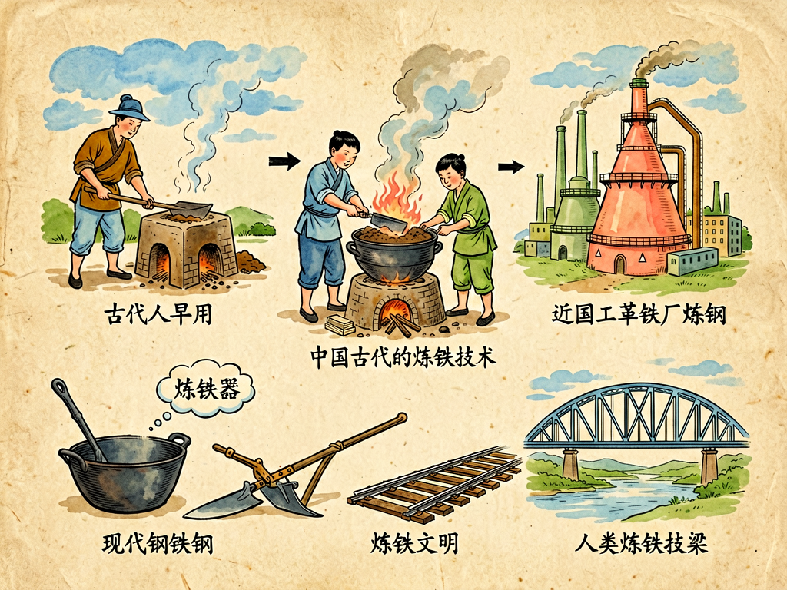

## 第七章 炼铁的故事

---

### 📍 本章导航
**核心主题**：你现在住的房子，钢筋混凝土里有钢筋；你坐的高铁、汽车、地铁，车身和轨道是钢做的；你走的大桥、用的刀剪、工厂里的机器、甚至你手机里的微小零件，都离不开铁和钢。钢铁就像现代文明的骨头——我们看不见它，但整个世界的重量都压在它上面。这一章我们讲炼铁的故事，不止讲炉火和矿石，更要讲清楚：人类是怎么把埋在地下、和石头绑在一起的铁，一点点变成文明骨架的？为什么说一个国家能炼出多少钢、能炼出什么样的钢，直接决定了它的工业能力？这整段故事，本质上就是人类学会控制火、控制能量、把石头变成力量的历史  
**你将发现**：
- 自然界里几乎找不到纯铁——地球上的铁，绝大多数都是和氧结合在一起，藏在红色、黑色的铁矿石里（赤铁矿、磁铁矿），和普通石头看起来没太大区别。炼铁的本质，说穿了其实就是一个简单的化学反应：在足够高的温度下，用碳把铁原子身边的氧"抢走"，把金属铁从石头里还原出来。就这么一个简单的"抢氧游戏"，人类摸索了几千年才真正玩明白
- 人类最早用的铁，根本不是从地里炼出来的，是天上掉下来的——陨铁，就是陨石里的铁镍合金。在还不会炼铁的年代，偶尔掉下来一块陨铁，那是比黄金还珍贵的神物，只有部落首领、国王才配用。考古发现最早的铁器，比如埃及法老图坦卡蒙墓里的铁匕首，就是陨铁做的，比黄金匕首还贵重。那时候铁不是日用品，是神物、是稀罕物
- 炼铁的核心门槛是温度。早期人类的炉子温度最多到1000℃左右，烧不出液态铁，只能炼出"块炼铁"——就是一块像海绵一样的铁疙瘩，里面混了很多炉渣杂质，要烧红了反复锻打，把渣子挤出去，才能做成铁器，费工费时，产量极低，比青铜还贵，根本普及不了。而我们中国在春秋时期就发明了竖炉，用多排皮囊鼓风，把炉温提到了1200℃以上，铁的熔点是1538℃，但在1150℃以上生铁就能熔化，能得到液态的铁水，可以直接浇铸成各种农具、工具、兵器——这个生铁铸造技术，比欧洲早了整整1600年！这也是为什么中国古代农业和生产力长期领先世界，因为我们早早就用上了便宜、好用的铁制农具
- 你肯定经常听到生铁、熟铁、钢，它们到底有什么区别？其实根本就是同一种东西，差别只有一个：含碳量不同。含碳量超过2%的是生铁：硬，耐磨，能铸造成型，但是特别脆，一砸就碎，不能锻打，所以适合做铁锅、犁铧这种不需要变形的东西；含碳量低于0.05%的是熟铁：软，延展性好，能打造成各种形状，但是太软，不够硬，做刀砍不动东西，做构件承不了重；含碳量在0.05%到2%之间的，就是钢——它既够硬，又有韧性，不容易断，是最完美的结构材料，做什么都合适。炼钢的本质，就是精准控制铁里的含碳量，把它调到那个最合适的区间，再去掉硫、磷这些有害杂质
- 但是在古代，钢是极其昂贵的奢侈品。要得到钢，要么把生铁反复加热锻打，让碳慢慢渗进去或者析出来，"百炼成钢"这个成语就是这么来的——打一把宝剑要几个月，反复锻打几百次；要么用坩埚炼钢，一次只能炼几公斤，贵得离谱。所以古代钢只能做刀剑、盔甲、小工具，根本不可能用来建桥、铺路、盖房子。直到1856年，一个叫贝塞麦的英国工程师，发明了转炉炼钢法：把空气直接吹进滚烫的铁水里，让铁水里多余的碳和杂质自己燃烧氧化，不用额外加燃料，十几分钟就能把十几吨铁变成钢，成本一下子降了几十上百倍。钢从此从奢侈品变成了白菜价的工业材料，人类才真正进入了钢铁时代——之后的铁路、桥梁、摩天大楼、轮船、火车、汽车、大炮、所有的机器，全都是建立在廉价钢的基础上。可以说，没有贝塞麦转炉，就没有现代工业文明
- 今天的钢铁工业是什么样的？一座现代高炉有十几层楼那么高，24小时连续运行，从顶部不停加铁矿石、焦炭、石灰石，从底部鼓进1000多度的热风，炉子里最高温度超过2000℃，液态铁水像水一样从炉底流出来，炉渣浮在上面被排走，一座大型高炉一天就能产1万多吨铁，能连续运行十几年不停火。从铁矿石进去，到钢板出来，整个流程高度自动化，一炉钢几千吨，成分误差控制在万分之一以内。这已经不是手工作坊了，是整个人类工业体系的缩影——它需要矿山、铁路、港口、电力、化工、机械制造所有行业配套，能造大型高炉、能炼出高品质钢材的国家，才算真正拥有完整的工业体系
- 这一章最深刻的洞见是：**整个人类文明的进步史，很大程度上就是一部控制温度的历史**。你能达到多高的温度，能多精准地控制反应，你就能把多么普通、多么廉价的材料，变成多么强大的工具。从烧陶器（800℃），到炼铜（1100℃），到炼铁（1500℃），到炼钢（1700℃），到炼硅（1900℃，做芯片），每一次温度的突破，都带来了材料的革命，也带来了文明的跃迁。材料的本质，就是能量的结晶——你投入多少能量，用多高的温度，把原子重新排列组合，你就能得到什么样的材料
- 当然，钢铁工业也不是没有代价。传统炼铁用焦炭（碳）当还原剂，把铁矿石里的氧夺走，会产生大量二氧化碳——全球钢铁行业的碳排放占了人类总碳排放的7%左右，是工业里最大的排放源之一，对气候变化有很大影响。但我们不能因此就不要钢铁了——我们的城市、交通、能源、建筑，还是离不开钢。现在全世界都在研发"绿色钢铁"：用氢气代替碳当还原剂，和氧反应之后生成的是水，完全没有碳排放，这就是氢冶金；还有用电弧炉回收废钢，把报废的汽车、桥梁、机器重新熔炼成新钢，只用废钢的话，碳排放只有传统高炉的1/3。钢铁不会消失，它只会变得更清洁、更可持续——工业文明不是只会向自然索取，它也在不断进化，学会和自然和谐相处
- 最后我们要记住：铁和钢本身是中立的，它没有善恶。它可以做成犁，开垦土地，让几亿人吃饱饭；也可以做成刀剑、大炮、坦克，变成杀人的武器；它可以做成大桥，连接两岸；也可以做成牢笼，困住自由。技术从来不会自己决定方向，决定方向的，是使用技术的人。我们学会了把石头炼成钢铁，也要学会用钢铁做对人有益的事，而不是用它来毁灭自己

**阅读建议**：下次你走在大桥上、坐在高铁里、摸着家里的不锈钢餐具的时候，不妨多停一秒想想——这些坚硬、沉默的金属，几千年前还只是地下的红石头，经过了火的锤炼、人的智慧，才变成了今天支撑你生活的一部分。我们的文明，就是这样被火一点点烧出来的。

---

### 🖋️ 经典原文

我们每天都在和铁打交道，却很少有人会想：这些硬邦邦、亮闪闪的铁，最早是从哪里来的？
你肯定会说，从矿里来的呀，铁矿石炼出来的。但是你到山上去看，铁矿石就是一块块红的、黑的石头，和普通石头看起来没什么两样——我们的祖先，是怎么想到，能从这些硬邦邦的石头里，炼出铁来的？
说起来很有意思，人类最早认识的铁，根本不是从地里炼出来的，是从天上掉下来的。
在人类还不会炼铁的几千年里，偶尔会有陨石从天上掉下来——铁陨石里有90%以上是铁，还有镍，是天然的金属合金。偶尔捡到一块陨铁，把它烧热了锻打，就能做成小刀子、小珠子。你想想，在到处都是石头、木头、陶器、青铜的时代，突然出现这么一种金属：比青铜硬，打出来的刃口更锋利，还不会生锈？不对，铁会生锈，但在当时看来，这种从天上掉下来的金属太神奇了，比黄金还稀罕，只有国王、祭司、大贵族才有资格用。
考古学家在古埃及法老图坦卡蒙的墓里，发现过一把铁匕首，旁边还放着黄金匕首——在三千多年前，这把铁匕首比黄金的贵重多了，因为它是天上来的，是神的礼物。古希腊语里，铁的意思就是"星"；古埃及人把铁叫做"天石"；古代阿拉伯人传说，铁是天上掉下来的金雨变成的。那时候的人根本想不到，这么珍贵的神物，其实在地下的石头里就有，只是他们没本事把它拿出来而已。

铁藏在石头里，为什么这么难拿出来？
因为铁太容易和氧结合了。你看我们平时见到的铁，放久了会生锈——锈是什么？就是铁和空气中的氧、水反应，又变回了氧化铁，和铁矿石里的成分是一样的。大自然里的铁，几乎全都是以氧化铁的形式存在的，和氧紧紧抱在一起，变成了石头的一部分。要把铁从石头里弄出来，你就得把氧给它抢走。
怎么抢？靠火，靠碳。
你把铁矿石和木炭放在一起烧，在足够高的温度下，木炭（也就是碳）会和氧化铁里的氧结合，变成二氧化碳跑掉，剩下的就是金属铁。这个反应，我们现在叫还原反应，说穿了就是碳把铁的氧给"抢"走了。
原理就这么简单，但是人类花了好几千年，才摸到这个门槛。为什么？因为温度不够。
最早的炉子，就是在地上挖个坑，把矿石和木炭堆在一起烧，最多也就烧到八九百度，这个温度下，铁根本不会熔化，只能在矿石表面还原出一点点铁粒子，和炉渣混在一起，形成一块软乎乎、像海绵一样的铁疙瘩——这就是块炼铁。你得把这块铁疙瘩烧红了，拿锤子反复锻打，打个几十上百次，把里面的炉渣一点点挤出去，才能得到一块能用的熟铁。
这种块炼铁，产量特别低，质量也不稳定，炼一块铁要费好多功夫，比青铜还贵。所以最早的铁器时代，铁并没有立刻取代青铜，因为太贵、太少了，只有少数人能用。
而我们中国的祖先，在春秋时期就搞出了大发明——竖炉。我们把炉子砌得高高的，用多个皮囊使劲往炉子里鼓风，让火烧得更旺，温度能升到1200℃以上。到了这个温度，虽然还没到纯铁的熔点（1538℃），但是铁吸收了碳之后熔点会降低，生铁在1150℃左右就会化成铁水，像水一样流出来！
这一下就完全不一样了。铁水能直接倒进模子里，浇铸成各种形状的器物——犁铧、锄头、镰刀、锅、箭头、车轴，想要多少就铸多少，不用一锤一锤打了，产量一下子翻了几十上百倍，成本也降了下来。我们中国早在战国时期，就用上了铁制农具，老百姓都能用得起铁器，耕地效率大大提高，粮食产量涨了，人口也涨了，这也是为什么中国古代文明能那么繁荣。而欧洲直到14世纪，才掌握了液态生铁冶炼技术，比我们晚了一千六百多年。
有了生铁之后，下一步就是炼钢了。
我们说的生铁、熟铁、钢，听起来是三种东西，其实根本就是同一种，区别只在含碳量：
- 含碳量超过2%，就是生铁：硬，脆，一砸就碎，能铸造成型，但不能锻打变形；
- 含碳量低于0.05%，就是熟铁：软，有延展性，能弯能折，能打成各种形状，但是不够硬，砍不了硬东西；
- 含碳量在0.05%到2%之间，就是钢：既够硬，又有韧性，不容易断，是最完美的材料——做刀能砍硬东西不卷刃，做梁能承重不折断，做弹簧能弹回来不变形，简直是万能材料。
但是在古代，钢太贵了。要得到钢，你得把生铁反复加热、锻打，让碳慢慢渗进去或者析出来，让含碳量刚好到那个合适的区间——"百炼成钢"这个词就是这么来的，打一把好钢刀，要反复折叠锻打几十次上百次，花几个月时间，比银子还贵。所以古代的钢只能做刀剑、盔甲、小工具，不可能用来盖房子、架桥、铺路——太贵了，用不起。
真正把钢从奢侈品变成白菜价的，是一个叫贝塞麦的英国工程师，时间是1856年。
当时贝塞麦在研究大炮，他想造出更结实的炮筒，但是当时的钢太贵了，铸大炮用的生铁又太脆，容易炸膛。他想了个办法：把空气直接吹进熔化的铁水里。本来大家都觉得，吹空气进去铁水不就凉了吗？结果没想到，铁水里多余的碳和杂质，遇到吹进去的氧气，居然自己烧起来了！燃烧产生的热量，不仅没让铁水降温，反而越烧越热，十几分钟的功夫，几吨铁水里多余的碳和杂质就烧没了，直接变成了钢！
就这么一个简单的办法，一下子把炼钢的成本降了90%以上，时间从几个月变成了十几分钟。以前钢是按公斤卖的奢侈品，现在能按吨批量生产了，便宜到和铁差不多。
这个发明一出来，整个世界都变了。
你想想，以前建桥用石头、用木头，最多跨几十米；现在有了便宜的钢，能架几公里长的钢铁大桥。以前铺路用碎石，马车跑不快；现在能铺几万公里的铁路，火车能拉着上千吨货物跑遍全国。以前盖房子最高也就五六层，用石头砖；现在有了钢梁钢筋，能盖几百米高的摩天大楼。轮船从木船变成了几万吨的钢铁巨轮，大炮从青铜炮变成了射程几十公里的钢炮，机器从木头做的变成全钢的，又结实又精密……整个工业革命的所有成果，几乎都建立在廉价钢的基础上。贝塞麦自己都没想到，他本来只是想造更好的大炮，结果不小心造出了整个现代世界的骨架。
从贝塞麦之后，炼钢技术还在不断进步：平炉、氧气顶吹转炉、电弧炉，钢的质量越来越好，成本越来越低，产量越来越大。19世纪末全世界一年才产几十万吨钢，现在全球一年产18亿吨钢，中国就占了一半还多——我们一年产的钢，比全世界其他国家加起来还多，这就是我们国家能成为"基建狂魔"，能建那么多高铁、大桥、高楼的底气。你到任何一个大钢厂去看，十几层楼高的高炉日夜烧着，通红的铁水像河水一样流出来，几千度的钢水倒进连铸机，几分钟就变成通红的钢坯，再轧成钢板、钢筋、钢轨，整个过程连续不断，一天产一万多吨钢——那场景，你看了就会明白什么叫工业的力量。
当然，炼铁炼钢也不是没有代价。传统的高炉用焦炭当还原剂，碳和铁矿石里的氧反应，会产生大量二氧化碳，全球钢铁行业的碳排放，占了人类总碳排放的7%，是工业里最大的排放源之一，也是气候变化的重要原因。而且开矿要挖山，要破坏植被，炼钢要烧大量煤炭，会有废气、废渣。
但是我们不能因此就回到石器时代，不用钢铁了——我们的房子、路、桥、车、医院、学校、风电、水电，所有的一切，都离不开钢。所以现在全世界的钢铁行业都在研究怎么"绿色炼钢"：用氢气代替焦炭当还原剂，氢气和氧反应之后生成的是水，完全没有二氧化碳排放，这就是氢冶金，现在中国、欧洲都已经有了实验工厂，再过十几二十年就能大规模推广；还有用电弧炉炼废钢，把报废的汽车、旧桥梁、旧机器拆了，废钢回炉熔化，重新炼成新钢，不用挖新的铁矿石，不用焦炭，碳排放只有传统高炉的三分之一，还能循环利用，理论上钢铁是可以无限回收的。
火可以把石头变成铁，人类的智慧也可以让这个过程变得更干净、更可持续。
其实你仔细想想，炼铁的故事，就是整个人类文明的故事：我们从只能捡天上掉下来的陨铁，到能自己炼铁，到能炼钢，到能建上百米的高炉一天产万吨钢，再到能造出零排放的绿色钢铁——这个过程里，我们一直都在和火打交道，和自然打交道，从只会用火取暖烤肉，到能精准控制几千度的高温，把石头变成我们想要的任何形状，支撑起整个文明。
铁本身是中立的。它可以变成犁，开垦土地，让无数人吃饱饭；也可以变成炮弹，炸死无数人。它可以架起桥梁，让相隔千里的人能见面；也可以筑起铁窗，困住人的自由。火和铁都是力量，力量本身没有对错，关键是握在谁的手里，用来做什么。
我们花了几千年学会了把石头炼成钢，我们也得学会怎么用好这股力量——让它托举我们的生活，而不是毁灭我们自己。
下一章，我们谈眼镜。

---

> 📜 **科学史话：为什么中国古代的冶铁技术领先欧洲一千六百年？**
>
> 很多人都有个疑问：为什么工业革命没有发生在最早发明生铁冶炼的中国？这其实是个很有意思的历史问题。
>
> 早在春秋时期（公元前6世纪左右），中国就已经出现了竖炉冶铁，到战国时期已经能大规模生产液态生铁，铸造各种农具和工具。而欧洲直到公元14世纪（元朝末年）才真正掌握生铁冶炼技术，之前一直只能生产块炼铁，熟铁都很贵，更别说钢了。
>
> 为什么中国能这么早？首先是因为我们有发达的青铜冶炼技术。中国商周时期的青铜器铸造技术已经登峰造极，能造几米高的大鼎，竖炉、鼓风、耐火材料这些技术，都是从青铜冶炼那里继承来的，转去炼铁自然水到渠成。其次是中国古代有强大的中央集权国家，能组织大规模的工匠协作，建更大的炉子，修运河运矿石和燃料，这些都是欧洲中世纪分裂的小邦国做不到的。
>
> 便宜的铁器让中国早在汉朝就普及了铁犁牛耕，农业生产力大大提高，能养活更多人口，也能支撑更庞大的帝国。汉朝的军队能装备铁制的环首刀、铁札甲，把匈奴赶到欧洲去，和铁制武器的普及有很大关系。
>
> 但是为什么工业革命没有发生在中国？因为生铁虽然便宜，能解决农业和手工业的问题，但要大规模炼钢，光有竖炉还不够——你需要动力，需要机械，需要更大的市场，需要科学革命带来的新的研究方法。贝塞麦转炉出现的时候，蒸汽机已经发明了，铁路已经在修了，资本主义已经发展起来了，有巨大的市场需求拉动，技术才能快速迭代。技术本身是一回事，技术能在什么样的社会制度和市场环境下发展，是另一回事。
>
> 不过今天，中国的钢铁产量已经占了全球的57%，比所有其他国家加起来还多，我们能造世界上最好的特种钢、最先进的高炉、最领先的氢冶金技术，历史绕了一圈，又回到了它该在的位置。
>
> 还有一个关于贝塞麦的小故事：他发明转炉炼钢法之后，去申请专利，建了钢厂，结果一开始炼出来的钢质量很差，脆得很，根本不能用。后来他才发现，原来是他用的铁矿石里不含磷，而大多数欧洲铁矿石是含磷的，他的方法脱不了磷。后来又经过很多人的改进，解决了脱磷问题，转炉炼钢法才真正推广开——一个伟大的发明，从实验室到大规模应用，总是要经过无数人的试错和改进，从来不是一个人一拍脑袋就做成的。

---

> 🔬 **科学更新：从超级钢到绿色钢铁——21世纪的钢铁工业早就不是你想象的傻大黑粗了**
>
> 很多人对钢厂的印象还停留在几十年前：浓烟滚滚，工人挥汗如雨，到处是煤灰，生产的都是傻大黑粗的粗钢。但今天的钢铁工业，早就变成了高科技行业：
>
> **超级钢**：现在科学家已经研发出了强度2000兆帕的超级钢，是普通钢材强度的5-10倍，一平方厘米的钢材能承受20吨的重量，而且还保持了很好的韧性，用在汽车上，车壳可以做的更薄更轻，车重减轻30%还更安全，还能省油省电；用在大桥上，桥梁的自重能减轻一半，跨度能做的更大；用在航空母舰、核电站上，能承受极端的温度和压力。
>
> **特种钢**：航母甲板用的钢，要能承受二三十吨舰载机降落的巨大冲击，要能扛住上千度的尾焰灼烧，还不能生锈，不能变形，全世界也就少数几个国家能造；核电站反应堆用的钢，要能扛住几十年的中子辐射，不能变脆不能裂，要求精度极高；还有手术刀用的不锈钢、高速切削用的高速钢、能承受零下200度低温的低温钢、软到能像纸一样折的超薄钢带（比头发丝还薄）——这些特种钢，才是真正体现一个国家冶金水平的东西，不是光产量高就行。
>
> **绿色钢铁**：传统高炉炼铁每吨钢要排放2吨左右的二氧化碳，现在最被看好的零碳技术就是氢冶金：用氢气代替焦炭和煤当还原剂，和铁矿石里的氧反应，生成的是水，完全没有二氧化碳，整个过程零排放。中国宝武已经在新疆建了全球最大的氢冶金实验工厂，用风电光伏发的电制氢来炼铁，不用烧煤，完全绿电生产，再过10到20年，零碳钢铁就能大规模普及，我们用的钢筋钢板，再也不会增加碳排放了。
>
> 还有废钢回收，钢铁是为数不多可以100%无限循环利用的材料——废钢回炉重炼，性能和新炼的钢没有任何区别，而且用电弧炉炼废钢，每吨钢的碳排放只有高炉的1/3，能耗也只有1/3。等我们国家过去几十年建的房子、桥梁、汽车到了报废期，我们就会有越来越多的废钢，以后炼钢会越来越多用电弧炉，不用挖那么多矿，不用烧那么多煤，形成完美的循环。
>
> 你看，钢铁这个几千年的老材料，到今天还在不断进化，它永远不会被淘汰，只会变得更好、更强、更干净。

---

> 🧪 **动手试一试：在家看一场小小的"氧化还原反应"——铁锈的诞生与消失**
>
> 我们不用高炉，在家就能观察铁和氧的"爱恨情仇"，理解炼铁到底是在做什么：
>
> **实验一：让铁快速生锈（氧化反应）**
>
> 准备材料：一团细钢丝棉（就是厨房里刷碗用的那种，越细越好），一个玻璃杯，一点水，一个气球。
>
> 步骤：
> 1. 把钢丝棉用醋泡一分钟（醋能去掉表面的氧化膜，让铁更容易反应），拿出来挤掉多余的醋，稍微弄湿；
> 2. 把钢丝棉塞进玻璃杯里，把气球套在杯口上扎紧，不让它漏气；
> 3. 把杯子放在桌子上，等几个小时，你会看到钢丝棉慢慢生锈，变红变黄，更神奇的是——气球会被吸进杯子里，杯子变瘪了一点！
>
> 原理：铁生锈的时候，会和杯子里空气中的氧气反应，把氧气消耗掉，杯子里的气压变低，外界大气压就把气球压进去了。你看，铁天生就喜欢和氧结合，只要有一点水，它就会自己把氧"抓"过来，变回氧化铁——这就是大自然里铁矿石的形成过程。
>
> **实验二：看还原反应（家里做不了真炼铁，但可以看类似的反应）**
>
> 如果你有一节干电池、一根铁钉、一杯加了盐的水：把铁钉接在电池正极，另一个导线接负极放进水里，通电之后你会看到铁钉上很快就长出红棕色的铁锈——电让铁更快氧化；反过来，如果把生锈的铁钉接在负极，过一会你会看到铁锈慢慢消失了——这就是电把氧夺走了，把铁还原回来，和炼铁里碳抢氧是一样的道理。
>
> 做完这两个小实验你就明白了：铁和氧的结合是自然趋势，炼铁就是反自然趋势而行，花很多能量把氧夺走，把铁拿出来；而铁一旦炼成，它又会慢慢自己回到氧化的状态——这就是生锈。我们用油漆、不锈钢、电镀，都是在阻止铁回到石头的状态。

---

### 💬 读后思考与讨论

1. 为什么说"温度控制能力"是文明水平的重要标志？从制陶、炼铜、炼铁到炼硅，每一次温度突破带来了什么变化？
2. 贝塞麦本来只是想造更好的大炮，结果发明了转炉炼钢，改变了整个世界——历史上很多重要发明都是"意外"的产物，你还能举出类似的例子吗？为什么会有这种意外？
3. 现在中国的钢产量占了全世界一半以上，有人说我们钢太多了，不需要再发展钢铁工业了，你同意这种说法吗？为什么？
4. 钢铁是中立的，既能造桥也能造炮——技术本身有善恶吗？我们怎么保证技术被用在好的地方？
5. 现在很多人说"未来是信息时代、数字时代，材料和重工业不重要了"，你觉得对吗？芯片、互联网、AI这些新技术，能离开钢铁和基础材料吗？

### 🔗 关联阅读
- 第三部第十六章：《从历史的窗口看技术革命》→ 技术革命怎么改变整个社会
- 第三部第十四章：《热的旅行》→ 热和温度到底是什么，我们怎么控制热
- 第二部第八章：《细菌的衣食住行》→ 细菌也会"生锈"——氧化反应对生物的意义
- 跨章节思考：从植物纤维变成纸（第5章），从铁矿石变成钢，从沙子变成芯片——人类的材料技术，本质上都是在重新排列原子，把自然里的普通物质变成有用的东西，这个过程里什么是不变的？什么是一直在进步的？
