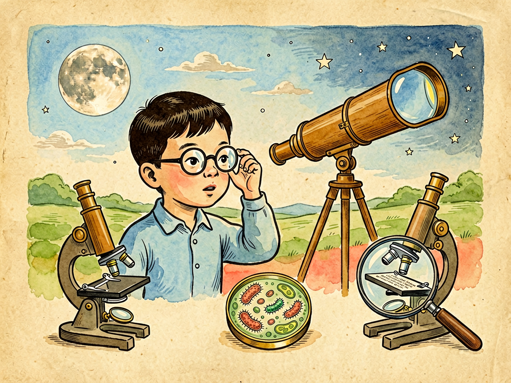

## 第八章 谈眼镜

---

### 📍 本章导航
**核心主题**：现在中国有一半以上的人戴眼镜，走在街上随便一看，十个人里有六个鼻梁上架着两片透镜。眼镜太普通了，普通到我们几乎意识不到它的存在——每天早上起床戴上，睡觉前摘下，它就像我们身体的一部分。但你有没有想过，就是这两片小小的玻璃或塑料片，在历史上改变了多少人的命运？在眼镜发明之前，一个人如果近视，或者年纪大了老花，就意味着他看不清字、认不清人、没法精细工作，只能提前退出读书、学习、工匠的世界，这几乎是命运的判决。眼镜是人类发明的最温柔、最普惠的技术之一：它不改造你的眼睛，不给你开刀，只是在眼前加两片经过精准打磨的透镜，把偏掉的光线挪回正确的位置，就让模糊的世界重新变清晰。这一章我们不只讲透镜的原理，更要讲：人类是怎么一步步学会用光来修补自己的感官局限？一副小小的眼镜，怎么从奢侈品变成日用品，甚至间接催生了望远镜、显微镜，开启了现代科学？  
**你将发现**：
- 我们的眼睛，本质上就是一台精密的活照相机：最前面的角膜和里面的晶状体是"镜头"，负责折射光线；中间的瞳孔是"光圈"，调节进光量；最后面的视网膜是"底片"或者"图像传感器"，把光信号转换成神经信号传给大脑。正常的眼睛看东西时，外界光线经过折射，刚好准确聚焦在视网膜上，图像就清晰；如果聚焦的位置偏了，我们就会看不清
- 最常见的几种视力问题，本质上就是焦点没对准：
  - **近视**：要么眼轴太长（眼睛前后径变长了），要么晶状体太凸折射能力太强，光线还没到视网膜就已经聚成焦点，到视网膜的时候又散开了，所以看远处模糊，看近处反而清楚；
  - **远视**：眼轴太短，或者折射能力太弱，光线走到视网膜了还没聚成焦点，所以看近处模糊，看远也累；
  - **老花**：这不是病，是每个人老了都会遇到的正常现象——40岁之后，晶状体会慢慢变硬、失去弹性，调节能力下降，看近处的时候没法变凸来聚光，所以看小字模糊，要把书拿远才能看清，几乎所有人到了四五十岁都会遇到；
  - **散光**：因为角膜不是完美的正圆形，有点像椭圆形橄榄球，不同方向的光线折射角度不一样，没法聚到同一个点上，所以看东西会重影、变形、容易累。
- 眼镜的原理简单到惊人：它根本没改变你的眼睛，也没改变世界，只是在光线进入眼睛之前，先帮你"掰"一下方向：
  - 近视用**凹透镜**（中间薄、边缘厚），让光线先发散一点，再经过眼睛折射，焦点就刚好往后落到视网膜上；
  - 远视/老花用**凸透镜**（中间厚、边缘薄，就是放大镜的样子），让光线先会聚一点，焦点往前移，也刚好落到视网膜上；
  - 散光用**柱面镜**，只在某一个方向上有弧度，刚好把角膜不圆造成的偏差补回来。
  就这么简单的原理，人类花了几千年才真正搞明白。
- 眼镜的历史比你想的更有意思：最早的透镜是两千多年前亚述人用水晶磨的，用来放大文字；13世纪意大利威尼斯的玻璃工匠做出了最早能戴在脸上的老花镜——就是两块凸透镜装在木框或者皮框里，夹在鼻子上，或者拿在手里，当时只有年纪大的教士、贵族、学者用得起，是非常昂贵的奢侈品；近视镜到15世纪才出现，而镜腿（挂在耳朵上的那两个弯勾）直到17世纪才被发明出来，之前的眼镜要么夹鼻子，要么拿手举着，特别不方便。
- 最神奇的是，眼镜发明之后三百年，居然意外催生了改变整个科学史的发明：1608年，荷兰一个眼镜店的学徒，闲来无事把两块镜片一前一后举着玩，突然发现远处教堂顶上的风标变得又大又近——他把两个镜片装在筒子里，就发明了世界上第一架望远镜。伽利略听说之后，自己磨镜片做了更好的望远镜，对准天空一看，发现了月球上的环形山、木星的四颗卫星、金星的盈亏，直接推翻了统治一千多年的地心说，开启了天文学革命。没过几年，列文虎克把小镜片磨得特别凸，做出了显微镜，第一次看到了细菌、红细胞、微生物，直接开启了微生物学。你看，现代科学的两个最重要的工具——望远镜和显微镜，居然都是眼镜铺里玩出来的发明；如果没有眼镜匠对透镜的琢磨，我们可能晚几百年才会知道天上有什么、微观世界里有什么。
- 今天的眼镜早就不是简单的玻璃片了：从厚重易碎的玻璃镜片，到轻、耐摔的树脂镜片，再到高折射率镜片（高度近视也不用戴啤酒瓶底那么厚的镜片），还有各种镀膜——防反光、防紫外线、防蓝光、防划痕；渐进多焦点镜片，一副镜片从上到下度数逐渐变化，看远、看电脑、看手机都能用，不用来回摘戴两副眼镜。除了框架眼镜，还有隐形眼镜、OK镜（角膜塑形镜，晚上睡觉戴，压迫角膜暂时改变形状，白天不用戴眼镜就能看清，还能延缓近视加深），还有近视手术——全飞秒激光切削角膜，或者ICL晶体植入，把一个很小的人工晶体放进眼睛里，永久矫正视力，不用戴眼镜。甚至现在的AR智能眼镜，能把图像直接投射在镜片上，未来可能会替代手机，变成随身的计算平台。
- 现在近视已经成了中国孩子的"国病"：我国小学生近视率超过40%，初中生超过70%，高中生和大学生超过80%-90%，高度近视的比例越来越高，而高度近视会大大增加视网膜脱落、青光眼、白内障的风险，甚至会致盲。预防近视最有效的方法，根本不是什么护眼灯、防蓝光眼镜、近视治疗仪这些商业噱头，而是两件事：第一，每天保证2小时以上的户外活动，阳光能促进视网膜分泌多巴胺，抑制眼轴变长，这是被大量研究证实最有效的防控手段；第二，养成好的用眼习惯，记住"20-20-20"原则：每用眼20分钟，抬头看6米（20英尺）以外的东西至少20秒，让眼睛休息。
- 这一章最深刻的洞见：**人类从来不是一种靠身体天赋生存的动物**——我们跑不过猎豹，跳不过羚羊，眼睛不如鹰尖，耳朵不如狗灵，牙齿不如老虎锋利，但是我们最了不起的能力，就是发明工具来弥补自己的局限。看不清就发明眼镜，听不到就发明助听器和电话，跑不快就发明汽车飞机，算不过来就发明计算机，飞不起来就发明火箭……所有的技术，本质上都是人感官和能力的延伸。而眼镜就是这类技术里最早、最温柔、最普惠的一个：它不惊天动地，不轰轰烈烈，只是安安静静架在鼻梁上，让千百万本来看不清的人能读书、能工作、能正常生活。文明最了不起的地方，从来不是能造多么宏大的奇观，而是能把这些改善普通人生活的技术做便宜、做普及，让每一个有缺陷的人，都能平等地看见世界。

**阅读建议**：如果你现在戴着眼镜，不妨把它摘下来擦一擦，再戴上——世界从模糊变清晰的那一瞬间，你就能感受到，这两片小小的透镜，到底有多了不起。

---

### 🖋️ 经典原文

我们每天戴着眼镜，洗脸的时候摘下来，出门的时候戴上，时间长了，甚至都忘了自己脸上还架着个东西。对于近视的人来说，眼镜一摘，整个世界都变成了一团模糊的色块，十米之外六亲不认，五十米之外雌雄莫辨；对于老花眼的老人来说，不戴老花镜，连药瓶上的字都看不清，连短信都发不了。
眼镜这么普通，普通到我们几乎不会去想：如果没有眼镜，世界会是什么样子？
在眼镜发明之前，如果你天生近视，或者到了年纪老花了，那你基本上就和精细的工作、和读书写字无缘了。黑板上的字你看不清，书上的小字你认不出，做手工、修东西、算账、教书，这些活你都干不了，只能去干不需要好视力的粗活。很多本来很聪明的人，就因为看不清，一辈子都没法读书学习，才能被埋没了。可以说，在眼镜发明之前，视力差就是一种残疾，是命运给你判的刑，你逃不掉。
但是人之所以为人，就是不会甘心接受天生的局限。我们不会飞，就发明了飞机；我们跑不快，就发明了汽车；我们看不清，就发明了眼镜。
眼镜的原理说穿了一点都不复杂，你得先搞明白我们的眼睛是怎么看见东西的。
我们的眼珠子，就是一台活的、精密的照相机。最前面透明的那层膜，叫角膜，是最主要的镜头；后面有个软软的、能变凸变扁的晶状体，相当于变焦镜头，通过改变形状来调焦；中间的瞳孔，就是光圈，亮的时候缩小，暗的时候放大，调节进光的多少；最后面的视网膜，就是底片，或者说相机的传感器，上面有上亿个感光细胞，把光的信号转换成电信号，通过视神经传给大脑，大脑一处理，我们就看见东西了。
正常的好眼睛，看远处的时候，晶状体放松变扁，平行光线进来，经过折射，刚好准确地聚焦在视网膜上，图像清清楚楚；看近处的时候，晶状体变凸，折射能力变强，近处发散的光线也能刚好聚在视网膜上，也能看清。这个调焦的能力，叫调节，年轻人的晶状体弹性好，调节能力强，远的近的都能看清；年纪大了，晶状体慢慢变硬，弹性差了，看近的时候变不凸了，光线聚不到视网膜上，看小字就模糊了——这就是老花眼，谁都逃不掉，和头发变白、皮肤长皱纹一样，是正常的衰老。
那近视又是怎么回事？大部分人的近视，是因为眼轴变长了——就是眼珠子前后拉长了，就像相机的底片往后挪了位置。远处的平行光线进来，经过折射，还没走到视网膜呢，就已经聚成焦点了，等落到视网膜上的时候，光线又散开了，所以看远处是模糊的一团；但是看近处的时候，光线本来就是发散的，聚焦点本来就靠后，刚好能落到变长了的视网膜上，所以近视的人看近处反而清楚。
远视正好反过来，眼轴太短了，光线走到视网膜了还没聚上焦点，所以看近模糊，看远也累；散光就是角膜不圆，不是完美的球面，而是有点像橄榄球，不同方向的光线折射角度不一样，有的聚在前面，有的聚在后面，所以看什么都重影、发虚，特别容易累。
这些问题，在今天看来，配副眼镜就解决了，但是在古代，这都是无解的难题。
那眼镜到底是怎么解决问题的？说出来你可能觉得太简单了：它根本没动你的眼睛，也没做手术，就是在光线进入眼睛之前，先让光线通过一片透镜，把方向稍微掰一下，让最后的焦点刚好落到视网膜上，世界就清晰了。
近视的人，光线聚得太早，焦点落在视网膜前面，那我们就在眼前放一片凹透镜——就是中间薄、边缘厚的镜片，让光线先往外发散一点，这样经过眼睛折射之后，焦点就会往后挪，刚好落到视网膜上；
老花眼、远视的人，光线聚得太晚，焦点在视网膜后面，那我们就放一片凸透镜——中间厚、边缘薄，也就是放大镜的样子，让光线先往里面会聚一点，焦点往前挪，也刚好落到视网膜上；
散光的人，不同方向光线聚不到一起，我们就用柱面镜——这种镜片只有一个方向有弧度，其他方向是平的，刚好把不圆的角膜缺的那点折射力补上，所有方向的光线就都能聚到同一个点上了。
就这么简单。两片磨成合适弧度的透明片子，往眼前一放，就解决了困扰人类几千年的问题。
但是这么简单的东西，人类花了好几千年才发明出来。
最早的时候，人们发现透明的水晶、玻璃珠能放大东西，古罗马的贵族会用玻璃球放在书上面，放大来看字，但是这东西只能拿在手里，举着看，没法戴在脸上。直到公元13世纪，意大利威尼斯的玻璃工匠，才做出了世界上第一批能戴的眼镜——那时候只有凸透镜，也就是老花镜，两块镜片装在木框或者骨头框里，夹在鼻子上，没有挂耳朵的镜腿，要么拿手举着，要么夹在鼻梁上，一低头就掉。当时一副眼镜贵得离谱，相当于一个普通工人几个月的工资，只有老教士、贵族、富商才用得起，是身份和学问的象征——你看很多中世纪的油画里，学者、教皇都是戴着老花镜，拿着书的样子。
近视镜出现得更晚，大概是15世纪中期，才有人做出来凹透镜给近视的人用，价格更是贵得吓人。而眼镜腿——就是架在耳朵上的那两个弯勾，直到17世纪才被中国人发明出来，传到欧洲之后，眼镜才真正能稳稳挂在脸上，不用手举着了。你看，从最早的放大镜到能稳稳戴在脸上的眼镜，人类花了差不多两千年。
你可别小看这两片小小的透镜，它后来间接改变了整个科学的走向。
1608年，荷兰一个眼镜店里的学徒，闲着没事玩店里的镜片，他把一块凸透镜和一块凹透镜一前一后举着，往远处一看，吓了一跳——远处教堂顶上的风标，居然变得又大又清楚，好像就在眼前一样。他把两个镜片装在一个纸筒里，世界上第一架望远镜就这么诞生了。
这个消息很快传到了意大利，伽利略听说了之后，自己磨镜片，改进了设计，做出了能放大30倍的望远镜。他把望远镜对准天空，第一次看到了月球上的环形山，看到了木星旁边有四颗卫星围着它转，看到了金星有和月亮一样的盈亏变化，看到了银河是由无数颗星星组成的——这些发现直接推翻了统治了一千多年的"地心说"，证明了地球不是宇宙的中心，开启了天文学革命，也开启了整个现代科学。
没过几年，荷兰的列文虎克，一个没上过大学的布店老板，闲着没事磨镜片玩，他把小镜片磨得特别凸，放大倍数能到两三百倍，做成了显微镜。他对着雨水、牙垢、井水一看，第一次看到了里面游来游去的微生物，看到了红细胞，看到了细菌——人类第一次知道，原来我们肉眼看不见的地方，还有一个这么庞大的微观世界，微生物学就这么诞生了，后来的疫苗、抗生素、消毒技术，全都建立在这个发现之上。
你看，望远镜和显微镜——这两个把人类视野往外扩展到宇宙、往里深入到细胞的伟大发明，居然都是从眼镜店的镜片来的。如果没有那些磨眼镜的工匠天天琢磨怎么打磨透镜，我们可能晚几百年才能看见木星的卫星，晚几百年才知道细菌的存在，整个现代文明的进程都要延后。这就是技术最有意思的地方：你一开始只是想解决一个很小的问题，让人能看清书上的字，结果没想到，这个技术蔓延开之后，居然打开了整个新世界的大门。

眼镜发展到今天，早就不是当年那个夹鼻子的玻璃片了。
镜片材料从厚重、易碎的玻璃，变成了又轻又耐摔的树脂镜片，还有高折射率的材料，哪怕是一千度的高度近视，镜片也不用做得像啤酒瓶底那么厚；镜片表面有各种镀膜：防反光的，让你晚上看车灯不会有重影；防紫外线的，保护眼睛晶状体不被晒伤；防蓝光的，看屏幕的时候眼睛不容易累；还有防油污、防刮花的涂层，镜片越来越耐用。
还有渐进多焦点镜片，从上到下度数慢慢变浅，上面看远，中间看电脑，下面看手机，一副眼镜搞定所有距离，不用来回换两副眼镜，特别适合中老年人。
不想戴框架眼镜，还有隐形眼镜，贴在眼球表面，别人看不见你戴了眼镜；还有OK镜，也就是角膜塑形镜，晚上睡觉的时候戴，用镜片的压力轻轻把角膜压平一点，早上摘下来，白天一整天视力都是正常的，不用戴眼镜，还能延缓青少年近视加深的速度。成年人不想戴眼镜，还可以做近视手术：用飞秒激光把角膜削成合适的弧度，相当于把镜片直接做在你的角膜上；或者ICL晶体植入，把一个很小的人工晶体直接放到眼睛里，不用切削角膜，度数高角膜薄的人也能做，几分钟手术，第二天就能正常看清东西。
甚至现在的智能眼镜、AR眼镜，把微型显示屏、芯片、电池都做进镜架里，能导航、能拍视频、能接打电话、能把屏幕直接投射在你眼前，未来可能会替代手机，成为下一代的随身计算平台。眼镜从一个简单的视力矫正工具，慢慢变成了人感知数字世界的接口。
但是技术再发达，我们还是要好好保护自己的眼睛。现在中国孩子的近视率已经高得吓人了：小学生十个里有四个近视，初中生十个里有七个，高中生大学生十个里有八九个戴眼镜，很多孩子小学就高度近视了。高度近视不是戴个厚镜片那么简单，眼轴拉得太长，视网膜会变薄，将来视网膜脱落、青光眼、白内障的风险会高很多，甚至可能失明。
很多家长花大价钱买护眼灯、防蓝光眼镜、各种所谓的"近视治疗仪"，其实这些都没什么用。被科学证实最有效的预防近视的方法，特别简单，也特别便宜：第一，每天至少2小时户外活动，多晒太阳，阳光能促进视网膜分泌多巴胺，抑制眼轴变长，比什么仪器都管用；第二，养成好的用眼习惯，记住"20-20-20"原则：每看书写作业看手机20分钟，就抬头看6米以外的远处至少20秒，让眼睛的肌肉放松；不要在太暗或者太晃的地方看书，不要躺着看手机，读写姿势坐端正。
其实不止眼睛，我们身体的所有感官，所有能力，都有局限。但是人类最伟大的地方，就是我们从来不会被这些局限困住：我们看不清，就发明眼镜，发明望远镜显微镜；我们听不到远处的声音，就发明电话、收音机、助听器；我们记不住太多东西，就发明文字、纸、硬盘；我们跑不过马，就发明汽车火车；我们飞不起来，就发明飞机火箭。所有的技术，本质上都是我们身体的延伸，都是我们给自己造的"外挂"。
而眼镜，就是这些外挂里最温柔、最贴心的一个。它不用你费力气去适应，不用改变你的身体，只要架在鼻梁上，模糊的世界一下子就清晰了。它让千百万个本来因为视力差没法读书、没法工作、没法正常生活的人，能和其他人一样看清世界，学习知识，发挥自己的才能。
伟大的技术从来不是只有核弹、航母、火箭那种宏大的东西。像眼镜这样，安安静静待在我们脸上，便宜、可靠、普惠，让每一个普通人的生活都变好一点的发明，才是文明最温暖、最坚实的底色。
下一章，我们讲天石。

---

> 📜 **科学史话：眼镜、望远镜与显微镜——眼镜铺里玩出来的科学革命**
>
> 1608年，荷兰米德尔堡的眼镜商汉斯·利伯希，向荷兰政府申请了一项专利："一种能把远处物体放大的装置"，也就是望远镜。关于这项发明，有个流传很广的故事：利伯希的两个学徒在店里玩镜片，偶然把一块凸透镜和一块凹透镜排成一条线，透过两个镜片看远处教堂的风标，发现风标被放大了，好像近在眼前。两个孩子把这个发现告诉了利伯希，他觉得很有意思，就把两个镜片装在一个筒子里，做成了世界上第一架望远镜，能放大3倍。
>
> 当时荷兰正在和西班牙打独立战争，荷兰海军立刻意识到这个东西的军事价值——站在船上就能远远看见敌方的舰队，提前做好准备，于是立刻出钱订购，望远镜成了军事机密。
>
> 但是消息还是很快传开了。第二年，也就是1609年，意大利的伽利略听说了这件事，他连实物都没见过，凭着自己的光学知识，自己磨镜片，花了几个月时间，做出了能放大30倍的望远镜，比荷兰人的还好。他没有拿这个东西看敌舰，而是把它对准了天空。
>
> 这一对，就彻底改变了人类对宇宙的认识：他看到月亮表面不是光滑完美的，而是有山有谷有环形山；他看到木星旁边有四颗小卫星围着它转，说明不是所有天体都围着地球转；他看到金星有和月亮一样的盈亏，证明金星是绕着太阳转的；他看到银河不是一团白雾，而是由无数颗恒星组成的……这些发现直接支持了哥白尼的日心说，推翻了教会统治了一千多年的地心说，天文学革命就此开始，近代科学也从此拉开了序幕。
>
> 望远镜发明之后没几十年，列文虎克，一个荷兰代尔夫特的布店老板，没上过大学，也不懂什么科学，就是特别喜欢磨镜片。他磨出了很小、弧度很大的凸透镜，放大倍数能到两三百倍，比当时所有的放大镜都清楚。他用自己磨的镜片做成显微镜，什么都拿来看看：雨水里的微生物，牙缝里的细菌，血液里的红细胞，肌肉的纤维，昆虫的复眼……他是人类历史上第一个看到细菌的人，第一个看到活细胞的人，微生物学这门学科，就是这么被一个没受过正规教育的眼镜爱好者给开创了。
>
> 你看，整个人类现代科学的起点，居然就是眼镜店里两个学徒玩镜片的偶然发现。技术的发展经常就是这样：你一开始只是想解决一个很日常、很个人的小问题——让老人能看清书上的字，结果在打磨技术、积累经验的过程中，会意外打开一扇你根本想不到的大门，让整个人类都看到一个全新的世界。
>
> 没有那些默默无闻的眼镜工匠几百年里一点点打磨镜片的经验，就没有望远镜和显微镜，也就没有后来的天文学、物理学、微生物学、医学。伟大的革命往往不是轰然降临的，它常常就藏在日常的、不起眼的技术积累里。

---

> 🔬 **科学更新：从OK镜到AR眼镜——眼镜技术的未来会是什么样？**
>
> 眼镜这项发明已经有八百年历史了，但是直到今天，它还在快速进化：
>
> **近视防控技术**：现在我们知道，近视一旦发生是不可逆的，没法"治好"，只能想办法延缓它加深的速度，不要发展成高度近视。除了每天户外活动，现在证实有效的方法还有几个：一个是角膜塑形镜（OK镜），晚上戴硬性隐形眼镜压平角膜，白天不用戴眼镜，还能让周边视网膜成像在前面，延缓眼轴变长；一个是低浓度阿托品滴眼液，每天晚上滴一滴，能有效减缓近视进展；还有离焦框架眼镜/离焦软镜，镜片上有很多微透镜，同样能延缓近视加深速度。这些技术能把青少年近视加深的速度减缓50%左右，大大降低高度近视的风险。
>
> **近视手术**：从最早的RK手术（放射状角膜切开），到准分子激光LASIK，再到现在的全飞秒SMILE手术，只需要23秒激光，在角膜上切一个2毫米的小切口，取出一点点角膜基质，就能矫正近视，不用开刀不用缝合，第二天就能正常用眼，安全性和精准度比十几年前高太多了；对于度数太高、角膜太薄做不了激光手术的人，还可以做ICL晶体植入手术，把一个像隐形眼镜一样的人工晶体植入到眼睛内部的晶状体前面，不用切削角膜，度数不合适了还能取出来，是高度近视人群的福音。现在全球已经有几千万人做了近视手术，技术非常成熟。
>
> **智能眼镜和AR/VR**：最近几年AR（增强现实）眼镜发展特别快，把微型OLED显示屏、光学波导、芯片、电池都做进和普通眼镜差不多重的镜架里，能把导航、消息、视频画面直接投射在你眼前的镜片上，不用低头看手机；未来甚至能把虚拟物体叠加在真实世界里——你看着桌子，就能在桌子上看到虚拟的屏幕，看着人就能显示他的信息，眼镜不再只是帮你看清世界，还能帮你看到虚拟的数字信息，成为连接人和数字世界的入口。也许再过二三十年，我们今天手里拿的智能手机，就会被智能眼镜替代。
>
> 当然，不管技术怎么发展，我们自己的原生眼睛永远是最珍贵的——再好的眼镜、再先进的手术，都比不上一双健康的眼睛。多去户外，少盯着屏幕，好好爱护它。

---

> 🧪 **动手试一试：在家做两个小实验，搞懂近视和眼镜的原理**
>
> **实验一：水滴放大镜——最简单的凸透镜**
>
> 准备材料：一块透明的塑料片（透明文件夹或者矿泉水瓶剪一块就行），一点水，一张报纸或者书。
>
> 步骤：
> 1. 把塑料片擦干净，在上面滴一滴清水，水滴会自然鼓起来，形成一个中间厚边缘薄的凸透镜；
> 2. 把塑料片举到报纸上方，透过水滴看下面的字——你会发现字被放大了！这就是老花镜、放大镜的原理。
> 3. 你再试试滴不同大小的水滴：水滴越大越凸，放大倍数越高；水滴越小越平，放大倍数越低。
>
> **实验二：模拟近视和近视镜**
>
> 准备材料：一个放大镜（凸透镜，模拟眼睛的晶状体），一张白纸（模拟视网膜），一支蜡烛（模拟要看的物体），一个凹透镜（如果没有就找一副近视眼镜），一个黑暗的房间。
>
> 步骤：
> 1. 把蜡烛点燃，放在桌子一头，放大镜举在中间，白纸举在另一头，前后移动白纸，直到白纸上出现一个清晰的蜡烛倒影——这就是正常眼睛的状态，光线准确聚焦在视网膜上，图像清晰；
> 2. 把白纸往后挪几厘米，模拟眼轴变长的近视状态，这时候白纸上的倒影就变模糊了，怎么对焦都不清楚，这就是近视的人看到的世界；
> 3. 现在，把近视眼镜的凹透镜放在放大镜（晶状体）前面，你会发现，白纸上模糊的倒影又变清晰了！凹透镜先把光线发散了一下，刚好让焦点往后移到了挪远的白纸（视网膜）上——这就是近视眼镜的工作原理。
>
> 做完这两个实验，你就彻底搞懂透镜、眼睛和眼镜到底是怎么回事了，比背十遍书都管用。

---

### 💬 读后思考与讨论

1. 很多人觉得戴眼镜麻烦、不好看，觉得戴了眼镜就摘不下来了，宁愿看不清也不愿意配眼镜，你怎么看这种想法？近视了不戴眼镜，会有什么后果？
2. 眼镜、望远镜、显微镜，都是从打磨透镜这个简单的技术发展出来的——为什么说很多改变世界的重大发明，最初都来自于不起眼的日常技术积累？你还能举出类似的例子吗？
3. 现在中小学生近视率越来越高，除了学习压力大，还有哪些原因？你觉得哪些方法是真的能预防近视，哪些是商家的营销噱头？
4. 麦克卢汉说"媒介是人的延伸"，其实所有技术都是人的延伸——眼镜是眼睛的延伸，电话是耳朵的延伸，汽车是腿的延伸，计算机是大脑的延伸。你同意这个说法吗？未来技术还会延伸人的什么能力？
5. 有人说"技术会让人的身体越来越退化，越来越依赖工具"，你同意吗？我们应该因为害怕依赖就拒绝技术吗？

### 🔗 关联阅读
- 第二部第三章：《色——谈色盲》→ 我们的眼睛是怎么感知颜色的，色觉是怎么回事
- 第二部第四章：《声——爆竹声中话耳鼓》→ 另一个重要感官——耳朵的原理
- 第三部第十一章：《电的眼睛》→ 人类发明的其他"眼睛"——照相机、雷达、望远镜
- 跨章节思考：从纸（延伸记忆）、眼镜（延伸视觉）、钢铁（延伸力量）到计算机（延伸大脑），所有技术都是人的延伸——这些延伸反过来又怎么改变了人类本身？
