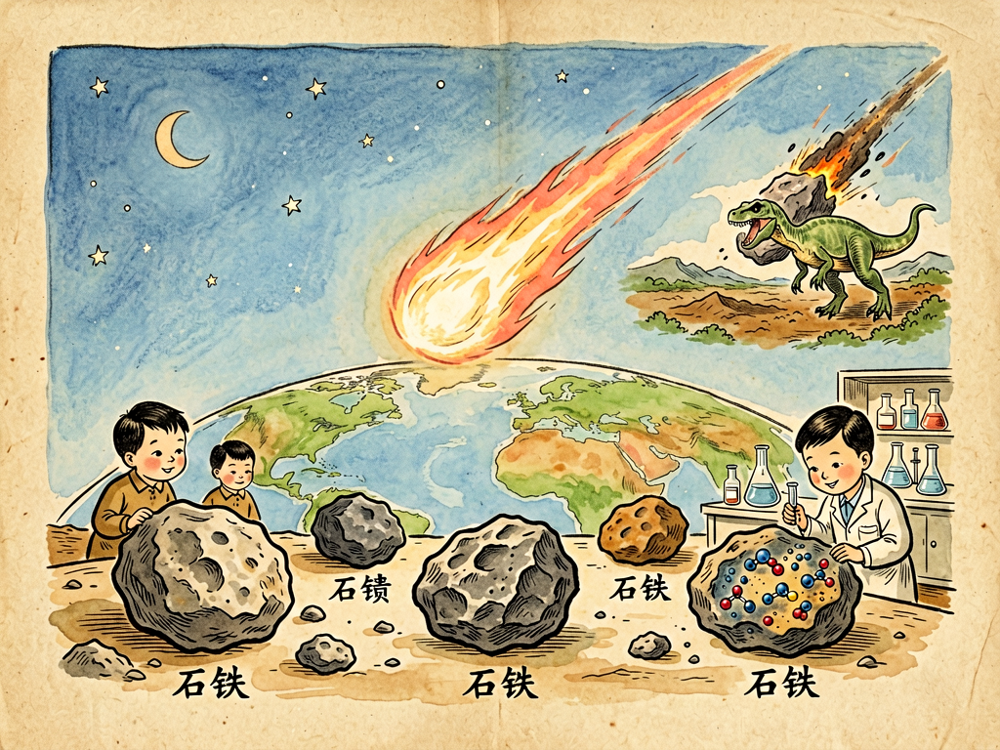

## 第九章 天石

---

### 📍 本章导航
**核心主题**：晴朗的夜晚，你偶尔会看到一道亮光划过夜空，转瞬即逝，老人会说"那是流星，有人去世了"；如果运气特别好，你可能还会听说，有石头"砰"的一声从天上掉下来，砸在田里、院子里甚至屋顶上。古人把这种从天上掉下来的石头叫"天石"，觉得是神灵降下的征兆，是吉凶的预兆。但是科学家告诉我们，这些石头不是神的旨意，也不是什么星星的尸体，它们是太阳系形成初期留下来的"宇宙化石"，是从45亿年前飞过来的时光胶囊。每一块落在你面前的陨石，都比地球上任何一块石头都更古老——它看着太阳系从一团气体尘埃凝聚成行星，看着地球慢慢冷却、形成海洋、诞生生命，然后在某一天，因为一次偶然的碰撞，它脱离了自己的轨道，飞行了几千万甚至几亿公里，穿过大气层，燃烧、发光，最后落到你脚边。拿起它，你就相当于触摸到了太阳系出生时的样子。这一章我们就来讲讲这些来自天上的石头，它们从哪里来？为什么这么珍贵？它们怎么改变了地球的历史，甚至和我们人类的诞生有什么关系？  
**你将发现**：
- 我们夜晚看到的**流星**，根本不是什么"星星掉下来了"，而是太空中的小石块、尘埃颗粒（大部分只有沙子、绿豆那么大），以每秒十几到几十公里的速度闯进地球大气层，和空气剧烈摩擦，温度升到几千度，燃烧发光，就变成了我们看到的亮光。绝大多数这样的小颗粒在大气层里就完全烧完了，只有那些比较大的，没烧完的残骸落到地面上，才叫**陨石**。每天都有几百吨地外物质落到地球上，但是大部分都是微尘，真正能捡到的大块陨石非常少。
- 99%以上的陨石，都来自火星和木星之间的**小行星带**——那里是太阳系形成的时候，本来应该凝聚成一颗行星，但是因为木星引力太大，没聚起来，留下了几十万颗大大小小的岩石碎片，也就是小行星。这些小行星互相碰撞，碎块被撞出轨道，有时候就会飞到地球附近，掉下来成为陨石。还有极少数陨石非常特殊：大概有几百块陨石，是月球或者火星被其他小行星撞击的时候，表面的岩石被溅到太空中，飞行了几千万年之后落到地球上——没错，我们不用登月，不用去火星，在地球上就能捡到月亮和火星的石头。
- 陨石主要分三大类，每一类都来自小行星不同的部位：
  - **石陨石**：最多，占所有陨石的90%以上，主要成分是硅酸盐岩石，和地球上的石头看起来有点像。其中最珍贵的是**球粒陨石**，里面有很多直径1毫米左右的圆形小颗粒（球粒），这是太阳系最初形成的时候，从气体尘埃里直接凝聚出来的原始物质，45亿年来几乎没有变过，是太阳系最原始的样本；
  - **铁陨石**：占5%左右，主要成分是铁和镍的金属合金，它们是比较大的小行星在早期融化、分层之后，沉到核心部分的金属碎片，就像地球的地核一样。在人类发明炼铁术之前，天上掉下来的铁陨石是人类能得到的唯一的自然铁，比黄金还珍贵，最早的铁器很多都是用陨铁做的；
  - **石铁陨石**：最稀有，只占不到1%，一半是岩石一半是金属，是小行星核心和地幔交界地方的物质，非常漂亮也非常珍贵。
- 为什么陨石这么值钱，这么受科学家重视？因为地球是个太"活跃"的星球：板块运动、火山喷发、风吹雨淋、生物活动，已经把地球诞生初期的痕迹几乎全部抹掉了——你现在能在地球上找到的最古老的岩石，也就40亿年多一点，而且都被地质活动改得面目全非。但是陨石不一样，它们大部分在小行星带里待了45.6亿年，冷透了之后就再也没变化过，就像被时间冻住了一样。科学家通过测量陨石里放射性元素的衰变，准确算出了太阳系的年龄是45.67亿年；我们知道行星怎么形成的、地球怎么分层的、太阳系早期是什么样子，最核心、最可靠的证据，几乎全来自陨石。说陨石是太阳系的"出生证明"和"时间胶囊"，一点都不夸张。
- 陨石还和**生命起源**有大关系：有一种碳质球粒陨石，里面含有大量碳和有机分子。科学家在著名的默奇森陨石里，已经检测出了上百种氨基酸（蛋白质的基本组成单位）、碱基（DNA和RNA的组成单位）、糖类、羧酸等等构成生命必须的有机分子。这些分子不是地球的污染，是陨石本身就有的——也就是说，在太空里，在小行星上，自然就能合成生命需要的基本"零件"。地球形成早期，经历了几亿年的"重轰炸期"，大量陨石撞击地球，给地球送来了水和这些有机分子，相当于给地球送来了生命起源的"原料包"。我们不能说生命就是陨石带来的，但是至少，生命诞生需要的原材料，很可能有一部分是天石送来的。
- 天石不只会给我们送礼物，还会带来**大灾难**：6600万年前，一颗直径大概10公里的小行星，差不多有一座城市那么大，以每秒20公里的速度撞在了今天墨西哥的尤卡坦半岛上，撞出了一个直径180公里的大坑。撞击释放的能量相当于几十亿颗原子弹同时爆炸，引发了全球范围的大地震、大海啸、全球性森林大火，扬起的灰尘遮天蔽日，几个月甚至几年都见不到太阳，植物没法光合作用大量死亡，整个食物链崩溃，统治地球1.6亿年的恐龙就这样灭绝了，只有小型哺乳动物活了下来，后来才有了我们人类。可以说，如果没有那次天石撞击，恐龙可能还统治着地球，根本不会有人类出现。这不是科幻猜想，是有确凿证据的：全世界6600万年前的地层里，都有一层铱元素异常高的黏土层——铱这种金属在地球表面非常稀少，但是在陨石里含量很高；而那个希克苏鲁伯陨石坑，也已经被地质学家找到了。
- 今天的我们，不用再像古人一样把陨石当成神秘的征兆，也不用像恐龙一样坐等撞击。现在全世界的天文学家都在监测所有可能威胁地球的近地小行星，把它们的轨道算得清清楚楚。2022年，NASA还成功完成了人类第一次**行星防御实验**（DART任务）：发射一个航天器，故意撞在一颗直径160米的小行星上，成功把它的轨道撞偏了——这说明，只要我们提前足够时间发现威胁，就有能力改变小行星的轨道，避免撞击灾难。人类终于不再是只能眼睁睁看着天石落下的生物了，我们第一次有能力保护自己的星球。
- 这一章最深刻的洞见：我们常常觉得宇宙是遥远的、和我们无关的，抬头看星星的时候，总觉得那些天体离我们有几万光年远，和我们的生活没关系。但是陨石告诉我们，宇宙从来没有和地球分开过——地球是在太阳系的尘埃里形成的，构成我们身体的碳、氧、铁、钙这些元素，都来自于远古恒星的爆炸，甚至生命诞生需要的有机分子，都可能是陨石从太空送过来的。我们脚下的土地，我们自己，我们见过的每一块石头、每一个生命，追根溯源都是星尘做的。天石落到地球上，不是什么神秘事件，那只是宇宙的物质在回家而已。当你拿起一块陨石的时候，你手里握着的，不只是一块石头，是45亿年的太阳系历史，是我们自己的来处。

**阅读建议**：如果你所在的城市有自然博物馆，一定要去看看里面的陨石展品——站在那些黑糊糊的、带着熔壳和气印的石头面前，想象一下它在太阳系里飘了45亿年，最后落到地球上，你会真切感受到什么叫"宇宙的时间尺度"。

---

### 🖋️ 经典原文

古代的人，看见天上忽然亮起一道火光，拖着长长的尾巴，"嗖"的一声划过夜空，转眼就不见了，总要吃一惊。如果那时候刚好有一块石头"轰隆"一声落到地上，砸出一个大坑，他们更是要吓得跪下来磕头，以为是天上的神仙发怒了，降下灾祸，或者是星星掉下来了，是大凶的兆头。
中国的古书里，很早就有"星陨如雨"的记载，说有一年天上掉下来好多石头，皇帝还要下罪己诏，反省自己是不是做错了什么事，惹得老天爷不高兴。西方人也一样，古希腊人把陨石当成神的礼物，放在神庙里供奉；古罗马人还专门为从天而降的石头建庙宇。在很长的时间里，没有人相信这些石头真的是从天上掉下来的——大家都觉得天是虚空的，怎么会凭空掉下石头呢？
直到两百年前，还有很多正经的科学家不相信陨石的存在。1790年，法国有个地方掉了一堆陨石，老百姓捡了送给科学院，科学家们看了哈哈大笑，说这不过是地上的石头被雷电击中了，或者是火山喷出来的，什么天上来的，都是乡下人迷信。直到1803年，法国莱格勒地方一下子掉了三千多块陨石，大大小小铺了一地，几千个老百姓都亲眼看见了，科学院才不得不派科学家去调查，最后终于承认：原来真的有石头会从天上掉下来。
这些从天上掉下来的石头，我们就叫它陨石，古人给它起了个很有诗意的名字，叫"天石"。
那天石到底是从哪里来的？难道真的是天上的星星掉下来了？当然不是。我们晚上看到的星星，绝大多数都是像太阳一样的恒星，离我们有几光年、几百光年远，根本不可能掉到地球上来。这些天上来的石头，其实都是太阳系里的"小碎片"。
你大概已经知道了，在火星和木星轨道之间，有一个小行星带，里面有几十万颗大大小小的岩石块，大的有几百公里宽，小的只有沙子、绿豆那么大，它们都是太阳系形成初期没能够拼成一颗大行星的"剩余材料"。这些小行星在轨道上跑，有时候互相撞在一起，撞得粉碎，碎块就会脱离原来的轨道，到处乱飞。如果有一块碎块刚好飞到地球附近，被地球引力拉住，就会以每秒十几公里到几十公里的速度往地上冲——这速度比最快的子弹还要快几十倍。
它冲进大气层的时候，前面的空气被猛烈压缩，温度一下子升到几千度，石头表面开始熔化、燃烧，发出耀眼的亮光，这就是我们看到的流星。大多数小碎片在大气层里就完全烧光了，变成灰尘飘在空中；只有那些比较大的块头，表面烧完了，核心还没烧完，最后"砰"的一声落到地上，这就是陨石。
除了小行星带的碎片，还有极少数陨石更"厉害"——它们是从月球甚至火星上来的。怎么回事呢？如果有一颗比较大的小行星撞到月球或者火星上，撞击力量太大，会把月球或者火星表面的岩石溅起来，溅到太空中，这些岩石在太阳系里飞个几百万几千万年，有时候就会飞到地球，掉下来成为陨石。科学家在南极的冰盖上找陨石，就找到过好多块火星来的石头，其中一块里面还发现过类似细菌化石的结构，到今天还在争论是不是火星上曾经有过生命的证据。
别以为这些天石都是一个样子，它们长得可不一样，主要分三大类。
最多的一类叫石陨石，十块陨石里有九块都是这种。它们主要成分是硅酸盐石头，和地球上的石头看起来有点像，但是切开之后，你往往能看到里面有很多小米粒那么大的圆圆的小颗粒，亮晶晶的，这叫球粒，是太阳系最开始形成的时候，从灼热的气体尘埃里直接凝结出来的原始物质。这些球粒已经有45亿岁了，从太阳系形成那天起就再也没变过，比地球上任何一块岩石都古老得多。
第二类是铁陨石，十块里大概有半块是这种。它们主要成分是铁和镍的金属合金，沉甸甸的，吸铁石能吸住，切开抛光之后，能看到非常漂亮的维斯台登花纹——那是金属在几百万年的缓慢冷却过程中形成的晶体结构，人工根本仿造不出来。这些铁陨石是怎么来的呢？原来大一点的小行星形成之后，内部会熔化，重的金属铁会沉到核心，轻的岩石浮在表面，就像地球有铁的地核、岩石的地幔地壳一样。后来这些小行星被撞碎了，核心部分的铁镍金属碎块掉下来，就是铁陨石。在人类还不会炼铁的时候，这些从天而降的铁是稀世珍宝，比黄金还贵重，最早的铁器都是用陨铁打造的——比如古埃及图坦卡蒙墓里的匕首，就是用陨铁做的。
最稀罕的一类叫石铁陨石，一百块里也找不到一块，一半是金属一半是石头，是小行星核心和地幔交界地方的物质，切开之后亮晶晶的金属里嵌着橄榄石晶体，特别漂亮，是陨石里的贵族。
你可能会说，不就是几块从天上掉下来的破石头吗，为什么科学家把它们宝贝得不行，一听说哪里掉了陨石，拼了命也要去找？
这是因为，我们的地球太"活跃"了。你别看地球上有高山、有石头，但是地球形成45亿年来，板块运动从来没停过，旧的地壳沉到地幔里熔化，新的地壳从海底冒出来，再加上风吹雨淋、火山喷发、生物活动，地球诞生初期的痕迹早就被抹得干干净净了——你现在在地球上能找到的最古老的岩石，也就40亿年多一点，而且都被地质活动改得面目全非，根本看不到太阳系最开始是什么样子。
但是陨石不一样。它们在冰冷的小行星带里待了45亿年，冷了之后就再也没变化过，就像被时间封冻住了一样。我们现在知道太阳系准确年龄是45.67亿岁，知道行星是怎么从尘埃慢慢凝聚成球的，知道太阳系早期发生过什么，最关键、最可靠的证据，几乎全来自这些天石。它们是太阳系的"出生证明"，是宇宙留给我们的时光胶囊——你拿起一块陨石，就相当于摸到了45亿年前太阳系形成时的尘埃，这是多么神奇的事啊。
这些天石带来的还不只是太阳系起源的消息，它们还可能和生命的诞生有关系。有一种黑色的碳质球粒陨石，里面含有大量的碳和有机物质。科学家曾经把一块1969年掉在澳大利亚默奇森镇的陨石碾成粉末分析，在里面找到了上百种氨基酸——就是构成蛋白质的基本单位，还有DNA里的碱基、糖类、脂肪酸等等各种各样的有机分子。这些分子不是地球人粘上去的污染，是陨石本身在太空里就合成好的。
你想想，地球刚形成的时候，是个灼热的岩浆球，根本没有这些复杂的有机分子。但是地球形成最初的几亿年，太阳系里还乱得很，大量的陨石、彗星不断撞击地球，它们给地球送来了水——现在地球上的海洋，很大一部分就是彗星和陨石带来的；还送来了这些现成的有机分子，相当于把生命诞生需要的"零件包"直接快递到了地球上。我们今天还不能说生命就是陨石带来的，但是至少，构成生命的原材料，很可能有一部分就是天石从太空送过来的。
天石不只会给我们送水、送生命的原料，它们还曾经给地球带来过毁灭性的灾难，甚至改变了整个生物演化的方向。
6600万年前，一颗直径10公里大的小行星，差不多有整个香港那么大，以每秒20公里的速度，一头撞在了今天墨西哥尤卡坦半岛的海里。那次撞击释放的能量，相当于全世界所有核武器加起来再乘以一万倍。撞击点附近的岩石瞬间气化，几十米高的海啸横扫整个大西洋，全球的火山都被震得喷发，森林燃起熊熊大火，烧了好几个月；扬起的灰尘和硫化物喷到平流层里，遮天蔽日，好几年的时间里，整个地球都见不到太阳，白天和晚上一样黑。植物没法光合作用，大量枯死，吃草的恐龙饿死了，吃肉的恐龙也跟着饿死了——统治地球整整1.6亿年的恐龙，就因为这么一块天石的撞击，几乎全部灭绝了，只有一些小型的原始哺乳动物躲在地下活了下来。如果没有那次撞击，恐龙可能至今还统治着地球，根本不会有人类出现的机会。
这样的撞击在地球历史上发生过很多次，以后也还会发生。
但是今天的人类，和恐龙已经不一样了。我们不会再像古人一样，看到陨石掉下来就磕头烧香，以为是神的惩罚；也不会像恐龙一样，大难临头还浑然不觉，只能等着灭绝。现在全世界的天文学家都在持续监测所有靠近地球轨道的小行星，把它们的大小、轨道算得清清楚楚，哪些可能有威胁，多久之后会靠近地球，我们都提前知道。2022年，NASA还做了一个人类历史上第一次行星防御实验：发射一个冰箱大小的探测器，以每秒6公里的速度，直接撞向一颗直径160米的小行星，硬生生把这颗小行星的轨道撞偏了32分钟——这证明，只要我们提前几年甚至几十年发现有危险的小行星，就完全有能力发射航天器把它撞偏，让它和地球擦肩而过，不会撞上。
人类终于从被动挨打的生物，变成了能够主动保护自己星球的文明。
其实仔细想想，我们和这些天石，本来就是一家人。
构成地球的物质，构成我们身体的物质——碳、氧、氮、铁、钙——没有一样是地球自己凭空变出来的。构成我们血肉的碳，是远古恒星内部核聚变产生的；我们血液里的铁，是大质量恒星爆炸成超新星的时候喷出来的；甚至我们细胞里的有机分子，可能都有陨石带来的成分。我们总说"人是星尘做的"，这不是文艺抒情，是实实在在的科学事实。
天石从天上落下来，落到地球上，这根本不是什么"天外来客"，只是宇宙里的物质，离开了原来的位置，走了几十亿年的路，最后回到了和它同根同源的地球上而已。
下次你再看到流星划过夜空，除了许愿，你也可以想一想：那一道亮光里，可能就有一粒45亿年前的太阳系尘埃，它从太阳系诞生之初就飘在那里，现在落到地球上，可能落到海里，可能落到土里，过几亿年，可能会变成某个新生命身体里的一个原子。
宇宙和我们的距离，从来没有我们想象的那么远。
下一章，我们讲地下王国漫游记。

---

> 📜 **科学史话：从"神仙的石头"到太阳系档案——人类认识陨石的故事**
>
> 在整个古代和中世纪，全世界的人都把陨石当成神圣的东西：古希腊人把落在特洛伊附近的陨石当成女神西布莉的化身，建神庙供奉；麦加的克尔白里那块黑色的圣石，历史学家认为很可能就是一块陨石；中国古代把"星陨"当成上天的警告，皇帝要大赦天下、反省过失。但是这些石头到底是什么，没人知道。
>
> 到了18世纪启蒙时代，理性主义兴起，科学家们反而开始不相信陨石的存在了——他们觉得"石头从天上掉下来"是乡巴佬的迷信，是无稽之谈。1768年法国掉了三块陨石，送去科学院检验，著名化学家拉瓦锡亲自写报告说，这不过是地上的石头被闪电击中了而已，根本不是天上来的。1790年法国又有陨石雨，当地市长和几百个市民签字作证，还是被科学院嘲笑，说老百姓集体产生了幻觉。
>
> 转折点发生在1803年4月26日，法国诺曼底的莱格勒镇，下午一点左右，天空中出现了一个巨大的火球，接着爆炸声像打雷一样，方圆几公里都能听到，然后上千块石头像雨一样掉下来，砸进农田、院子里，最大的有十几公斤重。这一次有超过300个目击者，其中还有很多受过教育的官员和商人。巴黎科学院不得不派年轻的物理学家毕奥去调查，他收集了大量标本和证词，最后写了一份详细的报告，终于向科学界证明：这些石头真的是从天外飞来的。这之后，陨石研究才真正成为一门科学。
>
> 接下来的两百年里，陨石研究不断改写我们对太阳系的认识：1950年代，科学家通过测量陨石里的铅同位素，算出太阳系年龄是45.5亿年，这个数字直到今天也没怎么变；1969年默奇森陨石坠落，科学家在里面发现了多种氨基酸，第一次知道有机分子能在太空里自然形成；1980年，诺贝尔物理学奖得主阿尔瓦雷斯父子，在全世界白垩纪末期的地层里发现了高浓度的铱，提出了"小行星撞击导致恐龙灭绝"的假说，当时被很多古生物学家嘲笑，直到1991年希克苏鲁伯陨石坑被发现，这个假说才成为公认的事实。
>
> 而最有里程碑意义的事发生在2022年9月26日，NASA的DART探测器成功撞击了小行星迪莫弗斯，把它的轨道周期从11小时55分钟缩短了32分钟——人类第一次主动改变了一个天体的轨道，第一次证明我们有能力防御小行星撞击。从把陨石当神拜，到读懂陨石带来的太阳系历史，再到主动改变天体轨道保护地球，人类花了几千年，终于长大了。

---

> 🔬 **科学更新：我们现在不仅捡陨石，还主动去小行星上采样**
>
> 过去我们研究陨石，只能等着它从天上掉下来，运气好捡到了才能研究。但是这些陨石在坠落过程中经过大气层高温燃烧，落到地上之后又会被地球环境污染，很多信息都丢了。现在我们已经不满足于等天石掉下来了，我们主动派航天器飞到小行星上去，挖了样本送回地球。
>
> 2010年，日本的隼鸟号探测器第一次从小行星丝川上带回了微小的尘埃颗粒；2020年，隼鸟2号从小行星龙宫上带回了5.4克样本，这些样本是直接从小行星表面挖的，从来没被大气层烧过，也没被地球环境污染过，科学家在里面发现了氨基酸和水，证明小行星上确实存在构成生命的物质。
>
> 2023年，NASA的OSIRIS-REx探测器从小行星贝努上带回了250克样本，这是人类有史以来从小行星上带回的最多的样本，现在科学家还在分析这些样本，希望能解开更多太阳系形成和生命起源的秘密。
>
> 关于行星防御，DART任务的成功证明了"动能撞击"是可行的：只要提前发现危险的小行星，哪怕只是一个不大的航天器，以足够的速度撞上去，就能积累足够的动量改变它的轨道。现在中国也在做自己的小行星防御计划，预计2030年左右也会实施一次小行星偏转实验。未来人类还会建立更完善的近地天体监测网络，把所有直径大于140米、可能威胁地球的小行星全部编目，提前发现、提前处置，再也不会发生恐龙那样的灭绝悲剧。
>
> 还有个有意思的事：现在科学家在南极的冰盖里、在撒哈拉沙漠里找陨石，因为这些地方地貌简单，黑糊糊的陨石掉在白色的冰上或者黄色的沙子上，特别显眼，找起来效率高，现在全世界一大半的陨石都是在南极找到的。当然也要提醒大家，普通人很难捡到真正的陨石，很多人捡了块奇怪的磁铁矿就以为是陨石，其实99.9%都不是——如果真的捡到疑似陨石，可以联系地质部门或者天文台鉴定，不要随便被人骗了。

---

> 🧪 **动手试一试：怎么初步鉴别一块石头是不是陨石？**
>
> 如果你在野外捡到一块奇怪的黑石头，怀疑是陨石，可以通过这几个简单的方法初步判断：
> 1. **熔壳**：陨石穿过大气层的时候，表面温度有几千度，会熔化出一层薄薄的黑色或深褐色的玻璃质壳，叫熔壳，一般只有1毫米厚，像涂了一层黑釉。刚掉下来的陨石熔壳是亮黑色的，放久了会风化变成褐色。地球上的普通石头一般没有这层完整的黑壳。
> 2. **气印**：陨石在大气层里下落的时候，表面被热气流烧蚀，会留下很多像手指按在泥巴上的小坑，叫气印，和我们蒸馒头时候表面的小窝有点像。
> 3. **磁性**：90%以上的陨石都含有铁镍金属，能被强磁铁吸住。如果你的石头完全吸不住磁铁，是陨石的概率就非常低。注意：地球上的磁铁矿也能吸磁铁，但是磁铁矿比陨石重得多，而且没有熔壳和气印。
> 4. **重量和颗粒**：同样大小的石头，陨石一般比普通岩石重，因为含有金属；如果石头里面有明显的大石英颗粒、气孔或者化石，那肯定不是陨石——陨石里几乎不会有石英，也不会有气孔（陨石是在太空中冷却的，不会有火山岩那种气孔），更不可能有化石。
>
> 最后要记住：真正的陨石非常稀少，全世界每年掉下来能被找到的也就十几块，绝大多数人捡到的"奇怪石头"都只是普通的地球岩石，不要抱着发财梦轻信别人的话哦。

---

### 💬 读后思考与讨论

1. 18世纪的科学家为什么会拒绝相信"石头会从天上掉下来"？这个故事告诉我们，科学怀疑精神和"固执己见"的边界在哪里？
2. 恐龙在地球上统治了1.6亿年，却因为一次小行星撞击就灭绝了。你觉得人类文明和恐龙比，最大的优势是什么？我们真的能避免这样的灾难吗？
3. 有人说"我们都是星尘做的"，结合这一章的内容，你怎么理解这句话？知道了构成我们身体的原子都来自远古恒星，会改变你对生命的看法吗？
4. 现在有很多人花大价钱收藏陨石，甚至到了疯狂的地步，你觉得陨石的价值到底在哪里？是它的科学意义更重要，还是收藏价值更重要？
5. 为什么说陨石研究是"在地球上读太阳系的历史"？除了陨石，还有什么东西能帮我们了解地球和太阳系的过去？

### 🔗 关联阅读
- 第二部第十三章：《地球的繁荣与土壤的劳动者》→ 地球的土壤和岩石怎么形成，生命怎么改造地球
- 第一部第十三章：《土壤世界》→ 土壤里的微生物和物质循环，地球表面的物质变化
- 跨章节思考：从细菌改造地球大气，到天石撞击带来生命原料又带来大灭绝——地球的演化从来不是自己的事，而是宇宙、地球、生命互相作用的结果。
