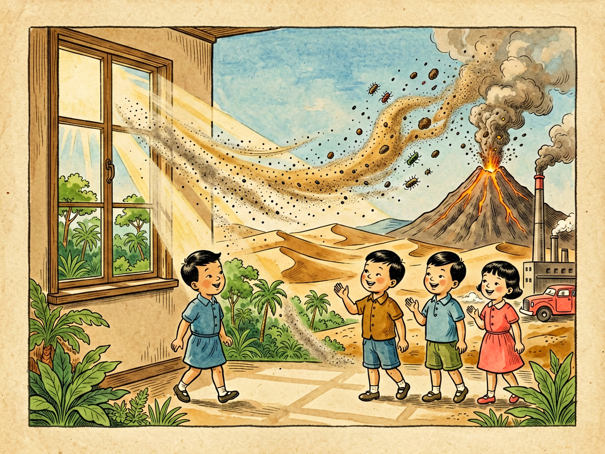

## 第十章 灰尘的旅行

---

### 📍 本章导航
**核心主题**：这一章和这本书同名，是全书的核心篇目。灰尘是高士其先生最经典的意象，也是贯穿整本书的隐喻——那些我们肉眼几乎看不见的微小颗粒，在空气中不停旅行，从沙漠飘到海洋，从工厂飘进我们的肺里，从一个人的喷嚏里飘到另一个人的呼吸道里。我们总觉得空气是空的，什么都没有，伸手就能划过去；可实际上，空气是一条永远在流动的看不见的河流，河里面漂着数不清的旅客——土粒、盐粒、花粉、烟尘、纤维、皮屑、细菌、病毒，它们跟着风走，跟着气流飘，跨越高山大洋，穿过门窗缝隙，最后落在我们的桌子上、枕头上，甚至进到我们的肺里、血液里。灰尘的旅行路线，就是地球物质循环的路线，是疾病传播的路线，也是现代城市和公共卫生最核心的线索。这一章我们就跟着一粒灰尘去旅行，看看它从哪里来，怎么飘，会到哪里去，又会给我们的生活带来什么影响。读完这一章，你再呼吸的时候，就会意识到：你吸进去的不只是空气，还有整个世界的碎片。  
**你将发现**：
- 灰尘根本不只是"地上的土扬起来"那么简单，它的成分复杂到超乎想象：
  - **自然来源**：风吹起的土壤和沙尘、海浪飞沫蒸发后留下的海盐颗粒、火山喷发的火山灰、植物的花粉、真菌的孢子、细菌和病毒、森林大火的烟尘、甚至还有从太空落下来的微陨石尘埃——每天都有几十吨宇宙尘埃落到地球上；
  - **人为来源**：汽车尾气里的碳颗粒、工厂烟囱排的烟尘、燃煤燃油产生的硫酸盐硝酸盐、建筑工地的扬尘、厨房炒菜的油烟、香烟的焦油颗粒、衣服摩擦掉的纤维、我们皮肤每天脱落的皮屑（你家里的灰尘，至少有一半是你自己掉的皮屑）、宠物掉的毛和皮屑，还有现在越来越多的微塑料颗粒——我们穿的化纤衣服洗一次掉几千根微塑料纤维，最后也会飘到空气里。
  你家窗台上、书桌上那层看起来灰扑扑的东西，是个真正的"大杂烩"，里面有来自千里之外沙漠的沙，有你自己的皮屑，有工厂排的污染物，有猫掉的毛，可能还有恐龙时代的微化石颗粒。
- 灰尘的**大小**，直接决定了它有多危险：我们常说的PM10，是直径小于10微米的颗粒，大概是头发丝直径的1/7，这么大的颗粒，鼻毛和呼吸道的粘液能拦住大部分，最后变成痰咳出来，一般只能进到上呼吸道；而**PM2.5**，是直径小于2.5微米的颗粒，只有头发丝直径的1/28，太小了，呼吸道的防御系统根本拦不住，它能一路进到肺泡里，穿过肺泡壁进入毛细血管，跟着血液循环到全身各个器官——心脏、大脑、血管，甚至能通过胎盘进到胎儿体内，长期吸入会增加肺癌、心血管疾病、中风、哮喘的风险；还有更小的**超细颗粒**，直径小于0.1微米，甚至能穿过血脑屏障进入大脑，现在研究发现它和认知下降、老年痴呆都有关系。最关键的是：你肉眼能看见的、在阳光里飞舞的那些灰尘，都是PM10以上的大颗粒；真正伤人的PM2.5和超细颗粒，你完全看不见——你觉得空气很干净、很通透的时候，PM2.5可能已经超标了。
- 灰尘是怎么旅行的？**空气流动**就是它们的免费高铁。大的颗粒重，飘一会儿就掉下来了；但是PM2.5那么小的颗粒，能在空气里悬浮几天甚至几个星期，风一吹就能飘几千公里：撒哈拉沙漠的沙尘能被风吹着跨过大西洋，落到亚马逊雨林里，给那里的植物带去宝贵的肥料；中国西北的沙尘暴能飘到日本、韩国，甚至落到美国西海岸；火山喷发的火山灰能在平流层里飘好几年，影响全球气候。在室内，灰尘也不会老老实实待着：你走路、开关门、开窗、开空调、甚至叠被子，都会带起气流，让落在地上、床上的灰尘重新飘起来，在房间里悬浮好几个小时，被你吸进去又呼出来。你以为你扫地把灰扫走了，其实如果是干扫，90%的灰都被扬到空气里，过一会儿又落回别的地方了。
- 灰尘不只是自己旅行，它还是个**免费的顺风车**，载着各种"乘客"到处跑：花粉搭着灰尘飘，被过敏的人吸进去就会打喷嚏流鼻涕；霉菌孢子搭着灰尘飘，落到潮湿的角落就会长霉；细菌和病毒更会搭车——病人咳嗽、打喷嚏喷出来的飞沫，水分蒸发之后变成微小的飞沫核（本质就是带病原体的小颗粒），能在空气里飘好几个小时，被别人吸进去就可能被传染，这就是我们说的**气溶胶传播**，新冠疫情让所有人都知道了这个概念；灰尘还会载着铅、汞、多环芳烃这些有毒的化学物质，还有抗生素耐药基因，进到人体里慢慢积累。灰尘走到哪里，这些乘客就跟到哪里。
- 很多人以为室外雾霾才危险，关上门窗家里就干净了，这是大错特错——**室内的灰尘问题往往比室外还严重**。现代人90%的时间都待在室内，而室内的灰尘来源一点都不少：中式炒菜爆炒的时候，厨房的PM2.5浓度能瞬间飙升到几千，比重度雾霾天还高；吸烟产生的烟雾里有几十种致癌物，能在房间里残留几个月；床垫、枕头、被子里，藏着几百万只尘螨——它们以我们掉的皮屑为食，长得极小，肉眼看不见，它们的尸体、排泄物是最强的过敏原，70%以上的过敏性鼻炎、过敏性哮喘都和尘螨有关；空调、新风的风管里如果长期不清理，会积满灰和霉菌，一开空调就吹得满屋子都是；地毯、布艺沙发、窗帘都是灰尘的"大本营"，会慢慢把积的灰释放到空气里。一个长期不打扫、不通风的房间，哪怕外面蓝天白云，室内的空气可能比雾霾天还脏。
- 我们能彻底消灭灰尘吗？不可能。只要有风，有土壤，有生命活动，有人生活，就会有灰尘。绝对无尘的环境只有实验室里的超净台，正常人生活的地方不可能没有灰。我们要做的不是追求"一尘不染"，而是学会**管理灰尘**，把有害灰尘的暴露降到最低：第一从源头减——工厂装除尘脱硫设备，汽车装尾气净化器，不露天焚烧垃圾，做饭一定要开油烟机，不要在室内抽烟；第二是通风和过滤——室外空气好的时候多开窗通风，雾霾天或者花粉季关窗用空气净化器、新风系统，注意要用带HEPA滤网的，才能真正过滤PM2.5；第三是正确打扫——用湿拖布拖地，用带HEPA滤网的吸尘器，不要干扫、不要用鸡毛掸子，那只会让灰搬家，不会把灰除掉；第四是个人防护——雾霾天、去医院、去人多密闭的地方，戴合格的口罩，能挡住大部分细颗粒。
- 这一章最深刻的洞见：灰尘用它看不见的旅行，告诉了我们一个最朴素也最重要的道理——**世界是普遍联系的，在空气面前，没有人是一座孤岛**。你以为关上门窗，家就是你的私人空间，和外面没关系？错了，工厂排的废气、汽车的尾气、千里外沙漠的沙尘，都会顺着空气进到你家里；你以为自己的健康只是你自己的事？错了，一个不戴口罩的病人打个喷嚏，喷出的病毒能飘满整个房间，传染给一屋子的人；你以为亚马逊雨林和你没关系？撒哈拉的沙尘飘过去给它施肥，它产生的氧气全世界人都在吸。在灰尘的尺度上，没有绝对的边界，没有完全独立的个人——我们所有人都在同一个大气圈里，共享着同一片流动的空气，呼吸着彼此呼出的气体，也彼此影响着对方的健康。环境保护为什么重要？公共卫生为什么重要？因为空气不认识国界，不认识小区围墙，也不认识你是富人还是穷人——在灰尘的旅行面前，我们所有人的命运都是连在一起的。

**阅读建议**：找一个有阳光斜射进房间的下午，拉上窗帘留一条缝，让一道阳光照进来——你会看到光柱里无数的灰尘在飞舞，那就是正在旅行的旅客们。

---

### 🖋️ 经典原文

灰尘是地球上永不疲倦的旅行者，它随着空气飘流，到处去旅行。
我们周围的空气，看起来透明得好像什么都没有，其实里面挤着数不清的小旅客，小到你肉眼根本看不见它们。它们没有腿，没有翅膀，却能飞到高山顶上，飞到大海上空，飞到森林里，飞到城市里，甚至从东半球飞到西半球，从赤道飘到两极。它们就是灰尘。
在晴朗的日子里，当阳光透过窗缝斜射进黑暗的房间里，你就能看见它们了——无数细小的颗粒在光柱里翻飞舞动，上上下下，来来往往，像一群看不见的小精灵在开舞会。这就是灰尘在你面前旅行的样子。
这些小旅客是从哪里来的？它们的老家可多了。
有的来自干燥的沙漠和戈壁，风一吹，地面上的细沙和土粒就被卷到天上，开始了几千里几万里的旅行。撒哈拉沙漠的灰尘，能被信风吹着跨过大西洋，一直飘到南美洲的亚马逊雨林，落下来成为植物的肥料；中国西北塔克拉玛干沙漠的沙尘，能飘过整个中国，落到日本、韩国，甚至绕地球一圈。
有的来自海洋，海浪拍打着礁石，溅起无数细小的泡沫，泡沫破了之后，里面的盐粒就被风带到空中，成为海盐灰尘，这些盐粒是云滴形成的核心，没有它们，云都很难形成。
有的来自火山，火山喷发的时候，会喷出几亿吨的火山灰，冲到几十公里高的平流层里，在那里飘上好几年，挡住阳光，让整个地球的温度都降下来。
还有的来自生物界：春天开花的时候，植物喷出的花粉；蘑菇成熟了弹出来的孢子；森林大火烧起来的烟灰；动物和人掉的皮屑、毛发；衣服和纸张磨下来的纤维；甚至还有细菌和病毒——它们太小太轻了，一阵小风就能把它们吹起来，跟着灰尘一起旅行。
等到有了人类文明，灰尘的成分就更复杂了：工厂烟囱冒出来的黑烟，汽车排气管排的碳粒，建筑工地的扬尘，厨房炒菜的油烟，人抽烟喷出来的焦油颗粒，还有现在越来越多的微塑料——我们穿的化纤衣服、用的塑料瓶子磨下来的小颗粒，也都加入了灰尘的旅行队伍。
这些灰尘旅客，个子大小差得可多了。
大的灰尘，直径有几百微米，也就是零点几毫米，你眼睛能看见，飘不了一会儿就掉地上了，桌子上那层灰，大部分就是它们；
小一点的，直径不到10微米，就是我们常说的PM10，大概有头发丝的七分之一那么粗，能在空气里飘几个小时，能被你吸进鼻子和气管里；
最小的那些，直径不到2.5微米，也就是PM2.5，只有头发丝的三十分之一粗，还有更小的超细颗粒，不到0.1微米，它们能在空气里飘好几天甚至几个星期，风一吹就能飘几千公里。
你可别嫌这些小东西小，它们才是最危险的旅客。
大的灰尘进了鼻子，鼻毛会把它们挡住，气管里的粘液会粘住它们，变成痰咳出去，不会进到肺深处；可是PM2.5那么小的颗粒，呼吸道的防御系统根本拦不住，它们会一路往下钻，钻到最细的支气管里，钻到肺泡里。肺泡是我们身体里氧气和二氧化碳交换的地方，壁薄得像纸，这些小颗粒直接就能穿过肺泡壁，进到毛细血管里，跟着血液循环流遍全身——流到心脏，会让血管硬化，增加心脏病发作的风险；流到大脑，会损伤神经细胞；留在肺里，长期刺激会引发肺癌。它们还不是空着手来的，颗粒表面往往粘着重金属、致癌物、细菌、病毒，搭着顺风车就进到你身体里了。
这些灰尘不但自己旅行，还特别会搭便车，载着各种"乘客"到处跑。
花粉就是最常见的乘客，春天的时候搭着灰尘飘啊飘，飘到过敏的人鼻子里，就会让人不停打喷嚏、流鼻涕、眼睛痒，这就是花粉症；霉菌孢子也爱搭灰尘的车，飘到潮湿的墙角、衣柜里，就长出黑霉绿霉，让人咳嗽过敏；细菌和病毒最会搭车，得了感冒、流感的人咳嗽一声，喷出几百万个小飞沫，飞沫里的水分一蒸发，就变成了带着病毒的小颗粒，在空气里飘好几个小时，被旁边的人吸进去，就可能被传染。2003年的SARS，这几年的新冠病毒，都是靠这种方式传播的——这就叫气溶胶传播，说穿了就是病毒搭着灰尘的顺风车，在空气里旅行，从一个人身上跑到另一个人身上。
你以为关上门窗，家里就没有灰尘旅客了吗？错了，家里才是灰尘最热闹的旅馆。
你每天穿衣服、脱衣服、叠被子、走路、扫地，都会带起气流，让落在地上、床上、家具上的灰尘重新飘起来。你身上每天会掉几百万片皮屑，这些皮屑是尘螨最好的食物——你的床垫里、枕头里，住着几百万只尘螨，小得你根本看不见，它们吃你的皮屑，拉的粪便、死后的尸体碎末，都是极强的过敏原，很多人早上起来打喷嚏、流鼻涕、哮喘发作，不是因为着凉，是吸了一晚上枕头里的尘螨粪便。
你家厨房炒菜的时候，油一冒烟，PM2.5浓度瞬间就能升到重度雾霾的好几倍；如果有人在家里抽烟，那支烟产生的细颗粒和致癌物，能在房间里残留好几个月，粘在墙上、沙发上、窗帘上，慢慢再释放到空气里，这就是三手烟。空调如果长期不洗，风管里积满了灰和霉菌，一开空调，就把这些脏东西全吹到房间里，你吸进去不生病才怪。
很多人打扫卫生，拿个干扫帚扫，拿个鸡毛掸子掸，看起来把桌子扫干净了，其实灰尘根本没走，只是被扬到空气里，飘到别的地方，过一会儿又落下来，等于给灰尘搬了个家而已。
那我们能把灰尘都消灭掉吗？当然不能。
灰尘是地球物质循环里必不可少的一部分：没有灰尘，太阳光就不会散射，天空就不会是蓝色的，天要么是黑的要么是刺眼的亮白；没有灰尘当凝结核，水汽就没法凝结成水滴，就不会有云，不会有雨，不会有雪，地球就会变成干旱的沙漠；沙尘带着营养物质飘到海洋里，喂饱浮游生物，浮游生物产生了我们呼吸的一半氧气；落到雨林里的沙尘，给土地施肥，让植物长得更茂盛。灰尘不是全然坏的东西，它是地球生态系统里重要的一环。
我们要做的，不是消灭所有灰尘，而是管好那些有害的灰尘，不要让它们进到我们身体里。
怎么管呢？其实很简单。
第一，从源头减少有害灰尘。工厂要装除尘设备，不要冒黑烟；汽车要达标，减少尾气排放；不要露天烧垃圾、烧秸秆；家里做饭一定要开抽油烟机，不要让油烟飘满屋子；不要在室内抽烟，抽烟不仅害自己，还害家人；
第二，用好通风和过滤。外面空气好的时候，多开窗通风，把室内的脏空气换出去；外面雾霾大、花粉多的时候，关窗，用带HEPA滤网的空气净化器或者新风系统，能过滤掉99%以上的细颗粒；
第三，学会正确打扫卫生。不要干扫，不要用鸡毛掸子，要用湿拖布拖地，用湿抹布擦桌子，灰尘被水粘住就扬不起来了；用吸尘器一定要用带HEPA滤网的，不然吸进去的灰又从后面排出来，反而扬得满屋子都是；床单被罩经常用60度以上的热水洗，能杀死尘螨；
第四，该戴口罩的时候就戴口罩。雾霾天、去人多的密闭场所、去医院、流感季节，戴一个合格的医用外科口罩或者N95口罩，就能挡住大部分带着病毒和污染物的灰尘颗粒。
其实灰尘的旅行，最有意思的地方是它告诉我们：这个世界从来不是分割开的。
你在沙漠里扬起的一粒沙，可能会成为千里外一棵树的肥料；工厂烟囱里排出的一粒碳烟，可能会飘进几百公里外一个孩子的肺里；一个人在房间里打个喷嚏喷出的病毒，可能会顺着空气传染给一屋子的人。空气是流动的，灰尘是旅行的，在这层看不见的空气之河里，没有谁能真正独善其身。
我们总说要保护环境，要讲公共卫生，说穿了，就是因为灰尘是会旅行的——你排出去的脏东西，最后总会通过空气、通过水，回到你自己身上，回到所有人身上。在空气面前，没有别人家的事，没有和你无关的污染，我们所有人都在同一片天空下呼吸，命运从来都是连在一起的。
下一章，我们讲电的眼睛。

---

> 📜 **科学史话：从"瘴气"到PM2.5——人类认识空气污染的故事**
>
> 古代人早就知道不干净的空气会让人生病，但是他们不知道为什么，就把这种让人发烧咳嗽的东西叫"瘴气"，觉得是空气里有毒的邪气，只要闻到臭味就会得病。那时候人们不知道细菌，不知道病毒，也看不见PM2.5，只能靠鼻子判断——觉得空气臭就是脏，香就是干净。这个误解持续了几千年。
>
> 17世纪列文虎克发明显微镜之后，人们第一次在空气里看到了细菌，才知道原来空气里除了气体，还有这么多活的小生物；但是真正让人类意识到灰尘和空气污染有多可怕的，是1952年的伦敦烟雾事件。
>
> 那时候伦敦冬天都烧煤取暖，工厂也烧煤，家家户户烟囱都冒黑烟。1952年12月，伦敦遇到了逆温天气，冷空气盖在城市上空，工厂和家庭排出来的煤烟散不出去，整个伦敦被黑黄色的浓雾罩了整整五天。那几天白天开车都得开着车灯，能见度只有几米，剧院里演着戏，观众连舞台都看不见，因为烟雾进到了室内。那一周伦敦额外死了四千多人，接下来的两个月又有八千多人因为呼吸道疾病去世，大部分是老人和孩子。
>
> 这场惨剧震惊了全世界，人们终于意识到，看不见的空气污染真的会杀人。1956年英国通过了世界上第一部《清洁空气法》，要求城市里不准烧原煤，工厂建高烟囱，集中供暖，慢慢才把伦敦的空气污染治好，摘掉了"雾都"的帽子。
>
> 但是那时候人们只知道黑烟有毒，还不知道更小的颗粒危害更大。一直到1990年代，美国科学家才开始系统研究不同大小的颗粒对健康的影响，发现PM2.5这种细颗粒的危害比粗颗粒大得多——哪怕浓度很低，长期吸入也会显著增加死亡率。1997年美国率先制定了PM2.5的空气质量标准，之后全世界慢慢都开始监测和治理PM2.5。
>
> 而灰尘能传播病毒这件事，人类花了更长时间才接受。20世纪初大家以为呼吸道传染病只会通过大飞沫传播——就是病人咳嗽喷出来的大水滴，飞个一两米就掉地上了，只要保持一米距离就安全；一直到2003年SARS疫情，还有后来的新冠疫情，大量的聚集性传染案例证明，更小的气溶胶颗粒（也就是带病毒的微小灰尘）能在空气里飘几个小时，能在房间里顺着气流飘十几米远，甚至通过通风管道传到别的房间。新冠疫情让全世界几十亿人第一次知道了"气溶胶传播"这个词，也第一次让所有人都意识到：原来我们呼吸的空气，真的是连通的。
>
> 从瘴气到细菌，从黑烟到PM2.5，从大飞沫到气溶胶，人类对灰尘的认识越深入，就越明白空气安全有多重要，也越明白公共卫生不是一个人的事。

---

> 🔬 **科学更新：微塑料、纳米颗粒与未来的空气挑战**
>
> 高士其先生那个年代，灰尘的主要成分是尘土、煤烟、花粉、细菌；但是今天的灰尘里，多了一个他那个年代几乎没有的新成员——微塑料。
>
> 现在科学家已经发现，不管是城市空气还是偏远的高山、北极的冰里，都飘着微塑料颗粒——化纤衣服洗一次会掉几十万根塑料纤维，轮胎磨损会掉塑料颗粒，塑料垃圾风化会碎成小颗粒，这些小颗粒轻得能飘到空气里，跟着灰尘旅行。现在已经在人类的血液里、肺里、胎盘里、甚至大脑里都找到了微塑料颗粒。我们现在还不知道长期吸入这些微塑料到底会对健康有多大影响，但是它已经成了空气污染新的隐忧。
>
> 还有更小的纳米级颗粒——现在的燃油车、尤其是缸内直喷发动机，会排出大量纳米级的碳颗粒，比PM2.5还小几十倍，能直接穿过血脑屏障；还有3D打印、激光加工这些新工艺，也会产生纳米颗粒，它们的健康影响还在研究中。
>
> 好消息是，我们对付灰尘的技术也在进步：现在的HEPA滤网能过滤掉99.97%的0.3微米颗粒，更高级的ULPA滤网连纳米颗粒都能挡住；新风系统带热交换，不用开窗也能换新鲜空气，还能过滤掉外面的污染物；很多城市已经有了精准的空气质量监测站，能实时预报PM2.5浓度，提前预警。
>
> 但是技术永远是辅助，最根本的还是要改变我们的生产生活方式：用清洁能源代替煤和石油，减少塑料使用，从源头减少污染物排放，这才是最根本的解决办法。

---

> 🧪 **动手试一试：两个小实验，亲眼看见灰尘的旅行**
>
> **实验一：捕捉灰尘，看看你家哪里灰最多**
>
> 准备材料：几张白色硬纸板，凡士林（或者透明宽胶带），放大镜。
>
> 步骤：
> 1. 在硬纸板上薄薄涂一层凡士林（或者把胶带粘在纸板上，胶面朝外）；
> 2. 把纸板分别放在不同的地方：窗台上、床底下、厨房灶台旁边、衣柜顶上、室外阳台、空调出风口下面；
> 3. 放三天，不要碰它们；
> 4. 三天之后收回来，用放大镜观察纸板上沾的灰尘，你会发现不同地方的灰多少差很多——厨房和空调出风口的灰肯定最多，床底下和衣柜顶次之，室外的灰和室内的灰看起来也不一样。你甚至可以用磁铁试试，会发现有些灰尘能被磁铁吸住，那是空气中的铁磁性颗粒，很多来自汽车刹车和轮胎磨损。
>
> **实验二：观察阳光里飞舞的灰尘**
>
> 选一个晴天，等太阳斜射的时候，拉上房间的窗帘，只留一条小缝，让一道阳光照进黑暗的房间里。你立刻就能看到光柱里有无数小颗粒在上下飞舞——你走两步，挥挥手，它们就会跟着气流快速旋转飘动。这就是正在旅行的灰尘旅客们，平时它们就在你周围，只是没有光照，你看不见它们而已。如果这时候你叠一下被子，或者扫一下地，你会看到光柱里的灰尘一下子多了好几倍，像爆炸了一样——这就是你刚才扬起来的灰尘，它们会在空气里飘好久才会落下来。

---

### 💬 读后思考与讨论

1. 为什么说"在空气和灰尘面前，没有人是一座孤岛"？这次新冠疫情，有没有让你对这句话有新的理解？
2. 很多人觉得家里看起来干净就是卫生，读完这一章，你觉得"看起来干净"和"真正干净"的区别是什么？
3. 伦敦烟雾事件已经过去70年了，今天我们的空气污染问题和当年比，有什么相同点和不同点？
4. 有人说空气污染治理是政府的事，个人没用，你同意吗？普通人能做什么来减少有害灰尘？
5. 灰尘既是生态系统必需的一部分，又会危害健康，我们该怎么平衡这种两面性？我们有可能彻底消灭所有灰尘吗？为什么？

### 🔗 关联阅读
- 第一部第七章：《呼吸道的探险》→ 灰尘和细菌怎么进入我们的呼吸道，身体怎么防御
- 第一部第八章：《肺港之役》→ 进入肺部的病原体怎么引发疾病
- 第二部第十二章：《清水和浊水》→ 和空气一样，水也是会旅行的，水污染和空气污染逻辑很像
- 第三部第十七章：《土壤世界》→ 灰尘落地之后就成了土壤的一部分，土壤和空气是连通的
- 跨章节思考：从细菌的旅行、灰尘的旅行、水的旅行，你会发现所有物质都在循环，整个地球是一个连通的整体，没有什么东西是"扔出去就没了"的——你扔到外面的脏东西，最后总会回到你身边。
