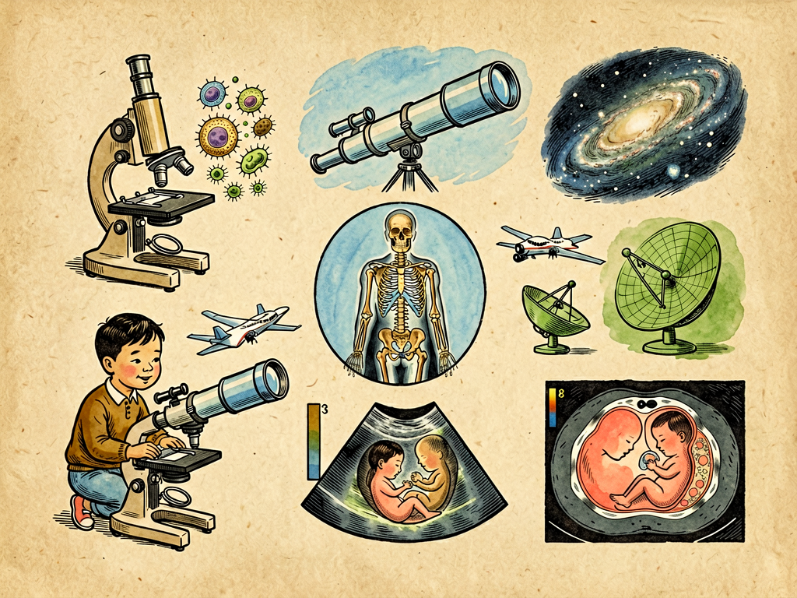

## 第十一章 电的眼睛

---

### 📍 本章导航
**核心主题**：我们总说"眼见为实"，觉得自己眼睛看到的就是真实的全部。但实际上，我们的肉眼是一台性能非常有限的"相机"：它只能看见波长在400-760纳米之间的可见光——红外线、紫外线、X射线、无线电波，这些真实存在的"光"，我们眼睛全都看不见；它的分辨率也有限，比头发丝细的东西就看不清了，病毒、分子、原子更是想都别想；它穿不透不透明的东西，我们看不见自己身体里有没有骨折、有没有肿瘤，看不见墙后面有什么，看不见黑夜里的东西；太远的东西也看不见，天上的恒星在我们眼里只是一个光点，更别说几百亿光年外的星系了。但是人最了不起的地方，就是我们从来不会被天生的器官局限住——我们用电、用磁、用各种传感器和算法，给自己造出了千千万万只"电的眼睛"：显微镜帮我们看见极小的细菌和病毒，望远镜帮我们看见极远的星系，X光和CT帮我们看见身体内部，红外相机帮我们看见黑夜里的东西，雷达帮我们看见云雾后面的飞机，卫星帮我们看见整个地球。这些电的眼睛，把人类的视觉边界往小、往远、往深、往暗扩展了亿万倍，让我们看见了一个比肉眼能感知的丰富亿万倍的世界。这一章我们就来看看，这些电的眼睛是怎么造出来的，它们帮我们看见了哪些以前看不见的东西，又怎么改变了科学和我们的生活。  
**你将发现**：
- 人类第一台真正的"电眼"，是1895年伦琴发现的**X射线**。当时他在实验室里做阴极射线实验，偶然发现一块涂了荧光材料的板子在黑暗中发光，哪怕中间挡了厚纸板、书本甚至金属板，光还是能透过去。他让自己的妻子把手放在荧光板和射线源之间，居然在板子上看见了手骨头的影子，还有手上戴的戒指——这是人类第一次不用开刀，就看见了活人身体内部的骨头。这个发现震惊了全世界，仅仅几个月后，X光就被用在了战场上，帮医生找士兵身体里的子弹。伦琴也因此获得了人类历史上第一个诺贝尔物理学奖。
- 紧接着，人类向内和向外两个方向扩展视觉：
  - **向内看小的方向**：光学显微镜在400年前由列文虎克发明，让我们看见了细菌和细胞，但是受可见光波长限制，最多只能放大一千多倍，看不清比0.2微米更小的东西（比如病毒）。1930年代发明的**电子显微镜**，用波长比可见光短几十万倍的电子束代替光来成像，分辨率一下子提高了几千倍，现在的冷冻电镜甚至能看清单个蛋白质分子的原子结构，科学家靠它看清了新冠病毒刺突蛋白的结构，才能快速设计出mRNA疫苗——2017年诺贝尔化学奖就颁给了冷冻电镜技术。还有扫描隧道显微镜，甚至能直接"摸"到单个原子，把原子一个个摆成图案。
  - **向外看远的方向**：400年前伽利略用光学望远镜看见了木星的卫星，推翻了地心说；后来望远镜越做越大，但是地球大气层会抖动，让星星看起来模糊，所以1990年人类把**哈勃太空望远镜**送到了大气层外面的轨道上，它拍出来的照片清晰得让人惊叹，让我们看见了几百亿光年外的星系，算出了宇宙的年龄是138亿年，证明了宇宙在加速膨胀；2021年发射的**韦伯太空望远镜**，用红外波段观测，能看见宇宙中最早形成的第一批星系，还能分析系外行星的大气成分，找有没有生命存在的迹象；还有射电望远镜，比如中国的FAST"中国天眼"，它接收的不是可见光，是天体发出的无线电波，能看见光学望远镜看不见的脉冲星、黑洞、甚至宇宙大爆炸留下的微波背景辐射。2019年人类拍到的第一张黑洞照片，就是全世界8台射电望远镜联合起来，组成一个地球那么大的虚拟望远镜拍出来的。
- **医学影像**是离我们最近的"电的眼睛"：
  - X光：最传统，骨头看得清楚，但是软组织看不清，适合拍骨折、胸片；
  - **CT（计算机断层扫描）**：就是X光绕着你转一圈，从各个角度拍，然后用计算机把你身体切成一层一层的横断面图像，能看清X光拍不出来的微小肿瘤、脑出血、内脏损伤；
  - **MRI（核磁共振）**：不用X射线，用强磁场让你身体里的氢原子共振，能特别清楚地看见软组织——大脑、神经、肌肉、韧带、椎间盘，CT看不清的早期脑梗、脊髓病变、肿瘤，MRI都能看清楚；
  - **PET-CT**：给你注射一点带放射性的葡萄糖，代谢越旺盛的地方（比如肿瘤）吸收的葡萄糖越多，在图像上就会亮起来，能在肿瘤还很小、CT都还看不见的时候就发现它，还能看到全身有没有转移。
  有了这些电的眼睛，医生再也不用像以前那样，只能靠猜、靠把脉、靠解剖尸体来判断病情，现在只要扫一下，就能清清楚楚看见你身体里出了什么问题，长在什么位置，多大尺寸。
- 还有不用可见光的"电眼"，在生活里无处不在：
  - **红外热像仪**：所有有温度的东西都会发出红外线，红外相机能把温度分布变成可见的图像——黑夜里没有光，也能看见人和动物的轮廓；消防员在浓烟里能看见被困的人；建筑工人用它找墙里的漏水点和电线发热；疫情的时候用它快速测体温；
  - **雷达**：发射无线电波，接收反射回来的回波，就能算出目标的距离、速度、形状——黑夜里、大雾天，雷达能看见几十上百公里外的飞机和船，天气预报用雷达看云层和降雨，自动驾驶汽车用毫米波雷达探测周围的车辆和行人；
  - **声呐**：在水里声音传得远，光传不远，声呐发出声波，听回波就能看见水下的潜艇、鱼群、海底地形；
  - 你手机里的摄像头、路边的监控摄像头、人脸识别、自动驾驶的摄像头，全都是电的眼睛——里面的CCD或CMOS传感器，把光信号变成电信号，再变成数字图像，存在内存里，可以放大、传输、用AI分析。
- 现在的电的眼睛，已经不只是"拍照片"那么简单了：数字图像出来之后，AI能做的事情越来越多——能把模糊的老照片变清晰，能在几百万张CT片里快速找出肿瘤，比放射科医生还准；能在监控视频里自动识别人脸和异常行为；自动驾驶的AI能从摄像头拍的画面里认出红绿灯、行人、车道线；甚至能从阴影、从反射里重建出你看不见的东西。现在"看见"这件事，已经不是单靠镜头和传感器了，而是传感器+算法+大数据的结合，AI正在让电的眼睛变得越来越聪明。
- 这一章最深刻的洞见：人类科学的发展史，本质上就是一部"感官扩展史"。我们天生的感官是为了在非洲草原上生存进化出来的，不是为了发现科学真理——它看不见太小的细菌病毒，看不见太远的星系，看不见身体内部的病变，也看不见紫外线和无线电波。但是我们会造工具，会把其他形式的信号（电子、电磁波、声波、磁场、温度）翻译成我们大脑能理解的图像。每一次我们造出一种新的"眼睛"，就会打开一个全新的世界，带来一次科学革命：显微镜让我们发现了细菌，才有了现代医学和公共卫生；望远镜让我们看见了宇宙的尺度，才有了现代天文学和物理学；X光和CT让我们能看见身体内部，才有了现代诊断医学；射电望远镜让我们看见了黑洞和暗物质。我们现在觉得是常识的东西，在没有对应仪器之前，全都是不可见的、未知的。更重要的是，技术不只是让我们看得更多，它还在改变我们对"真实"的理解——我们现在看到的CT片、黑洞照片、电子显微镜图像，都不是直接用眼睛看到的，而是仪器把信号翻译成图像，再经过算法处理和重建出来的。"看见"从来不是一个被动接收的过程，而是一个主动构建的过程——仪器、算法、理论、解释，共同构成了我们看见的"真实"。永远记住：你眼睛看到的，不是世界的全部，只是你的眼睛能让你看到的那一小部分；真正的世界，比我们感知到的要大得多、丰富得多、精彩得多。

**阅读建议**：你现在手里的手机，就有至少3-4个"电的眼睛"——主摄、超广角、前摄，还有能看见红外光的距离传感器。你可以用它对着电视遥控器的前端，按一下遥控器按钮，你会在屏幕上看到肉眼看不见的红外光在闪烁——这就是电的眼睛帮你看见肉眼看不见的东西，最简单的例子。

---

### 🖋️ 经典原文

我们都有一双眼睛，能看见红花绿草，看见太阳月亮，看见书本上的字，看见身边的人。但是我们这双天生的眼睛，实在太不够用了。
太小的东西，我们看不见：细菌、病毒、分子、原子，它们就在我们身边，在空气里，在水里，在我们皮肤上，但是眼睛看不见，几千年来人类根本不知道它们的存在，直到显微镜发明之前，人们连生病为什么会传染都不知道；
太远的东西，我们看不见：天上的星星在我们眼里只是一个小亮点，月亮上有环形山，木星有卫星，银河系有几千亿颗恒星，宇宙有几百亿光年大，这些肉眼全看不见；
被挡住的东西，我们看不见：我们看不见自己骨头断没断，肺里有没有炎症，肚子里有没有肿瘤，看不见墙后面有没有人，看不见黑夜里藏着什么；
还有很多光，我们的眼睛根本看不见：红外光、紫外光、X射线、无线电波、伽马射线，它们和可见光一样真实存在，但是我们眼睛里没有能接收它们的细胞，所以对我们来说，它们就好像不存在一样。
但是人从来不会甘心被自己的感官限制住。我们没有鹰的眼睛锐利，没有猫能在黑夜里看见东西，我们能看见的波段只有那么窄，但是我们会造眼睛——用电、用磁、用光、用各种材料和算法，造出千千万万只神通广大的"电的眼睛"，帮我们看见那些天生的眼睛看不见的世界。
人类第一只真正意义上的"电的眼睛"，是1895年德国物理学家伦琴在实验室里偶然发现的X射线。
那时候伦琴正在研究阴极射线管，就是一个抽成真空的玻璃管子，通电的时候会发出射线。他用黑纸把管子完全包起来，让光透不出来，但是一通电，离管子不远的一块涂了荧光材料的屏幕居然亮了。他觉得很奇怪，就把书本、木板、甚至厚金属板挡在中间，荧光还是亮——说明有一种看不见的射线，能穿过这些不透明的东西。
最让他震惊的是，当他把手伸到管子和屏幕之间的时候，屏幕上居然显出了他手的影子——而且不是皮肉的影子，是骨头的影子，连他手上戴的结婚戒指的影子都清清楚楚。他给他妻子的手拍了一张照片，照片上是手骨的轮廓，戒指戴在指骨上。这张照片一公布，全世界都轰动了——人类第一次，不用开刀，就看见了活人身体里面的骨头。
当时的人又惊又怕，甚至有商人卖"防X光内衣"，说能防止别人用X光偷看自己；但是医生们立刻意识到了这个发明有多重要，仅仅几个月之后，X光就被用在了战场上，帮医生找士兵身体里的子弹，定位骨折的位置。伦琴也因为这个发现，获得了人类历史上第一个诺贝尔物理学奖。
从那时候开始，人类给自己造电眼的速度就越来越快了。
我们先是往小了看。
四百多年前，荷兰的列文虎克磨出了第一台显微镜，把一滴雨水放到镜片下面，第一次看见了里面游来游去的微生物，看见了人的红细胞，看见了细菌，人类第一次知道，原来肉眼看不见的地方还有一个这么热闹的小世界。但是光学显微镜有个极限：因为可见光的波长限制，最多只能放大一千多倍，比0.2微米还小的东西就看不清了，病毒那么小的东西，光学显微镜根本看不见。
到了1930年代，科学家发明了电子显微镜，不用光来成像，而是用电子束——电子的波长比可见光短几十万倍，分辨率一下子提高了几千倍。现在的冷冻电镜，能把蛋白质分子放大几百万倍，看清里面每一个原子的位置——新冠疫情的时候，科学家就是用冷冻电镜，快速看清了新冠病毒表面刺突蛋白的结构，才能在一年之内就设计出mRNA疫苗，拯救了几百万人的生命。还有扫描隧道显微镜，甚至能直接"摸"到单个原子，科学家能把一个个原子搬来搬去，拼成最小的"量子围栏"。
我们又往远了看。
也是四百多年前，伽利略把他自己磨的望远镜对准天空，看见了月亮上的环形山，看见了木星的四颗卫星，直接推翻了统治一千多年的地心说。后来望远镜越做越大，但是地球大气层会不停抖动，星星看起来总是一闪一闪的模糊不清，于是人类干脆把望远镜送到了太空里。
1990年发射的哈勃太空望远镜，在大气层外面飘了三十多年，拍回了无数张让人惊叹的宇宙照片：它让我们看见了几百亿光年外的星系，看见了恒星从星云里诞生的过程，看见了恒星死亡时的超新星爆发，还算出了宇宙的准确年龄是138亿年，证明了宇宙在加速膨胀，暗能量真的存在。
2021年发射的韦伯太空望远镜，比哈勃还大还灵敏，它用红外波段观测，能看见宇宙中第一批形成的星系——那是宇宙大爆炸之后几亿年就诞生的最早的天体。我们还有射电望远镜，它根本不接收可见光，只接收天体发出的无线电波——中国贵州的FAST"中国天眼"，就是目前世界上最大的单口径射电望远镜，它能看见光学望远镜看不见的脉冲星、快速射电暴、黑洞周围的气体，甚至在寻找外星文明的信号。2019年人类拍到的第一张黑洞照片，就是把全世界8台射电望远镜连起来，组成一个地球那么大的虚拟望远镜，拍了好几天，再用超级计算机算了两年才拼出来的。
我们还往身体里面看。
X光只能看见骨头，软组织看不清；后来发明的CT，让X射线绕着人的身体转一圈，从几百个角度拍照片，然后用计算机计算，把人的身体切成一层一层的横断面，就像把面包切成薄片一样，哪怕是几毫米大的肺部小结节、脑出血、内脏损伤，都能清清楚楚看见。
核磁共振（MRI）更神奇，它不用X射线，没有辐射，而是把人放到一个超强的磁场里，让我们身体里的氢原子共振，不同组织里的氢原子共振信号不一样，计算机把这些信号变成图像，就能把大脑、神经、肌肉、韧带、椎间盘这些软组织看得清清楚楚——早期脑梗、脊髓病变、微小肿瘤，CT发现不了的，MRI都能发现。还有PET-CT，给人注射一点点带放射性的葡萄糖，肿瘤细胞长得快，吃葡萄糖多，在图像上就会亮起来，能在肿瘤还只有米粒大的时候就发现它，还能看到全身有没有转移。
现在去医院看病，医生可能不用给你做什么检查，先开个CT或者核磁，看一眼片子就知道你哪里出了问题，长在什么位置，多大尺寸。这在一百年前是想都不敢想的事情——那时候的医生只能靠把脉、靠听诊、靠病人说症状，身体里面到底怎么了，全靠猜。
除了这些高大上的科学仪器，我们生活里到处都是电的眼睛。
你晚上开车，对面开远光灯晃得你什么都看不见，但是车里的红外热像仪能看见路上的行人和障碍物，因为人有体温，会发出红外线，不管有没有灯都能看见；消防员冲进着火的大楼，浓烟里什么都看不见，戴着红外面罩就能看见晕倒在地上的人；你家电工师傅用红外热像仪一扫，就知道墙里哪根电线发热，哪里快短路了，不用凿开墙找。
雷达也是电的眼睛，它发射无线电波，碰到东西反射回来，就能算出目标有多远、跑多快、多大——大雾天飞机看不见跑道，全靠雷达导航；天气预报用雷达看云层多厚，什么时候下雨；交警的雷达测速枪一照，就知道你有没有超速；现在自动驾驶汽车顶上的毫米波雷达，不用光，在雨雾天也能看见几十米外的行人车辆。
水里光传不远，声音传得远，声呐就用声波当"光"，发出声音听回声，就能看见海底地形、鱼群、潜艇，这是水里的电眼睛。
更不用说你手里的手机，背面好几个摄像头，路边的监控摄像头，小区门口的人脸识别，工厂里的机器视觉检测产品缺陷，自动驾驶汽车周围好几个摄像头——这些全都是电的眼睛。它们里面的CMOS芯片，把光转换成电信号，再变成数字文件，存在内存里，可以放大，可以发给别人，可以让人工智能来分析。
现在的电的眼睛，已经越来越聪明了，不只是会拍照片。人工智能能把模糊的老照片修清晰，能在几百万张CT片子里几秒钟找出早期肺癌，比最有经验的放射科医生准确率还高；能在成千上万的监控视频里自动找到走失的老人；甚至能从地上的影子、玻璃里的反射，重建出摄像头直接拍不到的东西。
但是你有没有想过，所有这些电的眼睛拍出来的"图像"，其实都不是你直接看见的。CT的断层图像是计算机算出来的，黑洞照片是全球望远镜数据拼出来的，核磁共振的图像是氢原子信号重建的，电子显微镜的图像是电子束打出来的——它们都不是"真实的颜色"，也不是直接用眼睛能看到的样子，是科学家把各种信号翻译成了我们大脑能理解的图像。
"看见"这件事，从来都不是被动接收那么简单。从光线进入镜头，到传感器捕捉信号，到算法处理重建，到科学家解读图像，每一步都有人的知识和理论在里面。我们能看见什么，不只取决于眼睛好不好，更取决于我们有什么样的技术、有什么样的理论、愿意去探索什么。
四百多年前显微镜发明之前，没人知道有细菌；一百年前X光发明之前，没人能看见活人的骨头；五十年前哈勃望远镜上天之前，没人知道宇宙长什么样。未来我们还会造出更厉害的电的眼睛，中微子探测器能看见穿过地球的中微子，引力波探测器能"听见"黑洞碰撞的声音——哦不对，引力波其实也是另一种"眼睛"，它让我们不用光，就能看见宇宙里最极端的天体事件。
永远不要觉得"看不见就是不存在"。我们天生的眼睛，只是为了让我们在草原上生存进化出来的，它能看见的世界，只是真实世界极小极小的一部分。真正的世界，比我们能感知到的，要大得多，丰富得多，精彩得多。
而人类最伟大的地方，就是我们永远不会满足于天生的感官局限。我们造显微镜看见微小，造望远镜看见遥远，造医学影像看见身体内部，造红外和雷达看见黑暗——我们给自己造了千千万万只眼睛，也因此看见了越来越大的世界。
下一章，我们讲镜子的故事。

---

> 📜 **科学史话：从伦琴的手骨照片到黑洞照片——人类"看见"边界的一次次突破**
>
> 1895年11月8日，德国物理学家伦琴在实验室里做阴极射线实验，为了不让可见光漏出来，他用黑纸板把阴极射线管严严实实包了起来。但是一通电，他发现离管子一米远的工作台上，一块涂了铂氰化钡的荧光屏在发光。他很惊讶，因为阴极射线连几厘米空气都穿不过，不可能跑一米远。他拿书本、木板、橡胶板挡在中间，荧光还是亮，说明这是一种穿透力极强的未知射线，他就给它起了个名字叫"X射线"，X就是未知的意思。
>
> 接下来的六个星期，伦琴把自己关在实验室里，天天研究这种神秘射线，连吃饭都忘了。他发现X射线能穿过肌肉，但穿不过重金属和骨头。12月22日，他说服妻子安娜把手放在照相底片和射线管之间，曝光了15分钟，拍出了人类历史上第一张X光片——照片上是安娜的手骨，手指上的结婚戒指清清楚楚。安娜看到照片的时候吓坏了，说："我看见了我死后的样子。"
>
> 1896年1月，伦琴发表了他的发现，这个消息像闪电一样传遍了全世界。仅仅几个月，X射线就被用在了医学上，美国医生用它找到了病人腿里的子弹；欧洲已经开始卖X光机给贵族玩，大家都去拍自己的手骨。伦琴没有为X射线申请专利，他说这个发现属于全人类，应该免费给所有人用。1901年第一届诺贝尔奖颁发，物理学奖毫无争议地给了伦琴。
>
> X光的发现，只是一个开始。
>
> 1931年，德国工程师恩斯特·鲁斯卡发明了第一台电子显微镜，用电子束代替光，分辨率一下子超过了光学显微镜，他因此拿到了1986年的诺贝尔物理学奖。
>
> 1967年，英国工程师豪斯菲尔德在研究计算机图像重建的时候，想到了用X射线多角度扫描再用计算机重建断层图像的主意，这就是CT。第一台CT机只能扫描头部，扫描一个病人要花几分钟，图像只有80×80像素，但是已经能看清脑子里的肿瘤了。1972年CT正式投入临床使用，轰动了整个医学界，豪斯菲尔德和提出CT理论的物理学家科马克一起拿了1979年的诺贝尔生理学或医学奖。
>
> 1990年哈勃望远镜上天，一开始拍的照片是模糊的，因为主镜片磨错了2微米，差了头发丝的1/50。1993年宇航员坐航天飞机上去给它装了个"近视眼镜"（校正镜片），之后哈勃就开始了它传奇的一生，三十多年来拍回了无数经典宇宙照片，彻底改变了人类对宇宙的认识。
>
> 2019年4月10日，人类发布了第一张黑洞照片——M87星系中心的黑洞，距离地球5500万光年，质量是太阳的65亿倍。为了拍这张照片，科学家在全球8个地方布置了射电望远镜，连起来组成一个和地球直径一样大的虚拟望远镜（事件视界望远镜），连续观测了好几天，产生了几PB的数据，用超级计算机算了两年，才拼出了那张模糊的橘红色光环。这张照片证明了黑洞真的存在，爱因斯坦的广义相对论在极端条件下还是对的。
>
> 从1895年那张带着戒指的手骨照片，到2019年5500万光年外的黑洞照片，这124年里，人类的"电的眼睛"把我们的视觉边界，从自己的手，扩展到了宇宙的边缘，扩展到了原子内部。每一次技术突破，我们看见的世界就更大一点。

---

> 🔬 **科学更新：冷冻电镜、AI视觉与量子成像——电眼的未来会是什么样？**
>
> 过去十几年，电的眼睛又有了很多革命性的进步：
>
> **冷冻电镜革命**：2013年之后，冷冻电镜技术突然成熟了——把生物分子快速冷冻到零下180度，不用染色不用结晶，就能直接拍出分子的三维原子结构，分辨率达到了0.2纳米以下。2017年诺贝尔化学奖颁给了三位冷冻电镜的先驱，现在结构生物学几乎全靠冷冻电镜，以前花几年甚至十几年才能解出来的蛋白质结构，现在几周甚至几天就能解出来。新冠疫情期间，我国科学家就是用冷冻电镜，在2020年1月就解析出了新冠病毒刺突蛋白的结构，为疫苗研发争取了宝贵时间。
>
> **AI给电眼装上大脑**：以前电眼拍完照片，还得人来看；现在AI算法能直接看懂图像，甚至看得比人准。比如谷歌的DeepMind开发的AI，能在乳腺钼靶照片里发现早期乳腺癌，准确率比资深放射科医生还高；自动驾驶的AI能从摄像头画面里实时识别行人、车辆、红绿灯、交通标志，反应比人快得多；AI还能把模糊的老照片修复清晰，把低分辨率的视频变成4K，甚至从单张照片重建三维场景。现在"看见"已经不是眼睛和传感器的事了，AI成了电眼的视觉皮层。
>
> **新的成像原理**：现在还有量子成像、鬼成像，用纠缠的光子，哪怕传感器没有对着物体，也能拍出物体的照片；还有透视成像，能隔着墙壁看到墙后面人的动作，用的是WiFi信号的反射；还有光声成像，把光打进去，让组织发出超声波，再成像，既能有光学的对比度，又能有超声的穿透深度，能看见皮肤下面几厘米的癌细胞。
>
> 最让人期待的是，未来我们可能会有能看见中微子、暗物质的"眼睛"——这些东西现在我们只能间接探测，未来如果能直接"看见"它们，我们对宇宙的理解又会有一次革命性的飞跃。

---

> 🧪 **动手试一试：用手机看见肉眼看不见的红外光**
>
> 我们肉眼看不见红外线，但是手机的摄像头传感器是能看见红外光的（只是厂商加了滤光片过滤掉大部分，但是还是有部分能漏过来）。我们可以做个简单的小实验：
>
> 准备材料：一部智能手机，一个电视/空调遥控器。
>
> 步骤：
> 1. 打开手机的相机，切到前置摄像头或者主摄（有的手机主摄滤光片厚，前置更明显）；
> 2. 拿起遥控器，把顶端那个发光的红外二极管对着摄像头；
> 3. 按下遥控器上的任意按钮，眼睛看着手机屏幕——你会看到遥控器顶端发出蓝白色或者紫红色的光在闪烁，但是你直接用肉眼看，是什么光都看不到的！
>
> 这就是最简单的"电的眼睛"帮你看见肉眼看不见的东西的例子。你看到的闪烁光，就是遥控器发出的红外编码信号，手机摄像头能看见，你的肉眼看不见。
>
> 你还可以晚上把灯全关了，用手机摄像头对着黑暗的房间，你会发现摄像头比你眼睛"夜视力"好一点，能看见你眼睛看不清的东西——当然比专业红外夜视仪还差远了，但这已经是一个最基础的电眼了。

---

### 💬 读后思考与讨论

1. 有人说"眼见为实"，读完这一章，你对这句话有什么新的理解？我们通过仪器看到的东西，和肉眼直接看到的东西，哪个"更真实"？
2. 每一次新的观测仪器发明出来，几乎都会带来科学革命——显微镜带来了微生物学，望远镜带来了近代天文学，X光带来了现代医学。你能再举出几个类似的例子吗？为什么工具对科学这么重要？
3. 现在AI能解读医学影像，甚至比医生还准，未来医生会不会被AI取代？你觉得在"看见"和"理解"之间，人的作用是什么？
4. 如果让你给未来人类发明一种新的"电的眼睛"，你最想看见什么现在看不见的东西？为什么？
5. 现在监控摄像头无处不在，人脸识别随处可见，电的眼睛在给我们带来便利的同时，也带来了隐私问题。你觉得我们该怎么平衡技术带来的好处和个人隐私之间的关系？

### 🔗 关联阅读
- 第三部第八章：《谈眼镜》→ 眼镜是人类最早用来扩展视觉的工具，是所有光学仪器的祖先
- 第三部第二十章：《光和色的表演》→ 光的本质是什么，我们为什么能看见不同的颜色
- 第二部第三、四、五、六章：《色》《声》《香》《味》→ 我们的其他感官（听、嗅、味、触）也有局限，技术也在扩展这些感官
- 跨章节思考：从眼镜补全视力，到显微镜、望远镜、医学影像扩展视觉——人类所有技术的本质，都是扩展我们天生的感官边界，突破进化给我们设下的限制。
