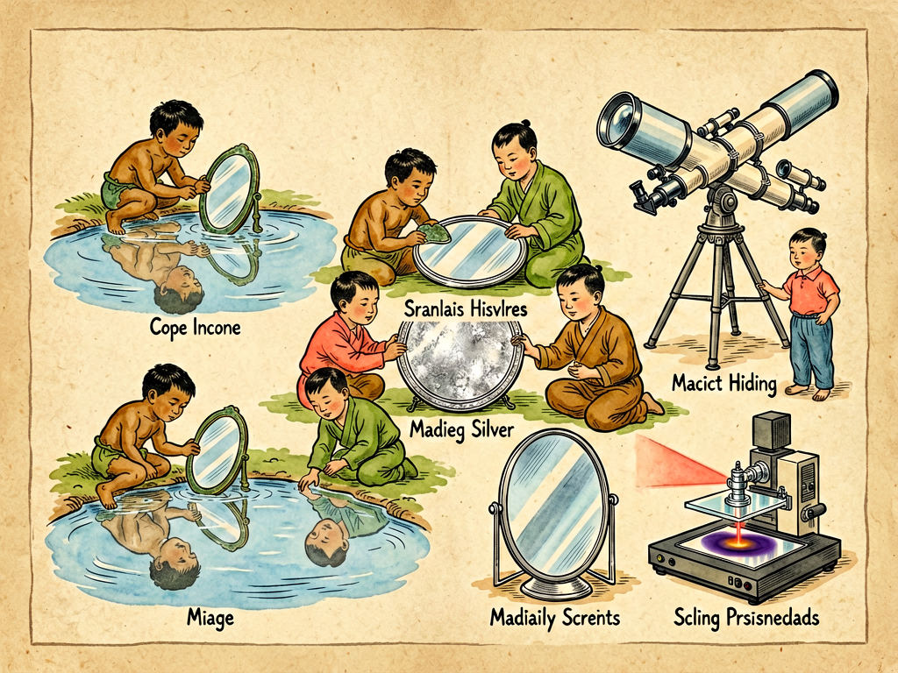

## 第十二章 镜子的故事

---

### 📍 本章导航
**核心主题**：我们每天都要照好几次镜子——早上洗脸刷牙照镜子，出门前整理衣冠照镜子，汽车里有后视镜，路口有转角凸面镜，望远镜、显微镜、相机、激光器、光刻机、引力波探测器里面都有镜子。镜子看起来是最简单不过的东西，不过是一块能反光的玻璃嘛，但是你知道吗？人类花了几千年，才把镜子做得又清楚又便宜；而最先进的现代镜子，精度已经做到了原子级别，能帮我们看见一百多亿光年外的星系，能探测到比原子核还小的空间形变，能刻出7纳米、3纳米的芯片。镜子的历史，不只是一个日常用品的发明史，更是人类一步步学会控制光、追求精确、认识自己也认识世界的历史。最早的时候，人只能对着平静的水面看自己摇摇晃晃的倒影；然后我们磨亮了铜、铁、银，做出了金属镜；几百年前威尼斯人发明了玻璃镀银的镜子，当时一面镜子比一幅名画还贵，只有国王贵族用得起；后来化学和工业进步了，镜子才走进了千家万户；而今天，镜子已经从梳妆台上的日用品，变成了现代科学和工业最核心的精密部件之一。这一章我们就来讲讲，镜子是怎么从水面倒影变成科学利器的，这个小小的器物里藏着什么样的大学问。  
**你将发现**：
- 人类最早的"镜子"就是平静的水面。古代人说"人莫鉴于流水，而鉴于止水"，只有水平静了才能当镜子用，但是水面太不方便了，风一吹就乱，手一碰就花，也不能随身带。于是人类开始想办法做"不会动的人工水面"：最先用的是抛光的黑曜石（一种天然玻璃），然后是铜、青铜、银这些金属，把表面磨得光溜溜的就能照见人。中国古代用铜镜，从商周一直用到明清，一面好的铜镜要反复打磨几个月，才能磨得锃亮；但是金属镜有个问题，用久了会氧化发黑，要经常磨，而且反射率不算高，照出来的人总是昏黄昏黄的。
- **玻璃镜**是镜子历史上最大的革命。13世纪，威尼斯的穆拉诺岛上的工匠发明了在玻璃背面镀锡汞齐的方法做镜子，做出来的镜子又清楚又明亮，比金属镜好太多了。当时威尼斯把镜子制造工艺当成国家最高机密，谁敢把技术泄露出去就处死，甚至派刺客去暗杀逃到国外的工匠。那时候一面威尼斯镜子贵得离谱——法国国王路易十四结婚的时候，威尼斯国王送了他一面镜子作为礼物，居然比同等重量的白银还贵，全欧洲的贵族都以拥有威尼斯镜子为荣。路易十四为了炫耀，在凡尔赛宫建了著名的镜厅，一整面墙镶了300多面大镜子，在当时简直是财富和权力的极致象征——要知道那时候一个普通家庭一辈子都买不起一面小镜子。后来法国想尽办法把威尼斯工匠偷运到了法国，才终于学会了造镜子，再后来19世纪德国化学家发明了银镜反应（用葡萄糖把银氨溶液里的银还原出来，均匀沉积在玻璃上），镜子才终于可以大规模工业化生产，价格一落千丈，慢慢走进了普通老百姓家。
- 镜子的原理其实特别简单，就是**光的反射定律**：光射到光滑表面上的时候，入射角等于反射角。我们照平面镜的时候，物体反射的光射到镜面上，按规律反射回来，我们的眼睛会顺着反射光往回看，就觉得镜子后面有一个一模一样的"你"——这个像不是真实存在的，所以叫虚像，和你本人大小一样，距离镜子一样远，只是左右反过来了（其实不是左右反，是前后反，因为你的前面和像的前面刚好对着）。
- 不只是平的镜子，曲面的镜子也大有用处：
  - **凹面镜**：中间凹进去的镜子，能把平行光汇聚到一个焦点上，也能把焦点上发出的光变成平行光射出去——手电筒、探照灯、汽车大灯前面的反光碗就是凹面镜，能把光集中起来照得很远；化妆镜也是凹面镜，能把脸放大，看得更清楚；反射式天文望远镜用的也是大凹面镜，把遥远星星微弱的光汇聚起来；还有太阳灶，用凹面镜把太阳光聚到一点，能把水烧开甚至能做饭。
  - **凸面镜**：中间凸出来的镜子，能把光发散开，照出来的东西比实际小，但是视野特别宽——汽车的后视镜就是凸面镜，能看到车后面更宽的范围；路口的转角镜也是凸面镜，能让你看到拐角另一边有没有车过来，避免撞车。
- 镜子到了现代科学家和工程师手里，精度已经做到了匪夷所思的程度：
  - **天文望远镜的反射镜**：哈勃太空望远镜的主镜直径2.4米，磨制的时候只磨错了2微米（头发丝的1/30），结果上天之后拍出来的照片全是模糊的，成了"近视眼"，后来宇航员专门坐航天飞机上去给它装了个"眼镜"才修好；2021年上天的韦伯太空望远镜，主镜直径6.5米，是用铍做的，镀金，分成18块六边形镜片，发射的时候折起来，到了太空再一点点展开，每块镜片的位置都能精确调整到纳米级别，能看见135亿光年外星系发出的微弱红外光。
  - **LIGO引力波探测器**：LIGO有两个4公里长的真空臂，两端各挂着一面超高精度的镜子，激光在镜子之间来回反射，当引力波过来的时候，会把两个臂的长度拉伸/压缩一个比原子核直径还小几千倍的距离，镜子就能捕捉到这个极其微小的变化——2015年人类第一次探测到引力波，靠的就是这几面镜子，证明了爱因斯坦100年前的预言，拿了诺贝尔物理学奖。
  - **EUV光刻机的反射镜**：现在最先进的EUV光刻机，要刻3纳米、5纳米的芯片，用的是波长13.5纳米的极紫外光，这种光几乎所有材料都吸收，不能用透镜聚焦，只能用反射镜。EUV光刻机里的反射镜是人类有史以来造得最平的东西——把它做得像中国国土面积那么大，整个表面的起伏不会超过一根头发丝。每面镜子镀了几十层特殊的膜，总共只反射70%左右的光，11面镜子串起来，最后只剩下2%的光到晶圆上，精度要求高得难以想象。
- 镜子不只是个光学工具，它还有很深的文化和哲学意义：唐太宗说"以铜为鉴，可以正衣冠；以人为鉴，可以明得失；以史为鉴，可以知兴替"——这里的"鉴"就是镜子，镜子从一开始就和"自省""对照""真实"联系在一起。但是到了今天，手机美颜、滤镜、AI换脸、深度伪造技术越来越发达，我们在屏幕上看到的自己，越来越多是被修饰过、加工过的"镜像"，镜子和真实的关系又一次变得复杂起来。
- 这一章最深刻的洞见：人类技术的进步，很多时候并不是发明了什么全新的东西，而是把一件很简单的事情做到了极致——镜子最本质的功能就是反光，几千年前我们用抛光的铜片反光，照见自己的脸；今天我们把镜子磨到原子级平整，就能照见一百多亿光年外的星系，探测时空的涟漪，刻出最先进的芯片。同样的原理，精度不同，能到达的世界就完全不同。镜子最神奇的地方还在于，它既是向内的——帮我们看见自己、审视自己；又是向外的——帮我们看见遥远的世界、宇宙的边缘。看见自己和看见世界，本来就是同一种能力的两个方向：你只有先诚实地看见自己，才能准确地看见世界；你看见的世界越大，对自己的认识也就越清楚。

**阅读建议**：找一把金属勺子，它的两面就是最简单的凹面镜和凸面镜——用凹面那面对着自己，离远一点、近一点，看看成像有什么变化；再翻过来用凸面那面对着自己，看看是不是和汽车后视镜一样，东西变小了但是视野变宽了。这就是最简单的曲面镜实验。

---

### 🖋️ 经典原文

我们每天早上起来，第一件事多半是去洗手间，对着镜子洗把脸，刷个牙，整理一下头发，看看衣服穿整齐了没有。镜子是我们最熟悉不过的东西，熟悉到我们几乎不会去想它：不就是一块背面涂了东西的玻璃嘛，有什么稀奇的？
但是你有没有想过，如果这世界上没有镜子，会是什么样子？
你永远不知道自己长什么样，只能从水面摇摇晃晃的倒影里，从别人的描述里，模模糊糊地猜自己长什么样子；你没办法自己整理头发、刮胡子、化妆，得靠别人帮忙；你穿衣服是不是整齐，脸上有没有脏东西，自己永远看不见。镜子看起来不起眼，但是没有它，我们连最基本的自我认知都做不到。
人类最早的镜子，就是平静的水面。
古代人走到河边，蹲下来，等水平静了，就能看见自己的倒影；他们还用陶盆盛上水，放在家里当镜子用。我们今天说"水平如镜"，最早的镜子真的就是水。但是水面太不方便了，你得端着它，不能晃，风一吹就起波纹，影子就碎了，路上也没法带，晚上黑了也看不清。所以人类从几千年前就开始琢磨：能不能做出一块不会动、不会晃、可以随身带的"人工水面"？
最先做出来的，是金属镜。
人们发现，把黑曜石（一种天然火山玻璃）磨得光溜溜的，就能照见人；后来学会了冶炼金属，就把铜、青铜、银这些金属熔化了铸成圆盘，再反反复复打磨，把表面磨得像现在的玻璃一样光滑锃亮，就能当镜子用了。中国从商周时候就开始用铜镜，一直用到清朝末年，用了三千多年。一面好的铜镜，要经过几十道工序，铸造、打磨、开光，最后磨出来光可鉴人，头发丝都能照得清清楚楚。
但是金属镜有个大缺点：金属容易氧化生锈，用不了多久就会发乌，照不清楚人了，得经常磨。过去街上有专门磨镜子的工匠，走街串巷给人磨铜镜、磨剪子。而且金属再怎么磨，反射率也不算高，照出来的人脸总是昏黄昏黄的，不够亮。
真正好用又便宜的镜子，是玻璃镜，也就是我们今天用的这种镜子。
玻璃本身透明，不反光，但是如果在玻璃背面涂上一层光亮的金属，让光透过玻璃之后，从金属层上反射回来，就能照出特别清楚的像——玻璃又平又硬，不会变形，金属层在背面，不会被氧化刮花，比金属镜好用多了。
最早做出高质量玻璃镜的，是威尼斯穆拉诺岛上的工匠。13世纪的时候，他们发明了在玻璃背面镀锡汞齐的办法，做出来的镜子又清楚又明亮，一下子就轰动了整个欧洲。当时威尼斯共和国把这个工艺当成最高国家机密，所有造镜子的工匠都被关在穆拉诺岛上，不许随便出去，谁要是敢把技术泄露给外国人，直接判死刑，甚至派刺客追到国外去杀人。
那时候的威尼斯镜子，贵得简直离谱。法国国王路易十四结婚的时候，威尼斯总督送了他一面不大的镜子当贺礼，价值居然相当于今天的几百万人民币，比同等重量的白银还贵好多倍，全欧洲的国王贵族都抢着买，谁家里有几面威尼斯镜子，那是顶级财富和身份的象征。路易十四为了摆阔，专门在凡尔赛宫修了一个镜厅，一整面墙镶了300多面大镜子，白天反射窗外的花园和阳光，晚上把几千根蜡烛的光反射得像银河一样，把所有来参观的外国使节都看得目瞪口呆——那可是连一个普通贵族都不一定买得起一面镜子的年代啊，他居然一整面墙全是镜子。
后来法国人为了学到造镜子的技术，想尽了办法，派了密使去威尼斯，偷偷贿赂了几个工匠，半夜里用小船把他们从穆拉诺岛接了出来，运到法国，这才终于学会了造玻璃镜。威尼斯政府虽然派了刺客去杀这些叛逃的工匠，但是技术已经传出去了，再也拦不住了。
到了19世纪，德国化学家李比希发明了"银镜反应"——不用有毒的水银了，用葡萄糖把硝酸银溶液里的银还原出来，均匀地沉积在玻璃表面，形成一层又薄又亮的银膜，再刷上一层漆保护起来。这种方法做镜子又快又便宜，还安全，镜子才终于可以大规模工业化生产，价格越来越便宜，慢慢从王宫里走出来，走进了每一个普通家庭。到今天，几块钱就能买一面挺好的镜子，谁都用得起，这在几百年前是根本不敢想的事情。
镜子为什么能照见人？说穿了就是一个特别简单的物理定律：**光的反射定律**。
不管是水面、铜镜还是玻璃镜，只要表面足够光滑，光照上去的时候，就会按照一个固定的规律反射：入射角等于反射角——你从什么角度照上去，光就会从对称的角度弹回来。当你站在镜子前面，你脸上反射的光射到镜面上，又按这个规律反射到你的眼睛里，你的大脑会自动认为光是沿着直线传过来的，顺着反射光往镜子后面看，就觉得镜子后面站着一个和你一模一样的人，那就是你的像。
这个像不是真的有光从镜子后面发出来，是你的大脑虚拟出来的，所以叫虚像，和你本人大小一样，你离镜子多远，那个像就离镜子多远；大家常说镜子里的人是左右反过来的，其实不对，不是左右反，是前后反——你的脸对着镜子，你的前面是朝向镜子的，而像的前面是朝向你的，刚好是前后翻转的关系，看起来就像左右反了而已。
不只是平的镜子，人们发现把镜子做成弯的，还有更多用处。
中间凹进去的镜子叫凹面镜，它能把平行射过来的光，全都汇聚到一个点上，这个点叫焦点；反过来，如果把一个光源放在焦点上，凹面镜就会把光反射成一道平行光束，照出去很远不散开。你家里的手电筒、汽车的前大灯、舞台上的探照灯，灯泡后面那个亮亮的反光碗就是凹面镜，就是靠它把光集中起来，照得又远又亮；女孩子化妆用的小镜子也是凹面镜，能把你的脸放大，连毛孔都看得清清楚楚；反射式天文望远镜用的也是大凹面镜，能把遥远星星发出的极其微弱的光汇聚到一点，让我们能看见几百亿光年外的星系；还有农村用的太阳灶，用一个很大的凹面镜把太阳光聚到焦点上，放一壶水在那里，不一会儿就能烧开，不用烧柴不用烧电，干净又环保。
中间凸出来的镜子叫凸面镜，它和凹面镜刚好相反，会把光发散开，虽然照出来的东西比实际小一点，但是能看到特别宽的范围——你坐汽车的时候，司机旁边的后视镜就是凸面镜，上面经常写着"物体比看上去更近"，因为凸面镜缩小了物体，但是能看到车后面很宽的路面，不用回头就能看到旁边车道有没有车；山路拐角、小区门口经常立着一个圆圆的凸面镜，也是这个道理，能让你看到拐角另一边有没有来车，避免撞车。
到了现代，镜子早就不只是放在家里给人照脸的日用品了，它成了科学家和工程师手里最精密的工具，精度已经做到了让人难以想象的程度。
你知道哈勃太空望远镜吗？它在地球轨道上飘了三十多年，拍了无数张绝美的宇宙照片，它的心脏就是一块直径2.4米的凹面反射镜。这块镜子当年磨制的时候，最后一步只磨错了2微米——也就是头发丝的三十分之一那么厚，本来以为这点误差不算什么，结果哈勃上天之后，拍出来的照片全是模糊的，像个近视眼一样，根本看不清东西。NASA花了几亿美元，专门让宇航员坐航天飞机上去，给哈勃装了一副"近视眼镜"（校正镜片），才终于让它看清楚了宇宙。
比哈勃更厉害的韦伯太空望远镜，主镜直径6.5米，是用金属铍做的，表面镀了一层金——因为金对红外线的反射率特别高——它分成18块六边形的镜片，发射的时候像花瓣一样折起来，装在火箭头里，到了150万公里外的拉格朗日点，再一点点展开，每一块镜片的位置和角度都能用电动机精确调整，精度达到10纳米，也就是头发丝的八千分之一，这样才能拼出一个完美的大镜面，看见宇宙大爆炸之后几亿年形成的第一批星系发出的微弱红外光。
更厉害的是LIGO引力波探测器，它有两个互相垂直的真空臂，每个臂4公里长，两端各挂着一面40公斤重的高纯石英镜子，表面抛光到原子级平整。激光在两个臂里的镜子之间来回反射几百次，当两个黑洞合并产生的引力波扫过地球的时候，会把两个臂的长度一个拉长一个压缩，这个形变有多大呢？比一个原子核的直径还要小几千倍——相当于测量太阳到比邻星4.2光年的距离，误差不超过一根头发丝。但是LIGO的镜子就能探测到这么小的变化，2015年人类第一次直接探测到了引力波，证实了爱因斯坦100年前的预言，拿了诺贝尔物理学奖，这其中最大的功臣之一就是这几面精度高到离谱的镜子。
现在最先进的EUV光刻机，用来造5纳米、3纳米的手机芯片，里面核心的光学部件也是反射镜。因为EUV是极紫外光，波长只有13.5纳米，几乎所有材料都吸收这种光，根本不能用玻璃透镜，只能用特殊的反射镜。这些反射镜是人类有史以来造得最平的东西——如果把镜子放大到中国整个国土面积那么大（960万平方公里），整个表面最高的地方和最低的地方差不了一根头发丝。每面镜子上镀了几十层交替的钼和硅膜，每层只有几纳米厚，精度控制到原子级。11面这样的反射镜串起来，把激光打在锡滴上产生的EUV光反射聚焦，最后在晶圆上刻出只有几个纳米宽的电路——我们手机里的芯片，本质上就是这些镜子"刻"出来的。
你看，从古代人蹲在河边看自己的倒影，到铜镜，到威尼斯贵族家里的奢侈品，到今天家家户户都有的日用品，再到哈勃、韦伯、LIGO、光刻机里的核心部件，镜子还是那个镜子，原理还是那个反射定律，但是当我们把镜面的平整度从毫米级做到微米级、纳米级、原子级的时候，它能帮我们做到的事情，就完全不一样了——从照见自己的脸，到照见一百多亿光年外的星系，到探测时空本身的涟漪，到刻出人类最先进的芯片。
镜子不只是一件器物，它还是一种文化符号。唐太宗说过一句特别有名的话："以铜为鉴，可以正衣冠；以人为鉴，可以明得失；以史为鉴，可以知兴替。"这里的"鉴"就是镜子。镜子从诞生那天起，就不只是用来照脸的，它代表着对照、自省、真实——你对着镜子，就能看见真实的自己，哪里歪了，哪里脏了，哪里不对，一目了然。
但是到了今天，镜子和真实的关系又变复杂了。你手机里的自拍，有美颜滤镜，能磨皮、瘦脸、放大眼睛；AI换脸技术能把你的脸换到任何人身上；深度伪造视频能以假乱真，连声音都一模一样。我们越来越多地通过屏幕、通过镜头、通过算法看见自己和世界，这些"数字镜子"比真实的镜子更讨我们喜欢，但是也离真实越来越远。
其实不管技术怎么变，镜子最本质的功能从来没变过：它帮我们看见原本看不见的东西——看得见自己的脸，才能整理衣冠；看得见遥远的星星，才能理解宇宙；看得见历史和他人，才能明白得失。真正的镜子，永远是诚实的。
下一章，我们讲摩擦。

---

> 📜 **科学史话：从威尼斯的国家机密到LIGO的原子级镜面——镜子的精度进化史**
>
> 13世纪到16世纪，威尼斯穆拉诺岛是全世界玻璃制造的中心，镜子制造工艺是威尼斯共和国的最高商业机密。法律规定：任何工匠如果把技术传到国外，会被下令逮捕；如果拒绝回国，他的近亲会被抓起来坐牢；如果还不回来，就会派刺客去把他杀掉。尽管刑罚这么重，还是有工匠被法国的重金收买，1665年，几个威尼斯工匠在法国大使的安排下，半夜里坐小船逃到了法国，在诺曼底建立了法国第一家镜子工厂。威尼斯政府果然派了刺客过去，杀了两个叛逃的工匠，但是剩下的人还是留在了法国，技术已经泄露，再也拦不住了。后来法国的镜子工艺很快赶上了威尼斯，凡尔赛宫的镜厅用的就是法国自己造的镜子。
>
> 1668年，26岁的牛顿发明了世界上第一台反射式望远镜。在那之前，大家用的都是折射式望远镜，就是用玻璃透镜做的，有个大问题叫色差——不同颜色的光折射率不一样，星星周围会出现彩色的光圈，总是看不清楚。牛顿想明白了这个问题，他不用透镜，而是自己磨了一块凹面金属镜，用反射来汇聚光线，就没有色差问题了。这台望远镜只有15厘米长，但是能清楚看见木星的卫星和金星的相位，轰动了整个英国皇家学会。从那以后，所有大天文望远镜都是反射式的，从牛顿的小金属镜到今天韦伯望远镜6.5米的镀金铍镜，用的都是同一个原理。
>
> 1990年哈勃太空望远镜上天，结果拍出来的照片都是模糊的，NASA仔细检查之后发现，主镜磨制的时候，校准设备出了问题，边缘磨得太平了一点点，误差只有2.2微米——大约是头发丝的1/30。就是这么一点点肉眼根本看不见的误差，让价值25亿美元的哈勃成了近视眼。1993年，7名宇航员坐奋进号航天飞机上天，进行了一次史无前例的太空维修，给哈勃装了一个叫"COSTAR"的校正光学系统，相当于给哈勃戴了一副眼镜，终于让它恢复了视力，之后的三十年里，哈勃给人类拍回了无数张经典的宇宙照片，彻底改变了我们对宇宙的认识。
>
> 2015年9月14日，LIGO探测器捕捉到了一个信号——13亿光年外，两个分别是36倍和29倍太阳质量的黑洞合并成了一个62倍太阳质量的黑洞，损失的3个太阳质量变成了引力波，以光速穿过宇宙，把LIGO的4公里长臂拉伸/压缩了10^-18米——也就是质子直径的千分之一。这个信号被LIGO的镜子和激光捕捉到了，这是人类第一次直接探测到引力波，爱因斯坦在1916年根据广义相对论预言引力波整整一百年之后，终于被证实了。LIGO的镜子是用超高纯的熔石英做的，每块镜子40公斤，表面抛光到粗糙度小于0.1纳米，也就是不到一个原子的厚度，挂在复杂的减震系统上，隔绝掉所有地面震动、温度变化、甚至海浪拍岸的微小干扰，才能探测到这么小的变化。
>
> 从威尼斯工匠手工抛光的水银镜子，到今天误差不到一个原子的超精密反射镜，镜子的精度进化史，就是人类工业和科学能力的进化史。

---

> 🔬 **科学更新：超材料镜子、量子镜子与完美反射——未来的镜子会是什么样？**
>
> 今天科学家还在研发更神奇的新型镜子：
>
> **超材料镜子**：用纳米结构的人工超材料做反射面，能做到对特定波长的光反射率接近100%，甚至能反射本来很难反射的X射线、极紫外光，以后可能会让光刻机和天文望远镜的分辨率再上一个台阶；还有负折射率超材料，能做"完美透镜"，突破传统光学的衍射极限，看见比波长还小的细节。
>
> **量子镜子**：科学家已经能把冷原子做成"原子镜子"，能像镜子反射光一样反射原子束，用来做原子干涉仪，测量重力、探测暗物质，精度比现在的仪器高好几个数量级；还有量子反射镜，能让光和原子在量子层面发生特殊的反射效应，用来做量子计算和量子传感。
>
> **柔性镜子**：现在已经有了可以弯曲的柔性反射镜，用在可穿戴设备、AR/VR眼镜里，能动态调整焦距，不管你看远看近都能清晰成像，以后可能会取代现在的老花镜和近视镜。
>
> 最有意思的是"时间反射镜"——最近几年科学家发现，如果快速改变介质的光学性质，就能让光在时间上发生"反射"，不是光往回弹，而是光的频率被反转，相当于光在时间上倒回去走一段，这种新奇的效应可能会用到6G通信和光子计算机里。
>
> 镜子这个已经有几千年历史的老发明，到今天还在不断进化，给我们带来新的惊喜。

---

> 🧪 **动手试一试：勺子里的镜子世界+简易潜望镜**
>
> 家里最常见的曲面镜就是金属勺子，我们用它做几个简单实验：
>
> 实验一：勺子曲面镜
> 1. 拿一把干净的金属勺子（最好是不锈钢的，亮一点的）；
> 2. 先用凹进去的那面对着自己，把勺子从远慢慢移近，看看你的像有什么变化——离远的时候是不是上下颠倒、缩小的？离近了是不是又变成正立放大的了？
> 3. 再把勺子翻过来，用凸出来的那面对着自己，不管远近，是不是都是正立缩小的像？和汽车后视镜效果是不是一样？视野是不是特别宽？
>
> 实验二：做个简易潜望镜
> 准备材料：两面小镜子，一个硬纸筒（或者硬纸板做一个长方形筒），胶带，剪刀。
> 1. 把硬纸筒做成Z字形，或者两个互相平行的直角筒；
> 2. 在纸筒的上下两个转弯处，各开一个45度的斜口，把两面镜子分别插进去，镜面相对，都和水平方向成45度角，固定好；
> 3. 你从下面的口看进去，就能看到上面口对着的地方的东西——哪怕你躲在桌子下面，也能看到桌子上面的东西，这就是潜望镜最基本的原理，潜水艇里的潜望镜就是这样用两面镜子（或者棱镜），让水兵在水下就能看到水面上的情况。
>
> 你还可以做个小实验：拿两面镜子，对着立起来，成一个角度，在中间放一个小玩具，看看镜子里有几个玩具的像？角度越小，像越多——如果两面镜子平行对着放，你在中间能看到无数个你，一直延伸到镜子深处，这就是万花筒的原理。

---

### 💬 读后思考与讨论

1. 唐太宗说"以铜为鉴，可以正衣冠；以人为鉴，可以明得失；以史为鉴，可以知兴替"，为什么镜子会和"自省""真实"联系在一起？你生活中有哪些可以当"镜子"的人或事？
2. 从水面倒影到铜镜，到威尼斯玻璃镜，到今天原子级精度的超精密反射镜，镜子的原理从来没变过，都是光的反射，但是能力差了亿万倍。你从这个故事里，对"精度"和"技术进步"有什么新的理解？
3. 现在美颜滤镜、AI换脸越来越普遍，我们在屏幕上看到的自己很多都是被修饰过的，你觉得这些"数字镜子"是让我们更接近真实，还是更远离真实？
4. 凹面镜能聚光，凸面镜能扩大视野，平面镜能照出等大的像，同是反射，形状不同，效果就完全不同。生活里你还见过哪些地方用到了不同类型的镜子？
5. 如果让你发明一种新的镜子，你最想让它帮你看见什么？

### 🔗 关联阅读
- 第三部第八章：《谈眼镜》→ 眼镜是最早的光学仪器，透镜和镜子一起构成了现代光学的基础
- 第三部第十一章：《电的眼睛》→ 望远镜、显微镜这些"电的眼睛"里，镜子是核心部件
- 第三部第二十章：《光和色的表演》→ 详细讲光的反射、折射、色散等基本性质
- 跨章节思考：从镜子、透镜到望远镜、显微镜、芯片——现代科学和工业的很多伟大成就，底层都是对光的控制，把最简单的原理做到极致，就是最了不起的技术。
