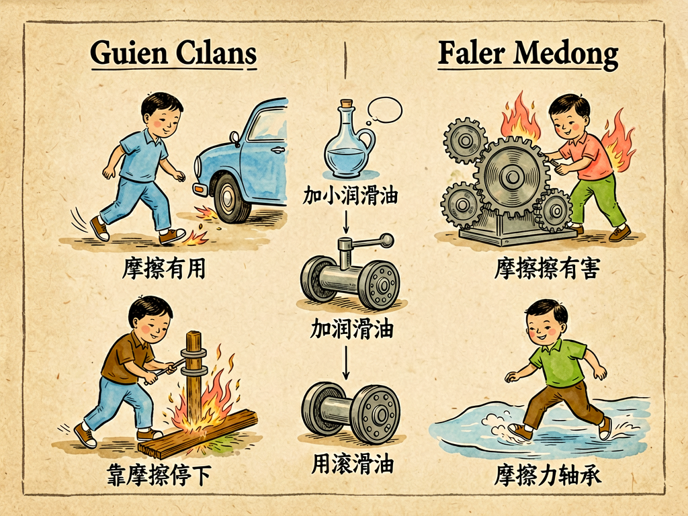

## 第十三章 摩擦

---

### 📍 本章导航
**核心主题**：我们几乎每天都在跟摩擦打交道：鞋底磨平了、自行车骑久了要给链条上油、冬天搓手取暖、刹车的时候刹车片和轮子摩擦发出刺耳的声音、在冰面上走路容易滑倒。我们总觉得摩擦是个"坏东西"——它让机器磨损，让我们多费力气，浪费能量，产生噪音和热量。但是你有没有想过，如果这个世界上完全没有摩擦，会是什么样子？你站不起来，脚一蹬就会滑出去，永远停不下来；你拿不住杯子，拿不住笔，什么东西都抓不住；你写不了字，笔尖在纸上打滑，一点痕迹都留不下；汽车轮子转得飞快，但是原地打滑，既走不了也刹不住；钉子钉进墙里自己会滑出来，螺丝拧不住，绳子打了结一拉就开，连衣服上的线都会散掉，整个世界会变得一团糟。原来摩擦不只是我们的敌人，它更是我们离不开的朋友——我们走路、抓东西、刹车、点火、盖房子、用工具，没有一样离得开摩擦。摩擦是最典型的"双刃剑"：它既是阻碍运动、造成损耗的罪魁祸首，又是我们能控制运动、站稳脚跟、建立秩序的根本保障。这一章我们就来讲讲，摩擦到底是什么，它从哪里来，我们怎么在需要它的时候增大它，不需要它的时候减小它，以及这个看似简单的物理现象里藏着什么样的深刻道理。  
**你将发现**：
- 你可能觉得摩擦是因为表面粗糙——木头、石头、金属表面摸起来坑坑洼洼，两个表面碰在一起，凸凹互相卡住，动起来就有阻力。这确实是原因之一，但不是全部。就算你把两个表面磨得绝对光滑，摩擦不但不会消失，反而会变大——因为两个表面的分子离得太近，分子之间的吸引力会把它们粘在一起，更难滑动。摩擦是三个因素共同作用的结果：表面微观凹凸的机械咬合、接触点分子之间的黏附力、硬的凸起犁进软材料里的阻力。只要两个物体接触、有压力、有相对运动或者相对运动的趋势，摩擦就一定会存在，不可能完全消灭。
- 摩擦分好几种，脾气完全不一样：
  - **静摩擦**：这是最"懂事"的摩擦。你推一个重箱子，一开始没推动，就是静摩擦在帮你"顶住"——你用多大力推，静摩擦就有多大，方向和你推的方向相反，直到你用的力超过最大静摩擦力，箱子才会动起来。我们走路、跑步、拿东西、拧瓶盖、爬树、汽车起步，靠的全都是静摩擦：脚往后蹬地面，地面给你一个向前的静摩擦力，你才能往前走；你拿杯子，手和杯子之间的静摩擦力托住了杯子的重量，才不会掉下去。静摩擦是我们的好朋友，绝大多数时候我们需要静摩擦越大越好。
  - **滑动摩擦**：箱子滑动起来之后，你还是得用力推着它才会走，这时候阻碍它的就是滑动摩擦。滑动摩擦会把动能变成热量——冬天搓手取暖就是这个道理，钻木取火也是靠木头之间高速滑动摩擦生热点燃干草；刹车的时候，刹车片和刹车盘剧烈摩擦，把汽车的动能变成热，车才能停下来，急刹车的时候刹车片甚至能烧红。滑动摩擦会磨损零件，浪费能量，机器里我们最不想要的就是滑动摩擦。
  - **滚动摩擦**：你有没有想过，为什么轮子是人类最伟大的发明之一？因为滚动的时候，两个接触表面之间几乎没有滑动，滚动摩擦力比滑动摩擦力小几十倍。拖一个大箱子很费劲，但是给箱子底下垫几个圆棍子，推起来就轻松多了；轮子、轴承、滚珠，都是把滑动摩擦变成滚动摩擦来省力。但是滚动摩擦不是零——轮胎压在地上会变形，轮子和地面接触的地方总会有一点形变阻力，所以骑自行车不蹬还是会慢慢停下来。
  - **流体摩擦**：物体在空气或者水里运动的时候受到的阻力，也是摩擦的一种，叫流体摩擦。你跑步的时候感觉到风迎面吹过来，游泳的时候水在拖你的后腿，子弹飞的时候空气会让它减速，飞机要花很多能量克服空气阻力，轮船要克服水的阻力——这些都是流体摩擦。速度越快，流体摩擦越大，和速度平方甚至三次方成正比，所以高铁和飞机都要做成流线型，就是为了减小空气阻力。
- 人类和摩擦打了几十万年交道，核心智慧就是八个字：**因地制宜，增减得当**。
  - **需要大摩擦的时候，我们就想尽办法增大摩擦**：鞋底做上花纹，轮胎刻上沟槽，冬天冰雪路面给轮胎挂防滑链，刹车片用摩擦系数特别大的材料做，运动员手上抹镁粉，防滑垫、防滑手套、砂纸、魔术贴、路面上的减速带，全都是为了增大摩擦，让我们能抓得住、站得稳、刹得住。
  - **需要小摩擦的时候，我们就想尽办法减小摩擦**：给自行车链条上机油，给轴承里加黄油，用气垫把船托起来离开水面（气垫船），用磁场把火车托起来离开轨道（磁悬浮列车），把表面抛得特别光滑，用聚四氟乙烯（特氟龙，就是不粘锅涂层）这种摩擦特别小的材料，还有最新的"超滑"技术，两个表面之间摩擦力几乎为零。
- 摩擦不只是在我们日常生活里起作用，从原始人到现代科技，摩擦一直推动着文明，也塑造着地球：
  - 人类第一次掌握火，就是靠**钻木取火**——一根木棒在木头上快速转动，摩擦生热，温度升高到木头的燃点，就点燃了火。火让人类吃上了熟食，吓退了野兽，照亮了黑夜，是人类文明最重要的起点之一，而这一切都始于摩擦。
  - 现代工业里有**摩擦焊接**：两个金属件高速相对旋转，靠摩擦生热把接触面熔化，然后压在一起，就焊牢了，不用焊条，焊得比原来的材料还结实，连不同的金属都能焊在一起。
  - 中国科学院外籍院士王中林发明了**摩擦纳米发电机**，能利用两个材料接触分离产生的摩擦电，把微小的机械能（走路、心跳、海浪、雨滴、甚至风吹树叶的振动）变成电，未来可以给物联网传感器、可穿戴设备供电，收集环境里浪费的能量。
  - 自然界早就把摩擦玩明白了：壁虎能在光滑的玻璃和天花板上爬，不是靠吸盘，也不是靠胶水，是靠它脚掌上几百万根极其细小的刚毛，每根刚毛和表面之间的分子范德华力加起来，就能牢牢把壁虎粘住，想抬起来的时候只要换个角度，力就消失了，科学家模仿这个做了"壁虎胶带"，能粘住几十倍于自身重量的东西，还不会留残胶。我们的膝关节、髋关节更神奇：关节软骨和关节液配合起来，摩擦系数比冰面还小，能在几十年里每天几万次弯曲，承受几十上百公斤的重量，几乎不磨损，比任何人造轴承都好用，现在的人工关节就是在模仿这种超滑结构。
  - 摩擦甚至能引发地震：地球的板块一直在缓慢移动，但是板块边界的岩石之间有巨大的静摩擦力，卡住动不了，应力就一点点积累起来，积累了几十年几百年，应力大到超过摩擦力的时候，岩石突然滑动，就释放出巨大的能量，这就是地震。
- 这一章最深刻的洞见：摩擦是一个最好的例子，告诉我们世界上的事情从来不是非黑即白、非好即坏的。我们总喜欢把事物分成"好的"和"坏的"，觉得摩擦浪费能量、磨损机器，就是坏东西，要彻底消灭；但是如果真的没有摩擦，整个世界都没法运转。真正的工程智慧，也从来不是"消灭所有不好的东西"，而是理解每一种力、每一种现象的规律，知道在什么地方需要它大一点，什么地方需要它小一点，把它放在合适的位置上，让它为我们服务。不止物理世界是这样，人和人之间的"摩擦"、生活里的"阻力"也是一样：完全没有摩擦、一帆风顺的生活其实很危险，你会抓不住任何东西，停不下来，也立不住；但是摩擦太大、阻力太多，又会寸步难行，磨损自己。最好的状态，从来不是没有阻力，而是有合适的阻力：该稳定的时候稳得住，该前进的时候走得动，该停下的时候停得下。

**阅读建议**：找两本厚一点的书，把书页一页一页互相交叉叠起来，叠完之后你抓住两本书的书脊往两边拉，你会发现哪怕是两个大力士都拉不开——这就是摩擦力的威力，每一页之间都有静摩擦，几百页加起来，摩擦力大得惊人。这个实验简单又震撼，一定要试试。

---

### 🖋️ 经典原文

你有没有过在冰面上走路的经历？脚底下滑溜溜的，每一步都小心翼翼，一不小心就会摔个屁股蹲；反过来，在粗糙的水泥地上走路，你从来不会担心滑倒，想跑就跑想停就停。这一滑一稳之间，起作用的就是摩擦。
我们平时好像很讨厌摩擦：鞋底磨穿了，是摩擦磨的；自行车骑久了，链条咯吱响，要上点润滑油，就是为了减小摩擦；机器用久了零件会磨损，要经常保养换件，也是摩擦害的；我们推一个重箱子，费很大力气才能推动，就是因为有摩擦在拖着后腿。摩擦看起来简直就是个讨厌鬼，专门给我们添麻烦，浪费我们的力气，损坏我们的东西。
但是我要告诉你：如果这世界上真的没有摩擦了，那才是真正的噩梦。
早上你想起床，手一撑被子，直接滑了下去，根本使不上劲；你脚往地上一踩，立刻滑倒，根本站不起来；你好不容易爬到餐桌边，想拿杯子，手一碰杯子就滑出去，摔在地上；你想抓筷子、抓面包，什么都抓不住，手指碰到什么什么就滑开；你想出个门，一迈脚就往前滑，永远停不下来，除非撞到什么东西；马路上汽车轮子转得飞快，但是全都在原地打滑，既走不了，踩刹车也没用，根本停不下来；墙上的钉子自己滑出来，家具散架，绳子打了结一拉就开，衣服上的线一根根散掉，连山上的石头都站不住，哗啦啦往下滑……没有摩擦的世界，根本不是一个省力的天堂，是一个混乱到根本无法生存的地狱。
原来摩擦不只是我们的敌人，它首先是我们离不开的朋友。
我们能走路，全靠脚和地面之间的静摩擦：你脚往后蹬，给地面一个向后的力，地面就给你一个向前的静摩擦力，推着你往前走。冰面太滑，静摩擦力太小，你脚往后蹬，不是把你往前推，而是脚自己往后滑，所以走不动。
我们能拿住东西，全靠手和物体之间的静摩擦：你拿起杯子，杯子的重力往下掉，手和杯子之间的静摩擦力往上托，刚好平衡重力，杯子才不会掉。手太滑或者手上沾了油，摩擦力太小，杯子就容易掉。
汽车能起步、能刹车，全靠轮胎和地面之间的摩擦：发动机转带动轮子转，轮子给地面一个向后的力，地面给轮子向前的静摩擦力，车才能往前跑；刹车的时候，刹车片抱紧轮子，滑动摩擦让轮子减速，轮胎和地面的摩擦让车停下来。要是路面结冰，摩擦力不够，踩油门车轮打滑走不了，踩刹车也刹不住，就会出车祸。
甚至我们能写字，也是靠摩擦：铅笔芯在纸上划过，摩擦把铅笔芯的石墨屑磨下来，留在纸的纤维缝隙里，就留下了字迹；圆珠笔的小钢珠在纸上滚动，把笔油管里的油墨带出来，也是摩擦让钢珠转起来。如果纸特别光滑，一点摩擦都没有，笔尖打滑，你什么字都写不出来。
摩擦这么重要，它到底是怎么来的？
你可能会说，这还不简单，物体表面坑坑洼洼的，两个表面碰在一起，凸出来的地方卡在一起，动起来就要把这些凸起来的地方磨断或者推开，所以就有了阻力。这确实是摩擦的一个来源，但是不是全部。科学家做过实验，把两个金属表面磨得特别特别光滑，光滑到几乎没有凹凸了，结果发现摩擦不但没有消失，反而更大了——这是因为两个表面太近了，表面的分子之间产生了吸引力，把两个表面粘在了一起，要滑动还得先把粘在一起的分子拉开，这就产生了更大的摩擦。
所以摩擦是这么来的：第一是表面凹凸不平的机械咬合，第二是接触点分子之间的黏附力，第三是硬材料的小凸起犁进软材料里的阻力。三个因素加在一起，只要两个物体接触、互相有压力、有相对滑动或者要滑动的趋势，摩擦就一定会出现，谁也没法让摩擦完全消失。
我们平时遇到的摩擦，主要有四种，脾气各不一样。
第一种叫静摩擦，它最有意思，最"通情达理"。你推一个箱子，一开始没推动，这时候静摩擦就站出来，你用多大力推，它就用多大的力往相反方向顶，帮你把箱子顶住，不让它动；你慢慢加大力气，静摩擦也跟着变大，直到你的力气超过最大静摩擦力的时候，它顶不住了，箱子才开始滑动。静摩擦是我们最好的朋友，走路、拿东西、爬树、拧瓶盖、开车起步，全靠静摩擦帮忙。
第二种叫滑动摩擦，就是箱子已经滑动起来之后，阻碍它运动的力。滑动摩擦力一般比最大静摩擦力小一点，所以箱子一旦推动了，反而比刚开始推的时候省力一点。滑动摩擦的一个大本事，就是会把动能变成热量。你冬天冷的时候搓手，搓一会儿手就热了，就是滑动摩擦生热；你拿锤子反复敲一根铁丝，敲的地方会发烫，也是能量变成热；钻木取火的时候，木棒在木板上快速转动，滑动摩擦生热，温度越来越高，最后把干草点着，原始人就是靠这个掌握了火。
第三种叫滚动摩擦，这就是轮子为什么伟大的秘密。你拖一个重箱子在地上滑，滑动摩擦力很大，很费劲；但是你在箱子底下垫几根圆木棍，让箱子在棍子上滚，就会省力好多倍——因为滚动的时候，两个表面几乎不怎么滑动，只有一点点材料形变带来的阻力，滚动摩擦力只有滑动摩擦的几十分之一甚至更小。轮子、滚珠轴承、车轮，本质上都是把滑动摩擦变成滚动摩擦，帮我们省力气。
第四种叫流体摩擦，就是物体在空气或者水这些流体里运动的时候受到的阻力。你跑步的时候感觉到风往脸上吹，游泳的时候水拖着你不让你往前走，都是流体摩擦。流体摩擦有个特点：速度越快，阻力越大，而且是和速度的平方成正比——速度变成两倍，阻力变成四倍，所以汽车开到120公里的时候，一多半的油都用来克服空气阻力了。飞机、高铁、子弹头火车都做成流线型，就是为了减小空气阻力；轮船的船头做成尖的，也是为了减小水的阻力。
人和摩擦打了几十万年交道，慢慢摸透了它的脾气，总结出了八字方针：需要的时候就增大它，不需要的时候就减小它，因地制宜，恰到好处。
什么时候需要增大摩擦呢？
当然是需要站稳、抓住、刹住的时候。鞋底要做上深深的花纹，轮胎要刻上沟槽，就是为了让接触面粗糙一点，增大摩擦；冬天雪地上开车，轮胎要挂防滑链，也是为了增大摩擦；运动员上单杠之前，手上要抹点镁粉，吸掉汗，增大手和杠之间的摩擦，防止打滑；刹车片要用特别耐磨、摩擦系数特别大的材料做，才能把快速转动的轮子刹住；砂纸、砂轮就是要摩擦力大，才能把东西磨平磨亮；家里的防滑垫、防滑拖鞋，都是为了增大摩擦，防止滑倒。
什么时候需要减小摩擦呢？
当然是需要省力、减少磨损的时候。自行车链条要上润滑油，机油会填满链条表面的小坑，让金属之间不直接接触，摩擦就变小了；机械轴承里有很多小钢珠，把轴和轴承之间的滑动摩擦变成滚动摩擦，就灵活多了；气垫船往下吹气，在船底和水面之间形成一层空气垫，船离开水面，水的阻力就几乎没了，能开得特别快；磁悬浮列车靠磁场把车厢托起来，离开轨道几厘米，轮子和轨道之间的摩擦完全消失，能开到几百公里的时速；不粘锅上涂的特氟龙（聚四氟乙烯）是已知摩擦系数最小的固体材料之一，所以炒菜不粘；现在科学家还在研究"超滑"技术，在特定材料和条件下，摩擦系数能降到几乎为零，如果能用在发动机和轴承里，能省好多能源，零件寿命也能长好多倍。
摩擦不止在我们身边这点小事里起作用，它还改写了人类文明史，也塑造着整个地球。
原始人最早学会用火，就是钻木取火，靠的就是摩擦生热。有了火，人类才能吃熟食，获得更多营养，大脑才能进化；有了火，才能吓退野兽，照亮黑夜，烧制陶器，冶炼金属——人类文明的第一道曙光，就是摩擦给我们点着的。
到了现代，我们还发明了摩擦焊接：让两个要焊在一起的金属件高速相对旋转，接触面摩擦生热，把金属烧得软化，然后用力一压，就牢牢焊在一起了，比传统焊接还结实，连铜和铝这种本来焊不到一起的金属都能焊。更神奇的是摩擦纳米发电机，靠两种材料接触摩擦产生的静电，就能把走路、心跳、海浪、雨滴这些很小的机械能变成电，未来可以给手表、传感器这些小设备供电，不用换电池。
自然界里早就有利用摩擦的高手。壁虎能在光滑的玻璃、甚至天花板上爬来爬去，不会掉下来，不是靠吸盘，也不是靠胶水，而是靠它脚掌上几百万根极细的刚毛，每根刚毛末端又分成几百根更细的绒毛，和物体表面的距离近到分子之间产生范德华力——这种力极其微小，但是几百万根加起来，就能稳稳托住壁虎的重量，想抬脚的时候只要把刚毛换个角度，力就消失了，一点都不粘。科学家模仿壁虎刚毛，做了仿生壁虎胶带，能粘住很重的东西，还能反复用不留残胶，未来甚至能让宇航员在太空舱外爬着走。
更厉害的是我们自己的关节。我们的膝关节每天要弯几万次，承受几十公斤的重量，能用七八十年，几乎不磨损——因为关节面上有一层光滑的软骨，关节腔里还有滑液，摩擦系数比冰面还小，润滑性能比任何人造润滑油都好，这是自然界花了几亿年进化出来的超滑系统，现在科学家做人工关节，就在模仿关节软骨的结构。
摩擦甚至能引发地震。地球表面的板块一直在缓慢移动，但是板块和板块接触的地方有巨大的摩擦力，卡在那里动不了，板块移动的能量就变成应力，一点点积累起来，积累几十年、几百年，应力大到超过了最大静摩擦力的时候，岩层突然滑动，释放出巨大的能量，山崩地裂，这就是地震。
讲了这么多，你会发现摩擦这个东西，你既不能简单说它好，也不能简单说它坏。没有它，我们活不了；它太大了，我们又寸步难行。它会磨损机器，浪费能源，但是它也帮我们站稳，帮我们抓住东西，帮我们停下来，帮我们生火，帮我们盖房子造工具。
其实不止物理世界有摩擦，我们的生活里、人和人之间也有"摩擦"。我们总希望生活一帆风顺，一点阻力都没有，一点矛盾都没有，但是你想想，如果真的做什么都没有一点阻力，什么都顺着你的意，你会变成什么样？你会握不住任何东西，停不下来，也立不住，一点点小挫折就能让你滑出去十万八千里。当然反过来，如果摩擦太大，到处都是阻碍，干什么都费劲，那也会把人磨得筋疲力尽，寸步难行。
真正的智慧，不管是对工程师还是对我们每个人，都不是去幻想一个没有摩擦、没有阻力的完美世界，也不是被摩擦吓住寸步难行，而是摸透它的脾气，知道在什么地方需要多一点摩擦让自己站稳，在什么地方需要少一点摩擦轻装前进，把摩擦控制在恰到好处的程度，让它帮你而不是拖你后腿。
这就是摩擦告诉我们的道理。下一章，我们讲热的旅行。

---

> 📜 **科学史话：从达芬奇的笔记到超滑技术——人类认识摩擦的五百年**
>
> 你可能不知道，第一个系统研究摩擦的人不是什么力学家，而是大画家达芬奇。1493年，达芬奇在他的笔记本里就研究了摩擦，他发现：摩擦力的大小和物体的重量成正比，和接触面积大小没关系；而且他还算出了摩擦系数大约是1/4，也就是摩擦力是压力的四分之一。这些结论完全正确，但是他的笔记藏了起来，没发表，过了将近两百年，1699年法国工程师阿蒙顿才重新发现了这些规律，后来又被库仑（就是发现库仑定律那个库仑）完善，就是我们今天学的摩擦定律。
>
> 人类利用摩擦的历史比科学研究长得多。旧石器时代人类就学会了钻木取火，考古发现最早的钻木取火工具已经有几十万年历史——就是一根硬木棒，在一块软木板的小坑里快速转动，磨出来的木炭粉温度越来越高，落到旁边的干草上一吹就着。这是人类第一次控制一种自然力，直接把机械能变成热能，恩格斯说"摩擦生火第一次使人支配了一种自然力，从而最终把人同动物界分开"。
>
> 轮子的发明是人类利用摩擦的另一个里程碑。公元前3500年左右，美索不达米亚平原的苏美尔人发明了轮子，最早的轮子是用来做陶器的陶轮，后来才装到车上。轮子的伟大之处，根本不是什么"圆的东西能滚"，而是它把拖东西时的滑动摩擦变成了滚动摩擦，一下子把阻力减小了几十倍，人类第一次能轻松搬运很重的东西，运输效率发生了质的飞跃。
>
> 工业革命之后，机器越来越复杂，摩擦的问题越来越重要——蒸汽机、火车、机床里有无数个相对运动的零件，摩擦不仅浪费能量，还会让零件很快磨损，机器用不了多久就坏了。1850年代，人们开始系统研究润滑油，矿物油取代了动植物油，润滑效果好还便宜；1880年代，滚珠轴承开始普及，把滑动摩擦变成滚动摩擦，机械效率大大提高；1900年代，又发明了滚针轴承、含油轴承，到今天，摩擦学已经成了一门专门的学问，全世界每年因为摩擦和磨损浪费的能源，占总能源的三分之一以上，摩擦学每进步一点，就能给全世界省下来巨量的能源和金钱。
>
> 1990年代，科学家发现了"超滑"现象：在特定条件下（比如两个干净的云母表面，或者石墨烯层之间），摩擦系数能降到0.001以下，几乎为零，几乎没有磨损。如果这种技术能大规模应用在发动机、轴承、齿轮里，能让机械效率提高一倍，零件寿命长几十倍，这可能是未来几十年工业里最重要的技术突破之一。
>
> 从原始人钻木取火，到达芬奇研究摩擦定律，到今天的超滑和摩擦纳米发电机，人类和摩擦打交道的历史，就是一部从被动承受到主动控制的历史。

---

> 🔬 **科学更新：摩擦纳米发电机、超滑材料与仿生摩擦——摩擦研究的新前沿**
>
> 摩擦这个古老的现象，今天还在不断给我们带来新的惊喜：
>
> **摩擦纳米发电机（TENG）**：2012年，中国科学院外籍院士王中林团队发明了摩擦纳米发电机，利用两种不同材料接触摩擦时产生的表面静电，配合电极就能把微小的机械能转化为电能。它特别擅长收集低频、无规律的微小能量——走路时鞋底和地面的摩擦、衣服的摩擦、心跳、呼吸、风吹动窗帘、海浪拍岸、雨滴落下，这些本来完全浪费掉的能量，都能被TENG收集起来，变成电。未来物联网里几万亿个传感器，不用换电池，靠收集环境里的摩擦能就能一直工作；甚至可以做自供电的智能手表、地板，人走过去就发电，给路灯供电。
>
> **超滑材料新突破**：最近几年，科学家发现二维材料（比如石墨烯、六方氮化硼、二硫化钼）层和层之间的摩擦力特别小，很容易实现超滑状态。清华大学的团队在2022年研发出了宏观尺度的超滑涂层，摩擦系数低到0.0001，几乎没有磨损，如果用在汽车发动机里，能让燃油效率提高10%以上，还能让发动机寿命长好几倍。
>
> **仿生摩擦材料**：模仿壁虎刚毛的干粘合材料已经做出来了，能在太空真空环境里用，粘得牢还能反复揭下来；模仿沙鱼蜥蜴鳞片的材料，能在沙里高速运动，摩擦特别小；模仿猪笼草滑面的超滑表面，液体在上面根本留不住，能防污、防结冰、抗菌，用在飞机机翼上就不会结冰，用在输液管里就不会残留药液。
>
> **地震摩擦研究**：现在科学家在实验室里模拟断层岩石的摩擦，研究为什么有些断层稳滑，有些会突然粘滑产生地震，甚至能在实验室里重现地震的成核过程，未来有可能更准确地预测地震。
>
> 一个看起来最简单、最常见的摩擦现象，到今天还有无数新东西等着我们发现，能催生出改变世界的新技术。

---

> 🧪 **动手试一试：筷子提米+拉不开的书——体验摩擦力的威力**
>
> 实验一：拉不开的两本书（最震撼的摩擦实验）
> 准备材料：两本厚一点的书（字典或者厚杂志最好）。
> 步骤：
> 1. 把两本书打开，一页一页互相交叉叠起来，就像洗牌一样，把书页交叠在一起，叠得越整齐、越满越好；
> 2. 叠完之后，把书压一压，让书页贴紧；
> 3. 现在你和朋友一人抓着一本书的书脊，往两边使劲拉——你们会发现，哪怕两个人用尽全力，也根本拉不开这两本书！
> 原理：两本书每一页和相邻的页之间都有静摩擦力，几百页交叠起来，总摩擦力大得惊人，能达到几百公斤，甚至能吊起一辆小轿车。
>
> 实验二：筷子提米
> 准备材料：一个玻璃杯（或者矿泉水瓶剪掉上半部分），一根竹筷子，大米（普通大米就行，不要煮）。
> 步骤：
> 1. 把杯子里装满大米，装得满一点，墩一墩，让米压实；
> 2. 把筷子从米中间插进去，一直插到底，再把筷子周围的米用手使劲压一压，压得越实越好；
> 3. 现在你抓住筷子往上提——神奇的事情发生了：筷子把装满米的整个杯子都提起来了！
> 原理：你把米压实之后，米和筷子之间、米和米之间、米和杯子之间都被挤得紧紧的，静摩擦力非常大，完全能托住杯子和米的重量，所以一提筷子，整个杯子就跟着起来了。
>
> 实验三：冰为什么滑？
> 拿一块冰，用手指轻轻摸，是不是滑溜溜的？这是因为冰在压力下会融化一点点，表面有一层极薄的水膜，起到了润滑作用，摩擦特别小。你可以试试在玻璃上洒一点水，踩上去是不是也变滑了？冬天路面结冰撒盐，就是为了降低冰的熔点，让冰融化成水，再冻成冰的时候会变粗糙，增大摩擦，防止滑倒。

---

### 💬 读后思考与讨论

1. 很多人觉得摩擦是"坏东西"，应该完全消灭它，读完这一章，你觉得如果真的有零摩擦的世界，会是什么样？你能想象出来吗？
2. 生活里哪些地方我们需要增大摩擦，哪些地方需要减小摩擦？各举三个例子，说说人们是怎么做的。
3. 人类文明的很多突破都和摩擦有关：钻木取火、轮子、轴承、润滑油，你觉得下一个和摩擦有关的重要发明会是什么？能解决什么问题？
4. 摩擦这个物理现象很像生活里的"阻力"和"矛盾"，你觉得完全没有阻力的生活是好事吗？我们应该怎么对待生活里的"摩擦"？
5. 为什么滚动摩擦比滑动摩擦小这么多？你能想到哪些东西是利用滚动摩擦省力的？

### 🔗 关联阅读
- 第三部第十五章：《热的旅行》→ 摩擦生热是热的重要来源之一，热怎么在物体之间传递
- 第三部第十四章：《机械的巧思》（下一章之后）→ 机械里到处都在管理摩擦——轴承、齿轮、滑轮
- 第二部第十章：《细菌的形态》→ 细菌的鞭毛就是自然界最完美的纳米轴承，摩擦极小，效率接近100%
- 跨章节思考：从细菌鞭毛到人体关节，从轮子到磁悬浮，自然界和人类工程学都在做同一件事：在需要稳定的地方用好摩擦，在需要运动的地方减小摩擦——这是所有运动系统的核心智慧。
