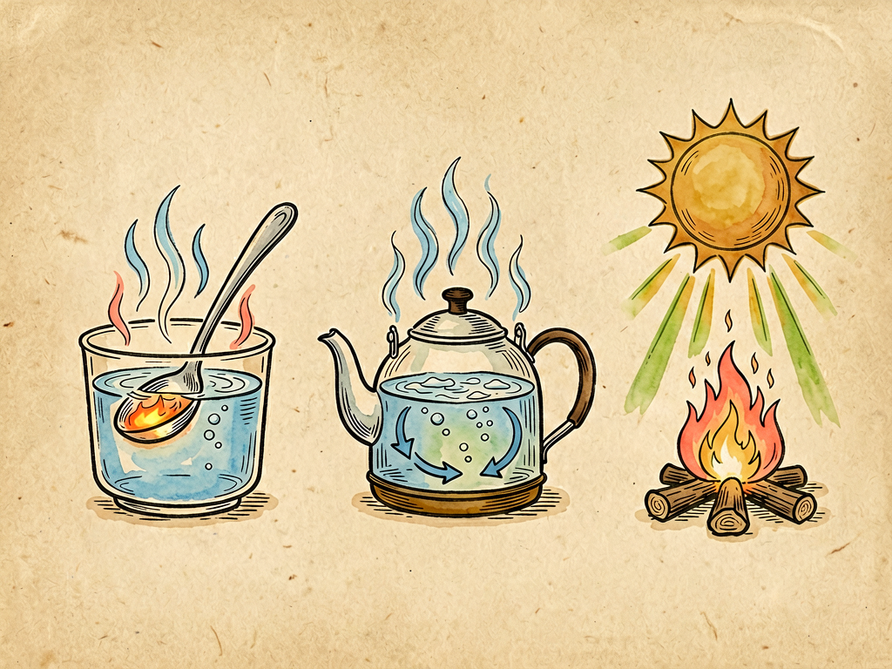

## 第十四章 热的旅行

---

### 📍 本章导航
**核心主题**：我们每天都在和热打交道：喝热水觉得烫，吹空调觉得凉，做饭要开火，冬天要穿厚衣服，太阳晒在身上暖烘烘的，电脑用久了会发热，汽车发动机要加水冷却。热看不见摸不着（哦不对，能感觉到），但是它永远在旅行——从热的地方跑到冷的地方，一刻也不停：一杯热水放在桌上，过一会儿就凉了，热跑到空气里去了；把锅放在火上，锅底热了，慢慢锅把也热了，热跑到锅把上了；太阳的热穿过1.5亿公里的真空，跑到地球上来，晒暖了大地，晒热了空气，才有了风、雨、生命。热的旅行是这个世界最基本的规律之一，我们的冷暖、做饭、取暖、开车、发电，甚至地球的气候、生命的运转，全都和热的旅行有关。人类文明的历史，很大程度上就是一部学习怎么驾驭热的旅行的历史：我们学会了生火取暖做饭，学会了做衣服盖房子保暖，学会了用蒸汽机把热变成动力，学会了用冰箱空调把热"搬"走，学会了发电，现在还要应对全球变暖——因为人类活动改变了地球散热的速度，热在地球上积得太多了。这一章我们就跟着这位永远在旅行的"热先生"，看看它是怎么旅行的，走哪几条路，我们怎么利用它，又怎么和它相处。  
**你将发现**：
- 很长时间里人们以为热是一种没有重量的流体，叫"热质"，热的东西热质多，冷的东西热质少，热从热的地方流到冷的地方就像水从高处流到低处。后来科学家焦耳做了大量实验，证明热不是什么流体，而是能量的一种形式——它是物体里分子原子无规则运动的动能，分子动得越快，物体就越热。机械能、电能、化学能都能变成热，热也能变成其他形式的能量，能量永远守恒，不会凭空产生也不会凭空消失。
- 热永远只会从温度高的地方跑到温度低的地方，绝不会自己从冷的地方跑到热的地方，就像水永远只会从高处往低处流，不会自己往高处走——这是热力学最基本的规律。只要有温度差，热就一定会旅行，直到两边温度一样，热才会停止宏观上的流动。
- 热出门旅行，有三条路可以走，通常三条路一起走：
  - **第一条路叫传导**：热从物体温度高的部分，沿着物体传到温度低的部分，一个分子一个分子接力传过去，就像排队传东西一样。不同材料传导热的本事天差地别：金属是热的良导体，导热特别快，所以铁锅能很快把火的热传给菜，但是冬天摸铁会觉得特别冰——因为它很快把你手上的热带走了；木头、塑料、空气、棉花、羽绒都是热的不良导体，导热特别慢，所以锅把要用塑料或者木头做，不会烫手；羽绒服那么保暖，不是因为羽绒会发热，是因为蓬松的羽绒困住了大量静止的空气，空气导热特别慢，身体的热跑不出去，你就觉得暖了。因纽特人用雪搭雪屋，雪里面有很多空气，也是热的不良导体，外面零下几十度，雪屋里点个油灯就能保持零度以上，能住人。
  - **第二条路叫对流**：这是液体和气体专属的旅行方式。空气或者水被加热之后，会膨胀变轻，往上浮，周围冷的、重的空气/水就流过来填补，流过来的冷空气/水又被加热，再往上浮，这样循环起来，就形成了对流，热就随着流动的液体/气体跑到远处去了。烧开水的时候，水在锅里上下翻滚，就是对流；冬天暖气放在窗户下面，热空气往上走，冷空气从窗户缝里进来往下沉，整个房间就慢慢暖起来了；海边白天吹海风晚上吹陆风，地球上的大气环流、洋流，全都是对流造成的。对流是液体和气体里传热最快的方式。
  - **第三条路叫辐射**：传导和对流都需要介质，要靠分子或者物质才能传热，但是辐射不需要任何介质，它靠电磁波传热，在真空中也能走。太阳的热就是靠辐射穿过1.5亿公里的真空来到地球的；我们站在火炉旁边觉得烤得慌，主要也是热辐射，不是对流，也不是传导；所有有温度的物体都在向外辐射红外线，温度越高，辐射越强，人体也在不停向外辐射红外热，红外夜视仪就是靠接收这个热辐射在黑夜里看见东西的。夏天穿白色衣服比黑色衣服凉快，因为白色反射所有光，黑色吸收所有光，吸收的辐射多，就更热。
- 我们平时说"保暖""取暖"，其实不是制造热，而是减慢热跑掉的速度——我们自己的身体每时每刻都在新陈代谢产生热，衣服、房子、被子都是热的不良导体，把热困在里面，不让它太快跑出去，你就觉得暖了。反过来"散热""降温"，就是想办法让热快点跑出去：电脑CPU上的散热片是金属做的，把热带出来，风扇吹着空气对流，把热带走；汽车发动机用水套把热带出来，车头的散热器（水箱）让风吹着把热散到空气里。
- 人类最伟大的发明之一，就是学会了**在热的旅行路上截下一部分，让它帮我们做功**，这就是热机。蒸汽机、内燃机（汽车发动机）、汽轮机、喷气式发动机，本质上都是热机：烧煤或者烧油，把水烧成高压蒸汽，或者让燃油在气缸里爆炸产生高温高压气体，让热从高温的燃烧室往低温的空气里跑，在这个流动的过程中，推动活塞、轮子、涡轮转动，把热变成机械能，拉火车、开汽车、发电、开飞机。工业革命就是从蒸汽机开始的，人类第一次拥有了比人力畜力强大无数倍的动力，整个世界都被改变了。但是热机永远不可能把所有热都变成功，一定会有一部分热浪费掉，排到冷的环境里，最好的热机效率也只有百分之五六十，这是热力学第二定律规定的，谁也突破不了。
- 冰箱和空调看起来能把热从冷的地方搬到热的地方（比如冰箱里面是冷的，把热搬到外面房间里），好像违反了热从高温往低温流的规律，其实没有——它是靠压缩机做功，用电能驱动制冷剂蒸发、压缩、冷凝，把热从冷的地方"泵"到热的地方去，就像水泵能把水从低处抽到高处，但是要耗电。这种机器叫热泵，冬天的空调制热其实也是热泵，比直接用电加热省电好几倍。
- 整个地球就是一个巨大的热平衡系统：太阳每天给地球辐射来大量的热，地球吸收之后，又以红外辐射的方式把热辐射到外太空去，进来的热和出去的热差不多平衡，地球的平均温度才能保持在15度左右，适合生命生存。但是近几百年人类烧煤烧油，把地下埋了几亿年的碳烧出来，排了大量二氧化碳等温室气体——这些气体不阻挡太阳的短波辐射进来，但是会吸收地球向外辐射的长波红外线，不让热散出去，就像给地球盖了一层厚被子，进来的热多出去的热少，地球的平均温度就会升高，这就是温室效应和全球变暖。
- 这一章最深刻的洞见：热的旅行不只是一个物理现象，它还和时间的方向有关。你看，一杯热水放着会自己变凉，但是一杯凉水不会自己变热；打碎的杯子不会自己拼回去，房间不收拾会越来越乱——这些不可逆的过程，背后都是热力学第二定律（熵增定律）：孤立系统的混乱度（熵）只会增加，不会减少，热只会从高温流向低温，不会反过来。这就是时间的箭头：过去和未来是不一样的，世界永远在从有序走向无序，从温差走向平衡。宇宙最终的命运，可能就是所有地方温度都一样，再也没有热可以流动，没有任何运动和生命，这就是"热寂说"。但是生命恰恰是逆熵的过程：我们吃进有序的食物，排出无序的热量，维持自己身体的有序结构；人类文明也是一样，我们建造城市、发明技术，在局部创造秩序，代价是整个宇宙的熵增加得更快。理解了热的旅行，你就理解了这个世界最根本的运转规律之一：所有的运动、所有的生命、所有的文明，都建立在热的流动之上，都在和熵增对抗。

**阅读建议**：冬天从室外走进暖和的屋子，摸一下房间里的铁门和木门，铁门摸起来是不是比木门冰得多？其实它们温度是一样的，都和室温一样，为什么铁摸起来更冰？因为铁导热快，很快把你手上的热带走了，木头导热慢，热带走得慢，所以你感觉铁更凉。这是一个特别好的例子，能让你立刻体会到什么是热传导。

---

### 🖋️ 经典原文

热是一位永远闲不住的旅行家，它在这个世界上到处跑，一刻也不肯停留。
你把一杯热水放在桌子上，过不了半个钟头，它就变温了，再过一会儿，就凉得和室温一样了——热从热水里跑出来，跑到杯子上，跑到空气里，跑到桌子里，到处旅行去了。你把一口铁锅放在火上，不一会儿锅底就烧红了，再过一会儿，连锅把都烫手，热从锅底一路跑到锅把上。太阳在一亿五千万公里外，中间隔着空荡荡的宇宙，什么东西都没有，但是太阳的热照样能跑到地球上来，晒得你暖烘烘的，能让粮食生长，能让江河湖海蒸发成云，能让整个地球充满生机。
热永远在旅行，而且它只往一个方向走：从温度高的地方，往温度低的地方走，就像水永远从高处往低处流一样。只要哪里有温度差，哪里就有热在旅行，直到两边温度一样了，它才会停下脚步。
热出门旅行，有三条不同的路，各走各的，经常三条路一起走。
第一条路，是在固体里走的，叫传导。
你把金属勺子放进热汤里，没一会儿勺柄就烫得拿不住了，热就是沿着勺子，一勺传一勺，从分子传到分子，从热的那头传到冷的这头，就像同学们排队传皮球一样，一个接一个传过去。不同的材料，导热的本事差得可远了。金属是导热的好手，铜、铝、铁导热特别快，所以锅要用金属做，能很快把火的热传给菜；但是反过来，冬天摸室外的铁栏杆，你会觉得冰得刺骨，不是因为铁比别的东西温度低——它和旁边的木头、砖头温度是一样的，都是零下几度——而是因为铁导热太快了，你手上的热一下子就被铁导走了，所以你觉得特别冰。
木头、塑料、棉花、羊毛、空气，都是导热的差生，热在它们里面跑得特别慢，所以我们用它们来隔热。锅把要用木头或者塑料做，这样炒菜的时候不会烫手；我们穿羽绒服、盖棉被，不是因为棉花羽绒会发热，它们自己一点热都不会产，但是它们蓬蓬松松的，里面藏了好多静止的空气，空气导热特别慢，就像给我们身体裹了一层隔热层，我们自己身体新陈代谢产生的热跑不出去，自然就暖和了。你看因纽特人在北极，用雪块搭雪屋，外面零下四五十度，雪屋里点一盏海豹油灯，就能保持零度以上，能住人——雪看起来冰，其实雪里面有很多小气孔，藏着空气，导热特别慢，能把热困在屋里，这就是对热传导最聪明的利用。
第二条路，是在液体和气体里走的，叫对流。
液体和气体不像固体那样分子固定在位置上，它们的分子会跑来跑去。你把锅底放在火上烧，锅底附近的水先被加热，一热就膨胀变轻，往上浮，上面冷水重，就沉下来填补空位，沉下来的水又被加热，又往上浮，这样整锅水就上下翻滚起来，热就跟着翻滚的水流，很快传遍了整锅水，这就是对流。你烧开水的时候，看见水在锅里咕嘟咕嘟冒泡翻滚，就是对流在工作。
空气也是一样。冬天屋子里开暖气，暖气片放在窗户下面，暖气片把附近的空气烤热，热空气往上飘，周围的冷空气流过来补位，流过来又被烤热又往上飘，不一会儿整个屋子的空气都循环起来，整个房间就暖了。大自然里的风，就是太阳晒热了地面，地面附近的空气变热上升，周围冷空气流过来，就形成了风；海洋里的洋流也是对流，热的海水从赤道往两极流，冷的海水从两极往赤道流，调节着整个地球的温度。对流是液体和气体里传热最快的方式，没有对流，烧开水得烧好几个小时才能全开，地球上也不会有风、不会有雨，根本没法住人。
第三条路最特别，它不需要任何介质，在真空里也能走，这就是辐射。
传导需要固体当路，对流需要液体气体载着热走，但是辐射什么都不需要，它靠电磁波传热，就能直接飞过去。太阳和地球之间是真空，什么物质都没有，但是太阳的热就是以光和红外线的形式，穿过真空辐射到地球上来的，这是地球所有能量的来源。你站在篝火旁边，脸上觉得烤得慌，这主要也不是对流的热——热空气往上走——而是火焰发出的热辐射，直直烤在你脸上；冬天晒太阳觉得暖，也是太阳的热辐射照在你身上。
所有东西，只要它温度比绝对零度高，就一刻不停地向外辐射红外线，温度越高，辐射越强。我们人体也在不停向外辐射热，红外夜视仪就是靠接收这些热辐射，在漆黑的夜里也能看见人；响尾蛇看不见东西，但是它眼睛和鼻孔之间有个颊窝，能感知小动物发出的红外辐射，在黑夜里也能准确抓住猎物。夏天穿黑衣服比白衣服热，就是因为黑衣服吸收几乎所有光辐射，把辐射能变成热，而白衣服反射大部分光，吸收的热少。
了解了热旅行的三条路，你就明白了，我们平时说"保暖"，其实不是制造热，而是想办法把热的三条路都堵上，不让热跑出去——我们穿厚衣服，堵传导；把衣服织得密一点，不让空气对流；给保温瓶内胆镀银，像镜子一样把热辐射反射回去，这样三管齐下，保温瓶里的开水一天一夜还能是热的。反过来要散热，就给热让路：CPU上装铜做的散热片，快速把芯片的热传导出来，用风扇吹风，强制对流把热带走，散热片做成黑色的，增强热辐射，这样芯片就不会烧坏了。
人类最了不起的本事，就是学会了在热旅行的半路上，"截胡"一部分热，让它帮我们干活，这就是热机。
以前人类只能用自己的力气、牲畜的力气干活，后来学会了用水车风车，但是这些都受自然条件限制。直到蒸汽机发明，人类才第一次真正驾驭了热。煤在锅炉里烧，把水烧成高温高压的蒸汽，热从炉火传到蒸汽里，蒸汽要往冷的地方跑，就推动活塞来回动，活塞连着飞轮、轮子、机器，就能带动火车跑，带动织布机织布，带动工厂里所有机器转——热本来只是要从高温的锅炉往低温的空气里跑，我们在它跑的路上装了个"水车"，就把一部分热的能量截下来，变成了我们能用来干活的动力。
后来的内燃机（汽车发动机）、汽轮机、喷气式发动机，原理都是一样的：让热从高温热源往低温环境跑，在这个过程中把一部分热变成机械能，让汽车跑、飞机飞、发电厂发电。整个工业革命，本质上就是人类学会了用热机，把煤和石油里储存的化学能变成热，再变成动力，一下子拥有了比人力畜力强大成百上千倍的力量，人类文明才进入了工业时代。但是你要记住，不管热机做得多好，永远不可能把所有的热都变成功，一定会有一大半热浪费掉，被冷却水、废气带走，排到空气里——这是热力学第二定律规定的，是自然规律，再好的技术也突破不了。
我们还发明了冰箱和空调，看起来好像能让热从冷的地方跑到热的地方，比如冰箱里面是冷的，热从冰箱里的食物上跑到外面的房间里，这不是反着来了吗？其实没有违反规律——这就像水不会自己往高处流，但是用水泵抽就能抽上去，只不过要花电费。冰箱空调用压缩机，靠着电做功，推着制冷剂循环，把冰箱里面的热"搬"到外面去，热还是要从高温往低温走，只是我们花了能量，把冷地方的热搬到了热地方，就像用抽水机把水从低处抽到高处。
热不光在我们身边旅行，它还在整个地球、整个宇宙里旅行。
地球就是一个巨大的热平衡系统：太阳每秒给地球送过来17万亿千瓦的能量，以辐射的方式过来，地球吸收了这些热之后，自己也以红外辐射的方式，把热辐射到冰冷的外太空去，进来多少出去多少，平衡了，地球的平均温度就能稳定在15摄氏度左右，不冷不热，刚好适合生命生存。但是近几百年来，我们烧了太多煤、石油、天然气，把地下埋了几亿年的碳都烧出来，排到空气里变成二氧化碳。二氧化碳这种气体有个特点：太阳的短波辐射它不挡，能让太阳的热顺利进来，但是地球向外辐射的长波红外线，它会吸收，不让热轻易散出去，就像给地球盖了一层越来越厚的棉被，进来的热多，出去的热少，地球的平均温度就慢慢升高了，这就是温室效应和全球变暖。现在全球平均温度只比工业革命前高了1.1度，就已经带来了冰川融化、海平面上升、极端天气增多这些问题，所以全世界都在减排，控制碳排放，就是为了不让地球这床被子太厚，保持热平衡。
热的旅行，还藏着时间的秘密。
你有没有发现，世界上很多事情是有方向的，不能倒过来：一杯热水放着会自己变凉，你从来没见过一杯凉水自己在桌子上变热；杯子掉在地上碎了，你从来没见过碎杯子自己拼回原样跳回桌子上；房间不打扫会越来越乱，不会自己变整齐。这些不可逆的过程，背后都是热力学第二定律，也叫熵增定律：在一个孤立的系统里，混乱度（物理学家叫它"熵"）只会越来越大，不会自己变小，热只会从高温往低温流，直到所有地方温度都一样，再也没有热可以流动，一切都归于平衡。
这就是时间的箭头：为什么我们记得过去，不记得未来？为什么时间只会往前走不会往回走？答案就在熵增里。整个宇宙是一个孤立系统，熵一直在增加，从有序走向无序，从有温差走向热平衡。有人说宇宙最终的命运是"热寂"——所有恒星都烧完了，所有地方温度都一样，再也没有热的流动，没有光，没有运动，没有生命，一切都归于永恒的寂静和平衡。
但是你不用害怕。生命本身，就是在逆熵而行。我们吃进去有序的食物，吸收里面的能量，把无序的热量排出去，维持自己身体这个有序的系统；我们建房子、种庄稼、搞发明、创造文明，在地球这个局部创造秩序，虽然整个宇宙的熵还是在增加，但是我们在局部做出了秩序和意义。
热永远在旅行，从高温到低温，从有序到无序，这是自然的规律。而生命和文明，就是在这永恒的热流里，抓住一点能量，创造出秩序、意义和美。
下一章，我们讲温度和温度计。

---

> 📜 **科学史话：从热质说到热力学定律——人类认识热的两百年**
>
> 在18世纪，大多数科学家都相信"热质说"：他们认为热是一种没有重量、看不见摸不着的流体，叫"热质"，热的物体热质多，冷的物体热质少，热质从热的物体流到冷的物体，就像水从高处流到低处，物体含的热质多就热，少就冷。这个说法能解释很多热现象，比如热传导、热膨胀，流行了一百多年。
>
> 但是后来有个叫伦福德伯爵的人，他在慕尼黑造大炮的时候发现，钻孔的时候钻头和炮筒摩擦，能产生无穷无尽的热——如果热是一种流体，钻一会儿热质就该流完了，但是只要一直钻，就一直有热产生，这说明热根本不是什么物质，而是运动。后来英国物理学家焦耳花了将近四十年时间，做了几百次实验，他用重物下落带动叶轮搅水，发现机械能可以转化成热，而且做多少功就能产生多少热，精确测出了热功当量：1千卡的热相当于4.186焦耳的功（所以现在能量单位用焦耳，就是纪念他）。这才彻底推翻了热质说，证明热是能量的一种形式，是分子无规则运动的动能。
>
> 比焦耳稍早一点，法国工程师卡诺在研究怎么提高蒸汽机效率的时候，发现了一个关键规律：热机要做功，必须有高温热源和低温冷源，热从高温跑到低温，才能输出功，效率不可能达到100%，最高效率只和两个热源的温度有关，和工作介质没关系。这就是卡诺定理，后来克劳修斯和开尔文在这个基础上总结出了热力学第二定律：热不可能自发地从低温物体传到高温物体，不引起其他变化；不可能从单一热源取热，把它全部变成功，而不产生其他影响。再加上能量守恒的热力学第一定律，整个热力学的大厦就建立起来了。
>
> 热力学的建立直接催生了工业革命，瓦特改进蒸汽机虽然在卡诺之前，但是后来人们根据热力学定律不断改进热机，效率从原来的不到1%提高到现在的百分之四五十，才有了现代的汽车、飞机、发电厂。后来奥地利物理学家玻尔兹曼又从分子运动的角度解释了熵，说熵就是系统混乱程度的量度，熵增就是分子从有序变混乱的趋势，把热力学和统计力学联系了起来。
>
> 从相信热是一种物质，到认识到热是分子运动、是能量，再到发现热力学定律，人类花了两百多年时间，才真正看懂这位永远在旅行的热先生。

---

> 🔬 **科学更新：热电材料、芯片液冷与热超构材料——现代热管理新前沿**
>
> 热的旅行是个古老的话题，但是今天科学家还在不断发明控制热的新方法：
>
> **热电材料**：有一种特殊材料，能直接把温度差变成电——一边热一边冷，就能直接发电；反过来通电，就能一边发热一边制冷，没有压缩机，没有运动部件，安静可靠。现在已经用在深空探测器上（用放射性同位素衰变产热，热电材料发电，能工作几十年不用维护），还有车载冰箱、CPU散热也在用，未来如果效率再提高，甚至可以用身体和环境的温差给手表、手机充电，不用电池。
>
> **芯片散热技术**：现在的电脑、手机芯片算力越来越高，一块小小的CPU发热功率能达到几百瓦，和电炉子差不多，散热成了最大的瓶颈。普通风冷已经不够用了，现在高端电脑、数据中心都用液冷，把冷却液直接通到芯片旁边，带走热量效率比空气高好多倍；还有更先进的浸没式液冷，把整个服务器泡在绝缘的冷却液里，散热效率极高，能让数据中心省很多电。未来的量子计算机更是要在接近绝对零度的温度下工作，热管理更是核心技术。
>
> **热超构材料**：这是最近十几年发展起来的新材料，就像我们能做隐身斗篷让电磁波绕着走一样，热超构材料能精确控制热的流动——可以让热绕着某个区域走，那个区域就不会变热，做成"热隐身斗篷"；可以让热只往一个方向流，不能往回流，做成"热二极管"；甚至能把热集中起来，或者在某个区域实现恒温。未来这些材料能用在芯片散热、节能建筑、热电转换等很多地方。
>
> **热泵技术**：现在冬天供暖越来越多地用空气源热泵，就是反过来用空调原理，消耗1度电，能从外面空气里搬2-3度电的热到屋里来，比直接用电暖器省两三倍电，是非常节能的供暖方式，未来碳中和，热泵会是最重要的供暖技术之一。
>
> 从原始人烤火到今天的芯片液冷、热超构材料，人类和热打了几十万年交道，我们还在不断学习怎么更好地和这位永远在旅行的老朋友相处。

---

> 🧪 **动手试一试：体验热的三种旅行方式**
>
> 实验一：铁和木头哪个凉？（热传导）
> 冬天（或者冰箱里）找一块铁和一块木头，放在同一个地方放几个小时，让它们温度一样；
> 先用手摸铁，再摸木头，是不是感觉铁冰得多？
> 其实它们温度完全一样，只是铁导热快，很快把你手上的热带走了，木头导热慢，热带走得慢，所以你感觉铁更凉。再用手摸棉被，棉被在冬天室外也是零度左右，但是摸起来一点都不冰，就是因为棉花导热特别慢。
>
> 实验二：烧开水看对流（热对流）
> 拿一个透明的玻璃杯，装上冷水，放一点点锯末或者碎茶叶末进去，放到蜡烛或者小炉子上加热（注意安全！最好让家长帮忙）；
> 你会看到锯末在水里上下循环起来——锅底附近的水被加热往上浮，上面的冷水往下沉，带着锯末循环，这就是对流。不用等到水开，你就能清楚看到对流的水流。
>
> 实验三：黑白吸热比赛（热辐射）
> 找两个一样的易拉罐/矿泉水瓶，一个外面用黑纸全包上，一个用白纸全包上；
> 都装上同样温度同样多的冷水，插上温度计，同时放到太阳底下晒；
> 过半小时看看，哪个瓶子里的水温更高？你会发现黑色瓶子里的水温度高好几度，因为黑色吸收热辐射的能力比白色强得多。夏天穿黑衣服热、穿白衣服凉快，就是这个道理。

---

### 💬 读后思考与讨论

1. 我们常说"天冷了多穿点衣服"，衣服真的会给我们传热吗？为什么穿羽绒服比穿单衣暖和？用你学到的传热知识解释一下。
2. 为什么保温瓶（暖壶）内胆要做成玻璃的，还要抽成真空，还在瓶胆上镀银？它分别堵上了热旅行的哪三条路？
3. 热机效率永远达不到100%，一定要浪费一部分热，你觉得这是坏事吗？为什么说这是自然规律？我们为什么还要努力提高热机效率？
4. 全球变暖的本质是地球的热平衡被打破了，进来的热比出去的多。你觉得我们个人能做些什么来帮助减少碳排放，维持地球热平衡？
5. 熵增定律说世界永远会从有序变无序，那为什么生命和文明能创造秩序？这违反熵增定律吗？

### 🔗 关联阅读
- 第三部第十三章：《摩擦》→ 摩擦生热是机械能转化成热最常见的方式
- 第三部第十五章：《温度和温度计》→ 怎么测量冷热，温度到底是什么
- 第三部第七章：《炼铁的故事》→ 炼铁需要高温，控制热的流动才能炼出钢铁
- 跨章节思考：从钻木取火到蒸汽机、内燃机、芯片散热，人类文明的每一次重大进步，几乎都伴随着对热的驾驭能力的提升；理解热的流动，就是理解文明的底层逻辑。
