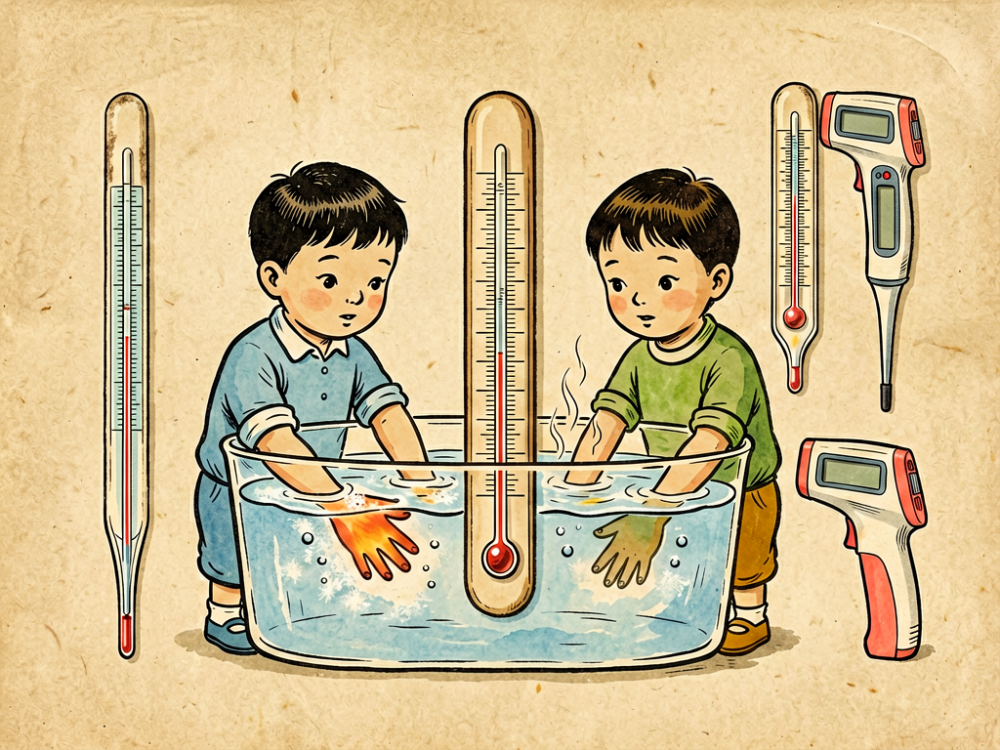

## 第十五章 温度和温度计

---

### 📍 本章导航
**核心主题**：我们每天都在说"今天好热""水好烫""我发烧了"，但是冷热这种感觉，其实特别不靠谱：冬天从室外进屋，你摸铁门觉得比木门冰得多，其实它们温度是一样的；你先把左手泡在冷水里，右手泡在热水里，再同时放进温水里，左手会觉得温水热，右手会觉得温水凉——同样一盆水，两只手给出了完全相反的结论。我们的身体感觉只能大概比较冷热，还特别容易受之前经验的影响，根本没法给出准确、统一的判断。但是科学、医疗、工业、生活里，我们需要准确知道冷热的程度：医生要知道你是不是发烧了，烧到多少度；工厂炼铁要知道炉子里的温度够不够，炼出来的钢质量好不好；气象站要预报每天的气温，寒潮来了要预警；造芯片要精确控制温度，差几度芯片就废了；火箭发动机、核电站更是差一点都不行。所以我们需要一个客观、统一、准确的标准来衡量冷热，这就是温度，而测量温度的工具，就是温度计。这一章我们就来讲讲：温度到底是什么，人类怎么发明了温度计，怎么建立了统一的温标，温度有没有上限和下限，以及——从靠感觉判断冷热，到用数字准确说出多少度，这件看起来很小的事，其实是整个现代科学和现代文明的基础。  
**你将发现**：
- 很多人搞不清温度和热的区别：热是能量，是在传递过程中的能量多少；而温度是物体冷热的程度，代表物体里分子无规则运动的剧烈程度——分子动得越快，温度越高，动得越慢，温度越低。一大桶温水含的热量比一小杯开水多得多，但是开水温度更高，摸起来更烫。
- 我们的皮肤感知的不是温度本身，而是热流的方向和速度——如果热量从物体流向你的手，你就觉得它热；如果热量从你的手流向物体，你就觉得它冷；流得越快，你觉得越烫或者越冰。冬天铁摸起来比木头冰，不是铁温度低，是铁导热快，把你手上的热带走得快，所以你觉得冰，其实它们温度是一样的。
- 温度计的原理很简单：利用物质随温度变化的某种可测量的性质来反映温度——最常见的液体温度计是利用液体热胀冷缩的性质：温度高了，水银或者酒精就膨胀，沿着细玻璃管往上爬，温度低了就收缩往下降，看液柱在哪个刻度，就知道温度是多少。除了液体热胀冷缩，我们还利用很多其他性质：金属电阻随温度变化（电阻温度计），两种金属接在一起温差会产生电压（热电偶），物体温度越高辐射的红外线越强（红外测温枪、热成像仪），不同温度用不同的温度计。
- 要测量温度，首先要有统一的标准，也就是温标，就像测量长度要有尺子，尺子上要有厘米、米的刻度一样，温度也要有刻度：
  - **摄氏温标**：最常用，我们平时说的多少度就是摄氏度（℃），把标准大气压下纯水结冰的温度定为0度，水烧开沸腾的温度定为100度，中间分成100等份，每一份就是1度，是瑞典天文学家摄尔修斯发明的。
  - **华氏温标**：美国等少数国家用，把冰水混合物加盐的温度定为0度，人体体温定为96度，水的冰点是32度，沸点是212度，华氏度(F) = 摄氏度×9/5 +32。
  - **开尔文温标**：科学上用的热力学温标，单位是开尔文（K），它的零点是**绝对零度**——也就是分子完全停止热运动的温度，这个温度是-273.15℃，永远达不到，只能无限接近。开尔文温度和摄氏度的关系是：K = ℃ +273.15，水的冰点是273.15K，沸点是373.15K。
- 温度计的发明不是一蹴而就的：最早伽利略发明了空气温度计，利用空气热胀冷缩，但是不准，受气压影响大；后来人们发明了密封的液体温度计，慢慢改进，华伦海特发明了水银温度计，确定了华氏温标，摄尔修斯确定了摄氏温标，温度计才慢慢变成我们今天熟悉的样子。
- 没有万能的温度计：不同场景要用不同的温度计——测体温用水银体温计或者电子体温计，精度到0.1度；测气温用酒精温度计，因为酒精凝固点低，零下几十度也不会冻住；测炼钢炉里上千度的高温，要用热电偶或者辐射温度计，不能把温度计伸进去；测接近绝对零度的超低温，要用特殊的锗电阻温度计或者噪声温度计；疫情的时候我们用额温枪，不用接触，一秒就能测体温，它测的就是你额头辐射的红外线强度，换算成温度。
- 温度有下限（绝对零度，-273.15℃），但是温度没有公认的上限：目前已知最高的温度是宇宙大爆炸那一刻的普朗克温度，大概1.4亿亿亿亿度，再高的温度我们现有的物理定律就不适用了。人类在实验室里用粒子对撞机能造出几万亿度的高温，但是只能维持极短的时间。
- 这一章最深刻的洞见：温度计的发明，是人类思想史上非常重要的一步——它把主观的、个人的、模糊的冷热感觉，变成了客观的、公共的、精确的数字。在温度计发明之前，"热""冷"都是每个人自己的感觉，你觉得热我觉得冷，没法统一讨论，没法做实验，没法传下来准确的知识；有了温度计之后，不管你是谁，在什么地方，测出来的37度就是37度，100度就是100度，全世界都一样，科学实验才能重复，技术才能积累，工业才能标准化。科学的本质，就是把"我觉得"变成"我们测量到"，把个人经验变成公共知识，温度计就是这个过程最典型的例子。从这个意义上说，小小的温度计，是整个现代科学文明的基石之一。

**阅读建议**：你现在就可以做那个三杯水实验：准备三杯水，一杯冷水，一杯温水，一杯热水（不要太烫）；先把左手放进冷水，右手放进热水，放一分钟；然后同时把两只手放进温水里，你会非常惊讶地发现，两只手对同一盆温水的感觉完全不一样——这会让你立刻明白，为什么我们的感觉不可靠，为什么我们需要客观的测量工具。

---

### 🖋️ 经典原文

你有没有过这种经历：冬天从外面走进温暖的屋子，摸屋里的铁门，觉得冰得刺骨，摸旁边的木门，就觉得没那么冰；可你要是拿温度计量一量，铁门和木门明明在同一个房间里放了一整天，温度明明是一模一样的。
再做一个小实验：倒三杯水，一杯冰冷水，一杯温吞水，一杯热水（别太烫免得烫伤）。你先把左手泡进冷水里，右手泡进热水里，泡个一分钟，然后同时把两只手都伸进中间那杯温水里——怪事发生了：左手觉得这盆水热，右手觉得这盆水凉。明明是同一盆水，温度明明没变，你的两只手却给出了完全相反的答案。
这说明什么？说明我们皮肤的冷热感觉，根本就靠不住。
我们的皮肤感知不到"温度本身"，它只能感知热量流进还是流出，以及流得快不快：如果热量从物体流进你的皮肤，你就觉得热；如果热量从你的皮肤流到物体上，你就觉得冷；流得越快，你感觉越烫或者越冰。冬天铁导热快，你手上的热很快就被铁导走了，所以你觉得冰；木头导热慢，热带走得慢，你就觉得没那么冰，其实它们温度是一样的。刚从冷水里拿出来的手，皮肤温度低，温水里的热流进手，你就觉得热；刚从热水里拿出来的手，皮肤温度高，手里的热流进温水，你就觉得冷。
靠感觉判断冷热，永远是主观的、相对的、靠不住的。你觉得热，我可能觉得冷，今天觉得烫，明天可能觉得刚好，没法比较，没法记录，没法传给别人。但是医生看病要知道你有没有发烧，烧到多少度；工人炼钢要知道炉子里温度够不够，炼出来的钢好不好；农民要知道什么时候下霜，庄稼会不会冻坏；科学家做实验要精确控制温度，差几度结果可能就完全不一样。我们不能靠"我觉得有点热"这种话来做判断，我们需要一个客观、统一、准确的数字来告诉我们冷热程度，这个数字就是温度，测量温度的工具，就是温度计。
说起来，温度到底是什么？
温度就是物体里面分子、原子无规则运动的剧烈程度。所有物体里的分子都在不停乱动，分子动得越快，互相碰撞越厉害，物体温度就越高；分子动得越慢，温度就越低。如果分子完全不动了，温度就降到了最低，这就是绝对零度——零下273.15摄氏度，这个温度永远达不到，只能无限接近。
而热，就是这些分子无规则运动的能量总和。一大桶温水，分子数量多，虽然每个分子动得不算特别快，但是总能量很大，含的热量比一小杯开水多得多；但是一小杯开水分子动得更剧烈，温度更高，所以摸起来更烫。温度是"剧烈程度"，热是"总能量多少"，这两个可不要搞混了。
人们发明温度计，其实就是找一个随温度变化特别规律、又容易观察的东西，用它的变化来标记温度。最常见的液体温度计，用的就是液体热胀冷缩的原理：温度升高，液体体积膨胀，就沿着细玻璃管往上爬；温度降低，液体体积收缩，就往下降。你只要在玻璃管上刻好刻度，看液柱停在哪个刻度，就知道温度是多少了。
最早的温度计是伽利略在四百多年前发明的，那是一根很细的玻璃管，一端是个空心玻璃泡，另一端开口插在水里，玻璃泡里的空气受热膨胀，就把水压下去，遇冷收缩，水就升上来，看水柱高低就能知道温度变化。但是这个温度计不准，因为它还受气压影响，气压变了水柱也会变，而且没有统一的刻度，每个人做出来的都不一样。
后来人们慢慢改进，把液体装在密封的玻璃管里，排除了气压的影响；先是用水，后来用酒精，最后华伦海特发现水银特别适合做温度计：水银在零下39度到零上357度之间都是液体，膨胀得特别均匀，又不会沾在玻璃壁上，稳定性特别好。他还制定了统一的刻度：把冰水混合物加盐能达到的最低温度定为0度，把人体正常体温定为96度，水的冰点就是32度，沸点是212度，这就是华氏温标，直到今天美国还在用。
再后来瑞典科学家摄尔修斯提出了更方便的摄氏温标：把标准大气压下纯水结冰的温度定为0度，水烧开沸腾的温度定为100度，中间分成100等份，每一份就是1摄氏度。这个温标简单好用，很快就在全世界流行开了，我们平时说的多少度，几乎都是摄氏度。
到了19世纪，英国物理学家开尔文提出了热力学温标，也就是开尔文温标，它不依赖于任何具体物质，完全从热力学定律出发，它的零点就是绝对零度——分子完全停止热运动的温度，也就是-273.15℃，这是温度能达到的最低极限，不可能再低了。科学上做计算、研究低温物理，都用开尔文温标，这才是最本质的温度单位。
可别以为所有温度计都是一根玻璃管装水银，温度计的种类可多了，不同温度范围、不同场景，要用完全不同的温度计：
- 我们平时量体温的，以前是水银体温计，现在大多是电子体温计，利用温度传感器把温度变成电信号，量得又快又准，还不怕打碎了水银中毒。
- 测北方冬天零下几十度的气温，不能用水银温度计，因为水银零下39度就冻成固体了，要用酒精温度计，酒精零下114度才会冻住，再冷也不怕。
- 测炼钢炉里上千度的高温，你总不能把玻璃管伸进去吧？一伸进去玻璃就化了，这时候要用热电偶——两种不同的金属接在一起，两头温度不一样就会产生电压，测电压大小就能知道温度，能测到上千度；还有辐射温度计，不用接触，看物体发出来的光和辐射强度，就能算出温度，测钢水、测火箭发动机尾焰温度都靠它。
- 测接近绝对零度的超低温，普通温度计都不好用了，要用特殊的电阻温度计，利用某些材料电阻随温度变化的规律，能精确测到零点零几度甚至更低。
- 疫情的时候大家都用过额温枪，对着额头"嘀"一声就出温度，它测的就是你额头辐射出来的红外线强度——所有有温度的物体都在辐射红外线，温度越高辐射越强，接收红外线换算成温度，不用接触，一秒就能测完，特别适合快速筛查。还有热成像仪，能同时看到一片区域所有地方的温度，哪里热哪里冷一目了然，查设备漏电、查建筑保温、晚上搜救都能用。
你看，从零下二百多度的超低温实验室，到几千万度的核聚变反应堆，从你我的体温到太阳表面的五千多度，人类发明了各种各样的温度计，就为了把温度这个看不见摸不着的东西，变成准确的数字。
你可别小看温度计这个小小的发明，它对人类文明的意义，怎么强调都不过分。
在温度计发明之前，冷热只是每个人的主观感受，"很热""有点冷""温乎"，这些词没有统一标准，你说的热和我说的热可能根本不是一回事，科学家做实验，结果没法重复，工匠做手艺，温度全靠经验，没法传承，没法标准化。
有了温度计之后，一切都不一样了。不管你是中国人还是外国人，不管你在古代还是现代，只要你用标准的温度计测出来，标准大气压下沸水的温度就是100摄氏度，人体正常体温就是37摄氏度左右，这个数字是客观的、公共的、全世界统一的。医生一看38.5度，就知道你发烧了；工人一看炉温1500度，就知道钢炼好了；科学家记录实验温度，别的国家的科学家能重复出来；气象站记录的气温，几十年后拿出来还能对比气候变化。
从"我觉得热"到"测出来37.5度"，这一步看起来简单，其实是整个人类认知方式的革命：我们不再相信个人的主观感觉，而是相信可重复、可验证、可共享的客观测量，这就是科学最核心的精神。不止温度，重量、长度、时间、电流、光强，所有物理量的测量都是这个道理——把模糊的感觉变成精确的数字，把个人经验变成公共知识，人类才能一代代积累知识，才能建起现代科学和工业文明的大厦。
不要觉得测量是个小事。你去医院看病，首先就是量体温、量血压；你去工厂看，几乎每台设备上都有温度、压力传感器；你发射火箭，几万个传感器在监测各个部位的温度，差几度都可能出大事故；你造芯片，整个生产过程要把温度控制在零点几度以内，差一点芯片就报废了。整个现代社会，就是建立在无数个精确测量之上的，而温度计，就是这些测量工具里最早、最典型、最重要的一个。
下一章，我们要站在更高的角度，从历史的窗口看技术革命，看看人类怎么一步步学会驾驭能量，从钻木取火到蒸汽机、电力，再到今天的信息时代。

---

> 📜 **科学史话：从感觉的到标准的——温度计四百年发展史**
>
> 在温度计发明之前，人类对冷热的判断完全靠感觉和经验：中国古代有"冰瓶"用来判断温度变化，古希腊的医生也会用手摸病人额头判断有没有发烧，但是没有人能说出到底是多少度，更没法统一比较。
>
> 第一个真正的温度计是伽利略在1593年发明的空气验温器：一根玻璃管，一端吹成玻璃泡，另一端开口插在带颜色的水里，先给玻璃泡加热把空气赶出去一点，冷却之后水就会升到玻璃管里，玻璃泡温度变化，里面空气热胀冷缩，水柱就会上下移动。但是这个装置有个大问题：它不仅受温度影响，还受气压影响，天气变了气压变了，水柱也会动，而且没有刻度，只能看个大概变化，根本不准。
>
> 后来伽利略的学生托里拆利改进了这个装置，把液体密封在玻璃管里，排除了气压的影响。到了17世纪，佛罗伦萨的院士们做了密封的酒精温度计，还在玻璃管上刻了刻度，这才算是第一支真正实用的液体温度计，但是刻度还是不统一，每个人做的温度计刻度都不一样，结果没法比较。
>
> 真正让温度计变成标准化测量工具的，是德国仪器制造商华伦海特。他在1714年发明了水银温度计，水银比酒精好用太多：膨胀均匀，不沾玻璃，测量范围大，从零下39度到357度都是液体。华伦海特还制定了统一的华氏温标：他把冰、水、氯化铵和盐的混合物能达到的最低温度定为0°F，把人体正常体温定为96°F（后来修正为98.6°F），这样水的冰点是32°F，沸点是212°F，中间分成180等份。华氏温标第一次让不同地方、不同人做的温度计读数能统一起来，很快在欧洲流行开。
>
> 1742年，瑞典天文学家摄尔修斯提出了更方便的百分温标，也就是摄氏温标：他一开始把水的沸点定为0度，冰点定为100度，这样温度越高数字越小，用起来不方便，后来他的同事斯特勒默把刻度反过来，冰点0度，沸点100度，这就是我们今天用的摄氏度。因为十进制太方便了，摄氏温标很快就在全世界普及，除了美国等少数国家，大家都用摄氏度。
>
> 1848年，英国物理学家开尔文（威廉·汤姆逊）提出了热力学温标，也就是开尔文温标，它完全基于热力学第二定律，不依赖于任何具体物质的性质，零点就是绝对零度（0K=-273.15℃），每一度的大小和摄氏度一样。开尔文温标是科学上的标准温标，所有热力学计算都要用它。后来人们又确定了水的三相点（固液气三态共存的温度，0.01℃）作为273.16K，把温标固定得更准确。
>
> 从伽利略的粗糙管子，到今天能测到亿分之一度精度的量子温度计，四百年来温度计越来越准，越来越灵敏，能测的温度范围越来越大，但是最根本的东西没变：它把主观的冷热感觉，变成了客观的数字，给了全人类一把统一的尺子，来量度这个世界的冷热。

---

> 🔬 **科学更新：纳米测温、量子温度计与热成像——当代测温技术新进展**
>
> 今天的测温技术早就不是玻璃管水银柱那么简单了：
>
> **纳米尺度测温**：现在科学家能把温度计做到纳米大小，比细胞还小，能放进活细胞里，测量细胞内部不同位置的温度，甚至能测出单个细胞器的温度变化。这给生物学研究带来了革命——我们以前只知道体温37度，现在能看到细胞里面什么时候温度升高，什么时候发生变化，能研究癌症、细胞代谢和很多疾病的温度特征。
>
> **量子温度计**：科学家利用量子效应，造出了精度极高的温度计，能测出十亿分之一度甚至更小的温度变化。这些量子温度计能用在很多地方：探测暗物质，研究量子材料，甚至未来能用来探测引力波。它们能测到接近绝对零度时极微小的温度波动。
>
> **红外热成像普及**：以前热成像仪特别贵，只有军事和工业用，现在热成像已经做到手机里了，几百块钱就能买个外接热成像摄像头，你能看到家里哪里漏风，电器哪里过热，晚上能看见黑暗里的动物，维修电路找漏电点特别方便。热成像已经从专业设备变成了普通人也能用的工具。
>
> **分布式光纤测温**：现在在输油管道、高压电缆、大坝、隧道里，大家会铺一根光纤，利用光纤里光的散射随温度变化的原理，能沿着光纤每一米测一个温度，整条管线几十上百公里，每一点温度都能实时监测，哪里漏油漏电、哪里过热，立刻就能发现，这是以前根本做不到的。
>
> **可穿戴连续测温**：现在很多智能手表、手环都能24小时连续监测你的体温变化，不光能测你有没有发烧，还能通过体温的昼夜变化判断你的排卵周期、免疫状态、运动恢复情况，体温从一个偶尔测一次的数字，变成了连续监测健康的重要指标。
>
> 从玻璃管里的水银柱，到细胞里的纳米温度计，再到覆盖整个城市的温度监测网络，人类测量温度的能力越来越强，我们对世界的理解，也随着这些测量越来越精确、越来越深入。

---

> 🧪 **动手试一试：做一个自己的温度计+三杯水感觉实验**
>
> 实验一：三杯水温度错觉
> 准备三个大碗/杯子，分别倒入：冷水（可以放几块冰）、温水（不冷不热）、热水（手感热但是不烫，小心烫伤！）；
> 把左手放进冷水，右手放进热水，保持1分钟；
> 然后同时把两只手放进中间的温水里；
> 仔细感受：两只手对同一盆温水的感觉是不是不一样？左手觉得热，右手觉得凉？这就证明了我们的温度感觉是相对的，不可靠，需要客观测量。
>
> 实验二：自制简易温度计
> 找一个透明的小玻璃瓶（比如口服液瓶、墨水瓶），装满带颜色的水（滴几滴红墨水或者蓝墨水，方便看）；
> 找一根透明的细吸管（喝奶茶的粗吸管不行，越细越好，比如口服液的吸管），穿过瓶盖插进去，接口处用橡皮泥或者蜡密封好，不要漏气，让吸管里的液面升到瓶盖以上一点；
> 把瓶子分别放进热水和冷水里，观察吸管里的液面变化：放进热水里，水受热膨胀，液面上升；放进冷水里，水遇冷收缩，液面下降——你自己做了一个液体温度计！
> 你还可以在吸管后面贴一张纸条，对照真正的温度计，在0度（冰水混合物）、10度、20度、100度（沸水，小心烫）的位置画上刻度，这就是你自己做的、有刻度的温度计了。

---

### 💬 读后思考与讨论

1. 冬天摸室外的铁和木头，铁摸起来更冰，是因为铁温度比木头低吗？为什么？用你学到的知识解释一下。
2. 温度和热是同一个概念吗？一大桶20度的凉水和一小杯100度的开水，哪个含的热量更多？哪个温度更高？
3. 为什么说温度计的发明不只是一个小发明，而是科学革命的重要一步？从主观感觉到客观测量，这件事对人类认识世界有什么意义？
4. 绝对零度是多少度？为什么绝对零度达不到？我们现在在实验室里最多能冷却到多接近绝对零度？
5. 如果你要测炼钢炉里1500度的钢水温度，你会用水银温度计吗？为什么？你应该用什么原理的温度计？

### 🔗 关联阅读
- 第三部第十四章：《热的旅行》→ 温度是热流动的动力，热永远从高温流向低温
- 第三部第十六章：《从历史的窗口看技术革命》→ 人类驾驭能量和技术的历史，测量是技术革命的基础
- 跨章节思考：所有科学都从测量开始，所有可靠知识都建立在标准化测量之上。从温度计到天平、钟表、电表，人类发明了无数测量工具，每一个测量工具的发明，都打开了一个新的认知世界。
