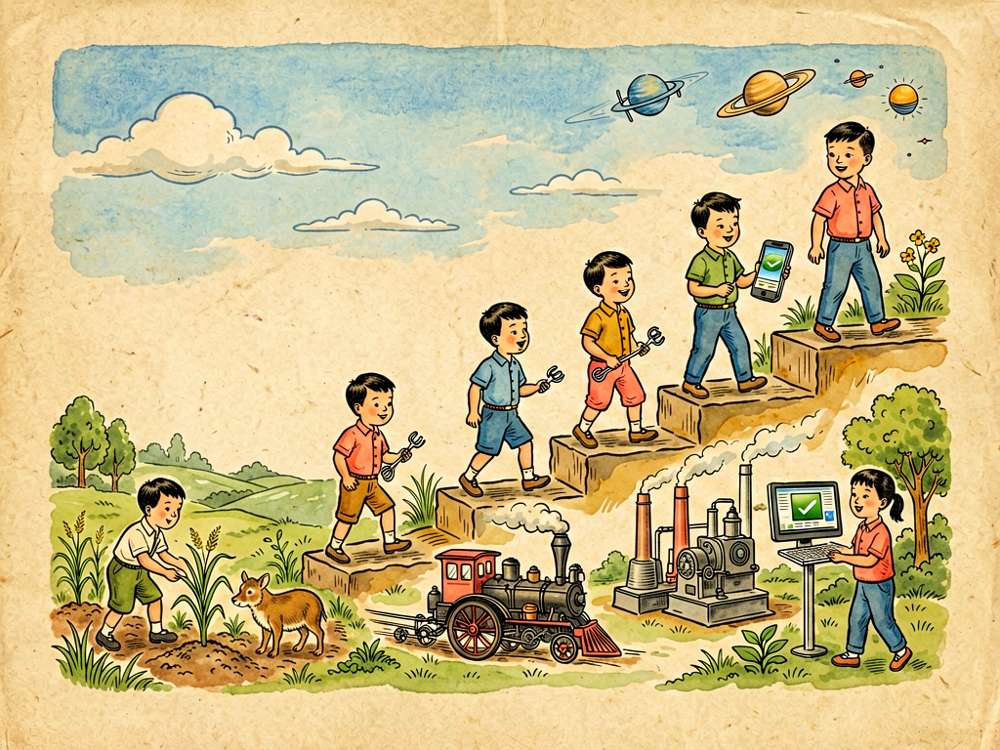

## 第十六章 从历史的窗口看技术革命

---

### 📍 本章导航
**核心主题**：我们前面讲了细胞、细菌、镜子、摩擦、热、温度，讲了这么多科学知识，这一章我们站得高一点，从历史的大窗口往外看，看看人类文明这几万年来，到底是怎么走过来的——是什么力量，让我们从原始森林里摘果子打猎的猿人，变成了今天能坐飞机上天、能隔着半个地球视频通话、能造出芯片和火箭、能探索宇宙的现代人？答案就是技术革命。很多人以为技术发明就是造个新工具、新机器，其实根本不是：每一次真正的技术革命，都不只是多了个好用的工具，它会彻底改变人类的生产方式、生活方式、社会组织方式，甚至改变我们思考世界的方式，相当于给整个文明换了一套"操作系统"。从农业革命到工业革命，从电气化到信息革命，再到今天正在发生的智能革命、新能源革命，人类就是这样一次次借助技术，突破自己身体的局限，把文明往前推。但是技术从来不是只有好处，每一次技术革命在带来巨大进步的同时，也会带来新的问题、新的风险、新的不平等，怎么驾驭技术，让技术为人服务，而不是反过来被技术控制，这是我们今天每个人都要思考的问题。这一章，我们就透过历史的窗口，看看几次改变人类命运的技术革命，看看技术到底怎么改变了世界，也想想未来我们该往哪里去。  
**你将发现**：
- 技术本质上是人的"外部器官"：石器延伸了我们的手，让人能打碎坚硬的东西、切割猎物；轮子延伸了我们的腿，让人能搬运重物、走得更远；文字延伸了我们的记忆，让知识能跨越时间和空间传下去；望远镜和显微镜延伸了我们的眼睛，让我们能看见太远太小的东西；电话延伸了我们的耳朵和嘴巴，让我们能和千里之外的人说话；计算机延伸了我们的大脑，帮我们计算、存储、处理信息；今天的AI更是延伸了我们的认知能力，能帮我们写文章、做设计、分析数据、辅助决策。人本身的身体能力其实很弱：跑不过豹子，打不过老虎，飞不起来，冬天没有毛会冻死，但是人会发明技术，用技术弥补自己的不足，这就是人和动物最大的区别。
- 人类历史上第一次真正的技术革命是**农业革命**：大约一万年前，人类从打猎采集为生，慢慢学会了种庄稼、养牲畜，从到处迁徙变成了定居在一个地方。这看起来只是换了个吃饭方式，但是彻底改变了一切：因为种粮食有了稳定的剩余粮食，就能养活更多人，就有了村落、城市，有了分工（有些人不用种地，可以当工匠、官员、士兵、学者），有了文字、法律、国家、军队，文明就这样诞生了。但是农业革命也有代价：人要每天辛苦种地，比打猎的时候累多了；开始有了阶级分化，有了贫富差距；定居之后人口密集，传染病也更容易流行。技术从一开始就是这样，给你带来好处，也给你带来新的问题。
- 第二次技术革命是**工业革命**：两百多年前从英国开始，蒸汽机的发明是标志。人类第一次学会了把煤里的化学能变成热，再变成源源不断的机械动力，不用再靠人力、畜力、水力、风力了。有了蒸汽机，就有了工厂，有了火车、轮船，能大规模生产商品，能快速运输货物和人，人类从农业社会进入了工业社会。工业革命彻底改变了世界：人口爆炸式增长，城市快速扩张，整个社会的节奏都变了——以前农民跟着太阳和季节走，现在工厂工人要按钟表时间准时上班，标准化、流水线、大规模生产成了常态。但是工业革命也带来了污染、贫富分化、工人被剥削、殖民扩张等很多问题，我们今天的很多社会结构和环境问题，都是从工业革命开始的。
- 第三次是**电气化和内燃机革命**：19世纪后期到20世纪初，电力、内燃机、化工、通信技术爆发。电灯点亮了黑夜，工厂有了电动机更方便，电报电话让信息瞬间传到千里之外，汽车、飞机让人类移动速度提高了几十上百倍，流水线生产让汽车这种以前只有富人买得起的东西变成了大众商品。人类进入了大工业时代，整个世界被电网、铁路、公路、电话线连在了一起，成了一张紧密的网。我们今天的现代生活，大部分基础设施都是这个时代建起来的。
- 第四次是**信息革命**：从20世纪中期计算机发明，到后来半导体、互联网、智能手机普及。以前的技术革命主要解决的是能量和物质的问题——怎么造出更多东西，怎么更快搬运东西；信息革命解决的是信息的问题——怎么更快计算、存储、传输、处理信息。有了计算机和互联网，知识获取的门槛大大降低，人和人之间的距离被无限压缩，整个世界变成了地球村，信息本身成了最重要的生产力。今天我们用的智能手机、移动支付、电商、社交网络，都是信息革命的产物。
- 我们现在正在经历第五次技术革命：**智能革命+新能源革命+生物技术革命**。AI大模型能理解语言、生成内容、辅助决策，开始代替一部分认知劳动；新能源（光伏、风电、储能、电动车）正在替换化石能源，改变整个能源体系；基因编辑、合成生物学正在改变我们对生命的理解和改造能力。这一次革命的影响可能比之前任何一次都大，因为它不仅改变我们怎么生产、怎么交流，还开始改变我们怎么思考、怎么创造、甚至生命本身。
- 这一章最深刻的洞见：
  1. 技术革命从来不是一个天才单独发明一个东西就完事了，它一定是整个系统的跃迁：蒸汽机背后需要煤炭、钢铁、机械加工、工厂制度、市场需求一起配合才能推广开；互联网背后需要半导体、光纤、通信协议、个人电脑、软件生态一起成熟才能普及。单个发明只是导火索，真正的革命需要整个社会的技术、产业、制度、教育都准备好了才会发生。
  2. 技术没有善恶，它是放大器：技术会放大人的能力，也会放大人性里的善和恶。技术能让好人更好地帮助别人，也能让坏人更容易做坏事；能提高生产效率，也会带来失业、隐私泄露、算法偏见、战争武器更致命等问题。指望技术自动解决所有问题是天真的，害怕技术拒绝进步也是保守的，关键是人类要有能力建立好的制度、伦理、规则，去引导技术往对大多数人好的方向走。
  3. 我们中国人对技术革命有特别深的体会：我们古代有四大发明，有很长时间领先世界，但是近代错过了工业革命，落后挨打了一百多年；新中国成立后我们快速工业化，改革开放后赶上了信息革命的尾巴，现在在新能源、5G、人工智能、航天等很多领域已经走到了世界前列。技术革命对国家来说，就是不进则退，抓住了就能富强，错过了就会落后挨打。
  4. 对我们个人来说，技术革命是永远不会停止的，没有什么技能是能吃一辈子的。以前会开车、会打字、会修电器是好工作，现在这些技能越来越不值钱。未来真正不会被淘汰的能力，不是会用某个具体工具，而是持续学习的能力、独立思考的能力、创造力、同理心、和别人协作的能力——这些是AI和机器最难代替的东西。

**阅读建议**：你可以环顾一下你现在所在的房间，数一下身边有多少样技术产品：电灯、手机、电脑、书本、衣服、桌子、杯子、插座……每一样东西背后都是一次技术发明，你可以试着想想，如果这些东西都没有，退回到一万年前农业革命之前，你要怎么活下去？你会立刻体会到，我们每个人其实都活在整个人类技术积累的成果之上。

---

### 🖋️ 经典原文

小朋友，你有没有想过，我们人类这种动物，身体其实挺没用的：
我们跑不过兔子，打不过老虎，爬树不如猴子，游泳不如鱼，冬天不长厚毛会冻死，没有尖牙利爪，连生个孩子都比别的动物困难。但是为什么偏偏是人类，成了地球的主人，能上天入地，能造出飞机、火车、手机、火箭，能隔着半个地球说话，能登上月亮？
答案只有两个字：技术。
动物靠自己的身体适应环境，人不一样，人会发明技术，给自己造出各种各样的"外部器官"，弥补身体的不足：我们手里拿一块石头，就比老虎的爪子还厉害；我们造了轮子和车，就比马跑得快；我们发明了望远镜显微镜，眼睛就能看见几亿光年外的星星，也能看见细菌那么小的东西；我们发明了文字和书本，就能把几千年前古人的知识记下来，传给后代，不用什么都靠自己从头学；我们发明了电话和互联网，哪怕隔着千山万水，也能立刻和别人说话见面。
人本身还是那个十几万年前的人，身体没怎么变，但是我们的技术越来越强，我们能做的事情就越来越多，文明就这样一步步发展起来了。
真正改变人类命运的，不是零零碎碎的小发明，而是几次翻天覆地的技术革命——每一次革命，都不只是多了个好用的工具，而是给整个人类文明换了一套新的操作系统，把人类社会整个变了个样。
第一次大革命，是农业革命，发生在大约一万年前。
在那之前，人都是打猎采集的，拿着棍子石头追野兽，摘野果子挖野菜吃，哪里有吃的就往哪里迁，和别的动物差不了太多。后来慢慢有人发现，掉在地上的植物种子第二年会长出新的植物，打猎抓回来的小动物养大了能生更多小动物，于是他们开始试着种庄稼，养猪牛羊狗，不再到处跑了，在河边肥沃的土地上盖房子定居下来。
你可别觉得种庄稼是小事，这是人类历史上最伟大的转折之一。以前打猎采集，一块地方能养活的人很少，大家天天找吃的，没有剩余，也就没有功夫干别的。种了庄稼之后，只要好好种地，粮食就有剩余，一部分人不用种地也能有饭吃，于是就有了分工：有人当工匠做陶器做工具，有人当首领管事情，有人当士兵保卫部落，有人专门观察星象研究节气、发明文字记录事情。慢慢的，村落变成了城市，部落变成了国家，有了法律、宗教、文字、艺术，真正的文明就这样诞生了。我们今天所有的一切，都是从一万年前人类第一次弯下腰，把种子播进土里那一刻开始的。
但是农业革命也不是只有好处。定居之后，人要天天在地里弯腰干活，比打猎的时候辛苦多了；粮食虽然稳定，但是食物种类反而少了，很多人营养不良；人口密集住在一起，家禽家畜的病菌更容易传给人，传染病开始流行；有了剩余粮食和财产，也就有了贫富差距、阶级分化、战争和剥削。技术从来就是这样，它给你打开一扇门，就一定会给你带来新的问题，从来没有只有好处没有代价的技术。
第二次大革命，是工业革命，两百多年前从英国开始，标志是瓦特改进了蒸汽机。
在那之前，人类用的动力要么是自己的力气，要么是牛马的力气，最多是用水车风车利用水力风力，这些动力都不稳定，也不够大，做不了什么大事。蒸汽机发明之后就不一样了：我们把煤烧成热，把水烧成高压蒸汽，用蒸汽推动活塞转动，就能产生源源不断的、强大的动力，比几十头牛几百个人的力气还大。
有了蒸汽机，首先变的是工厂：以前手工工场里工人用手干活，现在机器可以代替人手，只要烧煤就能没日没夜地转，生产效率一下子提高了几十上百倍，纺织品、铁器、各种商品大批量被生产出来，价格变得特别便宜。然后蒸汽机装到了轮子上，就有了火车和轮船，以前从北京到广州走路要几个月，坐火车几天就到了，货物和人能快速流动，整个世界被连在了一起。
工业革命之后，人类好像突然拥有了神一样的力量，以前想都不敢想的事情变成了现实。城市像雨后春笋一样长起来，人口爆炸式增长，整个社会的节奏彻底变了：以前农民跟着太阳走，农忙干活农闲休息；现在工厂里的工人要按钟表时间准时上班下班，迟到就要扣钱，标准化、流水线、纪律、效率成了新的规则。我们今天熟悉的现代社会，本质上就是工业革命的产物。
但是工业革命也带来了巨大的代价：工厂烟囱冒着黑烟，河流被污染，工人每天工作十几个小时，包括很多童工，住在贫民窟里，贫富差距空前拉大；西方列强靠着工业革命造出的坚船利炮，去全世界侵略殖民，把很多国家变成了殖民地半殖民地。我们中国就是在那个时候错过了工业革命，从原来的世界领先国家变成了落后挨打的国家，受了一百多年的屈辱。
第三次大革命，是电气化和内燃机革命，发生在19世纪末20世纪初。
人们发明了发电机和电动机，学会了发电、输电、用电。电真是个好东西：它能通过电线瞬间传到千里之外，按一下开关灯就亮了，接上电动机机器就转了，比蒸汽机方便干净多了。电灯点亮了黑夜，以前黑夜只能睡觉，现在晚上工厂能开工，街道能亮灯，人们的夜生活开始了；电话电报发明了，以前一封信要走几个月，现在一个电话瞬间就能和千里之外的人说话。
同时内燃机发明了，烧汽油柴油就能转，比蒸汽机小得多劲却大得多，于是有了汽车、飞机，人类终于实现了飞上天的梦想，移动速度比以前快了几十上百倍。福特发明了流水线生产，把造汽车拆成一道一道简单工序，汽车成本大大降低，从富人的玩具变成了普通人都能买得起的交通工具。整个世界被电网、公路、铁路、电话线、航线密密麻麻连在了一起，人类真正进入了现代社会。
第四次大革命，是信息革命，从20世纪中期到现在。
以前的技术革命，主要解决的是"怎么造东西""怎么运东西"这类物质和能量的问题，信息革命解决的是"怎么处理信息"的问题。1946年人类发明了第一台电子计算机，有好几间房子那么大，算东西比人快得多；后来半导体技术发展，芯片越做越小，算力越来越强，电脑从机房走进了办公室，走进了家庭；再后来互联网发明了，全世界的电脑连在了一张网上，信息能瞬间传遍全世界；再到智能手机普及，每个人口袋里都有一台比当年登月时的计算机强几万倍的电脑，随时随地能上网、能拍照、能付钱、能和全世界的人联系。
信息革命彻底改变了我们获取知识、交流、工作、消费的方式：以前你要查资料得去图书馆翻半天书，现在掏出手机一搜什么都有；以前买东西要去商店，现在手机上下单第二天就送到家；以前上班必须去办公室，现在很多工作在家用电脑就能做。信息成了比石油、钢铁还重要的资源，互联网公司成了世界上最大的公司。
小朋友们，你们是在信息时代长大的，可能觉得手机、互联网是天经地义就有的，但是你们的爷爷奶奶小时候连电话都很少见，爸爸妈妈小时候没有智能手机，上网要拨号。信息革命就发生在这短短几十年里，改变了一切。
而现在，我们正站在第五次技术革命的门口：智能革命、新能源革命、生物技术革命正在同时发生。
人工智能大模型突然就爆发了，它能写文章、画画、做设计、写代码、分析数据，甚至能做数学题搞科研，以前我们觉得只有人能做的认知劳动，现在AI也能做了；光伏、风电、储能、电动车正在快速替换煤和石油这些化石能源，人类正在摆脱对地下能源的依赖，能源结构会彻底改变；基因编辑、合成生物学让我们能直接修改生命的代码，能治好以前治不好的病，甚至能创造新的物种。这一次革命的影响，可能比前几次加起来还要大，它不仅会改变我们怎么工作怎么生活，甚至会改变"人是什么"这个问题的答案。
回头看这一万年的技术革命史，我们会发现几个特别重要的道理：
第一，真正的技术革命从来不是一个天才躲在屋子里突然灵光一闪发明个东西就成了。瓦特不是第一个发明蒸汽机的人，但是他改进蒸汽机的时候，英国已经有了采煤业、钢铁业，有了工厂对动力的需求，有了能加工精密零件的工匠，蒸汽机才能推广开；计算机、互联网最开始是军方为了打仗发明的，后来有了半导体产业、软件生态、个人电脑普及，才变成了改变世界的技术。单个发明只是一颗种子，土壤合适了它才能长成大树。
第二，技术从来没有善恶，它只是个放大器。你用刀能切菜做饭，也能伤人；原子能既能发电照亮城市，也能做成原子弹毁掉城市；互联网既能让你方便地学习知识和家人联系，也能传播谣言、诈骗、侵犯隐私。技术本身不会自动变好，关键是用技术的人，是我们的社会有没有好的规则、法律、伦理，把技术往好的方向引导，管住它坏的一面。
第三，技术革命永远不会停止，它只会越来越快。以前农业革命持续了几千年，工业革命持续了两百年，信息革命才几十年，现在AI几个月就有一次大变化。不要指望学会一个技能就能用一辈子，你现在在学校学的知识，等你长大工作的时候，可能很多都过时了。未来真正重要的，不是你记住了多少知识，而是你会不会持续学习，会不会独立思考，会不会创造，会不会和别人合作，有没有同理心——这些是机器和AI最难学会的东西。
小朋友们，你们是未来的主人，下一次技术革命的创造者，可能就在你们中间。希望你们学科学、爱科学，既不害怕新技术，也不迷信新技术，用自己的头脑和双手，让技术给所有人带来更好的生活，而不是带来更多问题。
下一章，我们讲土壤世界。

---

> 📜 **科学史话：改变世界的瞬间——五次技术革命的关键节点**
>
> **1776年，瓦特改进蒸汽机**：其实在瓦特之前，纽科门蒸汽机已经在煤矿用了几十年，但是效率特别低，只能用来抽水。瓦特花了十几年时间改进，给蒸汽机加了分离式冷凝器，大大提高了效率，又和工厂主博尔顿合作，把蒸汽机从矿井专用改成了通用动力，能用到纺织、冶金、交通各个领域，工业革命才真正爆发。瓦特不是发明家的单打独斗，是工匠、资本家、市场一起成就了工业革命。
>
> **1879年，爱迪生发明实用电灯**：爱迪生也不是第一个发明电灯的人，但是他不是只做了个灯泡——他建了发电厂，铺了电网，发明了保险丝、电表、插座，一整套照明系统，让电灯从实验室里的小玩意变成了家家户户能用的东西。真正的创新不只是发明一个产品，而是发明一整套系统。
>
> **1903年，莱特兄弟飞机首飞**：第一次动力飞行只持续了12秒，飞了36米，还没有一架波音飞机的翅膀长，但是这12秒开启了航空时代。仅仅66年后，人类就登上了月球。
>
> **1946年，第一台电子计算机ENIAC诞生**：这台计算机重30吨，用了18000个电子管，每秒能做5000次加法，还不如你手里的计算器，但是它开启了信息时代。1947年晶体管发明，1958年集成电路发明，之后摩尔定律生效，芯片上的晶体管每18个月翻一倍，电脑越做越小，算力越来越强，直到今天我们口袋里的智能手机算力超过当年阿波罗登月计划所有计算机算力总和。
>
> **1969年，互联网诞生**：最开始是美国军方为了防止核战争打坏通信系统做的分布式网络，第一个消息只传了两个字母"LO"就系统崩溃了。后来慢慢发展成学术网络，再到万维网发明，互联网向公众开放，再到移动互联网，只用了短短五十年，就把全世界几十亿人连在了一起。
>
> **2022年，ChatGPT发布**：生成式AI第一次走进大众视野，大模型展现出了接近人类的语言理解和生成能力，被很多人认为是智能革命的"蒸汽机时刻"。就像当年蒸汽机代替体力劳动一样，AI开始代替一部分认知劳动，新一轮技术革命已经拉开大幕。
>
> 所有这些改变世界的瞬间，在发生的时候很多人都没意识到它未来会有多重要。新技术刚出现的时候总是很粗糙、很笨拙，很多人嘲笑它没用，但是只要它代表了未来的方向，就会快速成长，最终彻底改变世界。

---

> 🔬 **科学更新：AI、新能源、合成生物——我们正在经历的第五次技术革命**
>
> 我们今天正站在新一轮技术革命的起点上，几个领域同时在爆发：
>
> **人工智能革命**：大语言模型、多模态AI正在快速进化，现在的AI已经能写代码、做设计、辅助医生看病、帮助科学家做研究，自动驾驶也在逐步成熟。未来十年，AI会彻底改变几乎所有行业：很多重复性的脑力劳动会被AI辅助甚至代替，同时会创造很多现在还不存在的新工作。怎么让AI安全、可控、公平地为所有人服务，是现在全世界都在研究的问题。
>
> **新能源革命**：光伏和风电的成本在过去十年下降了90%以上，已经比煤电还便宜；储能技术（锂电池、钠电池、氢能）也在快速进步；电动车正在快速替换燃油车。人类正在从化石能源时代走向可再生能源时代，这不仅能解决气候变化问题，还会彻底改变整个世界的能源格局、经济格局甚至政治格局——以后不用再抢石油了，每个国家都能自己发电，能源会变得更便宜更普惠。
>
> **生物技术革命**：CRISPR基因编辑技术让我们能精确修改DNA，已经能治好一些以前的绝症；mRNA技术让我们快速开发出了新冠疫苗；合成生物学能让微生物生产我们需要的药物、材料、燃料，甚至能人工合成淀粉、蛋白质。未来我们可能能治愈大部分遗传病，能延缓衰老，能解决粮食问题，但是也带来了伦理问题——我们能不能编辑人类胚胎的基因？怎么防止生物技术被滥用？
>
> **航天和深空探索**：商业航天公司把火箭发射成本降低了90%以上，人类正在重返月球，未来要去火星，卫星互联网正在把网络覆盖到地球每一个角落。太空不再是只有大国能去的地方，商业航天正在打开一个全新的产业领域。
>
> 这一次革命和以前不一样的地方是，它发生得更快，影响更深远，和我们每个人的关系更密切。以前工业革命可能过了几十年普通人才能感觉到变化，现在AI几个月就更新一次，几个月就有新功能出来，我们每个人都要学会和新技术一起生活。

---

> 🧪 **动手试一试：技术延伸清单+家庭技术时间线**
>
> 活动一：我的技术延伸清单
> 拿出一张纸，列出来你今天用到的10种技术产品（比如手机、电灯、课本、衣服、杯子、自行车）；
> 对着每一样东西想一想：它延伸了你身体哪个器官的功能？在它发明之前，人们是怎么完成这件事的？
> 比如：手机延伸了耳朵（打电话）、眼睛（看视频）、嘴巴（发消息）、大脑（存东西查资料），在手机发明之前，人们要写信、去图书馆查资料、用固定电话。
> 列完你就会发现，我们一天都离不开人类积累了上万年的技术成果。
>
> 活动二：家庭技术时间线
> 问问你的爷爷奶奶、爸爸妈妈，他们像你这么大的时候，家里有什么电器，有什么技术产品？
> 比如爷爷奶奶小时候可能家里没有电灯，点煤油灯；爸爸妈妈小时候家里没有电视，没有手机，更没有互联网；
> 把爷爷奶奶、爸爸妈妈和你三代人小时候的技术产品列出来，对比一下，你就能实实在在感觉到技术革命给我们生活带来的变化。

---

### 💬 读后思考与讨论

1. 为什么说技术是人的"外部器官"？你能举几个你熟悉的例子，说说它们分别延伸了人的什么能力吗？
2. 农业革命、工业革命、信息革命，这三次革命分别给人类带来了什么好处，又带来了什么问题和代价？
3. 有人说"AI会让很多人失业，所以我们应该禁止AI发展"，你同意这个说法吗？为什么？我们应该怎么面对技术带来的变化？
4. 为什么说真正的技术革命从来不是一个天才的单独发明，而是整个社会系统的变化？除了发明者，还需要哪些条件新技术才能普及？
5. 想象一下，二十年之后技术会发展成什么样？那时候的人们会怎么生活、怎么工作？你最希望未来有什么技术发明？

### 🔗 关联阅读
- 第三部第七章：《炼铁的故事》→ 钢铁是工业革命的基础材料
- 第三部第十四章：《热的旅行》→ 蒸汽机本质上是利用热的流动做功，开启了工业革命
- 第三部第三十/三十一章：展望未来的科学与文明
- 跨章节思考：整部《灰尘的旅行》里讲的所有科学知识——细菌、细胞、光、电、热、材料，最终都变成了技术，变成了改变世界的力量。科学是认识世界，技术是改造世界，两者结合在一起，才推动了文明进步。
