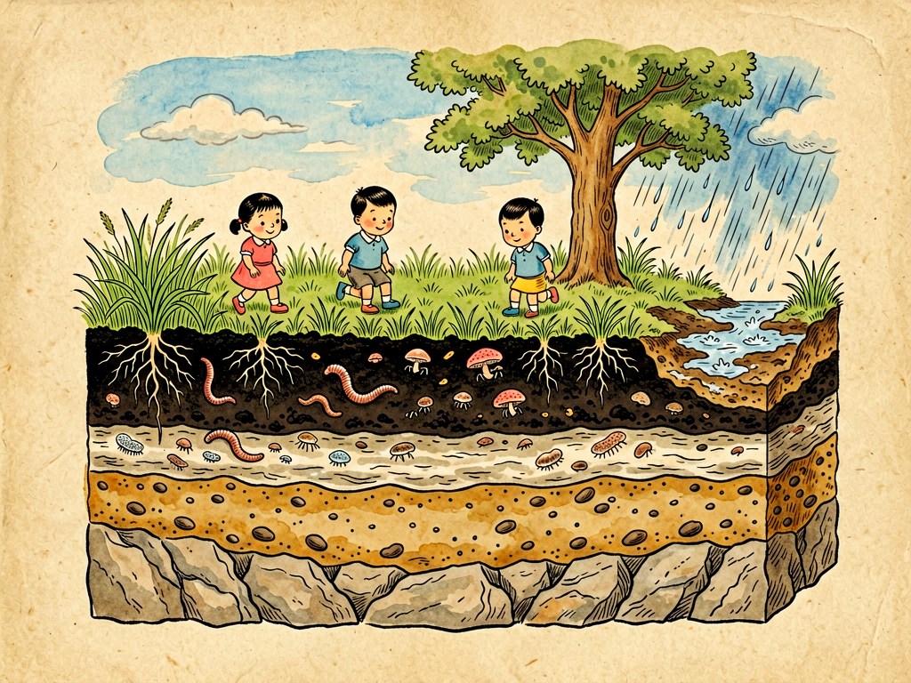

## 第十七章 土壤世界

---

### 📍 本章导航
**核心主题**：我们每天都踩在泥土上，但是大多数人从来不会低头认真看看脚下的土。我们觉得土就是脏乎乎的灰，没什么了不起，但是你要知道：我们吃的每一口粮食、蔬菜、水果，都是从土里长出来的；我们穿的棉花、麻，盖房子用的木材，也都是从土里长出来的；陆地上几乎所有的生命，最终都依赖土壤才能生存。土壤不是死的泥巴，它是一个活的世界——一克健康的土壤里，有几十亿个细菌、几百万个真菌、成千上万的原生动物和线虫，还有蚯蚓、蚂蚁各种小虫子在里面钻来钻去，它们和矿物质、有机质、水、空气一起，组成了地球最珍贵的皮肤。几百年才能长出一厘米厚的表土，一场暴雨就能把它冲走；土壤是地球给人类最宝贵的财富，也是最容易被我们忽略的财富。历史上很多文明的衰落，都是因为他们把脚下的土地糟蹋坏了，土地长不出粮食，文明也就跟着崩溃了。这一章我们就低下头，好好看看脚下这个被我们踩了一辈子，却从来没有认真了解过的土壤世界。  
**你将发现**：
- 土壤不是岩石碎了之后的粉末，它是岩石经过成千上万年的风化，再加上生物的作用，慢慢"长"出来的活的系统：白天热晚上冷，岩石热胀冷缩慢慢裂开；水渗进裂缝里结冰膨胀，把岩石撑碎；风吹、雨淋、水流打磨，把大石头变成小石头，小石头变成沙子和黏土；然后地衣、苔藓这些先锋生物长上去，分泌酸进一步分解岩石，它们死了之后留下有机质，慢慢的就有了真正的土壤——能长植物的土壤。形成一厘米厚的表土，平均需要200到1000年，也就是说你脚下踩的薄薄一层土，可能比我们中国五千年文明的历史还长。
- 健康的土壤大概是一半固体一半孔隙：固体部分里95%是矿物质（沙子、 silt、黏土，就是岩石磨碎的颗粒），5%是有机质——就是动植物残体腐烂之后形成的腐殖质，黑黝黝的，是土壤肥力的核心；孔隙一半装水一半装空气，这样植物的根既能喝到水，又能呼吸。土壤不是越细越好，也不是越松越好，最好的土壤是壤土，沙粒、粉粒、黏粒比例合适，透气性好，保水保肥能力强，长庄稼最好。
- 土壤是一个热闹的生命世界，根本不是死的：
  - 细菌和真菌是分解者，把动植物残体分解成植物能吸收的养分，有的细菌还能固定空气中的氮气，变成植物能用的氮肥；
  - 真菌和植物的根形成菌根，真菌的菌丝特别细，能伸到根伸不到的地方，帮植物吸收水和磷等养分，植物给真菌提供糖分，两者是共生关系；森林里的树甚至能通过菌丝网络互相传递养分和信号，被称为"树联网"；
  - 蚯蚓是土壤的"犁"，它们在土里钻来钻去，打洞让土壤透气透水，把落叶有机质拖进土里吃掉，排出来的蚓粪是最好的天然肥料，达尔文晚年专门研究蚯蚓，说蚯蚓是地球上最有价值的动物，整个英国的表层土，每过几十年就会被蚯蚓整个翻一遍；
  - 还有线虫、螨类、跳虫、蚂蚁、鼹鼠各种小动物，它们在土里活动，吃别的生物，被别的生物吃，形成了一个完整的食物网，让土壤保持活力。
- 中国不同地方有不同的土壤：东北的黑土最肥沃，因为那里冷，有机质分解慢，千百年积累下来厚厚的黑土层，"一两黑土二两油"，是我们的大粮仓；南方的红壤黄壤，因为高温多雨，养分被淋洗掉了，铁铝多所以发红，酸性强，需要改良才能长好庄稼；黄土高原的黄土土层厚，但是土质疏松，植被破坏之后容易水土流失，被冲出千沟万壑；长江流域的水稻土，是人类几千年种水稻水耕熟化慢慢培育出来的特殊土壤，能种水稻养活着几亿人。
- 土壤现在面临很多危机：水土流失（植被破坏之后，暴雨把表土冲走，黄土高原就是典型）、土地荒漠化（过度放牧、过度开垦，草原变成沙漠）、土壤板结（长期用化肥，不施有机肥，土壤结构被破坏，硬得像砖头，根扎不下去，水也渗不进去）、土壤污染（重金属、农药、工业污染，种出来的粮食带毒）、有机质下降（长期只种不养，土壤里的腐殖质越来越少，地越来越"瘦"）。这些问题都是慢问题，不像洪水地震一下子就能看见，但是几十年上百年积累下来，就能毁掉整个文明的根基。
- 这一章最深刻的洞见：土壤是文明的根基。所有的古代文明都起源在土壤肥沃的大河流域：古巴比伦在两河流域，古埃及在尼罗河，古印度在印度河恒河，古中国在黄河长江。但是很多文明最后衰落了，一个重要原因就是他们不懂得保护土壤：过度灌溉导致土壤盐碱化，过度开垦导致水土流失，土地长不出足够的粮食，文明就撑不住了。我们中国文明能延续几千年，很重要的一个原因是我们的老祖宗懂得用地养地，轮作、施有机肥、修梯田、种绿肥，种了几千年地，土壤还能保持肥力。但是现在我们用化肥农药几十年，很多地方的土壤已经出问题了，保护土壤，就是保护我们自己和子孙后代的饭碗。健康的土壤不只是能长粮食，它还能存水（减少洪水）、固碳（帮助应对气候变化）、维持生物多样性，是地球生态系统最重要的组成部分。

**阅读建议**：下次你去郊外或者公园的时候，蹲下来挖一点土看看，你会发现表层的土颜色深，发黑，有草根和落叶，越往下颜色越浅；抓一把攥一下，能成团不散就是好土；仔细看，说不定还能看到小虫子、蚂蚁、蚯蚓爬来爬去——这就是我们整个文明立在上面的世界。

---

### 🖋️ 经典原文

我们每天都在地上走，脚下踩的就是土，可是有多少人真正低头看过一眼土呢？
大多数人觉得土就是脏乎乎的泥巴，是死的，没用的时候嫌它脏，种地的时候才想起它。可是你要知道，我们每个人每一天的生活，每一口吃的，每一件穿的，最终都来自这层看起来毫不起眼的土。没有土，就长不出庄稼，长不出树，长不出草，就没有牛羊，没有我们人类，陆地上就什么生命都没有。
土壤不是从来就有的。地球刚形成的时候，到处都是光秃秃的岩石，没有一点土。土是岩石和生命一起，花了几千万年几亿年慢慢做出来的。
白天太阳晒着，岩石表面热得膨胀，晚上冷了收缩，外面和里面胀缩不一样，时间长了岩石表面就裂开缝；下雨的时候水渗进缝里，冬天水结冰体积变大，就像无数个小楔子，把裂缝撑得越来越大，大块石头碎成小块；风吹着沙粒打在岩石上磨，河水带着石头滚，互相撞击打磨，过了成千上万年，大石头变成小石头，小石头变成沙子，沙子变成更细的粉粒和黏粒——但是这还不是真正的土壤，这只是岩石的粉末，是成土的母质，还长不好庄稼。
真正让石头变成土壤的是生命。
最先来的是地衣和苔藓，它们能在光秃秃的石头上生长，分泌出有机酸，一点点把石头表面溶解出营养，它们死了之后，身体腐烂留下一点点有机质；然后来了蕨类、草本植物，它们的根钻到石头缝里，把石头撑得更碎，每年枯掉的茎叶腐烂，积累更多腐殖质；然后小虫子、细菌、真菌也来了，它们分解有机质，改造土的结构；蚯蚓也来了，在土里钻洞，把落叶拖下去吃掉，把土翻松。就这样，一千年，一万年，几十万年过去了，岩石粉末和有机质、水、空气、无数的小生命混合在一起，终于变成了能长大树、长庄稼的，有生命的土壤。
你知道吗？形成一厘米厚、能种庄稼的表土，平均需要两百年到一千年的时间。也就是说，你现在脚下踩的那薄薄一层十几厘米厚的黑土，可能花了几千年才长出来，比我们中华民族五千年的文明历史还要长。但是要破坏它，几场暴雨、几年不合理的开垦就能做到。土壤是几乎不可再生的资源，是地球给我们最珍贵的遗产。
你可别以为土壤是死的泥巴，它是一个热闹得不得了的生命世界。一克健康的菜园土，就是你小指甲盖挑起来那么一点点土，里面有多少生命呢？有几十亿个细菌——比整个地球上的人还多；有几百万个真菌，长长的菌丝在土里缠来缠去；有几万到几十万个原生动物，还有几千条线虫、螨类、跳虫；挖一平方米的草地，你可能能找到几十条蚯蚓，几十上百个蚂蚁，还有各种其他小虫子。它们在土里吃喝拉撒、生老病死、钻来钻去，一刻也不闲着。
这些小生命可不是白住在土里的，它们是土壤的工人，是土壤活的灵魂：
细菌和真菌是分解工，落在地上的树叶、死掉的动物、植物的残根，全靠它们分解腐烂，变成植物能吸收的养分，要是没有它们，地球上早就堆满了动植物尸体，养分全被锁在尸体里，新的植物长不出来，所有生命都得饿死。有的细菌还有特殊本事，比如根瘤菌，长在豆科植物的根瘤里，能把空气里氮气变成植物能吸收的氮肥，所以种大豆不用施太多氮肥，种完大豆地还会变肥。
真菌还会和植物的根合伙过日子，这就是菌根。真菌的菌丝比植物根细得多，能伸到根伸不到的小缝隙里，帮植物吸收更多的水和磷、钾这些养分，植物把自己光合作用造的糖分分给真菌吃，两者互相帮助。更神奇的是，森林里不同树的菌根菌丝能连在一起，形成一张地下的大网，大树能通过这张网给小树养分，甚至被虫子咬了还能通过网给旁边的树发信号，让它们提前准备防御，科学家把这叫做"树联网"——原来森林里的树不是各长各的，它们在地下是连在一起的一个整体。
蚯蚓是土壤里的农夫和建筑师，达尔文晚年花了四十年时间研究蚯蚓，写了一本关于蚯蚓的书，他说蚯蚓是地球上最有价值的动物。蚯蚓每天在土里钻来钻去，打出无数小洞，让空气和水能顺利渗进土里，根能轻松扎下去；它们把落叶、枯草拖进洞里吃掉，消化之后排出来的蚓粪，是最好的天然肥料，团粒结构特别好，养分又全；达尔文算过，英国土地上的蚯蚓，每年每英亩能翻出十几吨蚓粪，也就是说，每过几十年，整个表层土壤都会被蚯蚓整个翻一遍，把底下的土翻上来，把上面的有机质拖下去，没有蚯蚓，土壤会板结、僵硬，根本长不好东西。
你看，土壤哪里是死的，它是地球有生命的皮肤，里面有无数小生命在工作，在循环，在呼吸。
健康的好土壤是什么样的？它不是全是细泥，也不是全是沙子，而是沙粒、粉粒、黏粒比例合适，加上丰富的有机质，形成大大小小的团粒结构——小土团之间有大孔隙，能透气排水，土团里面有小孔隙，能存水保肥，浇了水能渗进去不涝，旱了能保住水不旱，根扎进去又松又软，养分又足，这样的土才能长出好庄稼。我们东北的黑土就是最好的土，那里气候冷，有机质分解慢，千百年草的根茎腐烂积累下来，形成了厚厚的黑土层，有机质含量高，黑得流油，"一两黑土二两油"，插根筷子都能发芽，是我们国家的大粮仓。
我们中国地大物博，不同地方的土也不一样：东北是黑土，华北是黄土/棕壤，南方高温多雨，土里的养分都被雨水冲走了，剩下很多铁铝，所以是红色的红壤，酸性大，需要施石灰改良，多施有机肥才能长好庄稼；西北是干旱地区的漠土，盐碱大；长江流域种了几千年水稻，形成了特殊的水稻土，是我们的老祖宗人工培育出来的高产土壤，养活了一代又一代中国人。
但是现在，我们脚下的土壤正在生病。
很多人以为土是取之不尽用之不竭的，使劲糟蹋它：山上的树砍光了，草啃光了，没有植被保护，一场暴雨下来，表层的肥土就被水冲走了，剩下光秃秃的石头，这就是水土流失，黄土高原就是这样，几百年时间被冲出了千沟万壑，每年十几亿吨泥沙冲进黄河；在草原上过度放牧，草被吃光了，土被风吹走，慢慢就变成了沙漠，这就是荒漠化，沙漠每年都在吞噬我们的良田；农民种地只施化肥，不施有机肥，几十年下来，土壤里的有机质越来越少，团粒结构被破坏，土板结得硬邦邦的像砖头，根扎不下去，水渗不进去，地越来越"馋"，越施化肥产量越低，还污染地下水；还有工厂排污、矿山开采、农药滥用，把重金属和有毒物质排进土里，土被污染了，长出来的粮食就带毒，吃了会生病。
这些问题不像地震洪水那样一下子就死人，它们是慢慢发生的，一年流失一毫米土，你看不出来，一百年就流失了十厘米，几百年就能把沃土变成石头地；有机质一年减少一点，你感觉不到，几十年后地就再也长不出好庄稼了。历史上很多古老文明就是这么灭亡的：古巴比伦王国在两河流域，那里曾经土地肥沃，是农业发源地，但是他们过度灌溉，不排盐，地下水位上升，土壤盐碱化，最后地里长不出庄稼，文明也就衰落了；玛雅文明在中美洲，人口太多，过度开垦坡地，水土流失严重，土地养不活那么多人，最后城市被抛弃，文明崩溃。
文明有多高，都得站在土上。没有健康的土壤，再高的楼、再快的车、再先进的科技，都是空中楼阁，因为人总得吃饭。我们中国文明能延续几千年，和我们老祖宗懂得养地是分不开的：我们老祖宗种地，从来不是只索取不回报，他们会施粪肥、堆肥，把所有有机废物回到田里；会轮作倒茬，今年种稻明年种麦，豆科粮食轮作，让地休息；会修梯田，在坡地上一层一层修平了种，不让水土流走；会种绿肥，长草了翻到土里当肥，种了几千年，地还能种。
现在我们有了化肥农药，产量提高了很多，但是也不能忘了老祖宗的智慧，不能只管眼前高产，把子孙后代的地都糟蹋了。现在我们提倡保护性耕作：少翻地，秸秆还田，多施有机肥，轮作休耕，坡地退耕还林还草，治理污染土壤，就是要把我们的土地养好，让它能一直长出好庄稼，养活我们的子子孙孙。
土壤不只是用来种庄稼的，它还有很多大用：它是地球最大的碳库之一，土里存的碳比大气和所有植物加起来还多，保护土壤能把二氧化碳存在土里，帮助应对气候变化；它像海绵一样，下雨的时候吸水存水，减少洪水，旱的时候慢慢释放水，调节径流；它还是最大的生物多样性宝库，几乎所有微生物、小型动物都在土里生活，是地球生态系统的基础。
小朋友们，下次你走在路上，不要觉得脚下的土脏，不要随便挖它糟蹋它。这层薄薄的土，是地球花了几亿年才造出来的，是我们所有生命的母亲。我们敬畏土地，就是敬畏生命，就是敬畏我们自己的文明。
下一章，我们讲水的改造。

---

> 📜 **科学史话：土壤学的诞生——从看见土到理解土**
>
> 人类种了几千年地，但是真正把土壤当成一门科学来研究，是近一百多年的事。在这之前，大家都以为土壤就是岩石碎了之后的粉末，能给植物提供矿物质养分，只要施化肥就能让作物长好。
>
> 现代土壤学的创始人，是俄国科学家道库恰耶夫。19世纪末他在俄国做土壤调查，发现土壤不是随便堆起来的岩石粉末，而是一个独立的历史自然体，是母质（岩石）、气候、生物、地形、时间五个因素共同作用形成的，不同地方有不同的土壤类型，就像不同地方有不同的植物和动物一样。他提出了土壤剖面的概念——挖一个土坑看下去，土壤是一层一层的：最上面是腐殖质层，黑黑的，有很多根和有机质；往下是淋溶层，养分被水冲下去了；再往下是淀积层，上面冲下来的养分在这里沉积；最下面是母质层和岩石。每一层都记录了这个地方土壤形成的历史。道库恰耶夫第一次让人们意识到，土壤本身就是一个值得研究的复杂系统，而不只是种东西的介质。
>
> 比他更早，我们中国古代就有非常丰富的土壤学知识。两千多年前的《禹贡》就把中国各地的土壤分成了九等，根据不同土壤等级收税；我们的老祖宗很早就懂得用堆肥、粪肥、轮作、种绿肥、修梯田来养地保持水土，几千年耕种土地肥力不下降，这在世界农业史上都是奇迹。
>
> 达尔文晚年对蚯蚓的研究也非常重要，他花了四十年时间观察蚯蚓，通过实验证明蚯蚓能翻土、改良土壤结构、增加肥力，第一次让人们意识到土壤里的小动物对土壤形成和肥力的重要作用——原来土里的小生命不只是住在里面，它们还在主动创造土壤。
>
> 到了20世纪，人们又进一步发现了土壤微生物和菌根的作用，意识到土壤是一个活的生态系统，而不只是一个装养分的容器。现代农业越来越重视土壤健康，不再只看施了多少化肥产了多少粮，而是看土壤的有机质含量、生物多样性、结构是不是健康，这才是可持续农业的基础。

---

> 🔬 **科学更新：保护性耕作、土壤碳汇与微生物组技术——现代农业如何养好土地**
>
> 过去几十年我们靠化肥农药提高了粮食产量，但是也带来了土壤退化的问题，现在科学家和农民一起，在找既能高产又能养地的新方法：
>
> **保护性耕作**：以前农民种地要深耕翻地，把土翻一遍，其实这样会破坏土壤结构，把有机质暴露出来分解掉，还容易造成水土流失。现在提倡少耕免耕，不翻地或者少翻地，把庄稼秸秆打碎了盖在土表（秸秆还田），既能保护土壤不被水冲风吹，还能增加有机质，蚯蚓和微生物也活得更好，时间长了土壤会越来越健康，产量还能提高，还能减少沙尘暴。现在东北黑土地保护就用这种方法，效果特别好。
>
> **土壤微生物组技术**：我们现在知道土壤里的微生物对作物生长特别重要，科学家现在在研究给土壤接种有益微生物——比如固氮菌、解磷菌、菌根真菌，就像给土壤补益生菌一样，能帮助植物吸收养分，减少化肥用量，还能提高作物抗病能力，未来可能会替代很多化肥农药。
>
> **土壤碳汇**：健康的土壤能储存大量有机碳，如果我们把全世界退化的土壤都改良，增加有机质含量，就能把大气里的二氧化碳固定到土里，这是成本最低、最有效的应对气候变化的方法之一，比很多工业碳捕集技术便宜得多，还能提高粮食产量，一举两得。现在很多国家都在做农田碳汇项目，农民把土地养好了，不仅能多打粮食，还能卖碳汇赚钱。
>
> **土壤修复技术**：对于被重金属、有机物污染的土壤，我们现在有很多修复方法：种特殊的超富集植物，把土壤里的重金属吸收到植物里，收走植物就能去掉污染；用特殊的微生物分解有毒污染物；或者用改良剂把重金属固定住，不让它被作物吸收。很多被污染的土地，经过几年修复就能重新变成安全的农田。
>
> 未来的农业，不再是向土壤索取，而是和土壤合作，把土壤照顾好，它才会持续给我们产出粮食。

---

> 🧪 **动手试一试：观察土壤分层+土壤里的小生命**
>
> 实验一：土壤分层实验
> 找一个透明的矿泉水瓶，装半瓶从郊外挖回来的土（最好是表层有草根的黑土，不要用花盆里买的营养土）；
> 往瓶子里加满水，盖上盖子，使劲摇晃几分钟，把土全部摇散成悬浊液；
> 然后把瓶子放在桌子上，静置一天不要动它；
> 第二天你会看到土壤分层了：最底下是最重的粗沙子，往上是细一点的粉沙，再往上是最轻的黏粒，最上面飘着一层黑色的东西，就是腐烂的树叶、草根这些有机质，水会慢慢变清。
> 你就能清楚看到土壤的不同组成部分了。如果是肥沃的好土，最上面那层有机质会比较厚；如果是贫瘠的土，有机质就很少。
>
> 实验二：观察土壤里的小生命
> 找一块阴凉湿润、长着草的地方，挖一小块表层土（大概拳头大，连带着一点落叶草根），放在一张白纸上；
> 用放大镜（或者手机放大功能）仔细观察，你会看到什么？
> 你可能会看到蚂蚁跑来跑去，看到小蜈蚣、螨类、跳虫这些小虫子跳来跳去，看到蚯蚓钻来钻去，看到细细的草根和菌丝；
> 把土稍微拨开，注意看，土里还有更多更小的生物，只是我们肉眼看不太清。你看到的这些小生命，只是土壤生命世界里的冰山一角，还有几十亿个细菌真菌你看不见，它们都在土里忙碌着。
> 观察完记得把土放回去，不要伤害这些小生命哦。

---

### 💬 读后思考与讨论

1. 为什么说形成一厘米土壤需要几百年，破坏它只需要几场暴雨？我们应该怎么保护表层土壤不被流失？
2. 有人说"只要多施化肥，不用管土壤健康，一样能打粮食"，你同意这个说法吗？为什么只施化肥不行，还要施有机肥、养蚯蚓？
3. 历史上很多文明衰落都和土壤退化有关，你觉得我们今天应该怎么做，才能避免重蹈覆辙？
4. 菌根和树联网是怎么回事？植物在地下是怎么互相帮助的？你觉得这对我们理解自然有什么启发？
5. 除了种粮食，土壤还有哪些重要作用？为什么说土壤是地球的皮肤？

### 🔗 关联阅读
- 第一部第十四章：《土壤革命》→ 细菌微生物在土壤物质循环里的核心作用
- 第二部第十三章：《地球的繁荣与土壤的劳动者》→ 土壤里的各种生物怎么支撑整个陆地生态
- 第三部第二十六章：《庄稼的朋友和敌人》→ 土壤里的养分、微生物和病虫害影响庄稼生长
- 跨章节思考：从岩石到土壤，从土壤到植物，从植物到动物到人，整个陆地生命系统的基础就是这层薄薄的土，所有生命最终都来自尘土，最后也归于尘土，土壤就是连接生死、连接过去未来的物质循环枢纽。
