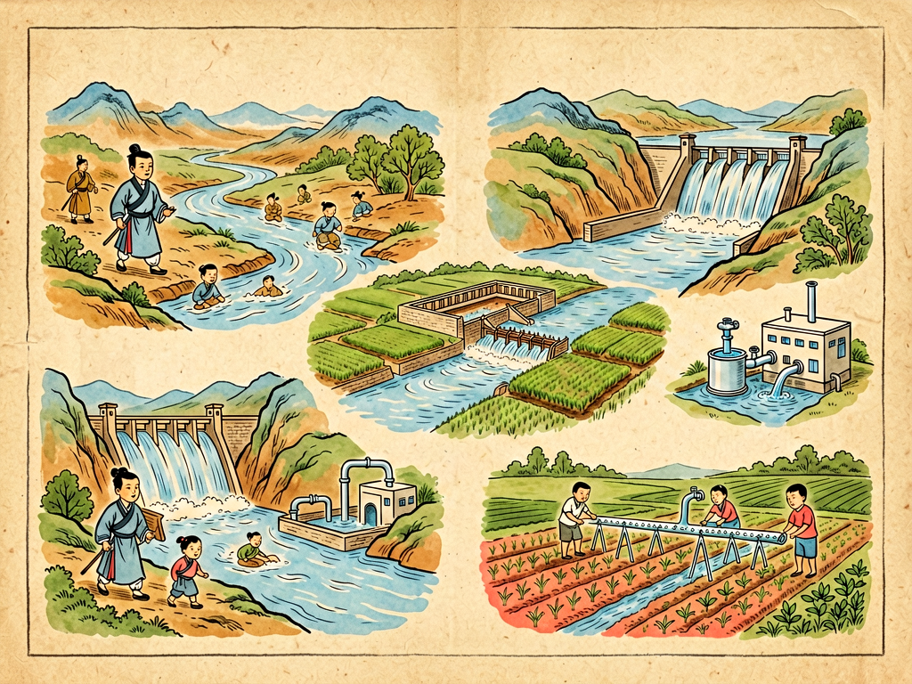

## 第十八章 水的改造

---

### 📍 本章导航
**核心主题**：水是生命之源，也是文明之源。所有古代文明都诞生在大河流域，因为水滋养庄稼、养活人口，能通航运输，但是水也会发洪水、会干旱、会传播疾病，会把整个城市冲走。人类几千年的文明史，很大程度上就是一部治水史——怎么驯服水、利用水、管理水，怎么和这个既温柔又暴躁的邻居相处。最开始人类对水是又怕又敬，发洪水了就跑，堵不住就躲；后来我们学会了修堤筑坝、挖渠引水，灌溉农田，防洪抗旱；再后来我们学会了净化水、处理污水，建起自来水和下水道系统，让城市人喝上干净水，人均寿命翻了一倍；到今天我们开始明白，水不是我们可以随便征服的敌人，而是要和它共生的伙伴，不能光堵，还要疏，不能光索取，还要节约和循环。从大禹治水到都江堰，从霍乱流行到现代净水厂，从三峡大坝到海绵城市，人类改造水的历史，就是我们文明成长的历史。这一章我们就来看看，人类是怎么一步步改造水，又怎么被水改造的。
**你将发现**：
- 水的脾气：水是最特殊的物质，它无色无味，能溶解几乎所有东西，比热大能调节温度，冰比水轻所以浮在水面保护水下生命；它永远在循环，蒸发上天变成云，下雨落到地上，汇成江河湖海，渗进地下，不停流动，从来不会老老实实待在一个地方。治水最难的地方就在这里——它是活的，是流动的，你不可能把它彻底按住。所以中国古人很早就懂了"堵不如疏"的道理，大禹治水就是因为他爹鲧用堵的方法治了九年没治好，他改用疏的方法，挖渠道把洪水引到海里，才成功治了水。
- 世界上最伟大的水利工程不是最高最厚的大坝，而是两千多年前李冰父子修的都江堰。它没有大坝，就是顺着岷江的地形，修了鱼嘴分水堤、飞沙堰溢洪道、宝瓶口进水口三个部分，自动把岷江分成内江和外江，枯水期六成水进内江灌溉成都平原，洪水期六成水从外江排走，还能自动把泥沙排出去，不用人天天管，修好了用了两千两百多年，直到今天还在灌溉上千万亩良田，让四川变成天府之国。它最厉害的地方不是和水硬对抗，而是顺着水的脾气引导它，这才是真正的治水智慧。
- 安全的自来水不是理所当然的，它是现代公共卫生最大的奇迹之一。19世纪的时候，欧洲城市没有下水道，污水粪便都倒在街上，流进河里，人们又从河里取水喝，所以霍乱、伤寒这些水传疾病反复爆发，一次霍乱就能死几万人。1854年伦敦霍乱，医生约翰·斯诺发现所有病人都喝同一个水井的水，证明了霍乱是通过被粪便污染的水传播的，人们才开始意识到干净饮用水的重要性。后来城市建起了过滤和消毒的自来水厂，修了下水道把污水排走处理，才彻底控制了水传疾病，城市人均寿命直接提高了一倍多。现在我们拧开水龙头就有干净水喝，这背后是一百多年公共卫生和工程技术的成果。
- 现代自来水是怎么净化的？河水或者水库水进了水厂，先加混凝剂，让水里的脏东西凝成大团沉淀掉；然后经过沙子过滤，去掉更小的杂质；最后加氯气或者臭氧消毒，杀死里面的细菌病毒，通过管道送到千家万户。我们排出去的生活污水也不是直接排进河里，要进污水处理厂：先过滤掉垃圾、沙子等大的固体，然后用微生物吃掉水里的有机污染物，再沉淀、消毒，处理干净之后才能排进河里，或者处理得更好一点变成再生水，用来浇花、冲厕所、工业冷却，甚至能喝。
- 农业是用水大户，占了人类用水量的70%。以前种地都是大水漫灌，水顺着地垄流，大部分都蒸发或者渗走了，非常浪费；现在有喷灌，像下雨一样均匀洒水；最厉害的是滴灌，用细管子把水一滴一滴直接送到植物根旁边，一点都不浪费，用水量只有漫灌的十分之一，还能减少盐碱化，以色列在沙漠里用滴灌技术，居然种出了大量蔬菜和水果，变成了欧洲的"菜篮子"。
- 防洪不是把洪水彻底挡住。再高的堤坝也有漫顶的时候，再大的水库也有装不下的时候，真正的防洪是给洪水出路：修水库存一部分洪水，修堤坝挡一部分，留好蓄滞洪区，水太大了就分一部分到专门的地方存着，不让它冲城市；还要修预警系统，提前告诉大家洪水要来了，及时撤离。现在城市提倡建海绵城市，就是让城市像海绵一样，下雨的时候能吸水、存水、渗水，减少内涝，存下来的水旱了还能用：多铺透水砖，多建绿地、湿地、蓄水池，让雨水尽量留在地下，而不是一下雨就顺着下水道全排走。
- 水不是无限的。地球上97%是海水，不能喝也不能浇地，剩下3%淡水大部分是冰川和深层地下水，真正能容易用的河水湖泊水，只占全球总水量的十万分之七。现在很多地方缺水：中国北方地下水超采，地下水位一年比一年低，地面都沉降了；很多河流被污染，有水不能用；气候变化让极端干旱和极端洪水越来越多。水的问题不是技术问题能完全解决的，它还是分配问题和公平问题：上游污染，下游遭殃；农业、工业、城市抢水用；谁该用多少水，怎么分配，这背后是制度和公平。
- 这一章最深刻的洞见："治水即治国"。要修大型水利工程，需要组织几万甚至几十万人一起劳动，需要跨地区协调，需要长期维护管理，这就要求有强大的社会组织能力和公平的分配制度。中国为什么能早早形成统一的大国家，和我们需要跨区域治水有很大关系——黄河长江都是大河，治水不是一个村一个县能搞定的，必须整个流域一起协调。反过来，一个国家治水能力怎么样，也能看出它的治理能力怎么样。到今天这个道理也没变：能不能保证所有人喝上干净水，能不能防洪抗旱，能不能处理好污水保护水环境，能不能公平分配水资源，就是一个社会文明程度最好的试金石。

**阅读建议**：你接一杯自来水，想想这杯水从哪里来——可能是几百公里外的水库，经过水厂净化，通过几千公里的管道流到你家；你冲完厕所的水，要经过污水处理厂好多天处理才能变干净，最后又回到河里。下次下雨的时候看看路边的积水，想想雨水最后流到哪里去了，我们的城市能不能把这些水留住。我们每天都在用水，但是很少认真想过水背后的整个系统。

---

### 🖋️ 经典原文

小朋友们，你们每天拧开水龙头就有干净的自来水流出来，渴了就喝，用了就排走，觉得这是天经地义的事；下雨的时候看着水流走，发洪水的时候看着水冲房子，觉得水是很普通甚至很讨厌的东西。可是你知道吗？我们人类文明，就是从和水打交道开始的。
世界上所有古老文明，都长在大河边：古巴比伦在幼发拉底河和底格里斯河边，古埃及在尼罗河边，古印度在印度河恒河边，我们中国在黄河长江边。为什么？因为人要吃饭，种庄稼需要水，大河定期泛滥，会给两岸带来肥沃的淤泥，水浇过的地才能长粮食，才能养活更多人，才能有城市、有文字、有文明。
可是水也是最不听话的。
它从来不会老老实实待在一个地方，它会流，会蒸发，会结冰，会涨潮，会泛滥。天旱的时候几个月不下雨，庄稼干死，人要渴死；下雨的时候连下几十天，河水暴涨，冲垮房子，淹没庄稼，淹死人和牲口。人类最早对水，是又爱又怕：爱它养育人，怕它发脾气。
最开始人治水，只会用笨办法——堵。发洪水了，就挖土堆堤坝，想把水挡住，可是水是堵不住的，你堵了这边，它就冲那边，堤坝越高，水涨得越高，最后一旦决口，冲得更狠。传说中国上古时候发大洪水，鲧治水治了九年，就是到处堵，堵来堵去洪水还是到处跑，最后失败了；他的儿子大禹接手，不堵了，改成疏——挖开河道，修通沟渠，顺着水往低处流的脾气，把洪水一步步引到海里去。他治水十三年，三过家门而不入，终于把洪水治住了，后来成了夏朝的开国君主。
"堵不如疏"，这四个字，是我们老祖宗用多少条人命换来的治水真理，不光治水，做很多事都是这个道理。
后来中国最伟大的水利工程，就是两千两百年前李冰父子在四川修的都江堰。那时候岷江一发洪水，成都平原就变成一片汪洋，旱的时候又没水浇地，老百姓苦不堪言。李冰没有修个大硬坝把岷江拦腰截断，而是顺着地形和水的流势，修了三个巧妙的工程：
第一个是鱼嘴，修在岷江江心，像个鱼脑袋，把岷江自动分成两股：西边的外江是主干道，用来排洪水，东边的内江窄一点深一点，把水引去灌溉；枯水期的时候，水少，六成水流进内江浇地；洪水期水大，水面变宽，六成水从宽的外江排走，自动调节水量，不用人管。
第二个是飞沙堰，在鱼嘴和宝瓶口之间，是个矮矮的溢洪道，内江的水超过一定高度，就会从飞沙堰漫回外江，更神奇的是，水流到这里打漩，会把泥沙石头甩过飞沙堰排到外江，不会把内江和灌溉渠堵了。
第三个是宝瓶口，是在玉垒山上凿开的一个窄口子，像个瓶子的口，控制进成都平原的水量，水多了被口子挡住，不会一下子都灌进平原，保证灌溉的水不多不少。
就这三个简简单单的设计，没有水泥钢筋，就是用石头竹子和木头修的，用了两千两百多年，直到今天还在工作，灌溉着一千多万亩良田，把经常闹灾的四川盆地变成了旱涝保收的天府之国。为什么都江堰这么伟大？因为它不跟水较劲，不跟水硬碰硬，而是摸透了水的脾气，顺着它引导它，让水自己给自己分流、排沙、灌溉，这才是最高明的改造——不是征服，是合作。
当然，人类改造水，不光是防洪灌溉，更重要的是让自己喝上干净的水。
一百多年前，世界上所有大城市都没有自来水，也没有下水道。人们喝水从河里、井里打，污水粪便就倒在街上，顺着水沟流进河里，下游的人又喝这河里的水。那时候霍乱、伤寒这些水污染传的病，每隔几年就爆发一次，一次就能死几万人，1854年伦敦霍乱，十天就死了五百多人。大家都以为是空气里的"瘴气"传染，直到一个叫约翰·斯诺的医生，挨家挨户调查病人住址，发现所有死人都住在宽街水井周围，都喝这口井的水，他说服大家把水井的把手拆掉，没人喝这口井的水了，霍乱很快就停了。大家这才知道，原来脏水里有看不见的细菌，喝了会生病。
从那以后，城市开始建自来水厂，把河里的水过滤、消毒，杀死细菌，通过管道送到每家每户；又建了下水道，把污水收集起来排走，处理干净再放回河里。就这两件事——干净的自来水和完善的下水道，让城市里霍乱伤寒几乎绝迹，人均寿命一下子提高了三十多岁，是现代医学出现之前对人类健康贡献最大的发明。你看，改造水，不只是修大坝挖河渠，让普通人喝上干净的水，处理好污水，对人命的意义更大。
到了今天，我们的技术比古时候厉害多了，我们能修像三峡那样的超级大坝，拦住长江的水，防洪、发电、通航；我们能打几千米深的井抽地下水；我们能修几千公里长的运河，把南方的水调到北方缺水的地方（南水北调）；我们还能把海水淡化，变成能喝的淡水，中东沙漠里的国家很多就靠海水淡化过日子；我们有滴灌技术，在沙漠里都能种出庄稼。
但是技术越厉害，我们越要小心，不能觉得人定胜天，想怎么改就怎么改。
以前我们觉得修坝越多越好，把所有河水都拦住存起来，后来发现修太多坝会截断河流，鱼洄游不了，下游泥沙少了，河床被冲刷，生态被破坏；以前我们觉得湿地荒滩没用，填了盖房子，后来发现湿地是天然的海绵，能存洪水，能净化水，填了湿地，一下雨城市就内涝；以前我们使劲抽地下水浇地，抽了几十年，地下水位降了几十米，地面都沉降了，再抽下去就没水了；我们把污水排进河里，觉得河大能冲走，结果很多河变成了臭水河，鱼虾都死了，有水也不能用了。
我们终于慢慢明白，水是一个循环的整体，你在上游排污水，下游就要喝脏水；你把地下水抽干了，子孙后代就没水用；你把河道全用水泥砌硬，水渗不到地下，一下雨就全淹。所以现在我们治水的思路又变了：从"征服水"变回"和水共生"。
比如现在修大坝，不再只想着发电防洪，还要留生态流量，保证下游河里一直有水，鱼能生存；比如治理污染，不再把污水排走就算完，而是建污水处理厂，处理干净再排放，还要建再生水系统，处理过的水再用来浇地、冲厕所、工业用，循环利用；比如城市不把所有河道都修成硬邦邦的水泥沟，而是恢复自然河岸，建湿地公园；我们建海绵城市，铺透水砖，建下凹式绿地，下雨的时候让水尽量渗到地下存起来，而不是赶紧排走；农业也不再大水漫灌，推广滴灌喷灌，能省一点是一点。
水是循环的，我们改造水，最后水都会回到我们这里。你善待它，它给你灌田浇地，给你干净水喝；你糟践它，它就给你发洪水，给你臭水，让你没水喝。
小朋友们，你可能会说，治水是大人的事，是政府的事，和我没关系。不对，每个人都是用水的人，每个人都能为保护水出一份力：刷牙的时候关水龙头，洗澡快一点，不往河里扔垃圾，少用含磷的洗衣粉，这些都是小事，但是十几亿人都这么做，就能省出好多水，少污染好多水。
我们这个星球看起来到处都是水，但是真正能让我们用的淡水少得可怜。地球总水量里97%是咸海水，剩下3%淡水里，70%是南极北极的冰盖，剩下的大部分是深层地下水，我们真正容易用的河水、湖泊水，只占全球总水量的十万分之七，比你喝的一杯水里的一滴水还少。就这么一点水，要养活全世界八十亿人，要浇地、要工业用、要维持生态，我们怎么能不珍惜？
人类文明起源于水，也终将取决于我们怎么对待水。下一章，我们讲衣料会议。

---

> 📜 **科学史话：人类治水的三个关键节点**
>
> 第一个节点：都江堰——顺势而为的治水哲学。公元前256年，李冰父子主持修建都江堰，没有大坝，没有现代机械，完全依靠对地形和水流规律的深刻理解，建成分水、排沙、控流三位一体的自动水利系统，两千多年不废，至今仍在使用，是世界水利史上的奇迹，代表了东方"天人合一"的治水智慧：不与自然为敌，而是顺应自然规律为我所用。
>
> 第二个节点：宽街水井事件——水与公共卫生革命。1854年伦敦霍乱大流行，主流观点认为霍乱是通过"瘴气"传播，约翰·斯诺医生通过细致的流行病学调查，将疫情源头锁定在宽街的一口被粪便污染的公用水井，移除井盖后疫情迅速平息。这是人类第一次科学证明水传疾病的存在，直接推动了现代自来水系统和城市下水道系统的建设，是公共卫生史上最重要的里程碑之一——在此之前，城市人均寿命不到30岁，在此之后不到一百年，人均寿命翻倍。
>
> 第三个节点：胡佛大坝与现代高坝时代。1936年美国胡佛大坝建成，221米高，是当时世界最高的混凝土坝，标志着人类进入了能大规模改造河流的现代水利时代。之后全球兴起建坝热潮，几十万座大坝拔地而起，为人类提供了大量电力和灌溉水源，但是也带来了移民、生态破坏、泥沙淤积等问题。20世纪末，人们开始反思高坝的代价，越来越多的国家开始拆坝，恢复河流生态，治水思路从改造自然转向人与自然和谐共生。
>
> 从堵到疏，从供水到卫生，从征服到共生，这三个节点，刚好就是人类对水的认知成长的三步。

---

> 🔬 **科学更新：现代治水新技术——从工程治水到生态治水**
>
> **膜技术净水**：现在最先进的净水技术用反渗透膜，膜上的孔只有0.1纳米大，比细菌小一百倍，比病毒小十倍，只有水分子能过去，其他杂质、盐、细菌、病毒、污染物全能挡住，用这种膜处理海水，能直接把海水变成纯净水，就是海水淡化；用来处理污水，出来的水能直接喝。现在膜技术越来越便宜，未来会让更多缺水地方能用上海水淡化和污水再生水。
>
> **海绵城市**：传统城市一下雨就把雨水赶紧通过下水道排走，结果雨太大就内涝，雨水也浪费了。海绵城市反过来做：让城市像海绵一样，下雨的时候能"吸水、蓄水、渗水、净水"，需要的时候再把存的水放出来用。具体做法是：人行道铺透水砖，让雨水渗到地下；绿地建得比路面低，让雨水流进绿地下渗存起来；建蓄水池、人工湿地公园存雨水；少建硬邦邦的水泥堤岸，恢复自然河道，让河水和地下水能交换。这样一来，大雨不内涝，雨水还能补地下水，一举多得。
>
> **智慧水务**：现在在水管网、河道、水库里装各种传感器，实时监测水量、水质、漏损情况，用AI调度：哪里漏水了马上发现，洪水来了提前预测水量，调度闸门和水库，供水精准调配，比以前人工管理效率高多了，还能省很多水。
>
> **生态修复治水**：以前治污水就是建污水处理厂，现在我们发现自然本身就是最好的净水器：种芦苇、香蒲这些水生植物，放螺蛳、鱼、微生物，建人工湿地，污水流过湿地，植物吸收氮磷，微生物分解污染物，沙子过滤脏东西，出来的水就变干净了，成本只有污水处理厂的几分之一，还能变成公园给人玩，比硬邦邦的水泥污水处理厂好看多了。
>
> 现在我们治水，不再是光靠钢筋水泥跟水硬刚了，而是越来越多靠自然的力量，用生态的办法解决生态问题。

---

> 🧪 **动手试一试：自制简易净水器+水土流失模拟实验**
>
> 实验一：自制简易净水器
> 找一个空的塑料矿泉水瓶，剪掉瓶底，倒过来，瓶口朝下；
> 按照从下到上的顺序往瓶子里放：最下面（瓶口处）放一层蓬松棉或者纱布，挡住上面的东西掉下去；然后往上依次铺一层小石子（过滤大的杂质）、一层沙子（过滤小一点的杂质）、一层敲碎的木炭（活性炭，吸附颜色和异味，用烧烤的木炭洗干净就行）、再一层沙子、再一层小石子，每层之间用纱布隔开；
> 把混了泥土、滴了红墨水的脏水慢慢从上面倒进去，看下面流出来的水是什么样的？你会发现流出来的水变清了，颜色也淡了！
> 这就是最简单的过滤和吸附净水，自来水厂的前几步净化，原理和这个是一样的。注意：这样过滤出来的水还不能喝，因为我们杀不死里面的细菌病毒，必须煮沸才能喝。
>
> 实验二：水土流失模拟实验
> 找两个一样的长方形塑料盒或者托盘，一端垫高点做成斜坡；
> 第一个盒子里装没有植物的松散泥土，弄平整；第二个盒子里装长着草的土皮（从小区或者郊外挖一块带草的土，不要破坏绿化哦），或者在土里撒点草籽长几天；
> 用喷壶或者洒水壶，从同样高度，洒同样多的水，模拟下雨，观察两个盒子流出来的水：
> 没有草的那个盒子，流出来的水是浑黄的，冲走了很多泥土，坡上冲出了小沟；
> 有草皮的那个盒子，流出来的水是清的，几乎没冲走什么土。
> 这就是为什么植被能保持水土，树和草的根能把土抱住，叶子挡住雨滴不直接打在土上，水也流得慢，能渗到土里，不会把土冲走。山上砍光树就会水土流失，发洪水，就是这个道理。

---

### 💬 读后思考与讨论

1. 为什么说都江堰是"顺应自然"的水利工程，它的智慧体现在什么地方？对比现代很多高坝，你觉得哪种思路更好？
2. 在自来水和下水道系统发明之前，城市为什么容易爆发霍乱、伤寒这些传染病？为什么说"干净的自来水是现代公共卫生最大的奇迹"？
3. 为什么说"堵不如疏"这个道理不光能用来治水，还能用在很多其他地方？举几个生活里的例子。
4. 什么是海绵城市？和传统城市治水思路有什么不一样？
5. 地球上水那么多，为什么还会缺水？我们小学生能为节约用水、保护水资源做哪些力所能及的事？

### 🔗 关联阅读
- 第一部第二章：《水的故事》→ 水作为细菌的摇篮和传播媒介，水和生命起源的关系
- 第二部第七章：《水的清浊》→ 水的净化、细菌和水污染的关系
- 第三部第二十五章：《衣料会议》、第二十七章《光和色的表演》→ 水在工业、农业生产里无处不在的用途
- 跨章节思考：从灰尘旅行到土壤，再到水，我们讲的都是支撑文明的最基础的东西——看不见的微生物，脚下的土壤，流来流去的水，这些最不起眼、最平常的东西，恰恰是文明最重要的根基。改造自然最忌讳的就是傲慢，觉得人能征服一切，对水、对土、对自然保持敬畏，懂得顺势而为，懂得共生而不是征服，才是长久之道。
