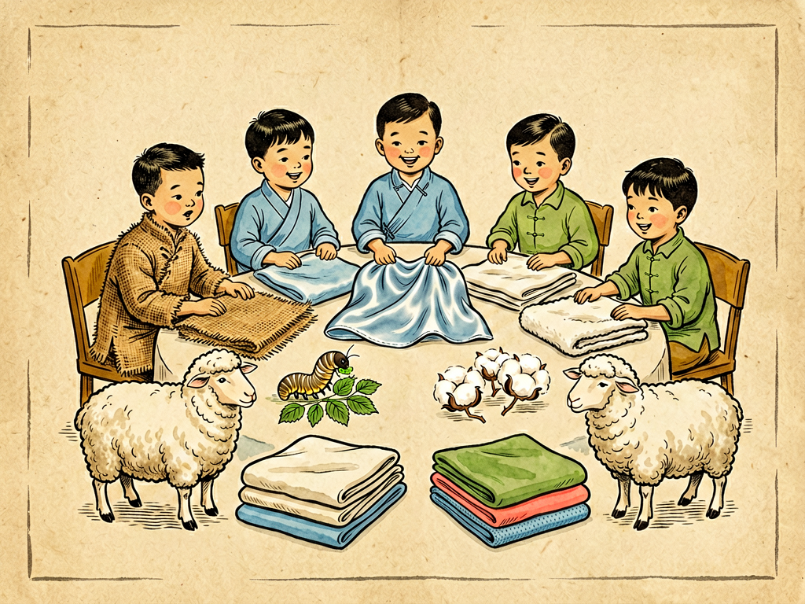

## 第十九章 衣料会议

---

### 📍 本章导航
**核心主题**：我们每天都要穿衣服，但是很少有人想过，我们身上穿的这件衣服是怎么来的。人是所有动物里唯一会自己给自己做"第二层皮肤"的动物——我们没有厚厚的毛皮御寒，没有锋利的爪子防身，但是我们能把兽皮、麻、棉、丝、毛，还有后来用化学方法造出来的纤维，织成布做成衣服，穿在身上，适应从北极到赤道所有气候。不同的衣料就像不同性格的朋友：棉透气亲肤，麻凉爽挺括，丝华丽柔软，毛保暖厚实，化纤结实耐穿有弹性，它们各有各的脾气，各有各的用处，聚在一起开个会，讲一讲自己的故事，你就会发现，一件看起来普普通通的衣服，背后是几千年人类文明的进步，是植物动物和化学工业的结晶，是贸易路线，是工业革命，甚至改变了整个世界的格局。这一章我们就来参加这场衣料的会议，听听它们各自怎么说。
**你将发现**：
- 最早的衣服是兽皮和树叶，原始人打猎得到兽皮，披在身上御寒，这就是最古老的衣服。后来人类学会了种麻、养蚕、种棉花、养羊，才有了真正的纺织布。四种最古老的天然纤维，刚好来自植物和动物：麻和棉是植物纤维，丝和毛是动物纤维，它们各有各的特点，没有绝对的好坏，只有适合不适合：
  - **麻**是人类最早用的纺织纤维，中国人在六千多年前就开始种麻织布了，麻的纤维挺括，透气散热快，出汗不粘身，夏天穿最舒服，但是比较硬，穿久了容易皱；
  - **丝**是中国人发明的，传说五千年前嫘祖发现蚕吐丝，教大家养蚕缫丝织绸，丝绸又轻又软，有漂亮的光泽，穿起来特别舒服，是古代最贵重的衣料，古罗马人把丝绸叫做"东方的美丽织物"，和黄金一样贵，为了运丝绸打通了丝绸之路，连接了东西方文明；
  - **棉**是现在最常用的天然纤维，元朝的时候黄道婆改进了棉纺织技术，棉布才开始在中国普及，棉柔软、吸汗、亲肤，不扎人，价格便宜，不管内衣外衣都能用，是最亲民的衣料；
  - **毛**主要是羊毛，还有羊绒、兔毛，保暖性特别好，因为羊毛纤维是空心的，能锁住很多空气，空气是热的不良导体，所以羊毛衣服冬天穿特别暖和，游牧民族最早用羊毛做衣服。
- 所有天然纤维，本质上和我们的头发、指甲、植物的细胞壁一样，都是长链的高分子。纤维要变成布，先要纺成线：把短纤维捻在一起，变成结实的长线，这就是纺纱；然后用织机把经线纬线纵横交错织起来，就成了布。从手纺车到珍妮纺纱机，从手工织布机到动力织机，纺织业是工业革命最先爆发的行业——因为大家都要穿衣服，对布的需求最大，最早的蒸汽机就用在纺织厂里，纺织业的革命直接拉开了现代工业的序幕。
- 20世纪化学工业发展之后，人类造出了自然界本来没有的化学纤维，彻底改变了衣料世界：
  - 第一种合成纤维是1935年发明的尼龙（锦纶），结实耐磨，弹性好，刚发明的时候用来做降落伞和丝袜，当时尼龙丝袜上市，全美国女性排队抢购，比现在抢新款手机还疯狂；
  - 后来又有了涤纶（的确良），挺括不容易皱，干得快，不用熨烫，七八十年代中国谁家有件的确良衬衫，都是很时髦的事；
  - 还有腈纶，蓬松保暖，像羊毛，叫"人造羊毛"；氨纶（莱卡）弹性特别好，能拉长五六倍还弹回去，做运动服、紧身衣、牛仔裤都离不开它。
  化纤的好处是结实、便宜、好打理、性能可以设计，坏处是大部分不吸汗，不透气，穿起来闷，容易起静电。
- 现在我们穿的衣服，很少是纯一种纤维的，大多是混纺：比如棉加涤纶，既有棉的吸汗舒服，又有涤纶的挺括不容易皱；毛加腈纶，既有羊毛的保暖，又便宜耐穿不容易虫蛀。不同纤维混在一起，取长补短，做出来的衣服更好穿。
- 现代的高科技衣料更厉害：有防水透气的Gore-Tex面料，水泼不进去，但是汗气能排出来，做户外冲锋衣最好；有速干面料，出汗之后很快干，不会贴在身上着凉；有防晒面料，能挡住紫外线；有抗菌面料，不容易臭；还有智能面料，织进去传感器，能测心率、体温，甚至能自己发热制冷；航天服、消防员的防火服、医生的防护服、潜水员的潜水服，都是特殊的高科技衣料，已经不只是遮体保暖，更是功能性的装备。
- 这一章最深刻的洞见：衣服是人的第二层皮肤，也是文明的镜子。一件衣服从纤维到成衣，背后是农业（种棉、养蚕、养羊）、工业（纺纱、织布、染色、缝制）、全球贸易（棉花从美洲运到欧洲，丝绸从中国运到罗马，现在衣服在东南亚生产卖到全世界）。我们买一件几十块钱的便宜T恤，背后可能是棉农种棉花用了大量水（生产一件纯棉T恤要用2700升水，够一个人喝两年半），是印染厂排出的污水，是工厂工人的劳动，最后穿几次扔了，变成垃圾填埋或者焚烧，造成污染。快时尚让衣服越来越便宜，但是环境代价也越来越大。现在大家开始提倡可持续时尚：买少一点，买好一点，穿久一点，旧衣回收，用再生面料（比如用塑料瓶做的化纤面料），这是未来的方向。我们穿在身上的不只是布，也是我们对世界的态度。

**阅读建议**：回家看看你身上穿的衣服的标签，上面写着面料成分，棉占多少，涤纶占多少，氨纶占多少——这就是这件衣服的"配方"，不同的配方决定了它穿着舒服不舒服，耐不耐穿，该怎么洗。你还可以找件旧衣服，拆几缕线烧一烧，看看是天然的还是化纤的，后面动手实验会教你怎么做。

---

### 🖋️ 经典原文

有一天，人体皮肤上面开了个热闹的会议，来开会的都是大家穿了几千年的衣料朋友们，它们坐在一起，各自讲自己的来历和本事。
第一个站起来发言的是麻先生，他穿一身朴素的绿灰色衣服，挺括爽利，说话声音响亮：
"我是你们人类最早的老朋友，六千年前你们的祖先还在新石器时代，就知道把我的皮剥下来，泡在水里沤烂，把纤维拆出来纺线织布，做衣服穿。我长在地里，不挑地方，一年就能长一人多高，我的纤维直，透气，散热最快，出汗马上就干，贴在身上不粘腻，三伏天穿我做的衣服，比什么都凉快。古时候的老百姓夏天都穿我，就是我性子有点硬，穿久了容易皱，不如别的朋友软和，但是我结实，耐磨，便宜，种我不占好地，穷苦人穿我最实惠。"
麻先生刚坐下，丝小姐就轻飘飘地站了起来，她穿着一身流光溢彩的绸缎衣服，走路都带风，声音软和：
"我出生在中国，是蚕宝宝吐出来的。五千年前嫘祖娘娘发现蚕能吐丝，教大家养蚕、缫丝、织绸，才有了我。我的纤维最细最长，又轻又软，有珍珠一样的光泽，摸起来滑溜溜的，穿在身上轻得像没穿一样，冬暖夏凉，是所有衣料里最华贵的。古罗马的贵族见了我，把我和黄金等价，为了买我，商人们骑着骆驼穿过沙漠，走出了一条丝绸之路，把东方的文明传到了西方。我以前只有皇帝贵族穿得起，现在普通人也能穿丝绸衣服了，就是我娇贵，容易勾丝，不能使劲搓洗，需要好好照顾。"
丝小姐刚坐下，棉大嫂胖胖乎乎地站起来，一脸和气：
"我虽然来得晚，但是现在我可是大家最离不开的朋友。我是棉花的种子纤维，白花花的长在棉桃里，宋朝元朝的时候黄道婆婆婆改进了纺棉织布的技术，我才在中国普及开来。我性子最温和，软乎乎的，最亲皮肤，吸汗透气，不扎人，不管是内衣、外衣、床单、被子，用我都最合适，价格也便宜，不管穷人富人都穿我。以前大家穿的粗布棉袄、棉布衬衫，现在的T恤、牛仔裤、内衣袜子，大多都有我。我就是太容易皱，洗了要熨，穿久了容易磨破，但是我舒服啊，大家贴身都爱穿我。"
棉大嫂话音刚落，毛爷爷穿着厚墩墩的毛衣站起来，声音浑厚：
"我来自动物身上，最常见的就是绵羊身上的羊毛，还有山羊绒、牦牛绒、兔毛。我们的纤维是空心的，里面能锁住空气，空气不传热，所以我最保暖，冰天雪地里穿我，风刮不透，寒气进不来，比什么都暖和。游牧民族天天穿我做的皮袄毛衣，零下几十度也冻不着。我还有个好处，不用怎么洗，拍一拍晒一晒就蓬松了，耐穿得很，一件毛衣能穿十几年。就是我有点扎人，有的人穿了痒，还容易被虫蛀，洗不好会缩水，但是冬天缺了我可不行。"
这四个老朋友刚说完，门口进来了几个穿得五颜六色、精神抖擞的年轻人，它们是化学纤维家族的，带头的是尼龙：
"各位老前辈好，我们是人类在实验室和工厂里造出来的新纤维，我们出生才不到一百年，但是现在已经占了全世界衣料的一大半了。我是尼龙，也叫锦纶，我最结实耐磨，比同样粗的钢丝还结实，弹性又好，刚发明的时候用来做降落伞、轮胎帘子线，后来做丝袜、运动服、外套，怎么穿都不容易坏。"
后面站着涤纶，也就是大家常说的"的确良"，它挺括地站着，一点褶皱都没有："我是涤纶，我最不容易皱，洗了干得快，不用熨烫，做出来的衬衫笔挺，裤子有型，七八十年代谁要有件的确良衬衫，那是最时髦的事。我和棉大哥混纺，取长补短，既有棉的舒服，又有我的挺括耐穿，现在大部分衣服里都有我。"
腈纶也抢着说："我像羊毛，蓬松保暖，便宜，不容易虫蛀，大家叫我'人造羊毛'，做毛衣、毛毯最好。"
氨纶在旁边一蹦老高："我弹性最好，能拉五六倍长，一松手就弹回去，做运动服、紧身衣、牛仔裤、袜子，加了我就有弹性，穿着合身不勒，行动方便。"
大家你一言我一语，都说自己的本事大，最后还是皮肤老伯伯出来打圆场：
"好了好了，大家都有本事，没有谁最好，只有谁最合适。夏天穿麻，冬天穿毛，贴身穿棉，出席重要场合穿丝绸，做运动服、户外衣服用化纤，大家各有各的用处，互相配合取长补短，才能让人穿得舒服、穿得暖和、穿得好看。人类从披兽皮树叶到今天有这么多衣料可以选，是你们大家一起陪着人类走了上万年，是你们给人类做了第二层皮肤，帮人类走遍了全世界，不管冷的热的地方，都能生存下去。"
这场会议还没开完，新的衣料朋友还在不断被发明出来：防水透气的冲锋衣面料，能挡住紫外线的防晒衣，能杀菌的医用防护服，能测体温的智能衣服……未来，还会有更多新的衣料朋友加入进来，给我们做更好的第二层皮肤。
下一章，我们讲食物的旅行。

---

> 📜 **科学史话：衣料改变世界的三个故事**
>
> **第一个故事：丝绸之路。** 丝绸是中国的独门绝技，从西汉开始，中国的丝绸通过河西走廊、中亚，一直运到古罗马，一两丝绸换一两黄金，这条商路就叫丝绸之路。丝绸不只是商品，它把中国的造纸术、火药、印刷术传到西方，也把西方的葡萄、苜蓿、佛教带到中国，是古代东西方文明交流最重要的通道，连"中国"这个名字，在古希腊语里就是"丝国"的意思。丝绸这薄薄的布料，居然连接了整个欧亚大陆。
>
> **第二个故事：棉花与工业革命。** 18世纪之前，棉布是很贵的，因为手工纺纱织布太慢，一个纺工一天纺的线，只够织一点点布。后来织工哈格里夫斯发明了珍妮纺纱机，一个人能同时纺八根线，后来又有了水力纺纱机、骡机，最后瓦特改良的蒸汽机最先用在纺织厂里，一个工厂一天织的布，比以前几万人手工织的还多。布变便宜了，普通人也能穿得起干净的棉布衣服了。但是为了种棉花，欧洲人在美洲强占土地，贩卖黑奴去棉花种植园干活，英国的纺织厂里工人每天工作十几个小时，纺织业的繁荣背后，也有殖民和剥削的黑暗历史。对棉花的需求，直接催生了工业革命，改变了整个人类社会的形态。
>
> **第三个故事：尼龙丝袜引发的疯狂。** 1935年美国杜邦公司发明了第一种合成纤维尼龙，1939年尼龙丝袜上市，第一天就卖出了400万双，全美国女性疯抢，因为尼龙丝袜比真丝袜子结实便宜，还有光泽，穿起来好看。二战的时候尼龙被用来做降落伞、轮胎、帐篷，民间买不到，女人甚至在腿上画丝袜的线假装穿了袜子。尼龙的发明，标志着人类正式进入了合成纤维时代，我们不用完全靠种棉花、养蚕、养羊，在工厂里就能造出想要的纤维。
>
> 从丝绸到棉花到尼龙，衣料的历史，就是人类文明发展的历史。

---

> 🔬 **科学更新：未来的衣服会是什么样？**
>
> **功能面料：从遮体到防护。** 现在最好的户外防水透气面料，比如Gore-Tex，每平方厘米有十几亿个小孔，每个孔比水蒸气分子大，比水滴小，所以身上出的汗气能透出去，外面的雨水却进不来，下雨穿冲锋衣不会湿，也不会闷汗；消防员的防火服，用芳纶纤维做，上千度高温烧不着，能保护消防员冲进火海；医生穿的防护服，用无纺布做，病毒细菌都透不过去，新冠疫情的时候，一件防护服就是医护人员的生命线；还有速干面料，用特殊截面的纤维，能把汗水快速导出去蒸发，运动完不会湿乎乎贴在身上；防晒衣的纤维里加了防晒粒子，能挡住99%的紫外线，比涂防晒霜还管用。
>
> **智能纺织：能思考的衣服。** 现在科学家把导电纤维、传感器织进布里，做出来的智能衣服能测你的心率、呼吸、体温，运动的时候能记录数据，老人穿了摔倒了能自动报警；有的衣服里织了柔性加热丝，电池供电，冬天不用穿厚棉袄也能暖和；还有能发电的衣服，利用你走路动的摩擦发电，给手机充电；甚至有能变色的衣服，温度变了或者光变了就变颜色，又好看又好玩。
>
> **可持续时尚：让衣服更友好。** 现在纺织业是全球第二大污染行业：种棉花用了全球25%的农药，印染用了大量水，还排出污水，每年全球扔掉的旧衣服有几千万吨，大部分被填埋焚烧。现在大家开始想办法解决问题：用回收塑料瓶做化纤面料，几个塑料瓶就能做一件T恤；用再生纤维素纤维，用竹子、木头做面料，可降解；旧衣回收，重新打成纤维再织布；还有"慢时尚"，不追求快潮流，买质量好的衣服穿久一点，减少浪费。未来的衣服，不光要好看好穿，还要对地球友好。
>
> 未来的衣服，会越来越像我们的智能伙伴，不只是穿在身上的布，更是能保护我们、帮助我们、甚至能和我们互动的第二层皮肤。

---

> 🧪 **动手试一试：燃烧法鉴别天然纤维和化纤**
>
> 找几种不同的旧布料（不要用新衣服哦，找家里不要的旧衣服边角料）：纯棉布、羊毛/毛线、丝绸、涤纶/尼龙的化纤布，把它们剪成小条；
> 准备一个镊子、打火机、一碗水，在通风的地方做实验，一定要有大人陪着，注意安全，不要烧到手，旁边不要放易燃物。
> 用镊子夹着布条，点着了观察：
> 1. **烧棉麻（植物纤维）**：烧的时候像烧纸一样，火焰是黄的，有烧纸的味道，烧完的灰是细软的灰色粉末，一捏就碎，没有硬疙瘩；
> 2. **烧羊毛丝（动物纤维）**：烧的时候卷起来，有烧头发、烧羽毛的焦臭味（因为和头发一样是蛋白质），烧完的灰是黑褐色脆块，一捏就碎；
> 3. **烧涤纶/尼龙等化纤**：烧的时候会融化、滴油，冒黑烟，有烧塑料的刺鼻味道，烧完会结成硬硬的黑疙瘩，捏不碎。
>
> 是不是很简单？以后你拿到一块布，拆一根线烧一烧，就知道它是天然的还是化纤的，有没有掺假，比看标签还准。
> 想想这是为什么？因为天然纤维不管是植物的纤维素还是动物的蛋白质，都是天然有机物，烧完都是脆的灰；化纤是塑料类的高分子，烧完会融化结块，和烧塑料袋是一个道理。

---

### 💬 读后思考与讨论

1. 棉、麻、丝、毛四种天然纤维各有什么优缺点，分别适合做什么衣服？为什么没有一种"完美"的衣料？
2. 为什么说纺织业开启了工业革命？棉花贸易背后有什么黑暗的历史？
3. 合成纤维的发明给我们的生活带来了哪些好处？又带来了哪些新的问题？
4. 生产一件纯棉T恤居然要用2700升水，够一个人喝两年半，你怎么看待快时尚衣服很便宜但是穿几次就扔的现象？我们能为可持续时尚做什么？
5. 你觉得未来的衣服可能会有什么神奇的功能？你最想要一件什么样的衣服？

### 🔗 关联阅读
- 第三部第十八章：《水的改造》→ 纺织印染行业是用水大户，水的净化和循环利用和纺织业密切相关
- 第三部第二十章：《食物的旅行》→ 衣食住行，衣排第一，食排第二，都是人类文明最基础的需求
- 第二部第十五章：《衣料里的病菌》→ 衣服会携带病菌，和公共卫生的关系
- 跨章节思考：衣、食、住、行，是人类生存最基本的四件事，我们前面讲了土壤、水，现在讲衣和食，所有这些东西，最终都来自大自然，都是人类把自然材料改造之后为自己所用。改造自然的能力越强，我们的生活越好，但是我们也要记住，所有东西都有代价，学会和自然共生，节约资源，才是长久之道。
