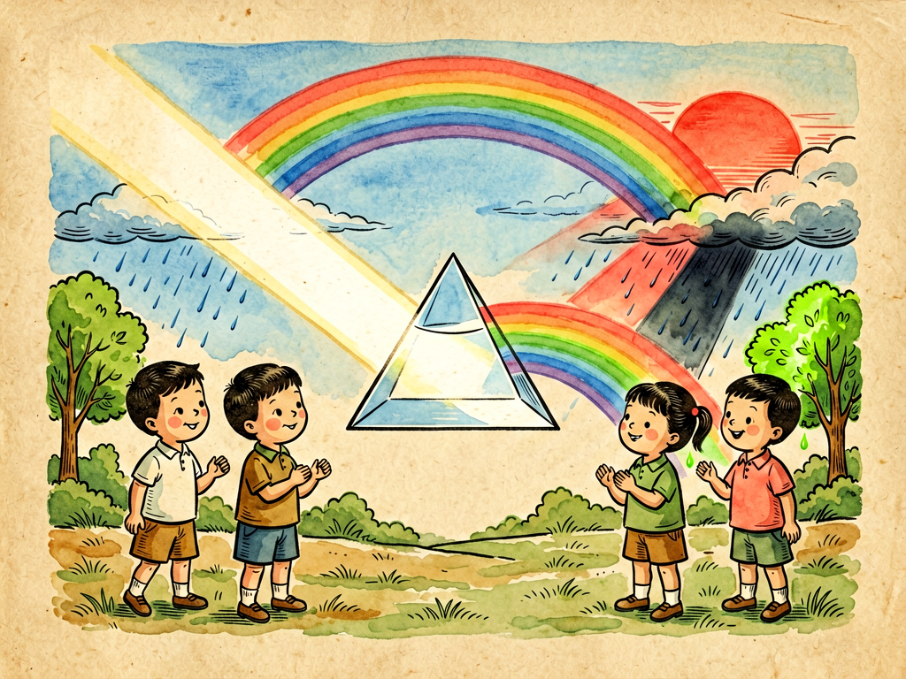

## 第二十章 光和色的表演

---

### 📍 本章导航
**核心主题**：我们每天睁开眼睛，就能看到一个五颜六色的世界：天是蓝的，树是绿的，花是红的，苹果是红的……我们总觉得这些颜色是物体本身就有的，天本来就是蓝的，苹果本来就是红的。其实根本不是这样！如果没有光，你什么颜色都看不见；世界上所有的颜色，都是光给我们演的一场精彩表演——白光是由红橙黄绿蓝靛紫七种颜色的光混合成的，不同的物体喜欢吸收不同颜色的光，反射剩下的光反射到我们眼睛里，我们就看到了颜色。天空是蓝的，是因为空气散射蓝光；晚霞是红的，是因为傍晚阳光穿过厚厚的大气层，蓝光都被散射掉了，剩下红光橙光；彩虹是阳光被天上的小水滴折射反射分解成了七色；颜料越混越黑，光越混越白。我们的眼睛接收光，大脑再解读成颜色，我们以为自己"看到了真实"，其实看到的只是大脑加工出来的影像。光不只是让我们看见东西，它还承载着信息，从望远镜显微镜到照相机手机，从激光到光纤通信，从电视电脑屏幕到医疗技术，现代文明几乎就是建立在对光的理解和利用之上。这一章我们就来看这场精彩的光和色的表演，搞清楚我们看到的世界到底是怎么来的。
**你将发现**：
- 我们看到的光，本质上是电磁波，就像手机信号、wifi、X光、紫外线、红外线一样，都是电磁波，只是波长不一样。人眼能看见的可见光，波长在380纳米到780纳米之间，只占整个电磁波谱非常小的一段。不同波长的光射到我们眼睛里，就看到不同的颜色：波长最长的是红色，然后是橙、黄、绿、蓝、靛，波长最短的是紫色。白光是所有颜色的光混合在一起的结果，不是白色的光"最单纯"，而是它最复杂，包含了所有颜色。
- 第一个把白光拆开的人是牛顿，他让一束阳光透过三棱镜，光折射之后在墙上投出红橙黄绿蓝靛紫七色光带，这就是色散。以前大家都以为白光是最纯的，颜色是三棱镜给光加进去的，牛顿证明不对，三棱镜只是把本来就混在白光里的不同颜色分开了，彩虹就是天上的小水滴当成了无数个小三棱镜，把阳光分成七色。
- 物体为什么有颜色？世界上的原子分子，都喜欢吸收特定波长的光：树叶里的叶绿素，最喜欢吸收红光和蓝光，用来做光合作用，不吸收绿光，把绿光反射回来，射到我们眼睛里，我们就看到树叶是绿的；苹果熟了产生花青素，吸收蓝绿光，反射红光，我们就看到红苹果；如果一个物体把所有光都反射回来，它就是白色的；如果把所有光都吸收了，不反射光，它就是黑色的。你在红色的灯光下穿白衣服，衣服就变成红的，因为白衣服反射所有光，现在只有红光可以反射，所以就是红的——这说明颜色真的不是物体本身固有的，是光、物体、观察者一起演出来的。
- 天空为什么是蓝的？因为空气里的氮气氧气分子，还有 tiny 的灰尘水滴，会散射阳光。散射有个规律：波长越短的光越容易被散射，蓝光紫光波长最短，散射得最厉害，整个天空都被散射的蓝光填满了，所以我们抬头看天就是蓝色的（紫光虽然散射更多，但是人眼对紫光不敏感，所以看到的是蓝天）。傍晚太阳快落山的时候，阳光是斜着射过来的，要穿过比中午厚好几倍的大气层，路上大部分蓝光都被散射掉了，剩下波长更长的红光橙光，所以晚霞就是橙红色的，特别漂亮。
- 有两种完全相反的混色方法：
  - **加色法**：是发光物体的混色，用红、绿、蓝（RGB）三种光作为三原色，把这三种光按不同比例加在一起，就能调出所有颜色，三种光全加在一起就是白色。电脑屏幕、手机屏幕、电视、舞台灯，都是用加色法，屏幕上密密麻麻的小像素点，分别发红绿蓝光，离远了眼睛分不清，就混出了各种颜色。
  - **减色法**：是颜料、印刷、画画的混色，用青、品红、黄（CMY）三种颜料作为三原色，颜料是吸收光的，青色颜料吸收红光，品红吸收绿光，黄色吸收蓝光，三种颜料混在一起，所有光都被吸收了，就变成黑色。这就是为什么你画画的时候，颜料越混越暗，最后变成黑乎乎的，而光越混越亮。
- 我们的眼睛怎么看见颜色？视网膜上有两种感光细胞：视杆细胞负责在暗处看东西，分辨明暗，但是分不清颜色；视锥细胞有三种，分别对红光、绿光、蓝光敏感，三种细胞接收到的信号不同，大脑就组合出了成千上万种颜色。有的人某一种视锥细胞有问题，就会变成色盲，最常见的是红绿色盲，分不清红和绿。而且我们的大脑会主动"修正"颜色，比如一张白纸不管在红灯下还是蓝灯下，你都知道它是白的，这叫颜色恒常性，大脑会自动根据环境光调整，让我们能稳定识别物体。但是也会产生错觉，比如著名的棋盘阴影错觉，同样颜色的两个格子，在阴影里和阴影外，你会觉得它们颜色完全不一样——这说明眼睛会骗我们，"眼见"不一定为实。
- 人类学会利用光之后，彻底改变了世界：古代人用小孔成像原理做照相机暗箱，后来发明了透镜，做出了望远镜看到星星，做出了显微镜看到细菌；20世纪发明了激光，激光是最纯最整齐的光，能用来切割金属、做手术、通信、扫码、读光盘；我们现在用的光纤，就是让光在玻璃丝里反复全反射，能以光速传递几十亿路电话和网络信号，整个互联网的骨架就是光纤；还有LED、OLED屏幕，把光做进每个口袋里，让我们随时能看视频、打电话、拍照。
- 这一章最深刻的洞见：我们看到的世界，从来不是世界"本来的样子"，而是光经过物体反射折射，被眼睛接收，再被大脑加工解释过的"影像"。我们看到的颜色，听到的声音，闻到的气味，本质上都是大脑给我们翻译出来的"用户界面"，不是世界本身的真相。理解这一点，你就会明白为什么科学不能只靠"眼见为实"，要靠实验、测量和推理，才能超越感官的局限，看到更真实的世界。光不只是照亮了世界，也塑造了我们认识世界的方式。

**阅读建议**：下次看到彩虹的时候，不要只觉得好看，想想阳光经过了多少次折射反射才到你眼睛里；拿个三棱镜（或者装水的玻璃杯）对着阳光，自己在墙上造出一道小彩虹；打开手机屏幕，滴一滴水在上面，用放大镜看，你就能看到密密麻麻的红绿蓝小像素点，亲眼看到加色法是怎么工作的。

---

### 🖋️ 经典原文

光，是大自然最伟大的演员，它每天都在我们眼前表演最精彩的戏剧，给世界涂上万千种颜色，可是大多数人只顾着看戏剧的内容，从来没有注意过这个演员本身，也没有想过这场表演是怎么演出来的。
你以为红色是苹果自带的，蓝色是天空本身的颜色？错了。如果关上灯，把所有光都遮住，你什么颜色都看不见，苹果不是红的，天也不是蓝的，整个世界都是黑的。颜色，是光、物体、你的眼睛和大脑一起合作演出来的戏，缺了任何一方，都没有颜色。
最早的观众是怎么发现这场戏的秘密的呢？三百多年前，大科学家牛顿在暗室里，让一束太阳光从窗户小孔射进来，穿过一个三角形的玻璃三棱镜，他本来以为光会折射过去还是一束白光，结果惊奇地发现，光在墙上散开成了一条长长的彩色带子，红、橙、黄、绿、蓝、靛、紫，整整七种颜色，整整齐齐排着队，和天上的彩虹一模一样。
当时所有人都觉得白光是最单纯的光，颜色是棱镜给光"染"上的。牛顿却反过来想：如果白光是七种颜色混合成的，那我能不能再把这七色光合成白光？他又拿了一个倒过来的三棱镜，把散开的七色光再聚到一起，果然又变成了一束白光！原来白光一点都不单纯，它是所有颜色的光混在一起的大杂烩，三棱镜只是把它们按波长不同，折射程度不一样，给分开了而已。
天上的彩虹就是这个原理。刚下过雨，天上飘着无数小水滴，每个小水滴都像一个小小的三棱镜，阳光射进去，折射一次，在水滴背面反射一次，再折射出来，不同颜色的光分开走，就形成了弯弯的七色彩虹。你背对着太阳，往前喷水雾，自己也能造出一道小彩虹。
那为什么天是蓝的，晚霞是红的？这也是光的表演。空气里有无数氮气分子、氧气分子，还有 tiny 的灰尘和小水滴，光穿过空气的时候会撞到这些小分子，被散射开来，就是光的散射。有个规律：波长越短的光，越容易被散射。蓝光紫光波长最短，所以被散射得最厉害，四面八方都是被散射的蓝光，不管你往哪个方向看，都有蓝光射到你眼睛里，所以整个天空看起来就是蓝色的。紫光其实散射得更多，但是我们的眼睛对紫光不敏感，所以我们看到的是蓝天。
到了傍晚，太阳快落山了，光是斜着照过来的，要穿过比中午厚好几倍的大气层，一路上蓝光紫光大部分都被散射掉了，剩下的都是波长比较长、不容易散射的红光橙光，把天边的云都染成橙红色，就是漂亮的晚霞。
那物体的颜色又是怎么来的？原来世界上所有的东西，都是由原子分子组成的，不同的分子喜欢"吃"（吸收）特定波长的光，吃剩下的光反射出来，射到我们眼睛里，就成了我们看到的颜色。
比如树叶，里面有叶绿素，叶绿素最喜欢吃红光和蓝光，因为它要用这两种光的能量来做光合作用，把二氧化碳和水变成养分，它不喜欢绿光，把绿光全都反射出来了，所以我们看到的树叶就是绿色的；秋天树叶变黄变红，是因为叶绿素分解了，剩下花青素和胡萝卜素，反射红光黄光，叶子就变颜色了。苹果熟了是红的，因为成熟的苹果产生花青素，吸收蓝绿光，反射红光；如果一个物体把所有颜色的光都反射回来，它就是白色的，比如白纸、白墙；如果它把所有光都吃掉了，什么光都不反射，那它就是黑色的，黑颜色其实不是"有黑色的光"，是什么光都没有，所以是黑的。
你看，多有意思：你看到一个东西是红色的，恰恰是因为它"不喜欢"红光，把红光扔出来了，它喜欢的光都被它吃掉吸收了。
还有一个有意思的事：光的混合和颜料的混合是完全相反的。
你画画的时候，把红颜料黄颜料蓝颜料混在一起，混的颜色越多就越暗，最后变成黑的；但是如果你把红光绿光蓝光打在同一个白墙上，三种光叠在一起居然变成白光！红光加绿光是黄光，绿光加蓝光是青光，红光加蓝光是品红光，三种光全加在一起就是白的。这是怎么回事？
因为颜料是"减色法"，颜料是靠吸收光来显色的，每加一种颜料就多吸收几种光，反射的光越来越少，最后所有光都被吸收了，就变黑了。我们画画、印刷用的三原色是青、品红、黄（CMY），就是分别吸收红、绿、蓝光，三种混在一起吸收所有光，就是黑色。
而发光的东西比如屏幕、舞台灯，是"加色法"，三原色是红、绿、蓝（RGB），三种光按不同比例加起来，就能调出所有人眼能看到的颜色，加得越多越亮，三种全加上就是最亮的白色。你手机屏幕、电脑屏幕、电视，都是用这个原理：屏幕上密密麻麻排着几百万个极小的红、绿、蓝小发光点，不同颜色的点亮起来，离远了眼睛分辨不开小点，就混出了各种各样的颜色。你滴一滴水在手机屏幕上，用放大镜看，就能清楚看到红绿蓝三个颜色的小格子，这就是加色法最直观的证明。
那我们的眼睛是怎么看到这些颜色的呢？在我们眼睛的视网膜上，有两种感光细胞：一种是视杆细胞，负责在暗处看东西，能分辨明暗，但是分不清颜色，晚上看东西都是灰的，就是因为只有视杆细胞在工作；另一种是视锥细胞，有三种，分别对红光、绿光、蓝光敏感，就像三个接收器，分别接收三种颜色的信号，把信号传给大脑，大脑把这三种信号组合起来，就能分辨出成千上万种不同的颜色。
有的人天生某一种视锥细胞有问题，就是色盲，最常见的是红绿色盲，不能分辨红和绿，这不是眼睛的病，是基因决定的。而且大脑很聪明，它不会直接把视锥细胞的信号原封不动给你看，它会自动帮你"修正"颜色：比如一张白纸，在阳光下是白的，在黄灯底下你还是觉得它是白的，不会觉得它变黄了；同样的灰色，放在黑背景上显得亮，放在白背景上显得暗，这都是大脑加工的结果。大脑这么做是为了让我们能稳定识别物体，但是它也会骗我们——很多视觉错觉就是这么来的，同样的颜色，放在不同背景下你会觉得完全不一样，这说明"眼见为实"这句话，其实不一定对。
光的这场表演，不只是好看，它还支撑起了整个现代文明。两千多年前墨子就发现了小孔成像，光沿直线传播，通过小孔能成倒立的像，这是照相机最早的原理；后来人们发明了透镜，做出了望远镜，能看到遥远的星星，把人类的视野扩展到宇宙深处；做出了显微镜，看到了细菌和细胞，打开了微生物世界的大门。20世纪人类发明了激光，激光是最整齐最纯的光，能量集中，能用来切割坚硬的金属，能在眼睛上做精细的近视手术，能在超市扫条形码，能在光纤里跑几十万公里传递信号。现在整个互联网的骨架就是光纤，光在细细的玻璃丝里以光速传播，一秒钟能绕地球七圈半，我们刷视频、打视频电话、上网，所有数据几乎都是靠光传的。
当然，光太多了也不是好事，现在城市里晚上灯火通明，造成了光污染，太亮的灯光会影响我们睡觉，会让候鸟迷失方向，会让我们看不到星星。我们需要光，但是也要学会和光和平相处，该亮的时候亮，该暗的时候暗，不能让过多的人造光打扰自然的节奏。
小朋友们，下次你看到蓝天、晚霞、彩虹，看到屏幕上五颜六色的画面，不要忘了这都是光给你演的戏。科学就是这样，当你知道了表演背后的原理，你不但不会觉得它没意思，反而会觉得这场戏更精彩、更神奇。
下一章，我们讲血的冷暖。

---

> 📜 **科学史话：人类认识光的四个里程碑**
>
> 第一个里程碑：墨子和小孔成像。两千四百多年前，中国的墨子和他的学生做了世界上第一个小孔成像实验，在暗室的墙上开一个小孔，人站在外面，对面墙上就会出现一个倒立的人影。墨子正确解释说，光沿直线传播，像射箭一样走直线，从人脚底下射过来的光通过小孔到上面，从头顶射过来的到下面，所以成倒像。这是人类历史上第一次对光沿直线传播的科学记录，比古希腊欧几里得的记载还早一百多年。
>
> 第二个里程碑：牛顿分解白光。1666年，23岁的牛顿为了躲避瘟疫回到乡下，在那里他做了著名的三棱镜实验，证明白光是由七色光组成的，解释了彩虹的成因，还发现了光的折射定律，奠定了现代光学的基础。当时很多著名科学家都不相信他的结论，争论了几十年，最后大家重复他的实验，才不得不承认这个年轻人是对的。
>
> 第三个里程碑：三原色理论。19世纪初，英国科学家托马斯·杨提出，人眼不需要有对应所有颜色的接收器，只要有三种分别对红、绿、蓝敏感的细胞，组合起来就能看到所有颜色，这个理论后来被实验证实，就是我们现在RGB显示技术的基础。托马斯·杨还是个天才，他还破译了埃及罗塞塔石碑，研究过弹性力学，是历史上少有的通才。
>
> 第四个里程碑：爱因斯坦解释光电效应。20世纪初，人们发现光打在金属上能打出电子，这个现象用波动说解释不了，爱因斯坦提出光不光是波，还是一个个粒子（光子），每个光子的能量由频率决定，完美解释了光电效应，他也因此拿到了诺贝尔物理学奖。这就是光的波粒二象性，光既是波又是粒子，这个发现直接催生了量子力学，也为后来的激光、半导体、光伏电池等所有现代光电子技术打下了基础。
>
> 从墨子的小孔到今天的光纤互联网，人类对光的认识走了两千四百年，而且还在继续往前走。

---

> 🔬 **科学更新：当代光学技术——用光改变世界**
>
> **激光：最神奇的光。** 普通的光比如灯泡发的光，各种波长的都有，向四面八方乱射；激光是人为制造出来的，所有光子波长一模一样，方向完全一致，整齐得像正步走的军队，所以能量非常集中。激光可以硬到切割几厘米厚的钢板，可以精确到在头发丝上刻字，可以做手术刀切除肿瘤、做近视手术矫正视力，可以用来扫码、读光盘、测距离（月球到地球的距离就是用激光测的，误差不到几厘米），现在最先进的激光装置甚至能模拟恒星内部的温度压力，探索可控核聚变。
>
> **光纤通信：信息时代的高速公路。** 我们用极纯的玻璃拉成比头发还细的光纤，让光在光纤芯里不断全反射，跑几千公里都不怎么衰减，一根光纤一秒钟能传200T的数据，相当于一秒钟传600万部电影。现在全世界铺了超过五千万公里的光纤，跨越大洋的海底光缆把所有大洲连在一起，我们上网、打电话、看视频，所有长距离的数据传输几乎全靠光纤，没有光纤就没有现代互联网。
>
> **OLED与柔性显示。** 我们以前用的CRT电视、液晶屏幕，都需要背光或者荧光粉发光；现在新的OLED屏幕，每个像素自己就能发光，不需要背光，能做得非常薄，能弯曲折叠，颜色更鲜艳，更省电，现在的折叠屏手机、曲面电视，用的就是OLED技术。未来我们可能会有卷起来的屏幕、贴在墙上的屏幕，甚至戴在眼睛上的AR/VR显示，都靠新型发光材料。
>
> **量子光学与量子通信。** 现在科学家在研究单光子技术，用光的量子特性来做不可窃听的量子通信，中国的墨子号量子卫星已经实现了上千公里的量子保密通信；未来还有量子计算机，用光子做量子比特，计算能力会比现在的超级计算机快亿万倍。光的秘密，我们还远远没有挖完。

---

> 🧪 **动手试一试：自制彩虹+旋转色盘看混色**
>
> 实验一：自制三棱镜彩虹
> 找一个装了清水的透明玻璃杯，或者一面小镜子，一个装了半盆水的脸盆；
> 选一个晴天，把脸盆放在阳光能照到的地方，把镜子斜靠在脸盆边上，一半浸在水里，一半露出水面；
> 调整镜子的角度，让阳光照在水里的镜子上，反射到白色的墙上或者天花板上，你就能看到一道小小的彩虹！
> 原理就是：水和镜子一起组成了一个水三棱镜，阳光穿过水的时候发生折射色散，分成七色，和天上彩虹的原理一模一样。如果有三棱镜效果更好，没有的话这个方法人人都能做。
>
> 实验二：牛顿色盘看颜色混合
> 用圆规在硬卡纸上画一个圆，剪下来，把圆分成七个相等的扇形，依次涂上红橙黄绿蓝靛紫七种颜色；
> 在圆中心打两个孔，穿一根绳子，或者在中心插一根铅笔头做成陀螺；
> 快速转动这个圆片，你会发现七种颜色居然不见了，转得快的时候看起来是灰白色或者白色的！
> 这就是在模拟牛顿的七色光合成白光实验，转得快的时候，七种颜色的光在眼睛里快速叠加，因为人眼有视觉暂留，就好像七种光同时射到眼睛里，混在一起就成了白色，和光的加色法原理是一样的。如果把红绿蓝三个颜色涂在圆盘上转，也会看到近似白色的效果。

---

### 💬 读后思考与讨论

1. 为什么说颜色不是物体本身固有的属性？如果宇宙里没有眼睛，还会有"红色"吗？为什么？
2. 天空是蓝的，晚霞是红的，这两个现象背后是同一个原理，是什么原理？为什么中午和傍晚颜色不一样？
3. 为什么颜料越混越黑，而光越混越白？加色法和减色法有什么区别？你能在生活里找到哪些例子？
4. 文中说"眼见不一定为实"，视觉错觉是怎么产生的？这对我们认识世界有什么启发？
5. 激光和普通光有什么区别？你在生活里见过哪些地方用到激光？光纤通信为什么能传那么快那么多数据？

### 🔗 关联阅读
- 第三部第八章：《谈眼镜》→ 透镜怎么矫正视力，帮助人类看清楚世界
- 第三部第十二章：《镜子的故事》→ 光的反射原理和镜子的发展历史
- 第三部第十一章：《电的眼睛》→ 人类利用光学原理发明望远镜、显微镜、各种成像设备，扩展视觉边界
- 跨章节思考：从眼睛看见光，到理解光的本质，再到利用光发明技术、传递信息，人类认识光的历史，就是人类不断超越自身感官局限、探索世界真相的历史。感官是我们认识世界的窗口，但是它也有边界，也会欺骗我们，科学就是帮我们打开更多窗户，看到比肉眼所见更广阔、更真实的世界。
