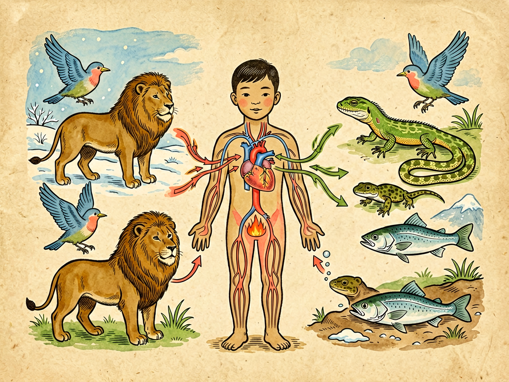

# 第三部 科学与文明
## 第二十一章 血的冷暖

---

### 📍 本章导航
**核心主题**：我们平时常说"热血青年""冷血动物""血脉相连""血气方刚"，血这个字，不光是我们身体里的红色液体，它还连着温度、连着情感、连着生命。今天我们就来聊聊血液——这股在我们身体里日夜不停流动的红色河流，它到底是什么做的？它为什么是红的？它怎么在我们身体里跑来跑去？它怎么帮我们调节体温？"温血"和"冷血"到底是什么意思？血型又是怎么回事？这一章我们就把关于血的科学讲透。  
**你将发现**：
- 血液不是一摊简单的红色液体，它是一支分工明确的"移动部队"：有扛氧气的红细胞、有杀病菌的白细胞、有补伤口的血小板，还有运送所有东西的血浆
- 我们的身体不是一开始就知道血液是循环的——哈维通过计算发现了血液循环，彻底改变了医学
- 血液不光是送营养送氧气，它还是我们身体的"暖气管道"：把内脏产生的热量送到全身，热了就送到皮肤散热，冷了就保住核心温度，这就是"血的冷暖"
- "热血动物"和"冷血动物"不是说血的温度真的不一样，是两种完全不同的生存策略，没有高低之分
- 输血不是随便输的，血型不对会出人命；献血不是伤身体，是能救命的文明行为，一袋血就能救一个人的命
- 我们平时说的"热血""冷血"只是文化比喻，不能当真，更不能相信什么"血型决定性格"的伪科学

**阅读建议**：血液对我们来说既熟悉又陌生——我们都见过流血，都知道血是红的，但很少有人真正知道这红色的液体里藏着多少秘密。读这一章的时候，你可以摸摸自己的脉搏，感受一下心脏的跳动——每一次心跳，都是血液在你身体里跑了一圈。读完这一章，你会明白为什么说血液就是生命本身。

---

### 🖋️ 经典原文

讲完了光和色，今天我们来讲讲我们身体里最最重要、也最富有传奇色彩的一样东西——血。
一提到血，大家肯定都不陌生：不小心割破手会流血，打针抽血会看见血，人活着就不能没有血。我们的语言里到处都是血的影子：说人勇敢叫"热血"，说人残忍叫"冷血"，说亲人叫"血脉相连"，说激动叫"热血沸腾"，说牺牲叫"流血牺牲"——好像血这个东西，天生就和生命、和情感、和温度连在一起。
但是血到底是什么？它为什么是红的？它在我们身体里到底在忙些什么？为什么天冷的时候我们手脚冰凉，跑完步又会满脸通红？为什么有的动物是"温血"，有的是"冷血"？为什么输血要讲究血型？这些问题，今天我们一个一个讲清楚。

---

首先我要告诉你们：**血液不是一摊红色的水，它是一种流动的组织，是一支时刻在赶路的大部队**。
如果把你的血液抽一点出来，放到离心机里转一转，它会分成清清楚楚的三层：
最上面一层是半透明淡黄色的液体，叫**血浆**，占了血液的一半多一点——血浆里90%是水，剩下的是蛋白质、糖、盐、脂肪、各种营养物质、激素、还有代谢废物，血浆就是个"运输大队"，所有东西都溶解在里面，被运到全身各地。
中间薄薄一层白色的，是**白细胞和血小板**——白细胞是我们身体的"军队"，负责杀病菌、防感染，我们之前讲"肺港之役"的时候说过的那些免疫战士，大部分都是坐着血液跑到战场上去的；血小板是我们身体的"修理工"，哪里的血管破了，它们就马上冲过去，聚在一起堵伤口，还会释放凝血物质，让血凝固起来，不让我们流血流死。
最下面一层是红色的，就是**红细胞**，占了血液体积的差不多一半——我们的血是红的，就是因为红细胞是红的。红细胞里有一种叫**血红蛋白**的东西，它特别喜欢和氧气结合，红细胞的工作就是扛着氧气：从肺里把氧气装上，顺着血管跑到全身每一个细胞那里，把氧气卸下来给细胞用，再把细胞产生的二氧化碳扛回肺里呼出去。
你们看，血液哪里是简单的红水啊——它有运输队、有军队、有修理工，什么都有，在我们的血管里日夜不停地跑，一刻都不休息。一个成年人身体里大概有4-5升血，差不多是10瓶矿泉水那么多，占我们体重的7%-8%。这些血每20秒左右就能在我们身体里跑一圈，一天下来要跑上万圈——你算算，这得跑多少路啊。
为什么血是红的？因为血红蛋白里有铁元素，铁和氧结合之后就是红色的——就像铁生锈会变红是一个道理。动脉血里带的氧气多，所以是鲜红色的；静脉血里氧气少、二氧化碳多，就是暗红色的，我们平时割破手流出来的血大部分是静脉血，看起来是暗红或者深红的，不是什么"黑血"，不用害怕。

---

这么多血，在我们身体里是怎么跑的呢？在很久很久以前，古人都以为血是肝脏造出来的，流到身体各个地方就被用完了，像潮水一样涨涨落落，根本不知道血是循环的。
直到17世纪，英国有个医生叫**哈维**，他做了个简单的计算：人的心脏每跳一次，大概能压出去二两血，一分钟跳70次的话，一小时心脏压出去的血就有800多斤——这比三四个成年人的重量还重！肝脏怎么可能一小时造出800多斤血？这根本不可能啊！
哈维又做了很多解剖实验、绑住血管的实验，最后终于发现了真相：**血液是循环的！**
我们的心脏就像一个永不休息的水泵，它有四个房间，分成左右两边，完全不连通：
- 右边的心脏负责"肺循环"：把全身回来的、带了很多二氧化碳的暗红色静脉血泵到肺里，在肺里排出二氧化碳、装上新鲜氧气，变成鲜红色的动脉血，再回到左边的心脏；
- 左边的心脏负责"体循环"：把充满氧气的动脉血泵出去，通过动脉送到全身各个器官、各个组织、甚至每一个细胞那里，把氧气和营养卸下来，把细胞产生的二氧化碳和废物装上，变成静脉血，再顺着静脉回到右边的心脏。
连接动脉和静脉的是密密麻麻的**毛细血管**——这些血管细得不得了，比头发丝还细好多倍，红细胞都得排着队才能挤过去。我们全身的毛细血管加起来，能绕地球两圈半！别看它们细，它们才是真正的"交易市场"——氧气、营养、二氧化碳、废物，全都是在毛细血管这里交换的。
哈维发现血液循环，是现代医学的开始——从这时候起，人们才明白身体不是各个零件拼起来的，是靠流动的血液连成一个整体的。心脏为什么跳、血压为什么重要、为什么心梗脑梗会要命，一下子全都能解释了。心脏跳一下，就是压一次血；脉搏跳一下，就是血浪顺着动脉传过来——你摸手腕上的脉搏，其实就是在摸血液流动的节奏啊。

---

现在我们来讲题目里的两个字："冷暖"——血液不光是个运输队，它还是我们身体的**暖气管道和空调系统**。
我们人是"恒温动物"，不管外面是零下二十度的冬天，还是四十度的夏天，我们身体核心的温度都能保持在37℃左右，不会变来变去——靠的就是血液来调节温度。
我们的肝脏、肌肉、大脑一直在工作，一直在产生热量——尤其是肝脏和肌肉，是我们身体的"小火炉"。这些热量怎么送到全身？靠血液！血液流过这些产热的器官，把热带走，流到全身各处，让手脚、皮肤都暖和。
那热了怎么办？冷了又怎么办？血液自有办法：
- 天气热的时候，或者我们跑步运动、产热多的时候，身体命令皮肤下面的血管扩张——更多的热血流到皮肤表面，把热量散出去，同时汗腺开始出汗，汗水蒸发的时候会带走大量热量——这个时候你会脸红、会出汗、皮肤摸起来烫烫的，就是在散热降温。
- 天气冷的时候，身体就命令皮肤下面的血管收缩——大部分血液都缩回身体核心，保住心脏、大脑、肺这些重要器官的温度，流到皮肤和手脚的血少了，所以你会脸色发白、手脚冰凉——这不是身体坏了，是它在"丢卒保帅"，先保重要器官。
- 如果你冻得太厉害了，身体还会让你打寒战——就是肌肉不由自主地快速收缩，抖一抖，产生更多热量；要是你感冒发烧了，身体会把体温"设定点"调高，你会觉得冷、会打寒战，其实是身体在主动升温，用高温来杀病菌、提高免疫力——发烧不是坏事，是身体在自卫呢，当然烧太高了还是要降温的。
你看，我们平时感受到的"冷暖"：冬天冻得手脚冰凉，跑步跑得满脸通红，害羞的时候脸发烫，吓得脸色发白，发烧的时候浑身发烫——全都是血液在调节温度啊。所谓"血的冷暖"，不是血本身一会冷一会热，是血液在不停调配热量，让我们的体温保持稳定。稳定不是不变，是靠千千万万次微小的调整换来的。

---

我们常说人是"温血动物"，蛇啊、鱼啊、青蛙啊是"冷血动物"——很多人一听"冷血"就觉得不好，觉得冷血动物就是残忍、就是低等，这其实是天大的误会。
正确的说法应该是**恒温动物**和**变温动物**——不是它们的血真的冷，是它们调节体温的方式不一样：
- 我们哺乳动物、鸟类是恒温动物：我们自己能产生热量，能保持体温稳定，不管外面冷还是热，我们的体温都差不多——好处是不管白天黑夜、冬天夏天，我们都能活动，反应速度、运动能力都不受温度影响；坏处是太费能量了——我们吃下去的大部分饭，都用来烧了维持体温，所以我们得经常吃东西，不然就会饿死、冻死。
- 爬行类、两栖类、鱼类这些是变温动物：它们自己不怎么产热，体温基本跟着环境走——太阳晒着了它们就热，就活泼能动；躲到阴凉地方或者冬天冷了，它们体温就降下来，动都动不了，只能冬眠。好处是特别省能量——吃一顿能管好久，鳄鱼吃一顿能顶半年；坏处是活动受温度限制，冬天冷了就没法出来活动。
这根本没有谁高级谁低级之分，就是两种不同的生存策略而已：恒温动物选择了"高能耗、高产出"，不管什么时候都能保持战斗力；变温动物选择了"低能耗、耐饥饿"，靠着节省能量活过几亿年。
而且我们人类还发明了衣服、房子、暖气、空调——等于给自己加了一层外部的温度调节系统，比所有动物都厉害。但是别觉得我们就高人一等，很多变温动物的生存能力比我们强多了。
至于我们常说的"热血""冷血"，那都是打比方——"热血"是说人有激情、有勇气，"冷血"是说人冷漠、没感情，和生物学上的体温一点关系都没有。

---

血液这么重要，过去的人当然知道失血会死，所以很早就想过：要是一个人流了很多血快死了，能不能把别人的血输给他救他的命？
最早的输血试验特别荒唐——有人把羊血输到人身上，结果大部分人都死了，大家都不知道为什么。直到100多年前，奥地利科学家**兰德斯坦纳**发现了血型的秘密：原来我们的红细胞表面有不同的"标记"，血浆里有不同的"抗体"，如果输进来的血标记不对，抗体会把外来的红细胞当成敌人打，红细胞就会凝成团，堵死血管，人就会死。
这就是**ABO血型系统**——人的血型分成A型、B型、AB型、O型四种：
- A型血的人红细胞上有A标记，血浆里有抗B抗体；
- B型血的人红细胞上有B标记，血浆里有抗A抗体；
- AB型血的人红细胞上A和B标记都有，血浆里什么抗体都没有，所以什么血都能接受，叫"万能受血者"；
- O型血的人红细胞上什么标记都没有，血浆里两种抗体都有，所以只能接受O型血，但是可以给所有血型的人输少量的血，叫"万能供血者"。
后来大家又发现了Rh血型，就是我们常说的"熊猫血"——Rh阴性的人特别少，输血的时候也要配型，不然也会出问题。
有了血型知识之后，输血才真正成了能救命的医学技术。现在医院里输血不是随便输全血，而是**成分输血**：需要红细胞就输红细胞，需要血小板就输血小板，需要血浆就输血浆，既不浪费，又更安全。
而这些血从哪里来？全靠健康人无偿献血。健康成年人一次献200-400毫升血，只占身体总血量的5%-10%，身体很快就能补回来，对健康完全没有影响，但是这一袋血，就能救一个大出血的产妇、一个重伤的病人、一个白血病孩子的命。
血液是我们每个人身上最私人的东西，但是无偿献血让它变成了能在陌生人之间传递的生命礼物——一袋血从一个健康人的手臂里流出来，经过检测、储存、运输，最后流进另一个素不相识的人的身体里，把他从死亡线上拉回来，这是多文明、多温暖的事啊。当然，献血体系必须严格检测，不能传播疾病，这是制度必须守住的底线。

---

最后我们说说血和健康的关系，还有大家容易信的那些误区。
首先，血液确实是我们健康的镜子——很多病最早都会在血液里表现出来，所以去医院看病最常做的检查就是血常规：
- 红细胞太少、血红蛋白太低，就是**贫血**——会脸色苍白、浑身没劲、头晕，因为氧气运不动了，大部分贫血是缺铁引起的，好好吃饭、补点铁就能好，不用乱吃什么"补血保健品"；
- 白细胞太多，往往是身体有感染、有炎症，免疫系统在增兵；白细胞异常多到离谱，可能是白血病，要赶紧去医院看；
- 血小板太少，稍微碰一下就青一块紫一块，流血止不住；血小板太多或者凝血太活跃，就容易长**血栓**——血栓堵在心脏血管就是心梗，堵在脑血管就是脑梗，堵在肺里就是肺栓塞，这都是能要命的急症。平时多喝水、多运动、不要久坐，就是为了让血流通畅，不容易长血栓。
但是我要特别提醒大家：
- 化验单上的数字只是参考，稍微高一点低一点不一定就是有病，不要自己对着化验单吓自己，要找医生结合症状判断；
- 什么"血型决定性格"完全是伪科学，是日本人瞎编出来的，没有任何科学依据，千万别信；
- 不要乱吃什么"排毒""清血""补血"的保健品，正常吃饭、多喝水、多运动、不抽烟不喝酒，就是对血液最好的保护；
- 还有人说"经血是脏血""放血能治病"，这些都是过去的迷信，早就被现代医学抛弃了。
我们中国人讲究"血气"，说人有精神就是血气足，这其实是有道理的——血液循环好、氧气送得足，人自然就有精神、有活力。但是别把这些文化比喻当成科学事实。

---

总结一下，今天我们讲了血的冷暖，其实讲的是生命的流动：
1. 血液是流动的组织，红细胞运氧气、白细胞杀病菌、血小板补伤口、血浆做运输，分工明确；
2. 血液在心脏的推动下循环全身，动脉、静脉、毛细血管组成了我们身体的运输网络；
3. 血液是身体的空调系统，通过血管收缩扩张调节体温，维持我们37℃的恒温；
4. 温血和冷血是不同的生存策略，没有高低贵贱之分，"热血""冷血"只是文学比喻；
5. 输血要配血型，无偿献血是能救命的文明行为，能帮助别人的时候可以适当献血；
6. 血液是健康的镜子，但不要迷信化验单，也别信血型性格、补血偏方这些伪科学。
我们常说"血是生命之源"，真的一点都不夸张——你摸一摸你的胸口，感受一下心脏的跳动，每跳一下，就有一股热血涌出来，带着氧气、带着营养、带着温度，流到你身体的每一个角落。这股红色的河流，从你出生流到你死亡，一刻不停，它流动的时候，你就是活着的。
好好爱护你的心脏，好好爱护你的血管，好好爱护这一身流动的热血——不仅要让它在你自己的身体里流得顺畅，在别人需要的时候，也可以让它成为能救命的礼物，这才是真正的"热血"。

---

> 📜 **科学史话：人类认识血液的漫长道路**
>
> 人类对血液的认识，走了几千年的弯路。
>
> **古代的血气学说**。不管是中医还是西医，古代都把血看得特别神秘。西方医学之父希波克拉底提出"四体液学说"，认为人身上有血液、黏液、黄胆汁、黑胆汁四种液体，平衡了就健康，不平衡就生病；中医也讲"气血津液"，说"气为血之帅，血为气之母"，这些都是古代人在没有显微镜、不懂解剖的时候对血液的朴素认识，虽然没有找到真正的科学原理，但很多经验是有道理的。
>
> **哈维的革命**。在哈维之前，西方人相信盖伦的学说，认为血液是肝脏造出来的，流到全身就被吸收了，还认为血液里有"灵气"。哈维通过解剖、计算、实验，在1628年出版了《心血运动论》，正式提出血液循环理论。这在当时是离经叛道的，很多人骂他是疯子，但是事实胜于雄辩，后来显微镜发明之后，科学家真的看到了毛细血管，证实了哈维的理论——哈维被称为"现代生理学之父"，是当之无愧的。
>
> **从输羊血到配血型**。17世纪就有人尝试输血，一开始是给人输羊血、牛血，结果10个人里有9个都死了，输血成了玩命的事，被禁止了150年。直到1900年，兰德斯坦纳发现了ABO血型，人们才明白为什么输血有时候会死人。兰德斯坦纳因此拿到了诺贝尔奖，输血从此才变成安全的救命技术。
>
> **血库和无偿献血**。第一次世界大战的时候，为了救战场上的伤员，人们发明了抗凝血剂，能把血存起来，这才有了血库。一开始是职业卖血，很容易传播疾病，后来慢慢发展出无偿献血制度——只有无偿献血，才能保证血液安全，才能让血成为真正的公共资源。现在全世界所有文明国家都实行无偿献血，这是现代文明的标志之一。
>
> 从迷信血液有灵气，到认识血液循环，再到安全输血、无偿献血，人类花了几千年的时间，才真正读懂这红色液体的秘密。

---

> 🔬 **科学更新：关于血液的最新研究**
>
> 最近这些年，我们对血液的认识又进了一大步。
>
> **万能血和人工血**。科学家一直在研究怎么把A型、B型血都变成O型血——最近发现了几种酶，能把红细胞表面的A、B标记切掉，这样所有血都能输给任何人了。还有人在研究人工血液——也就是人造的血红蛋白，不用配型、能存好几年、不会传播疾病，未来如果成功了，就再也不会闹"血荒"了，大出血的时候能马上救命。
>
> **液体活检**：抽一管血就能查癌症。现在最火的技术之一叫"液体活检"——癌细胞会把DNA碎片释放到血液里，我们只要抽一管血，就能查到这些癌细胞的DNA，早期发现癌症，不用做穿刺、不用做手术，方便又安全。未来我们可能体检抽一管血，就能查出十几种甚至几十种早期癌症，癌症就能早发现早治疗，治愈率会高很多。
>
> **年轻血真的能返老还童吗？** 前几年有个很有名的实验：把年轻小鼠和老年小鼠的血管连在一起，老年小鼠竟然变年轻了，肌肉、大脑、心脏都恢复了活力。科学家正在研究是不是年轻血液里有什么特殊的蛋白质能抗衰老——但是千万别信什么"换血美容""年轻血长寿"的骗局，现在还在研究阶段，根本没到能用人身上的时候，那些收费几十万给你换年轻人血的，全都是骗钱的。
>
> **血栓可以吃药溶解了**。以前心梗、脑梗都是急症，血栓堵了血管，只能等着心肌坏死、脑细胞坏死。现在我们有了溶栓药，发病几个小时之内打进去，能把血栓溶开，血管通了，人就能救回来；还有支架手术，能把堵死的血管撑开——现在心梗的死亡率比几十年前低了好多，就是因为这些技术进步。但是最好的办法还是预防：不抽烟、少喝酒、多运动、控制血压血糖血脂，不让血栓长出来，比什么都强。
>
> **CAR-T：改造白细胞杀癌症**。现在最有希望治愈癌症的技术叫CAR-T，就是把癌症病人自己的白细胞抽出来，给它们装上能识别癌细胞的"导航"，再输回病人身体里——这些改造过的白细胞就能精准找到癌细胞，把它们杀死。现在已经有好几种CAR-T疗法治愈了白血病、淋巴瘤，未来可能能治更多种癌症。我们自己血液里的白细胞，经过改造之后，就能变成杀癌的特种兵，你说神奇不神奇？

---

> 🌍 **现实连接：那些和血液有关的生活常识**
>
> 讲了这么多知识，回到生活里，我们要注意几件事。
>
> **无偿献血是好事，但要去正规机构**。年满18岁、身体健康的成年人，适当献血对身体没有伤害，还能帮助别人。但是一定要去正规的血站、献血车献，千万不要去卖血、去不正规的地方献血，不然会感染艾滋病、肝炎这些传染病。献血之后好好休息、多喝点水，很快就恢复了。
>
> **手脚冰凉不一定是"体寒""贫血"**。很多女孩子冬天手脚冰凉，就觉得自己贫血、体寒，要吃什么补药——其实大部分人都是正常的，就是身体为了保住核心温度，让四肢血管收缩了而已，只要你没有别的不舒服，多穿点、多运动、注意保暖就好了，不用瞎补。
>
> **发烧不要急着退烧**。尤其是孩子发烧，很多家长一看38.5℃以上就赶紧给吃退烧药，其实发烧是身体在杀病菌，温度不太高、精神状态好的话，可以先观察，多喝水、物理降温，不用急着吃药。当然如果烧到39℃以上、精神不好、或者是小孩子有高热惊厥史，还是要及时退烧、看医生，别硬扛。
>
> **久坐最容易长血栓**。现在很多人一坐就是一整天，上班坐着、坐车坐着、回家看电视看手机还是坐着——坐久了腿上的血流得慢，就容易长血栓，血栓掉下来跑到肺里就是肺栓塞，能死人的。所以坐一两个小时就要站起来活动活动，走两步、踮踮脚，让腿上的血流通畅。坐飞机、坐长途火车的时候也要多喝水、多活动腿，别一直坐着不动。
>
> **不要信"放血疗法""洗血"这些骗局**。不管是中医的放血还是西方过去的放血疗法，早就被证明没用甚至有害了；现在还有什么"洗血美容""血液净化排毒"，全都是骗人的，不仅没用，还会感染、出危险，千万别去试。
>
> 血液是我们自己的生命之河，爱护它最好的方式就是健康生活——规律作息、均衡饮食、多运动、不抽烟、少喝酒，比吃任何保健品都有用。

---

> 💡 **动手试一试：和血液有关的小实验**
>
> **实验1：摸脉搏，数心跳**
>
> 你可以自己试一试：
> 1. 把一只手的手指放在另一只手手腕的外侧（大拇指那一侧），稍微用点力按，你就能摸到一跳一跳的脉搏；
> 2. 看着表，数一分钟跳多少次——正常人安静的时候一分钟跳60-100次都是正常的，经常运动的人跳得慢，可能50多次，也是健康的；
> 3. 然后你原地跑一分钟，跳完马上再数脉搏，你会发现心跳变快了好多——这是因为你运动的时候肌肉需要更多氧气，心脏就跳得快一点，多泵点血过去；
> 4. 休息五分钟之后再数，看看心跳多久能恢复正常——恢复得越快，说明你的心肺功能越好。
>
> **实验2：观察血液凝固**
>
> 如果你不小心擦破点皮、流了一点血（千万不要故意割手！），你可以观察一下：刚流出来的血是液体，过个几分钟，它就会慢慢凝固，变成深红色的血块，把伤口堵住。这就是血小板在工作呢——它们聚在一起，还触发了凝血反应，把血变成固体，不让你一直流血。
> 注意：如果伤口深、流血止不住，一定要马上按住伤口去医院，不要自己处理。
>
> **实验3：测一测不同状态下的体温和脸色**
>
> 1. 安静坐在家里的时候，摸一摸自己的手和脸，测一下体温，看看自己是什么脸色；
> 2. 出去跑两圈、或者做二十个开合跳，回来再摸一摸自己的脸和手，你会发现脸变红了、手变热了，体温稍微升高了一点——这是皮肤血管扩张，在散热；
> 3. 冬天从外面冷的地方进到屋里，看看你的手是不是发白、冰凉？摸一摸身上是热的，这就是血管收缩，把血保存在核心里了。
>
> 你看，不用复杂的仪器，你自己就能观察到血液调节温度的过程。

---

### 💬 读后思考与讨论

1. 血液由哪几部分组成？每一部分分别是做什么工作的？为什么血液是红色的？
2. 哈维是怎么发现血液循环的？为什么说血液循环的发现是现代医学的开始？
3. 血液是怎么帮我们调节体温的？为什么天冷的时候手脚冰凉、天热的时候满脸通红？
4. "温血动物"和"冷血动物"真正的区别是什么？为什么说没有高低之分？
5. 为什么输血要配血型？O型血真的是万能血吗？你怎么看待无偿献血？
6. 生活中哪些习惯能保护我们的血管和血液健康？你听过哪些关于血液的谣言？怎么分辨真假？

### 🔗 关联阅读
- 第一部第八章：《肺港之役》→ 白细胞是怎么坐着血液跑到肺里和病菌打仗的，这里讲得最清楚
- 第一部第九章：《吃血的经验》→ 回顾血液和免疫的故事，看看我们的身体怎么靠血液对抗病菌
- 第二部第二章：《人身三流》→ 血液、淋巴液、组织液，这三种液体是怎么一起维持身体运转的
- 第三部第二十三章：《谈寿命》→ 血管健康和长寿关系最大，怎么保护血管就是怎么延长寿命
