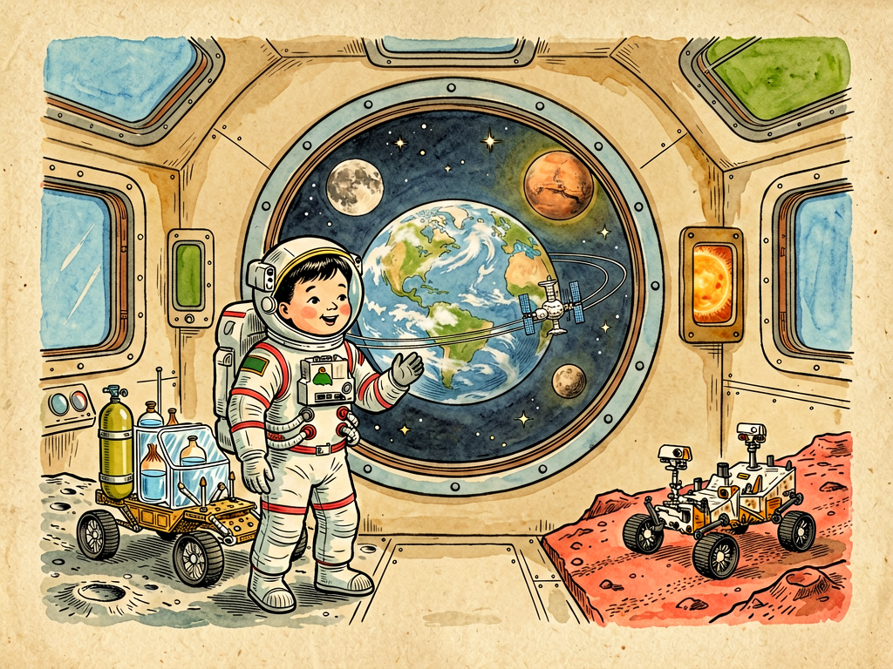

# 第三部 科学与文明
## 第二十二章 星际航行家离开地球以前

---

### 📍 本章导航
**核心主题**：从万户飞天到嫦娥探月，人类为什么总想离开地球？在真正迈向深空之前，我们必须先解决哪些物理、工程、生命和伦理难题？你可能在电视上看过火箭发射的直播——倒计时结束，一团橘红色的火焰从箭尾喷出来，几十层楼高的火箭缓缓升起，越飞越快，最后变成一个小点消失在云层里。你觉得这很壮观、很浪漫，觉得"飞天"就是点火、起飞、到月亮上插个旗那么简单。可你不知道的是：为了这10分钟的发射，有几十万人工作了十几年；为了让宇航员在太空里活一天，有上千个工程师在解决各种各样你想都想不到的问题——怎么刷牙、怎么上厕所、怎么打喷嚏、怎么在失重状态下喝水不把水洒得满舱都是、怎么在密闭空间里不跟同伴打架。星际航行不只是火箭发射的壮观，更是一场对人类文明成熟度的全面考验——它考验的不只是我们的物理和工程水平，更是我们能不能管好自己、能不能和他人合作、能不能在极端环境下保持人性。  
**你将发现**：
- 宇宙的尺度有多惊人——月球距我们38万公里，是1光秒距离，阿波罗飞船飞了3天才到；火星最近距离5500万公里，通信延迟最少3分钟，一来一回就是6分钟，最远的时候延迟超过40分钟，你根本没法和地球实时打视频电话；最近的恒星比邻星在4.2光年之外，就算用现在最快的化学火箭，飞过去需要几万年——光速是我们这个宇宙无法突破的硬边界，这不是技术问题，是物理定律
- 火箭为什么能飞上天？不是"推空气"，而是牛顿第三定律——往后扔东西，自己就会往前走。你在冰面上扔一个重东西，你自己会往后滑，这就是火箭原理；化学火箭、电推进、核推进、太阳帆，不同推进方式的效率差了几百上千倍，但目前我们能用的化学火箭，本质上还是和春节放的"窜天猴"一个原理
- "火箭方程暴政"有多残酷——火箭90%以上的重量都是燃料，要把1公斤东西送到近地轨道需要几十公斤燃料，要送到火星需要几百公斤，你带的燃料越多，火箭越重，又需要更多燃料来推燃料，这是个死循环；为什么现在的火箭都是多级的？为什么不造一架直接飞到火星的大飞机？就是被这个方程逼的
- 把人送入太空比送探测器难一万倍——机器不需要氧气、不需要吃饭、不怕孤独、坏了就坏了；可人是个极其脆弱的系统：3分钟没氧气就会死，3天不喝水就会死，3周不吃饭就会死，温度差个十几度就会生病，长期失重会让骨头变脆、肌肉萎缩、视力下降，宇宙辐射会打断你的DNA，密闭空间待久了会精神崩溃。你要在飞船里造一个迷你的"小地球"，这有多难？
- 太空里真正可怕的东西往往是看不见的——太阳耀斑爆发时喷出来的高能粒子，几个小时就能给你致命剂量的辐射；银河宇宙射线里的重离子，能直接穿过飞船舱壁，击中你的脑细胞，现在还没有完美的防护办法；失重看起来好玩，实际上宇航员在太空里待半年，回到地球后连站都站不起来，需要重新学习走路
- 中国航天如何从"东方红一号"走到"天宫"空间站——1970年我们第一颗卫星上天的时候，只能播放《东方红》乐曲；现在我们有了自己的空间站，有了北斗导航，嫦娥从月亮上带回了月壤，祝融号在火星上开车，这只用了50多年
- 航天技术如何改变我们的日常生活——你天天用的手机导航、打车、外卖，靠的是卫星导航；你看的天气预报，靠的是气象卫星；你戴的记忆合金眼镜架、穿的碳纤维运动鞋、医院里的ICU监护技术、甚至婴儿纸尿裤，最早都是为了航天发明的。航天不是"烧钱听响"，它是一个国家工业能力的火车头
- 星际航行最终是个哲学问题：技术决定你能飞多远，但文明决定你飞出去之后还是不是人。如果我们连地球上的战争、污染、贫穷都解决不了，就算飞到火星，也只是把同样的问题带到另一颗星球而已

**阅读建议**：这一章是全书最有未来感的篇章。阅读时不要只想着"飞天"的浪漫，多想想每一个浪漫幻想背后需要解决多少现实难题——比如宇航员在太空里怎么洗澡？怎么剪头发？如果生病怎么办？如果两个宇航员吵架了怎么办？读完你会明白：地球是人类的摇篮，但我们必须先学会在摇篮里好好生活，先成为一个足够成熟、足够可靠的文明，才能真正走出去。

---

### 🖋️ 经典原文

这几年，我常常听见人们谈论星际航行，谈论飞到月亮上去，飞到火星上去，甚至飞到别的恒星系去。这当然是极浪漫、极壮丽的梦想——人类在地球上生活了几百万年，抬头看星星看了几百万年，终于有一天，我们真的要迈出脚步，离开这颗养育了我们的星球了。

但是啊，各位读者，在你们摩拳擦掌准备当"星际航行家"之前，我得先泼几盆冷水——真正离开地球以前，我们要解决的问题，可比你们想象的多得多，也难得多。

第一个问题，也是最根本的问题：**宇宙实在太大太大了，大到超出我们日常经验的理解范围。**

你们平时坐火车、坐飞机，觉得几百公里、几千公里已经很远了，可这点距离放到宇宙里，连家门口都算不上。我给你们算一算：
- 月亮是我们最近的邻居，距离地球大约38万公里。光每秒钟走30万公里，所以从月亮发一束光到地球，只需要1秒多一点——这个距离叫"1光秒"。阿波罗飞船从地球飞到月亮，用了大约3天时间。
- 火星离我们最近的时候也有5500万公里，最远的时候超过4亿公里。就算按最近距离算，光也要走3分多钟；无线电波和光走得一样快，所以你在地球给火星上的宇航员发一句"你好"，要等3分钟才能收到他的回复，一来一回就是6分多钟——这还只是最近的时候，最远的时候通信延迟能超过40分钟。
- 太阳离我们1.5亿公里，光走8分钟——我们看到的永远是8分钟前的太阳。
- 离太阳系最近的恒星是比邻星，在4.2光年之外。也就是说，就算你能造出一艘以光速飞行的飞船，飞到那里也要4年多；如果用现在的化学火箭，速度大约每秒十几公里，飞过去需要好几万年！

你们看，这就是宇宙给我们上的第一课：**光速是我们这个宇宙的速度上限，至少在我们目前已知的物理定律里，没有任何东西能超过光速。** 这不是技术问题，不是我们将来发明更好的发动机就能解决的——这是宇宙本身的规则。科幻电影里那种"空间跳跃""超光速飞行"，目前还只存在于想象里。

所以，真正的星际航行，从来不是"点火起飞"那么简单。你要面对的第一个敌人，不是外星人，不是陨石，而是**距离**——是那种让人绝望的、以光年为单位的距离。

---

第二个问题：**怎么飞出去？**

要离开地球，首先得挣脱地球的引力。你们都有经验：扔一块石头，它很快就会掉下来；子弹飞得快一点，但最后还是要落地。为什么？因为地球在拉着它们。

要挣脱地球引力，你得达到足够的速度——这叫"第二宇宙速度"，大约每秒11.2公里。换算成你们熟悉的单位，就是每小时4万多公里，比最快的喷气式飞机还要快十几倍。

怎么达到这个速度？目前最成熟、最可靠的办法就是**火箭**。

火箭为什么能在没有空气的太空里飞？很多人以为火箭是"推着空气走"，这不对。牛顿第三定律告诉我们：作用力和反作用力大小相等、方向相反。火箭把燃料燃烧产生的高温高压气体以极高的速度向后喷出去，这些气体就会给火箭一个向前的反作用力，推着火箭前进——这和空气没关系，在真空里反而飞得更好。

但是化学火箭有个致命的问题：**它太"费油"了。**

你们知道火箭发射的时候，那巨大的箭体里装的是什么吗？绝大部分都是燃料和氧化剂。以现在的化学火箭来说，要把1公斤的东西送到近地轨道，需要几十公斤的燃料；要送到月球或者火星，燃料占比还要更高。这就是著名的"火箭方程暴政"——你想飞得越快、飞得越远，你需要带的燃料就越多；燃料越多，火箭就越重，你又需要更多的燃料来推这些燃料……最后陷入一个死循环。

所以啊，光靠化学火箭，我们能在太阳系里转转就不错了，想飞到别的恒星去，根本不可能。科学家们已经在研究各种更先进的推进方式了：
- **电推进（离子推进）**：用电场把带电粒子加速喷出去，效率比化学火箭高很多，推力虽然小，但可以持续工作几个月甚至几年，适合深空探测器长期加速；
- **太阳帆**：用光压来推动飞船——光虽然没有质量，但它有动量，照在帆上会产生压力。如果我们能造出一张又大又轻的帆，用太阳光或者地面激光来推它，理论上可以达到很高的速度；
- **核热推进**：用核反应堆把氢加热到极高温度再喷出去，比冲是化学火箭的两倍；
- **核聚变推进**：如果我们能实现可控核聚变，用核聚变产生的能量来加速推进剂，理论上能把飞船加速到光速的十分之一甚至更快——那样飞到比邻星只需要几十年；
- 还有更激进的想法，比如"反物质发动机""曲率驱动"之类，这些目前还属于理论物理和科幻的范畴，离现实还远得很。

你们看，"飞出地球"靠的是火箭，"飞向更远的星空"靠的则是推进技术的革命。前者决定航天能不能开始，后者决定星际航行会不会只是一句口号。

---

第三个问题，也是最被普通人忽视的问题：**人不是机器，把人活着送出去，比送机器难一万倍。**

把无人探测器送到火星甚至太阳系边缘，虽然也不容易，但至少机器不需要氧气、不需要水、不需要食物，不怕辐射，不怕孤独，就算坏了、失联了，也不会"牺牲"。可人就不一样了——人是一整套极其脆弱又极其复杂的生命系统，每时每刻都要消耗氧气、水和食物，产生二氧化碳、尿液、粪便等各种废物，会生病，会受伤，会疲劳，会焦虑，会在封闭环境里精神崩溃。

所以，任何载人深空任务，最核心的问题从来不是火箭够不够大，而是：**你怎么在飞船里造出一个迷你版的"小地球"？**

你们想想，在地球上，我们有整个大气层给我们提供氧气，有整个海洋和水循环给我们提供淡水，有整个生物圈给我们生产食物，有整个地球的磁场和大气层给我们挡辐射，有重力让我们的骨骼肌肉保持健康。可到了太空里，这些保护全都没了，所有这一切都要我们自己造出来：
- **氧气从哪里来？** 不能全靠从地球带，那太占地方了。我们需要让植物或者藻类进行光合作用，吸收二氧化碳，释放氧气，实现氧气的循环利用；
- **水怎么循环？** 每一滴水都要回收——洗脸水、洗澡水、尿液、甚至汗液和呼吸产生的水汽，都要净化之后重新使用。现在国际空间站已经能把90%以上的废水回收成饮用水了；
- **食物怎么办？** 全靠从地球带，去火星一趟来回两三年，根本带不够。所以我们必须学会在太空里种粮食、种蔬菜——现在空间站里已经能种生菜、种小麦了，但离长期自给自足还差得远；
- **废物怎么处理？** 粪便、垃圾不能随便扔到太空里，要处理、降解，最好能变成植物的肥料，真正实现闭环；
- **温度和湿度怎么控制？** 太空里对着太阳的一面热到一百多度，背对着太阳的一面冷到零下一百多度，要把舱内温度维持在二十多度，需要极其精密的温控系统。

这些问题听上去一点都不"酷"，一点都没有"点火发射"的壮观感，但它们才是真正决定人类能不能在太空长期生存的关键。**从这个角度说，生命支持系统不是航天的配套设施，它就是深空文明本身——人类只有先学会在一个极小、极封闭、极度依赖循环的人造环境里维持生命，才谈得上走出地球，走到更远的地方去。**

---

第四个问题：**太空里真正可怕的敌人，往往是看不见的。**

在地球上生活惯了，我们常常忘了自己有多幸运——地球给了我们三重保护：大气层、磁场、重力。可一旦离开这层保护罩，各种我们平时根本感觉不到的危险就会立刻扑上来。

首先是**失重**。

你们在电视上看宇航员飘来飘去，觉得很好玩、很浪漫，可长期失重对身体的伤害大得惊人：
- 骨骼不需要支撑体重，骨密度每个月会流失1%左右，比地球上骨质疏松的老人快几十倍，回到地球后很容易骨折；
- 肌肉不用发力，会迅速萎缩，特别是背部和腿部的抗重力肌肉；
- 体液会因为失重重新分布，下半身的血液和体液会涌到上半身和头部，导致宇航员脸部浮肿、"鸟腿"，还会影响视力，增加颅内压力；
- 心血管系统会因为不需要克服重力泵血而功能下降，回到地球后容易出现体位性低血压，甚至站都站不起来；
- 免疫系统、消化系统、甚至味觉和嗅觉都会受到影响。

现在国际空间站的宇航员每天要锻炼两个多小时，就是为了尽量减缓这些影响，但还是不能完全消除。如果要进行为期两三年的火星任务，失重问题怎么解决？是让飞船旋转起来产生人工重力？还是有什么药物或锻炼方法能更好地保护身体？这都是现在航天医学正在研究的课题。

然后是更可怕的**辐射**。

地球上，磁场会把大部分来自太阳和银河系的带电粒子偏折掉，大气层又会吸收掉剩下的大部分有害辐射，所以我们在地面上根本感觉不到辐射的危险。可到了太空里，这些保护全都没了：
- **太阳粒子事件**：太阳耀斑爆发时，会喷发出大量高能质子，如果宇航员没有很好的屏蔽，受到的剂量能在几小时内达到致死量；
- **银河宇宙射线**：来自太阳系外的高能粒子，能量极高，能穿透飞船舱壁，打断DNA链，增加癌症、白内障、神经系统损伤的风险，甚至可能造成急性辐射病。

更麻烦的是，这些辐射很多是高能重离子，用普通的金属屏蔽根本挡不住——你用铅板去挡，反而会产生更多的次级辐射，更危险。现在科学家们在研究用含氢丰富的材料（比如水、聚乙烯）来做屏蔽，甚至想过用飞船上的食物、水、设备来围成一个"辐射避难所"，太阳爆发的时候宇航员就躲进去，但长期深空任务的辐射问题，至今还没有完美的解决方案。

除了这些生理问题，还有**心理问题**。

想想看：几个人挤在一个比房子大不了多少的密闭空间里，窗外永远是漆黑的太空和遥远的星星，看不到任何绿色、任何生命，回地球需要几个月甚至几年，通信延迟越来越长，和家人朋友打个电话都要等几十分钟，每天看到的都是那几张脸，做的都是差不多的工作……这种环境下，人很容易出现焦虑、抑郁、失眠、人际关系紧张，甚至出现严重的心理问题。载人航天不仅仅是工程问题，它同样是医学问题、心理学问题、社会学问题。

---

第五个问题：**在真正把人送远之前，我们的机器人使者已经走了很远了。**

你们不要觉得现在人类还只登上过月亮，就觉得航天没什么进展。实际上，过去半个多世纪里，我们的无人探测器已经走遍了太阳系的每一个角落：
- 月球上，嫦娥带回来的月壤我们已经研究了好几年；
- 火星上，"祝融号"和"毅力号""好奇号"火星车已经在上面走了好几年，分析那里的土壤、岩石、大气，寻找水和生命存在过的证据；
- 金星、木星、土星、水星、天王星、海王星，都有人类的探测器飞掠或者环绕过；
- "旅行者1号"和"旅行者2号"在1977年发射，现在已经飞出了太阳系的日球层，进入了星际空间——它们是人类迄今为止飞得最远的造物，带着那张著名的"金唱片"，上面录着地球的风声、海浪声、雷声、婴儿的哭声、各种语言的问候、世界各地的音乐，还有地球在宇宙中的位置。它们会在漆黑的星际空间里飞行几亿年，也许永远不会被外星文明发现，但这是人类文明第一次试着向宇宙打个招呼。

这些探测器看似沉默，其实它们在替我们"探路"——它们告诉我们火星是什么样的，金星是什么样的，外太阳系是什么样的，深空环境是什么样的。它们传回的每一张照片、每一组数据，都在把"不可想象的远方"变成"可以研究的对象"。

在航天这件事上，我们首先要做的不是"征服宇宙"，而是"认识宇宙"。

---

最后，我想跟你们谈点比技术更远的东西。

齐奥尔科夫斯基——那个被称为"航天之父"的俄国科学家说过一句名言："地球是人类的摇篮，但人类不能永远生活在摇篮里。"这句话说得真好，但我想给它补半句：**离开摇篮之前，你得先学会走路，先学会自己照顾自己，先成为一个足够成熟、足够可靠的"人"。**

航天技术当然重要，火箭、发动机、生命支持、辐射防护这些当然要研究，但比这些更重要的是：我们准备把一个什么样的文明带出地球？

如果我们连自己这颗星球上的问题都解决不好——如果我们还在互相打仗，还在污染环境，还在为了资源你争我夺，还在让贫穷、饥饿、疾病折磨着几十亿人——那就算我们能飞到火星，又有什么意义呢？我们只会把同样的冲突、同样的问题、同样的愚蠢带到另一颗星球上去而已。

反过来讲，航天也不是为了让我们"逃离地球"。恰恰相反，当你真的从太空看过地球——那是一颗悬浮在漆黑宇宙里的、蓝色的、脆弱的、美丽的小弹珠，上面所有的山、所有的海、所有的国家、所有的人，都在那一个小点上——你才会真正明白：我们所有人类都是这颗星球上的乘客，我们的命运是连在一起的。

阿波罗计划的宇航员从月球回来之后，很多人都成了环保主义者和和平主义者，不是因为他们在月亮上看到了什么神启，而是因为他们亲眼看到了——地球那么小，那么脆弱，那么独一无二。在已知的宇宙里，我们还没有找到第二个家园。

所以啊，各位未来的星际航行家们，在你们离开地球以前，请先好好看看我们的家园，好好爱护它，好好学会在这颗星球上和平共处，好好成为一个更成熟、更理性、更有责任感的文明。

**你能飞多远，最终不取决于你的火箭有多强，而取决于你的文明有多好。**

---

> 📜 **科学史话：从万户到阿波罗——人类是怎么学会飞的**
>
> 人类想飞的梦想，几乎和人类文明一样古老。
>
> 中国明朝有个叫万户的官员，据说是第一个尝试用火箭飞天的人。他把47支当时最大的火箭绑在一把椅子上，自己坐在椅子上，两只手各拿一个大风筝，想借着火箭的推力和风筝的升力飞上天。当然，这次尝试以悲剧告终——火箭点火后爆炸了，万户也为此献出了生命。
>
> 这个故事的细节未必完全符合史实，但它象征着人类最古老的渴望：我们想离开地面，想到天上去看看。万户虽然失败了，但他被全世界公认为"人类航天第一人"，月球上有一座环形山就是以他的名字命名的。
>
> 真正让航天从幻想变成科学的，是俄国的康斯坦丁·齐奥尔科夫斯基（Konstantin Tsiolkovsky, 1857-1935）。他是个聋人，没上过多少学，全靠自学，在小镇上当中学数学老师，但他第一个从数学和物理上证明了用火箭进行太空旅行是可能的。他推导出了著名的"齐奥尔科夫斯基火箭方程"，提出了多级火箭的概念，还设想了液体燃料火箭、空间站、太空行走、甚至载人登火星。他说："地球是人类的摇篮，但人类不能永远生活在摇篮里。"这句话直到今天还在激励着所有航天人。
>
> 真正把齐奥尔科夫斯基的理论变成现实的，是美国人罗伯特·戈达德（Robert Goddard, 1882-1945）。1926年3月16日，在马萨诸塞州的一个农场里，戈达德发射了世界上第一枚液体燃料火箭。这枚火箭只飞了12.5米高，飞行了2.5秒，落到了56米外的菜地里——和今天的火箭比起来，它简陋得像个玩具，但它和莱特兄弟的第一架飞机一样，是一个新时代的开始。戈达德一生拿了214项火箭专利，可在当时他被很多人嘲笑，《纽约时报》还发表社论讥讽他"连基本的高中物理都不懂"，说火箭在真空里根本没法工作——直到阿波罗计划登月的前三天，《纽约时报》才专门发了一篇更正，向戈达德道歉。
>
> 在戈达德之后，真正让火箭从实验室走向大规模应用的，是德国的冯·布劳恩（Wernher von Braun, 1912-1977）——不过这是一段沉重的历史。冯·布劳恩在二战期间为纳粹德国研制了V-2火箭，这是世界上第一种弹道导弹，炸死了很多平民。二战结束后，冯·布劳恩和他的团队被带到美国，后来主持设计了土星五号火箭——就是把阿波罗飞船送上月球的那枚巨无霸火箭。
>
> 1969年7月20日，阿波罗11号的登月舱降落在月球上，阿姆斯特朗踏上了月面，说出了那句著名的话："这是个人的一小步，却是人类的一大步。"全世界有6亿人通过电视直播看到了这一幕。为了这一步，有40万人参与了阿波罗计划，花了相当于今天1500多亿美元，动用了当时整个美国的工业和科技力量。
>
> 从万户椅子上的47支火箭，到土星五号3000多吨的推力，人类用了将近600年，终于第一次离开了我们的摇篮。

---

> 🔬 **科学更新：商业航天与深空探测的新时代**
>
> 高士其先生写这篇文章的时候，人类才刚刚进入太空没几年，登月也还是进行时。八十多年过去，航天领域已经发生了天翻地覆的变化，特别是过去十几年，商业航天的崛起正在彻底改变这个行业。
>
> **可回收火箭让航天成本大幅下降**。以前火箭都是一次性的，发射一次就报废了，发射成本高得惊人——把1公斤东西送上近地轨道要几万美元。SpaceX公司的"猎鹰9号"火箭实现了第一级回收复用，现在已经成功回收复用了几百次，把发射成本降低了一个数量级还多。过去只有国家才能做的航天，现在私人公司也能做了，而且做得更快、更便宜。
>
> **中国航天正在从追赶者变成领跑者之一**。从1970年"东方红一号"卫星上天，到2003年杨利伟乘神舟五号成为中国第一个进入太空的航天员，再到现在：
> - "天宫"空间站已经全面建成，长期有3名航天员驻留，是太空中唯一还在运行的空间站；
> - "嫦娥"探月工程已经完成了绕、落、回三步走，从月球带回来了1731克月壤，未来还会有航天员登月；
> - "天问"一号一次任务就实现了火星环绕、着陆、巡视，"祝融号"火星车已经在火星上工作了好几年；
> - "北斗"全球卫星导航系统已经全面建成，在全球范围内提供导航、定位、授时服务，我们再也不用完全依赖GPS了；
> - 还有"悟空"暗物质探测卫星、"慧眼"X射线望远镜、"羲和"太阳探测卫星……中国已经建立了完整的航天体系。
>
> **我们正在重新认识太阳系**。"新视野号"飞掠了冥王星，拍下了它那颗著名的"爱心"；"朱诺号"在绕着木星转，研究木星的内部结构和磁场；"詹姆斯·韦伯"太空望远镜已经接替哈勃，拍到了130多亿年前宇宙中最早的星系；我们在火星上发现了液态水湖存在的证据，在木卫二、土卫二的冰层下发现了比地球海洋还多的液态水——这些地方很可能存在生命。
>
> **载人登火星已经提上日程**。NASA的"阿尔忒弥斯计划"打算在2025年左右把第一位女性和第一位有色人种送上月球，建立月球长期基地，然后以月球为跳板，在2030年代把人送上火星。SpaceX的马斯克更是雄心勃勃，说要在2050年之前在火星上建立一个能自给自足的百万人城市。
>
> 当然，这些目标能不能按时实现还不好说，但可以肯定的是：我们正处在一个新的航天大航海时代的开端。

---

> 🌍 **现实连接：航天离我们的日常生活一点都不远**
>
> 很多人觉得航天是"烧钱"，是"面子工程"，和普通老百姓没关系。这可就大错特错了——航天技术早就渗透到我们生活的方方面面了，你每天都在享受航天带来的好处，只是你自己不知道而已。
>
> **导航定位**：你平时用的手机导航、打车软件、外卖配送、共享单车，全都依赖全球卫星导航系统。不管是美国的GPS、中国的北斗，还是欧洲的伽利略，本质上都是航天技术。
>
> **气象预报**：现在我们能提前十几天预测台风、暴雨、寒潮，靠的就是气象卫星。没有气象卫星，我们根本不可能对自然灾害有这么准确的预警。
>
> **通信**：卫星电视、卫星电话、远洋航行、偏远地区的互联网接入，都靠通信卫星。现在的"星链"计划，更是要发射几万颗卫星，给全球每一个角落提供高速互联网。
>
> **新材料**：航天对材料的要求极高——要轻、要强、要耐高温、要耐辐射。为了航天研发出来的新材料，现在已经广泛用在各个领域：碳纤维材料用在自行车、网球拍、行李箱上；记忆合金用在眼镜架、牙套上；防火耐高温的材料用在消防服、隔热层上；甚至连婴儿纸尿裤里的吸水材料，最早都是为了让宇航员在太空里能上厕所发明的。
>
> **医学**：航天医学的很多成果反过来用在了普通人身上。ICU里的重症监护技术，最早就是为了监测宇航员在太空中的生命体征发展出来的；胰岛素泵最早是为了在太空中精准给药设计的；还有无创测温、便携式B超、远程医疗、康复训练设备，很多都来自航天技术的转化。
>
> **太空育种**：把种子带到太空里，利用太空的特殊环境（微重力、强辐射）让种子产生基因突变，回来之后再选育，能培育出产量更高、品质更好、抗病性更强的新品种。我们现在吃的很多蔬菜、水果、粮食，都有太空育种的品种。
>
> 所以你看，航天不是"花钱听个响"，它是一个国家科技和工业能力的综合体现，它会带动一整个产业链的技术升级，最终这些技术都会落到地面上，改善我们每个人的生活。

---

> 💡 **动手试一试：做个水火箭，体验反冲原理**
>
> 你想亲手体验一下火箭是怎么飞上天的吗？我们可以用最常见的材料做一个水火箭——不用火药，用空气和水就能飞几十上百米高！
>
> **材料**：1-2个2升装的可乐瓶（要厚实、耐压的）、橡皮塞（要刚好能塞进可乐瓶口）、自行车气门芯（或者球类打气筒的气针）、硬纸板（做尾翼）、胶带、剪刀、打气筒。
>
> **制作步骤**：
> 1. 拿一个可乐瓶当火箭的"压力舱"和"燃料箱"，这就是火箭主体；
> 2. 用硬纸板剪4个三角形的尾翼，对称地粘在瓶子下部（瓶口朝下，瓶底朝上），尾翼能让火箭飞的时候更稳定；
> 3. 可以再剪一个圆锥形的纸头，粘在瓶底上当"火箭头"，减小空气阻力；
> 4. 把橡皮塞中间钻一个孔，刚好能把气门芯塞进去，塞紧，保证不漏气；
> 5. 往可乐瓶里装大约三分之一的水——不要装太多，也不要太少，水就是我们的"推进剂"；
> 6. 把带气门芯的橡皮塞紧紧塞到瓶口上，塞得越紧越好，这一步很重要；
> 7. 把火箭头朝上、尾朝下放在发射架上（可以用几根PVC管或者铁丝做个简单的发射架，让火箭能顺着滑出去），确保它能竖直立住；
> 8. 把打气筒接在气门芯上，开始打气——一下、两下、三下……你会看到瓶子里的压力越来越大；
> 9. 继续打气，直到"砰"的一声，橡皮塞被压力冲出来，瓶子里的水高速向下喷出，火箭就"嗖"地一下飞上天了！
>
> **原理说明**：这个水火箭和真正的火箭原理完全一样——你打气把空气压进瓶子里，瓶子里就有了高压；当压力大到把橡皮塞顶开时，高压空气会把水以极快的速度向下推出去；根据作用力和反作用力定律，水给瓶子一个向上的反作用力，推着火箭向上飞。
>
> 真正的火箭用高温高压燃气代替水，用燃烧室和喷管代替可乐瓶和橡皮塞，但背后的物理原理是完全一样的。
>
> **注意安全**：
> - 一定要在室外开阔的地方发射，远离人群、电线、玻璃和建筑物；
> - 打气的时候不要站在火箭正上方，也不要把脸凑近火箭，防止火箭意外发射或者瓶子炸了伤人；
> - 不要打太多气，压力太高可乐瓶可能会爆；
> - 小孩一定要在大人陪同下做这个实验！

---

### 💬 读后思考与讨论

1. 以前你对星际航行是什么印象？读完这一章，你觉得最出乎意料、最让你意外的困难是什么？你以前有没有想过这些问题？
2. 有人说"地球上还有那么多问题没解决，为什么要花那么多钱去航天"，你同意这种说法吗？结合"现实连接"专栏里讲的航天技术民用转化，谈谈你的看法。
3. 如果有机会，你愿意去火星吗？这是一趟单程票——你可能再也回不了地球，要在火星上生活一辈子。你愿意去吗？为什么？
4. 齐奥尔科夫斯基说"地球是人类的摇篮，但人类不能永远生活在摇篮里"，但也有人说"航天不是为了逃离地球"。你怎么理解这两句话的关系？离开地球和爱护地球矛盾吗？
5. 旅行者号带着金唱片飞向深空，里面录着地球的声音和图像。如果让你给这张唱片加一段内容，你会加什么？你希望外星文明（如果有的话）通过什么内容认识人类和地球？

### 🔗 关联阅读
- 第三部第十章：《灰尘的旅行》→ 了解灰尘和微生物如何在大气中旅行，人类的航天探测器又是如何在星际空间中"旅行"
- 第三部第十四章：《热的旅行》→ 了解热传递的三种方式，飞船如何在极端温差的太空中保持内部温度稳定
- 第三部第二十章：《光和色的表演》→ 了解光的本质，光为什么有速度，光速为什么是宇宙的速度上限
- 第一部第十四章：《土壤革命》→ 了解土壤里的生态系统——如果我们要在月球或者火星上长期居住，首先要解决的就是怎么在那里"造"出能种粮食的土壤
