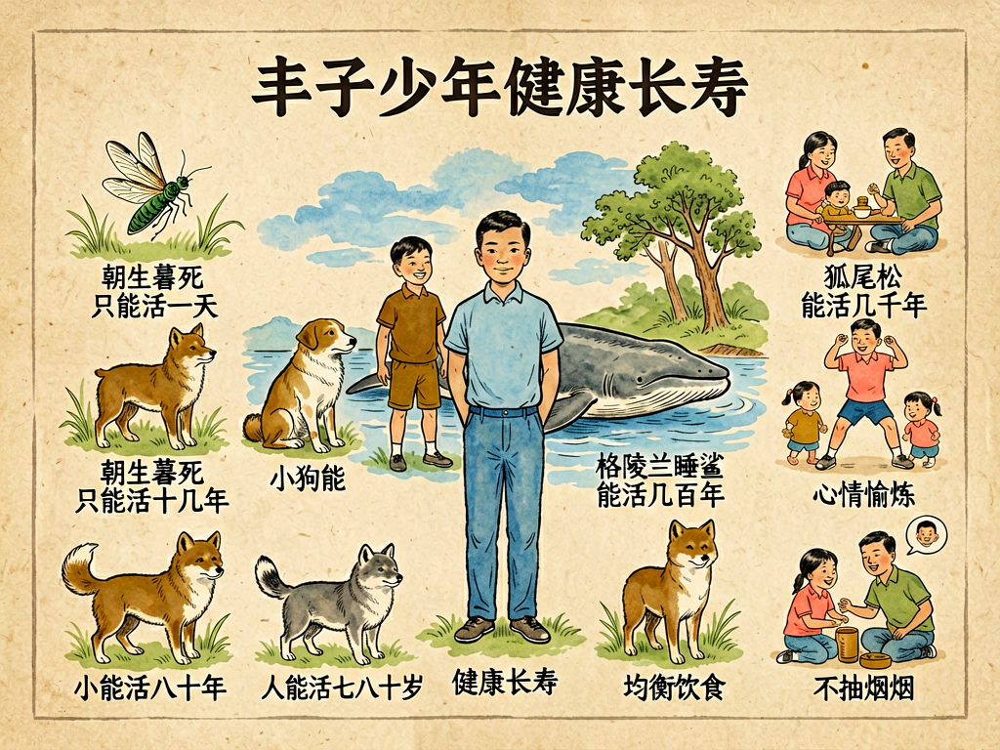

# 第三部 科学与文明
## 第二十三章 谈寿命

---

### 📍 本章导航
**核心主题**：人究竟能活多久？我们为什么会衰老？长寿的秘密是什么？从细胞端粒到生活方式，从公共卫生到前沿抗衰研究，我们来聊聊寿命这件既关乎科学、又关乎人生的大事。  
**你将发现**：
- 不同物种的寿命差异巨大——蜉蝣朝生暮死只活几小时，格陵兰鲨能活400年（明朝出生的鲨鱼可能还在北冰洋游弋），北美颤杨"潘多"已经活了8万年，寿命本质是进化出来的生存策略
- 人类寿命在100年里翻了一倍还多——从1900年全球平均31岁到2024年的73岁，中国人从1949年的35岁涨到2023年的78.9岁，这主要靠公共卫生、疫苗、抗生素，不是靠仙丹妙药
- 衰老不是某一个器官坏了，而是整个系统缓慢失衡——DNA损伤、端粒缩短、线粒体衰退、慢性炎症、干细胞耗竭、蛋白质错误折叠，九大衰老标志同时发生
- 基因对寿命的影响只有20%-30%——活到百岁的人里，只有不到30%有"长寿基因"，剩下70%靠生活方式：冲绳百岁老人天天吃红薯、走路、社交，从不吃保健品
- 现在最火的抗衰研究真相：二甲双胍正在做临床试验（TAME研究，1.2万人参与）、Senolytics清除"僵尸细胞"在小鼠身上延长了36%寿命、NMN/NAD+目前没有足够人体证据——哪些是科学希望，哪些是商业炒作
- 健康寿命比总寿命更重要——中国人均健康预期寿命只有68.9岁，也就是说平均有10年时间是带病生存；我们追求的不是"躺到100岁"，而是"健康活到90岁，最后安详离世"

**阅读建议**：读这一章的时候，不要只想着"怎么长寿"，多想想"怎么活得好"。寿命的意义从来不只在长度，更在密度和质量。这是一章能让你重新看待时间、健康和生命意义的文章——你会明白，好好吃饭好好睡觉，比任何抗衰神药都管用。

---

### 🖋️ 经典原文

这几年，我常常听见人谈论"长寿"。街头巷尾，有人在打听长生不老的秘方，有人在推销各种"抗衰神药"，有人在算自己能不能活过一百岁。好像活得越久，就一定越划算似的。

寿命这个东西啊，实在是人世间最迷人也最容易让人糊涂的话题之一。今天我们就来好好谈一谈：人到底能活多久？我们为什么会老？怎样才能活得既久又好？

---

我先给你们讲几个有意思的事实，打破你们对寿命的刻板印象。

你们知道吗？蜉蝣的成虫，从羽化出来到死亡，往往只活几个小时到一天，它们连嘴都没有，孵化出来就是为了交配产卵，然后立刻死去——为了这几个小时的交配，它们要在水下做两三年的幼虫；
家鼠一般只能活两三年，因为它们随时可能被猫、猫头鹰、蛇吃掉，活太久对传宗接代没意义；
狗的寿命大概十几二十年，小型犬普遍比大型犬长寿，吉娃娃能活15-20岁，大丹犬往往只有8-10岁；
我们人类，在条件好的地方平均寿命已经接近八十岁了，日本连续多年世界第一，女性平均寿命超过87岁；
而弓头鲸能活两百多年，2007年阿拉斯加渔民捕到一头弓头鲸，它身上居然卡着1890年生产的鱼叉头，说明它至少已经活了117岁；
格陵兰鲨甚至能活四百年，性成熟要到150岁——也就是说，现在在北冰洋里游着的某条5米长的鲨鱼，可能明朝万历年间就已经出生了，它见证了整个清朝的兴衰，见证了两次世界大战，现在还在慢悠悠地游着；
植物就更夸张了：美国加州的狐尾松"玛士撒拉"，已经活了4855岁，比埃及金字塔的年纪还大；非洲的龙血树能活8000岁；更夸张的是北美颤杨"潘多"——它看起来是一片森林，其实是一棵树长出来的克隆群落，根系已经在地下活了8万年，从人类还在旧石器时代的时候它就已经存在了。
还有一种灯塔水母，理论上能"返老还童"——成年后能变回水螅体状态，再重新长大，只要不被吃掉、不生病，它就能一直循环下去，相当于生物学上的"永生"。

你们看，**寿命从来不是一个统一的尺度，而是每个物种在漫长进化中选择的生存策略。**

一般来说，代谢慢、体型大、天敌少、繁殖晚的物种，往往更容易长寿——因为它们不需要急着在短时间内完成繁殖，可以慢慢长、慢慢活，把更多能量花在修复身体上。而那些小的、容易被吃掉的动物，通常寿命就短——反正随时可能被吃掉，不如赶紧长大、赶紧生娃，活太久反而没意义。

从这个角度说，"长生不老"从来就不是生命必须追求的目标，**基因关心的不是你这个个体能活多久，而是你能不能把它成功传下去。** 只要你完成了繁殖，把孩子养大，你的任务就完成了，至于你之后能活多久，基因其实没那么在意——当然，这只是一个粗略的进化逻辑，不是说我们就该放任自己老去。

---

接下来，我要告诉你们一个让很多人意外的事实：**我们这代人，能活到七八十岁，在人类历史上是极其反常的。**

你们别觉得"人生七十古来稀"只是文人的夸张，在一百多年前，这句话是百分之百的现实。
- 古罗马时期，人的平均寿命只有22-28岁；
- 中世纪欧洲，平均寿命在30岁左右徘徊；
- 1900年，全世界人类的平均寿命还只有31岁；
- 即使到了1949年，中国人的平均寿命也才35岁左右——比现在的阿富汗、中非共和国还低。

为什么古人寿命这么短？是他们天生就老得快吗？是空气不好、吃的东西"有机"就一定健康吗？都不是。
真正拉低平均寿命的，是极高的**早夭率**，是我们今天已经习以为常的东西，一百年前根本不存在：
- 刚出生的婴儿，有四分之一活不到一岁；每三个孩子里，就有一个活不到五岁——1900年美国的婴儿死亡率是15%，也就是每6个婴儿就有1个死在1岁前；
- 天花、鼠疫、霍乱、流感、肺结核这些传染病，每隔几年就来一次大流行：14世纪的黑死病杀死了欧洲三分之一的人口；1918年西班牙大流感，在短短18个月里杀死了5000万到1亿人，比第一次世界大战死的人还多；
- 生孩子对女人来说就是过鬼门关：1900年美国产妇死亡率是每10万活产死亡850人，也就是每117个产妇就有1个死亡；中国1949年的产妇死亡率是1500/10万，比现在高50倍；
- 一个小小的伤口感染，就可能要了人命——没有抗生素，没有无菌手术，肺炎、肺结核、阑尾炎、产褥热都是绝症。1924年，卡尔文·柯立芝总统的小儿子只是在白宫草坪打网球时脚上磨了个水泡，感染了败血症，一周就死了，年仅16岁；
- 遇到饥荒、战争、洪水、旱灾，更是大面积死亡：1870年代中国丁戊奇荒，饿死1000万人；1920-1921年苏联大饥荒，饿死500万人；1943年孟加拉大饥荒，饿死300万人。

也就是说，如果你能躲过传染病、躲过婴儿夭折、躲过饥荒战争、躲过生孩子，你其实也能活到五六十岁甚至七十岁——但大部分人躲不过。

所以啊，现代人能多活这几十年，首先要感谢的不是什么养生大师，也不是什么名贵补品，而是一整套现代文明的成就：
- 是**公共卫生**：干净的自来水、下水道系统、垃圾处理、食品卫生，让霍乱、伤寒这些通过水和食物传播的瘟疫大大减少。1854年伦敦霍乱大流行，医生约翰·斯诺发现疫情集中在一个被粪便污染的水井周围，去掉水井手柄之后疫情就控制住了——这是公共卫生史上的里程碑，比细菌理论还早30年。单单是自来水和下水道这两项发明，就让城市人口的死亡率下降了一半还多。
- 是**疫苗**：天花已经被彻底消灭了——1980年世界卫生组织宣布天花灭绝，这是人类历史上第一个被彻底消灭的传染病。脊髓灰质炎、麻疹、白喉、百日咳这些以前动辄害死几十万孩子的病，现在几乎见不到了。中国从1978年开始实施计划免疫，现在每年能避免1000多万人死亡。
- 是**抗生素和现代医学**：1928年弗莱明发现青霉素，1940年代青霉素大规模量产，细菌感染不再是死刑。二战期间，青霉素把肺炎的死亡率从90%降到了10%。现在手术能安全做了，慢性病能控制了，生孩子安全了——2023年中国的产妇死亡率已经降到了15.2/10万，比1949年下降了99%。
- 是**营养改善**：我们终于能吃饱饭了。1949年中国人均粮食占有量只有209公斤，2023年是493公斤，翻了一倍还多。蛋白质、维生素不再缺乏，孩子的平均身高比70年前高了10厘米，身体自然能更好地发育和修复。

**记住这句话：人类寿命的大幅延长，首先是公共卫生的胜利，是社会组织能力的胜利，是疫苗、抗生素、清洁饮水的胜利，不是什么灵丹妙药、养生大师的胜利。**
一个很好的证明：在青霉素发明之前，连皇帝都不比普通人长寿多少。清朝10个皇帝，平均寿命只有52岁，其中顺治24岁、同治19岁、光绪38岁就死了，他们享受到当时最好的医疗条件，但还是躲不过传染病。

---

那人到底为什么会老呢？这是个从古到今无数人想破头的问题。

以前有人说，老就是身体里的"元气"耗干了；有人说，是因为"毒素积累"；还有人说，是因为肠道里的细菌产生的毒物把身体慢慢毒坏了。这些说法都有点道理，但都没说到根上。

现代生物学告诉我们，**衰老不是某个零件突然坏了，而是全身多个系统的损耗慢慢积累、慢慢失衡的过程。** 这就像一辆开了几十年的旧汽车，不是说哪个零件一下子就彻底报废了，而是发动机磨损了、油管堵了、轮胎老化了、电路接触不良了、车漆掉了生锈了——所有小问题加在一起，车就越来越不好开，最后彻底走不动了。

在细胞层面，衰老主要是这么几件事在同时发生：

第一，**DNA损伤不断积累。** 我们每个细胞里的DNA，每天都会受到几万次损伤——紫外线、自由基、化学物质、甚至正常的细胞活动都会弄坏DNA。大部分损伤能被修复，但总有一些修不好，这些错误一点点积累，细胞的功能就越来越差，甚至会癌变。

第二，**端粒越来越短。** 我们的染色体末端有一段叫"端粒"的DNA序列，就像鞋带末端的塑料头，保护染色体不被损坏。细胞每分裂一次，端粒就短一点；短到一定程度，细胞就不能再分裂了，进入衰老或者死亡。这就是著名的"海弗里克极限"——人类的体细胞，一般最多分裂50次左右。当然，生殖细胞和癌细胞有端粒酶，能把端粒补长，所以它们能一直分裂。

第三，**线粒体功能下降。** 线粒体是我们细胞里的"发电厂"，负责把食物里的能量转换成细胞能用的ATP。年纪大了之后，线粒体的效率越来越低，产生的能量越来越少，还会漏出更多自由基，进一步损伤细胞。

第四，**衰老细胞越积越多。** 有些细胞受损之后，既不死亡，也不分裂，就像"僵尸细胞"一样待在组织里，还会释放出炎症因子，把周围的好细胞也带坏。这些衰老细胞积累得越多，组织功能就越差，炎症水平就越高——很多老年病，比如关节炎、动脉粥样硬化、甚至老年痴呆，都和慢性炎症有关。

第五，**干细胞耗竭。** 我们身体里有干细胞，它们是"后备队"，能分裂补充受损和死去的细胞。但年纪越大，干细胞的数量和活性就越低，组织修复能力就越差——伤口愈合慢了，肌肉长不回去了，头发白了，皮肤皱了，都是因为干细胞跟不上了。

第六，**蛋白质稳态丧失。** 细胞里的蛋白质必须折叠成正确的形状才能工作，错误折叠的蛋白质要被及时清理掉。年纪大了之后，这个"质量控制"系统越来越差，错误折叠的蛋白质堆在一起，就会形成各种"垃圾"——比如大脑里的β淀粉样蛋白沉积，就是老年痴呆的标志之一。

你们看，衰老就是这么一回事：没有一个单一的"衰老基因"，也没有一个"总开关"，而是无数个微小的损伤和错误，在几十年的时间里慢慢积累，最后从量变到质变。

---

那是不是说，我们对衰老就完全无能为力，只能听天由命？当然不是。

首先我要讲清楚一件事：**基因确实影响寿命，但远没有你们想的那么重要。** 很多人一谈起长寿，就问"是不是看基因？我家长寿/短寿，我是不是也会这样？"

研究发现，寿命的遗传度大概只有20%-30%——也就是说，你能不能长寿，只有不到三分之一是基因决定的，剩下三分之二以上，取决于你的生活方式和环境。

那些著名的长寿地区，比如日本冲绳、意大利撒丁岛、希腊伊卡里亚、还有我们中国的巴马，科学家去研究了半天，也没发现什么特殊的"长寿基因"。他们真正的共同点，是一整套非常朴素的生活习惯：
- **吃得简单，不过量**：都是以植物性食物为主，多蔬菜、多全谷物、少红肉，吃到七八分饱就停；
- **一直活动**：不是说非要去健身房练得多狠，而是一辈子都在动——走路、种地、做家务、干点力所能及的活，不会年纪大了就彻底歇着；
- **社交紧密**：家人朋友常来常往，不孤独，老年人仍然在家庭和社区里有位置，有事情做；
- **生活有节律**：不熬夜，不昼夜颠倒，日出而作日落而息；
- **压力不大**：慢节奏的生活，没有持续的焦虑和精神紧张。

就这么简单，没有任何神秘的东西。这些"低技术含量"的习惯，比任何补品、任何保健品、任何"抗衰神药"都管用。

具体到我们每个人，想活得长、活得好，能做的事情其实很朴素：
1. **别抽烟，少喝酒**：这是最明确、最被证实的减寿因素；
2. **保持活动，留点肌肉**：肌肉量是老年生活质量最关键的指标之一，年纪大了尤其要做力量训练，别让肌肉太快流失；
3. **吃的别太好、别太多**：少糖、少油、少加工食品，多吃天然食物，控制总热量，不要顿顿吃撑；
4. **睡好觉，别熬夜**：睡眠是身体修复最重要的时间，长期睡不好，所有健康问题都会来；
5. **控制好血压、血糖、血脂**：这"三高"是心脑血管病的元凶，而心脑血管病现在是全世界第一大死因；
6. **有点事做，有点朋友**：孤独和无所事事，对健康的伤害不比抽烟小。老年人也要有爱好、有社交、有目标感。

这些建议听上去一点都不酷，一点都不"高科技"，但这就是目前被科学证实的、最有效的"长寿秘方"。

---

说到这里，肯定有人会问：那现在很火的那些抗衰研究呢？二甲双胍、雷帕霉素、NMN、NAD+、清除衰老细胞、干细胞疗法——这些东西靠谱吗？我们这代人能不能赶上"抗衰老的革命"，活个一百二十岁？

我得跟你们说实话：**这些研究方向确实很有希望，但现在离普通人能用、而且安全有效，还差得远。**

- **二甲双胍**是治二型糖尿病的老药，吃了几十年了，很安全。研究发现，吃二甲双胍的糖尿病人，甚至比没得糖尿病的人活得还长，癌症和老年病的发病率也低。现在FDA已经批准了临床试验，看看它能不能延缓衰老——但注意，现在还只是在做试验，没有正式批准用来"抗衰"，健康人不要自己随便吃。
- **雷帕霉素**是一种免疫抑制剂，用来防止器官移植排异的。动物实验里，它确实能延长小鼠的寿命，但它有副作用，会抑制免疫系统，还可能导致高血脂、高血糖，现在绝对不能自己乱吃。
- **NMN和NAD+前体**这几年炒得最火，说什么"返老还童"。NAD+确实是细胞里很重要的物质，年纪大了会减少，但是吃NMN能不能有效提高身体里的NAD+水平，能不能延长人的寿命，能不能抗衰老，目前还没有足够大规模、长期的人体试验证据，而且产品良莠不齐，水很深。
- **清除衰老细胞**（Senolytics）是现在很热门的方向，科学家找到了一些药物，能选择性地杀死那些"僵尸细胞"，在小鼠身上能延长寿命、改善很多老年病。现在也在做人体试验，早期结果看起来不错，但还没到上市普及的程度。
- **干细胞疗法、基因编辑、器官培养**这些更前沿的技术，潜力很大，但现在还主要在实验室和早期临床阶段，离普通人常规使用还有很长的路要走。

我为什么要跟你们说这些？因为现在"抗衰"是个巨大的市场，无数商家盯着你们的钱包，把实验室里的一点点希望，包装成已经成熟的神药，卖得死贵。你们一定要记住：**凡是吹得神乎其神、说"吃了就能年轻二十岁""包治百病"的，都是骗子。**

真正的科学进步从来不是突然蹦出来一个神药，让所有人长生不老；它是缓慢的、渐进的，我们慢慢攻克一个又一个疾病，慢慢改善生活条件，慢慢把健康预期寿命一点一点往后推。

---

最后，我想跟你们谈谈比"活多久"更重要的事——"活成什么样"。

现在大家都在谈长寿，谈怎么活到一百岁，但很少有人问：活到一百岁的时候，你是什么状态？

如果活到一百岁，但是最后二十年都躺在床上，生活不能自理，认不出人，浑身是病，天天受罪，那这个长寿有什么意义呢？反过来，如果活到八九十岁，生活能自理，脑子清楚，能自己吃饭、走路、看书、见朋友，最后没受什么罪，在睡梦中安详离世，这难道不比在病床上拖十年更好吗？

所以现在科学界越来越重视一个概念，叫**"健康预期寿命"**——不是你总共活了多少年，而是你能健康地、独立地、有尊严地活多少年。我们真正应该追求的，不是单纯把"总寿命"拉长，而是把"健康寿命"拉长，把最后那段生病、失能、需要人照顾的时间缩到越短越好。

再往深一层说，寿命这个问题，谈到最后一定会谈到人生意义。

人为什么想长寿？根本上是因为我们怕死，因为我们觉得活着好，因为我们有想做的事、想见的人、想体验的东西。但是如果只是机械地把寿命拉长，却失去了行动能力、思考能力、爱和被爱的能力，只是在病榻上数日子，那长寿反而可能变成一种惩罚。

中国古人说"五福"，最后一福叫"善终"——这是很高的智慧。无疾而终，安详离世，不给自己和家人添太多痛苦，这本身就是一种福分。

我年轻的时候，也曾经幻想过科学能让人活几百年、几千年。但现在年纪大了，我越来越觉得：**寿命的意义，不在于它有多长，而在于你用这几十年时间，做了什么，体验了什么，给世界留下了什么，有没有爱，有没有被爱，有没有白白来这世上走一遭。**

你们看那些千年的古树，它们确实活得久，但它们就站在那里，什么也不说，什么也不做；我们人类虽然只能活几十年，但我们能创造、能爱、能思考、能探索宇宙的奥秘、能写出诗和歌、能给后人留下点什么。从这个角度说，我们活的密度，比那些千年古树高多了。

当然，我不是说我们不要追求健康长寿——谁都想多看看这个世界，多陪陪家人，多做些自己喜欢的事。我只是想提醒你们：**别把长寿本身当成目标，把日子过好，把身体照顾好，让自己健康、清醒、有质量地活着，才是最重要的。**

向死而生，不是让你们悲观，而是让你们更清楚什么才是真正重要的东西，少在烂事上浪费时间，少糟蹋自己的身体。毕竟，我们都只能活一次，这唯一的一次人生，可不能活得太潦草了。

---

> 📜 **科学史话：从炼丹术到现代老年学——人类对抗衰老的千年探索**
>
> 人类对抗衰老、追求长生的历史，几乎和文明本身一样古老。
>
> 最早的"抗衰研究"，大概要算中国古代的炼丹术。从秦始皇派徐福东渡寻找长生不老药，到历代道士在深山里炼金丹，无数人为了"长生"吃了无数含汞、含铅、含砷的"仙丹"——这些东西不仅不能让人长寿，反而会让人慢性中毒，死得更快。据说唐朝好几个皇帝，都是吃金丹吃死的。
>
> 不过炼丹术也不是全无贡献，至少它无意中发明了火药，还发展出了一整套化学实验方法，算是现代化学的老祖宗。
>
> 西方也一样，中世纪的炼金术士们一边想把贱金属炼成黄金，一边也在找"哲人石"——据说不仅能点石成金，还能让人长生不老。当然，他们也没找到。
>
> 真正把衰老从"神话"和"玄学"变成科学研究对象，是十九、二十世纪的事了。
>
> 1881年，进化生物学家奥古斯特·魏斯曼提出，衰老和死亡是进化出来的——老的个体死去，给年轻个体腾位置和资源，对整个物种有利。这个想法虽然不完全对，但第一次把衰老放进了生物学的框架里。
>
> 1961年，美国科学家伦纳德·海弗利克（Leonard Hayflick）做了一个著名的实验：他把人的成纤维细胞放在培养皿里培养，发现不管条件多好，细胞最多分裂大约50次，就会停止分裂，进入衰老。这就是我们前面说的"海弗里克极限"。这个发现推翻了之前大家认为"只要条件合适，细胞能无限分裂"的想法，第一次证明了衰老确实是细胞内在的、有程序的过程。后来人们才知道，这背后的机制就是端粒缩短。
>
> 1978年，伊丽莎白·布莱克本（Elizabeth Blackburn）发现了端粒的结构，后来她又和卡罗尔·格雷德（Carol Greider）一起发现了端粒酶——那个能修补端粒的酶。她们因此拿到了2009年的诺贝尔奖。
>
> 也是在20世纪，随着公共卫生和医学的进步，人类平均寿命开始了前所未有的快速增长——从1900年的30多岁，到2000年的接近70岁，一百年里翻了一倍还多，这在人类历史上是从来没有过的事。
>
> 进入21世纪之后，衰老研究真正进入了黄金时代。2010年左右，科学家提出了"衰老的标志"（Hallmarks of Aging），把衰老的机制总结成9个（后来扩展到12个）主要特征，大家终于有了统一的研究框架。现在全世界有无数科学家在研究衰老，各种生物技术公司都在投入巨资研发抗衰药物和疗法，我们这代人，很可能会亲眼看到衰老研究取得重大突破。
>
> 但是我还是要重复一句：在神药出现之前，好好吃饭、好好睡觉、多运动、少抽烟喝酒、开开心心过好每一天，仍然是你能做的最好的投资。

---

> 🔬 **科学更新：我们这代人能活到120岁吗？**
>
> 高士其先生写这篇文章的时候，中国的平均寿命还不到40岁，"人生七十古来稀"还是一句大实话。八十多年过去，我们对衰老的认识已经发生了天翻地覆的变化，很多以前只存在于科幻里的事情，现在正在慢慢变成现实。
>
> **衰老不再被认为是"必然的、不可干预的过程"**。现在科学界已经形成共识：衰老是可以被延缓、被干预的。我们已经能在线虫、果蝇、小鼠这些实验动物身上，通过基因编辑、药物、饮食限制等方法，显著延长它们的寿命，并且改善它们老年时的健康状态。在小鼠身上，我们已经能把它们的寿命延长30%-50%——换算成人，就是从80岁变成100-120岁，而且是健康的120岁。
>
> **第一个真正的"抗衰老药物"可能在未来10-20年内上市**。现在有好几个候选药物已经进入了人体临床试验阶段：二甲双胍的抗衰老试验（TAME）正在进行中；清除衰老细胞的Senolytics药物已经在做骨关节炎、肺纤维化、阿尔茨海默病等老年病的临床试验，早期结果显示能改善身体功能、减轻虚弱感；雷帕霉素类似物的人体试验也在进行中。
>
> **基因编辑和再生医学正在打开更多可能性**。CRISPR基因编辑技术已经能精确修改DNA，未来我们可能可以直接修复那些导致衰老和疾病的基因突变；诱导多能干细胞（iPSC）技术能把你自己的皮肤细胞重编程成干细胞，再分化成任何你需要的细胞、组织甚至器官——将来器官坏了，不用等别人捐献，直接用你自己的细胞"种"一个新的出来就行，没有排异反应。
>
> **人工智能正在彻底改变药物研发**。以前研发一个新药要十几年、几十亿美元，现在AI能在几个月时间里筛选几千万个化合物，大大加速抗衰药物的研发速度。最近几年已经有好几个AI设计的药物进入了临床试验。
>
> 但是，即使所有这些技术都成功了，我们也不太可能在短期内看到"长生不老"。更可能出现的情况是：我们会把健康预期寿命延长10年、20年、30年，人们能更长久地保持年轻和健康，老年期和失能期被压缩得很短。也就是说，你可能40岁的时候看起来像30岁，60岁的时候像40岁，一直健康活到100岁、120岁，然后在很短的时间里平静离世。
>
> 这其实是最理想的状态——我们追求的不是"不死"，而是"健康地老，慢慢地老，最后痛快地走"。

---

> 🌍 **现实连接：我们正在进入长寿社会，你准备好了吗？**
>
> 当越来越多人活到八九十岁甚至一百岁，长寿就不再只是个人养生问题，它会变成整个社会必须面对的问题。
>
> **退休制度要重新设计了**。以前人平均活六七十岁，工作到60岁退休，领几年退休金就去世了，这个制度是可持续的。但现在人能活到八九十岁，如果60岁就退休，那后面二三十年都要领养老金，还要用大量医疗资源，养老金和医保体系都会承受巨大压力。未来很可能会逐步延迟退休年龄，而且退休不再是"彻底不工作"，而是变成更灵活的阶段——很多人可能会换一份轻松点的工作，或者做志愿者，或者发展爱好，一直保持社会参与。
>
> **终身学习会成为常态**。以前"前二十多年读书，中间三十多年工作，最后二三十年养老"的三段式人生，已经不适合长寿时代了。未来你可能会在人生的不同阶段多次回到学校学习新技能，换好几次职业，甚至在七八十岁还在尝试新东西。
>
> **养老和照护会成为大问题**。如果最后十几年生活不能自理，谁来照顾你？光靠子女是不够的——未来一对年轻人可能要照顾四个甚至八个老人。所以专业的护理体系、社区养老、适老化改造、长期护理保险，这些都会慢慢建立起来。
>
> **年龄歧视会越来越过时**。以前大家觉得"三十不学艺""五十就老了"，但在长寿时代，50岁可能正当年，70岁还能创业、还能谈恋爱、还能开始一段全新的人生。我们对"什么年龄该做什么事"的刻板印象，会慢慢改变。
>
> **长寿不是只靠个人就能实现的**。它需要更好的公共卫生、更好的医疗体系、更公平的社会保障、更友好的城市和社区设计——要有电梯、有无障碍通道、有社区医院、有老年人能去的公园和活动中心，要让老年人即使行动不便，也能有尊严地生活。
>
> 说到底，长寿社会好不好，不只是看有多少人活过了一百岁，更是看那些活到了一百岁的人，过得幸不幸福、有没有尊严、是不是还被需要。

---

> 💡 **动手试一试：测测你的"生物年龄"是多少**
>
> 我们都有"日历年龄"——就是你身份证上的年龄，过一年长一岁，这个是改不了的。但你知道吗？还有一个"生物年龄"——它衡量的是你身体实际的衰老程度，和你的日历年龄可能差很多。有些人40岁，身体状态跟50岁一样；有些人60岁，身体还跟40多岁的人一样好。
>
> 我们没法像专业机构那样精确测量端粒长度、DNA甲基化这些指标，但你可以通过几个简单的测试，大致估算一下自己的生物年龄。
>
> **测试1：握力测试**
> 握力是衡量整体肌肉力量和衰老程度非常好的指标。用一个握力计（网上几十块钱就能买到），尽全力握三次，取最大值。
> - 成年男性一般在40-50公斤以上算正常；
> - 成年女性一般在25-30公斤以上算正常；
> - 如果握力比同龄人低很多，说明肌肉量偏少，衰老速度可能偏快，需要加强力量训练了。
>
> **测试2：坐站测试**
> 坐在一把40厘米左右高的没有扶手的椅子上，双手交叉抱在胸前，然后站起来再坐下，记录30秒内能做多少次。
> - 40岁左右的健康人，30秒应该能做20次以上；
> - 60岁左右能做15次以上算不错；
> - 70岁以上能做10次以上算可以。
> 这个测试能反映你的下肢力量、平衡能力和心肺功能。
>
> **测试3：单脚站立测试**
> 双手叉腰，闭上眼睛，单脚站立，看你能坚持多久不摔倒、不放下另一只脚、不睁开眼睛。
> - 30岁左右的人一般能坚持60秒以上；
> - 40岁能坚持40秒以上；
> - 50岁能坚持30秒以上；
> - 60岁能坚持20秒以上；
> - 70岁能坚持10秒以上。
> 这个测试反映你的平衡能力，而平衡能力衰退是老年摔倒的主要原因。
>
> **测试4：静息心率**
> 早上醒来还没起床的时候，数一下自己一分钟的脉搏。
> - 健康成年人静息心率一般在60-80次/分钟；
> - 经常运动的人可能在50多次，这是好现象；
> - 如果静息心率经常在80次以上，说明心肺功能可能偏差。
>
> **测试5：反应速度**
> 让一个朋友拿一把直尺，刻度朝下，你把手放在直尺最下端的位置（0刻度那里），准备接。朋友突然松手，直尺掉下来，你尽快用手捏住它，看你捏住的地方是多少厘米。
> - 10厘米以内，反应速度相当于20岁；
> - 15厘米左右，相当于30岁；
> - 20厘米左右，相当于40岁；
> - 25厘米以上，说明反应速度偏慢了。
>
> 这些测试当然不精确，但它们能给你一个提醒：你的身体状态和你的实际年龄匹配吗？如果差距很大，那就说明你需要调整生活方式了——多运动，练肌肉，睡好觉，少熬夜。
>
> 当然，最重要的"测试"其实是你自己的感觉：你每天精力充沛吗？爬楼梯喘不喘？容易累吗？睡眠好吗？心情好吗？这些主观感受，有时候比任何数据都更准确。

---

### 💬 读后思考与讨论

1. 以前你对衰老和长寿是什么印象？读完这一章，你对这个问题的看法有没有改变？最让你意外的是什么？
2. 有人说"寿命主要是基因决定的，再怎么养生也没用"，你同意吗？结合本章内容，谈谈基因和生活方式各自占多大比重。
3. 如果有一种药，能让你健康活到120岁，但你必须从30岁开始每天吃，而且药不便宜，你愿意吃吗？为什么？
4. 你觉得"健康预期寿命"和"总寿命"哪个更重要？如果让你选，你愿意健康活到80岁然后迅速离世，还是病恹恹地躺到100岁？为什么？
5. 很多人退休之后就一下子老得很快，你觉得这是为什么？除了身体健康之外，"有事做""被需要"对长寿有多重要？
6. 我们正在进入长寿社会，你觉得我们的社会要做哪些改变，才能适应人人长寿的时代？

### 🔗 关联阅读
- 第一部第一章：《我的名称》→ 了解细菌在什么条件下能"永生"，以及单细胞生物和多细胞生物寿命策略的不同
- 第三部第一章：《细胞的不死精神》→ 理解为什么个体会死亡，但生命本身能通过细胞分裂延续38亿年
- 第三部第二十二章：《星际航行家离开地球以前》→ 当我们思考星际旅行需要几十年、几百年时，我们也在重新思考人类寿命和文明延续的关系
- 第二部第一章：《人生七期》→ 看看人从出生到衰老，一生会经历哪些阶段，每个阶段的生理和心理特点
