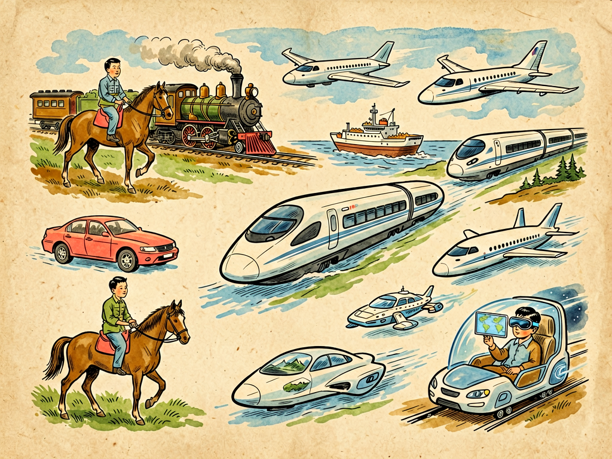

# 第三部 科学与文明
## 第二十四章 未来的旅行

---

### 📍 本章导航
**核心主题**：从步行到高铁，从帆船到飞机，从电话到虚拟现实——旅行的历史，就是人类不断突破距离限制的历史。未来我们会怎么旅行？交通技术的进步会怎样改变我们的生活、城市和整个文明？  
**你将发现**：
- 人类的旅行速度在两百年里提升了100倍——从步行4公里/小时，到马15公里/小时，到蒸汽火车60公里/小时，到高铁350公里/小时，再到喷气式飞机900公里/小时，而信息以光速30万公里/秒传播
- 速度改变的不只是时间，它重塑了一切：古罗马帝国从罗马到边境要走3个月，所以它只能那么大；今天从北京到纽约只要13小时，地球变成了"地球村"
- 未来交通的四个方向：更快（600公里磁悬浮、4000公里高超音速飞机、真空管道超级高铁）、更远（太空旅游、深海旅行）、更稳（L5级自动驾驶，事故率降低90%）、更绿（电动车、氢能、可持续航空燃料，2050年交通净零排放）
- 最深刻的旅行革命不是身体先动，而是信息先动——5G远程手术延迟只有1毫秒，VR旅游已经能达到视网膜级分辨率，我们正在进入"不动身也能到达"的时代
- 技术进步的代价：全球交通每年排放80亿吨二氧化碳，占总排放的24%；地球轨道上有3.6万块大于10厘米的太空垃圾；全球每年有135万人死于交通事故，90%是人为失误
- 真正先进的交通，不是让少数人飞得最快——协和式超音速飞机退役了，因为只有富人坐得起——而是让所有人都能更安全、更便宜、更环保地移动

**阅读建议**：读这一章的时候，不妨想想你自己的出行方式和你小时候比有什么变化，和你爷爷奶奶那辈比又有什么变化。你爷爷奶奶年轻时从村里到县城可能要走一天，现在你坐高铁一天能穿越半个中国。交通改变的从来不只是路程，它改变了我们整个的生活方式、我们对世界的认知、甚至我们的家庭结构。

---

### 🖋️ 经典原文

这几天，我常常坐在窗前，看着天上一架架飞机飞过，看着路上一辆辆汽车跑过，心里就忍不住想：五十年后、一百年后，人们会怎么旅行呢？

你们这些孩子，是在铁路、汽车、飞机的时代长大的，觉得出门坐车、坐飞机是天经地义的事。可是你们知道吗？就在一百多年前，这一切还都是幻想。那时候的人，出一趟远门是天大的事——几百公里的路，坐马车要走十几天，遇到刮风下雨、山路不好走，几个月都到不了。很多人一辈子都没离开过自己出生的村子，对他们来说，一百公里外就是"远方"了。

今天我们就来聊聊旅行这件事——聊聊人类是怎么一步步从用脚走路，到能飞上蓝天、飞出地球的；聊聊未来，我们还能怎么"走"得更远、更快、更舒服。

---

我先给你们讲一部人类的旅行史，这其实就是一部人类和距离作战的历史。

最早的时候，我们的祖先靠自己的两条腿走路。一个人不停歇地走，一天大概能走30-40公里，时速4-5公里，这就是最原始的"旅行速度"。那时候人类的活动半径很小，一个狩猎采集部落的活动范围一般不超过方圆20公里——跟现在一个普通城市公园差不多大。很多人一辈子都没见过山那边是什么样子。

大约6000年前，人类学会了驯养动物——马、牛、驴、骆驼，我们第一次把"力气"外包给了别的生物。骑马一天能走100多公里，时速15公里左右，比走路快了两三倍。公元前2000年左右，轮子在美索不达米亚发明了——有了轮车，我们就能拉更多东西，走更远的路。秦始皇修驰道，就是为了让马车能在全国快速通行，那时候从咸阳到现在的广州，要走一个多月。

再后来，帆船出现了。15世纪哥伦布发现美洲，坐的是小型帆船，横渡大西洋花了70天，一路上死了一半船员；麦哲伦环球航行花了3年，出发时265人，回来时只有18人，麦哲伦自己都死在半路上。帆船要看风向，看天气，走一趟要好几个月甚至几年，而且非常危险，海难、坏血病、风暴，随便哪一样都能要人命。

真正的革命是蒸汽机带来的。1825年世界第一条公共铁路在英国通车，斯蒂芬森的"火箭号"蒸汽机车时速46公里；19世纪70年代，蒸汽船取代了帆船，跨大西洋航行从几个月缩短到10天以内。人类第一次不用靠动物、不用靠风力，能用机器带着自己跑了。那时候的人第一次感受到：原来远方可以这么近。

接下来的一百年里，进步速度快得让人眼花缭乱：
- 1886年，本茨发明第一辆实用汽油汽车，时速16公里；
- 1903年12月17日，莱特兄弟的"飞行者一号"在北卡罗来纳州的沙滩上飞了12秒，36米远——还没有现在一架波音747的机翼长；
- 1957年，波音707喷气式客机投入运营，民航开始普及，巡航速度900公里/小时，普通人花十几个小时就能从地球这一头飞到那一头；
- 现在，中国的高铁能以350公里的时速平稳奔驰，从北京到上海1318公里，最快只要4小时18分钟——这在100年前要走一个多月。

你们看，在过去这两百年里，人类的移动速度提高了一百多倍。骑马时代从北京到广州要走2个月，现在高铁8小时，飞机3小时。以前一辈子都到不了的地方，现在早上出发下午就能到。距离，这个几千年来横亘在人类面前最大的障碍之一，正在被我们一点一点克服。

---

但是我要告诉你们：速度变快这件事，改变的绝对不只是"路上花的时间"，它会从根本上改变我们整个社会的结构，改变我们的生活方式。

你们想想看，当交通很慢的时候，会发生什么？
- 绝大多数人一辈子只能待在自己出生的地方，子承父业，人口流动很少；
- 一个地方遇到灾荒，人们很难逃出去，很容易大面积饿死；
- 知识和观念传播得很慢，一个地方的新思想、新技术，可能要几十年甚至上百年才能传到另一个地方；
- 商品很难远距离运输，所以每个地方基本都自给自足，你能吃到、用到的东西，几乎都是本地出产的；
- 国家很难管理太大的疆域——因为消息传过去要几个月，军队开过去要半年，边远地区很容易失控。

但是当交通变快之后，这一切都变了：
- **城市变大了**：以前城市一般就是方圆几公里，因为人走路最多走这么远。现在有了地铁、公交、私家车，一个城市能扩展到几十公里甚至上百公里，北京、上海这样的超大城市，能住两千万人；
- **出现了"都市圈"**：现在很多人住在河北，在北京上班，每天坐高铁通勤，一个小时就到——这在以前是不可想象的；
- **全球化成为可能**：南美洲的水果、东南亚的海鲜、欧洲的工业品，几天就能运到我们的餐桌上；一个国家发生的事，第二天全世界都知道；
- **家庭结构也变了**：以前几世同堂住在一起，因为孩子不能走太远。现在孩子可以去几千公里外上大学、工作，过年过节坐飞机几个小时就回来了，一家人即使不住在一个城市，也能经常见面。

更重要的是我们心理上的变化。以前的人觉得"远方"是神秘的、危险的、陌生的；现在的孩子从小就去过很多地方，他们眼里的世界很小，是一个连在一起的整体。**当你能在一天之内到达任何一个地方，你对"距离"的感觉就完全不一样了。**

---

那接下来呢？未来的旅行会是什么样子？我不是算命先生，没法准确预测一百年后的事，但根据现在科学发展的方向，我们可以大概看出几个趋势，我把它总结成四个词：**更快、更远、更稳、更绿**。

先说**更快**。
现在的高铁已经跑到350公里/小时，未来的磁悬浮列车能跑到600、甚至1000公里/小时——在真空管道里跑的"超级高铁"，理论上甚至能达到几千公里的时速，那时候北京到上海可能只要一个小时。
飞机也会越来越快。现在的协和式超音速客机因为噪音和成本问题退役了，但将来肯定会有更安静、更省油的超音速甚至高超音速飞机，那时跨太平洋飞行可能只需要两三个小时，早上在北京吃早饭，晚上就能到纽约吃晚饭。
但是光单个交通工具快还不够，整个交通系统要一起快才有用。未来的车站、机场会和地铁、公交、无人驾驶汽车无缝连接，你不用拖着行李转来转去，也不用排长队安检、等车，智能调度系统会把你的行程安排得明明白白，换乘时间从几小时缩短到几分钟。

然后是**更远**。
我们现在的旅行，基本还在地球表面——最高的山、最深的海，对大多数人来说还是去不了的地方。未来，深海旅行、极地旅行会越来越普及，我们不仅能去月球、火星，甚至可能有普通人能负担得起的太空旅游——花一笔钱，就能到近地轨道上转一圈，从太空看看我们这颗蓝色的星球。
当然，真正的恒星际旅行，就像我前面《星际航行家》那章讲的，离我们还很远，但我们正在一步一步朝那个方向走。

第三个趋势是**更稳**——也就是更安全、更方便。
现在的交通事故，大部分都是人为失误造成的——疲劳驾驶、酒后驾驶、操作不当。未来的自动驾驶汽车、自动驾驶飞机，会用传感器、雷达、人工智能代替人来驾驶，它们不会累、不会走神、不会路怒，反应比人快得多，能把事故率降低几个数量级。
未来的交通工具会更智能，能自动避开危险，能实时感知天气、路况，老人、小孩甚至残疾人，都能方便地出行。

最后一个，也是最重要的趋势：**更绿**。
你们知道吗？现在交通排放的二氧化碳，已经占了全球碳排放的很大一块，是气候变化的重要元凶。现在的汽车、飞机大部分还是烧汽油、煤油，不仅污染空气，还排放温室气体。
未来的交通一定是朝着低碳、环保的方向走：电动汽车会全面替代燃油车，高铁、地铁这种公共交通会越来越发达，氢能、生物燃料、可持续航空燃料会替代现在的化石燃料，甚至可能出现电动飞机、太阳能飞机。
真正先进的文明，不会为了跑得快就把自己的家园搞脏搞坏，我们一定要找到既能快速移动、又不破坏环境的办法。

---

但是你们知道吗？未来最最革命性的旅行方式，可能根本不是把身体运到远方，而是先把我们的感官、我们的信息送到远方。我把这叫做**"不动身的旅行"**。

你们现在已经能体会到一点了：用手机打视频电话，你能立刻看到千里之外的家人，和他们面对面说话，这比写信、打电报又快了多少倍；医生在北京，能通过5G网络和机器人，给几千公里外的病人做手术；老师在上海上课，山区里的孩子通过直播也能一起听。

未来这种事情会越来越多：
- **虚拟现实（VR）和增强现实（AR）**会越来越成熟，你戴上眼镜，就能"身临其境"地到卢浮宫看展览，到马尔代夫看海，到火星表面"走"一圈——虽然你还坐在自己家里，但你的眼睛、你的耳朵，甚至你的触觉，都会告诉你你就在那里；
- **遥操作机器人**会越来越先进，你可以在家里操控一个机器人，让它替你去办公室上班、去工厂干活、去危险的地方救灾，你看到的、摸到的都和机器人一模一样，就像你亲自在那里一样；
- **全息投影**技术可能让远方的人"活生生"地出现在你面前，就像《星球大战》里演的那样，你们能坐在一张桌子前聊天、吃饭，虽然实际上你们隔着半个地球。

你们看，这是不是另一种形式的"旅行"？以前旅行必须把整个身体运过去，未来我们可以先把信息、感知、意识送过去，身体甚至根本不用动。这种旅行没有碳排放，不会堵在路上，也不会出交通事故，它会彻底改变我们对"在场"的定义。

---

但是，我必须给你们泼点冷水。未来的旅行不是只有光鲜亮丽的一面，任何技术进步都会带来新的问题，我们不能只想着好处，不想代价。

第一个问题是**拥堵和资源消耗**。人人都能买车、坐飞机，路上车太多就会堵，天上飞机太多也会堵，还要消耗大量能源、土地、钢材。如果全世界七十多亿人都像美国人那样每人一辆车，天天坐飞机，那地球的资源根本承受不了。
第二个问题是**污染和碳排放**。虽然我们在发展新能源，但目前交通还是碳排放的大户，如果不解决好这个问题，我们的地球会越来越暖，气候会越来越极端。
第三个问题是**数字鸿沟和公平问题**。新技术刚出来的时候肯定很贵，只有有钱人能享受——超音速飞机、太空旅行、VR设备，一开始都不是普通人能负担得起的。如果未来只有富人能快速出行、能享受最好的技术，而穷人只能待在原地，那技术进步反而会加剧不平等。
第四个问题是**新的风险**。汽车比马车快，但车祸也比马车事故严重得多；飞机快，但一旦出事生还率极低；自动驾驶如果被黑客攻击了怎么办？太空旅行如果出事故怎么办？我们走得越快，一旦出错代价就越大。
还有太空垃圾——现在地球轨道上已经飘着几千万块太空垃圾了，大的是报废卫星，小的是螺丝、碎片，这些东西都以每秒几公里的速度飞，一块小小的碎片就能把卫星、空间站撞坏。如果我们再往太空中扔更多东西，最后近地轨道可能会被垃圾堵满，我们自己都出不去了。

所以啊，未来不是越快乐、越快活越好，任何技术都要考虑代价、考虑公平、考虑可持续性。**真正好的未来交通，不是让少数人以最快的速度跑来跑去，而是让所有人都能安全、便宜、环保地出行，同时不破坏我们这颗星球。**

---

最后，我想跟你们说点掏心窝子的话。
我年轻的时候，火车还是个稀罕东西，从北京到上海要走一天一夜，那时候觉得真是快啊。现在坐高铁四个多小时就到了，将来可能更快。但是有时候我又想：我们要这么快，到底是为了什么呢？
快，当然有快的好处——能见到想见的人，能抓住更多机会，能去更多地方，能看到更大的世界。但是如果我们一直在赶路，一直在追求更快，就会忘了慢下来看风景，忘了享受和家人在一起的时间，忘了为什么出发。
你们将来会生活在一个比今天快得多的世界里，可能一天之内就能绕地球一圈，可能在家就能"去"任何地方。但我希望你们记住：**旅行的目的，从来不是为了快点到达终点，而是为了路上的风景，为了遇见不同的人，为了看见不同的生活，为了变成更开阔的自己。**
如果技术让我们走得更快，但也让我们变得更浮躁、更没有耐心、更不能好好感受世界，那跑得再快又有什么意义呢？
未来在你们手里，希望你们能造出更快、更稳、更绿的交通工具，但也希望你们永远记得：**慢慢走，欣赏啊。**

---

> 📜 **科学史话：人类是怎么越跑越快的——交通革命的五个里程碑**
>
> 人类移动速度的提升，不是匀速的，而是被几个关键发明一下子拉上台阶的。
>
> **第一个里程碑：车轮（约公元前3500年）**。在轮子发明之前，人们要运重东西只能靠扛、靠拖，非常费劲。最早的轮子是美索不达米亚人发明的，一开始是用来做陶器的陶轮，后来才装到车上。车轮看起来简单，却是人类历史上最伟大的发明之一——它把滑动摩擦变成滚动摩擦，一下子让运输效率提高了好几倍。
>
> **第二个里程碑：蒸汽机与铁路（19世纪初）**。1804年，英国人特里维西克造出了第一台在轨道上跑的蒸汽机车；1825年，世界上第一条公共铁路在英国通车，当时的火车时速只有20多公里，但已经比马车快了。到19世纪末，火车时速已经能到100公里了，而且能拉上千吨货物，彻底改变了陆地上的运输方式。铁路修到哪里，工业文明就传到哪里。
>
> **第三个里程碑：内燃机与汽车、飞机（19世纪末-20世纪初）**。1886年，本茨发明了第一辆实用的汽油汽车；1903年12月17日，莱特兄弟的"飞行者一号"在北卡罗来纳州的沙滩上飞了12秒，36米远——这是人类第一次实现动力飞行。当时没几个人相信这东西有用，可仅仅过了40年，第二次世界大战中飞机已经成了决定战争胜负的关键；又过了20年，喷气式民航客机就开始运送普通乘客了。
>
> **第四个里程碑：火箭与航天（20世纪中期）**。1957年苏联发射第一颗人造卫星，1961年加加林成为第一个进入太空的人，1969年阿姆斯特朗登上月球。人类第一次离开了地球的表面，活动范围从地面扩展到了太空。
>
> **第五个里程碑：信息技术（20世纪末至今）**。这是最特殊的一个里程碑，因为它移动的不是身体，而是信息。互联网、手机、光纤通信、5G、视频通话……这些技术让信息以光速传播，我们第一次不需要移动身体就能"到达"远方。很多时候，信息比身体先到，就已经解决了90%的问题。
>
> 这五个里程碑，一步一步把人类的活动范围从部落周围几十公里，扩展到了整个地球，再扩展到了月球和火星。接下来第六个里程碑会是什么？是可控核聚变带来的星际飞船？是脑机接口带来的意识上传？还是更革命性的东西？答案就在你们这代人手里。

---

> 🔬 **科学更新：未来交通已经来了**
>
> 高士其先生写这篇文章的时候，中国还没有高铁，民航对普通人来说还是奢侈品，手机和互联网更是听都没听过。八十多年过去，他当年的很多幻想，现在已经变成了现实，甚至比他想象的还要快。
>
> **中国高铁已经成为世界标杆**。中国现在有超过4万公里的高速铁路，占了全世界高铁总里程的三分之二还多，最高运营速度350公里/小时，是世界上最稳、最安全、最繁忙的高铁网络。"八纵八横"高铁网建成之后，几乎所有大城市之间都能实现半天到达。
>
> **电动汽车正在全面替代燃油车**。现在中国是世界上最大的电动汽车生产国和消费国，电池技术进步飞快，续航从一百多公里提升到了七八百公里甚至上千公里，充电也越来越快。自动驾驶技术也在快速发展——特斯拉、小鹏、华为等公司的辅助驾驶系统已经能在高速和城市道路上实现部分自动驾驶，完全的无人驾驶出租车已经在好几个城市试运行了。
>
> **商业航天正在把太空旅行变成现实**。SpaceX的"龙飞船"已经能把宇航员送到国际空间站，他们还在研发"星舰"——一种完全可重复使用的巨型火箭，目标是把人送到火星。蓝色起源、维珍银河已经在做亚轨道旅游，花几十万美元就能体验几分钟的失重，从太空看地球。未来太空旅行的价格会越来越便宜，也许再过二三十年，普通人也能负担得起。
>
> **磁悬浮和超级高铁正在走向实用**。上海的高速磁悬浮列车已经运营了快20年，时速430公里；现在时速600公里的高速磁悬浮已经研制成功；马斯克提出的"超级高铁"（Hyperloop）概念——在真空管道里用磁悬浮跑胶囊列车，理论时速能到1000公里以上，现在也有好几个公司在做试验线。
>
> **虚拟现实和远程 Presence 技术进步神速**。现在的VR眼镜分辨率已经很高，延迟也很低，戴上去真的有身临其境的感觉；Meta（原Facebook）、苹果都在投入巨资做VR/AR头显，苹果的Vision Pro已经能实现非常逼真的"空间计算"；5G网络的低延迟，让远程手术、远程操控机器人成为可能——现在已经有医生通过5G给几千公里外的病人做手术的案例了。
>
> 当然，挑战也依然存在：电池能量密度还不够高，电动飞机还很难做大；自动驾驶的安全性还有待验证；高超音速飞行的噪音和成本问题还没解决；太空垃圾越来越多……但这些都是发展中的问题，会被一代又一代的科学家和工程师解决。
>
> 未来比我们想象的来得更快。

---

> 🌍 **现实连接：交通如何改变我们每个人的生活**
>
> 不要觉得"未来交通"是很远的事，其实交通技术的进步已经在实实在在地改变我们每个人的生活了。
>
> **"双城生活"成为可能**。现在很多人工作在大城市，住在周边房价便宜的小城市，每天坐高铁通勤——比如住在昆山，在上海上班，高铁只要18分钟；住在苏州，在南京上班，高铁一个小时。这在绿皮车时代是根本不可想象的。高铁不仅改变了出行，还改变了城市格局，改变了年轻人的选择。
>
> **网购和快递的奇迹**。我们今天能在网上买东西，第二天甚至当天就能送到，靠的是什么？就是便捷的交通——高铁货运、高速公路、航空货运、智能物流网络。如果路不好走、车跑不快，再发达的电商也送不到你手上。中国的快递网络能做到"全国次日达"，本身就是交通创造的奇迹。
>
> **说走就走的旅行**。二三十年前，旅游还是件奢侈的事，一家人出省玩一趟要提前计划好几个月，花掉好几个月工资。现在买张机票几个小时就能到国内任何地方，甚至去东南亚、日韩玩一趟也不是什么难事。普通人的生活半径，比一百年前的皇帝还大。
>
> **应急救援和公共服务**。2020年新冠疫情的时候，我们用飞机、高铁几个小时就把几万医护人员、几千吨物资运到武汉；地震、洪水的时候，救援队伍和物资能在最短时间内赶到灾区；偏远地区的病人，能用直升机快速送到大城市的医院。交通越发达，社会应对风险的能力就越强。
>
> **但是别忘了，不是所有人都享受到了这些好处**。很多偏远山区还不通路、不通高速，那里的人出门还是不方便；老年人不会用智能手机打车，不会网上买票，在越来越智能化的交通系统里反而会觉得困难；飞机票和高铁票对低收入家庭来说还是不小的开销。技术进步很重要，但让所有人都能公平享受到技术带来的好处，更重要。

---

> 💡 **动手试一试：测量你的速度感知**
>
> 我们对速度的感觉是会适应的。今天我们来做几个小实验，感受一下不同速度是什么样的，想想交通进步意味着什么。
>
> **实验1：感受不同的速度**
>
> 下次你出门的时候，可以分别体验一下不同的移动速度：
> - 慢慢走路，注意感受风吹在脸上的感觉，看看旁边的东西向后退得有多快，估算一下一分钟能走多少米；
> - 骑上自行车（或者坐电动车），再感受一下——风变大了，旁边的东西退得快多了，同样的距离用的时间少了很多；
> - 坐汽车，尤其是在高速公路上，看看窗外的树和房子是怎么飞快向后退的，这时候走路和骑车感觉就很慢了；
> - 如果有机会坐高铁，注意一下：300公里的时速是什么感觉？即使这么快，你在车厢里走路、喝水却稳稳当当，一点不晃，这就是技术的力量；
> - 如果坐过飞机，想想900公里的巡航速度是什么概念——这个速度是步行的两百多倍。
>
> 体验完之后算一算：同样是100公里的路程，走路要多久？骑车要多久？开车要多久？坐高铁要多久？对比一下这些数字，你就能直观感受到技术给我们带来了什么。
>
> **实验2：看看你家里人出行方式的变化**
>
> 问问你的爷爷奶奶、爸爸妈妈，他们像你这么大的时候，出远门是怎么去的？要花多长时间？
> - 爷爷奶奶年轻时去省城要多久？坐什么车？
> - 爸爸妈妈上大学的时候，从家到学校要走多久？
> - 现在你去同样的地方要多久？
>
> 把这三个时间对比一下，你就能真真切切地感受到这几十年交通进步有多快。
>
> **实验3：体验一次"不动身的旅行"**
>
> 用手机或电脑，打开一个VR全景应用，或者在视频网站上搜"VR旅游"，找一个你没去过的地方——比如故宫、布达拉宫、九寨沟，甚至月球表面、火星表面的全景视频。戴上耳机，把屏幕转来转去，好好感受一下：虽然你还坐在家里，但你是不是感觉自己真的"到"了那个地方？
>
> 想想看，这种体验和你亲自去有什么一样？有什么不一样？未来如果VR技术足够逼真，它能完全代替真正的旅行吗？

---

### 💬 读后思考与讨论

1. 问问你的长辈，他们年轻时出远门是怎样的经历？和你现在的出行对比一下，你最大的感受是什么？
2. 如果你能瞬间移动到任何地方（而且是安全、免费的），你最想去哪里？为什么？如果真的有这种技术，会彻底改变世界吗？会有什么坏处吗？
3. 有人说"反正有视频通话、有VR了，以后人们不需要见面、不需要出门旅行了"，你同意这种说法吗？为什么？虚拟旅行能完全代替真实旅行吗？
4. 未来的自动驾驶汽车，如果遇到紧急情况——要么撞到前面的五个人，要么打方向撞到路边的一个人，应该怎么编程？这个"电车难题"在自动驾驶时代真的会遇到吗？我们该怎么解决这种伦理问题？
5. 太空旅行现在还非常贵，只有超级富豪能去。有人说"地球上还有那么多问题没解决，为什么要花那么多钱搞太空旅游？"你怎么看这个问题？
6. 如果让你设计未来的交通工具，你希望它是什么样的？它有什么特别的功能？

### 🔗 关联阅读
- 第三部第二十二章：《星际航行家离开地球以前》→ 了解人类最远的旅行——飞向深空需要解决哪些难题
- 第三部第十三章：《摩擦》→ 理解为什么车轮、轴承、磁悬浮都和摩擦力有关，减少摩擦是提速的关键
- 第三部第十六章：《从历史的窗口看技术革命》→ 把交通革命放到整个人类技术史的大背景里看
- 第三部第二十章：《光和色的表演》→ 信息为什么能以光速传播？光纤通信和无线电通信的基础是什么
