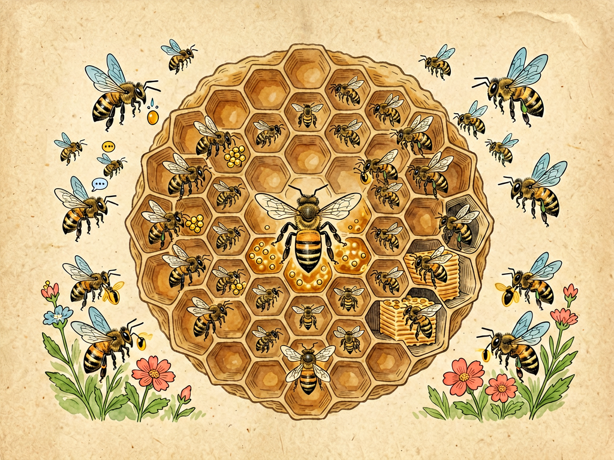

# 第三部 科学与文明
## 第二十五章 蜜蜂的故事

---

### 📍 本章导航
**核心主题**：蜜蜂是我们最熟悉的昆虫之一，但你真的了解它们吗？这不是一个关于"勤劳小蜜蜂"的童话，而是一个关于超级生物体——一个几万只蜜蜂组成的社会，如何分工、如何交流、如何合作，又如何支撑起整个地球生态系统和我们的农业。  
**你将发现**：
- 一个蜂群其实是一个"超级生物体"——1只蜂王、几百只雄蜂、3-6万只工蜂组成一个整体，体温恒定，能"呼吸"，甚至有集体决策能力
- 工蜂的一生：只活45天，要换6种工作——第1-3天清洁工、3-10天保姆、10-20天建筑师/酿蜜工、18-20天保安、最后20多天采集蜂，累死在采蜜路上
- 蜜蜂会"跳舞"！弗里希1973年诺贝尔奖发现：8字舞能精确传递方向（误差不超过10度）和距离（误差不超过100米），摆尾1秒=距离1公里
- 六角形蜂房的数学奇迹：同样容积最省蜂蜡，误差不超过0.1毫米，温度精确控制在35℃左右，人类工程师至今叹服
- 蜜蜂对人类最大的贡献不是蜂蜜——全球蜜蜂授粉年价值超过5770亿美元，相当于全球GDP的7%，全世界115种主要农作物里87种依赖动物授粉，80%由蜜蜂完成
- 蜜蜂危机：2006年以来美国蜂群每年损失30-40%，新烟碱类农药让蜜蜂"迷路"找不到家，单一化种植让蜜蜂没饭吃，保护蜜蜂就是保护我们70%的水果和蔬菜

**阅读建议**：读这一章的时候，如果你家附近有花，可以停下来观察几分钟蜜蜂采蜜的样子——那些看起来忙忙碌碌的小家伙，大脑只有芝麻大（100万个神经元，人类是860亿），却能识别人脸、做简单算术、用舞蹈交流位置信息，它们身上藏着自然界最神奇的社会组织秘密。

---

### 🖋️ 经典原文

春天来了，百花盛开，你们在花园里、田野上，总能看到一只只金黄色的小蜜蜂，"嗡嗡嗡"地在花丛间飞来飞去。

孩子们看到蜜蜂，第一反应往往是："小心，别让它蜇了！"或者"蜜蜂是来采蜜的！"你们说得都对，但是你们知道吗？蜜蜂身上的故事，可比你们想象的有意思得多，也深刻得多。

今天我就给你们讲讲蜜蜂的故事——讲这小小的昆虫，怎么造出了自然界最精密的建筑，怎么发展出了比人类社会还有秩序的分工，又怎么默默地支撑起我们整个农业和生态系统。

---

首先我要告诉你们一个最基本、也最重要的事实：**蜜蜂从来不是一只一只活的，它们是一群一群活的**。

你看到一只蜜蜂单独飞在外面，它不是独立的"个人"，它是一个庞大集体派出的"工作人员"。如果把它单独关起来，哪怕给它吃最好的蜂蜜，它也活不了几天——蜜蜂的所有本领、所有智慧，都属于蜂群这个整体。

一个完整的蜂群，是一个有几万只成员的大家庭，这个大家庭里只有三种蜜蜂：

第一种是**蜂王**。每个蜂群里只有一只蜂王，它是整个家族的母亲，个头比别的蜜蜂都大，唯一的任务就是产卵——在繁殖旺季，它一天能产两三千个卵，比自己的体重还重。所有别的蜜蜂——工蜂和雄蜂，都是它的孩子。你们别以为蜂王是"国王"，它其实不发号施令，它就是一个专门负责生孩子的"产卵机器"。

第二种是**雄蜂**。它们是蜂群里的"男性公民"，个头比工蜂大，没有蜇针，不会采蜜，也不会干活。它们一生唯一的任务，就是和年轻的蜂王交配，交配完之后很快就会死掉。到了秋天，食物少了，工蜂就会把这些不会干活的雄蜂赶出蜂巢，让它们冻死饿死——听上去有点残酷，但这就是蜂群生存的法则。

第三种，也是数量最多、最辛苦、最值得讲的，就是**工蜂**。一个蜂群里有几万只工蜂，全都是不会生育的雌性，它们承担了蜂巢里里外外所有的工作：打扫卫生、喂孩子、修房子、守门、采蜜、酿蜜、保卫家园……我们平时看到在外面飞的蜜蜂，全都是工蜂。

你们看，一个蜂群几万只蜜蜂，没有谁来当领导，没有谁来发号施令，没有会议，没有文件，但是一切都井井有条——这是不是比人类的很多组织都厉害？

---

更神奇的是，工蜂这一辈子，不是固定干一个工作，它们是**随着年龄换岗位**的。从出生到死亡，一只工蜂大概只活四五十天（在采蜜季），但它的一生会经历好几个完全不同的职业阶段，就像一个人一辈子换了五六份工作一样。

我给你们讲讲一只工蜂的一生：

**第1-3天：清洁工**。刚从蜂房里爬出来的年轻工蜂，第一件事就是打扫自己出生的那个蜂房，把里面的脏东西、蜕皮清理干净，让蜂王可以在里面产新的卵。

**第3-10天：保姆**。长大一点，它们就开始当"奶妈"——分泌蜂王浆喂养更小的幼虫，照顾蜂王，给蜂王清理身体、喂食。

**第10-20天：建筑师和面包师**。这个阶段它们腹部的蜡腺发育成熟了，能分泌蜂蜡，就开始当建筑工人，用蜂蜡修建新的六角形蜂房；同时它们还要把采回来的花粉酿成"蜂粮"，把花蜜酿成蜂蜜，储存起来当粮食。

**第18-20天：保安**。再长大一点，它们就到蜂巢门口当守卫，检查每一只回来的蜜蜂是不是自己人，赶走马蜂、黄蜂这些来偷蜜的敌人，还要负责扇动翅膀给蜂巢通风降温。

**第20天直到死亡：采集蜂**。最后，它们翅膀硬了，经验也够了，就开始飞出蜂巢，到外面去采花蜜、采花粉、采水、采蜂胶，这是最辛苦也最危险的工作——它们每天要飞出去几十次，每次飞几公里，拜访几百朵花，直到累死在外面。

你们看，这是多么完美的分工！年轻的蜜蜂干精细的、不需要飞远的活；年纪大的、经验丰富的，干最需要体力、最危险的外勤活。它们没有培训，没有人事部门安排岗位，到了什么年龄，身体发育到什么阶段，自然就知道该干什么活。这是几百万年进化出来的智慧，比我们人类的很多管理都高效。

---

大家都知道蜜蜂会酿蜜，但是你们知道蜂蜜是怎么来的吗？我敢说，很多人以为蜂蜜就是蜜蜂把花蜜采回来直接存起来——才不是那么简单，酿蜜是一个非常复杂的过程。

首先，采集蜂飞到花上，把花朵分泌的花蜜吸到自己专门的"蜜囊"里——这个蜜囊和胃是分开的，不是装来消化的，是专门装花蜜的"运输袋"，容积只有40微升，差不多一滴水的大小。一只工蜂要采1000-1500朵花，飞行3-5公里，才能把蜜囊装满，这一趟飞回来，带回的花蜜重量差不多是它体重的一半（约50毫克）。要酿成1公斤蜂蜜，一只蜜蜂要往返飞行3万多趟，拜访500多万朵花，总飞行距离相当于绕地球赤道3圈多。

回到蜂巢之后，它把花蜜吐给巢里负责酿蜜的内勤蜂。内勤蜂会把花蜜吸进自己的蜜囊，和自己分泌的转化酶混合，把蔗糖分解成葡萄糖和果糖，然后再吐出来，再吸进去，这样反复吞吐120-240次，同时还要有上万只工蜂不停地扇动翅膀，每分钟扇动11000次，在蜂巢里制造气流，让花蜜里的水分蒸发掉——花蜜里原来有70-80%的水分，要蒸发到17-18%以下，才能变成蜂蜜。

这个过程要持续7-15天。等蜂蜜酿好了，工蜂就把它存进六角形的蜂房里，再用蜂蜡严严实实封上盖，这就成了可以长期储存的粮食——蜂蜜放很多年都不会坏，考古学家在古埃及金字塔里发现了3000年前的蜂蜜，打开居然还能吃，就是因为水分少、糖分高、呈弱酸性，还含有过氧化氢，细菌根本没法在里面生长。

除了蜂蜜，蜜蜂还生产很多好东西：
- **花粉**是它们的蛋白质来源，被它们酿成"蜂粮"喂幼虫；
- **蜂王浆**是年轻工蜂分泌的高级营养品，专门喂蜂王和很小的幼虫，蜂王一辈子吃蜂王浆，寿命能活三五年，是只吃蜂蜜花粉的工蜂的几十倍；
- **蜂胶**是它们从树芽上采来的树脂，用来修补蜂巢、消毒杀菌，相当于它们的"建筑材料"加"药品"；
- **蜂蜡**是它们用来建蜂房的材料，我们用的蜡烛、口红、很多药膏里都有蜂蜡。

但是你们知道吗？对人类、对整个自然界来说，蜜蜂做的最重要的事，根本不是酿蜜——而是**授粉**。

---

我必须给你们好好讲讲授粉这件事，因为这件事太重要了，重要到什么程度？如果没有蜜蜂，我们可能连饭都吃不上。

你们知道，植物开花不是为了好看，是为了结果、结种子，繁殖后代。但是大部分植物自己没法给自己授粉——一朵花的花粉，要传到另一朵花的柱头上，才能结出果实。这时候就需要"媒人"来帮忙：风可以当媒人（比如玉米、水稻就是风媒花），但很多果树、蔬菜、油料作物，都需要昆虫来当媒人，而蜜蜂就是最勤劳、最高效的媒人。

当蜜蜂在花丛里钻来钻去采蜜的时候，它身上细细的绒毛会沾满花粉，等它飞到下一朵花上，这些花粉就会蹭到花的柱头上——授粉就完成了。蜜蜂身上带的花粉比别的昆虫多，它又专门挑同一种花采（不会乱串），所以授粉效率特别高。

全世界大概有多少作物依赖蜜蜂授粉呢？我给你们举几个例子：
- 我们吃的水果：苹果、梨、桃、草莓、蓝莓、樱桃、柑橘，几乎全靠蜜蜂授粉；
- 蔬菜里的：黄瓜、南瓜、西瓜、甜瓜、西红柿、茄子，很多都需要蜜蜂；
- 油料作物：油菜、向日葵、大豆，还有做巧克力的可可，做咖啡的咖啡豆，做棉花的棉花，都离不开蜜蜂。

有人算过，蜜蜂授粉给农业带来的价值，比它们生产的蜂蜜、蜂蜡这些产品的价值高一百多倍。全世界三分之一的食物，都和蜜蜂授粉有关。如果蜜蜂消失了，我们不会马上饿死，但我们的餐桌上会少了大部分水果、蔬菜、坚果，只能靠大米、小麦、玉米这些风媒传粉的粮食活着——那饮食会多么单调啊！

不仅是农田，野外的野花野草、各种野生植物，也靠蜜蜂授粉。蜜蜂少了，这些植物就会减少，然后吃这些植物的昆虫、鸟、小动物也会减少，整个生态系统都会跟着出问题。

所以你们看，蜜蜂这小小的昆虫，哪里只是在为自己采蜜啊？它们实际上是整个陆地生态系统的关键一环，它们在花间飞来飞去的时候，是在给我们搬运整个春天、整个秋天的收获。

---

蜜蜂还有一个特别神奇的本领，是动物行为学上的一个大发现——它们会**跳舞**，而且不是随便跳，是用舞蹈来"说话"，告诉同伴哪里有花，花有多远，在哪个方向。

这个秘密是奥地利科学家弗里希在1973年发现的，他还因此拿了诺贝尔奖。

怎么跳呢？我给你们简单讲讲：
如果花源离蜂巢很近，不到一百米，回来的采集蜂就会跳"圆圈舞"——在巢脾上转圈圈，一会儿向左转，一会儿向右转，意思是"家附近就有花，快出去找！"

如果花源很远，超过一百米，它们就会跳"8字舞"，也叫"摆尾舞"：先飞一个半圆，然后直着飞回来，再飞另一个方向的半圆，整个路线像个"8"字。在直着飞的那段，它们会一边快速摆动腹部一边嗡嗡振翅。这里面藏着非常精确的信息：
- **方向**：直飞那段如果是朝着蜂巢上方（也就是重力的反方向），意思是"朝着太阳的方向飞"；如果直飞段是朝下，意思是"背着太阳飞"；如果和垂直方向偏了多少度角，就朝着和太阳偏多少度的方向飞——这相当于一个指南针！
- **距离**：摆尾的时间越长，说明花离得越远。摆尾一秒钟大概对应一公里距离，同伴能精确到几百米范围内。
- **花的质量**：跳得越起劲、摆尾越用力，说明那里的花蜜越多、质量越好；如果只是随便跳两下，说明没什么好花，不用去了。

你们看，这是不是一种真正的"语言"？它们没有文字，没有地图，但是通过舞蹈，就能把几公里外的位置信息准确地传递给几万只同伴。除了人类，很少有动物能做到这么复杂的信息交流。

还有蜂房的六角形结构，也特别了不起。你们仔细看蜂巢，一个一个蜂房全都是整整齐齐的正六边形，一个挨着一个，没有一点空隙。为什么偏偏是六边形？
- 如果是圆形，排起来中间会有空隙，浪费空间；
- 如果是正方形或者三角形，虽然没有空隙，但是同样大的空间，六边形最省材料，结构也最结实。

人类数学家花了上千年才证明的"最省材料的密铺图形"，蜜蜂在几百万年前就已经造出来了。它们没有学过几何，没有计算器，就靠本能，就能造出最完美的建筑，这就是进化的神奇力量。

---

听到这里，你们是不是觉得蜜蜂太厉害了，简直是自然界的模范？但是我必须告诉你们一个不好的消息：现在蜜蜂的日子越来越不好过了，全世界的蜜蜂数量都在下降，很多地方出现了"蜂群崩溃失调症"——工蜂集体出去采蜜，就再也不回来了，剩下蜂王和幼蜂在巢里，整群整群地死掉。

这是为什么呢？原因有好几个：
第一个是**农药**。现在农业上用的很多杀虫剂、除草剂，虽然是用来杀害虫、杀杂草的，但也会伤害蜜蜂——它们会让蜜蜂神经系统中毒，找不到回家的路，或者记忆力下降，跳不好舞蹈，甚至直接死掉。
第二个是**单一化种植**。现在很多农田一大片几百几千亩全种同一种作物，比如全种小麦、全种玉米，开花的时间只有短短十几天，花期一过，蜜蜂就没东西吃了。不像以前田野里有各种各样的野花，从春天到秋天都有花开。
第三个是**寄生虫和疾病**。有一种叫瓦螨的寄生虫，会爬到蜜蜂身上吸它们的血，还传播病毒，是蜂群的大杀手；还有各种真菌、细菌疾病，也会让蜜蜂生病。
第四个是**气候变化和栖息地破坏**。全球变暖让春天花开的时间提前了，和蜜蜂出巢的时间对不上了——蜜蜂出来了，花还没开，或者花开过了蜜蜂才来，两边都错过了；城市越来越大，野地越来越少，蜜蜂能找的花越来越少，能筑巢的地方也越来越少。

蜜蜂减少不是小事。前面说了，我们三分之一的食物靠它们授粉。如果蜜蜂继续减少，水果会涨价，坚果会涨价，很多蔬菜会供应不足，整个生态系统都会受影响。所以保护蜜蜂，不是什么"爱动物"的慈善活动，这是在保护我们自己的食物供应，保护我们自己的生存环境。

怎么保护蜜蜂呢？其实很简单，我们每个人都能做一点：
- 不要随便打农药，尤其是不要在花盛开的时候喷农药；
- 多种花，在自己家阳台、院子里种点开花的植物，给蜜蜂提供食物；
- 看到蜜蜂不要怕，不要去打它，你不惹它，它不会随便蜇你——它蜇了你自己也会死，它比你还不想蜇人；
- 支持对蜜蜂友好的农业，买有机农产品、本地小农户种的东西。

---

最后，我想问问你们：我们从蜜蜂身上能学到什么？
很多人说，学到了"勤劳"——没错，工蜂一辈子辛辛苦苦，任劳任怨，直到累死，确实很勤劳。但是我觉得，蜜蜂给我们的启发远不止勤劳两个字。

我觉得更重要的启发是**分工与合作**。几万只蜜蜂，没有领导，没有监督，但是每一个个体都在合适的时间做合适的事，整个群体就能高效运转，完成单个个体根本不可能完成的事——酿蜜、筑巢、迁徙、对抗敌人。我们人类社会也是一样，越是复杂的现代社会，越需要每个人在自己的岗位上做好自己的事，同时和别人好好合作，整个社会才能好起来。

第二个启发是**小生命也有大价值**。一只蜜蜂那么小，轻轻一捏就死了，但是几十万只蜜蜂加在一起，能影响整个农田、整个生态系统，影响我们每个人的餐桌。永远不要小看微小的事物，也不要小看你自己——你一个人的力量虽然小，但无数人一起努力，就能改变世界。

第三个启发是**索取的时候也要给予**。蜜蜂从花里采蜜，看起来是在"拿"东西，但同时它们也帮花授粉，帮植物繁殖——它们和植物是互相帮助、互相依存的关系，不是单方面掠夺。我们人类从自然界拿了太多东西，也该想想，我们给了自然界什么？我们是不是也该像蜜蜂一样，在索取的同时，也给予回报，和自然好好相处？

蜜蜂虽然小，但它们身上藏着大学问。下次你们再在花丛边看到这些忙忙碌碌的小家伙，不妨停下来多看它们一会儿——你看到的不只是一只虫子，你看到的是几百万年进化出来的智慧，是整个生态系统的关键一环，是自然界给我们上的最好的一堂课。

---

> 📜 **科学史话：人类和蜜蜂的几千年交情**
>
> 人类和蜜蜂打交道的历史，比我们的文明史还长。
>
> **最早的采蜜人**。在西班牙的一个山洞里，发现了一幅距今一万年的岩画，上面画着一个人爬在悬崖上，从蜂巢里掏蜜——那时候人类还在狩猎采集，就已经知道蜂蜜是好东西了。在糖还没有发明的年代，蜂蜜是人类几乎唯一的甜味来源，比金子还珍贵。
>
> **古埃及的养蜂业**。早在四千多年前，古埃及人就已经开始人工养蜂了。他们用尼罗河的泥土做蜂箱，把蜜蜂养在里面，还会把蜂箱搬到船上，沿着尼罗河追着花期走——这就是最早的"转地放蜂"。蜂蜜在古埃及是用来供奉神灵、给法老陪葬的贵重物品，还被用来做防腐剂、做药膏。
>
> **亚里士多德的观察**。古希腊的大学者亚里士多德是第一个认真观察和记录蜜蜂习性的人。他写了《动物志》，里面准确记录了蜂群的三种成员、蜜蜂采蜜的过程，甚至提到了蜜蜂跳舞的现象——但是他不知道那是在交流信息，还以为是蜜蜂在"锻炼身体"。他还错误地认为蜂王是"国王"，是雄性的——这个错误过了两千年才被纠正过来。
>
> **发现蜜蜂的舞蹈语言**。1910年代，奥地利动物学家卡尔·冯·弗里希开始认真研究蜜蜂的行为。他花了几十年时间做实验，终于在1940年代搞清楚了：蜜蜂跳舞不是随便跳，是在传递精确的方向和距离信息！当时很多人不相信，说昆虫怎么可能有这么复杂的语言？但是弗里希用一个又一个精密的实验证明了这一点，1973年，他和另外两个研究动物行为的科学家一起获得了诺贝尔生理学或医学奖。
>
> **蜜蜂和现代科学**。现在蜜蜂已经成了研究社会行为、神经科学、认知科学的模式生物。别看蜜蜂大脑只有芝麻那么大，只有不到一百万个神经元（人类大脑有八百亿个），但它们能识别人脸，能学会数数，能理解抽象的"相同"和"不同"的概念，甚至能做出简单的决策——这么小的大脑能做这么多事，给人工智能研究也带来了很多启发。
>
> 一万年来，蜜蜂给我们提供蜂蜜，帮我们种庄稼，现在还在帮我们理解大脑和智能的本质——这些小家伙，真的是我们人类最好的朋友之一。

---

> 🔬 **科学更新：关于蜜蜂的最新研究**
>
> 高士其先生写这篇文章的时候，我们对蜜蜂的了解还没有现在这么深入。近几十年的研究发现了更多蜜蜂神奇的秘密，也让我们更清楚它们面临的危机。
>
> **蜜蜂能识别人脸**。以前大家以为只有高等动物才能认脸，但是实验证明，蜜蜂经过训练，能记住并识别人类的面孔——它们能从几十张照片里准确找出之前见过的那张，准确率超过80%。它们用的方法和我们人类类似：先看眼睛、鼻子、嘴巴这些五官的相对位置，再拼出整张脸。
>
> **蜜蜂有情绪，也会悲观**。伦敦大学的科学家做过一个实验：把蜜蜂放在一个装置里，一边是糖水（奖励），一边是苦水（惩罚）。然后他们把一半蜜蜂放在离心机里转了一分钟，模拟它们被天敌攻击的状态。结果这些被"吓到"的蜜蜂，之后会更倾向于把模糊的气味判断成苦水——也就是说，它们会变得悲观，就像人遇到坏事之后会心情不好、看什么都消极一样。蜜蜂还会分泌多巴胺和血清素，这些和人类情绪有关的神经递质，它们也有。
>
> **城市里的蜜蜂反而活得更好？** 这是个有点反常识的发现：很多研究显示，城市里的蜜蜂比农村 intensively 种植的农田里的蜜蜂活得更好，种类更多。为什么？因为城市里公园、花园、阳台种了各种各样的花，从春天到秋天都有蜜源；而农村现在大片都是单一种植的作物，花期短，农药用得多，反而没东西吃。很多城市现在都在搞"蜜蜂友好城市"，在公园里种蜜源植物，在楼顶养蜂，城市反而成了蜜蜂的避难所。
>
> **蜂群崩溃失调症（CCD）的研究**。从2006年开始，美国和欧洲出现了大量蜂群突然消失的现象——工蜂集体外出不归，蜂巢里只剩下蜂王和幼蜂，像"鬼城"一样。科学家研究了这么多年，发现这不是单一原因造成的，而是农药（尤其是新烟碱类杀虫剂）、瓦螨寄生、病毒感染、营养不良、气候变化多个因素叠加在一起，把蜂群压垮了。现在很多国家已经开始禁止几种对蜜蜂毒性最大的新烟碱类农药了。
>
> **机器蜜蜂和科技授粉**。因为蜜蜂数量减少，科学家甚至在研究"机器蜜蜂"——带翅膀的微型无人机，身上沾着花粉，能在花之间飞来飞去授粉。但是现在这些机器还很初级，成本极高，授粉效率根本比不上真蜜蜂——最好的"机器蜜蜂"还是蜜蜂自己，保护好它们，比造一万台机器都有用。
>
> 越研究蜜蜂，我们就越觉得神奇，也越觉得它们需要我们的保护。

---

> 🌍 **现实连接：蜜蜂和我们的生活**
>
> 不要觉得蜜蜂是野外的虫子，和我们没关系——我们的生活每一天都离不开它们。
>
> **没有蜜蜂就没有超市里的大部分水果**。下次你去超市的时候，可以看一看果蔬区：苹果、梨、草莓、蓝莓、樱桃、猕猴桃、芒果、西瓜、哈密瓜、黄瓜、南瓜、西红柿、辣椒、牛油果、杏仁、核桃、腰果……这些全都需要蜜蜂授粉。如果蜜蜂消失了，这些东西要么产量大减价格飞涨，要么根本就买不到了。
>
> **养蜂人追着花期跑**。中国有几十万养蜂人，他们每年从南到北，带着蜂箱追着花期走——春天在南方采油菜花、荔枝花，夏天到北方采洋槐、枣树、荆条花，秋天再赶向日葵、荞麦花。他们开着卡车，拉着上百个蜂箱，风餐露宿，哪里有花就去哪里。我们吃的每一勺蜂蜜，都来自他们和蜜蜂一起走过的万里路。
>
> **给蜜蜂留一条活路**。现在很多城市搞绿化，喜欢种那些看起来好看但不开花、或者开花了也没有蜜的观赏植物，还有的地方一到春天就把地上的野花全拔了，种上整齐的草坪——这些对蜜蜂来说都是"绿色沙漠"，看着绿，但没有吃的。现在很多环保组织在呼吁：城市绿化要多种本土开花植物，不要把野花野草都拔光，给蜜蜂留一点食物。
>
> **我们每个人都能帮到蜜蜂**。不需要你去养蜂，不需要你专门做什么大事：在阳台种几盆会开花的香草（薄荷、薰衣草、迷迭香、百里香，这些蜜蜂都喜欢）；看到院子里的蒲公英、三叶草这些小野花不要拔掉，它们是早春蜜蜂最重要的食物来源；不要在花开的时候喷杀虫剂；看到蜜蜂不要打，躲开就好——这些小事加在一起，就能帮蜜蜂很大的忙。
>
> 记住，保护蜜蜂不是保护"别人"，是保护我们自己的餐桌、自己的未来。

---

> 💡 **动手试一试：观察和记录你身边的蜜蜂**
>
> 最好的学习不是看书，是亲自观察。春天夏天花开的时候，你可以在家附近做这几个小观察：
>
> **实验1：观察蜜蜂采蜜**
>
> 找一片开着同一种花的地方——比如油菜花田、向日葵花田、或者小区里一片开满花的灌木丛，安安静静蹲下来（不要太近，不要做突然的动作，蜜蜂不会蜇你），观察一只蜜蜂采蜜：
> - 它在一朵花上停留多长时间？
> - 它怎么在花上爬？腿在做什么？
> - 它采完这一朵，接下来会飞到什么样的花上？是飞到别的种类的花上，还是一直找同一种花？（你会发现，蜜蜂一次出去只采同一种花，这就是"花的恒常性"，这样授粉效率才高）
> - 看看它后腿上是不是沾着两个黄黄的"花粉团"——那就是它装花粉的"花粉篮"。
>
> 观察十分钟，你会发现很多以前没注意到的细节。
>
> **实验2：统计你身边有多少种传粉昆虫**
>
> 在开花的植物旁边观察15分钟，拿个小本子记下来：
> - 你看到了几只蜜蜂？是蜜蜂（意大利蜂、中华蜜蜂）还是别的蜂（熊蜂、切叶蜂、壁蜂）？
> - 除了蜜蜂，还有没有别的传粉者？蝴蝶？食蚜蝇？甲虫？
> - 大概平均一分钟有几只昆虫来访问这一簇花？
>
> 你可以在不同地方（公园、小区、农田、山里）都做一下统计，对比一下哪里的传粉昆虫最多，哪里最少——少的地方说明生态环境可能有问题。
>
> **实验3：尝一尝不同的蜂蜜**
>
> 找几种不同的蜂蜜：洋槐蜜、枣花蜜、荆条蜜、油菜花蜜、荔枝蜜……不用太贵的，正宗的就好。分别尝一尝，看看它们颜色是不是一样？闻起来味道是不是一样？吃起来口感和香气有什么区别？
>
> 你会发现，不同花的蜂蜜，味道完全不一样——就像不同的水果有不同味道一样。蜂蜜里，藏着不同花的香气，藏着不同季节、不同地方的味道。

---

### 💬 读后思考与讨论

1. 蜂群里没有"领导"，没有指挥，但是几万只蜜蜂能井井有条地工作。这种"没有中心的秩序"是怎么形成的？人类社会能从中学到什么？
2. 工蜂蜇人之后自己就会死，但是遇到敌人的时候它们还是会毫不犹豫地蜇上去。这种"牺牲自己保护群体"的行为是怎么进化出来的？
3. 有人说"反正科技发达了，以后我们可以造机器蜜蜂、可以人工授粉，蜜蜂灭绝了也没关系"，你同意这种说法吗？为什么？
4. 一只工蜂累死累活活几十天，自己产不了卵，相当于"一辈子给别人打工"。你觉得这样的生命有意义吗？为什么？
5. 如果你是城市规划师，你会怎么设计城市，让城市对蜜蜂更友好？
6. 除了蜜蜂，你还知道哪些看起来不起眼、实际上对生态系统特别重要的小动物？

### 🔗 关联阅读
- 第一部第十四章：《土壤革命》→ 土壤里也有无数微小的生物在默默支撑生态系统
- 第三部第二十六章：《庄稼的朋友和敌人》→ 了解更多昆虫和农业的关系，哪些是朋友哪些是敌人
- 第三部第二十七章：《大海的宝藏》→ 海洋里也有很多像蜜蜂一样不起眼但极其重要的小生物
- 第二部第十三章：《地球的繁荣与土壤的劳动者》→ 了解微生物、蚯蚓这些地下劳动者如何支撑地球生态
