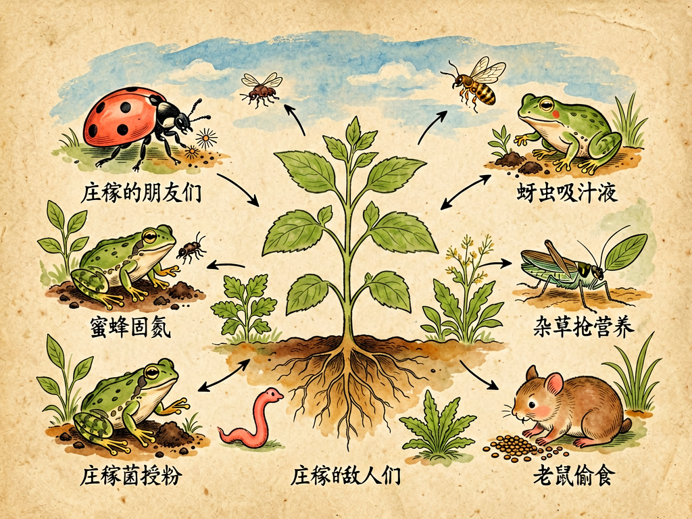

# 第三部 科学与文明
## 第二十六章 庄稼的朋友和敌人

---

### 📍 本章导航
**核心主题**：我们每天吃的粮食、蔬菜、水果，不是平白无故从地里长出来的——一块农田就是一个复杂的生态系统，里面有帮庄稼干活的朋友，也有偷粮食、搞破坏的敌人。学会认识这些朋友和敌人，理解它们之间的关系，你才会真正明白我们碗里的饭是怎么来的。  
**你将发现**：
- 农田不是只有庄稼，这是一个热闹的"生命城市"——1克健康土壤里有10亿个细菌、1亿个放线菌、1000万个真菌，地下、地上、空中，住着无数小家伙
- 庄稼最好的朋友，往往是最不起眼的：1只瓢虫一天吃100-200只蚜虫、1亩蛙群一年能吃1万只害虫、根瘤菌1亩大豆能固氮8公斤相当于40公斤硫酸铵、蚯蚓1年能把1吨土壤翻一遍
- 庄稼的敌人不只是吃叶子的虫子：1845年爱尔兰土豆晚疫病饿死100万人，杂草让全球粮食减产34%，病虫害让全球粮食减产40%，而滥用农药本身正在变成更大的敌人
- 没有绝对的"益虫"和"害虫"——麻雀秋天吃点粮食但春夏喂雏鸟全抓虫子，少量蚜虫反而能养活天敌保持生态平衡，朋友和敌人的身份取决于数量、时机和位置
- DDT曾经获诺贝尔奖，却差点把鸟类灭绝，蕾切尔·卡逊《寂静的春天》唤醒了世界——最好的种田方法不是把所有虫子杀光，而是IPM有害生物综合治理，管理好整个生态系统
- Bt抗虫棉让中国农药用量减少70%，智慧农业无人机打药省90%农药，稻鸭共作、稻蛙共生这些生态模式正在复兴，和自然合作才能种出好粮食

**阅读建议**：如果你有机会去乡下、去农田，可以蹲下来仔细看看：叶子上有没有蚜虫？有没有瓢虫在吃蚜虫？土里挖开能不能看到蚯蚓？你看到的每一种小生物，都在这个生态系统里扮演着自己的角色。你碗里每三勺饭，就有一勺是这些朋友帮忙种出来的。

---

### 🖋️ 经典原文

你们每天都要吃饭，吃馒头、米饭、蔬菜、水果，这些东西都是从地里种出来的。但是我想问问你们：你们知道这些庄稼是怎么长出来的吗？农民伯伯每天在田里忙，到底在和什么作斗争？

很多孩子以为，种地就是把种子撒下去，浇浇水、施施肥，等着秋天收成就行了——哪有这么简单！一块农田就是一个战场，也是一个热闹的小世界：地下有无数微生物和小虫子在活动，地面上有各种虫子爬来爬去，天上还有鸟、有蝴蝶、有飞蛾飞来飞去。这些小家伙里，有很多是帮庄稼干活的好朋友，也有很多是专门来偷粮食、搞破坏的敌人。

今天我们就来讲讲庄稼的故事：谁是我们的朋友，谁是我们的敌人，怎么才能让朋友多一点、敌人少一点，让庄稼长得好好的，让我们碗里的粮食够吃。

---

首先我要告诉你们一个最重要的道理：**农田从来不是只长庄稼的地方，这是一座热热闹闹的生命城市**。

你以为你看到的只是一片小麦、一片水稻？不是的。你仔细看：
- **叶子上**：爬着蚜虫、毛毛虫，还有飞来飞去的瓢虫、蝴蝶、蜜蜂，蜘蛛在枝叶间结网；
- **茎秆上**：藏着钻心虫、飞虱，还有麻雀偶尔飞过来啄两口；
- **土壤里**：蚯蚓在钻来钻去，线虫、蚂蚁、蝼蛄在打洞，还有无数我们肉眼看不见的细菌、真菌、放线菌，在忙着分解枯枝烂叶；
- **水沟里**：青蛙蹲在田埂上，蜻蜓在水面上产卵，水里还有小鱼、小虾、小蝌蚪；
- **天上**：燕子飞来飞去抓虫子，还有老鹰、喜鹊，有时候也会有成群的蝗虫铺天盖地飞过来。

这些生命不是偶然凑在一起的，它们形成了一张复杂的网：谁吃谁，谁帮谁，谁和谁竞争，一环扣一环。庄稼能不能长好，能不能丰收，不只是看肥料够不够、太阳够不够、雨下得够不够，还要看这个小世界里的关系平不平衡——如果朋友都没了，敌人泛滥成灾，再好的肥料、再好的种子也没用。

所以啊，会种地的人，不只是会浇水施肥的人，更是会认识这些朋友和敌人、会管理这张生命之网的人。

---

我们先来说说庄稼的朋友们。

庄稼的朋友很多，而且很多都是不起眼的小家伙，它们不声不响地干活，我们甚至都注意不到它们，但它们的功劳大得很。

第一类朋友，是**给庄稼当"营养师"和"土壤建筑师"的地下工作者**。
第一个要讲的就是**根瘤菌**。你们拔起大豆、花生、豌豆这些豆科植物的时候，会看到根上长着一个个小小的圆疙瘩，很多人以为那是虫子咬的，是生病了——才不是呢，那就是根瘤菌的家，是它们和植物合伙开的"氮肥工厂"。空气里百分之七十八都是氮气，但是植物自己没法直接吸收空气中的氮。根瘤菌就有这个本事，它们钻进豆科植物的根里，把空气中的氮变成植物能吸收的氮肥，植物反过来给它们提供糖分当食物。这是大自然里最好的合作关系——所以种过大豆的地，土壤会变肥，就是因为根瘤菌给地里留下了很多氮肥。
然后是**蚯蚓**，这个我在前面讲土壤的时候给你们讲过——它们在土里钻来钻去，给土壤松土，让空气和水能进到土里；它们吃进去腐烂的落叶和泥土，拉出来的粪便是最好的有机肥。一块地里蚯蚓多，说明这块地很肥、很健康；蚯蚓少甚至没有，说明地已经"生病"了。
还有千千万万的**腐生细菌和真菌**，它们是大自然的清洁工。地里的秸秆、落叶、动物粪便，都是靠它们分解，变成能被植物吸收的养分。如果没有这些分解者，所有营养都被锁在枯枝烂叶里，新的植物就长不出来了。

第二类朋友，是**帮庄稼打敌人的"护卫队"**。
首先是**瓢虫**。你们都见过那种红壳带黑点的小瓢虫，别瞧它长得圆滚滚、慢吞吞的，它可是蚜虫的头号杀手。一只瓢虫一天能吃一两百只蚜虫——那些趴在叶子背面吸庄稼汁液、把叶子卷起来的坏家伙，就是瓢虫的美餐。有经验的农民看到叶子上有瓢虫，就知道不用急着打农药了，"雇佣军"已经来了。
然后是**草蛉**和**食蚜蝇**。草蛉的幼虫叫"蚜狮"，长得有点丑，但是吃起蚜虫来比瓢虫还凶；食蚜蝇的幼虫也是专门吃蚜虫的高手。
还有**寄生蜂**，这是更厉害的角色——它们个子很小，不直接吃虫子，而是把自己的卵产到害虫的身体里或者卵里。它们的幼虫孵出来之后，就从里面把害虫慢慢吃掉。害虫被寄生了之后，自己就没法繁殖了，死的时候还能孵出一群新的寄生蜂接着去杀别的害虫。这是生物防治里最常用的一招，比打农药管用多了。
还有**蜘蛛**。别以为蜘蛛只会结网抓蚊子，田间的蜘蛛什么虫子都抓——飞虱、叶蝉、蛾子、小蚂蚱，来一个抓一个，是24小时不休息的田间卫士。
然后是**青蛙和蟾蜍**。"稻花香里说丰年，听取蛙声一片"——古人早就知道青蛙多的年景收成就好。一只青蛙一天能吃七八十只虫子，一年下来能吃掉一万多只，大部分都是稻田里的害虫。所以现在有很多地方搞"稻蛙共生"，在稻田里养青蛙，不用打农药，青蛙把虫子吃了，水稻长得好，青蛙还能卖钱，一举两得。
还有**燕子、啄木鸟、喜鹊**这些鸟。以前我们一度把麻雀当成"四害"来打，结果后来发现，麻雀虽然在秋天会吃一点粮食，但它们在繁殖季节喂小麻雀的时候，抓的全是虫子——一窝麻雀一天能吃掉几百只虫子。大部分鸟类都是帮我们控制害虫的好帮手。

第三类朋友，是**帮庄稼做媒的"授粉者"**。
这就是我们上一章讲过的蜜蜂、熊蜂、蝴蝶这些昆虫。我们吃的水果、蔬菜、油料作物，一大半都靠它们授粉才能结果。没有它们，花开得再好看也结不出果子。

你看，这么多朋友在帮我们种地——它们不拿工资，不需要谁管理，只要我们不把它们都杀死，它们就会兢兢业业地帮我们干活。

---

讲完了朋友，我们再来讲讲敌人。

庄稼的敌人也很多，而且不只是你们印象里"吃叶子的虫子"——敌人分好几种，各有各的搞破坏方式。

第一种，也是最显眼的，就是**害虫**。
害虫也分几类：
- **吃叶子的**：毛毛虫、菜青虫、蝗虫、黏虫，这些是"强盗型"的，直接把叶子啃得七零八落，严重的时候能把整片地的叶子吃光。蝗虫一来，遮天蔽日，几个小时就能把几万亩庄稼吃得只剩秆子，这是古代农民最怕的灾荒之一。
- **吸汁液的**：蚜虫、飞虱、叶蝉、红蜘蛛，这些是"吸血鬼型"的，它们嘴像针一样，扎进植物的血管里吸汁液。被它们吸过的叶子会变黄、卷缩，庄稼长不好，而且它们还会传染植物病毒，比直接吃叶子危害还大。
- **钻进去的**：钻心虫、玉米螟、食心虫，这些是"特务型"的，它们直接钻进茎秆里、稻穗里、果实里，从里面把庄稼掏空，外面看起来好好的，里面已经被吃空了，你根本发现不了，等发现的时候已经晚了。

第二种敌人，比虫子还小，但危害一点不小——这就是**病原体**，也就是让庄稼生病的微生物：真菌、细菌、病毒。
你们见过叶子上长锈一样的黄斑吗？那是锈病；见过稻穗上长黑灰吗？那是稻瘟病；见过蔬菜烂叶子、烂根子吗？很多都是真菌或者细菌引起的。这些病害厉害起来，能让整片地绝收——1845年爱尔兰的土豆晚疫病，就导致一百多万人饿死，两百万人逃荒到别的国家，一个小小的真菌，就改变了一个国家的历史。而且病毒病还是害虫传播的，前面说的蚜虫、飞虱吸了病株的汁液，再吸健康的庄稼，就把病毒传过去了，就像蚊子传人的疾病一样。

第三种敌人，是**杂草**。
很多人觉得杂草只是长在地里碍眼而已，哪有那么严重？错了，杂草是最顽固、最普遍的敌人。它们和庄稼抢阳光、抢水分、抢肥料，而且很多杂草生命力比庄稼强得多，长得比庄稼快——如果不除草，杂草很快就能把庄稼盖住，让庄稼见不到太阳，最后活活"饿"死。而且杂草还是很多害虫和病菌的"老家"，虫子冬天就躲在杂草里过冬，第二年春天再跑到庄稼上。农民伯伯锄地，很大一部分功夫就是花在除草上。

第四种敌人，是**老鼠和其他有害动物**。
老鼠不仅会偷粮食，在地里就会咬种苗、啃穗子，收获之后钻进粮仓继续偷；还有蝼蛄、蛴螬这些地下害虫，专门咬庄稼的根；有时候野猪、野兔也会跑到地里祸害庄稼。

还有一个最特殊的敌人，很多人都想不到——那就是**我们人类自己**，是我们错误的种植方式、滥用农药和化肥，反而成了庄稼最大的敌人。

---

这里我要特别给你们讲讲，为什么不能"见虫就打农药"，为什么朋友和敌人的身份不是绝对的。

很多人种地有个简单粗暴的想法：虫子都是坏的，看到虫子就打农药，打得越多越干净，收成就越好——大错特错！
你们想啊，农药是不长眼睛的，它不会只杀"坏虫子"，它会把所有虫子都杀死——包括我们前面说的瓢虫、草蛉、寄生蜂这些益虫，甚至青蛙、小鸟也会被毒死。益虫本来就少，繁殖又慢，害虫反而繁殖快、抗药性强——打一次农药，益虫死了百分之九十，害虫可能只死了一半，剩下的害虫还产生了抗药性，等它们再繁殖起来，就没有天敌控制它们了，只会越来越猖狂，你就要打更多、更毒的农药，陷入恶性循环。
这就是为什么打农药越多的地方，虫害反而越严重——因为你把敌人的天敌都杀光了，反而帮了敌人的忙。

而且，"益虫"和"害虫"本来就不是绝对的，取决于数量和时机：
- 麻雀在秋天会吃一点谷粒，但它们在春天夏天喂小鸟的时候吃的全是虫子，总体来说是益多害少；
- 少量的蚜虫其实没关系，它们能养活瓢虫这些天敌，让生态保持平衡，只有当蚜虫多到天敌控制不住的时候，才会成灾；
- 甚至杂草也不是一点用都没有——田埂上长一点草，能给益虫提供藏身的地方，能保持水土流失，只是不能让它们长到庄稼地里去；
- 就连蛇，很多人怕它，但田里的蛇会吃老鼠，是帮我们抓老鼠的好帮手。

所以说，判断一种生物是朋友还是敌人，不能看它长得可不可爱，不能看它是不是吃了一口我们的粮食，要看它在整个生态系统里起什么作用，要看它有多少数量，要看它在什么时间出现。**大自然里没有天生的"好虫子"和"坏虫子"，只有平衡和不平衡**。

---

那到底应该怎么对付敌人、保护朋友，让庄稼丰收呢？

以前人们以为答案是农药——发明更毒的农药，把所有虫子都杀光。但是几十年过去，我们发现这条路走不通：农药越用越多，害虫反而越来越厉害，还污染了土壤、水，农药残留在粮食里被我们吃下去，还害了我们自己的健康。

现在科学家和有经验的农民已经明白了：最好的办法，不是把所有敌人都杀光（也根本不可能杀光），而是**综合治理，管理好整个生态系统**，让它保持平衡。我给你们讲讲现在科学的种田方法：

第一招，**先预防，不要等出事了再补救**。
- **轮作**：不要年年在同一块地里种同一种庄稼，今年种水稻，明年种大豆，后年种玉米——这样专门吃某一种庄稼的害虫和病菌就没法在地里代代繁殖，自然就少了。
- **选抗病抗虫的品种**：同样是小麦，有的品种天生就不容易得锈病，有的品种容易招蚜虫——选好种子，比什么农药都管用。
- **合理密植**：不要把庄稼种得太密，太密了不通风，湿度大，最容易生病；也不要太稀，浪费土地。

第二招，**把我们的朋友请回来，用生物对付生物**。
- 不要用广谱性的剧毒农药，尽量用只杀特定害虫的低毒农药，给益虫留活路；
- 田里不要弄得干干净净一根草都没有，田埂上留一点草带，种点开花的植物，给瓢虫、寄生蜂、蜜蜂这些益虫提供花蜜和藏身的地方；
- 如果益虫不够，可以人工释放——比如田里蚜虫多了，就人工培养大量瓢虫或者寄生蜂放到田里，比打农药还管用；
- 搞生态种植：稻田里养青蛙、养鸭子、养鱼，果园里养鸡，让这些动物帮我们吃虫子、吃草，它们的粪便还能肥田——现在很多地方搞"稻鸭共作""林下养鸡"，不用打农药不用施化肥，种出来的粮食还更好吃、更健康。

第三招，**物理和人工方法防治**。
- 用防虫网把菜盖起来，不让蛾子飞进去产卵；
- 用黑光灯、性诱剂诱杀蛾子——性诱剂就是模仿雌蛾子的气味，把雄蛾子引过来粘住，让它们没法交配产卵；
- 夏天的时候把大棚揭开，让高温闷几天，能杀死土壤里很多病菌和害虫。

第四招，**实在不行的时候，再精准用农药**。
不是完全不能用农药，而是不要瞎用、不要滥用。要先观察：虫子多不多？益虫多不多？现在打是不是最合适的时候？选最对口的农药，用最低的剂量，打在最关键的位置——能局部打就不全田打，能打一次就不打两次。而且要严格遵守安全间隔期，打完药之后要等足够长的时间，等农药分解了再收获，保证粮食上没有残留。

你们看，这才是聪明的种田方式——不是和大自然对着干，不是要把所有"敌人"都赶尽杀绝，而是学会和自然合作，调动朋友的力量，把敌人控制在不会造成大损失的范围内就好。

---

最后，我想给你们说句掏心窝子的话。

我们这一辈人经历过饥荒，知道饿肚子是什么滋味，所以更知道粮食的珍贵。但是现在很多孩子，天天能吃到白米饭、吃到各种水果蔬菜，就以为粮食是从超市里来的，不知道种粮食有多难，不知道一碗饭背后，有多少看不见的朋友在帮忙，有多少人在和敌人作斗争。

我希望你们记住：**一碗饭，不只是农民伯伯用汗水种出来的，它也是千千万万小生命——根瘤菌、蚯蚓、蜜蜂、瓢虫、青蛙一起合作的结果，是太阳、土壤、水、空气一起孕育的奇迹**。我们要珍惜粮食，也要尊重这些帮我们种出粮食的小生命，不要把它们都当成害虫赶尽杀绝。

人类文明发展了几千年，从最早的刀耕火种，到后来的传统农业，再到用化肥农药的石油农业，现在我们正在走向生态农业、智慧农业——我们慢慢明白了，人不是自然的主人，不能为了自己的收成就把整个生态系统都毁掉。最好的农业，不是人战胜自然，而是人和自然合作，让土地能年年种出好庄稼，让我们的子子孙孙都有饭吃。

下次你们吃饭的时候，不妨想想这碗饭的来历——想想田里的那些朋友和敌人，想想那个热热闹闹的生命世界。懂得了这些，你才算真正懂得了粮食的珍贵，真正懂得了我们和这片土地的关系。

---

> 📜 **科学史话：人类和病虫害的几千年战争**
>
> 从人类开始种庄稼的那一天起，病虫害就一直是我们最大的敌人之一。
>
> **古代的虫灾**。在中国历史上，有记载的蝗灾就有八百多次，平均每两三年就有一次。蝗虫一来，遮天蔽日，"草木牛马毛皆尽"，老百姓吃光了粮食就只能吃树皮、吃草根，甚至人相食。那时候人们不知道蝗虫是怎么来的，以为是"蝗神"发怒，纷纷建庙烧香，求蝗神保佑，但是根本没用——蝗虫可不认神仙。
>
> **最早的生物防治**。中国人是世界上最早用生物方法防治害虫的。早在公元300年左右的晋朝，就有记载南方人用一种蚂蚁（黄猄蚁）来防治柑橘树上的害虫——他们把有蚂蚁的树枝连蚂蚁一起搬到柑橘园里，蚂蚁会吃树上的虫子，柑橘就长得好。这是世界上最早的生物防治记录，比西方早了一千多年。
>
> **农药的黄金时代和教训**。第二次世界大战之后，DDT等有机氯农药被发明出来，当时人们欢呼雀跃，觉得人类终于能彻底消灭害虫了——DDT杀蚊子、杀苍蝇、杀农业害虫效果特别好，发明者还拿了诺贝尔奖。但是没高兴几十年，问题就来了：DDT在环境里很难分解，会沿着食物链富集，鸟吃了被毒死的虫子，蛋壳会变薄，孵不出小鸟，很多鸟几乎灭绝；而且害虫很快产生了抗药性，DDT慢慢就没用了。1962年，美国海洋生物学家蕾切尔·卡逊写了《寂静的春天》这本书，详细讲了滥用农药的危害——春天来了，鸟都不叫了，因为都被毒死了。这本书唤醒了全世界的环保意识，后来DDT被禁止使用，人类也开始反思：靠化学农药杀光害虫这条路，是不是走反了？
>
> **从"杀虫"到"管理生态系统"**。从1970年代开始，科学家提出了"有害生物综合治理（IPM）"的理念，就是我前面讲的：不追求把害虫100%杀光，而是把它们控制在不造成经济损失的水平；优先用农业防治、生物防治、物理防治，化学农药只是最后一招；保护天敌，维持生态平衡。这是农业理念的一个大转折——我们终于意识到，我们要管理的不是某一种虫子，而是整个农田生态系统。
>
> 从求神拜佛，到放蚂蚁治虫，到发明农药想杀光一切，再到回归生态平衡，人类走了几千年的弯路，终于明白了一个简单的道理：和自然合作，比和自然对抗聪明得多。

---

> 🔬 **科学更新：现代农业的新进展**
>
> 近几十年农业科学发展很快，我们保护庄稼、和自然合作的办法越来越多了。
>
> **转基因抗虫作物**。科学家把苏云金杆菌（简称Bt）的一个基因转到棉花、玉米里面，让作物自己产生一种只对特定害虫有毒的蛋白——虫子吃了就会死，但是对人、对益虫、对别的动物完全无害。Bt抗虫棉在中国推广之后，棉花的农药用量减少了70%以上，瓢虫、蜘蛛这些益虫又回来了，不仅棉花增产了，整个棉田的生态都变好了。当然，转基因技术一直有争议，但是它确实大大减少了农药的使用。
>
> **精准农业和智慧农业**。现在有了无人机、卫星遥感、人工智能，我们可以坐在电脑前，准确知道哪一块地有虫、哪一块地缺水、哪一块地缺肥，无人机精准打药，只在有虫的地方打，而且药量控制得非常准确，比传统打药省90%的农药。未来的农民会像飞行员一样，对着屏幕管理农场，不用再背着药壶在田里跑了。
>
> **微生物农药和生物肥料**。现在我们已经能大规模培养白僵菌、绿僵菌这些能杀死害虫的真菌，还有苏云金杆菌这些细菌农药——它们只感染特定的害虫，对别的生物完全无害，也不会有残留。还有各种微生物菌肥，把固氮菌、解磷菌、解钾菌施到地里，让它们帮庄稼制造养分，能减少一半化肥的使用。
>
> **传粉昆虫危机和解决办法**。因为农药和栖息地破坏，全世界野生蜜蜂数量在减少，现在很多地方已经开始人工养殖熊蜂、壁蜂这些本土传粉昆虫，专门给大棚蔬菜、果树授粉——比人工授粉效率高几十倍，结出来的果子质量也好。
>
> **生态农业和有机农业的复兴**。现在越来越多的人意识到，用大量化肥农药种出来的食物不好吃，也不健康，还破坏环境。生态农业、有机农业、自然农法这些种植方式越来越流行——不用化肥农药，靠轮作、堆肥、养益虫、多样性种植来种庄稼，虽然产量略低一点，但是质量好、环境友好，能一直种下去。
>
> 我们正在慢慢走出"用农药和化肥换产量"的误区，走向真正可持续的农业。

---

> 🌍 **现实连接：我们每个人都和农田有关**
>
> 不要觉得农业是农民的事，和我们没关系——我们每一个人，每一顿饭，都和农田里的那些朋友敌人紧密相连。
>
> **为什么有机食品贵一点？** 很多人觉得有机食品是"智商税"，其实不是。不用农药化肥，意味着农民要花更多力气除草、抓虫，要用更复杂的轮作和生物防治方法，产量还会低一些，成本自然更高。但是有机农业不污染环境，不会让农药残留进入我们的身体，还能保护土壤里的微生物、保护蜜蜂和青蛙——从长远来看，这是更划算的。
>
> **我们能帮什么忙？** 不要浪费粮食，这是我们每个人最基本就能做到的事——你浪费的每一口饭，背后都是无数生命的劳动，都是农民的汗水，都是土地的付出。其次，买菜的时候不要光追求"长得好看、没有一个虫眼"——有少量虫眼的菜，反而说明农药用得少；那些看起来完美无瑕、连一个虫子咬过的痕迹都没有的菜，反而可能打了很多药。
>
> **城市里的小菜园、阳台种菜**。现在很多人在阳台种菜、在小区里搞社区花园，这是好事——自己种点菜，不打农药，你就能真正体会到种东西有多不容易，能亲眼看到蚜虫和瓢虫的战争，看到蜜蜂来授粉。这比读十本书都能让你理解什么是生态系统。
>
> **保护身边的小生命**。看到青蛙、癞蛤蟆不要抓，看到瓢虫不要捏死，看到蛇不要打死，看到蜜蜂不要拍——它们都是帮我们控制害虫、给植物授粉的朋友。多给它们一点生存空间，最后受益的是我们自己。

---

> 💡 **动手试一试：做一个小型生态瓶/小菜园观察**
>
> 要理解农田生态系统，最好的办法就是自己亲手造一个小的生态系统，观察里面会发生什么。
>
> **实验1：阳台小菜园观察**
>
> 在阳台的花盆里种几棵青菜或者小番茄，不要打任何农药，就正常浇水，观察它从种子发芽到长大的整个过程：
> 1. 发芽之后多久，你会看到第一只蚜虫出现在叶子上？
> 2. 蚜虫出现之后，过几天会有瓢虫或者别的益虫过来吗？（如果你家在高楼上，益虫可能来不了，你可以去野外抓几只瓢虫放上去）
> 3. 观察瓢虫是怎么吃蚜虫的，一天能吃多少？
> 4. 如果不打药，青菜最后能不能长大？会被虫子吃光吗？
>
> 亲手种一次，你就会明白：大自然本身就有平衡的能力，不是一有虫子就会死掉。
>
> **实验2：观察根瘤**
>
> 找一棵大豆或者花生的植株（从地里拔一棵，或者网上买苗也行），小心地把根挖出来，洗干净上面的泥土，仔细观察根上是不是长着一个个小小的、粉红色的圆疙瘩？那就是根瘤。你可以轻轻切开一个根瘤，看看里面是什么样子——就是这些小小的疙瘩，在帮植物制造氮肥。
>
> **实验3：调查身边的农药使用情况**
>
> 如果老家有亲戚朋友种地，可以问问他们：
> - 一年要打几次农药？
> - 打药的时候会不会做防护？
> - 他们知道哪些是益虫哪些是害虫吗？会不会故意保护益虫？
> - 这些年地里的青蛙、蚯蚓、蜜蜂是变多了还是变少了？
>
> 和老农民聊聊天，你会听到很多书本上没有的、真正来自土地的智慧。

---

### 💬 读后思考与讨论

1. 以前把麻雀当成"四害"之一全民捕杀，结果后来虫害反而更严重了。这件事给我们什么教训？我们应该怎么判断一种动物是"有益"还是"有害"？
2. 有人说"不用农药化肥，全世界人都会饿肚子，生态农业就是矫情"，也有人说"农药化肥贻害无穷，应该全面禁止回到传统农业"。你怎么看这个问题？有没有两全其美的办法？
3. 现在很多人喜欢买"完全没虫眼、长得特别整齐好看"的蔬菜水果，认为这样的才是优质农产品。这种消费偏好会怎么影响农民的种植方式？会带来什么问题？
4. 如果让你设计一个完全不用农药的小型农场，你会怎么安排？种什么？养什么动物？怎么控制害虫？
5. 现代农业越来越机械化、智能化，很多人说未来农民都不需要下地干活了，坐在办公室里用电脑就能种庄稼。你觉得技术进步会改变人和土地的关系吗？我们会不会因此越来越不尊重自然？
6. "我们不是继承了父辈的地球，而是借用了儿孙的地球。"结合这一章讲的农业和生态的关系，谈谈你对这句话的理解。

### 🔗 关联阅读
- 第三部第二十五章：《蜜蜂的故事》→ 了解我们最重要的授粉朋友蜜蜂的生活
- 第一部第十四章：《土壤革命》→ 了解土壤里的微生物世界，它们才是土地真正的主人
- 第二部第十三章：《地球的繁荣与土壤的劳动者》→ 了解土壤动物和微生物如何支撑整个地球生态
- 第三部第十七章：《土壤世界》→ 深入了解土壤的结构、形成和保护
- 第三部第十八章：《水的改造》→ 水利是农业的命脉，了解水和庄稼的关系
