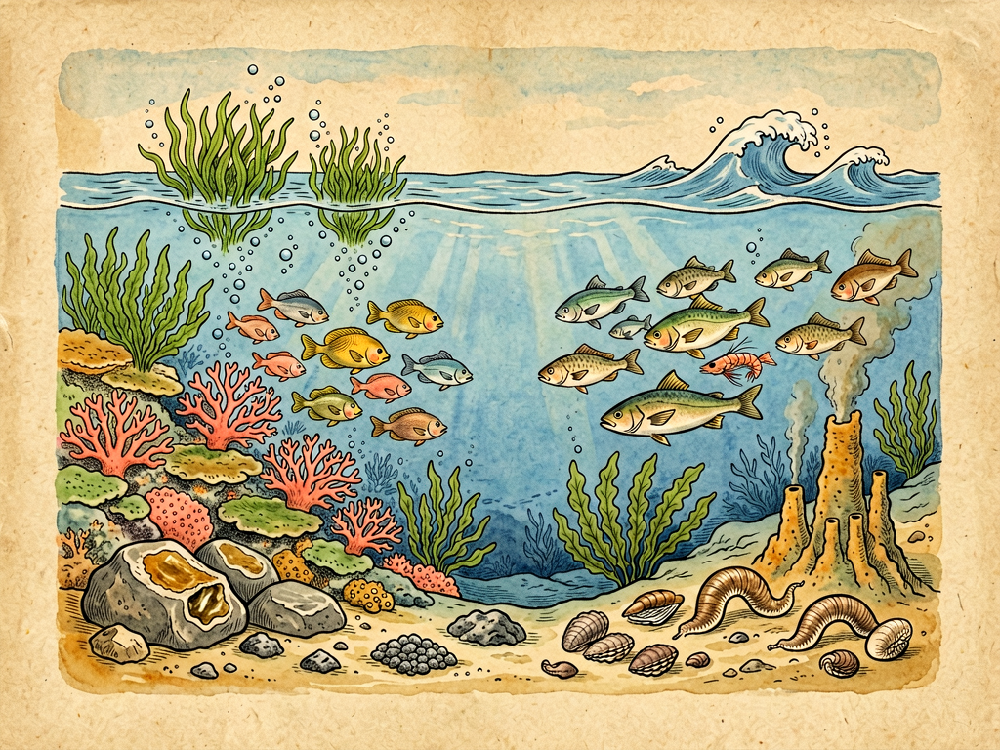

# 第三部 科学与文明
## 第二十七章 大海的宝藏

---

### 📍 本章导航
**核心主题**：地球表面71%都被蓝色的海洋覆盖，海洋平均深度3800米，最深处马里亚纳海沟10909米——这是一片我们既熟悉又陌生的世界。海洋不只是我们看风景的地方，不只是出产生鲜海鲜的地方——它是生命的发源地，是气候的调节器，是巨大的资源宝库，也是人类文明交流的通道。但是海洋的宝藏不是取之不尽的，懂得怎么向海洋取宝、怎么保护海洋，是每一个现代公民的必修课。  
**你将发现**：
- 地球生命38亿年前起源于海洋，直到今天海洋里还生活着地球上80%以上的物种，已知23万种海洋生物，估计还有200万种没被发现
- 全球90%贸易靠海运，1/3石油来自海底，中国是世界最大水产养殖国（占全球60%），海水里溶解了元素周期表几乎所有元素
- 海洋是地球的"空调"和"肺"——制造地球上50%的氧气（你每2口气有1口来自海洋浮游植物），吸收30%人类排放的CO₂，北大西洋暖流让欧洲比同纬度加拿大高15-20℃
- 深海里藏着更多宝藏：热液喷口350℃高温下有繁荣的生态系统（1977年发现，彻底改变生命认知），多金属结核含锰、钴、镍，蓝碳生态系统储碳能力是热带雨林的几十倍
- 海洋危机：90%大型鱼类已经减少，800万吨塑料每年流入海洋，海洋酸度比工业革命前高30%，微塑料已经进入人类血液和胎盘
- 21世纪是海洋的世纪：中国"奋斗者号"坐底马里亚纳海沟，海上风电、蓝碳经济、海洋牧场正在快速发展，未来的食物、能源、药物很多都要从海洋里找

**阅读建议**：如果你去过海边，不妨回忆一下大海给你的感受——咸咸的海风、一浪接一浪的潮水、退潮后水洼里的小生物。即使你从来没见过海，你每天的生活也和海洋息息相关：你吃的盐、开的车烧的油、甚至你呼吸的氧气，都有海洋的贡献。保护海洋不是海边人的事，是我们每一个人的事。

---

### 🖋️ 经典原文

你们很多人可能去过海边，光着脚踩过沙滩，捡过贝壳，尝过又苦又咸的海水，看着海浪一浪接一浪从天边涌过来，肯定觉得大海又大、又神秘。

但是我想问问你们：你们知道大海到底有多大？海里面到底藏着多少宝藏吗？很多孩子以为，大海里除了鱼就是水，除了盐就是珊瑚——那你们可太小看海洋了。海洋是我们这个星球上最巨大、最宝贵的宝库，人类从诞生那天起就在从海里拿东西，但是直到今天，我们对海洋的了解还不如对月球表面了解得多。

今天我们就来讲讲大海的宝藏——看看这一望无际的蓝色水面下面，到底藏着多少好东西，这些宝藏和我们每个人有什么关系，我们又该怎么对待这片蓝色的家园。

---

首先我要告诉你们一个最根本的事实：**海洋是生命的母亲，是我们所有生命共同的老家**。

你们都知道，地球是目前我们知道的唯一有生命的星球，为什么？很重要的一个原因就是我们有海洋。大概在三十八亿年前，最早的生命就是在原始海洋里诞生的——在那之后的三十多亿年里，生命一直都只待在海里，直到四亿多年前，才慢慢有植物和动物爬上陆地。也就是说，我们人类，还有陆地上所有的动物植物，都是从海洋里走出来的，我们的身体里至今还流着和海水成分很像的血液和体液，这就是我们来自海洋的印记。

直到今天，海洋仍然是生命最热闹的家园。地球上所有的生物，按重量算有80%都生活在海里；已知的物种里，海洋生物占了差不多四分之一，而且还有几百万种我们还没发现——尤其是深海，那里水压大、没有阳光，我们之前以为那里不可能有生命，结果最近几十年才发现，深海里有热液喷口、有冷泉，有一个完全不依赖阳光的独特生态系统，住着各种各样我们从来没见过的神奇生物。

海洋里的生命形成了一张巨大的食物网：最底下是**浮游植物**——这些小到我们肉眼看不见的藻类，漂在海水表层，靠阳光做光合作用，它们是整个海洋食物链的基础。浮游植物养活了**浮游动物**，浮游动物养活了小鱼小虾，小鱼小虾养活了大鱼、海豹、海豚、鲸鱼，最后所有生物死了之后，又被细菌分解，回到海水里变成营养，重新供养新的生命。

你们知道吗？地球上大概一半的氧气，是海洋里的浮游植物造出来的——也就是说，你每吸两口气，就有一口气是海洋给你的。光凭这一点，海洋就是我们所有人的大恩人。

---

大海最显眼、大家最熟悉的宝藏，当然是吃的——各种各样的海鲜。
我们吃的鱼、虾、蟹、贝类，海带、紫菜、裙带菜，这些都是海洋给我们的礼物。全世界有几十亿人，动物蛋白的主要来源就是海产品。在中国，渔业和水产养殖养活了几千万人，我们餐桌上的酸菜鱼、小龙虾、扇贝、生蚝、带鱼、大黄鱼，全都是海洋的馈赠。
现在我们不仅捞野生的鱼，还搞**海洋牧场**和水产养殖——在海里养鱼、养虾、养贝类、种海带，就像农民在地里种庄稼一样。中国是世界上最大的水产养殖国，我们养的海鲜占了全世界的60%以上，这是我们中国人为世界粮食安全做的大贡献。
除了当食物，海洋生物还能给我们提供药：很多退烧药、消炎药、抗癌药，最初都是从海洋生物里发现的；海绵、珊瑚、海鞘这些看起来不怎么动的生物，能制造出各种各样对付细菌、病毒、癌细胞的化学物质，未来很多新药可能都要从海里找。
还有大家最熟悉的**盐**。海水是咸的，因为里面溶解了盐——平均每1000克海水里就有35克盐，把海水引到盐田里，太阳一晒，水蒸发了，白花花的盐就出来了。几千年前人类就学会晒盐了，我们天天吃的食盐，大部分都是海盐。盐不仅是调味品，还是化学工业最基本的原料，做肥皂、做玻璃、做造纸、做纺织，都离不开盐。
而且海水里不只有盐——海水中溶解了元素周期表上几乎所有的元素：镁、溴、钾、碘、铀、锂……现在我们已经能从海水里提取镁、提取溴、提取钾，未来如果技术成熟了，甚至能从海水里提取铀和锂——这些都是核能和电池需要的重要原料。海水本身也是资源：现在很多沿海国家都在搞海水淡化，把海水变成能喝的淡水，解决缺水问题。

---

海底的地底下，还藏着更巨大的宝藏——矿产和能源。
大家最熟悉的就是**石油和天然气**。现在全世界三分之一的石油和天然气，是从海底开采出来的。大陆架浅海地区，几百万年前有大量的浮游生物沉到海底，被泥沙埋起来，经过高温高压，慢慢变成了石油和天然气。我们路上跑的汽车、天上飞的飞机、工厂里烧的燃料、做塑料衣服鞋子的化工原料，很多都来自海上油田。
再往深一点，海底还有各种各样的矿产：
- **滨海砂矿**：海边沙滩里有很多重金属砂矿，有金红石、锆石、独居石，还有锡砂、金砂，很多稀有金属都在里面；
- **多金属结核**：在几千米深的大洋盆底，铺着一层像土豆一样的黑乎乎的结核，里面富含锰、铁、镍、钴、铜——这些都是制造电池、合金钢、电子产品需要的关键金属，而且这些结核还在慢慢长，虽然长得很慢，一百万年才长几毫米；
- **热液硫化物**：在大洋中脊的地方，地下岩浆把海水加热，滚烫的海水带着大量金属从海底喷出来，遇到冷水就沉淀下来，形成"黑烟囱"，这些硫化物里富含铜、锌、金、银等金属；
- **富钴结壳**：在海山上长的一层壳，里面钴的含量特别高——钴是制造锂电池、高温合金必不可少的金属，现在电动车行业对钴的需求特别大。
不过我要特别提醒你们：这些深海矿产虽然多，但是开采起来特别难，而且深海生态系统非常脆弱——那里的生物生长特别慢，一旦被破坏，几百年都恢复不过来。所以开不开采深海矿产、怎么开采，现在全世界还在争论，我们一定要非常非常小心，不能为了拿资源就把深海环境毁了。
还有现在发展很快的**海洋可再生能源**：海上风电、潮汐能、波浪能、海流能、海水温差能——这些都是清洁的、不会用完的能源，未来人类要替代化石能源、应对气候变化，海洋能是非常重要的一块。

---

但是你们知道吗？海洋最最宝贵、最最无价的宝藏，不是鱼、不是盐、不是石油，而是它对整个地球环境的调节作用——这是我们用钱买不到的服务。
我给你们数数海洋都替我们做了什么：
第一，海洋是地球的**大空调**。海水的比热容特别大，能吸收和储存大量的热量。夏天它吸热，冬天它放热，让沿海地区冬暖夏凉，不会太热也不会太冷。而且海流就像巨大的传送带，把赤道附近热的海水运到冷的两极，把冷的海水运到赤道，让整个地球的温度不会太极端——如果没有海洋，赤道会热得死人，两极会冷得死人，根本没法住人。你们知道欧洲为什么比同纬度的加拿大暖和那么多吗？就是因为有北大西洋暖流从热带送过去源源不断的热量，英国、法国冬天比咱们中国东北暖和多了，就是靠这股暖流。
第二，海洋是地球的**碳汇**，也就是吸收二氧化碳的大仓库。人类烧煤烧油排到空气中的二氧化碳，大概有三分之一被海洋吸收了——如果海洋不吸这些二氧化碳，全球变暖会比现在快得多。
第三，海洋是地球水循环的**源头**。太阳把海水蒸发，变成水汽，被风吹到陆地上空，变成雨、雪降下来，才有了陆地上的河流、湖泊、地下水，我们才能喝到淡水、庄稼才能生长——所有陆地上的淡水，归根结底都是从海洋里来的。
第四，海洋还有**净化环境**的能力。陆地上排出去的很多污染物，到了海里会被稀释、被微生物分解，当然这个能力是有限度的，排太多了它也消化不了。
你们看，海洋默默地为我们做了这么多事，不拿一分钱报酬——如果海洋停止工作，整个地球的生态系统马上就会崩溃，我们人类根本活不下去。

---

最后，海洋还是**文明交流的大通道**。
你们看世界地图就会发现，几乎所有的大城市都在海边或者河边。为什么？因为在古代，海运是最便宜、运量最大的运输方式——一辆马车只能拉几百斤东西，而且走得慢，路还不好走；一艘船能拉几十万斤甚至几百万斤货物，顺着风、顺着洋流，能跨越大洋。
从古代的海上丝绸之路，把中国的瓷器、丝绸、茶叶运到欧洲、非洲，把香料、宝石、新的农作物运回来；到大航海时代，哥伦布发现美洲，麦哲伦环球航行，把整个世界连在了一起；再到今天，全世界90%的国际贸易货物都是靠轮船运的——你用的手机、穿的衣服、开的汽车、烧的石油，很大概率都是坐轮船跨过大洋来到你身边的。
海洋不仅运货物，还运思想、运文化、运技术、运人口。世界上不同地方的人通过海洋互相认识、互相交流、互相学习，才有了今天的全球化。一个国家是不是重视海洋、会不会利用海洋，很大程度上决定了它能不能发展起来——15世纪之后，那些掌握了航海技术的国家，一个个都成了世界强国，就是这个道理。
我们中国有一万八千公里的大陆海岸线，有三百万平方公里的蓝色国土，建设海洋强国是我们未来非常重要的发展方向。

---

讲到这里，我必须给你们泼点冷水：大海的宝藏虽然多，但绝对不是取之不尽用之不竭的，如果我们只顾着拿、不懂得保护，很快就会把这些宝藏糟蹋完。
现在海洋正面临着很多严重的问题：
第一个是**过度捕捞**。现在的捕鱼技术太厉害了——声呐能准确找到鱼群在哪里，几公里长的大网一次能把几十吨鱼捞上来，连小鱼苗都不放过。很多传统的渔场，像中国的舟山渔场、加拿大的纽芬兰渔场，因为捕得太狠，鱼已经越来越少了，有的甚至已经没有鱼了。现在全世界三分之一的渔业资源已经被过度开发，如果继续这样捞下去，再过几十年，我们可能就没野生鱼吃了。
第二个是**海洋污染**。最严重的就是塑料污染——全世界每年有几百万吨塑料垃圾流进海里，这些塑料要几百年才能分解，它们被海鸟、海龟、鱼吃进去，堵在它们的肠胃里，把它们活活饿死；塑料碎成微粒之后，会进入食物链，最后被我们自己吃回去。还有石油泄漏、工业废水、生活污水、农业化肥排到海里，造成赤潮、绿潮，让海水里没有氧气，变成死海，鱼虾全都死光。
第三个是**气候变化和海洋酸化**。人类排的二氧化碳被海水吸收之后，会让海水变酸——现在海洋的酸度已经比工业革命前高了30%，酸化的海水会让贝壳、珊瑚这些有碳酸钙外壳的生物长不好，珊瑚礁会白化死亡；全球变暖让海水温度升高，也会让珊瑚死亡，还会让冰川融化，海平面上升，淹没沿海城市。
第四个是**栖息地破坏**。我们填海造地、破坏红树林、海草床、盐沼、珊瑚礁——这些地方不仅是海洋生物产卵、育儿的地方，是海洋的"幼儿园"，还是保护海岸的天然防波堤，能吸收大量二氧化碳。红树林砍光了，台风来的时候海岸就会被冲垮；珊瑚礁没了，鱼就没地方住，海岸也会被海浪侵蚀。
你们看，海洋现在已经病得很重了。要是我们把海洋毁了，最后倒霉的还是我们自己。没有健康的海洋，就没有新鲜的空气、没有稳定的气候、没有足够的海鲜、没有顺畅的贸易，我们的子孙后代就没法在这个星球上好好生活。

---

那我们该怎么对待大海的宝藏呢？我想有几点很重要：
第一，**不能掠夺式开发，要可持续利用**。捕鱼不能赶尽杀绝，要规定禁渔期、禁渔区，用网眼大的渔网，让小鱼能长大，让鱼群能繁殖；开采石油和矿产的时候，要做好防护，不能漏油、不能破坏环境；搞养殖也要科学养殖，不能把海水污染了。
第二，**要建立海洋保护区**。就像陆地上有自然保护区一样，海里也要划出保护区，不让捕鱼、不让开发，让海洋生物能安心繁殖、好好生长。现在全世界已经建了很多海洋保护区，证明这样做反而能让周围的渔场鱼变多，是一举两得的好事。
第三，**减少污染**。少用一次性塑料，做好垃圾分类，不要把垃圾扔到海里；工厂和生活污水要处理干净再排；减少化肥农药的使用。保护海洋不是只有渔民和政府的事，我们每个人少用一个塑料袋、少浪费一点粮食，都是在帮海洋的忙。
第四，**好好研究海洋**。我们对海洋，尤其是深海，了解得太少了。我们要多造科考船、深潜器，去探索深海的秘密，去认识更多的海洋生物，找到更合理利用海洋资源的方法。当年"蛟龙号"载人深潜器下潜到7000多米深的海底，就是我们中国人探索深海的重要一步。

最后我想跟你们说：21世纪是海洋的世纪。过去几百年，人类对海洋的认识更多是"征服海洋""向海洋索取"，现在我们慢慢明白了，海洋不是我们的敌人，也不是随便我们拿东西的仓库，它是我们的朋友，是我们生命的一部分。我们要像保护自己的眼睛一样保护海洋，像对待自己的母亲一样对待海洋——因为保护海洋，就是保护我们自己，保护我们的未来。
下次你们再看到大海的时候，除了欣赏它的美，除了品尝美味的海鲜，也请想一想：这片蓝色的海洋给了我们这么多，我们又该给它什么回报呢？

---

> 📜 **科学史话：人类认识海洋的历程**
>
> 人类和海洋打交道的历史，几乎和人类文明一样长。
>
> **早期的航海**。早在几千年前，波利尼西亚人就驾着独木舟，靠着星星、洋流、风向的知识，在广阔的太平洋上航行，发现了一个又一个小岛——没有指南针、没有现代导航设备，完全靠经验，这是非常了不起的航海成就。中国在秦汉时期就有了海上丝绸之路，到了明朝，郑和下西洋，率领两百多艘船、两万七千多人，远航到非洲东海岸，是当时世界上最大规模的远洋船队，比哥伦布发现美洲早了将近一百年。
>
> **大航海时代**。15世纪末到16世纪初，迪亚士、哥伦布、达·伽马、麦哲伦这些航海家，靠着罗盘和帆船，跨过大洋，发现了美洲新大陆，完成了环球航行，第一次证明了地球是圆的，也第一次把整个世界连在了一起。但是那个时候，人们对海洋本身几乎没有了解，只知道海面能行船，海里有鱼，对海洋有多深、海底是什么样、海水为什么流动，几乎一无所知。
>
> **第一次海洋科学考察**。1872年到1876年，英国皇家海军的"挑战者号"科考船进行了人类历史上第一次系统性的环球海洋考察。他们在三年半时间里航行七万公里，测量海水温度、深度、洋流，采集海水样品、海底沉积物和海洋生物，一共发现了四千多种新的海洋生物，第一次证明深海里也有生命——之前人们以为550米以下就没有生物了。这次考察标志着现代海洋科学的诞生。
>
> **深潜时代**。人能不能潜到深海里去？很长时间里大家都认为不可能——几百米下的水压就能把人压成肉饼。1960年，瑞士工程师皮卡尔和美国海军中尉沃尔什乘坐"的里雅斯特号"深潜器，第一次下潜到了马里亚纳海沟最深处，深度10916米——这是海洋最深的地方，比珠穆朗玛峰的高度还深。他们在1100个大气压的水压下，惊讶地发现那里居然还有鱼和虾在游，这大大改变了我们对生命极限的认识。2012年，导演卡梅隆独自乘坐深潜器又一次下到了马里亚纳海沟底部；2020年，中国的"奋斗者号"载人深潜器成功坐底马里亚纳海沟，深度10909米，标志着中国的深潜技术进入了世界第一梯队。
>
> 从独木舟到航空母舰，从岸边捕鱼到深海采矿，从只能看海面到潜到万米洋底，人类和海洋的故事才刚刚开始。

---

> 🔬 **科学更新：海洋科学的最新发现**
>
> 近几十年，我们对海洋的认识突飞猛进，有很多令人激动的新发现。
>
> **深海热液生态系统**。1977年，科学家在加拉帕戈斯群岛附近的海底，第一次发现了深海热液喷口——也就是"黑烟囱"。这里没有阳光，水温高达三四百度，充满了有毒的硫化氢，按说不可能有生命。但是科学家在这里发现了一个极其繁荣的生态系统：几米长的管虫、巨大的蛤蜊、盲虾、螃蟹，密密麻麻地生活在热液喷口周围。它们不依赖阳光，而是靠细菌分解硫化物获得能量——这是人类第一次发现不依赖太阳能的生态系统，彻底改变了我们对生命的认识。科学家甚至猜测，地球上最早的生命可能就起源于这样的热液喷口。
>
> **海洋里的微塑料已经无处不在**。现在科学家在马里亚纳海沟最深处的钩虾身体里发现了微塑料，在南极的冰里、北极的海冰里、甚至在人迹罕至的大洋中心，都有微塑料的存在。这些微塑料还会进入我们吃的海盐、海鲜、饮用水里，甚至在人类的血液、粪便、胎盘里都发现了微塑料。微塑料污染已经成为和气候变化并列的全球性环境问题。
>
> **海洋牧场和蓝色食品革命**。现在我们的水产养殖技术越来越先进：我们在海里投放人工鱼礁，给鱼造房子；我们搞深水网箱养殖，在远海养三文鱼、大黄鱼；我们搞多营养层级综合养殖——在同一个区域养鱼、养贝、养藻类，鱼的排泄物给贝类和藻类当肥料，藻类净化水质，形成一个小的生态系统，不用投太多饲料也不用打药。未来我们要喂饱地球上几十亿人，蓝色食品（也就是水产品）会比陆地上的肉类更环保、更高效，是未来粮食安全的重要保障。
>
> **大型海藻和蓝碳**。现在科学家发现，红树林、海草床、盐沼这些滨海生态系统，还有大型海藻，吸收二氧化碳的能力比陆地上的森林强得多——它们储存碳的速度是热带雨林的几十倍。保护和修复这些"蓝碳"生态系统，是我们应对气候变化的重要武器。现在中国、韩国等国家都在大规模种植海带、裙带菜等大型海藻，不仅能收获食物，还能吸收碳、净化海水，一举多得。
>
> **海洋基因资源**。现在很多人在研究海洋生物的基因——那些生活在极端环境下的生物，比如热液口耐高温的细菌、深海里耐压耐寒的鱼类，它们的基因里藏着特殊的酶和代谢途径，可以用来做工业催化剂、做新药、做生物材料。这些看不见的基因资源，可能是未来海洋最有价值的宝藏之一。
>
> 深海还有太多秘密等着我们去发现。

---

> 🌍 **现实连接：我们每个人都和海洋有关**
>
> 不要觉得你住在内陆，离海几千公里，海洋就和你没关系——你生活的每一天都在受海洋的影响。
>
> **你吃的盐、吃的海鲜**。你家里炒菜用的盐，大部分是海盐；你吃的海带、紫菜、带鱼、虾仁，不管你在哪里，这些都来自海洋。即使你不住在海边，你也在消费海洋的产出。
>
> **你用的石油和塑料**。你加的汽油、柴油，你用的塑料袋、塑料瓶、化纤衣服，很多都是海底开采的石油做的——这些东西用完之后如果乱扔，最后很可能又流回海洋，变成污染。
>
> **你呼吸的空气、你那里的气候**。前面说了，你每吸两口气就有一口氧气来自海洋浮游植物；你那里下雨，有水汽从海洋蒸发过来；你那里冬天冷不冷、夏天热不热，很大程度上受海洋和洋流的影响。
>
> **我们普通人能为保护海洋做什么？**
> 1. **减少使用一次性塑料**。去超市带布袋子，少买瓶装水，少点外卖（外卖包装大部分是塑料），不用塑料吸管——这些小事加在一起，就能减少很多流进海里的塑料。
> 2. **不吃濒危海洋生物**。不要吃鱼翅、不要吃濒危的野生海鲜，买海鲜的时候选可持续养殖或者捕捞的品种。
> 3. **去海边玩的时候不要乱扔垃圾**。尤其是塑料袋、塑料瓶，这些东西被海龟、海鸟当成水母吃下去，会害死它们。也不要随便捡活的贝壳、珊瑚，不要捞小鱼虾，看完就放它们回去。
> 4. **减少碳排放**。海洋酸化和变暖的根本原因是我们排了太多二氧化碳，所以少开一天车、节约一度电、少浪费一点食物，都是在帮海洋减压。
> 5. **了解海洋，告诉身边的人海洋的重要性**。很多人不保护海洋，是因为他们不了解海洋有多重要、现在有多危险。你懂了，再讲给你的爸爸妈妈、同学朋友听，就是在为保护海洋做贡献。

---

> 💡 **动手试一试：做几个和海洋有关的小实验**
>
> **实验1：在家里做个"小海洋"——海水淡化小实验**
>
> 你可以自己在家做一个简单的海水淡化装置，看看怎么把咸咸的海水变成淡水：
> 1. 找一个大碗，在碗里倒上盐水（水里加很多盐，尝起来和海水一样咸）；
> 2. 在碗中间放一个小杯子，杯子的高度要比盐水水面低；
> 3. 用保鲜膜把碗口封紧，在保鲜膜正中间（也就是小杯子上方）放一块小石子，让保鲜膜中间凹下去一点；
> 4. 把碗放到太阳底下晒几个小时。
>
> 过几个小时你再看，小杯子里会接收到水——那是因为太阳晒得盐水蒸发，水蒸气遇到冷的保鲜膜凝结成小水滴，顺着凹下去的地方流到小杯子里。你尝一尝小杯子里的水，是淡的！盐不会蒸发，都留在大碗里了。这就是海水淡化的基本原理。
>
> **实验2：观察海鲜的结构**
>
> 下次家里买鱼、虾、贝类的时候，你可以仔细观察一下：
> - 鱼的身体是什么形状？鱼鳞长什么样？鱼鳃是什么颜色、什么结构？（鱼鳃就是鱼在水里呼吸的器官，鳃丝上布满毛细血管，能吸收水里的氧气）
> - 虾的身体分几节？它有多少条腿？它的眼睛长在哪里？
> - 贝壳里面是什么样的？珍珠层是不是有彩色的光泽？
>
> 如果有条件，可以去海边赶海（退潮的时候在沙滩和礁石上找小生物），看看螃蟹怎么横着走，看看小水洼里的小鱼、小虾、小海螺，看看藤壶、海葵、牡蛎这些附着在礁石上的生物。
>
> **实验3：塑料污染模拟实验**
>
> 找一个透明的大瓶子，装半瓶水，放进去几块不同的塑料碎片（瓶盖、塑料袋碎片、泡沫塑料碎块），盖紧盖子用力摇晃一分钟，看看会发生什么：
> - 塑料袋碎片是不是很容易挂住别的东西？海鸟和海龟经常把塑料袋当成水母吃下去。
> - 泡沫塑料是不是会碎成更小的颗粒？这些小颗粒就是微塑料，会被浮游动物、小鱼吃进去，沿着食物链一直传到我们这里。
>
> 做完实验你就会明白塑料污染有多难处理——它不会消失，只会越碎越小，一直在海里待几百年。

---

### 💬 读后思考与讨论

1. 海洋覆盖了地球71%的表面，但是我们现在只探索了不到5%的海洋。你觉得深海里还可能有什么我们不知道的东西？我们为什么要花那么多钱去探索深海？
2. 有人说"深海矿产那么多，我们赶紧开采吧，能赚很多钱"，也有人说"深海生态太脆弱了，一旦破坏就恢复不了，绝对不能开采"。你怎么看这个问题？怎么平衡资源开发和环境保护？
3. 很多内陆的孩子觉得"我从来没见过海，海洋和我没关系"，你怎么说服他们海洋和每个人都息息相关？
4. 塑料污染现在已经是海洋最大的威胁之一，我们除了自己少用塑料，还能做些什么？你觉得有没有可能发明出完全不会污染环境的塑料？
5. 我们现在的水产养殖产量已经超过了野生捕捞，未来我们吃的鱼大部分可能都是养殖的。你觉得这是好事还是坏事？养殖会不会带来新的环境问题？
6. 有人说"21世纪是海洋的世纪"，你觉得未来海洋会在哪些方面改变我们的生活？

### 🔗 关联阅读
- 第三部第九章：《天石》→ 了解陨石和地球的形成，海洋和原始大气就是在地球形成过程中慢慢出现的
- 第三部第十四章：《热的旅行》→ 了解比热容、热传递的原理，就能明白为什么海洋能调节全球温度
- 第三部第十八章：《水的改造》→ 了解淡水资源、水循环和水污染治理，水循环的起点就是海洋蒸发
- 第三部第二十四章：《未来的旅行》→ 海洋是未来交通和资源开发的重要空间，海上城市、海底隧道都可能在未来出现
- 第二部第十二章：《清水和浊水》→ 了解水污染是怎么回事，陆地上的污染最终都会流进海里
