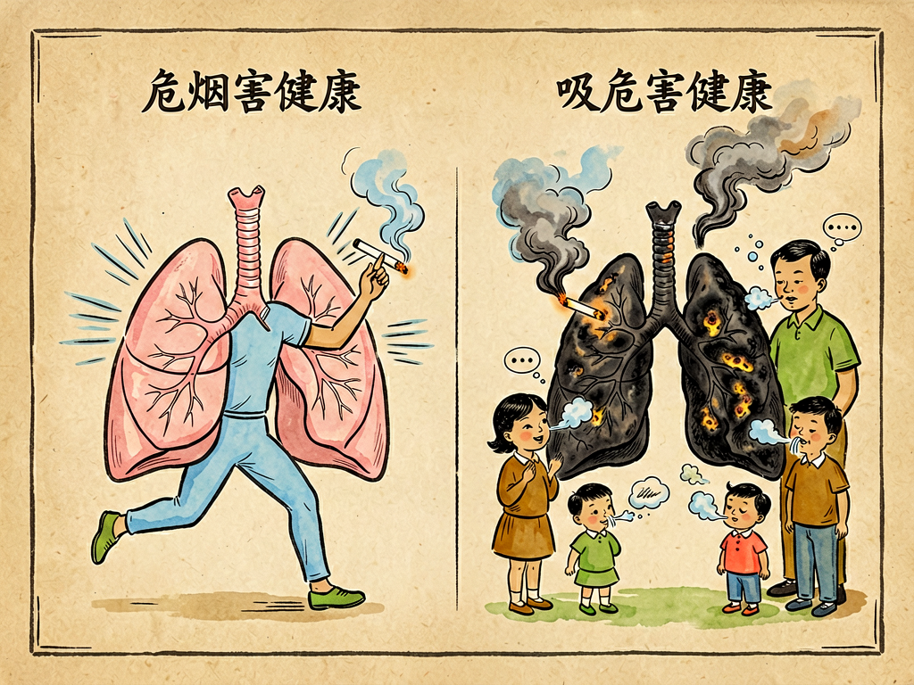

# 第三部 科学与文明
## 第二十八章 大力宣传戒烟

---

### 📍 本章导航
**核心主题**：今天我们要讲一个和每个人健康都息息相关的话题——吸烟。在过去很长一段时间里，吸烟被当成一种时髦、一种社交方式，甚至是成熟的象征。但是科学告诉我们，烟草是这个世界上对人类健康危害最大的消费品之一，每年有800多万人因为吸烟和二手烟失去生命，中国每年超过100万人死于烟草相关疾病——超过艾滋病、结核、交通事故死亡总和。这一章我们就用科学的眼光，看看烟草到底对我们的身体做了什么，为什么戒烟这么难，以及为什么说宣传戒烟是一件关系到每个人、每个家庭、整个社会文明的大事。  
**你将发现**：
- 烟雾里有超过7000种化学物质，其中至少250种有害、69种是明确致癌物——甲醛（福尔马林）、苯、砷（砒霜）、钋-210（放射性物质）都在里面
- 吸烟不只是伤肺——90%肺癌由吸烟引起，还会导致冠心病、中风、慢阻肺、10多种癌症，每抽1支烟寿命缩短11分钟，吸烟者平均少活10-15年
- 二手烟同样致命：焦油高3倍、尼古丁高2倍、一氧化碳高5倍、致癌物高几十倍，中国有7.4亿人受二手烟危害，每年120万非吸烟者死于二手烟
- 三手烟同样有害：毒物残留在衣服、沙发、墙壁上数月，孩子在地上爬摸完吃手就会摄入，不在家抽烟也没用
- 尼古丁成瘾性等同于海洛因、可卡因，是WHO认定的慢性疾病，不是意志力薄弱——戒烟需要科学方法：戒烟门诊、尼古丁替代、戒烟药，不是光靠"硬扛"
- 戒烟任何时候都不晚：戒烟20分钟血压心率下降，戒烟1年冠心病风险减半，戒烟15年身体恢复到从不吸烟水平；电子烟不是戒烟神器，同样致癌还会诱导青少年吸烟

**阅读建议**：如果你身边有抽烟的家人或者朋友，读完这一章，你可以把里面的科学知识讲给他们听，帮助他们了解烟草的危害——这不是多管闲事，是真正的关心。如果你自己不抽烟，也请你了解这些知识，保护自己和身边的人不被二手烟伤害。要知道，每4个烟民就有1个会在中年死于吸烟相关疾病，不要让你的家人成为那个数字。

---

### 🖋️ 经典原文

今天我要和你们谈一件非常严肃、非常重要的事：大力宣传戒烟。
我知道，现在社会上还有很多人抽烟，很多人觉得抽烟没什么大不了的——"不就是抽根烟吗？""我爷爷抽了一辈子烟，也活到八十多""抽烟能提神、能解闷、能交朋友，大家都抽，怎么就你事多？"
但是今天我要把话讲清楚：抽烟绝对不是什么好事，更不是什么时髦、什么风度，它是一种明确有害健康的坏习惯，是一种慢性自杀，而且它还会害你身边最亲的人——你的父母、你的爱人、你的孩子。我们做科普的人，有责任把这件事的真相告诉大家，让每个人都知道烟草的危害，让更多人远离烟草，这就是我今天写这篇文章的原因。

---

首先我要问你们一个问题：你们知道一支烟点着之后，冒出来的烟雾里都有些什么东西吗？
很多人以为，烟丝烧了之后就是点烟、点灰，吸进去的就是点"烟味"，没什么大不了的。那你们可就大错特错了。烟草燃烧之后产生的烟雾里，有超过7000种化学物质，其中至少有250种是对人体有害的，至少有69种是已经被科学证明的**致癌物**——也就是能直接导致癌症的东西。
我给你们说几个最有名的：
第一个是**尼古丁**。这就是为什么抽烟会上瘾的原因。尼古丁是一种烈性毒药，一滴纯尼古丁就能毒死一头牛，几毫克就能毒死一个人——只不过抽烟的时候它是一点一点进去的，所以不会立刻把你毒死，但是它会快速进入你的大脑，让你产生短暂的快感，让你离不开它。尼古丁的成瘾性和海洛因、可卡因是一个级别的，一旦上瘾，想戒就非常难。很多老烟民说"饭可以不吃，烟不能不抽"，不是他们意志力差，是尼古丁已经绑架了他们的大脑。
第二个是**焦油**。就是你们看到烟嘴发黄发黑的那些黏糊糊的东西。焦油里有几十种致癌物，它吸进去之后，会牢牢粘在你的气管、支气管、肺泡上，就像厨房油烟机上的油泥一样，几十年都清不干净。
第三个是**一氧化碳**。就是你们知道的煤气中毒的那个气体。它比氧气更容易和你血液里的血红蛋白结合，让你的血液没法好好运氧气，所以你抽烟之后会觉得头晕、心跳快，就是因为你的身体缺氧了。长期一氧化碳暴露，会让你的血管变硬、变脆，大大增加心脏病和中风的风险。
除此之外，烟雾里还有甲醛（就是泡标本的福尔马林）、苯（致癌物）、砷（就是砒霜）、镉（重金属，伤肾）、放射性物质钋-210……你想想，把这么多乱七八糟的有毒东西天天往肺里吸，你的身体能好得了吗？

---

那这些有毒东西进到身体里之后，都干了些什么坏事呢？
很多人以为抽烟就是伤肺，最多就是得肺癌，那你们也太小看烟草的破坏力了——吸烟是**全身性的伤害**，从你的嘴到你的肺，从你的血管到你的心脏，从你的生殖系统到你的大脑，几乎没有一个器官能逃得过。
我们一个一个说：
第一，**最直接的就是伤呼吸系统**。
我们的气管和支气管里面，长满了细细的**纤毛**——这些纤毛就像小刷子一样，一刻不停地往上摆动，把吸进去的灰尘、细菌、脏东西都扫出去，变成痰咳出来，保护我们的肺。但是烟草烟雾一进来，首先就会把这些纤毛麻痹、毒死，让它们动不了了——那脏东西就都留在肺里了。
所以抽烟的人一开始会经常咳嗽、痰多，这不是什么"烟咳"，这是你的肺在喊救命！时间长了，气管长期发炎，就会变成**慢性支气管炎**，再发展下去，肺泡被破坏了，吸进去的气呼不出来，就变成了**慢阻肺**——得了这个病的人，走路都喘，上个楼梯都要歇半天，最后活活憋死，非常痛苦。
当然，最可怕的还是**肺癌**。90%的肺癌都和吸烟有关系，抽烟的人得肺癌的概率是不抽烟的人的10到20倍——抽得越多、抽得越早、抽得越深，风险就越高。而且肺癌早期没什么感觉，等你觉得疼、咳血的时候，往往已经是晚期了，治都治不好。
我给你们算一笔账：你每天抽一包烟，一年就是365包，抽二十年就是7300包——这些烟里的焦油、致癌物一点一点在你肺里积累，就像你天天给你的肺抹毒药，时间长了它怎么可能不长癌？

第二，**吸烟会严重伤害你的心脑血管**。
刚才说了，尼古丁让血管收缩、血压升高，一氧化碳让血管壁缺氧、受损，焦油和其他有害物质让血脂沉积在血管壁上，让血管变硬、变窄——这就是**动脉粥样硬化**。
血管堵在心脏上，就是**冠心病、心肌梗死**；堵在脑子里，就是**脑梗死、脑出血**——这两个病现在是全世界第一杀手，每四个去世的中国人里就有一个是死于心脑血管病，而吸烟是最重要的危险因素之一。很多三四十岁的人，平时看起来好好的，突然心梗、中风，瘫了或者没了，一问都是老烟民。
而且吸烟还会让你的手脚血管堵，严重的会变成**脉管炎**，脚趾头烂掉，最后要截肢——你看那些手指、脚趾发黑被切掉的人，很多都是抽烟抽的。

第三，**吸烟还会导致各种各样其他的癌症和疾病**。
不只是肺癌，吸烟还会增加**口腔癌、喉癌、食管癌、胃癌、肝癌、胰腺癌、膀胱癌、宫颈癌、白血病**……几乎全身所有癌症的风险，抽烟的人都更高。
除此之外：
- 抽烟会让你牙齿变黄、口臭、皮肤变差、皱纹变多，看起来比实际年龄老很多；
- 抽烟会伤害你的胃和十二指肠，让你更容易得胃溃疡；
- 抽烟会影响你的生殖系统：男人会精子质量下降、阳痿，女人会不容易怀孕、容易流产、早产；
- 抽烟会让你的骨头变松，更容易骨折；
- 抽烟会伤害你的眼睛，让你更容易得白内障、黄斑变性，甚至失明；
- 连你的免疫力都会变差，更容易感冒、更容易感染，伤口也长得慢。
总之一句话：从你点烟的那一刻起，毒烟就随着你的血液流遍全身，你的每一个器官都在受伤害。抽烟不是"享受"，是在一点一点透支你的健康，缩短你的寿命——平均算下来，每抽一支烟，你的寿命会缩短11分钟；抽一辈子烟，平均要少活10到15年。

---

讲到这里，肯定有人会说："我自己抽烟，我自己承担后果，碍着别人什么事了？"
大错特错！抽烟从来就不是你一个人的事——你抽烟，旁边的人吸了你的**二手烟**，受到的伤害一点都不比你小。
什么是二手烟？就是你抽的时候飘出来的烟，还有你吐出来的烟——这些烟雾里的有害物质，比你吸进去的**主流烟**浓度还要高：焦油高3倍，尼古丁高2倍，一氧化碳高5倍，致癌物高几十倍。
二手烟没有所谓的"安全水平"——只要你在有烟的屋子里待着，哪怕只有一点烟味，你就在受到伤害。
最可怜的是孩子。孩子的身体还在发育，他们呼吸比大人快，吸收的有害物质更多。家里有大人抽烟的孩子：
- 更容易得肺炎、支气管炎、哮喘；
- 更容易咳嗽、感冒、耳朵发炎；
- 肺功能发育会受影响，一辈子都比别人弱；
- 长大后得肺癌、心脏病的风险也会更高。
如果是孕妇抽烟或者吸二手烟，危害更大：会导致胎儿发育不好、出生体重低、早产，甚至胎死腹中，还会影响孩子的智力发育。
还有**三手烟**——很多人以为我不在孩子面前抽，在阳台抽、在厕所抽，抽完散散味就没事了。不对！那些有毒物质会沾在你的衣服上、头发上、沙发上、地毯上、窗帘上、墙壁上，能残留好几天甚至好几个月——孩子在地上爬、摸这摸那，然后把手放进嘴里，就把这些毒吃进去了。这就是三手烟的危害，一样会致癌、一样会伤害孩子的健康。
你想想：你一个人抽烟，你的爱人、你的孩子、你的父母、你的同事、你的朋友，都在被迫吸你的二手烟三手烟，替你承担健康风险，这不是自私是什么？在公共场所抽烟，让满屋子的人都陪你一起吸毒，这不是不文明是什么？
现在全世界都有规定：公共场所禁止吸烟——这不是针对抽烟的人，这是在保护大多数不抽烟的人的健康权、呼吸权。真正的自由，是你做任何事都不能伤害别人的利益和健康。

---

还有人说："我看谁谁谁抽了一辈子烟，也活了九十多，那些不抽烟的不也有得癌的吗？"
这是典型的**幸存者偏差**。你只看到了那几个抽了烟还长寿的人，没看到那千千万万个抽烟抽出肺癌、心梗，四五十岁就走了的人——他们不会站出来告诉你"我抽烟抽出病了"，因为他们已经没机会说了。
我给你们说个数据：100个抽烟的人里面，大概会有25个人在35岁到69岁之间因为吸烟相关的疾病去世，也就是每四个烟民里就有一个会早死；如果算上70岁以后因为吸烟去世的，这个比例会超过一半。
确实有少数人基因比较特殊，抽烟也能活很久，但这是小概率事件——你敢赌你就是那个幸运儿吗？拿自己的命、拿家人的健康去赌，值得吗？就像你过马路不看红灯，确实不是每次都会被车撞，但是你敢每次都闯吗？
也有人说："我都抽了几十年了，肺已经黑了，现在戒也晚了，算了吧。"
不对！我要告诉你们：**戒烟任何时候都不晚，戒了就有好处**。
- 戒烟20分钟之后，你的心率和血压就会开始下降；
- 戒烟12小时，你血液里的一氧化碳就会降到正常水平；
- 戒烟2周到3个月，你的血液循环会改善，肺功能会提高，走路不喘了，咳嗽也少了；
- 戒烟1年，你得冠心病的风险就会降到抽烟时的一半；
- 戒烟5年，你中风的风险会降到和不抽烟的人一样；
- 戒烟10年，你得肺癌的风险会降到抽烟时的一半，得其他癌症的风险也会大大降低；
- 戒烟15年，你得冠心病的风险就和从来没抽过烟的人完全一样了。
你看，我们的身体是有修复能力的——你什么时候停止伤害，它就什么时候开始修复。哪怕你已经抽了三四十年，六十岁才戒烟，你还是能多活好几年，而且你的生活质量会高得多，不用天天咳嗽、不用走两步就喘，不用在医院里插管子。
还有人说："戒烟太难了，我戒了好几次都没成功，我意志力不行。"
我要告诉你们：尼古丁成瘾是一种**慢性疾病**，不是你意志力差——世界卫生组织早就把烟草依赖列成一种病了。既然是病，就需要科学的治疗，不是光靠"硬扛"就行。现在有很多科学的戒烟方法：
- 有戒烟门诊，医生会给你专业指导；
- 有尼古丁替代疗法，比如尼古丁贴片、尼古丁口香糖，慢慢帮你减少尼古丁摄入，减轻戒断反应；
- 有专门的戒烟药物，能降低你抽烟的欲望，减少戒断的难受；
- 再加上家人的支持、自己的决心，大部分人都能成功戒掉。
最关键的是：要立刻开始，不要等"抽完这包再说""等我忙完这阵再说"——戒烟最好的时间是十年前，其次就是现在。

---

有人会问：抽烟有这么大危害，为什么还有那么多人抽？为什么不直接把烟厂关了？
这个问题很复杂。烟草在全世界流行了几百年，它背后有巨大的经济利益，有强大的行业游说，有长期形成的社会习惯，有很多人已经上瘾离不开了——不是说禁就能立刻禁掉的。但是我们可以通过宣传教育、通过公共场所禁烟、通过提高烟草税、通过烟盒上印恐怖的健康警示图片、通过禁止烟草广告，一点一点改变社会风气，让越来越多的人了解危害，让抽烟的人越来越少，让不抽烟的人尤其是孩子不要开始抽烟。
这就是为什么我们要**大力宣传戒烟**。
你们知道吗？现在全世界每年有800多万人因为吸烟去世，其中120多万人是吸二手烟的非吸烟者。中国是世界上最大的烟草生产国和消费国，我们有3亿多烟民，有7.4亿人受到二手烟的危害，每年有100多万人因为吸烟相关的疾病去世——这个数字比艾滋病、结核病、交通事故加起来还多！如果我们不宣传、不控烟，到2030年，这个数字会变成每年200万人，到2050年每年300万人。这是多么可怕的数字啊！
宣传戒烟，不是管闲事，是救人性命。
过去几十年，我们国家的控烟工作已经取得了很大进步：现在一线城市的公共场所基本都禁烟了，大家对二手烟的危害越来越了解，抽烟的人尤其是年轻人越来越少，很多人已经意识到在别人面前抽烟是不文明的行为。但是我们还有很长的路要走——还有很多人不了解烟草的危害，还有很多人在公共场所抽烟，还有很多十几岁的孩子因为觉得酷、因为好奇开始抽烟，一抽就是一辈子。
作为科普工作者，我们的责任就是把真相告诉大家：告诉每一个人抽烟的危害，告诉每一个抽烟的人什么时候戒烟都不晚，告诉每一个不抽烟的人你有权利呼吸干净的空气，告诉每一个家长保护你的孩子远离烟草。

---

最后我想对几类人说几句话：
**对还没开始抽烟的孩子和年轻人说**：千万不要因为好奇、因为觉得酷、因为朋友递烟不好意思拒绝就开始抽第一口烟——尼古丁上瘾只需要几支烟，一旦开始，想戒就难了。记住：真正的酷、真正的成熟，不是叼着烟装样子，是对自己的健康负责，是尊重身边的人。不要拿自己的一辈子健康换一时的所谓"面子"。
**对抽烟的朋友说**：我知道戒烟很难，我理解你们戒烟的时候会难受、会烦躁、会忍不住。但是请你想想：你抽烟爽了这几分钟，你可能要付出少活十年的代价，你的家人要跟着你吸二手烟，你的孩子会因为你抽烟更容易生病，你老了之后可能要躺在医院里，插着管子，喘不上气，拖累家人。为了你自己的健康，为了你的家人，试着戒一次吧——哪怕第一次失败了也没关系，再试第二次、第三次，总有一次能成功。你会发现，戒了烟之后，饭也香了，呼吸也顺畅了，跑步也不喘了，身上也没有烟臭味了，家人也更开心了，这种感觉比抽烟那点快感好一万倍。
**对不抽烟的朋友说**：不要觉得这件事和你没关系。首先，你要勇敢地维护自己呼吸干净空气的权利——在公共场所有人抽烟，你可以礼貌地请他灭掉；家里有人抽烟，你可以告诉他二手烟对你和孩子的伤害。其次，如果你有家人朋友抽烟，不要骂他们、不要嫌弃他们，要鼓励他们、支持他们戒烟，帮他们找科学的方法。你的理解和鼓励，对他们来说非常重要。
**对整个社会说**：控烟是文明的标志。当一个社会里，大家都觉得在别人面前抽烟是不礼貌、不文明的行为，当大家都觉得递烟不是热情而是害人，当抽烟的人越来越少，当所有公共场所都没有烟味，当我们的孩子在无烟的环境里长大——这个社会一定会更健康、更文明、更美好。
大力宣传戒烟，不是为了剥夺谁的爱好，是为了挽救更多人的生命，保护更多的家庭，让我们每个人都能呼吸清新的空气，健康地生活。这是我们每个人的责任。

---

> 📜 **科学史话：人类和烟草的故事**
>
> 烟草并不是全世界都有的植物，它原产于美洲。
>
> **从美洲到全世界**。最早抽烟的是美洲的印第安人，他们在宗教仪式上抽烟，觉得烟能通灵、能治病。1492年哥伦布发现美洲之后，烟草被带回欧洲，然后慢慢传遍全世界——一开始大家都以为烟草是神药，能治头疼、能治感冒、能治百病，甚至医生会开烟草给病人治病。
>
> **烟草如何变成大众消费品**。到了19世纪，机器卷烟发明了，烟变得非常便宜，烟草公司开始大规模做广告——把抽烟和男人味、性感、成功、自由、酷这些形象绑定在一起，好莱坞电影里男主角永远叼着烟，医生甚至会代言香烟说"某某牌子的烟不刺激喉咙"。在20世纪中期，抽烟是非常时髦的事，发达国家一半以上的男人都抽烟，很多女人也开始抽。
>
> **烟草危害的发现**。但是慢慢的，医生发现不对劲：肺癌这个病以前非常少见，到了20世纪突然多了起来，而且得肺癌的人几乎都是老烟民。1950年，英国科学家多尔和希尔做了一个经典的研究，第一次用科学证据证明了吸烟和肺癌之间的因果关系——在这之前，烟草公司一直狡辩说"没有证据证明抽烟有害"。之后越来越多的研究证明了吸烟的危害，不仅是肺癌，还有心脏病、中风、各种其他疾病。
>
> **全球控烟运动**。从20世纪60年代开始，发达国家开始慢慢控烟：要求烟盒上印健康警告，禁止烟草广告，公共场所禁烟，提高烟草税。这些措施非常有效——现在发达国家的吸烟率已经从一半以上降到了20%以下，肺癌发病率也开始下降。但是烟草公司转向了发展中国家，包括中国，所以现在中国成了世界上最大的烟草消费国。
>
> **中国的控烟历程**。我们国家从2003年签署了世界卫生组织《烟草控制框架公约》，之后控烟工作一直在推进：2011年开始室内公共场所全面禁烟，现在很多城市都有严格的控烟条例，烟盒上也有健康警示，越来越多的人开始意识到烟草的危害。但是我们还有很长的路要走——现在中国15岁以上人群吸烟率还有26.6%，男性吸烟率高达50%以上，二手烟暴露非常普遍。
>
> 从把烟草当神药，到知道它是健康杀手；从把抽烟当时髦，到公共场所禁烟——这是人类认知的进步，也是文明的进步。

---

> 🔬 **科学更新：关于烟草和戒烟的最新研究**
>
> 最近这些年，科学家对烟草危害的认识越来越深入，也有了更多帮助人戒烟的新方法。
>
> **电子烟不是戒烟神器，同样有害**。最近几年电子烟特别流行，很多人以为电子烟是"健康烟"，能帮人戒烟——这是个巨大的误区。电子烟同样含有尼古丁，同样会上瘾，而且电子烟的气溶胶里含有甲醛、重金属、各种致癌物质，对肺和心血管的伤害一点都不比传统烟小。很多青少年一开始是抽水果味的电子烟觉得好玩，结果尼古丁上瘾，最后还是抽上了传统香烟。现在世界卫生组织明确说：电子烟有害公共健康，不是有效的戒烟手段，我们必须警惕电子烟对青少年的危害。
>
> **抽烟会伤大脑，还会影响下一代**。最新研究发现，长期抽烟会让你的大脑萎缩，记忆力下降，认知能力衰退，老了之后更容易得老年痴呆症。而且抽烟对基因的影响还会传给下一代——爸爸抽烟，即使妈妈不抽烟，孩子也会有更高的风险得先天疾病、儿童癌症。
>
> **三手烟的危害被证实**。以前大家只知道二手烟有害，现在科学家发现三手烟——也就是残留在衣服、家具、墙壁上的烟草残留物，同样含有致癌物，会和空气里的物质反应生成新的有毒物质，持续伤害人体，尤其是对爬行的婴幼儿危害特别大。所以抽烟之后散味没用，那些毒会留在家里好几个月。
>
> **新的戒烟方法**。现在除了传统的尼古丁替代疗法和戒烟药，科学家还在研究新的戒烟方法：比如尼古丁疫苗，打一针就能让你抽烟的时候没有快感；比如用AI和手机APP帮你监控抽烟习惯、提供个性化的戒烟指导；还有经颅磁刺激，帮你降低对尼古丁的渴望。这些方法未来会帮助更多人成功戒烟。
>
> **低焦油卷烟、淡味烟都是骗局**。很多烟草公司宣传"低焦油""淡味""柔和型"香烟危害更小，这完全是营销骗局。研究证明，这些烟的危害一点都不比普通烟小——抽烟的人会因为觉得淡，抽得更深、抽得更多，实际摄入的焦油和致癌物一点都不少。
>
> 烟草危害是这个世界上最可预防的死亡原因——只要不抽烟、戒了烟，这些疾病和死亡大部分都是可以避免的。

---

> 🌍 **现实连接：我们身边的无烟环境**
>
> 控烟和我们每个人息息相关，我们每个人都能为无烟环境出一份力。
>
> **烟盒上的警示为什么有用**。你们有没有注意到，很多国家和地区的烟盒上，印的不是漂亮的风景和品牌名，而是非常吓人的图片——发黑的肺、烂掉的脚趾、插着管子的病人——这些图片警示能有效降低吸烟率，尤其是能阻止年轻人开始抽烟。可惜我们国家现在的烟盒上还是只有一行小小的"吸烟有害健康"，警示效果非常弱。
>
> **为什么提高烟草税能控烟**。香烟是一种很特殊的商品——价格涨10%，吸烟率就会降4%，尤其是青少年对价格特别敏感，涨价会让很多孩子买不起烟，不会开始抽。提高烟草税，一方面能减少吸烟人数，另一方面多收的税还能用来做医保、做控烟宣传，是一举两得的事。现在全世界公认，提高烟草税是最有效的控烟手段之一。
>
> **现在已经有很多地方实现了无烟立法**。比如北京、上海、深圳这些城市，所有室内公共场所、工作场所、公共交通工具里都完全禁烟，抽烟会被罚款——现在这些地方的人已经慢慢习惯了室内不抽烟，二手烟暴露率下降了很多。但是还有很多地方的控烟法规执行得不好，需要大家一起监督。
>
> **无烟家庭是给孩子最好的礼物**。对我们每个人来说，最该做的就是创建无烟家庭——不在家里抽烟，也不让来家里的客人抽烟。让孩子在没有烟味的环境里长大，不仅能保护他们现在的健康，还能减少他们以后抽烟的可能性——家长抽烟的孩子，长大后抽烟的概率是家长不抽烟孩子的两三倍，因为他们从小就把抽烟当成一件正常的事。
>
> **不要给别人递烟，就是最大的尊重**。很多地方还有递烟的习惯，觉得见面递根烟是礼貌、是热情——现在我们要改改这个观念了。真正的礼貌是尊重别人的健康，不递烟、不劝烟，别人说不抽烟就不要再递，在抽烟之前先问一句"我可以抽烟吗"，看到旁边有小孩、孕妇绝对不抽。这才是现代人该有的文明习惯。

---

> 💡 **动手试一试：认识烟草的危害小实验**
>
> **实验1：看看烟里的焦油有多少**
>
> （这个实验最好请老师或者家长帮忙做，注意安全）
> 找一个透明的塑料瓶，在瓶盖上插一根烟，瓶底扎一个小孔，里面放一团干净的白色棉花。把烟点着，然后从瓶底的小孔吸气，让烟通过瓶子。抽个两三支烟之后，你看看瓶子里的白棉花变成什么样了——它会变成黄褐色、黏糊糊的，上面沾满了焦油。你可以想象一下，这些东西如果都粘在你的肺里，几十年下来你的肺会变成什么样！
>
> **实验2：计算一下抽烟要花多少钱**
>
> 假设一包烟20块钱，每天抽一包：
> - 一年要花多少钱？20×365=7300元
> - 十年就是7.3万元
> - 抽四十年就是29.2万元
>
> 这些钱够买一辆不错的车，够付房子的首付，够孩子上好几年学，够全家去很多次旅游——结果你都把它烧成烟，吸进肺里毒害自己，这值得吗？如果是更贵的烟，花的钱还要多得多。
>
> **实验3：采访身边的老烟民**
>
> 如果你家里或者亲戚中有抽烟抽了很多年的长辈，可以问问他们：
> - 你第一次抽烟是多大年纪？为什么开始抽？
> - 现在早上起来会不会咳嗽、痰多？走路爬楼梯会不会喘？
> - 以前有没有试过戒烟？为什么没成功？
> - 如果回到年轻时，还会选择开始抽烟吗？
>
> 你会发现，几乎所有抽了很多年烟的人都会说"后悔啊，当初不该学抽烟"。记住他们的话，不要重蹈覆辙。

---

### 💬 读后思考与讨论

1. 很多人觉得"抽烟是我自己的事，我自己承担后果，别人管不着"，你同意这个说法吗？为什么？二手烟和三手烟的存在说明什么？
2. 既然抽烟危害这么大，为什么一开始会有那么多人抽烟？烟草公司用了哪些手段让人们开始抽烟、一直抽烟？
3. 有人说"戒烟就是靠意志力，靠药物戒烟是没本事"，你觉得对吗？为什么说尼古丁依赖是一种病，需要科学治疗？
4. 现在电子烟在青少年中特别流行，很多人觉得"电子烟是水果味的，没有危害""抽电子烟很酷"，你怎么看这个问题？我们该怎么保护青少年不被烟草包括电子烟诱惑？
5. 你身边有没有抽烟的人？你会怎么劝他们戒烟？你觉得什么样的方法最有效？
6. 如果让你设计一个控烟宣传活动，你会怎么做？你觉得怎么才能让更多人尤其是年轻人了解烟草的危害，不要开始抽烟？

### 🔗 关联阅读
- 第一部第七章：《呼吸道的探险》→ 了解我们的呼吸系统是怎么工作的，就能明白烟毒是怎么一步步伤害我们的肺的
- 第一部第八章：《肺港之役》→ 了解肺部的防御机制，吸烟就是破坏我们肺部的免疫系统
- 第二部第七章：《触——清洁的标准》→ 了解什么是清洁的空气，为什么呼吸新鲜空气对健康这么重要
- 第三部第二十三章：《谈寿命》→ 了解影响寿命的因素，吸烟是缩短寿命最主要的可预防因素
- 第三部第二十一章：《血的冷暖》→ 了解血液循环系统，吸烟对血管和心脏的伤害是全身性的
