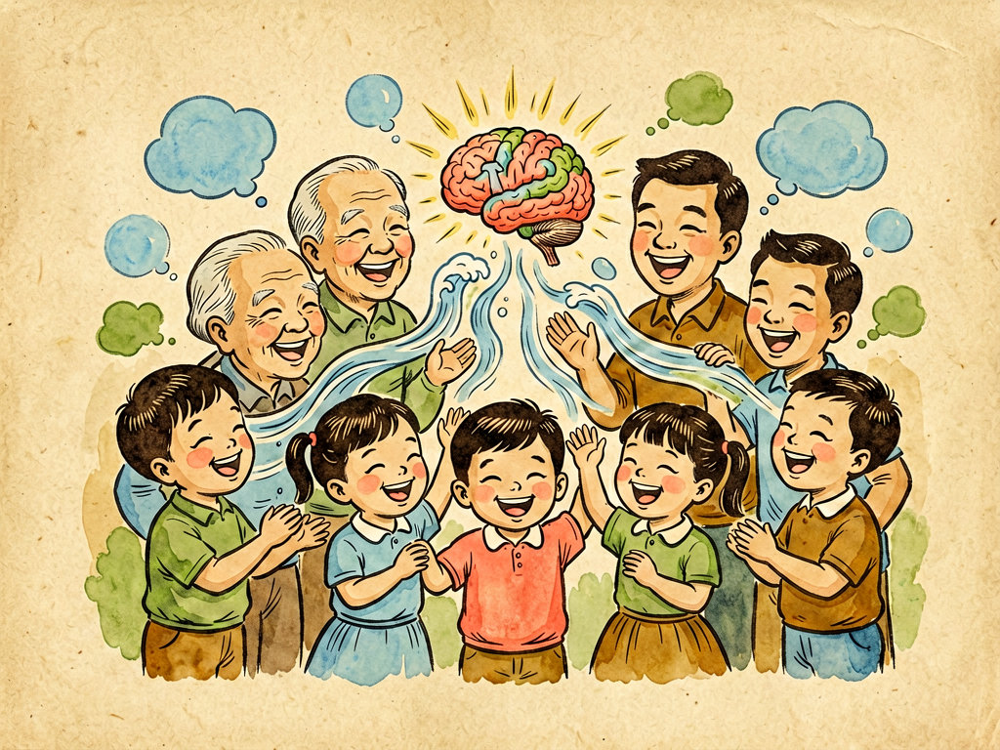

# 第三部 科学与文明
## 第二十九章 笑

---

### 📍 本章导航
**核心主题**：我们每天都会笑很多次——听到好笑的笑话会笑，见到朋友会微笑，尴尬的时候会苦笑，甚至有时候不知道为什么就跟着别人一起笑。笑是我们最熟悉的表情，但是你有没有认真想过：人为什么会笑？笑的时候我们的身体到底发生了什么？为什么笑会传染？笑只是表达开心吗？笑对我们的健康真的有好处吗？这一章我们就用科学的眼光，好好研究一下"笑"这件看起来最平常、却又最复杂的事。  
**你将发现**：
- 笑不是简单的"开心"，它是一个涉及大脑、面部肌肉、呼吸系统的全身运动
- 笑有很多种：真诚的笑、礼貌的笑、尴尬的笑、冷笑、嘲笑，它们的肌肉运动模式都不一样
- 笑是人类最重要的社交语言之一——很多时候笑不是因为开心，是为了和别人拉近距离、缓和气氛
- 笑真的会传染，这是因为我们大脑里有专门的"镜像神经元"在起作用
- 笑对健康确实有好处，能减压、增强免疫力、缓解疼痛，但它不是万能药，不能代替治疗
- 一个社会里人们是不是经常自然地笑，能反映出这个社会的宽松程度和文明程度

**阅读建议**：读这一章的时候，你可以观察一下身边的人——看看家人、同学、老师在不同情况下笑的时候是什么样子，眼睛有没有弯，面部肌肉是怎么动的，笑声有什么不同。你会发现，原来笑里藏着这么多学问。

---

### 🖋️ 经典原文

我们讲了这么多严肃的科学知识，今天我们来讲一件轻松的事——笑。
笑是我们每个人都会做的事。小婴儿刚生下来几个星期就会在睡梦中笑，两三个月大就会对着爸爸妈妈咯咯笑；小孩子每天要笑几百次；就算是最严肃、最不爱笑的大人，一天也总会笑上几次。笑太常见了，常见到我们几乎不会去想：人为什么会笑？笑的时候我们的身体到底在做什么？笑除了表示开心，还有什么用？
很多人觉得笑就是"开心了就嘴角往上扬"，这有什么好讲的？其实你们错了——笑是一件非常复杂、非常有意思的事，它横跨了生理学、心理学、社会学，甚至和我们人类作为社会性动物的本质都有关系。今天我们就来好好聊聊笑这件事。

---

首先我们从生理上讲讲，笑的时候你的身体到底发生了什么。
很多人以为笑就是脸上动一动，错了——笑是一个**全身参与的协调运动**。
我们先看脸上：你笑的时候，脸上有十几块肌肉一起动。最明显的是**颧大肌**——这块肌肉从你颧骨连到嘴角，一收缩就把嘴角往上拉；如果是真心的大笑，你眼睛周围的**眼轮匝肌**也会收缩，眼睛会眯起来，眼角会出现皱纹——这就是我们常说的"笑纹"。
划重点：**真笑和假笑的区别就在眼睛上**。如果一个人只是客气地对你笑一笑，他只有嘴角动，眼睛是不会弯的；如果他是真的觉得好笑、真的开心，他的眼睛一定会跟着笑，眼角会皱起来——这是很难假装的。这个现象是19世纪法国医生杜乡发现的，所以真心的笑也叫"杜乡微笑"。
除了脸上的肌肉，笑的时候你的**呼吸系统**变化更大：你的横膈膜和胸部肌肉会一阵一阵地收缩，把肺里的空气有节奏地快速压出来，通过喉咙、声带，就发出了笑声——"哈哈哈""咯咯咯""嘿嘿嘿"，不同的笑声就是气流振动方式不一样造成的。笑得特别厉害的时候，你会喘不上气、会咳嗽、会肚子疼，甚至会笑出眼泪——那是因为笑的时候你的泪腺也会受到挤压，眼泪就流出来了。
如果笑得再厉害一点，你全身的肌肉都会参与进来：你会前仰后合、会拍桌子、会跺脚、会捂着肚子蹲在地上，整个人都笑成一团——这就是为什么我们形容大笑叫"捧腹大笑"，因为肚子上的肌肉都笑疼了。
而指挥这一切的，是你的**大脑**。当你看到、听到、想到好笑的事情时，你的大脑会先处理这个信息，判断它是不是有趣、是不是安全，然后激活奖赏系统，分泌多巴胺让你感到愉悦，同时发出信号指挥面部肌肉、呼吸肌肉协调运动，你就笑出来了。这个过程快到只有几分之一秒，你自己根本意识不到。
你看，就这么一个简单的笑，要调动大脑、神经、十几块面部肌肉、呼吸肌、胸腹部肌肉一起工作——这可不是随随便便就能做出来的动作。

---

讲到这里，肯定有人说："我知道啊，笑就是开心嘛！遇到高兴的事就笑，这有什么好说的？"
那我问你：你见到不太熟的人，会礼貌地微笑，你那时候是真的特别开心吗？你不小心摔了一跤，爬起来的时候会尴尬地笑一笑，那是开心吗？别人讲了个冷笑话，一点都不好笑，你还是会陪着笑两声，那是开心吗？甚至有的人在紧张、害怕的时候也会笑。
笑远远不只是表达开心——它是人类进化出来的**最重要的社交工具**，是我们不用说话就能互相交流的语言。
我给你们数数笑都有哪些功能：
第一，**表达友好和安全**。你见到陌生人的时候，如果对方对你笑一笑，你马上就会觉得"这个人没有恶意，是友好的"；如果对方面无表情甚至皱着眉，你就会紧张、会警惕。在原始社会，我们的祖先就是靠笑来告诉对方"我不是来打架的，我们可以和平相处"——这个功能一直保留到今天。微笑就像一张"我是好人"的名片，比说十句"我没有恶意"都管用。
第二，**缓和气氛，化解尴尬和冲突**。两个人吵架，气氛很紧张，如果其中一个人先笑了，或者说了句好笑的话，两个人都笑了，气氛马上就松下来了，架就吵不下去了；你说错话了、做错事了，不好意思地笑一笑，别人往往也就不那么生气了。笑是人际关系的润滑剂，很多矛盾、尴尬、紧张，笑一笑就过去了。
第三，**拉近距离，建立连接**。一群人在一起，如果大家一起笑了，马上就会觉得彼此亲近了很多。你和朋友之所以是朋友，很重要的一个原因就是你们能聊到一起、笑到一起；情侣之间、家人之间，如果经常一起笑，关系一定会更亲密。笑能快速消除人和人之间的距离感，让大家变成"一伙的"。
第四，**释放压力，调节情绪**。你遇到特别难的事、特别紧张的时候，笑一笑，哪怕是苦笑，也会觉得压力小一点；你考试之前紧张，和同学开个玩笑笑一笑，就不那么慌了。笑是我们身体自带的"减压阀门"。
甚至还有负面的笑：冷笑、嘲笑、讥笑——这种笑不是为了友好，是为了表示轻蔑、排斥、贬低别人，把别人排除在群体之外。这种笑非常伤人，比骂一句还让人难受。
你看，笑的功能这么多，开心只是其中一种而已。有科学家统计过，我们日常生活中只有大概10%-20%的笑是因为真的遇到了特别好笑的事，剩下80%以上的笑都是社交性的——用来打招呼、用来客气、用来缓和气氛、用来和别人搞好关系。
从这个角度说，会笑、懂笑、知道在什么场合该怎么笑，是情商非常重要的一部分。

---

笑还有一个非常有意思的特点：它**会传染**。
你们肯定都有过这种经历：明明一点都不好笑，但是看到别人在笑，你就忍不住也跟着笑；上课的时候老师在讲课，突然有一个同学笑出了声，然后全班都跟着笑起来，连老师都忍不住笑，虽然根本不知道在笑什么；看喜剧节目的时候，背景音里有笑声，你就会觉得节目更好笑；小婴儿什么都不懂，但是你对着他笑，他也会对着你笑。
为什么笑会传染？现在科学家发现，这是因为我们大脑里有一种特殊的神经细胞，叫做**镜像神经元**。这种神经元的作用就是：当你看到别人做某个动作、有某个表情的时候，你大脑里负责做同样动作、有同样表情的神经元也会被激活，就好像你自己在做这个动作一样——就像你看到别人打哈欠，你也会跟着打哈欠；看到别人疼，你也会觉得疼；看到别人笑，你也会忍不住想笑。
镜像神经元是我们人类能互相理解、产生共情、学会模仿的基础——小宝宝学大人说话、学大人做表情，就是靠镜像神经元；我们能感受到别人的情绪、能替别人难过、替别人开心，也是靠镜像神经元。笑的传染性，本质上就是我们大脑的"共情开关"被打开了。
而且笑的传染是不分国界、不分文化的——不管你是中国人、美国人、非洲人，你笑的表情都是一样的，你看到别人笑都能明白那是友好、是开心，不需要翻译。笑是全人类共同的语言。
科学家做过实验：哪怕是刚刚生下来就看不见、听不见的盲聋孩子，开心的时候也会笑——这说明笑不是学来的，是我们天生就会的本能，是刻在我们基因里的能力。

---

大家常说"笑一笑，十年少"，笑真的对健康有好处吗？
确实有好处，而且好处还不少：
第一，**笑能减压，让你心情变好**。笑的时候你的大脑会分泌**内啡肽**——这是我们身体自带的"快乐激素"，能缓解疼痛、让你感到愉悦，还能降低压力激素皮质醇的水平。所以心情不好的时候，看个笑话、看个喜剧，笑一笑，真的会觉得轻松很多。
第二，**笑是很好的运动**。大笑的时候你心跳会加快、呼吸会加深、胸腹部肌肉会运动，相当于给你的内脏做按摩，能促进血液循环、增强心肺功能——虽然不能代替跑步游泳，但也是一种轻度的运动。有研究说，大笑100次相当于骑了15分钟自行车的运动量。
第三，**笑能增强免疫力**。压力大的时候我们的免疫力会下降，而笑能降低压力激素，还能促进身体分泌抗体和免疫细胞，让你更不容易生病。有科学家做过实验，看喜剧片笑过之后，人血液里的免疫细胞数量会明显增加。
第四，**笑能缓解疼痛**。前面说了，笑的时候大脑会分泌内啡肽，这是一种天然的止痛剂，能提高你对疼痛的耐受力——这就是为什么有时候你疼得厉害，但是有人逗你笑一笑，你会觉得好像没那么疼了。
第五，**笑能让你更受欢迎、人际关系更好**。大家都喜欢和爱笑的人在一起，没有人喜欢整天愁眉苦脸、冷冰冰的人。经常笑的人朋友更多、家庭关系更和睦、工作中也更容易得到机会——这些社会支持反过来又会让你更健康、更长寿。
你们知道吗？有很多研究都发现，爱笑的人、经常有积极情绪的人，确实更长寿，心血管疾病的风险也更低。这不是什么迷信，是有科学依据的。
但是我必须说清楚：**笑不是万能药，不能包治百病**。你真的得了病，该看医生看医生，该吃药吃药，不能靠"多笑笑"治病；如果一个人长期抑郁、不开心，那不是"多笑笑"就能解决的，需要专业的心理帮助。我们不能对一个正在经历痛苦、正在生病的人轻飘飘地说"没事，笑一笑就好了"——这不仅没用，还会让对方觉得不被理解。
笑是健康的"助力"，不是"替代品"。

---

有意思的是，笑不是人类独有的——很多动物也会笑。
科学家发现，黑猩猩、大猩猩这些我们的近亲，在玩耍、被挠痒痒的时候，会发出类似笑声的声音，表情也和我们笑的时候很像；甚至老鼠、狗这些动物，在玩得开心的时候也会发出特殊的、表示开心的叫声——也就是说，笑的起源比我们人类还要早，它是在几千万年的进化中慢慢形成的，最早就是用来表示"现在很安全、我们是在玩，不是在打架"，让玩耍能顺利进行，不会真的打起来。
但是人类的笑比动物的笑复杂得多——动物的笑几乎都是在玩耍的时候才会有，而人类把笑发展成了一套复杂的社交信号系统，有了这么多种不同的笑，有了这么多不同的意思。这也是我们人类比其他动物更擅长合作、更擅长社交的原因之一。
笑也是会成长的：小婴儿刚生下来的笑是无意识的，可能只是肌肉抽动；两三个月的时候会对着熟悉的人笑，那是社交性微笑的开始；一两岁的孩子会因为简单的游戏——比如躲猫猫——笑个不停；再大一点，他们能听懂笑话了，会因为语言的幽默笑；长大之后，我们会学会礼貌的笑、尴尬的笑、善意的玩笑，甚至会学会分辨哪些笑是真心的，哪些笑是假的。一个人怎么笑、为什么笑、会不会在合适的场合笑，其实也是他成熟的标志。
一个社会也是一样的：如果一个社会里的人都很紧绷、不敢笑、整天愁眉苦脸，大家都很压抑，那这个社会一定有问题；如果一个社会里大家能经常发自内心地笑，能开得起玩笑，能容忍幽默和轻松，说明这个社会比较宽松、比较安全、人们的生活比较幸福。笑就像社会的温度计——笑声多的地方，温度总是更温暖一些。
我希望我们的家庭、我们的学校、我们的社会，能多一点真诚的笑声，少一点压抑、少一点紧张、少一点假笑。我希望每个孩子都能在充满笑声的环境里长大——不是说要整天嘻嘻哈哈不认真，而是该认真的时候认真，该笑的时候能放开了笑。会认真做事，也会开心笑，这样的人才是健康的人，这样的社会才是健康的社会。

---

最后我想跟你们说：我们的生活里不可能永远都是开心的事，总会遇到困难、遇到挫折、遇到难过的事，但是只要我们还能笑，就说明我们还没有被困难打倒。
笑不需要花钱，不需要复杂的条件，它是我们每个人与生俱来的能力，是我们随身携带的礼物。你对别人笑一笑，别人也会对你笑；你给别人带去快乐，你自己也会得到快乐。
所以啊，不妨多笑一笑——不是为了"十年少"，也不是为了什么别的好处，就是因为笑本身就是一件很好的事。你笑起来的样子，真的很好看。

---

> 📜 **科学史话：人类对笑的研究**
>
> 笑虽然人人都会，但是科学地研究笑，其实只有不到两百年的历史。
>
> **最早研究笑的生理学家**。19世纪法国医生杜乡·德·布洛涅是第一个系统研究笑的面部肌肉的人。他用电极刺激人脸上不同的肌肉，看看哪些肌肉收缩会产生什么表情。他发现，真心的笑容不仅会动嘴角，还会动眼睛周围的肌肉——这块肌肉是没法靠意识主动控制的，只有真的开心的时候它才会收缩。为了纪念他，真心的笑就被叫做"杜乡微笑"。
>
> **达尔文的研究**。1872年，达尔文写了一本很有名的书叫《人类和动物的表情》。他在书里研究了笑和其他表情，发现笑是全人类共有的，甚至在动物身上也能找到类似的行为，说明表情是进化出来的，有生存和社交的功能，而不是后天学来的。这本书第一次从进化的角度解释了笑的起源。
>
> **心理学和神经科学的进展**。到了20世纪，心理学家开始研究笑在社交中的作用，发现大部分笑都不是因为好笑，而是社交信号。后来随着脑科学的发展，科学家发现了大脑里的奖赏回路、镜像神经元，终于搞清楚了笑的大脑机制和为什么笑会传染。
>
> **笑疗的兴起**。20世纪70年代，美国记者诺曼·卡曾斯得了一种很难治的结缔组织病，医生说他康复的概率只有五百分之一。他自己搬出医院，住到旅馆里，每天看喜剧片、读笑话书，大笑个不停，结果他的病居然慢慢好了。他把自己的经历写成了《疾病的解剖》这本书，提出了"笑是最好的药"这个说法，引起了很大反响。之后越来越多的科学家开始研究笑对健康的作用，甚至出现了"笑瑜伽"这种特殊的运动——一群人在一起故意大笑，最后真的会变成真心的笑，来达到减压的效果。
>
> 到今天，对笑的研究已经成了一个跨学科的领域，涉及神经科学、心理学、社会学、人类学、医学——我们对这个最常见的表情，了解得越来越多了。

---

> 🔬 **科学更新：关于笑的最新发现**
>
> 最近二三十年，科学家对笑又有了很多新的发现。
>
> **笑真的能止痛，效果比我们想的强**。最新研究发现，大笑带来的止痛效果，不仅仅是因为心理作用——笑的时候分泌的内啡肽，确实能像吗啡一样作用于大脑的阿片受体，提高疼痛阈值。有实验显示，看了15分钟喜剧、笑过之后，人对疼痛的耐受力能提高10%左右。
>
> **婴儿的笑是最早的社交工具**。最新的发展心理学研究发现，小婴儿三四个月大的时候就已经会熟练地用微笑和大人互动了——他们会对着妈妈笑，等妈妈回应，如果妈妈不笑，他们会笑得更卖力，如果妈妈还是没反应，他们就会哭。也就是说，婴儿的笑不是无意识的，他们是在主动用笑建立和照顾者的连接，这是他们最早的社交技能。
>
> **不同的笑有不同的大脑激活模式**。现在用功能性核磁共振扫描大脑发现，真心的笑和假笑激活的脑区是不一样的：真心的笑会激活大脑深部负责情绪奖赏的区域，而假笑只会激活负责运动控制的皮层。别人的笑是真心还是假意，你的大脑其实在你意识到之前就已经判断出来了——这就是为什么有时候你明明觉得对方在笑，但是你就是觉得不舒服，觉得他"假惺惺"。
>
> **夫妻之间一起笑，婚姻更幸福**。有心理学家做了长达几十年的追踪研究，发现判断一对夫妻能不能长久在一起的最好指标之一，就是他们会不会一起笑——尤其是在遇到矛盾、困难的时候，能不能用幽默和笑声化解紧张。能一起笑的伴侣，离婚率显著更低，对婚姻的满意度也更高。
>
> **笑声的性别差异**。研究发现，男性和女性的笑有不一样的模式：女性笑的频率比男性高，尤其是在男性面前；而男性更爱讲笑话，是逗笑的一方。这个差异有进化上的原因——在原始社会，幽默是男性展示智慧、吸引伴侣的方式，而女性的笑是表示"我对你感兴趣，你很有趣"。当然，这只是统计上的趋势，不是说每个人都必须这样。
>
> 笑里藏着的秘密，比我们想象的多得多。

---

> 🌍 **现实连接：生活中的笑与幽默**
>
> 了解了笑的科学，我们在生活中可以怎么用呢？
>
> **先从多微笑开始**。每天出门对邻居、对保安、对同学老师笑一笑，你会发现别人也会对你更友好，你的心情也会变好。当然，不是要你假笑，而是带着善意的、放松的微笑——这个简单的小动作，能让你的人际关系顺畅很多。
>
> **学会用幽默化解矛盾**。和家人吵架、和同学闹矛盾的时候，不要一直硬邦邦地讲道理，适当开个小玩笑，或者先笑一笑，气氛松下来了，问题就好解决了。当然，幽默不是挖苦别人、不是拿别人的痛处开玩笑——真正的幽默是善意的，是让大家都开心，不是让某个人难堪。
>
> **不要拿笑去伤害别人**。嘲笑、讥笑、起哄式的笑，是非常伤人的，尤其是在校园里——被很多人一起嘲笑，对孩子的心理伤害是非常大的，甚至会留下一辈子的阴影。我们不要做那个嘲笑别人的人，当别人被嘲笑的时候，也不要跟着笑，站出来说一句"这有什么好笑的"，是非常勇敢、非常善良的行为。
>
> **心情不好的时候，主动找点笑料**。考试没考好、工作压力大、遇到难过的事，不要一个人憋着——找个喜剧片看看、找个幽默的朋友聊聊天、看看搞笑的视频，让自己笑一笑，你会发现事情没有你想的那么糟，你又有力气继续往前走了。
>
> **允许孩子笑，不要总说"严肃点"**。很多家长和老师总喜欢让孩子"别笑""严肃点"，觉得孩子嘻嘻哈哈就是不认真。其实孩子笑不是捣乱，是他们在学习社交、在释放压力、在发展健康的情绪。只要不是在不该笑的场合，允许孩子笑、和孩子一起笑，不仅不会影响学习，还会让孩子更有创造力、心理更健康。
>
> 记住：爱笑的人运气不会太差——这句话不是迷信，是因为爱笑的人心态更好、人际关系更好、身体更健康，自然更容易把事情做好，遇到困难也更容易挺过去。

---

> 💡 **动手试一试：几个和笑有关的小实验**
>
> **实验1：测试真笑和假笑**
>
> 找几张不同的人笑的照片（可以是杂志上的、网上的，也可以是你自己家人的照片），仔细看他们的眼睛：
> - 真笑的时候，眼角会有皱纹，眼睛会眯起来，下眼睑会往上抬，眼睛是弯的，像月牙一样；
> - 假笑的时候，只有嘴角往上动，眼睛没有变化，眼角没有皱纹，眼神可能还是空的。
>
> 你可以试试对着镜子自己笑：先假笑一下，再想一件真的很好笑的事真心笑一下——看看区别在哪里。多练几次，你就能很容易分辨出别人是真笑还是假笑了。
>
> **实验2：体验笑的传染性**
>
> 找一个朋友或者家人，站在他对面，什么都不说，就对着他哈哈大笑——看看他会不会忍不住跟着你笑。大部分人只要你笑得够真、够有感染力，坚持不了半分钟就会跟着笑起来，哪怕根本不知道在笑什么。这就是镜像神经元在起作用。
>
> **实验3：统计一下你一天笑多少次**
>
> 找一天，从早上起床到晚上睡觉，数一数你一天一共笑了多少次，都是因为什么笑的：是因为真的遇到好笑的事？还是和别人打招呼礼貌地笑？还是尴尬的笑？和多少个人一起笑过？笑完之后你的心情怎么样？
>
> 你可能会惊讶地发现，你一天笑的次数比你想象的多得多，而且大部分笑确实都是社交性的，不是因为真的特别好笑。

---

### 💬 读后思考与讨论

1. 你印象最深的一次大笑是因为什么？当时你和谁在一起？笑完之后是什么感觉？
2. 你有没有过本来一点都不好笑，但是看到别人笑你也忍不住跟着笑的经历？为什么会这样？
3. 你能分清真笑和假笑吗？你觉得什么样的笑最让人舒服？什么样的笑最伤人？
4. 有人说"幽默是最高级的智慧"，你同意吗？会讲笑话、能让别人笑，是不是一种重要的能力？
5. 如果你看到别人被嘲笑，你会怎么做？为什么说嘲笑别人是一种很不好的行为？
6. 有人说"爱笑的人运气不会太差"，也有人说"总笑的人不正经，成不了大事"，你怎么看这两种说法？

### 🔗 关联阅读
- 第二部第一章：《人生七期》→ 了解人一生的心理和生理发展，笑在每个年龄段都有不同的特点
- 第三部第二十三章：《谈寿命》→ 了解影响长寿的因素，积极情绪和笑声确实和长寿有关系
- 第一部第一章：《我的名称》→ 了解细菌和疾病的关系，笑能增强免疫力，帮助我们抵抗病菌
- 第二部第八章：《细菌的衣食住行》→ 了解身体健康的影响因素，心理健康和身体健康是连在一起的
- 第三部第二十八章：《大力宣传戒烟》→ 了解什么是健康的生活方式，好的心情、经常笑也是健康生活的一部分
