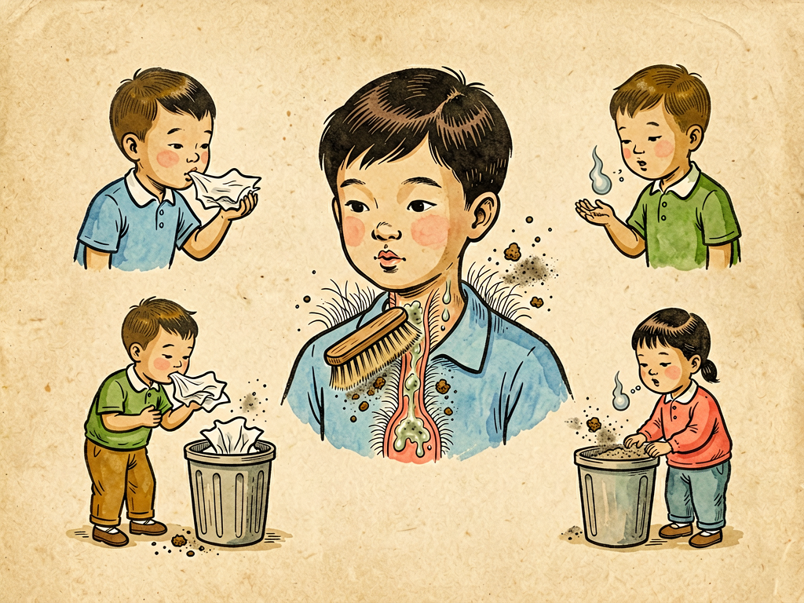

# 第三部 科学与文明
## 第三十章 痰

---

### 📍 本章导航
**核心主题**：今天我们要讲一个听起来有点恶心、但是和每个人健康都息息相关的话题——痰。很多人一听到"痰"这个字就皱眉，觉得这是个脏东西、上不了台面，但是从科学的角度看，痰一点都不脏——它是我们呼吸系统的"清洁报告"，是身体给我们发的健康信号，也是公共卫生里非常重要的一环。为什么会有痰？不同颜色的痰代表什么意思？为什么不能随地吐痰？这一章我们就把关于痰的科学讲清楚。  
**你将发现**：
- 痰不是什么多余的脏东西，它是我们呼吸道自我清洁的产物，是粘住灰尘和病菌的"俘虏"
- 痰的颜色、多少、稀稠，都是身体给我们发的信号，能告诉我们呼吸道出了什么问题
- 咳嗽咳痰有时候是好事，是身体在往外排病菌和脏东西；但痰咳不出来反而很危险
- 一口痰里可能藏着成千上万个病菌，随地吐痰是非常不卫生、非常不文明的行为，会传播很多疾病
- 怎么正确处理痰、怎么观察痰的信号、怎么保持呼吸道健康，是每个人都应该知道的卫生常识

**阅读建议**：这一章讲的内容虽然听起来不太"文雅"，但是非常实用——了解了痰的知识，你不仅能更好地关注自己和家人的健康，还能明白为什么不随地吐痰是最基本的文明习惯。不要因为觉得恶心就跳过，科学从来不会回避真实的生活问题。

---

### 🖋️ 经典原文

讲完了笑，今天我们来讲一个大家可能不太愿意提、但是每个人都免不了要遇到的东西——痰。
很多人一听到"痰"就皱眉头，觉得这东西又脏又恶心，提都不愿意提。但是我今天就要好好讲讲痰——因为这里面不仅有重要的生理学知识、医学知识，还有最基本的公共卫生道理，不讲清楚不行。
我们做科普的，不能只讲那些好听的、好看的、有意思的东西；那些大家觉得脏、觉得恶心、不愿意去想的东西，往往和我们的健康关系最大，更要讲明白。

---

首先我要告诉你们：痰不是什么凭空冒出来的脏东西，它是我们呼吸系统的正常产物，是我们身体自我保护的结果。
你们还记得我们之前讲过呼吸道吗？我们的鼻子、咽喉、气管、支气管，一直到肺，整个呼吸道的内壁都覆盖着一层**黏膜**，黏膜上长满了细细的**纤毛**。黏膜会不停地分泌**黏液**——就是我们平时说的鼻涕、痰的主要成分。
这些黏液有什么用呢？它们就像一层粘蝇纸，我们吸进去的空气里的灰尘、花粉、病菌、pm2.5这些乱七八糟的脏东西，一进到呼吸道，就会被这层黏液牢牢粘住，不让它们进到肺里去。然后那些纤毛就像无数个小扫帚，一刻不停地向上摆动，把这些粘了脏东西的黏液慢慢往上推——推到咽喉的地方，大部分时候我们会不自觉地把它咽下去，进到胃里，胃酸就会把病菌杀死，这没什么大不了的。
但是如果呼吸道受到了刺激——比如感冒了、发炎了、抽烟熏到了、空气太脏了，黏膜就会分泌更多的黏液，而且这些黏液里会混着死掉的免疫细胞、病菌、坏死的组织碎片——这些东西被推上来，我们觉得不舒服，把它咳出来，这就是痰。
所以说，痰是什么？痰是我们呼吸道粘住的灰尘、抓住的病菌、战斗之后牺牲的免疫细胞的尸体——**它是呼吸道打扫战场之后清出来的垃圾，是我们身体打赢保卫战的证据**。你有痰，说明你的呼吸道正在努力工作，正在把入侵的敌人赶出去。从这个角度说，痰一点都不脏，它是我们身体的防御武器。

---

既然痰是身体的"清洁报告"，那我们就能从痰的样子，看出我们的呼吸道出了什么问题。
很多人咳嗽咳痰，根本不注意痰是什么样的，其实不同颜色、不同样子的痰，能告诉我们很多信息，这是医生诊断疾病的重要线索。
我给你们说说常见的几种情况：
- **清白稀痰**：如果痰是白色的、清稀的、有泡沫的，量不太多，那一般是轻微的刺激或者感冒早期、病毒感染，或者是受凉了、空气太干了——这个时候问题不大，多喝点水、休息休息，一般自己就能好。抽烟的人平时经常有一点白痰，是因为烟草长期刺激呼吸道，黏膜一直在分泌黏液，这是在提醒你该戒烟了。
- **黄痰、黄绿色浓痰**：如果痰变成黄色、黄绿色，变得很稠、很厚，那大概率是细菌感染了——这说明你的身体已经派出了大量白细胞（就是我们免疫部队里的"士兵"）去和细菌打仗，痰的黄色就是死掉的白细胞的颜色。这个时候可能是支气管炎、肺炎或者鼻窦炎，需要去看医生，看看要不要用抗生素。
- **铁锈色痰**：如果痰是铁锈一样的棕红色，那是典型的肺炎链球菌感染引起的大叶性肺炎的表现，一定要立刻去医院。
- **粉红色泡沫痰**：如果痰是粉红色的、带着泡沫，同时觉得胸闷、喘不上气、躺不平，那这不是普通的呼吸道问题，很可能是心脏出了问题，引起了肺水肿，这是急症，要马上送医院。
- **痰里带血、咯血**：如果痰里有血丝、血块，甚至直接咳血，那一定要高度警惕——可能是肺结核、支气管扩张，也可能是肺部肿瘤，尤其是长期抽烟的人出现这种情况，绝对不能拖，马上去医院检查。当然，有时候咳嗽太厉害把喉咙咳破了也会有一点血丝，但只要是反复痰中带血，一定要去看医生。
- **黑痰**：如果痰是黑色的、灰黑色的，那可能是吸进去了太多灰尘——比如煤矿工人、经常抽烟的人，或者在雾霾天待久了，痰就会是黑的，这是在提醒你该换个干净的环境，或者戒烟了。
当然，我要提醒你们：**痰的颜色只是一个参考，不能单凭痰的颜色就自己给自己看病**。如果咳嗽咳痰超过一两个星期还不好，或者发烧、胸痛、喘不上气、痰里带血，一定要及时去看医生，不要自己硬扛，也不要自己乱吃药。
学会观察自己的痰，是对自己健康负责的表现。

---

很多人觉得"咳嗽咳痰就是坏事，要赶紧止咳把痰压下去"，这是完全错误的。
咳嗽和咳痰本身不是病，它是**症状**——是身体在告诉你"我的呼吸道里有东西，我要把它排出去"。如果有痰，尤其是有浓痰的时候，你硬用止咳药把咳嗽止住，痰咳不出来，堵在气管和肺里，就成了细菌的培养基地，感染会越来越重，本来只是支气管炎，拖成肺炎，甚至会堵得人喘不上气——对老人、小孩、身体弱的人来说，痰堵在喉咙里是很危险的，严重的甚至会窒息。
所以有痰的时候，正确的做法是**帮助它排出来**，而不是止咳：
- 多喝温水，能把痰稀释，让它更容易咳出来；
- 保持空气湿润，干燥的空气会刺激呼吸道，痰会更稠，用个加湿器，或者在浴室里待一会儿吸点蒸汽，会舒服很多；
- 不要抽烟，也要远离二手烟，烟会把纤毛麻痹，让痰更难排出去；
- 如果是卧床的老人有痰咳不出来，家人要经常给他翻身、拍背——手弯成空心，从下往上轻轻拍后背，帮助痰松动，更容易咳出来；
- 如果痰很稠、很难咳，医生会开化痰的药，或者做雾化，把药变成小雾粒吸进去，稀释痰液，帮助排痰。
记住一句话：**有声有痰的咳嗽不可怕，能咳出来就是好事；咳不动、痰堵在里面喘不上气，才是真的危险**。

---

接下来我们说最重要的一件事：为什么不能随地吐痰？
很多人觉得"我有痰了，不吐出来难受，吐在地上怎么了？多大点事啊？"——说这种话的人，既不懂科学，也不讲文明。
我给你们算一笔账：一个肺结核病人的一口痰里，就有**几亿个结核杆菌**——这是引起肺结核的病菌。你把痰吐在地上，痰干了之后，这些病菌不会死，它们会附着在灰尘上，风一吹就飘到空气里，旁边路过的人吸进去，就有可能被传染上肺结核。除了肺结核，流感、麻疹、白喉、百日咳、肺炎……很多呼吸道传染病，都能通过痰液传播。
你以为你吐的是一口痰，实际上你是在公共场所放了一个细菌炸弹——成千上万的病菌随着灰尘飘来飘去，被老人、孩子、抵抗力弱的人吸进去，让他们生病。
在过去卫生条件差的时候，肺结核是绝症，就是"痨病"，十痨九死，很大一部分原因就是大家随地吐痰，病菌到处传播。后来我们国家花了很大力气宣传不要随地吐痰，肺结核的发病率才慢慢降下来——就是这个道理。
而且随地吐痰本身就是非常不文明的行为：干干净净的马路、地板，一口痰吐在上面，又恶心又难看，别人踩上去还会带到别的地方，污染整个环境。
那有痰了应该怎么办？很简单：
- 随身携带纸巾，有痰的时候吐在纸巾里，包好，扔到垃圾桶里；
- 如果在公共场所，有痰盂或者卫生间，可以吐在痰盂里或者马桶里冲掉；
- 吐完痰一定要洗手，不要用手捂嘴咳嗽之后到处摸；
- 如果得了呼吸道传染病，咳嗽咳痰的时候要戴口罩，不要对着别人，避免传染给别人。
需要咳痰不是丢人的事——是人就会生病，就会有痰；但是随地吐痰，把病菌传播给别人，才是真的丢人、真的不文明。
我小时候，到处都能看到"不准随地吐痰"的标语，随地吐痰会被罚款，那时候大家都很注意，现在生活条件好了，这个好习惯反而被很多人忘了——我们一定要把这个好习惯捡起来，不随地吐痰，是对自己负责，也是对别人负责。

---

很多人有个坏习惯：随地吐痰不说，还喜欢吐完之后用脚蹭一下——以为蹭开了就看不见了，就干净了。这是错上加错！
你用脚一蹭，痰干得更快，病菌粘在你的鞋底，你走到哪里带到哪里，整个地面、你家里的地板上都有这些病菌，反而传播得更快、更广。看不见了不代表没有了，那些小到肉眼看不见的病菌，正在你蹭开的地方等着被人吸进去呢。
还有人喜欢把痰咽下去——觉得"反正都是自己身体里的东西，咽下去也没事吧"。少量的、健康的痰咽下去没关系，胃酸会把病菌杀死；但是如果是生病的时候有大量浓痰、里面有很多细菌，最好还是咳出来吐在纸巾里，咽太多病菌到胃里，虽然大部分会被胃酸杀死，但也有可能引起胃肠道不舒服，尤其是有肺结核的病人，痰里的结核杆菌有时候会引起肠结核。
还有家长要注意：小孩子不会咳痰，咳嗽的时候痰咳到嘴里就咽下去了，这是正常的，不用太紧张，咽下去的痰会随着大便排出来，不会有太大问题——不要因为孩子咽痰就骂他，关键是帮他把痰稀释，让它容易咳出来或者咽下去。

---

最后我们说说，怎么才能减少痰、保持呼吸道健康？
第一，**不要抽烟，远离二手烟三手烟**。抽烟是刺激呼吸道、让痰变多的最主要原因——我上一章刚讲过吸烟的危害，抽烟的人天天咳嗽咳痰，就是因为呼吸道被烟草长期刺激，黏膜一直在发炎，纤毛被破坏了，痰排不出去，天天咳。戒烟是最好的化痰药，戒了烟之后，你会发现痰少了很多，也不怎么咳嗽了。
第二，**多喝水，保持呼吸道湿润**。尤其是干燥的季节，多喝温水，家里用加湿器，不要让空气太干，黏膜就能正常工作，痰也不会太稠。
第三，**在空气污染的时候做好防护**。雾霾天、沙尘天尽量少出门，出门戴口罩，减少灰尘和脏东西吸进呼吸道，痰自然就少了。
第四，**多运动，增强免疫力**。经常运动的人，心肺功能好，呼吸道的抵抗力强，不容易被感染，也就不容易有痰。
第五，**生病的时候好好休息，及时看医生**。感冒、支气管炎的时候好好休息，多喝水，有问题及时看医生，不要拖成慢性的——如果变成慢性支气管炎，就会天天咳嗽咳痰，一辈子都好不了。

---

总结一下，关于痰我们要记住三句话：
第一，**不要怕痰，也不要嫌痰恶心**——它是我们呼吸道的防御产物，是身体的清洁报告，学会观察它，能帮我们及早发现疾病；
第二，**有痰不要硬止咳**——要想办法把它排出来，咳出来，堵在里面反而更危险；
第三，**绝对不要随地吐痰**——这不仅是文明习惯，更是预防呼吸道传染病最重要的公共卫生措施，一口痰传播的病菌，可能会害了很多人。
我希望你们读完这一章之后，不仅自己不要随地吐痰，看到别人随地吐痰的时候，也能勇敢地提醒他们——这不是多管闲事，是在保护我们共同的环境、共同的健康。
文明不是什么惊天动地的大事，文明就在这些小事里：不随地吐痰，咳嗽捂嘴，把痰吐在纸巾里包好扔到垃圾桶——这些小小的动作，就能让我们的环境更干净，让大家更健康，这就是文明。

---

> 📜 **科学史话：公共卫生史上的吐痰问题**
>
> 随地吐痰不是中国人特有的习惯——在一百多年前，全世界不管是欧洲还是美国，随地吐痰都是非常普遍的事，因为那时候肺结核在全世界大流行，大家都随地吐痰，病菌到处传播，每年有几百万人死于肺结核。
>
> **结核瘟疫**。19世纪，肺结核是欧洲和北美头号死因，四分之一的欧洲人死于肺结核——那时候大家不知道这种病是怎么传染的，以为是遗传、是"体质不好"，直到1882年德国科学家科赫发现了结核杆菌，大家才知道肺结核是传染病，而且主要通过病人咳嗽、吐痰产生的飞沫和尘埃传播。
>
> **反吐痰运动**。这个发现之后，从20世纪初开始，全世界掀起了一场声势浩大的"反吐痰运动"：政府到处张贴"不要随地吐痰"的标语，在公共场所放痰盂，随地吐痰会被重罚，卫生工作者到处宣传吐痰的危害，教大家用手帕、纸巾包痰液。这场运动非常有效——仅仅几十年时间，随地吐痰从一个人人都做的"正常事"，变成了不文明、不卫生的行为，肺结核的发病率也下降了一大半。这是公共卫生史上最成功的运动之一，证明了改变一个小小的坏习惯，就能拯救几百万人的生命。
>
> **中国的爱国卫生运动**。新中国成立之后，我们国家也把"不随地吐痰"作为爱国卫生运动最重要的内容之一——50年代到80年代，全国各地到处都能看到"不准随地吐痰"的标语，学校、单位、街道反复宣传，随地吐痰会被罚款、被批评。那时候虽然大家生活条件不好，但是城市里干干净净，呼吸道传染病的发病率下降很快。
>
> **痰盂的历史**。几十年前，几乎每个家庭、每个办公室、每节火车车厢里都有痰盂——就是专门用来吐痰的容器，大家有痰就吐在痰盂里，不会随地吐。后来有了纸巾，痰盂慢慢消失了，但是"不要随地吐痰"这个好习惯，我们不应该丢掉。
>
> 从人人随地吐痰，到把不随地吐痰当成文明常识，这是人类用几百万人的生命换来的卫生经验，我们不能忘记。

---

> 🔬 **科学更新：关于痰液和呼吸道健康的新知识**
>
> 最近这些年，我们对痰和呼吸道健康有了更多新的认识。
>
> **痰检能查肺癌**。现在科学家发现，不光是查细菌，痰里还能找到癌细胞、肺癌的基因突变——未来我们可能只需要咳一口痰做化验，就能早期发现肺癌，不用做那么痛苦的气管镜或者穿刺，这对肺癌的早筛早治非常有意义。
>
> **慢性咳嗽和痰的新原因**。现在很多人长期咳嗽、有白痰，不是感冒也不是支气管炎，而是因为胃食管反流（胃酸反上来刺激喉咙）、过敏、鼻后滴漏（鼻涕流到喉咙里），或者是气道高反应——这些问题用抗生素没用，要找到原因对症治疗才有用。
>
> **气溶胶传播比尘埃传播更危险**。以前我们说痰干了之后病菌随灰尘传播，现在发现更危险的是咳嗽、咳痰、说话的时候喷出来的**飞沫和气溶胶**——尤其是很小的气溶胶颗粒，能在空气中飘几个小时，被人吸到肺里，传播新冠、流感、肺结核这些呼吸道传染病。所以不光不能随地吐痰，咳嗽打喷嚏的时候还要用纸巾或者手肘捂住嘴，戴口罩，这些都是切断传播的重要方法。
>
> **不要随便用化痰药**。现在很多人一有痰就自己买化痰药吃，其实大部分时候多喝水、保持空气湿润就够了，化痰药只是辅助，真正要治的是引起痰多的原因——感染了就抗感染，过敏了就抗过敏，抽烟的就戒烟，不解决根本问题，吃再多化痰药也没用。
>
> **正确的咳嗽方式**。现在医生都建议，咳嗽或者打喷嚏的时候，不要用手捂，要用手肘弯或者纸巾捂住——因为用手捂的话，病菌会沾在手上，你摸门把、摸电梯按钮，会把病菌传给别人；用手肘捂的话，手肘不容易碰到别的东西，传染的概率小很多。当然，最好的方式还是用纸巾捂，用完把纸巾扔了洗手。
>
> 呼吸道健康是我们身体健康的第一道防线，把好这一关，很多病都能预防。

---

> 🌍 **现实连接：从一口痰看文明习惯**
>
> 不随地吐痰这件事，说小很小，说大很大——它是观察一个社会文明程度最简单的窗口。
>
> **为什么很多人还是会随地吐痰？** 除了旧习惯难改，还有几个原因：一是很多人真的不知道一口痰里有多少病菌，觉得"我吐一口怎么了"；二是很多人觉得"反正有清洁工打扫"——但是清洁工打扫的是看得见的痰迹，看不见的病菌已经飘走了；三是觉得大家都吐，我一个人不吐也没用——这是错的，你不吐，我不吐，大家都不吐，环境自然就干净了。
>
> **现在很多地方已经做得很好了**。在一线城市、在年轻人里，随地吐痰的人已经越来越少了，大家都习惯带纸巾、把痰吐在纸巾里扔垃圾桶。但是在一些地方、在一些年纪大的人里，这个坏习惯还很普遍。改变习惯需要时间，更需要我们每个人从自己做起，也提醒身边的人。
>
> **比不随地吐痰更重要的是尊重别人的健康权**。不随地吐痰，本质上是"我做任何事都不能损害别人的利益"——你有痰不舒服要吐，这是你的权利，但是你不能因为自己舒服，就把病菌传播给别人，就让别人走在马路上要小心踩到痰。公共空间是大家的，每个人都有责任维护它的干净和安全。
>
> **这些卫生习惯其实是连在一起的**：不随地吐痰、咳嗽捂嘴、勤洗手、感冒戴口罩、不乱扔垃圾——这些看起来不起眼的小习惯，加在一起就是一个社会的公共卫生水平，就是每个人的健康保障。新冠疫情之后，很多人都养成了戴口罩、勤洗手、咳嗽捂嘴的好习惯，这是很大的进步，我们要把这些好习惯保持下去。
>
> 文明不是喊口号，是具体的行动——你每次把痰吐在纸巾里包好扔进垃圾桶，你就是在做一件文明的事，就是在为大家的健康做贡献。

---

> 💡 **动手试一试：观察和体验小实验**
>
> **实验1：观察纤毛摆动（模拟实验）**
>
> 你可以在家做个简单的实验，模拟呼吸道纤毛怎么把痰推出去：
> 1. 找一块毛茸茸的毛巾或者旧毛衣，平放在桌子上，毛绒朝上——这就像我们呼吸道壁上长满纤毛的黏膜；
> 2. 在毛巾的一端放几个小纸团或者米粒——这就像粘了脏东西的痰；
> 3. 用手指轻轻从下往上拨动毛巾上的毛，你会看到小纸团慢慢被推着往上走——这就是纤毛摆动，一点一点把痰往上推，最后推到喉咙里咳出来或者咽下去。
>
> 你看，我们的呼吸道就是这样一刻不停地工作，把脏东西运出去——如果抽烟或者有炎症，纤毛被毒倒了、不动了，脏东西运不出去，就会一直咳嗽、一直有痰。
>
> **实验2：看看雾霾天的痰是什么颜色**
>
> 如果遇到雾霾天或者沙尘天，出门戴口罩，回来之后看看口罩内侧，再留意一下你咳出来的痰——你会发现口罩上会有灰黑色的脏东西，痰也可能会有点发黑。这就是空气里的灰尘和pm2.5被口罩和呼吸道黏膜拦下来了。这个实验能让你直观地看到我们每天吸进去多少脏东西，也能明白为什么雾霾天要戴口罩、为什么不能抽烟。
>
> **实验3：准备随身纸巾，做一周"文明小卫士"**
>
> 试着随身带一包纸巾，坚持一周：有痰的时候吐在纸巾里包好扔垃圾桶，咳嗽打喷嚏的时候用纸巾捂住嘴，用完纸巾洗手。你自己做到之后，再提醒你的爸爸妈妈、爷爷奶奶也这么做，看到有人随地吐痰的时候，礼貌地告诉他们这样不卫生。
>
> 坚持一周，你会发现这其实一点都不难，而且你会为自己能维护公共环境感到开心。

---

### 💬 读后思考与讨论

1. 为什么说痰不是脏东西，而是身体的防御产物？我们能从痰的哪些特征看出身体的健康状况？
2. 有痰的时候为什么不能硬止咳？正确的排痰方法有哪些？为什么说痰堵在里面比咳出来更危险？
3. 很多人觉得"随地吐痰是小事，多大点事"，你怎么说服他们不要随地吐痰？一口痰到底能带来多大的公共卫生风险？
4. 你在生活中见过随地吐痰的现象吗？你觉得怎么才能让大家改掉这个坏习惯？
5. 除了不随地吐痰，还有哪些看起来很小的卫生习惯，能对公共卫生产生很大的影响？
6. 有人说"文明就是在没人看见的地方也守规矩"，结合吐痰这件事，谈谈你对这句话的理解。

### 🔗 关联阅读
- 第一部第七章：《呼吸道的探险》→ 完整了解我们呼吸道的结构和防御机制，明白痰是怎么产生的
- 第一部第八章：《肺港之役》→ 了解病菌怎么入侵我们的肺，我们的免疫系统怎么和它们战斗，痰里的白细胞就是战斗的证据
- 第二部第十二章：《清水和浊水》→ 了解环境卫生和疾病传播的关系，公共卫生就是从这些小事做起的
- 第二部第十六章：《凶手在哪儿》→ 了解病菌怎么在人群中传播，切断传播路径是预防传染病最有效的方法
- 第三部第二十八章：《大力宣传戒烟》→ 抽烟是引起长期咳嗽咳痰最重要的原因之一，戒烟是保护呼吸道最好的方法
