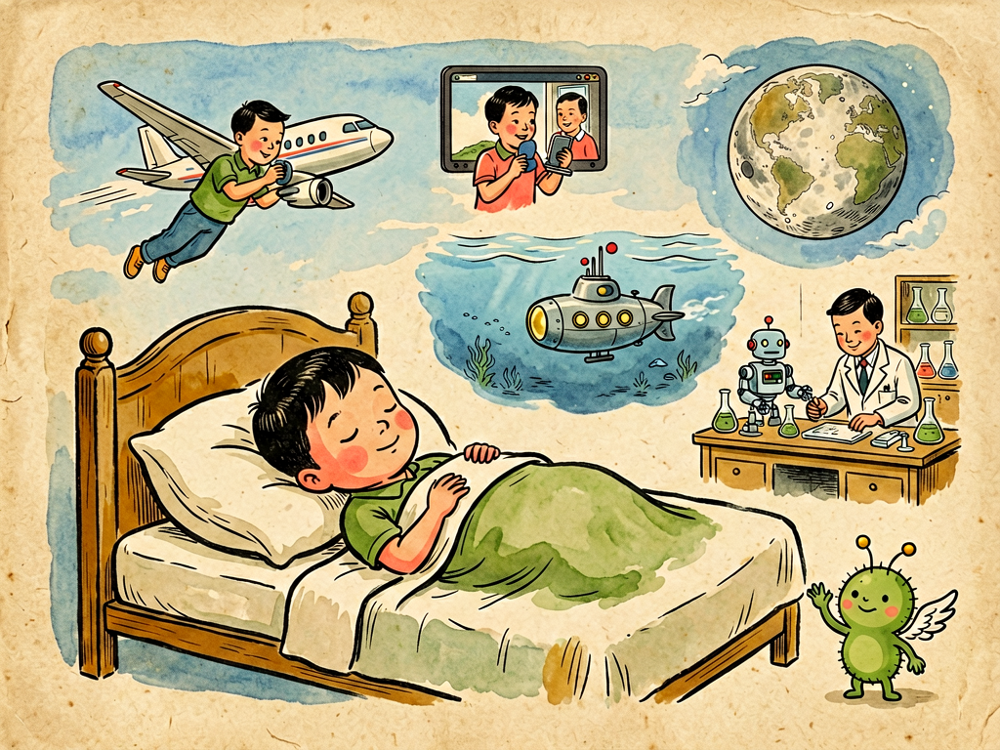

# 第三部 科学与文明
## 第三十一章 梦幻小说

---

### 📍 本章导航
**核心主题**：讲到这里，我们这本《灰尘的旅行》就快要结束了——我们跟着菌儿逛过了微观世界，了解了我们的身体，认识了光、热、电、土壤、海洋，聊了健康、长寿、未来的旅行。今天这最后一章，我们不讲课、不说教，我们来聊一聊"梦"——聊一聊科学和想象的关系，聊一聊为什么科普要讲故事、要打比方、要有幻想，聊一聊我们读科学书，最终要学到的是什么。  
**你将发现**：
- 科学从来不反对想象——恰恰相反，所有伟大的科学发现，一开始都是大胆的"梦"：想飞上天、想和千里之外的人说话、想潜到海底、想登上月亮……这些曾经都是"痴人说梦"，最后都变成了现实
- 但是科学的想象和胡思乱想不一样——科学的梦是有根据的，是要符合规律、接受检验的
- 用故事、比喻、拟人的方法讲科学，不是"不严肃"，而是为了让大家更容易走进科学，让科学变得亲切可爱
- 读科普书，不只是为了记住多少知识点，更是为了保护你的好奇心和想象力，学会用科学的方法去验证你的想法
- 最好的状态是：既敢大胆地想，又会严谨地求证——想象力给你方向，科学方法给你翅膀

**阅读建议**：这一章不是要你背任何知识点，而是想和你聊聊我们为什么要学科学、怎么学科学。读完前面所有章节，再读这一章，你会明白：这本书里讲的所有细菌、细胞、物理、化学知识，最终都是为了让你成为一个既会做梦、又会把梦变成现实的人。

---

### 🖋️ 经典原文

我们讲了一路科学知识——从最小的细菌讲起，讲了细胞、血液、呼吸道，讲了光、热、电、摩擦，讲了镜子、眼镜、衣服、食物，讲了土壤、水、海洋，讲了蜜蜂、庄稼，讲了健康、长寿、未来，还劝大家戒烟、不要随地吐痰。
讲到最后，我想换个轻松的话题，和你们聊聊"梦"，聊聊"梦幻小说"。
很多人觉得科学是冷冰冰的、是讲事实、讲逻辑、讲证据的，和做梦、和小说、和想象没关系——科学家就该板着脸，一就是一、二就是二，不能胡思乱想；写科普就该干巴巴讲知识点，不能讲故事、不能打比方、不能拟人，不然就是"不科学"。
今天我就要告诉你们：这种想法大错特错。没有想象，就没有科学；不会做梦的人，也成不了好的科学家。我写这本《灰尘的旅行》，用细菌的口吻讲故事，把各种微生物拟人化，带你们做了一场又一场科学的"梦"——不是为了好玩，是因为这才是走进科学最好的方式。

---

首先我问你们：现在我们坐高铁几个小时就能跨越大半个中国，拿起手机就能和地球另一边的人视频通话，坐上飞机十几个小时就能飞到另一个大洲，这在一千年前的人看来是什么？
在一千年前的人看来，这就是神话，就是做梦，就是只有神仙才能做到的事。
- 几千年前的人看着天上的鸟，想"要是人也能飞就好了"，那时候所有人都觉得这是痴心妄想——人没有翅膀，怎么可能飞上天？但是因为有人一直做这个梦，一直研究、一直试验，最后莱特兄弟发明了飞机，现在我们所有人都能坐上飞机飞上天；
- 一百多年前，有人想"要是能有一种东西，能让我们和千里之外的人直接说话、甚至看到对方"，那时候大家觉得这是巫术，但是现在手机、视频通话早就成了我们每个人离不开的东西；
- 几百年前，人想"我们能不能潜到海底去看看下面有什么""能不能飞到月亮上去"，那时候这就是纯粹的梦幻小说，但是现在我们有了潜水器能潜到万米深的马里亚纳海沟，我们有了宇宙飞船能把人送上月球，有了探测器能飞到火星、飞出太阳系；
- 甚至连"我们能看见细菌、看见原子"这件事，在三百年前也是不敢想的——那时候人根本不知道世界上还有这么小的东西，但是因为有列文虎克想看看水里到底有什么，磨出了显微镜，我们才打开了微观世界的大门。
你们看，**所有伟大的科学发现、技术发明，一开始都是梦，都是"梦幻小说"**。敢想别人不敢想的东西，敢做别人觉得不可能的梦，这是科学家最宝贵的品质。如果大家都觉得"现在的东西就挺好，想那些不可能的事干嘛"，那我们现在还在山洞里茹毛饮血呢。
但是我要讲清楚：**科学的梦和胡思乱想、和骗人的鬼话是不一样的**。
区别在哪里？
第一，科学的梦是有根据的——它不是完全凭空瞎想，是从已知的事实和规律出发，往前推一步。比如古人想飞，是看到鸟有翅膀能飞，才想到人能不能也做个翅膀飞；我们现在研究基因编辑、研究人工智能、研究可控核聚变，都不是瞎想，是建立在已经掌握的科学规律之上的。完全违背已知规律的梦，比如"永动机""点石成金""长生不老药"，那就不是科学的梦，是妄想。
第二，科学的梦是要接受检验的——你有了一个大胆的想法，不能说完就完了，你要做实验、找证据、算数据，证明你的想法是对的还是错的。如果实验证明你错了，那就大大方方承认，再改；如果证明你对了，那你的梦就从幻想变成了科学知识，变成了能改变世界的技术。
所以说：**没有想象，科学就没有方向；但是没有验证，想象就永远只是梦。** 敢想，还要敢试；会做梦，还要会把梦变成现实。这才是真正的科学精神。

---

讲到这里，肯定有人问：那你写科普书，为什么不直接把知识点列出来给大家背就好了，非要讲故事、非要拟人、非要做这些"梦"呢？
我写了一辈子科普，我知道——干巴巴的知识点是冷的、是硬的，是隔着一层的，大家读起来会觉得累、会觉得没意思、会觉得"科学和我没关系"，翻两页就不想看了。
但是如果把知识包在故事里、放在梦里、用拟人的口吻讲出来，就完全不一样了：
- 我不直接说"细菌是一种微生物，会传播疾病"，而是让菌儿自己开口说话，讲它的来历、它的生活、它怎么到处旅行——你们一下子就记住了，哦，原来细菌是这么回事；
- 我不直接说"呼吸道有纤毛、会分泌黏液挡住病菌"，而是给你们讲"肺港之役"，讲免疫细胞怎么和病菌打仗——你们就像看了一场电影，自然就记住了呼吸道是怎么工作的；
- 我不直接给你们罗列海洋的资源有多少，而是带你们像探险一样去海里逛一圈，看看海洋里有什么宝藏——你们读着有意思，不知不觉就把知识学会了。
故事有什么好处？故事有场景、有人物、有悬念、有情感，它能把抽象的东西变具体，把遥远的东西变亲近，把枯燥的东西变有趣。你看一本小说、看一场电影，里面的情节你可能记一辈子；但是你背的知识点，可能考试完就忘了。
我给细菌起名字，让它们说话、打仗、旅行，不是不科学——是因为这样你们才能看得进去，才能记得住，才能觉得"哦，原来科学这么有意思"。对做科普的人来说，**把知识讲得让人愿意看、看得懂、记得住，和知识本身正确一样重要**。如果一本科普书写得全是公式和术语，除了专家没人看得懂，那它写得再正确也没用——知识锁在书里，到不了大家心里。
而且不只是写科普，你们学习的时候也可以用这个方法：难理解的知识，你可以把它编成故事、打个比方、在脑子里想象成画面——比如把电流想象成水流，把原子想象成太阳系，把细胞想象成一个小工厂，这样一下子就懂了，而且记得特别牢。
很多老师和家长总觉得"学习就是苦的，就要死记硬背，搞那些花里胡哨的故事和想象是不务正业"——这是错的。让人愿意学、学得会、记得牢，才是最好的学习方法。

---

但是我也要提醒你们：**梦幻小说只是桥梁，不是终点**。我讲故事、打比方、做想象，是为了把你们引到科学的门口，不是要你们把比喻当事实，把故事当真。
比如我把菌儿拟人化，让它说话、让它"计划"怎么进攻人体，不是说细菌真的有思想、真的会策划阴谋——细菌只是最简单的单细胞生物，它没有大脑，不会思考，它只是按照本能生存、繁殖。我这么写，是为了你们好理解，你们看完故事，要明白背后真实的科学原理是什么，不能真的以为细菌是个会想坏主意的小坏蛋。
再比如科幻小说里写时间旅行、写外星人、写超光速飞船，这些都是基于现有科学的幻想——它们能激发我们对宇宙的兴趣，能启发科学家的思路，但是它们不是科学事实。我们看科幻的时候要分得清：哪些是已经被证实的科学知识，哪些是有根据的科学设想，哪些纯粹是作者为了好玩编出来的。
有很多伪科学、迷信、骗局，就是打着"科幻""新奇"的旗号骗人的——什么"水变油""量子波动速读""特异功能"，听起来特别像梦幻小说，但是它们没有任何科学根据，也经不起实验检验，这种就不是科学的想象，是骗人的瞎话。
所以我们读故事、读科幻、做白日梦的时候，心里要有一根弦：**想象可以大胆，但是求证必须严谨**。梦做得再美，醒了之后也要回到现实，用事实、用逻辑、用实验去检验它对不对。
会做梦很重要，会醒过来、会分清梦和现实，更重要。

---

我一辈子给孩子、给普通人写科普，我最想保护的是什么？不是你们背了多少知识点、考了多少分，是你们的好奇心和想象力。
小孩子天生就会做梦：他们会问"天为什么是蓝的""星星为什么会闪""小鸟为什么会飞""我能不能变成超人"，他们看到什么都觉得新鲜，什么都想知道，什么都敢想——这就是最宝贵的科学种子。
但是很多人长大之后，这颗种子就死了：他们觉得"这些问题有什么用""反正已经是这样了，想它干嘛""和我没关系"，他们不再好奇，不再做梦，只记得眼前的日子，只相信已经有的东西——这是最可惜的。
我写这本书，就是想保护好你们的好奇心：
- 我带你们去看细菌的世界，是想让你们知道，哪怕是一滴水里、一粒灰尘上，都有一个无比热闹的世界，不是我们眼睛看到的就是全部；
- 我带你们去看细胞、看血液、看我们的身体怎么工作，是想让你们知道，我们自己的身体就是一个最精妙、最神奇的世界，值得我们好好了解、好好爱护；
- 我带你们看光、热、电、土壤、海洋、星空，是想让你们知道，我们生活的这个世界有多奇妙、有多广阔，有太多秘密等着你们去发现；
- 我和你们聊未来、聊长寿、聊大海的宝藏、聊星际航行，是想告诉你们，未来还有无限可能，你们每个人都可以去做梦、去创造、去把那些"不可能"变成现实。
但是光有好奇心和想象力还不够——我还想教给你们**科学的方法**：遇到问题不要光猜、不要光信别人说的，要自己去观察、去做实验、去找证据，要会独立思考，要分得清什么是真的、什么是假的，什么是有根据的、什么是骗人的。
敢做梦，是给你方向；会求证，是给你翅膀。这两个加在一起，你才能飞得高、飞得远。

---

我年轻的时候，因为做实验感染了病毒，一辈子身体不好，大部分时间都只能躺在床上，但是我从来没有停止过做梦，也从来没有停止过写作——我躺在床上，想象自己变成一个细菌，在人的身体里旅行；想象自己跟着灰尘飘到天上，飘到海上；想象未来的世界是什么样子，未来的孩子会过什么样的生活。这些梦陪着我，让我在病床上也能看到整个世界，让我一辈子都没有觉得无聊、没有觉得白活。
我把这些梦写成了文章、写成了书，送到你们面前——现在这些梦到了你们手里。
你们是比我幸运的一代人，你们生在一个科学技术飞速发展的时代，你们有机会看到我当年只能在梦里见到的东西：你们能坐上高铁，能拿着智能手机和全世界的人说话，能看到月球背面的照片，能接种疫苗预防很多以前的绝症。而未来的世界是什么样，未来能实现多少我们今天想都不敢想的梦，要靠你们去创造。
我希望你们读完这本书，不只是记住了"细菌会让人生病""吸烟有害健康""海洋有很多宝藏"这些知识点，我更希望你们：
- 永远保持对世界的好奇，永远敢问"为什么"，永远敢做别人觉得不可能的梦；
- 学会用科学的方法看世界，不迷信、不盲从，会观察、会思考、会验证；
- 懂得尊重自然、尊重生命，爱护我们的身体，爱护我们共同的地球家园；
- 做一个既脚踏实地、又敢仰望星空的人——认认真真生活，同时心里装着更大的世界。

---

好了，我们这趟《灰尘的旅行》，到这里就真的要结束了。
从一滴水里的细菌开始，我们走了很远的路，看了很多风景——但是这只是开始，科学的世界没有尽头，这个世界还有太多太多的秘密等着你们去发现。
书要合上了，但是你们的科学旅行才刚刚开始。
我把想象的翅膀交给你们了——大胆去做梦吧，然后用你们的手，把梦一个一个变成现实。
我们下一段旅程再见。

---

> 📜 **科学史话：科幻和科学的双向奔赴**
>
> 科幻小说看起来是"编故事"，但是它和真实的科学发展一直是互相启发、互相成就的。
>
> **凡尔纳的预言**。19世纪法国科幻作家儒勒·凡尔纳，被称为"科幻小说之父"。他在100多年前写的《海底两万里》里，预言了潜水艇；在《从地球到月球》里，预言了人类登上月球，甚至连发射地点在佛罗里达、飞船名字叫"哥伦比亚号"、溅落在海上这些细节都和后来的阿波罗计划惊人地相似；在《八十天环游地球》里，他想象人能快速环游世界——在他写这本书的时候，这还是个奇迹，现在我们坐飞机绕地球一圈只需要两天。凡尔纳说过："但凡一个人能想到的事，就有另一个人能把它做出来。"很多科学家、发明家都说是小时候读凡尔纳的书，才萌生了搞发明创造的想法。
>
> **从科幻到现实的发明**。你们知道吗？手机的发明者马丁·库珀说，他发明手机最早的灵感来自《星际迷航》里的翻盖通讯器；平板电脑、语音助手、视频通话、3D打印、自动驾驶……这些我们现在已经习以为常的技术，最早都出现在科幻小说里。科学家和工程师小时候看了科幻，觉得"这个东西好酷，我要把它做出来"，然后真的花一辈子去研究，最后就把幻想变成了现实。
>
> **反过来，科学也给科幻提供灵感**。科学家发现黑洞、引力波、系外行星、基因编辑这些新知识，科幻作家马上就会把它们写到故事里，想象这些技术会怎么改变我们的生活，会带来什么好处、什么问题——很多时候科幻作家提出的伦理问题，反过来又会让科学家在做研究的时候更谨慎，思考技术的边界在哪里。
>
> **中国的科幻传统**。我们中国也有很好的科幻传统，高士其先生自己就是中国科普和科幻事业的开拓者之一；后来的叶永烈先生写的《小灵通漫游未来》，是好几代中国人的科学启蒙书，书里写的可视电话、智能手表、转基因食物、空中飞车，现在很多都变成了现实；现在刘慈欣的《三体》更是全世界闻名，让很多孩子爱上了科学、爱上了宇宙。
>
> 好的科幻和最好的梦一样，它不是为了骗你、逃避现实，而是为了让你对未来充满期待，让你愿意去创造一个更好的世界。

---

> 🔬 **科学更新：为什么我们的大脑天生爱故事**
>
> 最近几十年的认知科学研究，终于搞明白了为什么故事比干巴巴的知识点好记、好懂——因为我们的大脑天生就是被设计来听故事的。
>
> **叙事理解是人类的本能**。人类在没有文字的几万年里，知识都是靠讲故事口耳相传的——哪里有猎物、哪种果子有毒、遇到猛兽该怎么办，都是编在故事里传给下一代。所以我们的大脑对故事结构特别敏感：有开头、有发展、有冲突、有结尾的信息，我们理解得更快、记得更牢，因为大脑会自动把信息放到"故事框架"里处理。
>
> **故事能激活更多脑区**。你听干巴巴的知识点的时候，只有大脑里负责语言处理的部分在工作；但是你听故事的时候，你负责情感、负责视觉想象、负责运动感知的脑区都会被激活——就好像你自己真的经历了故事里的事一样。这就是为什么你读小说的时候会哭、会笑、会紧张，因为你的大脑真的"身临其境"了。
>
> **镜像神经元又发挥作用了**。我们之前讲笑的时候提过镜像神经元——你看到别人做动作、有情绪的时候，你的大脑会像自己做了一样激活。听故事的时候也是一样，故事里的人物遇到什么事、有什么感受，你的镜像神经元会让你感同身受。所以通过故事学习，你不仅记住了知识，还产生了情感连接，自然就印象深刻。
>
> **比喻能帮我们理解抽象概念**。认知科学里有个很重要的理论：我们理解所有抽象的概念，都是靠打比方——用我们已经懂的、具体的东西去类比我们不懂的、抽象的东西。比如我们把时间比作"金钱"（花时间、浪费时间），把辩论比作"打仗"（攻击对方的观点、防守），把电流比作"水流"——没有这些比喻，我们根本没法理解复杂的抽象概念。所以打比方、拟人、讲故事，不是科普的"装饰"，它就是我们理解复杂事物的基本方式。
>
> 懂了这个道理，你们以后学习的时候就可以主动用这个方法：把难的知识编成故事、打成比方、在脑子里演成小电影，你会发现学习一下子变简单了，而且记得特别牢。

---

> 🌍 **现实连接：做一个会做梦、会行动的现代人**
>
> 今天我们讲科学和想象的关系，回到现实生活里，它其实告诉我们该怎么学习、怎么生活、怎么面对未来。
>
> **保护你自己的好奇心**。不管你多大年纪，都不要失去对世界的好奇：看到不懂的东西，多问一句"为什么"；遇到新奇的想法，不要第一反应就是"不可能""没用"；多看看科普书、纪录片，多出去走走看看这个世界。好奇心是你最宝贵的东西，不要让它被"没意思""没用"磨没了。
>
> **大胆想象，但是要踏实行动**。你可以想成为科学家、想发明新东西、想登上火星、想改变世界——这些梦一点都不丢人，反而特别珍贵。但是光想不行，你要踏踏实实地学习知识、锻炼能力、动手去做。哪怕一开始做出来的东西很幼稚、哪怕失败很多次都没关系，所有伟大的发明都是从笨拙的尝试开始的。
>
> **分清真知识和假信息**。现在网络上信息特别多，真的假的都有，很多骗人的东西都包装得特别新奇、特别像"科幻"。记住：真正的科学是讲证据、讲逻辑、可重复的，如果一个东西听起来特别神奇，但是没有靠谱的来源、不让人质疑、说能"包治百病""解决所有问题"，那大概率是骗局。
>
> **支持孩子做梦**。如果你是家长、是老师，不要总对孩子说"别胡思乱想""专心学习""这有什么用"——他们那些看起来不着边际的幻想里，可能藏着未来最伟大的发明。给他们讲故事、带他们做实验、鼓励他们提问、允许他们犯错，保护好他们的想象力，比逼他们背多少知识点都重要。
>
> 我们这个时代变化太快了——现在的孩子长大之后从事的工作，可能有一半现在还不存在；我们现在觉得天经地义的事，几十年后可能会完全不一样。未来什么样，谁也说不准。但是我可以确定：那些会做梦、会提问、会学习、会动手验证的人，永远都不会被时代抛下。

---

> 💡 **动手试一试：写你自己的科学梦幻小故事**
>
> 读完了整本书，我们来做最后一个、也是最有意思的一个小作业：写一篇属于你自己的科学梦幻小故事。
>
> **你可以从下面这些题目里选一个，也可以自己想题目：**
> 1. 如果你能变得和细菌一样小，进到自己的身体里旅行，你会看到什么？遇到什么？经历一场怎样的冒险？
> 2. 想象一下一百年后的世界是什么样的：那时候我们怎么出行？怎么吃饭？怎么上学？会有什么现在没有的新发明？我们怎么和环境相处？
> 3. 如果你能和海里的鱼说话、能听懂蜜蜂的舞蹈、能和土壤里的微生物聊天，它们会告诉你什么秘密？
> 4. 你最想发明什么东西？它长什么样？有什么用？它会怎么改变我们的生活？
>
> **写的时候记住几个小原则：**
> - 大胆想象，不要怕奇怪——最棒的想法一开始听起来都是奇怪的；
> - 尽量符合你已经知道的科学规律——当然你可以适当夸张，但是不要完全违背常识；
> - 要有故事、有人物、有好玩的情节，不要干巴巴地列知识点。
>
> 写完之后，可以读给你的爸爸妈妈、同学朋友听——这就是你自己的第一本"梦幻小说"，说不定未来哪一天，你故事里的东西就真的被你自己变成现实了呢。

---

### 💬 读后思考与讨论

1. 你小时候有过什么特别"异想天开"的梦想？现在想起来，这些梦想真的不可能实现吗？
2. 你读过的科幻小说、科幻电影里，哪个东西你最希望它在未来变成现实？为什么？你觉得要实现它，需要解决什么问题？
3. 很多人说"想象力比知识更重要"，也有人说"没有知识的想象力只是瞎想"，你怎么看这两种说法？想象力和知识是什么关系？
4. 你觉得什么样的科普书、科普内容是你最喜欢看的？用故事讲科学会不会让你觉得"不严肃""不真实"？
5. 如果让你给比你小的孩子讲一个科学知识点，你会用什么故事或者比方把它讲得有意思？
6. 读完了整本书，你最大的收获是什么？你对哪个章节印象最深？你现在最想了解哪个方面的科学知识？

### 🔗 关联阅读
- 第一部第一章：《我的名称》→ 回到全书最开始的地方，看看菌儿的自我介绍，回忆一下我们这趟旅行是怎么开始的
- 总导读：《为什么要读<灰尘的旅行>》→ 再回去看看这本书的初衷，你会有不一样的感受
- 可以读一读儒勒·凡尔纳的科幻小说、《小灵通漫游未来》、《三体》这些书，继续你的科学梦幻之旅
- 最最重要的是：走出去，观察真实的世界，做实验、提问题、找答案——真正的科学旅行，永远在书外面

---

## 结语：给所有读完这本书的朋友

恭喜你！读完了这本《灰尘的旅行》，你已经跟着高士其爷爷完成了一场奇妙的科学漫游——从肉眼看不见的微观世界，到我们的身体内部，再到广阔的海洋、遥远的星空，从最基础的物理化学常识，到对未来、对文明的思考。
但是我想告诉你，合上书不是结束，而是开始。
高士其爷爷在身体那么差、那么艰难的条件下，一辈子写科普、给孩子讲故事，不是为了让你们背会多少知识点、考试考多少分——他是想把一颗科学的种子种在你心里：
- 这颗种子叫**好奇心**：永远对世界保持惊奇，永远敢问为什么；
- 这颗种子叫**实证精神**：不迷信、不盲从，相信证据、相信逻辑，会自己思考判断；
- 这颗种子叫**想象力**：敢做梦、敢想别人不敢想的事，相信未来有无限可能；
- 这颗种子叫**责任感**：爱护自己的身体，爱护自然，爱护我们共同的地球家园。
这颗种子现在已经在你心里了。你要做的，就是给它浇水、给它阳光——多读书、多观察、多提问、多动手，慢慢等它发芽、长大。
未来是你们的。那些现在看起来像梦一样的事——可控核聚变、火星移民、治愈癌症、长生不老、和外星人对话……说不定就会在你们这一代人手里变成现实。
大胆去做梦，然后去把它变成真的吧。
科学的旅程，永远在路上。
我们更高处见。
