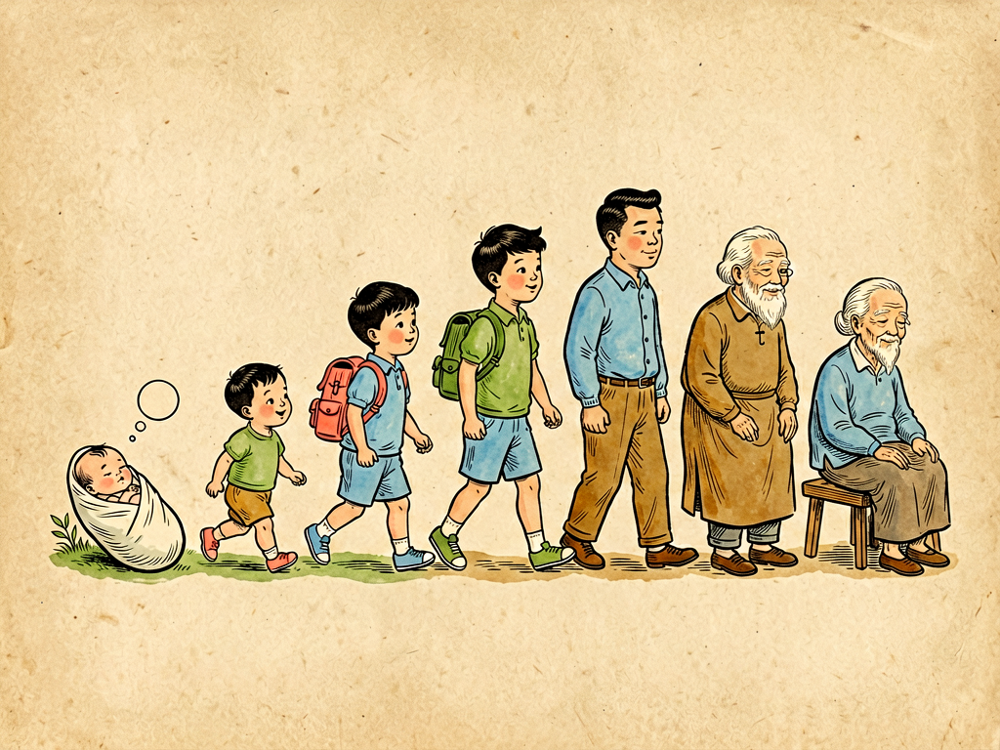

## 第一章 人生七期

---

### 📍 本章导航
**核心主题**：人生是一条抛物线——不同年龄有不同的疾病谱和健康重点  
**你将发现**：
- 莎士比亚说人生有七个阶段，细菌在每个阶段"等待"的机会也不一样
- 为什么婴儿和老人最脆弱，死亡率呈"U型曲线"
- "上半场所种的因，就是下半场所结的果"——健康习惯要从年轻时打基础
- 为什么疫苗主要给孩子打，体检主要给老人做
- 青壮年是最容易被忽略的"沉默高危段"

**阅读建议**：这是第二部的开篇。读完你会明白：健康不是老了才需要关注的事，而是一辈子的功课。

---

### 🖋️ 经典原文

莎士比亚在《皆大欢喜》里说："全世界是一个舞台，所有的男男女女不过是一些演员；他们都有下场的时候，也都有上场的时候，一个人的一生中扮演着好几个角色。"他把人生分成七个时期：咿咿呀呀的婴儿，背着书包的学童，唉声叹气的恋人，争强好胜的军人，发号施令的法官，步履蹒跚的老者，最后是第二次孩提时代的终场。

莎翁说的是人生的戏剧，我却从中看出了卫生学的道理——**病菌看人下菜碟，不同年龄的人，面对的疾病风险完全不同。** 人的一生就像一条抛物线：两头脆弱，中间强壮；上半场建设，下半场保养。顺着这条生命曲线去看健康，才能明白为什么有的病专找孩子，有的病专找老人，而有些病，明明是自己"作"出来的。

让我们从头说起。

**第一期：婴儿期——襁褓里的幼苗。**
婴儿刚离开母体的那一刻，是人生最脆弱的瞬间。原本在37℃的羊水里恒温待了十个月，突然接触到外面的冷空气，肺叶第一次张开，发出第一声啼哭——从这一刻起，他就从母亲的"无菌保护"里，一下子掉进了微生物的海洋。
新生儿的免疫系统还没发育成熟，自己产生抗体的能力要到6个月后才慢慢建立。头几个月，他全靠母亲通过胎盘传给他的抗体，还有初乳里的sIgA在保护——就像母亲把自己的免疫力"借"给他用。这时候的婴儿，薄得能看见血管的皮肤、还没发育完善的血脑屏障、娇嫩的肠道黏膜，对几乎所有病原体都敞开着大门。
在疫苗普及之前，婴儿死亡率高得惊人——10个孩子里有2-3个活不到1岁，死于天花、白喉、百日咳、破伤风、麻疹、腹泻、肺炎。现在有了疫苗、有了抗生素、有了现代助产技术，婴儿死亡率大大下降，但我们还是要记住：婴儿期是人生第一个"脆弱窗口"，需要最精心的保护——母乳喂养、按时接种疫苗、清洁但不要过度消毒的环境，就是给这棵幼苗最好的阳光雨露。

**第二期：学童期——走进集体生活的小书生。**
6个月以后，母亲给的抗体慢慢用完了，孩子自己的免疫系统还在"实习"阶段，偏偏这时候孩子开始走出家门，走进幼儿园、小学校，和几十个同龄人挤在一间教室里，一起玩玩具、一起吃饭、甚至一起流鼻涕。
学校是儿童成长的地方，也是传染病最好的"温床"——一个孩子得了麻疹，全班都可能被传染；一个孩子得了红眼病，很快整个学校都会流行；流感、水痘、腮腺炎、手足口病，轮状病毒引起的秋季腹泻，都是这个年龄段的"常客"。
但别害怕——这些传染病看起来可怕，其实也是免疫系统的"军事演习"。每得一次病、每打一次疫苗，免疫系统就多认识一种病原体，就多一份抵抗力。只要按时接种疫苗、注意手卫生、生病时在家休息不传染别人，大多数孩子都能平安度过这个时期。这个时期的核心关键词是"**建立免疫**"。

**第三期：青春期——多事之秋的少年骑士。**
青春期来了，身体像被按了"加速键"——第二性征出现，个子猛长，声带变粗，肌肉变结实，心理也开始叛逆，开始在意异性，开始觉得自己无所不能。
这个年龄段免疫力其实很强，急性传染病少了，但新的问题来了：痤疮（青春痘）、近视、肥胖、营养不良（因为爱美节食）、意外伤害（车祸、运动损伤）、心理问题（抑郁、焦虑），还有因为好奇和冒险尝试带来的风险——抽烟、喝酒、熬夜、不安全性行为。
很多人觉得年轻就是资本，可以随便造，但实际上，**动脉硬化从20岁就已经开始了**——你在十几岁二十岁时抽的每一支烟、吃的每一顿垃圾食品、熬的每一个夜，都在给未来的高血压、糖尿病、心脏病埋下种子。

**第四期：壮年期——身强力壮的"将军"，也是压力最大的"顶梁柱"。**
25岁到45岁，是人生的黄金期，也是压力最大的时期——你是社会的中坚，是单位的骨干，是家庭的顶梁柱，上有老下有小，中间有工作。你觉得自己身体好，扛得住，于是熬夜加班、喝酒应酬、饮食不规律、从来不运动，有点小毛病扛一扛就过去了，从不体检。
但很多问题就是在这个时期慢慢积累的：长期压力大导致高血压，高油高糖饮食导致高血脂、高血糖，抽烟喝酒伤肝伤肺，久坐导致腰椎颈椎问题——这些慢性损伤像温水煮青蛙，你感觉不到，等你感觉到的时候，往往已经是器质性病变了。
还有一个容易被忽略的问题：这个年龄段也是**肺结核、肝炎、消化道溃疡**甚至某些癌症开始冒头的时期。别觉得年轻就不会得癌症，很多癌症就是在长期慢性损伤的基础上慢慢发展出来的。35岁以后，一定要开始定期体检。

**第五期：更年期——从"将军"到"法官"的过渡阶段。**
女性大约在45-55岁，男性大约在55-65岁，会经历一个特殊的阶段——更年期。
这时候身体的激素水平发生剧烈变化：女性雌激素水平下降，月经停止，会出现潮热、出汗、失眠、情绪波动、骨量快速流失；男性雄激素水平缓慢下降，也会出现体力下降、情绪低落、性功能减退等问题。
更年期不是病，是身体从青壮年走向老年的"重新洗牌"。这个阶段如果调理得好，能为老年健康打下好基础；如果不注意，骨质疏松、心血管病、糖尿病都会在这个时期"找上门来"。很多人觉得更年期是"自然现象"不用管，但实际上，必要的时候在医生指导下进行激素替代治疗，调整生活方式，能大大提高后半生的生活质量。

**第六期：老年期——多病共存的"老者"。**
过了65岁，就进入老年期了。这时候身体就像用了几十年的旧机器，各个零件都开始出问题——血管硬化了，骨头变脆了，肌肉萎缩了，代谢变慢了，免疫力也下降了。
老年人最大的特点不是"得某一种病"，而是"**多病共存**"——一个老人可能同时有高血压、糖尿病、冠心病、骨质疏松、前列腺增生、白内障，好几种病一起得，吃好几种药，药物之间还可能互相作用。
老年人最危险的不是"大病"，而是"小病拖成大病"：一个普通感冒，年轻人几天就好了，老人可能拖成肺炎；摔一跤，年轻人爬起来就没事，老人可能骨折、卧床，然后引发肺炎、血栓，最后危及生命；便秘对年轻人来说是小事，老人用力排便可能诱发心肌梗死、脑溢血。
对老人来说，预防跌倒、接种流感疫苗和肺炎疫苗、定期体检、合理用药、保持适当运动和社交，比吃什么"长寿保健品"都有用。

**第七期：临终期——人生的终场。**
最后是人生的最后阶段，身体机能慢慢衰退，记忆模糊，身形缩小，像一个圆画完了，回到起点。这是每个人都要走的路，我们能做的，是让这个阶段少一些痛苦，多一些尊严。

你们看，这七个阶段，每个阶段有每个阶段的特点，每个阶段有每个阶段的风险，也有每个阶段该做的事。
- 婴儿期重点是**保护**——母乳、疫苗、安全的环境；
- 儿童期重点是**建立**——建立免疫、建立好习惯、建立健康的生活方式；
- 青春期重点是**引导**——引导正确的价值观，引导远离危险行为，引导心理健康；
- 壮年期重点是**保养**——别透支身体，别等出问题才想起健康；
- 更年期重点是**调整**——适应身体变化，平稳过渡；
- 老年期重点是**维护**——预防小病，管理慢性病，提高生活质量；
- 临终期重点是**尊严**——少痛苦，有质量地走完最后一程。

我还要特别强调一点：**健康不是老了才需要关心的事。** 你们常说"今天不养生，明天养医生"，这话一点没错。很多老年病的根，其实在青壮年甚至青少年时期就埋下了——动脉硬化从20岁开始，骨质疏松的预防要从30岁前开始存"骨量"，年轻时晒的太阳、吃的钙、做的运动，都是老了以后的"健康存款"。
上半场所种的因，就是下半场所结的果。你前半生怎么对待身体，后半生身体就怎么对待你。

人生这出戏，没有彩排，不能重来。细菌在台下看着，疾病在台下等着——你在每个阶段做好那个阶段该做的事，就是对自己最好的负责。

---

> 📜 **科学史话：疫苗——人类对抗传染病最伟大的武器**
>
> 在高士其写这本书的1930年代，婴儿死亡率超过20%，天花、白喉、百日咳、麻疹、脊髓灰质炎（小儿麻痹症）都是儿童的"夺命杀手"。而今天，这些疾病在大多数国家已经被消灭或得到控制，婴儿死亡率降到了1%以下——这一切最大的功臣，就是疫苗。
>
> 人类历史上第一支疫苗是1796年詹纳发明的牛痘疫苗，用来预防天花。但真正让疫苗大规模普及的是20世纪：
> - 1920年代，白喉疫苗、破伤风疫苗问世；
> - 1950年代，索尔克和萨宾发明了脊髓灰质炎疫苗，让小儿麻痹症在全球几乎绝迹；
> - 1960年代，麻疹疫苗、腮腺炎疫苗、风疹疫苗问世；
> - 后来又有了乙肝疫苗、水痘疫苗、HPV疫苗、肺炎疫苗、流感疫苗……
>
> 疫苗的原理很简单：把灭活或者减毒的病原体（或者病原体的一部分）打进人体，让免疫系统"先认识一下"这个敌人，产生抗体和记忆细胞——等真的病原体来了，免疫系统就能快速反应，把它消灭在萌芽状态。
>
> 疫苗是人类历史上性价比最高的公共卫生措施——花几块钱打一支疫苗，就能避免一辈子甚至死亡的风险。正是因为疫苗，人类的平均寿命在20世纪提高了30多岁，从不到40岁提高到70多岁。
>
> 遗憾的是，现在还有很多人怀疑疫苗、拒绝疫苗——各种反疫苗谣言在网上流传，说疫苗会导致自闭症、有副作用、是"阴谋"等等。但无数科学研究已经证明：疫苗是安全有效的，疫苗的副作用远远小于疾病本身的风险。拒绝疫苗，不仅是把自己的孩子置于危险中，也会破坏整个群体的"群体免疫屏障"，让那些因为年龄太小或疾病原因不能打疫苗的人暴露在风险中。
>
> 接种疫苗，既是保护自己，也是保护他人——这是现代公民的基本责任。

---

> 🔬 **科学更新：菌群的"年龄时钟"——你的肠道菌群几岁了？**
>
> 最近十几年的研究发现：不仅你的身体有年龄，你的肠道菌群也有"年龄"，而且肠道菌群的年龄和你的健康、衰老密切相关。
>
> 婴儿刚出生时肠道几乎无菌，出生后菌群开始定植：顺产的宝宝最先定植的是母亲产道的乳酸杆菌，剖腹产的宝宝更多是皮肤表面的葡萄球菌、链球菌；母乳喂养的宝宝以双歧杆菌为主，配方奶喂养的宝宝菌群更多样。到3岁左右，孩子的肠道菌群才接近成人的样子。
>
> 成年后，健康人的肠道菌群保持稳定，但多样性会随着年龄慢慢变化：
> - 青壮年时期，菌群多样性最高，有益菌占优势，产短链脂肪酸的菌多，和宿主"和平共处"；
> - 到了老年，菌群多样性下降，双歧杆菌等有益菌减少，促炎的变形菌增多，这种"老化菌群"会导致慢性炎症、免疫力下降、代谢紊乱，和很多老年病有关。
>
> 更神奇的是：**把老年小鼠的肠道菌移植到年轻无菌小鼠体内，年轻小鼠会出现炎症、认知下降等"衰老症状"；反过来，把年轻小鼠的菌移植给老年小鼠，老年小鼠的免疫力、认知能力甚至寿命都有所改善**——这就是"菌群移植抗衰老"研究的起点。
>
> 当然，这还在动物实验阶段，离临床应用还很远，但这告诉我们一个重要的道理：想健康长寿，就要从年轻时开始善待你的肠道菌群——多吃膳食纤维，少吃高糖高脂，别滥用抗生素，规律作息。你年轻时养出一个"年轻"的菌群，老了它会报答你。

---

> 🌍 **现实连接：不同年龄段的疫苗和体检建议**
>
> 很多人不知道，疫苗不只是"小孩的专利"，不同年龄段都有该打的疫苗：
>
> | 年龄段 | 建议接种的疫苗 |
> |--------|----------------|
> | 0-6岁 | 乙肝、卡介苗、脊灰、百白破、麻疹、腮腺炎、风疹、水痘、肺炎、轮状病毒、HPV（女孩9岁后）等——按照国家免疫规划程序接种 |
> | 7-17岁 | 补种漏种的疫苗，流感疫苗每年打，HPV疫苗尽早打 |
> | 18-49岁 | 流感疫苗每年打，每10年打一次白破加强针，备孕前打麻风腮、水痘，乙肝没抗体的补打乙肝疫苗 |
> | 50-64岁 | 流感每年打，带状疱疹疫苗（50岁以上就建议打，尤其是得过水痘的人），肺炎球菌疫苗 |
> | 65岁以上 | 流感每年打，肺炎球菌疫苗，带状疱疹疫苗，根据情况打百白破、破伤风加强 |
>
> 体检也不是"老年人才需要"：
> - 20-39岁：每年一次常规体检，包括血压、血糖、血脂、肝功能、血常规、尿常规；女性开始做宫颈筛查、乳腺检查；
> - 40-50岁：增加胃肠镜筛查（胃肠癌）、低剂量螺旋CT（肺癌，尤其是吸烟者）、骨密度检查；男性开始查前列腺；
> - 50岁以上：每年体检，重点关注心血管、血糖、肿瘤标志物、视力听力、认知功能；预防跌倒。
>
> 记住：最好的医生是自己，最好的治疗是预防。按时打疫苗，定期体检，就是性价比最高的健康投资。

---

### 💬 读后思考与讨论

1. 莎士比亚把人生分成七个阶段，结合这一章的内容，你现在处在哪个阶段？这个阶段最重要的健康重点是什么？
2. "上半场所种的因，就是下半场所结的果"——你现在的哪些生活习惯，是在给未来"存健康"？哪些是在"透支"？
3. 很多人觉得"疫苗有副作用""是药三分毒"不愿意打疫苗，怎么看待这个问题？你和你的家人都按时接种疫苗了吗？
4. 青壮年是"最容易被忽略的高危段"——为什么身体最好的时候反而最需要注意健康？
5. 如果把人生比作一个"健康账户"，你觉得应该怎么"存钱"和"取钱"？

### 🔗 关联阅读
- 第一部第十章：《乳峰的回顾》→ 婴儿期菌群建立和母乳喂养
- 第二部第二章：《人身三流》→ 人体的三种体液与健康
- 第二部第十五章：《毒菌战争的问题》→ 人类与细菌的战争史
- 第三部第二十三章：《谈寿命》→ 衰老机制与健康长寿
