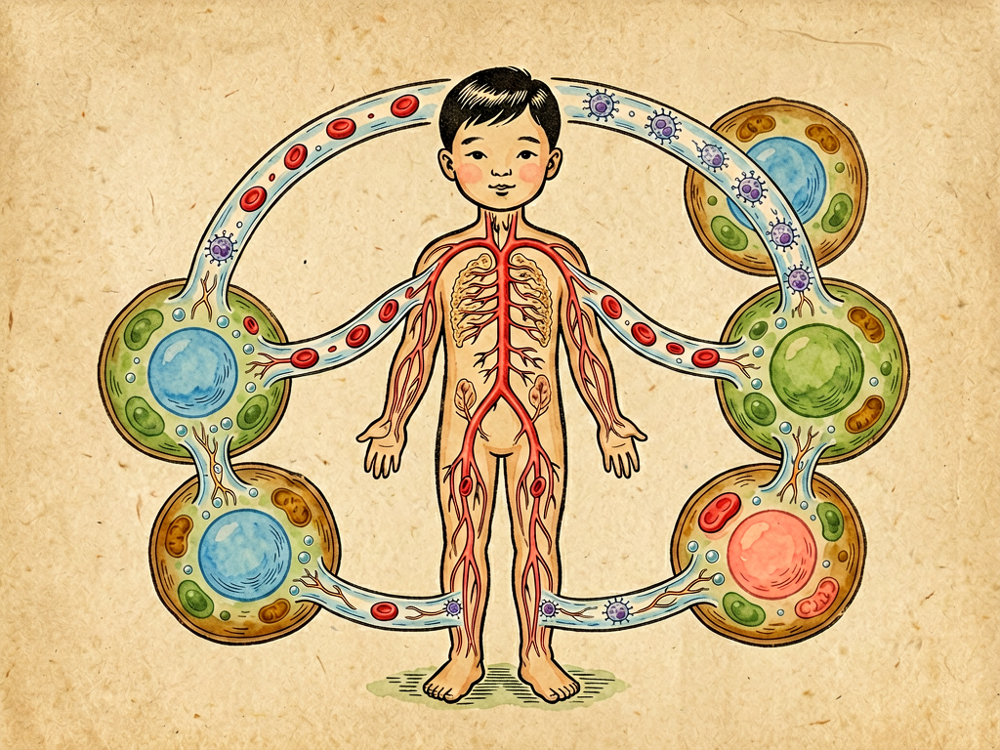

## 第二章 人身三流

---

### 📍 本章导航
**核心主题**：人体是一座"水城"——血液、淋巴、组织液三股流，既是生命的运输网，也是细菌的高速公路  
**你将发现**：
- 人体60%是水，大部分不是在细胞里，而是在日夜奔流
- 血液是"主流"，负责运输氧气营养和免疫细胞
- 淋巴是"暗流"和"国防前线"，淋巴结肿大就是在"报警"
- 组织液是"细胞泡澡的温泉"，是物质交换的中转站
- 三流是一条河的三段——从主流分出，进入支流，再回到主流
- 细菌"借水行舟"，通过这三股流走遍全身

**阅读建议**：理解了这三股水流，你就理解了炎症、感染、水肿、血液循环的本质。

---

### 🖋️ 经典原文

上一章我们讲了人生七期，讲了人一生的时间曲线。这一章我们换个视角，看看人体的空间结构——**人其实是一座水城。**

你可能觉得奇怪：我有骨头有肉，怎么会是"水城"？我给你算一笔账：一个70公斤的成年人，体内的水（体液）有42升，占体重的60%；婴儿的水更多，占体重的75%；就算是老年人，水也占体重的50%。也就是说，你身体里超过一半不是骨头、不是肌肉，而是水。

但这些水不是死水一潭，它们在你身体里日夜奔流，一刻不停。我们把它们分成三股流，叫"人身三流"。

**第一流：血液——红色的运输大动脉。**
血液是最显眼的一流。你划破皮肤，流出来的红色液体就是血液。但你别以为血液就是"红水"，它其实是一个热闹的王国：55%是淡黄色的血浆，90%以上是水，剩下的溶解着蛋白质、葡萄糖、氨基酸、脂肪、激素、盐、抗体、各种营养物质和废物；剩下45%是血细胞，又分三种：
- **红细胞**：像一个个双凹圆盘状的"红色小船"，专门负责运输氧气——每一个红细胞里有2.8亿个血红蛋白分子，每个血红蛋白能携带4个氧分子。你全身有25万亿个红细胞，首尾相连能绕地球三圈；
- **白细胞**：是这支红色舰队里的"白色卫兵"，它们不像红细胞那样老老实实随波逐流——它们能变形，能钻出血管壁，能在组织液里游走，见到细菌就扑上去吞掉，或者释放抗体把敌人干掉。正常情况下每微升血里只有4000-10000个白细胞，但有细菌感染的时候，这个数字会迅速升高到几万甚至十几万——这就是为什么医生让你"查个血"，看白细胞数量就知道有没有感染；
- **血小板**：是最小的细胞碎片，像一个个"补漏匠"——血管破了，它们第一时间冲上去，聚集在一起形成血栓，堵住伤口，再释放凝血因子让血液凝固，把缺口封死。没有血小板，你一个小伤口就会流血不止而死。

血液从心脏出发，经动脉流到全身每一个角落，在毛细血管把氧气和营养卸下来，装上二氧化碳和废物，再经静脉流回心脏，去肺里加氧、去肾脏排毒——心脏每跳一次泵出70毫升血，每天泵出7吨血，相当于一辆大卡车的载重量，一年就是2500多吨，一辈子要泵2亿多吨血，够装满3个西湖。血液就是身体的"大运河"，什么都靠它运——营养、氧气、激素、免疫细胞、抗体，甚至细菌一旦进入血液，也会搭上这趟快车，走遍全身。

**第二流：淋巴——透明的防御长城。**
如果说血液是"明流"，人人都看得见，那淋巴就是"暗流"，大多数人都不了解它。
淋巴系统像一张遍布全身的网，和血管并行，但它是单向的——它没有心脏那样的"泵"，淋巴液流动得很慢，靠肌肉收缩和呼吸推动。淋巴管里流的是淋巴液，淡黄色透明的液体，它来自哪里呢？
血液流到毛细血管的时候，因为压力，一部分血浆会从血管壁渗出去，进入细胞之间的空隙，这就变成了组织液——这是第三流。组织液滋养完细胞，90%会回到静脉血管里，剩下10%就钻进毛细淋巴管，变成淋巴液。
淋巴液不是白流的：
- 它会回收从血管里漏出来的蛋白质——这些蛋白质分子太大，没法直接回到血管，必须靠淋巴管把它们运回血液。如果淋巴管堵了，蛋白质回不去，组织液渗透压升高，水就会积在组织里，这就是水肿——你崴了脚脚踝肿得像馒头，就是淋巴回流受阻了；
- 小肠吸收的脂肪，也是先进入淋巴管（叫乳糜管），再汇入血液的——所以你吃的猪油牛油，不是直接进血管，而是先走淋巴这条路；
- 最重要的是，**淋巴是身体的国防前线**。全身有500-700个淋巴结，像一个个堡垒，集中在脖子、下巴、腋下、腹股沟这些地方——每个淋巴结里都驻扎着大量淋巴细胞（B细胞和T细胞）和巨噬细胞，细菌、病毒、癌细胞顺着淋巴液流过的时候，就会被淋巴结挡住、抓住、消灭。
你小时候感冒发烧，妈妈会摸你的下巴："呀，淋巴结肿了！"——这不是坏事，这是淋巴结这个堡垒在和细菌激战，淋巴细胞大量增殖，所以淋巴结肿大、压痛，这是免疫系统在"发信号"告诉你：我在打仗呢！等炎症消了，淋巴结又会缩回去。但如果淋巴结肿大不痛、还很硬、推不动，那就要小心了——可能是癌细胞转移到淋巴结了。
除了淋巴结，淋巴系统还包括脾脏（人体最大的淋巴器官，是血液的"过滤器"，也是免疫细胞的兵营）、胸腺（T细胞成熟的地方）、扁桃体（呼吸道和消化道门口的"哨兵"），还有阑尾——以前人们以为阑尾是没用的退化器官，现在发现它是肠道有益菌的"避难所"，也是肠道免疫的重要组成部分。
很多细菌和病毒特别喜欢走淋巴这条路——结核杆菌就会沿着淋巴扩散，引起淋巴结结核（瘰疬）；HIV病毒专门攻击T细胞，破坏整个淋巴免疫系统，最后病人不是死于HIV本身，而是死于各种感染和癌症。

**第三流：组织液——细胞之间的"湿地"。**
第三流是组织液，它填满了细胞之间的空隙，你的每一个细胞，都浸在组织液里，像一颗颗葡萄泡在水里。
组织液是细胞的"直接生活环境"——氧气、葡萄糖、氨基酸、维生素从毛细血管渗出来，进入组织液，细胞再从组织液里"吃"这些营养；细胞代谢产生的二氧化碳、尿素、废物，先排到组织液里，再渗回血液，由血液运走。可以说，**组织液是细胞和血液之间的"中转站"**。
你手指被针扎了，伤口周围会起小水泡，渗出来的淡黄色液体就是组织液——里面有白细胞、抗体、凝血因子，是身体派来的"急救包"；你伤口发炎了，红、肿、热、痛，那也是因为细菌进入了组织液，血管扩张，更多的白细胞和抗体从血管渗出来和细菌作战，组织液增多所以肿，血流加快所以红和热，毒素刺激神经所以痛。
组织液还是细菌最喜欢的藏身之地——细菌突破皮肤或黏膜进入人体，第一个到达的地方就是组织液。这里有丰富的营养，有适宜的温度，简直是细菌的"天堂"——它们在这里大量繁殖，产生毒素，然后要么顺着组织液扩散，要么钻进淋巴管或血管，传遍全身。蜂窝织炎，就是细菌在皮下组织液里扩散引起的弥漫性炎症。

你看，这三流不是三条互不相连的河——**它们是一条河的三段**：
血液从心脏泵出，到毛细血管时一部分渗出去变成组织液，组织液滋养完细胞，大部分回到血液，小部分变成淋巴液，淋巴液在淋巴管里慢慢流，经过淋巴结"过滤消毒"，最后在锁骨下方汇入静脉，又回到血液。
主流（血液）→ 支流（组织液）→ 回流（淋巴）→ 再回到主流，周而复始，循环不息。这就是你身体里的水循环，一刻都不能停。

对细菌来说，这三股流就是它们最好的"交通网"——它们自己不会跑，但它们能"借水行舟"：
- 进入血液，就是搭上了"高铁"，几个小时就能走遍全身，引起菌血症、败血症；
- 进入淋巴，就是走上了"省道"，虽然慢，但能躲避免疫系统的追杀，甚至在淋巴结里建立据点；
- 进入组织液，就是进入了"乡村小道"，虽然扩散慢，但能在局部建立根据地，引起炎症和脓肿。
人体的免疫系统当然也知道这一点——白细胞能在血管、淋巴、组织液之间自由穿梭，哪里有敌人就去哪里；抗体和补体顺着血流遍布全身；淋巴结像一个个关卡，卡住每一个通过的"坏人"——这是一场发生在"水城"里的战争，水既是战场，也是道路。

最后说句有意思的：你们中医讲"气血津液"，说"气为血之帅，血为气之母"，说"不通则痛"，说"活血化瘀""利水渗湿"——其实用现代医学的眼光看，这不就是在讲这三股流吗？血就是血液，津液就是组织液和淋巴，气就是推动这些液体流动的动力和能量。几千年前没有显微镜，古人通过观察和经验总结出了人体水循环的规律，和今天的科学发现暗合，这就是老祖宗的智慧。

记住一句话：**生命在于流动。** 血液流通、淋巴畅通、组织液流通，三流循环正常，你就健康；哪里堵了，哪里就会出问题。血管堵了是心梗脑梗，淋巴堵了是水肿，组织液堵了是慢性炎症。喝水给三流补充原料，运动给三流提供动力，规律作息让三流正常运转——这就是最朴素也最有效的养生。

---

> 📜 **科学史话：从"体液学说"到循环生理学——人类认识血液的漫长道路**
>
> 人类认识人身三流的道路走了几千年。
>
> 古希腊的希波克拉底提出"体液学说"，认为人体有四种体液：血液、黏液、黄胆汁、黑胆汁，四种体液平衡人就健康，不平衡就生病——这个学说统治了西方医学两千年，虽然不完全正确，但它最早认识到了"体液"和健康的关系。
>
> 古罗马的盖伦认为血液是肝脏造出来的，像潮汐一样一涨一落，在血管里来回流动，用完就被身体吸收了——这个错误的观点也统治了一千多年。
>
> 直到17世纪，英国医生哈维通过解剖和实验，第一次正确描述了血液循环：他计算出心脏每小时泵出的血液重量是人体重的三倍，这么多血不可能是肝脏造出来用完就没的，只能是在一个封闭的管道里循环流动。1628年他出版了《心血运动论》，标志着现代生理学的诞生。但哈维没看到毛细血管——他预测动脉和静脉之间一定有微小的管道连接，但他的显微镜不够好，没看到。
>
> 1661年，意大利人马尔比基用显微镜观察蛙肺，终于发现了毛细血管——哈维预测的"连接管道"终于被发现了，血液循环理论才彻底完善。
>
> 而淋巴系统的秘密，要到17世纪中后期才被发现——瑞典的鲁德贝克和丹麦的巴托林分别独立发现了淋巴管，证明淋巴是一个独立的循环系统。
>
> 从希波克拉底到哈维，人类花了两千多年才真正弄明白自己身体里这三股奔流的水流。科学的进步，从来不是一蹴而就的。

---

> 🔬 **科学更新：淋巴系统——不只是防御，还是大脑的"垃圾清理系统"**
>
> 很长一段时间里，科学家都认为大脑里没有淋巴管——因为大脑有"血脑屏障"，是个"免疫特区"，应该和淋巴系统没关系。
>
> 但2015年，弗吉尼亚大学的乔纳森·基普尼斯（Jonathan Kipnis）团队在《自然》杂志发表了一项震惊学界的发现：**大脑里也有淋巴管！** 这些淋巴管沿着静脉窦分布，直接连接到颈部的外周淋巴结，是大脑清除代谢废物的重要通道。
>
> 这还不是最惊人的。2012年，罗切斯特大学的内德·内德高（Maiken Nedergaard）团队发现了大脑里的"类淋巴系统"（glymphatic system，也叫胶状淋巴系统）——大脑里的星形胶质细胞有很多"脚"，贴在血管壁上，形成了一套管道系统。当你睡觉的时候，这些管道会扩张60%，脑脊液顺着这个管道流进脑组织，把大脑代谢产生的废物（包括导致阿尔茨海默病的β淀粉样蛋白）冲刷出去，带回血液和淋巴系统排出。
>
> 换句话说：**你睡觉的时候，大脑在"洗澡"**。这就是为什么睡不好觉第二天会头昏脑涨、记忆力下降——因为类淋巴系统没工作，大脑里的"垃圾"没排出去。长期睡眠不足，β淀粉样蛋白在大脑里堆积，就会增加老年痴呆的风险。
>
> 这个发现彻底改变了我们对睡眠的理解，也给治疗阿尔茨海默病、帕金森病这些神经退行性疾病提供了全新的方向。同时也再一次证明：我们对自己的身体，其实了解得还远远不够——哪怕是淋巴系统这个我们以为早就搞清楚的东西，还藏着这么大的秘密。

---

> 💡 **动手试一试：摸一摸你自己的"烽火台"**
>
> 你可以现在就摸一摸自己的淋巴结，感受一下这些"身体的烽火台"：
>
> 1. **颈部淋巴结**：低下头，把手指放在脖子两侧，从耳后开始沿着脖子往下摸，正常情况下你摸不到什么，但如果你最近感冒、嗓子疼、牙疼，你可能会摸到几个黄豆大小、可以活动、按压有点痛的小疙瘩——这就是肿大的淋巴结在"作战"；
> 2. **下颌下淋巴结**：把手指放在下巴下面，下颌骨内侧，你感冒的时候这里最容易肿；
> 3. **腋下淋巴结**：抬起胳膊，手指放在腋窝深处，正常情况下摸不到，如果这里有肿大的淋巴结要注意（尤其是女性，乳腺问题可能会引起腋下淋巴结肿大）；
> 4. **腹股沟淋巴结**：大腿根和肚子连接的地方，下肢有感染的时候这里会肿。
>
> **注意**：正常的淋巴结肿大是有痛的、可以活动、边界清楚、几天到一两周就会消；如果淋巴结肿大不痛、很硬、推不动、还持续长大超过一个月，一定要去医院检查——这可能是严重问题的信号。

---

### 💬 读后思考与讨论

1. 人体60%是水，三流循环不息——这个"水城"的比喻，让你对自己的身体有什么新的认识？
2. 为什么感冒的时候淋巴结会肿大？淋巴结肿大什么时候是好事，什么时候需要警惕？
3. "睡觉的时候大脑在洗澡"——这个发现对你的睡眠习惯有什么启发？你每天能睡够7-8小时吗？
4. "生命在于流动"——结合生活实际，说说怎么才能让我们身体的三股流保持畅通？
5. 中医的"气血津液"理论和现代医学的"人身三流"暗合，这能给我们什么启发？怎么看待传统医学和现代医学的关系？

### 🔗 关联阅读
- 第一部第九章：《吃血的经验》→ 细菌进入血液引发的菌血症和败血症
- 第二部第三章：《色——谈色盲》→ 从血液延伸到视觉感官
- 第二部第七章：《触——清洁的标准》→ 皮肤防御和清洁卫生
- 第三部第十八章：《睡眠的力量》→ 睡眠与大脑类淋巴系统
