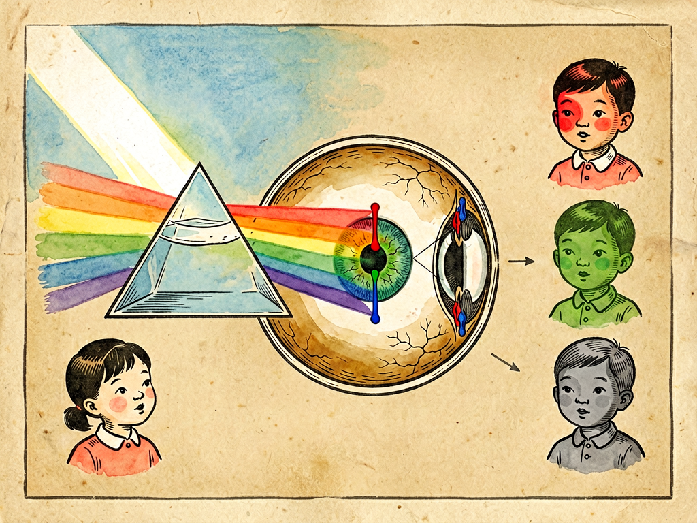

## 第三章 色——谈色盲

---

### 📍 本章导航
**核心主题**：颜色是光、眼、脑的合奏——色盲不是缺陷，是人类多样性的一部分  
**你将发现**：
- 颜色不是物体"本身有颜色"，而是它反射的光被眼睛和大脑"翻译"出来的
- 人眼有三种视锥细胞，分别感受红、绿、蓝——所有颜色都是这三种细胞按不同比例被刺激的结果
- 红绿色盲男性发病率约8%——每12个男人里就有1个，比你想象的常见得多
- 色盲是X染色体隐性遗传，所以男性远多于女性
- 色盲不是病，只是"看见世界的方式不一样"——社会设计应该考虑到这种差异
- 道尔顿既是色盲的第一个研究者，也是色盲患者本人

**阅读建议**：这一章会改变你对"颜色"的理解——你以为的"客观颜色"，其实是你眼睛和大脑的"主观建构"。

---

### 🖋️ 经典原文

讲完了身体里流动的"三流"，从这一章开始，我们来讲人体和外界接触的五个窗口——眼、耳、鼻、舌、身，也就是色、声、香、味、触五感。第一个，就是眼睛看到的**"色"**。

很多人以为颜色是物体本身固有的——苹果是红的，树叶是绿的，天是蓝的，这是天经地义。但其实不是这样。牛顿早就用三棱镜证明了：白光是由红、橙、黄、绿、青、蓝、紫七种不同波长的光混合而成的。一个物体"是红色"，不是它本身"有"红色，而是它吸收了其他波长的光，把红光反射到了你眼睛里；如果它把所有光都反射了，它就是白色；如果把所有光都吸收了，它就是黑色。

所以说，**颜色是光、物体、眼睛、大脑四者合作的产物**——光先照到物体上，物体反射特定波长的光，光进入眼睛刺激视网膜，视网膜把光信号变成电信号传给大脑，大脑最后"翻译"成你看到的颜色。这四个环节任何一个出问题，你看到的颜色就和别人不一样。

眼睛里的视网膜，就像照相机的底片，但比照相机精密多了。视网膜上有两种感光细胞：
- 一种叫**视杆细胞**，有1.2亿个，对弱光特别敏感，但分不出颜色——这就是为什么你晚上看东西都是灰色的，因为光线暗的时候只有视杆细胞工作；
- 另一种叫**视锥细胞**，只有600万个，对强光敏感，能分辨颜色——这是我们能看见彩色世界的关键。

视锥细胞又分三种，分别对三种波长的光最敏感：
- L锥：对长波（红光）最敏感；
- M锥：对中波（绿光）最敏感；
- S锥：对短波（蓝光）最敏感。

不管什么颜色的光进来，都会按不同比例刺激这三种视锥细胞——比如黄光会同时刺激L锥和M锥，大脑就"翻译"成黄色；青光同时刺激M锥和S锥，大脑就"翻译"成青色；三种锥细胞同时被同等程度刺激，大脑就看到白色。红、绿、蓝三种颜色按不同比例混合，能调出你能看到的所有颜色——这就是"三原色学说"，也是电视、手机屏幕能显示彩色的原理。

但是，如果这三种视锥细胞有一种或几种出了问题，**色盲**就来了。

很多人对色盲有误解，以为色盲就是"看什么都是黑白的"——那种叫**全色盲**，三种视锥细胞都没有，非常罕见，几十万人里才有一个。绝大多数色盲是**红绿色盲**：
- **红色盲（protanopia）**：L锥缺失或功能异常，对红光不敏感，分不清红色和深绿色、紫红色和蓝色；
- **绿色盲（deuteranopia）**：M锥缺失或功能异常，最常见，分不清绿色和深红色、紫色和蓝色；
- 还有**蓝黄色盲**，S锥异常，比较少见；
- 比色盲轻一点的叫**色弱**——三种视锥细胞都在，但某一种功能偏弱，颜色辨别能力差一点，光线暗的时候更明显。

红绿色盲有多常见？说出来你可能吃惊：**男性发病率大约是8%，女性大约是0.5%**——也就是说，每12个中国男性里，就有1个是红绿色盲；你的同学、同事、朋友里，很可能就有色盲，只是你不知道而已。

为什么色盲"重男轻女"？因为控制红绿色觉的基因在X染色体上，是隐性遗传。男性只有一条X染色体，只要这条X上的基因有问题，就会表现出色盲；女性有两条X染色体，必须两条都有问题才会色盲——这种概率就很低了，但她们会成为"携带者"，把色盲基因传给儿子。所以色盲一般是外公通过女儿传给外孙——外公是色盲，妈妈是携带者但自己不色盲，然后儿子有50%概率是色盲。这就是遗传的神奇之处。

第一个发现色盲的人，自己就是色盲——他就是英国著名化学家**约翰·道尔顿**（就是提出原子论的那个道尔顿）。1794年，道尔顿给妈妈买了一双"灰色"的袜子当圣诞礼物，妈妈收到后很惊讶："我这么大年纪了，怎么穿这么鲜艳的樱桃红色袜子？"道尔顿这才发现，自己看到的"灰色"，在别人眼里是红色。他没有放过这个小事，仔细研究了自己和家族成员的色觉，写出了世界上第一篇关于色盲的论文《论色盲》。后人为了纪念他，色盲又被叫做"道尔顿症"。

现在体检时查色盲，用的是**石原氏色盲检测图**——一本小册子，每一页都是各种颜色的小圆点，正常色觉的人能看出圆点组成的数字或图案，色盲的人因为分不出红绿，就看不出来，或者看到别的数字。很多人高考、考驾照体检时都翻过这本小册子。

色盲对生活有什么影响？最直接的影响是**职业选择**：
- 红绿色盲不能准确识别红绿灯，以前不能考驾照（现在有位置辅助和色盲眼镜，很多国家已经放开了）；
- 军人、警察、飞行员、司机这些需要识别信号的职业会受限；
- 医生、病理科医生要看病理切片的颜色，皮肤科要看皮疹颜色，化学实验要看试剂颜色变化，这些对色盲来说都有挑战；
- 画家、设计师、摄影师这类和颜色打交道的职业，虽然也有色盲艺术家拍出了很棒的作品，但总体还是会受限制。

但我必须说清楚：**色盲不是病，不是缺陷，更不是耻辱**。它只是人类色觉多样性的一种——就像有人高有人矮，有人左撇子有人右撇子一样，只是看世界的方式有点不一样而已。鸟类能看到紫外线，狗是红绿色盲但嗅觉比我们灵敏一万倍，螳螂虾有16种视锥细胞（人类只有3种）能看到我们根本想象不到的颜色——没有谁的色觉是"标准"的，我们都只是进化出了适合自己生存的色觉而已。

而且色盲也不是完全没有"优势"——二战时盟军发现，红绿色盲的士兵更容易看穿敌人的迷彩伪装，因为他们对亮度和纹理更敏感，不会被颜色干扰。现在研究也发现，色盲者在某些纹理识别、轮廓识别任务上表现更好。

现代社会也越来越"色盲友好"：
- 红绿灯不再只靠颜色区分——红灯在上绿灯在下（横排的话红灯在左绿灯在右），用位置和形状辅助；
- 地图、图表不用纯红绿对比，而是加上不同图案、纹理、文字标签；
- 网页和APP设计避免只用红色表示"错误"、绿色表示"正确"，而是加上图标；
- 现在还有色盲矫正眼镜（EnChroma），通过特殊的滤光片把红绿光的波长分开，能让很多红绿色盲第一次分清红色和绿色——很多人第一次戴上这种眼镜，第一次看到真正的红色和绿色，都会激动得哭出来，因为他们活了几十年，从来没见过这个世界这么鲜艳。

在基因治疗时代，未来色盲甚至可能被"治愈"——2020年就有研究用基因疗法让全色盲的儿童恢复了部分色觉。但即使有一天技术能"修正"色盲，我们也应该记住：**这个世界本就该容纳不同的"看见方式"。** 你看到的红和我看到的红，也许本来就不完全一样，但没关系——重要的是我们都能看见这个世界的美，不管它是什么颜色。

五感的故事，从"色"开始。下一章，我们讲"声"。

---

> 📜 **科学史话：从三原色到色盲基因——人类认识色觉的200年**
>
> 人类对色觉的认识，走了一段很长的路：
>
> 1666年，牛顿用三棱镜把白光分解成七色光谱，证明白光是混合光，第一次从物理学上解释了颜色的本质；
>
> 1802年，托马斯·杨（就是双缝干涉实验的那个杨）提出：人眼不可能对每种颜色都有一种感受器，应该只有三种——对红、绿、蓝敏感，这就是三原色学说的雏形。后来赫尔姆霍兹完善了这个理论，被称为"杨-赫尔姆霍兹学说"；
>
> 1794年，道尔顿发表《论色盲》，第一个科学描述了色盲现象；
>
> 1875年，瑞士科学家霍尔姆格伦发现了色盲的遗传规律，意识到这是一种伴性遗传；
>
> 1916年，日本的石原忍教授发明了石原氏色盲检测图，直到今天还在全世界使用；
>
> 1980年代，分子生物学家终于找到了红绿色盲的基因——编码红敏视蛋白的OPN1LW和编码绿敏视蛋白的OPN1MW基因，都位于X染色体长臂上，而且这两个基因高度相似，很容易在减数分裂时发生重组错误，这就是红绿色盲这么常见的原因；
>
> 2009年，科学家用基因疗法成功让一只天生红绿色盲的松鼠猴恢复了全色觉——这只猴子叫"道尔顿"，以纪念第一个发现色盲的科学家。这是人类第一次成功治愈成年哺乳动物的色盲；
>
> 2020年代，基因疗法开始进入临床试验，未来色盲者可能真的能通过一次注射就看到完整的彩色世界。
>
> 从道尔顿买错袜子，到今天的基因治疗，200多年过去了——科学进步的速度，比我们想象的更快。

---

> 🔬 **科学更新：我们看到的颜色，真的是"真实"的吗？**
>
> 过去十几年，神经科学对色觉的研究有了很多颠覆认知的发现：
>
> 第一，**颜色不是"在那里"的，而是大脑"建构"出来的**。你看到的物体颜色，很大程度上受周围环境颜色、光照、甚至你的经验和预期影响——著名的"蓝黑白金裙子"之争就是最好的例子：同一张裙子照片，有人坚定地认为是蓝黑，有人坚定地认为是白金，谁也说服不了谁。这不是谁"看错了"，而是不同人的大脑对光照的"校正"方式不一样。
>
> 第二，**人眼看到的颜色，和实际进入眼睛的光并不一致**。大脑会自动"白平衡"——不管在阳光下还是灯光下，你都觉得白纸是白色的，但实际上阳光是偏黄的，灯光是偏蓝的，进入眼睛的光波长完全不一样。大脑会根据环境自动校正颜色，让你保持对物体颜色的"恒常性"。
>
> 第三，**联觉**——有些人会"听到颜色""尝到形状"，比如听到某个声音就会看到红色，摸到某个东西就会尝到甜味。这不是幻觉，是他们大脑不同感觉区之间有额外的连接，是一种真实的神经现象。估计每2000人里就有1个联觉者，很多艺术家、音乐家都是联觉者。
>
> 第四，**四色视者**——绝大多数人有三种视锥细胞，但极少数女性（估计约12%的女性是携带者，真正的四色视者不到1%）因为两条X染色体上的视蛋白基因有差异，会有四种功能正常的视锥细胞，她们能看到1亿种颜色——普通人只能看到100万种。她们眼中的世界，比我们丰富得多，我们永远无法想象她们看到的是什么颜色。
>
> 这些发现告诉我们：没有什么"绝对客观"的颜色。每个人眼中的世界，都是自己大脑建构出来的——从这个意义上说，我们每个人都是"色盲"，只是程度不同而已。

---

> 💡 **动手试一试：在线测试你的色觉，看看你是不是"隐藏的色盲"**
>
> 你可以现在就做个小测试，了解一下自己的色觉：
>
> 1. **经典石原氏测试**：搜索"Ishihara test online"，就能找到在线版的石原色盲检测图，24张图，几分钟就能做完，看看你能看出多少个数字；
>
> 2. **颜色排列测试**：搜索"Farnsworth-Munsell 100 hue test online"，这个测试会给你一堆不同色调的色块，让你按顺序排列，能更精确地测试你的色觉辨别能力——正常色觉的人也可能排列得不是完美，说明你的色觉也有"偏差"；
>
> 3. **体验色盲的世界**：搜索"color blindness simulator"，上传一张照片或者直接在网页上，就能模拟红绿色盲、蓝黄色盲、全色盲看到的世界是什么样子——你会发现，红绿色盲眼中的世界并不是没有颜色，只是红和绿变成了不同深浅的黄褐色。
>
> 如果你测出来有色弱或者色盲，也不用难过——这只是你的眼睛和别人有点不一样而已，完全不影响你正常生活。如果你有孩子，记得在他小时候就做色觉检查，了解他的色觉特点，未来职业选择时可以提前规划，避免走弯路。

---

### 💬 读后思考与讨论

1. 以前你以为"颜色是物体本身的属性"，读完这一章，你对"颜色"的理解有什么改变？
2. 每12个男性中就有1个红绿色盲——你身边有没有这样的人？他们在生活中遇到过什么困难？我们可以怎么帮助他们？
3. "蓝黑白金裙子"为什么会有两种完全不同的看法？这个现象说明了什么？
4. 四色视者能看到1亿种颜色，而我们只能看到100万种——如果技术能让你"升级"成四色视者，你愿意吗？为什么？
5. 有人说"色盲是缺陷，应该用基因编辑修正"；有人说"色盲是多样性的一部分，应该尊重和包容"——你怎么看？

### 🔗 关联阅读
- 第二部第二章：《人身三流》→ 神经信号如何通过血液和神经传递
- 第二部第四章：《声——爆竹声中话耳鼓》→ 五感之听觉
- 第三部第二十五章：《基因的故事》→ 伴性遗传与基因多样性
- 跨章节思考：人类感官的局限性——我们看不见紫外线红外线，听不见次声波超声波，闻不到很多气味，这对我们认识世界有什么影响？
