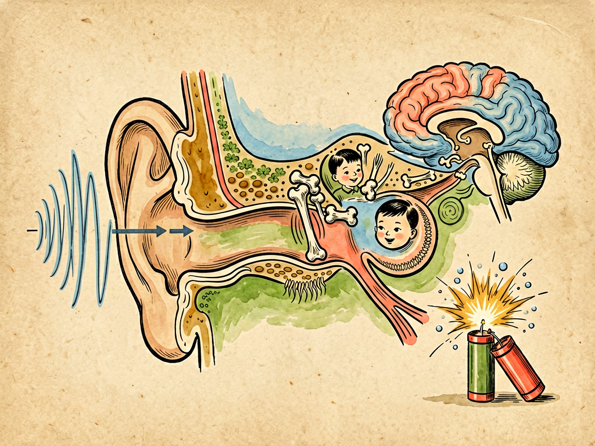

## 第四章 声——爆竹声中话耳鼓

---

### 📍 本章导航
**核心主题**：声音是振动在空气中的传播——耳朵让我们听见世界，但它非常脆弱，需要我们保护  
**你将发现**：
- 声音本质是空气的振动——看不见摸不着，但能量真实存在
- 耳朵的精密结构：外耳收集→中耳放大→内耳转化成神经信号，七棒接力
- 鼓膜只有0.1毫米厚，是身体最薄的组织之一；耳蜗里的毛细胞死一个少一个，不能再生
- 超过85分贝长期暴露就会损伤听力，爆竹声可达120-150分贝，瞬间致聋
- 噪声是"看不见的污染"，不仅伤耳朵，还伤心血管、睡眠、认知能力
- "60-60原则"：戴耳机音量不超过60%，连续听不超过60分钟

**阅读建议**：读完这一章，你可能会主动把耳机音量调小——这不是坏事。

---

### 🖋️ 经典原文

中国有句老话："爆竹声中一岁除，春风送暖入屠苏。"每到春节，噼里啪啦的爆竹声此起彼伏，是中国人最熟悉的"年味儿"。但你有没有想过：**爆竹声是怎么进到你耳朵里的？你又是怎么"听见"它的？为什么近距离的爆竹声会让你耳鸣，甚至听不见？**

今天我们就从爆竹声说起，聊聊"声"和你的"耳鼓"。

声音本质上不是什么神秘的东西，它就是**振动**。爆竹点燃，火药剧烈燃烧，瞬间产生高温高压气体，急剧膨胀，推动周围空气一疏一密地波动，就像你往水里扔一块石头激起的水波一样——这就是声波。声波在空气中以每秒340米的速度传播，撞到你的耳朵，你就听见了声音。

声音有三个基本特点：
- **音调**：就是声音的高低，由声波每秒振动的次数（频率）决定，单位是赫兹（Hz）。振动越快音调越高，振动越慢音调越低。人耳能听到20Hz到20000Hz之间的声音，低于20Hz叫次声波（大象能听见），高于20000Hz叫超声波（蝙蝠、海豚能听见）；
- **响度**：就是声音的大小，由声波振动的幅度决定，单位是分贝（dB）。分贝是对数单位——每增加10分贝，响度就是原来的10倍。0分贝是人耳刚能听见的最小声音，正常说话50-60分贝，地铁里80-90分贝，电锯100分贝，近距离爆竹声120-150分贝，喷气式飞机起飞140分贝；
- **音色**：就是"这是什么声音"，由声波里包含的不同频率成分决定——同样一个音，钢琴和小提琴弹出来不一样，熟人说话你闭着眼也能听出来，靠的就是音色。

声音传过来，你的耳朵要经过一场"七棒接力赛"才能让你"听见"：
**第一棒是外耳**——包括你能看见的耳廓和外耳道。耳廓像个卫星接收器，收集四面八方的声波，通过外耳道往里送；
**第二棒是鼓膜，也就是我们说的"耳鼓"**——这是一层只有0.1毫米厚的薄膜，比一张纸还薄，把外耳和中耳隔开。声波撞过来，鼓膜就跟着一起振动，就像鼓槌敲在鼓面上一样——声音大，它振动幅度就大；声音尖（频率高），它振动就快；
**第三、四、五棒是中耳里的三块听小骨**——锤骨、砧骨、镫骨，名字很形象，形状也真的像锤子、铁砧、马镫。这三块是人体最小的骨头，加起来还不到50毫克，但它们是一套精密的杠杆系统，能把鼓膜的振动放大约22倍，再传递给内耳——因为内耳里充满了淋巴液，声音在空气里的振动直接传到液体里会衰减99.9%，必须靠听小骨放大才能传进去；
**第六棒是耳蜗**——这是内耳里一个蜗牛壳一样的螺旋管道，里面充满淋巴液，管壁上排列着15000个毛细胞（3500个内毛细胞+12000个外毛细胞）。听小骨把振动传过来，淋巴液波动，毛细胞就像水流里的海草一样摇摆——这一摇摆，就把机械振动转化成了神经电信号。而且特别精妙的是，耳蜗不同位置的毛细胞负责不同频率：蜗顶的毛细胞负责低频，蜗底的负责高频——就像钢琴的琴键，从左到右音越来越高；
**第七棒是听神经和大脑**——毛细胞产生的电信号通过听神经传到大脑颞叶的听觉皮层，大脑一分析，你就知道："哦，这是爆竹声。"

这七棒接力，从声波进入耳朵到你"听见"，整个过程只需要0.05秒——快到你根本感觉不到，但每一个环节都精密得不可思议。但这套精密系统也非常脆弱：
- 鼓膜太薄了，近距离的爆炸、掌击耳朵、用力擤鼻涕，都可能把它击穿穿孔；
- **最脆弱的是耳蜗里的毛细胞**——毛细胞是不可再生的！死一个少一个，死了就再也长不回来了。长时间大音量刺激、突然的爆震声、耳毒性药物，都会杀死毛细胞。毛细胞从高频开始死——所以很多人听力下降都是先听不清高频声音，比如女人和孩子说话、门铃声、鸟叫，慢慢才影响低频；
- 120分贝是人的"疼痛阈值"——到了这个响度，你耳朵会疼。近距离的爆竹声、枪响、演唱会前排，都能达到甚至超过这个强度，瞬间就可能把毛细胞震死，造成**爆震性耳聋**。轻度的可能只是暂时耳鸣，几个小时后恢复；重度的就会永久失聪。每年春节都有因为放爆竹被震聋的人，其中不少是孩子。

很多人觉得"不就是响一点吗？习惯了就好"——这是完全错误的。噪声对人的伤害是累积性的，而且是不可逆的：
- 85分贝是安全线——长期在85分贝以上环境里（比如电锯、工地、嘈杂的工厂），如果不戴防护，每天8小时，几年后就会出现永久性听力下降；
- 90分贝：超过2小时就可能损伤；
- 100分贝：超过15分钟就危险；
- 120分贝以上：瞬间就可能致聋。

而且噪声伤害的不只是耳朵：
- 长期噪声会让血压升高、心率加快，增加高血压、冠心病、心梗的风险；
- 噪声会让人紧张、焦虑、易怒、失眠，长期下来会导致抑郁；
- 噪声影响注意力——住在马路边、机场附近的孩子，学习成绩平均比安静地区的孩子差，认知发育也受影响；
- 孕妇长期暴露在噪声中，可能导致早产、新生儿体重偏低。

噪声是"看不见的污染"——它不像污水黑烟那样看得见摸得着，散了就没了，但它对健康的伤害是实实在在的，所以被称为"城市新四害"之一。

在所有噪声伤害里，最容易被忽略也最普遍的，是**耳机造成的听力损伤**。现在很多人走路、坐车、上班、睡觉都戴着耳机听音乐、刷视频，而且喜欢把音量开得很大——在地铁里，环境噪声有80-90分贝，为了盖过噪声，很多人把耳机音量开到100分贝以上。这样听一两个小时，就可能对毛细胞造成不可逆的损伤。现在很多年轻人二十多岁就出现了以前老年人才有的听力下降，罪魁祸首就是耳机。

国际上有一个保护听力的"**60-60原则**"，一定要记住：
- 戴耳机听东西，音量不要超过设备最大音量的60%；
- 连续听的时间不要超过60分钟，到时间就摘下来让耳朵休息一会儿；
- 最好用头戴式耳机，少用入耳式——入耳式耳机离鼓膜近，同样音量对耳朵的伤害更大；
- 在嘈杂环境里（地铁、公交、大街上）尽量不要用耳机——因为你会不自觉把音量开得很大，最好用降噪耳机。

除了耳机，还有很多日常习惯会伤耳朵：
- 不要随便掏耳朵——耳屎（耵聍）是耳朵的"保护罩"，能粘住灰尘、小飞虫，抑制细菌生长，它会自己慢慢排出来，不用掏。经常掏耳朵会划伤耳道，甚至戳破鼓膜；
- 擤鼻涕不要两个鼻孔一起擤——要按住一个鼻孔擤另一个，不然压力会把鼻涕压进中耳，引起中耳炎；
- 坐飞机起降时嚼口香糖、吞咽，能让咽鼓管打开，平衡中耳内外压力，避免压得耳朵疼；
- 长期在噪声环境工作（工地、工厂、机场、KTV）一定要戴耳塞或者耳罩，这不是娇气，是保护你后半辈子能听见声音。

最后我们再说说爆竹。爆竹声声辞旧岁，是中国人的传统习俗，这个我理解。但传统习俗也应该随着文明进步而升级——现在很多城市已经禁放或者限放烟花爆竹，除了污染空气、容易引起火灾，保护大家的听力也是重要原因。喜庆不一定非要用震耳欲聋的爆炸声，电子鞭炮、灯光秀、烟花表演，同样能营造节日气氛，还安全环保不伤耳朵。

我见过很多老炮兵，年轻时候天天在阵地听炮声，到老了全聋了——听不到孙子叫爷爷，听不到鸟叫，听不到音乐，只能看口型和人交流，那种孤独和痛苦，没有经历过的人很难想象。

记住：**你耳朵里那15000个毛细胞，是陪你一辈子的，坏了就没地方换。** 你现在嫌声音不够大、不够"过瘾"，等你听不见了，就再也找不回来了。听见鸟鸣、听见风声、听见爱人说话、听见孩子笑——这些你觉得理所当然的"小事"，其实是人生最珍贵的礼物。

保护耳朵，从把耳机音量调小两格开始。

---

> 📜 **科学史话：声音的速度和听觉的秘密——从伽利略到贝克西**
>
> 人类对声音和听觉的认识，也是一段漫长的历史：
>
> 古希腊的亚里士多德认为声音是空气的运动，这个方向是对的，但他不知道声音是波；
>
> 17世纪，伽利略发现了音调和振动频率的关系——他用不同重量的砝码敲玻璃杯，发现振动越快音调越高；
>
> 1660年，波义耳证明了声音传播需要介质——他把闹钟放在抽成真空的玻璃罩里，外面就听不见声音了；
>
> 17世纪，有人第一次测量了声音的速度——大约340米/秒，和今天的测量值非常接近；
>
> 1857年，意大利解剖学家科尔蒂发现了耳蜗里的柯蒂氏器——也就是毛细胞所在的结构，但当时没人知道它是怎么工作的；
>
> 1860年代，赫尔姆霍兹提出了"共振假说"——认为耳蜗里不同长度的纤毛像钢琴弦一样，对不同频率共振，这个理论主导了听觉研究近百年；
>
> 1928年，匈牙利物理学家贝克西（Georg von Békésy）做了一个划时代的实验——他从刚去世的人身上取下耳蜗，打开后在显微镜下观察，发现声波传来时，基底膜（毛细胞就长在上面）会像波浪一样振动，而且不同频率的声音会在基底膜不同位置产生最大振幅——低频在蜗顶，高频在蜗底，这就是著名的"行波理论"。贝克西因此获得了1961年的诺贝尔生理学或医学奖。
>
> 今天我们对听觉的理解，仍然建立在贝克西的行波理论基础上。而毛细胞不可再生这个事实，直到20世纪后期才被彻底证实——这也让保护听力变得更加重要。

---

> 🔬 **科学更新：人工耳蜗——让聋人重新听见世界**
>
> 如果毛细胞完全坏死了，人就全聋了，传统助听器没用——因为助听器只是放大声音，没有毛细胞，再大的声音也转化不成神经信号。但1950年代以来发展起来的**人工耳蜗**，绕过了坏死的毛细胞，直接用电极刺激听神经，让全聋的人重新听见声音。
>
> 人工耳蜗不是"高级助听器"，它是一个真正的"电子耳"：
> - 体外部分包括麦克风、言语处理器和发射线圈，挂在耳朵上；
> - 体内部分是植入手术放在头皮下的接收器和电极阵列——电极阵列要插进耳蜗里，直接挨着听神经；
> - 麦克风收集声音，言语处理器把声音转换成不同频率的电信号，通过发射线圈无线传给体内的接收器，再由电极阵列直接刺激听神经，大脑就"听见"了。
>
> 现在全球已经有超过60万人植入了人工耳蜗。很多先天耳聋的孩子，在1-3岁语言发育关键期之前植入人工耳蜗，经过语言训练，能学会说话、正常上学、正常工作，几乎和听力正常的人没有区别。
>
> 更前沿的研究还在继续：
> - **光遗传学人工耳蜗**——不用电刺激，用光刺激听神经，分辨率更高，能听到更丰富的声音和音乐；
> - **毛细胞再生**——科学家正在研究用干细胞、基因疗法让坏死的毛细胞重新长出来，如果成功，未来神经性耳聋可能被彻底治愈；
> - **脑机接口听觉**——直接在听觉皮层植入电极，绕过听神经，让听神经也坏死的人重新听见。
>
> 这些技术给聋人带来了希望，但最好的"治疗"还是预防——保护好你自己的毛细胞，比任何人工器官都好。

---

> 🌍 **现实连接：测一测你的听力年龄，看看你的耳朵"几岁"了**
>
> 听力和年龄有关——正常情况下，人从30岁左右开始，听力就会慢慢下降，每年下降一点点，首先丧失的是高频听力。但长期戴耳机、经常去嘈杂场所的人，高频听力下降会快得多——你可能才20多岁，但耳朵已经"40岁"了。
>
> 你可以自己做个简单测试：
>
> 1. **高频听力测试**：搜索"mosquito ringtone test"或者"听力年龄测试"，在线测试能听到多高频率的声音：
>    - 能听到18000Hz：20岁以下的听力
>    - 能听到17000Hz：20-29岁
>    - 能听到16000Hz：30-39岁
>    - 能听到15000Hz：40-49岁
>    - 能听到12000Hz以下：50岁以上
>    （注意：测试时音量不要开太大，用耳机或者音箱都行，在安静环境下测）
>
> 2. **日常自查**：如果出现以下情况，说明你的听力可能已经有损伤了，要及时去医院耳鼻喉科检查：
>    - 别人说话总觉得听不清，经常需要别人重复；
>    - 打电话总觉得对方声音小；
>    - 看电视听音乐需要的音量比别人大；
>    - 在嘈杂环境（比如餐厅）里听别人说话特别费劲；
>    - 经常耳鸣——耳朵里有嗡嗡声、蝉鸣声，尤其是晚上安静的时候；
>    - 听不见门铃声、鸟叫、女声（这些都是高频）。
>
> 听力损失和很多疾病一样，早发现早干预效果最好——轻度听力损失戴助听器就能解决，拖到重度甚至全聋，再治就难了。别觉得"戴助听器显得老"——现在的助听器做得很小，塞在耳道里根本看不见，能让你正常交流，比听不见强一万倍。

---

### 💬 读后思考与讨论

1. 你平时戴耳机吗？音量一般开多大？一天戴多久？读完这一章，你会调整用耳机的习惯吗？
2. "60-60原则"是什么？你觉得这个原则容易做到吗？
3. 你怎么看待春节禁放烟花爆竹这件事？传统习俗和公众健康应该怎么平衡？
4. 毛细胞不可再生——这个事实让你有什么感触？我们身体里还有哪些"用坏了就换不了"的东西？
5. 人工耳蜗能让聋人重新听见，但也有人认为"聋不是缺陷，只是一种文化身份"，反对人工耳蜗植入——你怎么看这个问题？

### 🔗 关联阅读
- 第二部第三章：《色——谈色盲》→ 五感之视觉
- 第二部第五章：《香——谈气味》→ 五感之嗅觉
- 第三部第二十一章：《噪声的危害》→ 更深入讨论噪声污染
- 跨章节思考：五感是我们认识世界的窗口——如果失去其中一种，你的生活会变成什么样？我们应该怎么对待有感官障碍的人？
